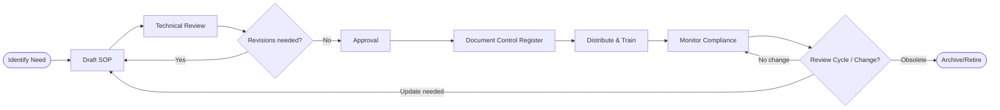

# OP02 — SOP (Standard Operating Procedures)

> **Domain:** Operations
> **Trạng thái:** Hoàn thành
> **Level:** Intermediate
> **Prerequisites:** OP01 (Business Process Management)

---

## 1. Learning Objectives

Sau khi hoàn thành module này, học viên có thể:

- Phân biệt SOP với Policy, Procedure, Guideline và Work Instruction
- Lựa chọn và viết đúng loại SOP: Step-by-step, Hierarchical, Flowchart
- Áp dụng SOP writing methodology chuẩn theo ISO 9001:2015
- Thiết lập hệ thống document control: version management, review cycle, approval workflow
- Xây dựng cấu trúc Quality Manual và SOP governance framework
- Triển khai ISO certification tại doanh nghiệp Việt Nam
- Đánh giá và cải tiến hệ thống tài liệu quy trình của doanh nghiệp

---

## 2. Business Context

SOP (Standard Operating Procedures) là xương sống của hệ thống quản lý chất lượng và vận hành doanh nghiệp. Một doanh nghiệp không có SOP giống như một đội bóng không có chiến thuật — mỗi người chơi theo cách riêng, kết quả không nhất quán và phụ thuộc vào cá nhân.

**Tầm quan trọng của SOP:**

1. **Nhất quán chất lượng:** Dù ai thực hiện, kết quả phải như nhau
2. **Onboarding nhanh:** Nhân viên mới học việc qua tài liệu thay vì hỏi đồng nghiệp
3. **Knowledge retention:** Khi nhân viên nghỉ, kiến thức không "ra đi cùng họ"
4. **Compliance:** ISO, GMP, HACCP đều yêu cầu documented procedures
5. **Continuous improvement:** Không thể cải tiến cái không được đo lường và tài liệu hóa

**Xu hướng 2024–2026:**
- Digital SOP: SOP multimedia với video, screenshots, annotations
- SOP integrated with workflow systems (không phải PDF tĩnh)
- AI-assisted SOP writing: LLM tự động draft SOP từ process description
- SOP analytics: track việc đọc và tuân thủ SOP qua hệ thống

---

## 3. Definitions

| Thuật ngữ | Định nghĩa |
|-----------|------------|
| **SOP** | Standard Operating Procedure — tài liệu mô tả từng bước thực hiện một quy trình cụ thể để đảm bảo kết quả nhất quán |
| **Policy** | Chính sách — tuyên bố nguyên tắc và định hướng của tổ chức (cái GÌ và TẠI SAO) |
| **Procedure** | Thủ tục — mô tả trình tự các bước để thực hiện (LÀM NHƯ THẾ NÀO) |
| **Work Instruction** | Hướng dẫn công việc — chi tiết kỹ thuật cho một tác vụ cụ thể, thường kèm hình ảnh/video |
| **Guideline** | Hướng dẫn — khuyến nghị không bắt buộc, cho phép linh hoạt trong thực hiện |
| **Document Control** | Hệ thống quản lý tài liệu: version, review, approval, distribution, archiving |
| **Version Control** | Theo dõi lịch sử thay đổi của tài liệu (v1.0, v1.1, v2.0...) |
| **Process Owner** | Người chịu trách nhiệm sở hữu, maintain và cải tiến SOP của quy trình |
| **Quality Manual** | Tài liệu mô tả hệ thống quản lý chất lượng của tổ chức (QMS overview) |
| **Controlled Document** | Tài liệu được quản lý chặt chẽ về version, phân phối và hủy bỏ |

---

## 4. Core Concepts

### 4.1 Hierarchy Tài Liệu (Document Hierarchy)

```
Level 1: POLICY (Chính sách)
    "Công ty cam kết cung cấp sản phẩm đáp ứng yêu cầu khách hàng"
         ↓
Level 2: PROCEDURE (Thủ tục / SOP)
    "Quy trình kiểm soát chất lượng sản phẩm trước khi xuất kho"
         ↓
Level 3: WORK INSTRUCTION (Hướng dẫn công việc)
    "Cách sử dụng thiết bị đo lường XYZ để kiểm tra kích thước sản phẩm"
         ↓
Level 4: FORMS / RECORDS (Biểu mẫu / Hồ sơ)
    "Phiếu kiểm tra chất lượng QC-001"
```

### 4.2 Phân biệt Policy — Procedure — Guideline — Work Instruction

| Loại | Tính bắt buộc | Mức độ chi tiết | Ví dụ |
|------|:------------:|:---------------:|-------|
| **Policy** | Bắt buộc | Thấp (nguyên tắc) | "Công ty không chấp nhận tham nhũng" |
| **Procedure/SOP** | Bắt buộc | Trung bình (các bước chính) | "Quy trình phê duyệt hợp đồng" |
| **Work Instruction** | Bắt buộc | Cao (chi tiết kỹ thuật) | "Cách lắp ráp linh kiện A vào board B" |
| **Guideline** | Khuyến nghị | Trung bình (best practice) | "Khuyến nghị về thiết kế email marketing" |

### 4.3 Các loại SOP

**Loại 1 — Step-by-Step (Từng bước)**
- Format: danh sách có số thứ tự
- Phù hợp: quy trình tuần tự đơn giản, ít phân nhánh
- Ví dụ: SOP đặt lệnh mua hàng, SOP tạo báo cáo cuối tháng

**Loại 2 — Hierarchical (Phân cấp)**
- Format: numbered outline (1, 1.1, 1.1.1...)
- Phù hợp: quy trình phức tạp với nhiều sub-procedures
- Ví dụ: SOP quản lý kho, SOP vận hành nhà máy

**Loại 3 — Flowchart (Sơ đồ luồng)**
- Format: visual flowchart với decision points
- Phù hợp: quy trình có nhiều điều kiện phân nhánh
- Ví dụ: SOP xử lý khiếu nại khách hàng, SOP phê duyệt tín dụng

### 4.4 SOP Writing Methodology

**7 nguyên tắc viết SOP tốt:**
1. **Clear and concise**: Mỗi bước chỉ một hành động
2. **Actionable**: Dùng động từ chỉ hành động (Nhập, Kiểm tra, Gửi, Lưu)
3. **Specific**: Đủ chi tiết để ai cũng làm được, không mơ hồ
4. **Visual aids**: Thêm screenshot, hình ảnh, video nếu cần
5. **Validated**: Được test bởi người chưa biết quy trình
6. **Maintained**: Được cập nhật thường xuyên khi quy trình thay đổi
7. **Accessible**: Dễ tìm kiếm và truy cập khi cần

### 4.5 Document Control System

**5 yếu tố của Document Control:**

1. **Identification**: Mỗi tài liệu có mã duy nhất, tên, version
2. **Review & Approval**: Ai review, ai approve, chu kỳ review
3. **Distribution**: Ai nhận, phân phối qua kênh nào, đảm bảo dùng phiên bản mới nhất
4. **Change Management**: Quy trình thay đổi, ghi lại lý do, communication
5. **Obsolescence**: Hủy bỏ bản cũ, lưu trữ theo quy định

### 4.6 ISO 9001:2015 Requirements cho Documented Procedures

ISO 9001:2015 không yêu cầu số lượng SOP cụ thể nhưng yêu cầu:
- **Clause 7.5**: Documented information (tài liệu và hồ sơ)
- **Clause 8.1**: Operational planning and control
- Các quy trình phải được "documented to the extent necessary" để đảm bảo nhất quán

**Mandatory documented information theo ISO 9001:2015:**
- Scope of QMS (phạm vi hệ thống)
- Quality policy và objectives
- Competence records của nhân viên
- Monitoring and measurement results
- Nonconforming outputs và corrective actions
- Internal audit results
- Management review outputs

---

## 5. Business Value

| Loại giá trị | Mô tả | Ví dụ đo lường |
|-------------|-------|----------------|
| **Nhất quán chất lượng** | Giảm biến động trong kết quả | Defect rate giảm 40–60% |
| **Onboarding hiệu quả** | Nhân viên mới năng suất nhanh hơn | Onboarding time giảm 50% |
| **Risk reduction** | Giảm rủi ro lỗi do quên bước | Error incidents giảm 70% |
| **Knowledge management** | Kiến thức được lưu trữ, không phụ thuộc cá nhân | Knowledge retention 100% |
| **Compliance** | Vượt qua audit ISO, GMP, khách hàng | Audit findings giảm 80% |
| **Scalability** | Mở rộng chi nhánh nhanh chóng | Branch setup time giảm 60% |

---

## 6. Enterprise Role

- **Quality Manager / QA:** Chủ sở hữu hệ thống tài liệu QMS, audit compliance
- **Process Owner:** Viết và maintain SOP cho quy trình mình sở hữu
- **Operations Manager:** Đảm bảo SOP được tuân thủ trong vận hành hàng ngày
- **HR:** SOP onboarding, training, disciplinary procedures
- **Compliance/Legal:** SOP cho các quy trình có yêu cầu pháp lý
- **IT:** SOP cho IT operations, change management, incident response
- **Training Department:** Tích hợp SOP vào curriculum đào tạo

---

## 7. Departments Related

- **Quality / Chất lượng:** Primary owner của SOP framework và document control
- **Operations / Vận hành:** Major SOP consumer và contributor
- **HR / Nhân sự:** SOP cho tất cả HR processes
- **Finance / Tài chính:** SOP cho P2P, O2C, financial reporting
- **IT:** SOP cho IT ops, security, change management
- **Procurement / Mua hàng:** SOP cho sourcing, vendor management, purchasing
- **Customer Service:** SOP cho complaint handling, returns, escalation

---

## 8. Input

- Process maps từ BPM exercise (OP01 output)
- Phỏng vấn và observation với process performers
- Existing documentation (nếu có): nội quy, email instructions, unwritten rules
- Legal và regulatory requirements (luật, thông tư, tiêu chuẩn ngành)
- Customer requirements (nếu khách hàng yêu cầu SOP cụ thể)
- Industry best practices và benchmark
- Audit findings và nonconformance reports
- Incident/accident reports (để viết SOP prevention)

---

## 9. Output

- SOP documents (step-by-step, hierarchical, flowchart)
- Work Instructions (chi tiết kỹ thuật)
- Quality Manual (nếu có ISO certification)
- Document Control Register (danh mục tất cả controlled documents)
- Forms và Records templates
- SOP Training Materials
- Document Management System (DMS) setup
- SOP Review Schedule

---

## 10. Business Process (SOP Development Lifecycle)

```
Identify Need → Draft → Review → Approve → Distribute → Train → Monitor → Review/Update
```

**Bước 1 — Identify Need**
- Trigger: new process, process change, incident, audit finding, ISO requirement
- Quyết định loại tài liệu cần thiết (SOP, WI, Guideline)
- Assign author và reviewer

**Bước 2 — Draft**
- Author thu thập thông tin, phỏng vấn SMEs
- Viết draft SOP theo template chuẩn
- Thêm diagrams, screenshots, forms references

**Bước 3 — Review**
- Subject Matter Experts review về nội dung kỹ thuật
- Process Owner review về tính đúng đắn của quy trình
- Legal/Compliance review nếu có yêu cầu pháp lý

**Bước 4 — Approve**
- Approval theo matrix đã định (thường: Process Owner + Department Head)
- Sign-off và đặt effective date

**Bước 5 — Distribute**
- Upload lên DMS (Document Management System)
- Notify affected personnel
- Archive/destroy previous version

**Bước 6 — Train**
- Conduct training session với affected staff
- Record training completion
- Acknowledge form cho nhân viên

**Bước 7 — Monitor**
- Track compliance thông qua observation và audit
- Nhận feedback từ users
- Track deviation và exceptions

**Bước 8 — Review/Update**
- Periodic review theo review cycle (thường 1–2 năm)
- Triggered review khi có change
- Retire/obsolete khi không còn applicable

---

## 11. Data Flow

```
Process Knowledge (người, tài liệu cũ)
    ↓
Information Gathering (phỏng vấn, observation)
    ↓
SOP Draft (Word/Google Doc)
    ↓
Review Cycle (comments, revisions)
    ↓
Approved SOP v1.0
    ↓
Document Control Register (đăng ký)
    ↓
DMS Upload (SharePoint, Google Drive, Confluence)
    ↓
Training & Acknowledgment Records
    ↓
Compliance Monitoring Data
    ↓
Review → Updated SOP v2.0
```

---

## 12. Money Flow

**Chi phí xây dựng SOP system:**
- Nhân lực viết SOP: 50,000–100,000 VND/SOP page (outsource) hoặc internal resource cost
- DMS software: Confluence ($5–10/user/tháng), SharePoint (included in M365), hoặc miễn phí (Google Drive)
- ISO Certification: 50–200 triệu VND cho SME (bao gồm consulting + audit fee)
- Annual ISO surveillance audit: 20–50 triệu VND/năm

**ROI:**
- Onboarding cost reduction: tiết kiệm 20–40 giờ/nhân viên mới × số lượng tuyển hàng năm
- Reduced error/rework cost: 10–15% labor savings
- Audit preparation time reduction: 50–70%
- Customer retention improvement do consistent quality

---

## 13. Document Flow

```
SOP Request Form → Author Assignment
    ↓
Draft SOP → Review Comments → Revised Draft
    ↓
Approval Form → Approved SOP
    ↓
Document Control Register Update
    ↓
Distribution Notice → Training Records
    ↓
Compliance Audit Reports
    ↓
Change Request Form → Updated SOP
```

---

## 14. Roles

| Role | Mô tả |
|------|-------|
| **Document Controller** | Quản lý document register, versioning, distribution, archiving |
| **SOP Author** | Viết draft SOP, thường là process performer hoặc SME |
| **Reviewer (Technical)** | Review về tính chính xác kỹ thuật |
| **Reviewer (Process Owner)** | Review về tính phù hợp với business process |
| **Approver** | Phê duyệt chính thức, thường là Department Head hoặc Quality Manager |
| **Trainee** | Nhân viên được đào tạo theo SOP |
| **Internal Auditor** | Kiểm tra compliance với SOP |

---

## 15. Responsibilities

- **Document Controller:** Maintain master list, version control, destroy obsolete copies, coordinate review cycle
- **SOP Author:** Research, draft, incorporate feedback, keep content current
- **Process Owner:** Final technical accuracy sign-off, trigger updates khi process thay đổi
- **Department Manager:** Ensure team compliance, resource for SOP writing
- **Quality Manager:** Govern SOP framework, ensure ISO compliance, report on QMS performance
- **All Staff:** Read, understand, và follow applicable SOPs; report issues/improvement suggestions

---

## 16. RACI

| Hoạt động | Quality Mgr | Process Owner | SOP Author | Dept. Manager | Doc. Controller |
|-----------|:-----------:|:-------------:|:----------:|:-------------:|:---------------:|
| Xác định SOP cần viết | A | R | I | C | I |
| Viết SOP draft | I | C | R | I | I |
| Technical review | C | R | I | C | I |
| Approval | C | A | I | R | I |
| Document registration | I | I | I | I | R |
| Distribution & training | C | C | I | R | A |
| Periodic review | A | R | C | I | I |
| Archive obsolete | I | I | I | I | R |

*R=Responsible, A=Accountable, C=Consulted, I=Informed*

---

## 17. Frameworks

### ISO 9001:2015 — Quality Management System
- **Clause 7.5**: Documented information — defines requirements for creation, update, control
- **Annex SL**: Common framework cho tất cả ISO management system standards
- **PDCA Cycle**: Plan-Do-Check-Act integrated vào QMS operations

### GMP (Good Manufacturing Practice)
- WHO GMP, EU GMP, FDA cGMP
- Yêu cầu strict SOPs cho pharmaceutical, food, medical device manufacturing
- Batch records, cleaning procedures, equipment qualification SOPs

### HACCP (Hazard Analysis Critical Control Points)
- Food safety standard — SOPs cho critical control points
- Monitoring procedures, corrective action procedures, verification procedures

### ISO/IEC 27001 — Information Security
- SOPs cho access control, incident response, change management, backup/recovery

---

## 18. International Standards

| Chuẩn | Nội dung liên quan đến SOP |
|-------|---------------------------|
| **ISO 9001:2015** | Clause 7.5 — documented information requirements |
| **ISO 14001:2015** | Environmental SOPs, monitoring procedures |
| **ISO 45001:2018** | H&S SOPs, emergency procedures |
| **ISO/IEC 27001:2022** | IT security SOPs, incident response |
| **WHO GMP** | Manufacturing SOPs for pharma |
| **FDA 21 CFR Part 11** | Electronic records và signatures |
| **IATF 16949** | Automotive quality SOPs |

---

## 19. Vietnam Context

**ISO Certification landscape tại Việt Nam:**
- Tính đến 2023, Việt Nam có khoảng 25,000+ doanh nghiệp được chứng nhận ISO 9001
- Tốc độ tăng trưởng: +15%/năm do yêu cầu từ đối tác nước ngoài và đấu thầu nhà nước
- Các ngành phổ biến: sản xuất, xây dựng, dịch vụ IT, thực phẩm

**Kiểm soát tài liệu tại VN:**
- Nghị định 30/2020/NĐ-CP: quy định về công tác văn thư, lưu trữ tài liệu hành chính
- Thông tư 04/2013/TT-BNV: hướng dẫn xây dựng quy chế công tác văn thư
- Doanh nghiệp VN thường dùng: SharePoint, Google Workspace, hoặc custom DMS tích hợp ERP

**Thách thức SOP tại Việt Nam:**
1. **Văn hóa miệng:** Quy trình truyền khẩu, ngại viết documentation
2. **SOP "để show":** Viết để đối phó audit, không áp dụng thực tế
3. **Language barrier:** Doanh nghiệp FDI cần SOP song ngữ Anh-Việt
4. **Maintenance neglect:** Viết một lần rồi bỏ quên, không cập nhật

**Best practice VN:**
- Kết hợp SOP text với video/hình ảnh minh họa — phù hợp với visual learners
- Viết SOP ngắn gọn, tránh quá dài (1–3 trang/SOP là tốt nhất)
- Quick Reference Card (1 trang A4) tóm tắt SOP để dán tại nơi làm việc

---

## 20. Legal Considerations

- **ISO certification requirement:** Nhiều tender nhà nước và FDI supplier yêu cầu ISO 9001 — SOPs là bắt buộc
- **Lưu trữ tài liệu:** Luật Kế toán 2015 yêu cầu lưu hồ sơ kế toán 10 năm; SOPs liên quan đến tài chính phải maintained accordingly
- **Lao động:** Nội quy lao động (bắt buộc đăng ký với Sở LĐTBXH nếu >10 nhân viên) là dạng policy document
- **Dược phẩm/thực phẩm/hóa chất:** Bắt buộc có SOPs theo GMP, HACCP; Bộ Y tế và Bộ NN-PTNT có yêu cầu cụ thể
- **Trách nhiệm sản phẩm:** Luật Bảo vệ người tiêu dùng 2010 — SOPs là bằng chứng về due diligence
- **GDPR/Nghị định 13/2023:** SOPs về xử lý dữ liệu cá nhân là yêu cầu bắt buộc

---

## 21. Common Mistakes

1. **Viết SOP quá dài và phức tạp:** SOP 20–30 trang không ai đọc. Mục tiêu: 1–5 trang/SOP

2. **Mô tả kết quả thay vì hành động:** "Đảm bảo chất lượng tốt" thay vì "Kiểm tra 5 thông số X theo danh sách checklist QC-001"

3. **Viết SOP cho người đã biết:** Không specify đủ chi tiết để người mới làm được

4. **Không có version control:** Nhiều phiên bản SOP lưu rải rác, nhân viên không biết dùng cái nào

5. **SOP không có owner:** Không ai chịu trách nhiệm cập nhật khi quy trình thay đổi

6. **Không validate với end users:** Viết xong không test với người thực sự dùng → nhiều bước missing hoặc sai

7. **Không có review cycle:** SOP lỗi thời trong khi quy trình đã thay đổi

8. **Viết để pass audit, không để dùng:** SOP không reflect thực tế → khi auditor cross-check sẽ phát hiện

9. **Quá nhiều SOPs:** 500 SOPs không ai quản lý nổi. Ưu tiên 20% quan trọng nhất

10. **Không integrate vào training:** SOP viết ra nhưng không dùng để train nhân viên mới

---

## 22. Best Practices

1. **Dùng template chuẩn:** Header với mã, version, effective date; body structure nhất quán
2. **One action per step:** "Mở file và nhập dữ liệu và lưu" phải tách thành 3 bước riêng
3. **Use active voice:** "Nhân viên kiểm tra..." không phải "Việc kiểm tra được thực hiện..."
4. **Add visual context:** Screenshots, flowcharts, reference images make SOPs 3x more usable
5. **Layered documents:** SOP chính + Work Instructions cho kỹ thuật chi tiết
6. **Test with new employees:** Nếu người mới không thể follow, SOP cần viết lại
7. **Maintain master list:** Document register với all SOPs, owners, review dates, status
8. **Integrate with onboarding:** SOPs là training material, không phải add-on
9. **Digital-first:** Store in searchable DMS, not email or shared drives with folders
10. **Review trigger beyond schedule:** Any process change → automatic SOP review trigger

---

## 23. KPIs

| KPI | Định nghĩa | Target |
|-----|-----------|--------|
| **SOP Coverage Rate** | % quy trình quan trọng đã có SOP | > 90% |
| **SOP Currency Rate** | % SOPs reviewed trong 12 tháng qua | > 95% |
| **SOP Compliance Rate** | % observations tuân thủ đúng SOP | > 90% |
| **Training Completion Rate** | % nhân viên hoàn thành SOP training | 100% |
| **Audit Finding Rate** | Số nonconformances/audit liên quan đến SOP | Giảm hàng năm |
| **SOP Review Timeliness** | % SOPs reviewed đúng schedule | > 95% |
| **Time to Find SOP** | Thời gian trung bình để tìm SOP cần thiết | < 2 phút |

---

## 24. Metrics

**Document Health Metrics:**
- Total SOPs: tổng số SOPs active
- Overdue reviews: số SOPs quá hạn review
- Orphaned SOPs: SOPs không có owner
- Average pages per SOP: đo độ phức tạp

**Usage Metrics (nếu có DMS analytics):**
- SOP view count per month
- Most/least viewed SOPs
- Search-to-find success rate

**Quality Metrics:**
- Internal audit nonconformances liên quan đến documented procedures
- Customer complaints liên quan đến process inconsistency
- Error/rework incidents có SOP root cause

---

## 25. Reports

| Báo cáo | Tần suất | Đối tượng |
|---------|---------|-----------|
| **Document Status Dashboard** | Hàng tháng | Quality Manager, Process Owners |
| **SOP Review Due Report** | Hàng tháng | Document Controller, Process Owners |
| **Training Compliance Report** | Hàng quý | HR, Department Managers |
| **Internal Audit Summary** | Sau mỗi audit | Quality Manager, Top Management |
| **ISO Surveillance Readiness** | Trước mỗi audit | Quality Manager, Relevant Department Heads |
| **Document System KPI Report** | Hàng quý | Top Management |

---

## 26. Templates

### Template 1: SOP Standard Header

```
╔═══════════════════════════════════════════════════════════════╗
║  TÊN CÔNG TY                    LOGO                          ║
╠══════════════════════════════════════════════════════════════╣
║  TÊN TÀI LIỆU: [Tên SOP]                                     ║
║  Mã tài liệu: [SOP-XXX-001]    Phiên bản: [v1.0]            ║
║  Ngày hiệu lực: [DD/MM/YYYY]   Ngày review tiếp: [DD/MM/YYYY]║
║  Phòng ban: [Tên phòng]        Process Owner: [Tên]          ║
╠══════════════════════════════════════════════════════════════╣
║  Người viết: [Tên]    Người review: [Tên]    Người duyệt: [Tên]
╚═══════════════════════════════════════════════════════════════╝
```

### Template 2: SOP Body Structure

```
1. MỤC ĐÍCH
   [Giải thích TẠI SAO SOP này tồn tại]

2. PHẠM VI ÁP DỤNG
   [Áp dụng cho AI, phòng ban nào, quy trình nào]

3. TÀI LIỆU THAM CHIẾU
   [Các tài liệu liên quan: policy, WI, forms]

4. ĐỊNH NGHĨA VÀ VIẾT TẮT
   [Giải thích thuật ngữ, viết tắt trong SOP]

5. TRÁCH NHIỆM
   [AI làm gì — role và responsibility]

6. QUY TRÌNH (PROCEDURE)
   6.1 Bước 1: [Tên bước]
       - Action 1.1: ...
       - Action 1.2: ...
   6.2 Bước 2: [Tên bước]
       ...

7. XỬ LÝ TÌNH HUỐNG ĐẶC BIỆT
   [Exception handling, escalation]

8. BIỂU MẪU VÀ HỒ SƠ LIÊN QUAN
   [Danh sách forms được dùng trong SOP]

9. LỊCH SỬ THAY ĐỔI
   | Version | Ngày | Thay đổi | Người thực hiện |
   |---------|------|----------|-----------------|
   | v1.0    | ...  | Phát hành lần đầu | ... |
```

---

## 27. Checklists

### Checklist: SOP Writing Quality Check
- [ ] Header đầy đủ: mã, tên, version, effective date, owner
- [ ] Mục đích được phát biểu rõ ràng (1–2 câu)
- [ ] Phạm vi áp dụng được xác định rõ
- [ ] Mỗi bước dùng động từ hành động (Nhập, Kiểm tra, Gửi...)
- [ ] Mỗi bước chỉ có một hành động
- [ ] Exception flows được cover
- [ ] Forms, templates, tools được reference
- [ ] Không có thuật ngữ mơ hồ ("kịp thời", "đúng cách", "phù hợp")
- [ ] Validated bởi người chưa biết quy trình
- [ ] Visual aids thêm ở những bước phức tạp
- [ ] Change log được điền

### Checklist: Document Control System Setup
- [ ] Document numbering convention đã được thiết lập
- [ ] Version numbering convention (major.minor: 1.0, 1.1, 2.0)
- [ ] Approval matrix đã được define (ai approve loại SOP nào)
- [ ] DMS đã được setup và accessible
- [ ] Retention period cho mỗi loại tài liệu đã được define
- [ ] Obsolete document disposal procedure đã có
- [ ] Training acknowledgment process đã có
- [ ] Review schedule đã setup và calendar reminders đã set

---

## 28. SOP

### SOP: Quy trình Viết và Phát hành SOP Mới

**Mục đích:** Đảm bảo tất cả SOPs được viết, review, phê duyệt và phát hành theo chuẩn  
**Phạm vi:** Áp dụng cho tất cả departments khi cần tạo SOP mới  
**Người thực hiện:** Process Owner, SOP Author, Document Controller

**Bước 1 — Xác định nhu cầu**
1. Trigger: new process, process change, audit finding, incident, ISO requirement
2. Process Owner submit SOP Request Form (form QMS-001)
3. Quality Manager assign SOP Author (thường là Process Owner hoặc process performer)
4. Đặt deadline: draft in 2 weeks

**Bước 2 — Thu thập thông tin**
1. Author phỏng vấn SMEs và process performers
2. Observe quy trình thực tế ít nhất 1 lần
3. Thu thập existing documents, forms, templates liên quan
4. Note all exception flows và edge cases

**Bước 3 — Viết draft**
1. Dùng SOP template chuẩn (Template 2 ở mục 26)
2. Điền đầy đủ header information
3. Viết procedure steps theo nguyên tắc (Section 4.4)
4. Thêm visual aids nếu cần
5. Self-review trước khi gửi

**Bước 4 — Review**
1. Author gửi draft cho Reviewer(s) — tối thiểu 1 technical reviewer
2. Reviewers có 5 business days để comment
3. Author incorporate feedback và gửi revised draft
4. Nếu có major changes: vòng review thứ 2

**Bước 5 — Phê duyệt**
1. Gửi final draft cho Approver (Process Owner / Department Head)
2. Approver sign approval form (form QMS-002)
3. Đặt effective date (thường 2 tuần sau approval để chuẩn bị training)

**Bước 6 — Đăng ký và Phân phối**
1. Document Controller gán document number, version v1.0
2. Upload lên DMS (SharePoint/Confluence)
3. Update Document Control Register
4. Send distribution notice đến affected staff
5. Archive draft versions

**Bước 7 — Đào tạo**
1. Process Owner / Department Manager tổ chức training session
2. Thu thập training acknowledgment forms (form QMS-003)
3. Lưu training records

---

## 29. Case Study

### Case Study: Xây dựng SOP System cho Nhà máy Thực phẩm Chuẩn bị ISO 22000

**Bối cảnh:** Nhà máy sản xuất nước sốt 300 công nhân, Bình Dương. Khách hàng lớn (Co.opmart, VinMart) yêu cầu nhà cung cấp phải có ISO 22000 (Food Safety).

**Thực trạng:**
- Không có SOP nào được document
- Quy trình truyền khẩu, thay đổi theo người dạy
- Sự cố an toàn thực phẩm: 2 lần/năm (sản phẩm bị trả về)
- Turnover cao (40%/năm) → mất kiến thức liên tục

**Quá trình triển khai (6 tháng):**

*Tháng 1–2: Assessment và Planning*
- Inventory 85 quy trình cần SOP
- Ưu tiên 20 Critical CCPs (Critical Control Points) trong HACCP
- Chọn Document Controller (1 FTE từ Quality dept)
- Setup SharePoint làm DMS

*Tháng 3–4: Writing Sprint*
- Team 5 người viết 85 SOPs, WIs và forms
- Mỗi SOP kèm photo minh họa (công nhân không đọc nhiều → visual)
- In Quick Reference Cards dán tại từng trạm sản xuất

*Tháng 5: Review và Approval*
- Internal review: QA Manager + Production Manager
- External review: ISO consultant
- Corrective actions cho 23 SOPs cần sửa

*Tháng 6: Training và Go-live*
- Training cho 300 công nhân theo nhóm 20 người
- Competency test sau training
- ISO 22000 audit: pass với 3 minor nonconformances

**Kết quả sau 1 năm:**
- Zero food safety incidents
- Customer return rate: từ 2.1% → 0.3%
- New employee time-to-productivity: từ 6 tuần → 2 tuần
- ISO 22000 maintained, mở thêm được thị trường Nhật Bản

---

## 30. Small Business Example

### SME: Tiệm nail 8 nhân viên — Chuẩn hóa dịch vụ

**Vấn đề:** Chủ tiệm muốn mở thêm chi nhánh nhưng lo dịch vụ không đồng đều.

**Giải pháp SOP đơn giản:**
1. Viết 5 SOPs cốt lõi:
   - SOP đón tiếp khách
   - SOP quy trình làm gel nails
   - SOP vệ sinh dụng cụ (critical cho hygiene)
   - SOP xử lý khiếu nại
   - SOP mở/đóng cửa hàng

2. Format: checklist in A4, ép plastic, dán tại vị trí làm việc

3. Onboarding mới: follow SOP, chủ/quản lý observe và correct

**Chi phí:** 2 ngày làm việc để viết + in + ép plastic  
**Kết quả:** Mở thêm chi nhánh thứ 2 sau 3 tháng, chất lượng đồng đều

---

## 31. Enterprise Example

### Enterprise: Tập đoàn bảo hiểm — SOP Digitalization

**Bối cảnh:** Công ty bảo hiểm top 5 VN, 3,000 nhân viên, 50 chi nhánh, 2,000 SOPs đang quản lý bằng Word files qua email.

**Vấn đề:**
- Nhân viên không biết phiên bản SOP mới nhất
- 40% SOPs lỗi thời (>2 năm chưa review)
- Tìm SOP mất 15–30 phút
- Audit chuẩn bị tốn 2 tuần

**Giải pháp:** Triển khai Document Management System tích hợp với Microsoft 365

**Kết quả sau 12 tháng:**
- 2,000 SOPs migrated vào SharePoint với metadata
- Tìm SOP < 30 giây (search function)
- 95% SOPs reviewed và up-to-date
- Audit preparation time: 2 tuần → 2 ngày
- Compliance rate tăng từ 72% lên 94%
- Cost saving: 2 FTE được reallocate từ doc management sang value-added work

---

## 32. ERP Mapping

| SOP/Document Control | SAP | Oracle | Odoo |
|---------------------|-----|--------|------|
| Document Management | SAP Document Management System (DMS) | Oracle Content Management | Odoo Documents |
| SOP in Workflow | SAP Quality Management (QM) | Oracle Quality | Quality module |
| Training Records | SAP SuccessFactors Learning | Oracle Learning Management | eLearning module |
| Audit Management | SAP Audit Management | Oracle Audit Vault | No native |
| Electronic Signature | SAP GRC | Oracle ERP Cloud | Third-party |
| Version Control | Built-in DMS | Oracle UCM | Git integration |

---

## 33. Automation

**Document Control Automation:**
- Auto-notification khi SOP đến hạn review
- Automated routing qua review → approval workflow
- Electronic signature (DocuSign, Adobe Sign tích hợp)
- Auto-archive obsolete versions

**Training Automation:**
- LMS tự động assign SOP training khi SOP mới được phát hành
- Automated reminder cho training completion
- Competency test automation

**Compliance Monitoring:**
- Digital checklists replace paper SOPs → auto capture compliance data
- IoT sensors + SOP: auto verify SOP steps được thực hiện (manufacturing)

---

## 34. AI Opportunities

| Cơ hội | Mô tả | Maturity |
|--------|-------|---------|
| **AI SOP Writer** | LLM tự động draft SOP từ process description hoặc interview transcript | Medium |
| **SOP Versioning Assistant** | AI detect khi process thay đổi và suggest SOP update | Emerging |
| **Intelligent Search** | Semantic search thay vì keyword search trong DMS | High |
| **Compliance Checker** | AI review SOP draft và check against ISO requirements | Medium |
| **Visual SOP Generator** | AI tạo flowchart và diagrams từ text-based SOP | Medium |
| **SOP Translation** | AI dịch SOP sang đa ngôn ngữ (Anh-Việt-Khmer cho regional operations) | High |
| **Anomaly Detection** | AI phát hiện khi operations deviation từ SOP documented process | Emerging |

---

## 35. Implementation Guide

### Giai đoạn 1: Foundation (Tháng 1–2)
- [ ] Appoint Document Controller (có thể kiêm nhiệm trong SME)
- [ ] Chọn DMS tool phù hợp ngân sách (SharePoint/Google Drive/Confluence)
- [ ] Thiết lập document numbering convention
- [ ] Tạo SOP template chuẩn
- [ ] Thiết lập approval matrix

### Giai đoạn 2: Critical SOPs (Tháng 2–4)
- [ ] Inventory tất cả quy trình, prioritize theo risk và importance
- [ ] Viết 10–20 SOPs quan trọng nhất
- [ ] Review và approve
- [ ] Train affected staff
- [ ] Measure baseline compliance

### Giai đoạn 3: Full Coverage (Tháng 4–12)
- [ ] Viết remaining SOPs theo priority
- [ ] Setup review calendar cho tất cả SOPs
- [ ] Internal audit để check compliance
- [ ] Continuous improvement loop

### Giai đoạn 4: ISO Certification (nếu target)
- [ ] Gap analysis with ISO requirements
- [ ] Quality Manual viết
- [ ] Document system audit (internal)
- [ ] External certification audit

---

## 36. Consulting Guide

**Khi nào cần SOP consulting?**
- Chuẩn bị ISO certification: bắt buộc
- Sau merger/acquisition: cần harmonize SOPs
- Mở rộng chi nhánh: cần standardize trước
- Sau incident liên quan đến process failure
- Khi onboarding cost cao bất thường

**Discovery Questions:**
1. "Nếu tôi muốn thực hiện công việc X ngay hôm nay, tôi tìm tài liệu hướng dẫn ở đâu?"
2. "Khi nhân viên key nghỉ việc, mất bao lâu để người mới thay thế được hoàn toàn?"
3. "Lần cuối cùng SOP được cập nhật là khi nào? Ai update?"
4. "Bao nhiêu % quy trình quan trọng đã được document?"
5. "Nhân viên mới học quy trình bằng cách nào?"

**Typical Engagement:**
- SOP Writing Sprint (20–50 SOPs): 2–3 tháng, 100–300 triệu VND
- ISO Readiness (SOP + QMS setup): 3–6 tháng, 200–500 triệu VND
- DMS Implementation + SOP Migration: 2–4 tháng, 100–400 triệu VND

---

## 37. Diagnostic Questions

1. Tỷ lệ quy trình quan trọng đã có SOP được document?
2. SOP được lưu trữ ở đâu? Nhân viên biết tìm ở đâu không?
3. Phiên bản SOP hiện tại có phản ánh đúng cách team đang làm việc không?
4. Khi nhân viên mới vào, họ nhận SOP training hay học từ đồng nghiệp?
5. Ai chịu trách nhiệm cập nhật SOP khi quy trình thay đổi?
6. Bao nhiêu SOPs đã quá hạn review?
7. Lần gần nhất internal audit phát hiện nonconformance liên quan đến documented procedures?
8. Có Quick Reference Cards hay visual aids tại nơi làm việc không?
9. Training records có được lưu trữ đúng quy định không?
10. Nếu auditor yêu cầu xem SOP cho quy trình X, bạn tìm được trong bao nhiêu phút?

---

## 38. Interview Questions

**Cho Document Controller / Quality Executive:**
1. "Giải thích sự khác biệt giữa Policy, Procedure, Work Instruction và Guideline"
2. "Khi một quy trình thay đổi, bạn xử lý document control như thế nào?"
3. "ISO 9001:2015 yêu cầu gì về documented information?"
4. "Mô tả cách bạn setup document numbering convention cho một công ty mới"
5. "Làm thế nào để đảm bảo nhân viên đang dùng phiên bản SOP mới nhất?"

**Cho Quality Manager:**
1. "Bạn sẽ build SOP program từ đầu cho một công ty 200 người như thế nào?"
2. "Làm thế nào để tránh tình trạng SOP 'để show' không phản ánh thực tế?"
3. "Mô tả cách bạn tính ROI của ISO 9001 certification"
4. "Khi bạn thấy SOP compliance rate thấp, bạn investigate và fix như thế nào?"
5. "Digital SOP vs paper SOP — khi nào dùng cái nào?"

---

## 39. Exercises

**Exercise 1: SOP Writing (Beginner)**
Viết SOP cho quy trình "Đặt hàng văn phòng phẩm" tại công ty 50 người. Include: mục đích, phạm vi, trách nhiệm, 8–12 bước chi tiết, form liên quan.

**Exercise 2: Document Hierarchy (Beginner)**
Phân loại 10 tài liệu sau vào đúng level (Policy/Procedure/Work Instruction/Form/Guideline):
- Nội quy công ty
- Hướng dẫn sử dụng máy in
- Quy trình báo cáo tai nạn lao động
- Phiếu kiểm tra chất lượng
- Chính sách bảo mật thông tin
- Quy trình tuyển dụng
- Hướng dẫn format email
- Biểu mẫu xin nghỉ phép
- Quy trình đào tạo nhân viên mới
- Checklist bàn giao công việc

**Exercise 3: Document Control Setup (Intermediate)**
Thiết kế Document Control System cho công ty sản xuất 150 người đang chuẩn bị ISO 9001. Bao gồm: numbering convention, approval matrix, review cycle, DMS choice và rationale.

**Exercise 4: SOP Audit (Advanced)**
Nhận một SOP mẫu (do giảng viên cung cấp). Thực hiện quality review theo checklist ở mục 27 và viết audit report với findings và recommendations.

---

## 40. References

**Sách:**
- Tessler, M. — *Writing Effective Standard Operating Procedures* (AIHA, 2019)
- EPA Manual — *Guidance for Preparing Standard Operating Procedures* (EPA/600/B-07/001)

**Chuẩn:**
- ISO 9001:2015 — Quality Management Systems Requirements
- ISO 9000:2015 — Quality Management Systems Fundamentals and Vocabulary
- WHO Good Documentation Practices

**Công cụ:**
- Microsoft SharePoint: document management với version control
- Confluence (Atlassian): wiki-based SOP với workflow
- Process Street: SOP + checklist automation platform
- Trainual: SOP + onboarding platform cho SME

**Việt Nam:**
- STAMEQ (Tổng cục TC-ĐL-CL): hướng dẫn áp dụng ISO 9001 tại VN
- Bureau Veritas VN / SGS VN / TUV Rheinland VN: ISO certification bodies tại VN

---

## Output Formats

### Mermaid Diagram — SOP Development Lifecycle



### ASCII Diagram — Document Hierarchy

```
LEVEL 1: POLICY
╔════════════════════════════════╗
║  "Chính sách chất lượng"       ║  ← What & Why
║  "Chính sách an toàn thông tin"║    (Ngắn, nguyên tắc)
╚════════════════════════════════╝
           ↓
LEVEL 2: PROCEDURE / SOP
╔════════════════════════════════╗
║  SOP-QMS-001: Kiểm soát tài   ║  ← How (Các bước chính)
║  liệu                          ║    (1-5 trang)
╚════════════════════════════════╝
           ↓
LEVEL 3: WORK INSTRUCTION
╔════════════════════════════════╗
║  WI-OPS-001: Vận hành máy X   ║  ← Detailed steps
║  (kèm hình ảnh kỹ thuật)      ║    (Kỹ thuật chi tiết)
╚════════════════════════════════╝
           ↓
LEVEL 4: FORMS & RECORDS
╔════════════════════════════════╗
║  F-QC-001: Phiếu kiểm tra QC  ║  ← Evidence of compliance
║  F-HR-001: Đơn xin nghỉ phép  ║
╚════════════════════════════════╝
```

### Flashcards

**Flashcard 1**
Q: Sự khác biệt giữa Policy, Procedure (SOP), và Work Instruction là gì?
A:
- **Policy**: Nguyên tắc và định hướng — trả lời câu hỏi "CÁI GÌ" và "TẠI SAO". Ví dụ: "Công ty không chấp nhận tham nhũng"
- **Procedure/SOP**: Các bước thực hiện — trả lời câu hỏi "LÀM NHƯ THẾ NÀO". Ví dụ: "Quy trình phê duyệt hợp đồng"
- **Work Instruction**: Chi tiết kỹ thuật cho một task cụ thể — trả lời "CHÍNH XÁC TỪNG BƯỚC LÀM GÌ". Ví dụ: "Cách hiệu chuẩn thiết bị đo X"

**Flashcard 2**
Q: ISO 9001:2015 yêu cầu gì về documented procedures?
A: ISO 9001:2015 yêu cầu:
1. **Documented information** phải được tạo ra và maintained "to the extent necessary" để đảm bảo hiệu quả của QMS
2. **Mandatory records** bao gồm: competence records, monitoring results, nonconformance records, audit results, management review outputs
3. **Control of documented information** (Clause 7.5.3): creation, update, distribution, access, storage, protection, retrieval, use, and disposal
4. Không còn yêu cầu "6 mandatory procedures" như ISO 9001:2008 — thay vào đó flexible hơn

**Flashcard 3**
Q: 5 yếu tố của Document Control System là gì?
A:
1. **Identification**: Mỗi tài liệu có mã duy nhất, tên, version, effective date
2. **Review & Approval**: Process rõ ràng — ai review, ai approve, theo approval matrix
3. **Distribution**: Đảm bảo đúng người nhận đúng phiên bản; obsolete versions được thu hồi
4. **Change Management**: Quy trình thay đổi, version history, communication đến affected parties
5. **Obsolescence/Retention**: Khi nào retire, lưu trữ bao lâu, cách dispose

### Cheat Sheet — SOP Writing Quick Reference

```
╔══════════════════════════════════════════════════════════╗
║            SOP WRITING CHEAT SHEET                       ║
╠══════════════════════════════════════════════════════════╣
║ SOP TYPES            │ WHEN TO USE                       ║
║ Step-by-step         │ Simple sequential processes       ║
║ Hierarchical         │ Complex multi-level procedures    ║
║ Flowchart            │ Decision-heavy processes          ║
╠══════════════════════════════════════════════════════════╣
║ WRITING RULES                                            ║
║ ✓ One action per step                                    ║
║ ✓ Use active voice + action verbs                        ║
║ ✓ Specific (not vague like "as appropriate")             ║
║ ✓ Add visual aids for complex steps                      ║
║ ✗ Don't describe outcomes — describe actions             ║
║ ✗ Don't assume knowledge — write for new employee        ║
╠══════════════════════════════════════════════════════════╣
║ DOCUMENT CONTROL                                         ║
║ Numbering: [DEPT]-[TYPE]-[SEQ] e.g., QMS-SOP-001        ║
║ Version: v[Major].[Minor] e.g., v1.0 → v1.1 → v2.0     ║
║ Review cycle: Critical=1yr; Standard=2yr; Low risk=3yr   ║
╠══════════════════════════════════════════════════════════╣
║ ISO 9001:2015 KEY CLAUSE                                 ║
║ 7.5.1 Create & maintain documented information           ║
║ 7.5.2 Creating & updating (format, review, approval)     ║
║ 7.5.3 Control (distribution, access, protection)         ║
╚══════════════════════════════════════════════════════════╝
```

### JSON Metadata

```json
{
  "module": {
    "code": "OP02",
    "name": "SOP — Standard Operating Procedures",
    "domain": "Operations",
    "level": "Intermediate",
    "estimated_study_hours": 10,
    "prerequisites": ["OP01"],
    "related_modules": ["OP01", "OP03", "F04"],
    "key_concepts": [
      "Document Hierarchy",
      "SOP Types (Step-by-step, Hierarchical, Flowchart)",
      "Document Control",
      "Version Management",
      "ISO 9001:2015 Clause 7.5",
      "Quality Manual",
      "Review Cycle"
    ],
    "tools": ["SharePoint", "Confluence", "Google Workspace", "Process Street", "Trainual"],
    "standards": ["ISO 9001:2015", "ISO 14001:2015", "WHO GMP", "HACCP"],
    "vietnam_relevance": "high",
    "vietnam_notes": "Essential for ISO certification (25,000+ certified companies in VN); required for government tenders and FDI supplier qualification",
    "last_updated": "2026-06-30",
    "tags": ["sop", "document-control", "iso-9001", "quality", "procedure", "compliance", "operations"]
  }
}
```
