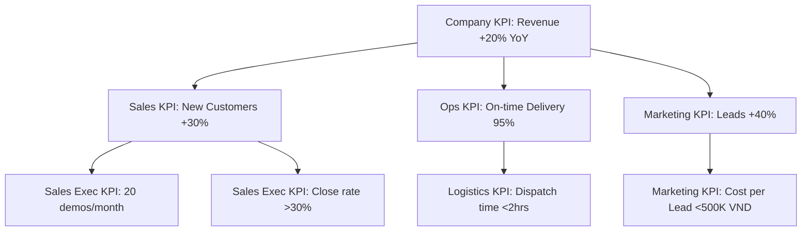

# OP03 — KPI Design & Management

> **Domain:** Operations
> **Trạng thái:** Hoàn thành
> **Level:** Intermediate
> **Prerequisites:** F01 (Business Fundamentals), OP01 (BPM)
> **Related Modules:** S02 (OKR), S03 (Balanced Scorecard), F05 (Financial Analysis)

---

## 1. Learning Objectives

Sau khi hoàn thành module này, học viên có thể:

- Phân biệt KPI với metric, target, measure, và OKR
- Thiết kế KPIs theo tiêu chí SMART và phân loại leading/lagging
- Xây dựng KPI hierarchy từ company → department → individual
- Thực hiện KPI cascade đảm bảo alignment dọc và ngang
- Thiết kế dashboard hiệu quả theo nguyên tắc data visualization
- Thiết lập review cadence và governance process cho KPI
- Nhận diện và phòng ngừa KPI gaming
- Liên kết KPI với BSC (S03) và OKR (S02)

---

## 2. Business Context

"What gets measured gets managed" — Peter Drucker. Nhưng nếu đo sai thứ, bạn sẽ quản lý sai thứ.

KPI (Key Performance Indicator) là công cụ đo lường hiệu suất kinh doanh — nhưng đây cũng là công cụ thường bị dùng sai nhất trong quản lý. Nhiều doanh nghiệp có hàng trăm KPIs không ai nhìn, hoặc tệ hơn — KPIs thúc đẩy hành vi sai.

**Vấn đề phổ biến:**
- Quá nhiều KPIs: "Everything is measured, nothing is managed"
- KPIs không align với strategy
- KPIs thúc đẩy suboptimal behavior (gaming the metric)
- Không có review process → KPIs là "decoration"
- KPIs không cascade xuống cấp nhân viên → không ai chịu trách nhiệm

**Xu hướng 2024–2026:**
- OKR + KPI hybrid: strategic agility với operational rigor
- Real-time KPI dashboards thay vì monthly reports
- AI-driven KPI recommendations và anomaly detection
- Wellbeing KPIs và sustainability KPIs (ESG)

---

## 3. Definitions

| Thuật ngữ | Định nghĩa |
|-----------|------------|
| **KPI** | Key Performance Indicator — chỉ số đo lường mức độ đạt được mục tiêu quan trọng |
| **Metric** | Bất kỳ số liệu có thể đo được. KPI là một subset của metrics — chỉ những metrics gắn với mục tiêu chiến lược |
| **Leading Indicator** | Chỉ số dự báo kết quả tương lai. Ví dụ: số cuộc gọi sales (dự báo doanh thu) |
| **Lagging Indicator** | Chỉ số phản ánh kết quả đã xảy ra. Ví dụ: doanh thu tháng này |
| **Target** | Giá trị mục tiêu cụ thể cần đạt được cho một KPI |
| **Baseline** | Giá trị KPI tại thời điểm bắt đầu đo (điểm tham chiếu) |
| **KPI Cascade** | Quá trình phân rã KPI từ cấp công ty → phòng ban → cá nhân |
| **Dashboard** | Màn hình trực quan hiển thị KPIs quan trọng dưới dạng charts, gauges, scorecards |
| **SMART** | Specific, Measurable, Achievable, Relevant, Time-bound — tiêu chí cho KPI tốt |
| **Gaming the metric** | Hành vi tối ưu chỉ số KPI mà không cải thiện thực sự (ví dụ: close sale ngày 30 tháng rồi refund ngày 2 tháng sau) |

---

## 4. Core Concepts

### 4.1 KPI Characteristics — SMART Framework

Một KPI tốt phải là SMART:

| Tiêu chí | Mô tả | Ví dụ tốt | Ví dụ xấu |
|---------|-------|-----------|-----------|
| **S**pecific | Rõ ràng, không mơ hồ | "Tỷ lệ giao hàng đúng hẹn" | "Hiệu quả logistics" |
| **M**easurable | Có thể đo được bằng số | "Đạt 95%" | "Cải thiện đáng kể" |
| **A**chievable | Thách thức nhưng khả thi | "Từ 85% lên 92%" | "Từ 50% lên 99% trong 1 tháng" |
| **R**elevant | Liên quan đến mục tiêu chiến lược | Gắn với customer satisfaction | KPI không ai relate đến công việc |
| **T**ime-bound | Có thời hạn cụ thể | "Đạt Q4/2026" | Không có deadline |

### 4.2 KPI Types

**Theo chiều hướng thời gian:**

| Loại | Đặc điểm | Ví dụ |
|------|----------|-------|
| **Leading Indicators** | Dự báo tương lai, có thể tác động | Số qualified leads, % training completion |
| **Lagging Indicators** | Kết quả quá khứ, đánh giá achievement | Revenue, profit, customer satisfaction score |

**Theo tính chất:**

| Loại | Đặc điểm | Ví dụ |
|------|----------|-------|
| **Financial KPIs** | Đo lường kết quả tài chính | Revenue growth, EBITDA margin, ROI |
| **Non-Financial KPIs** | Đo lường operational/quality/people | NPS, On-time delivery, Employee engagement |
| **Input KPIs** | Đo lường nguồn lực đầu vào | Training hours, R&D investment |
| **Process KPIs** | Đo lường hiệu quả quy trình | Cycle time, defect rate, productivity |
| **Output KPIs** | Đo lường kết quả đầu ra | Units produced, orders fulfilled |
| **Outcome KPIs** | Đo lường tác động thực sự | Customer lifetime value, market share |

### 4.3 KPI Hierarchy

```
COMPANY LEVEL (L1)
├── Revenue Growth: +20% YoY
├── EBITDA Margin: 15%
├── Customer NPS: > 50
└── Employee Engagement: > 70%

DEPARTMENT LEVEL (L2)
├── Sales Department
│   ├── New Customers Acquired: 100/month
│   ├── Average Deal Size: 50M VND
│   └── Sales Cycle Length: < 30 days
├── Operations Department
│   ├── On-Time Delivery Rate: 95%
│   ├── Order Processing Time: < 4 hours
│   └── Cost per Order: < 50K VND
└── Customer Service
    ├── First Contact Resolution: 80%
    ├── Average Handle Time: < 5 min
    └── CSAT Score: > 4.5/5

INDIVIDUAL LEVEL (L3)
└── Sales Executive A
    ├── Monthly Revenue Target: 500M VND
    ├── New Leads per Week: 20
    └── Demo Conversion Rate: > 30%
```

### 4.4 KPI Cascade Methodology

**Cascading từ trên xuống:**
1. CEO/Board xác định 5–7 Company KPIs từ strategic plan
2. Mỗi Department xác định 3–5 Department KPIs hỗ trợ Company KPIs
3. Mỗi team/individual xác định 2–4 Individual KPIs đóng góp vào Department KPIs
4. Kiểm tra vertical alignment: "KPI cá nhân X có đóng góp vào Department KPI Y không?"
5. Kiểm tra horizontal alignment: "KPI của các departments có conflict không?"

**Alignment test:**
- Nếu tất cả individual KPIs được đạt 100%, liệu Department KPI có được đạt không?
- Nếu tất cả Department KPIs được đạt, liệu Company KPI có được đạt không?

### 4.5 Dashboard Design Principles

**Nguyên tắc 1 — Hierarchy of Information:**
- Hàng đầu: 3–5 KPIs quan trọng nhất (big number, prominent)
- Phần giữa: Trend charts, comparisons
- Chi tiết: Drilldown tables

**Nguyên tắc 2 — Right Chart for Right Data:**
- Time series → Line chart
- Comparison → Bar chart
- Proportion → Pie (chỉ dùng khi < 5 categories)
- Progress to goal → Gauge / Progress bar
- Ranking → Horizontal bar

**Nguyên tắc 3 — Traffic Light Coding:**
- Green: Đạt target
- Yellow: Trong vùng cảnh báo (70–90% target)
- Red: Cần hành động (< 70% target)

**Nguyên tắc 4 — Context is everything:**
- Luôn show trend (vs last period)
- Show vs target (not just actual)
- Show vs benchmark khi có

### 4.6 KPI Review Cadence

| Cấp độ | Tần suất | Format | Thành phần |
|--------|---------|--------|-----------|
| **Real-time** | Liên tục | Automated dashboard | Operations team |
| **Daily** | Hàng ngày | Stand-up meeting | Team leads |
| **Weekly** | Hàng tuần | Team review | Department managers |
| **Monthly** | Hàng tháng | Business review | Senior management |
| **Quarterly** | Hàng quý | Strategic review | C-Level, Board |
| **Annual** | Hàng năm | Strategy review | Board of Directors |

### 4.7 KPI Gaming — Nhận diện và Phòng ngừa

**Ví dụ gaming phổ biến:**
- Customer service: tắt điện thoại trước khi gọi vào để giảm inbound call count
- Sales: close deals cuối tháng rồi refund đầu tháng sau
- Manufacturing: giảm quality check để tăng throughput
- HR: tuyển dụng số lượng mà không care quality để đạt headcount KPI

**Phòng ngừa:**
1. Pair leading with lagging indicators (đo cả process và outcome)
2. Pair quantity với quality metrics
3. Rotation và cross-check
4. Culture: không trừng phạt người báo cáo số xấu trung thực

---

## 5. Business Value

| Loại giá trị | Mô tả |
|-------------|-------|
| **Strategic alignment** | Toàn tổ chức hướng tới cùng mục tiêu |
| **Accountability** | Rõ ràng ai chịu trách nhiệm gì |
| **Early warning** | Leading indicators phát hiện vấn đề trước khi thành crisis |
| **Decision support** | Data-driven decisions thay vì gut feeling |
| **Performance culture** | Tạo nền tảng cho performance management và recognition |
| **Continuous improvement** | Baseline → measure → improve → measure lại |

---

## 6. Enterprise Role

- **C-Level:** Define company-level KPIs, review quarterly, link to strategy
- **Department Heads:** Own department KPIs, cascade to team, monthly review
- **Finance/Strategy:** Facilitate KPI design, maintain KPI library, consolidate reporting
- **HR:** Own people KPIs (engagement, turnover, productivity)
- **Operations:** Own efficiency KPIs (cycle time, quality, cost)
- **IT/BI Team:** Build dashboards, automate data collection
- **Individual Contributors:** Own personal KPIs, self-monitor, report weekly

---

## 7. Departments Related

- **Strategy / Corporate Planning:** KPI design và cascade cho company level
- **Finance:** Financial KPIs, consolidation, reporting
- **HR:** People KPIs, performance management integration
- **Sales / Marketing:** Revenue, acquisition, retention KPIs
- **Operations:** Efficiency, quality, delivery KPIs
- **Customer Service:** Satisfaction, resolution, response KPIs
- **IT/BI:** Dashboard development, data pipeline

---

## 8. Input

- Strategic plan và annual targets (từ CEO/Board)
- Balanced Scorecard (S03) hoặc OKR (S02) nếu đã có
- Previous year performance data (baseline)
- Industry benchmarks
- Customer feedback và voice of customer data
- Operational data từ ERP, CRM, HRIS
- Budget và resource constraints

---

## 9. Output

- KPI Dictionary / Library (danh sách KPIs với định nghĩa chuẩn)
- KPI Cascade Document (company → dept → individual)
- KPI Dashboard (real-time hoặc weekly/monthly reports)
- KPI Review Calendar
- Performance Review Templates
- KPI Governance Framework
- Corrective Action Plans khi KPI miss

---

## 10. Business Process

```
Strategy Setting → KPI Design → Cascade → Dashboard Build → Review → Action → Review Next Cycle
```

**Bước 1 — Strategy Setting (Annual)**
- Review company strategy và priorities
- Identify 5–7 company-level KPIs từ strategic objectives
- Set annual targets với quarterly milestones

**Bước 2 — KPI Design Workshop**
- Workshop với Department Heads để design department KPIs
- Validate SMART criteria cho từng KPI
- Define data source và measurement method cho từng KPI
- Document trong KPI Dictionary

**Bước 3 — Cascade**
- Department Heads cascade xuống Team Leads
- Team Leads cascade xuống Individual Contributors
- Verify vertical và horizontal alignment

**Bước 4 — Dashboard Build**
- IT/BI team xây dựng automated dashboards
- Data pipeline từ ERP/CRM/HRIS → Dashboard tool
- UAT với end users

**Bước 5 — Ongoing Review**
- Daily/Weekly operational reviews
- Monthly management review với corrective actions
- Quarterly strategic review và possible KPI adjustment

**Bước 6 — Year-End Review**
- Đánh giá achievement vs targets
- Identify learnings
- Input vào next year strategy và KPI setting

---

## 11. Data Flow

```
Business Systems (ERP, CRM, HRIS, POS)
    ↓
Data Extraction (ETL/API)
    ↓
Data Warehouse / Data Lake
    ↓
BI Tool (Power BI, Tableau, Looker)
    ↓
KPI Dashboards
    ↓
Review Meetings → Decisions → Actions
    ↓
Performance Records → Annual Review
```

---

## 12. Money Flow

**Chi phí KPI Management:**
- Dashboard tools: Power BI ($10/user/tháng), Tableau ($75/user/tháng), Looker (enterprise pricing)
- BI/Data Engineer: 20–40 triệu VND/tháng nếu hire internal
- KPI consulting/facilitation: 50–200 triệu VND cho initial setup

**Value Generated:**
- Better decision making → avoid costly mistakes
- Performance-linked compensation → motivation alignment
- Early warning → prevent revenue loss
- Strategic alignment → reduced wasted effort

---

## 13. Document Flow

```
Strategic Plan → KPI Dictionary
    ↓
Department KPI Cascade Documents
    ↓
Individual KPI Agreement (signed)
    ↓
Monthly KPI Reports
    ↓
Quarterly Business Review Decks
    ↓
Annual Performance Appraisal Records
```

---

## 14. Roles

| Role | Mô tả |
|------|-------|
| **Chief Strategy Officer / Strategy Director** | Design company KPIs, governance framework |
| **Department Head / KPI Owner** | Own department KPIs, ensure cascade |
| **Finance Business Partner** | Support KPI design, financial KPI calculation |
| **HR Business Partner** | People KPIs, link KPI to performance appraisal |
| **BI/Data Analyst** | Build dashboards, data pipeline, KPI calculations |
| **Individual Contributor** | Own personal KPIs, report actuals, self-assess |

---

## 15. Responsibilities

- **CEO/Board:** Approve company KPIs, review quarterly, hold Department Heads accountable
- **Department Heads:** Design department KPIs, cascade to team, own results
- **Strategy/Finance:** Facilitate KPI design, maintain library, consolidate reporting
- **HR:** Link KPIs to performance reviews and compensation
- **IT/BI:** Build and maintain dashboards, automate data collection
- **Individuals:** Understand, own, and report on personal KPIs honestly

---

## 16. RACI

| Hoạt động | CEO | Dept. Head | Strategy/Finance | HR | BI/IT |
|-----------|:---:|:----------:|:----------------:|:--:|:-----:|
| Define Company KPIs | A | C | R | C | I |
| Department KPI Design | C | R | C | C | I |
| Individual KPI Cascade | I | A | I | R | I |
| KPI Dictionary | I | C | R | I | C |
| Dashboard Build | I | C | I | I | R |
| Monthly Review | A | R | C | I | I |
| Annual Review | A | R | C | C | I |

*R=Responsible, A=Accountable, C=Consulted, I=Informed*

---

## 17. Frameworks

### Balanced Scorecard (BSC) — Robert Kaplan & David Norton
4 perspectives với KPIs liên kết:
1. **Financial**: Revenue, profit, ROI
2. **Customer**: NPS, satisfaction, retention
3. **Internal Process**: Efficiency, quality, innovation
4. **Learning & Growth**: Employee skills, engagement, culture

### OKR (Objectives & Key Results) — Intel/Google
- **Objective**: Mục tiêu định tính, aspirational
- **Key Result**: 2–5 KPIs đo lường tiến độ đạt Objective
- Quarterly review cycle
- KPIs trong OKR thường là stretch targets (70% = good)

### KPI Library by Function (Mẫu)

| Function | KPIs |
|---------|------|
| **Sales** | Revenue, Deals Won, Win Rate, Sales Cycle, Average Deal Size |
| **Marketing** | Leads Generated, Cost per Lead, Conversion Rate, Brand Awareness |
| **Operations** | On-Time Delivery, Cycle Time, Defect Rate, Cost per Unit |
| **Finance** | Revenue Growth, EBITDA Margin, DSO, Working Capital |
| **HR** | Turnover Rate, Time-to-Fill, Training Hours, Engagement Score |
| **Customer Service** | NPS, CSAT, FCR, Average Handle Time, Resolution Time |
| **Supply Chain** | Inventory Turns, OTIF, Supplier OTD, Fill Rate |

---

## 18. International Standards

| Chuẩn | Nội dung |
|-------|---------|
| **ISO 9001:2015 Clause 9** | Performance evaluation — monitoring, measurement, analysis |
| **GRI Standards** | ESG KPI reporting framework (Global Reporting Initiative) |
| **SASB Standards** | Industry-specific sustainability KPIs |
| **IFRS/VAS** | Financial KPI definitions và calculation standards |
| **Deloitte CFO Program** | CFO KPI best practices |

---

## 19. Vietnam Context

**KPI tại doanh nghiệp Việt Nam:**

1. **Thực trạng:** Nhiều doanh nghiệp VN dùng KPI chủ yếu cho salary/bonus calculation, không phải strategic management. KPI trở thành công cụ gây stress thay vì alignment.

2. **Thách thức văn hóa:** Văn hóa nể nang — người quản lý không muốn report KPI thấp → KPI thường được massage để trông đẹp

3. **SME challenges:** Thiếu data infrastructure → KPI manual, không real-time → tốn thời gian và dễ sai

4. **FDI companies:** KPIs được define từ HQ (thường là global KPIs), không phải lúc nào cũng relevant với context VN

5. **Pháp lý:** Nghị định 05/2015/NĐ-CP (nay thay thế bởi ND 145/2020) hướng dẫn thực hiện Bộ Luật Lao động — KPI/KRA thường là một phần của performance management system

6. **Công cụ phổ biến tại VN:**
   - Phần mềm HRM tích hợp KPI: HRMS VN, SlimCRM, BambooHR
   - Dashboard: Power BI (phổ biến nhất), Google Looker Studio (free)
   - ERP link: MISA, SAP B1, Oracle NetSuite

---

## 20. Legal Considerations

- **Bộ Luật Lao động 2019 & NĐ 145/2020:** KPI/KRA là công cụ performance management hợp pháp nhưng phải được thống nhất trong hợp đồng lao động hoặc phụ lục
- **Không được dùng KPI để sa thải tùy tiện:** Cần documented process, warning procedure trước khi terminate dựa trên performance
- **Privacy:** KPI cá nhân là dữ liệu nhạy cảm — Nghị định 13/2023 về bảo vệ dữ liệu cá nhân áp dụng
- **Thỏa ước lao động tập thể:** Trong nhiều doanh nghiệp lớn, KPI system phải được thỏa thuận với công đoàn

---

## 21. Common Mistakes

1. **Quá nhiều KPIs:** Team có 20+ KPIs → không focus → mọi thứ đều "important" = không có gì thực sự important

2. **KPI không align với strategy:** Department KPIs tồn tại vì "tradition" không phải vì strategic contribution

3. **Đo lagging only:** Chỉ nhìn revenue (lagging) mà không đo leads/pipeline (leading) → phản ứng quá muộn

4. **KPI không có owner:** "Chỉ số này ai chịu trách nhiệm?" → "Mọi người đều chịu trách nhiệm" = không ai chịu

5. **Targets không có rationale:** "Tại sao target 90%?" → "Vì năm ngoái 80%, tăng thêm 10% thôi" — không dựa trên customer need hay market benchmark

6. **Review without action:** Monthly review xong nhưng không có actionable next steps → KPI review là show

7. **Gaming:** Reward people cho KPI achievement mà không kiểm soát quality → systematic gaming

8. **Không review relevance:** KPI được dùng 3 năm mà không check còn relevant không với strategy hiện tại

9. **Data quality issues:** KPI calculation khác nhau giữa các người vì không có single source of truth

10. **KPI as punishment tool:** Dùng KPI để micro-manage và punish thay vì guide and improve

---

## 22. Best Practices

1. **Rule of 5–7:** Tối đa 5–7 KPIs cho mỗi cấp độ. "If everything is KPI, nothing is KPI."
2. **Balance leading and lagging:** Ít nhất 40% KPIs phải là leading indicators
3. **Single source of truth:** Mọi người dùng cùng một data source, cùng formula
4. **KPI Dictionary:** Mỗi KPI có definition, formula, data source, owner, target, review frequency
5. **Cascade và align:** Vertical (chiến lược) và horizontal (cross-function) alignment là bắt buộc
6. **Involve in design:** Người sở hữu KPI phải tham gia vào quá trình thiết kế → ownership cao hơn
7. **Review và adapt:** KPIs không phải là permanent. Review annually nếu không còn relevant → retire
8. **Pair metrics:** Pair quantity với quality, input với output để prevent gaming
9. **Celebrate progress, not just achievement:** Recognize effort và improvement, không chỉ "made target"
10. **Automate data collection:** Manual KPI tracking = slow, inaccurate, demoralizing

---

## 23. KPIs

*(KPIs để đánh giá hiệu quả của KPI Management System)*

| Meta-KPI | Định nghĩa | Target |
|----------|-----------|--------|
| **KPI Coverage** | % departments có KPI aligned với strategy | 100% |
| **Dashboard Adoption** | % managers dùng KPI dashboard hàng tuần | > 80% |
| **KPI Data Accuracy** | % KPI data points không có discrepancies | > 95% |
| **Review Cadence Compliance** | % review meetings diễn ra đúng schedule | > 90% |
| **Action Follow-through** | % action items từ KPI review được complete đúng hạn | > 80% |
| **KPI Stability** | % KPIs unchanged in a year (tránh constant redefinition) | 70–80% |

---

## 24. Metrics

**KPI System Health Metrics:**
- Số KPIs active toàn công ty
- Tỷ lệ KPIs có owner rõ ràng
- Tỷ lệ KPIs updated đúng hạn
- Tỷ lệ teams đạt ≥ 80% KPI targets
- Số corrective actions được implement từ KPI review

**Individual KPI Performance:**
- Percentage of KPIs in Green/Yellow/Red
- Trend analysis (improving/declining/stable)
- Gap-to-target analysis

---

## 25. Reports

| Báo cáo | Tần suất | Đối tượng |
|---------|---------|-----------|
| **Operational KPI Dashboard** | Daily/Weekly | Operations team, Team leads |
| **Monthly Business Performance Report** | Hàng tháng | Department heads, Management |
| **Quarterly Strategic Review Deck** | Hàng quý | C-Level, Board |
| **Annual Performance Report** | Hàng năm | Board, Shareholders |
| **Individual Performance Review** | Hàng quý / Năm | HR, Employees |
| **KPI Trend Analysis** | Hàng tháng | Strategy team |

---

## 26. Templates

### Template 1: KPI Dictionary Entry

```
KPI ID: [KPI-DEPT-001]
KPI Name: [Tên KPI]
Definition: [Mô tả chính xác KPI đo lường cái gì]
Formula: [Cách tính: Numerator / Denominator × 100%]
Data Source: [Hệ thống lấy data: SAP, CRM, Manual...]
Frequency: [Daily / Weekly / Monthly / Quarterly]
Owner: [Tên + Role]
Target: [FY target + quarterly milestones]
Baseline: [Giá trị tại thời điểm bắt đầu đo]
Benchmark: [So sánh với ngành nếu có]
Traffic Light:
  🟢 Green: [≥ X%]
  🟡 Yellow: [Y% – X%]
  🔴 Red: [< Y%]
Notes: [Lưu ý về cách tính, exclusions, known issues]
```

### Template 2: KPI Cascade Matrix

```
COMPANY OBJECTIVE: [Tên mục tiêu]
Company KPI: [KPI cấp công ty] — Target: [X]

  Department: [Tên dept]
  Dept KPI 1: [KPI] — Target: [X] — Owner: [Name]
  Dept KPI 2: [KPI] — Target: [X] — Owner: [Name]

      Individual: [Tên nhân viên]
      Individual KPI 1: [KPI] — Target: [X]
      Individual KPI 2: [KPI] — Target: [X]
```

### Template 3: Monthly KPI Review Agenda

```
1. Check-in: Thay đổi nào từ tháng trước? (5 phút)
2. KPI Traffic Lights Review: Walk through dashboard (15 phút)
3. Red/Yellow deep-dive: Root cause analysis (20 phút)
4. Action Items Review: Actions từ tháng trước? (10 phút)
5. New Action Items: Define owner, deadline (10 phút)
```

---

## 27. Checklists

### Checklist: KPI Design Quality Check
- [ ] Tên KPI rõ ràng, không mơ hồ
- [ ] Có formula cụ thể, nhất quán
- [ ] Data source được xác định rõ
- [ ] Owner được assign
- [ ] Target có rationale (benchmark, capacity, strategy-based)
- [ ] Frequency phù hợp với speed of decision making
- [ ] Leading/Lagging balance trong portfolio
- [ ] SMART criteria được check
- [ ] Không encourage gaming behavior
- [ ] Align với higher-level KPI (cascade)

### Checklist: Dashboard Design Review
- [ ] Most important KPIs prominent (top left)
- [ ] Traffic light coding consistent
- [ ] Trend (vs prior period) visible
- [ ] Actual vs target comparison
- [ ] No chart junk (3D charts, unnecessary decoration)
- [ ] Right chart type for right data
- [ ] Color blind friendly
- [ ] Mobile accessible
- [ ] Data refresh frequency clear
- [ ] Context/footnotes cho unusual data

---

## 28. SOP

### SOP: Monthly KPI Review Meeting

**Mục đích:** Đảm bảo KPI được review đúng quy trình, dẫn đến quyết định và hành động  
**Tần suất:** Hàng tháng (Tuần đầu tháng)  
**Thời gian:** 60 phút  
**Người tham dự:** Department Head + Team Leads

**3 ngày trước meeting:**
1. BI team update tất cả KPI data lên dashboard
2. Department Head review dashboard, note points cần thảo luận

**Ngày meeting:**
1. Dashboard walk-through: 15 phút — review tất cả KPIs, traffic lights
2. Deep-dive Reds: Root cause cho từng Red KPI (5W1H hoặc Fishbone)
3. Review action items từ tháng trước: hoàn thành hay chưa? Impact?
4. Define new action items: Owner + Deadline + Expected outcome
5. Escalation: KPIs cần support từ cấp trên → escalate

**Ngày hôm sau:**
1. Meeting minutes được gửi trong vòng 24 giờ
2. Action items được track trong task management tool
3. Department Head report summary lên Management review

---

## 29. Case Study

### Case Study: Thiết kế KPI System cho Chuỗi Bán Lẻ 50 Cửa hàng

**Bối cảnh:** Chuỗi thời trang Việt Nam, 50 cửa hàng, 400 nhân viên. CEO muốn chuyển từ quản lý cảm tính sang data-driven management.

**Tình trạng ban đầu:**
- Không có KPIs cấp công ty
- Mỗi cửa hàng track riêng, không đồng nhất
- Monthly report là Excel gửi qua email, mất 3 ngày để compile
- Manager quyết định based on intuition

**Quá trình thiết kế (3 tháng):**

*Tháng 1: Company KPI Design*
- Workshop với CEO và 3 Directors (2 ngày)
- Kết quả: 6 Company KPIs:
  1. Same-Store Sales Growth: +15% YoY
  2. Gross Margin %: > 50%
  3. Inventory Turnover: > 6x/năm
  4. Customer NPS: > 60
  5. Employee Turnover: < 25%/năm
  6. New Store Payback Period: < 18 tháng

*Tháng 2: Cascade và Store KPIs*
- Cascade xuống Store Manager level
- Mỗi store có 8 KPIs: Revenue, transactions, ATV, conversion rate, inventory accuracy, NPS, training hours, shrinkage

*Tháng 3: Dashboard và Automation*
- Data pipeline: POS → Google Sheets → Looker Studio dashboard
- Real-time store performance visible
- Weekly automated report gửi email cho management

**Kết quả sau 6 tháng:**
- Revenue focus tăng: 3/50 stores Red → CEO intervene trực tiếp → 2 stores turned around
- Inventory control: Turnover từ 4.2x lên 5.8x (giải phóng 2.3 tỷ VND working capital)
- NPS baseline: đo được lần đầu → foundation cho cải tiến
- Decision making: "Trong 6 tháng đầu, chúng tôi đã đóng 2 stores không profitable mà trước đây không biết" — CEO

---

## 30. Small Business Example

### SME: Nhà hàng 3 chi nhánh — KPI cơ bản

**5 KPIs đủ để quản lý nhà hàng hiệu quả:**

1. **Revenue per seat per day** = Doanh thu ÷ (Số ghế × số ngày)
2. **Food cost %** = Chi phí nguyên liệu ÷ Doanh thu × 100% (target: < 30%)
3. **Table turnover rate** = Số lượt khách ÷ Số bàn
4. **Customer rating** = Google Maps rating (target: > 4.3 sao)
5. **Staff turnover** = Số nhân viên nghỉ/tháng ÷ Tổng nhân viên

**Tool:** Google Sheets dashboard, cập nhật mỗi cuối ngày.  
**Review:** 15 phút mỗi sáng thứ Hai với quản lý 3 chi nhánh qua Google Meet.

---

## 31. Enterprise Example

### Enterprise: Tập đoàn sản xuất niêm yết — KPI cho Investor Relations

**Context:** Công ty niêm yết HoSE, cần KPI system thỏa mãn cả internal management lẫn investor reporting.

**KPI Architecture:**
- Board Level: 8 KPIs (Revenue, EBITDA, EPS, ROE, Debt/EBITDA, Market Share, NPS, ESG Score)
- C-Level: 15 KPIs (per BSC 4 perspectives)
- Division Level: 20–30 KPIs mỗi division
- Department Level: 8–12 KPIs
- Individual: 4–6 KPIs (linked to annual bonus)

**Technology Stack:**
- ERP: SAP S4/HANA (source data)
- Data Warehouse: Azure Synapse
- BI: Power BI Embedded in management portal
- Collaboration: KPI discussions trong Microsoft Teams

**Annual Cycle:**
- October: Strategy review, KPI revision
- November: Budget + KPI targets finalized
- January: KPI cascade to individuals
- Monthly: Department reviews
- Quarterly: Board KPI package

---

## 32. ERP Mapping

| KPI Management | SAP | Oracle | Odoo |
|---------------|-----|--------|------|
| Financial KPIs | SAP Analytics Cloud, S4/HANA built-in | Oracle EPM Cloud | Accounting dashboard |
| Operational KPIs | SAP OEE (manufacturing), SAP QM | Oracle Manufacturing | Various dashboards |
| Sales KPIs | SAP CRM/Sales Analytics | Oracle Sales Cloud | CRM reporting |
| HR KPIs | SAP SuccessFactors | Oracle HCM | HR module |
| Custom Dashboards | SAP Analytics Cloud | Oracle OAC | Odoo Studio |
| Data Integration | SAP BW, BTP | Oracle Data Integrator | Odoo API |

---

## 33. Automation

**Data Collection Automation:**
- API connections: ERP → Data Warehouse (daily refresh)
- Webhooks: Real-time event-based KPI updates
- RPA: Collect KPI data từ systems không có API

**Reporting Automation:**
- Scheduled reports: Power BI automate weekly email reports
- Alert automation: Nếu KPI drops below threshold → auto Slack/email alert
- Dashboard: Self-serve, always up-to-date

**Review Automation:**
- Calendar integration: KPI review meetings tự động scheduled
- Action tracking: Task created automatically khi Red KPI detected

---

## 34. AI Opportunities

| Cơ hội | Mô tả | Maturity |
|--------|-------|---------|
| **Anomaly Detection** | AI phát hiện KPI deviation bất thường, alert stakeholders | High |
| **Predictive KPIs** | ML dự báo KPI cuối tháng từ mid-month data | High |
| **AI KPI Recommendations** | AI đề xuất KPIs phù hợp cho từng industry/function | Medium |
| **Natural Language Querying** | "Revenue tháng này so với tháng trước?" → AI trả lời từ data | High |
| **Narrative Generation** | AI tự viết KPI commentary cho reports | Medium |
| **Gaming Detection** | AI nhận diện pattern bất thường gợi ý metric gaming | Medium |

---

## 35. Implementation Guide

### Phase 1: Foundation (Tháng 1–2)
- [ ] Workshop với C-Level để design Company KPIs (max 7)
- [ ] Xây dựng KPI Dictionary template
- [ ] Chọn BI tool (Power BI recommended cho SME–Enterprise VN)
- [ ] Audit data quality của current systems

### Phase 2: Cascade (Tháng 2–3)
- [ ] Department Head workshops để cascade KPIs
- [ ] Validate alignment
- [ ] Document trong KPI Dictionary
- [ ] Individual KPI agreements ký

### Phase 3: Dashboard (Tháng 3–4)
- [ ] BI team build dashboards
- [ ] Data pipeline setup
- [ ] UAT với users
- [ ] Training on dashboard usage

### Phase 4: Review Process (Từ tháng 4)
- [ ] Setup review calendar
- [ ] First monthly review meeting
- [ ] Iterate và improve

---

## 36. Consulting Guide

**Phát hiện vấn đề KPI:**
- "Họ có nhiều KPIs nhưng không có KPI owner rõ ràng"
- "KPI báo cáo mỗi tháng nhưng không có action theo sau"
- "KPI department không liên kết với company strategy"

**Discovery Questions:**
1. "Bạn đang track bao nhiêu KPIs? Cho tôi xem dashboard?"
2. "KPI nào quan trọng nhất để bạn biết business đang tốt hay không?"
3. "Tuần trước, bạn có nhìn vào KPI không? Dẫn đến quyết định gì?"
4. "Khi KPI xấu, điều gì xảy ra tiếp theo?"
5. "Nhân viên của bạn có biết KPI của họ không?"

**Typical Engagement:**
- KPI Design Workshop: 2–5 ngày, 50–150 triệu VND
- KPI System Setup (incl. dashboard): 1–3 tháng, 100–300 triệu VND
- Ongoing KPI Coaching: monthly retainer, 20–50 triệu VND/tháng

---

## 37. Diagnostic Questions

1. Công ty có KPI cấp công ty được document không? Được review bao lâu một lần?
2. KPI có được cascade xuống cấp cá nhân không? Nhân viên có biết KPI của họ không?
3. KPI data được collect bằng cách nào? Manual hay tự động?
4. Tỷ lệ leading vs lagging indicators trong KPI portfolio là bao nhiêu?
5. Khi KPI miss target, process tiếp theo là gì? Có documented escalation path không?
6. KPI review meetings có dẫn đến action items cụ thể không?
7. Ai là "nhân vật nổi bật" trong meeting có thể khiến team báo cáo KPI không trung thực?
8. KPIs có được link với compensation/bonus không?
9. KPI có được review hàng năm để check relevance không?
10. Có evidence nào về KPI gaming trong tổ chức không?

---

## 38. Interview Questions

**Cho Strategy/Finance analyst:**
1. "Giải thích sự khác biệt giữa leading và lagging indicator. Cho 3 ví dụ mỗi loại cho ngành bán lẻ"
2. "Làm thế nào để thiết kế KPI cho Customer Service tránh gaming?"
3. "Nếu Company KPI là Revenue Growth 20%, bạn cascade xuống Sales và Marketing như thế nào?"
4. "Dashboard nào bạn cho là effective? Tại sao?"
5. "Khi KPI miss target, bạn xử lý như thế nào trong review meeting?"

**Cho C-Level / Business Leader:**
1. "3 KPIs nào quan trọng nhất để bạn biết business đang tốt không?"
2. "Làm thế nào để ensure KPI không trở thành bureaucratic exercise?"
3. "Bạn handle như thế nào khi team đạt KPI nhưng không đạt kết quả business thực sự?"

---

## 39. Exercises

**Exercise 1: KPI Design (Beginner)**
Thiết kế 5 KPIs cho một cửa hàng điện thoại. Đảm bảo: 2 leading, 3 lagging; tất cả SMART; có owner, target, formula.

**Exercise 2: KPI Cascade (Intermediate)**
Company KPI: "Tăng trưởng doanh thu 25% trong 2027". Cascade xuống cho: Sales team, Marketing team, và Operations team. Mỗi department tối đa 4 KPIs. Giải thích cách mỗi dept KPI contribute vào company KPI.

**Exercise 3: KPI Gaming Analysis (Intermediate)**
Nhận một KPI list (giảng viên cung cấp). Identify KPIs có thể dễ bị gaming. Đề xuất cách pair metrics để prevent gaming cho mỗi KPI.

**Exercise 4: Dashboard Design (Advanced)**
Thiết kế wireframe dashboard cho Monthly Business Review của CEO chuỗi nhà hàng 10 cơ sở. Include: chọn metrics, chart types, layout, traffic light thresholds.

**Exercise 5: KPI Audit (Advanced)**
Review KPI system của một doanh nghiệp thực (từ case study hoặc do giảng viên cung cấp). Đánh giá theo 10 tiêu chí: SMART, alignment, balance, gaming risk, ownership, data quality, review process, action linkage, relevance, communication.

---

## 40. References

**Sách:**
- Parmenter, D. — *Key Performance Indicators: Developing, Implementing, and Using Winning KPIs* (4th Ed., Wiley, 2019)
- Marr, B. — *Key Performance Indicators: The 75 Measures Every Manager Needs to Know* (FT Press, 2012)
- Kaplan, R. & Norton, D. — *The Balanced Scorecard* (HBS Press, 1996)

**Online:**
- Bernard Marr's KPI Library: https://bernardmarr.com/kpi-library/
- Klipfolio KPI Library: https://www.klipfolio.com/resources/kpi-examples

**Công cụ:**
- Power BI: https://powerbi.microsoft.com
- Google Looker Studio (free): https://lookerstudio.google.com
- Tableau: https://www.tableau.com

---

## Output Formats

### Mermaid Diagram — KPI Cascade



### ASCII Diagram — KPI Traffic Light Dashboard

```
╔══════════════════════════════════════════════════════════╗
║  MONTHLY BUSINESS REVIEW — Tháng 5/2026                  ║
╠══════════════════════════════════════════════════════════╣
║                                                           ║
║  REVENUE         GROSS MARGIN      CUSTOMER NPS           ║
║  ┌─────────┐     ┌─────────┐       ┌─────────┐           ║
║  │ 🟢  98% │     │ 🟡  85% │       │ 🔴  65% │           ║
║  │  of     │     │  of     │       │  of     │           ║
║  │ Target  │     │ Target  │       │ Target  │           ║
║  └─────────┘     └─────────┘       └─────────┘           ║
║  48.5B VND       51.2%             NPS = 42              ║
║  (Target: 49.5B) (Target: 60%)     (Target: 65)          ║
╠══════════════════════════════════════════════════════════╣
║  🔴 ATTENTION NEEDED: Customer NPS (-3pts MoM)            ║
║  Action: CS team deep-dive this week                      ║
╚══════════════════════════════════════════════════════════╝
```

### Flashcards

**Flashcard 1**
Q: Sự khác biệt giữa Leading và Lagging Indicator? Cho ví dụ cho ngành Sales?
A:
- **Leading Indicator**: Dự báo kết quả tương lai, có thể tác động ngay bây giờ
  - Ví dụ Sales: Số qualified leads, số demos scheduled, proposal sent
- **Lagging Indicator**: Phản ánh kết quả đã xảy ra, không thể thay đổi
  - Ví dụ Sales: Revenue tháng này, deals closed, win rate
- **Tại sao quan trọng**: Nếu chỉ track lagging → biết kết quả nhưng quá muộn để can thiệp. Track leading → dự báo và hành động sớm

**Flashcard 2**
Q: SMART framework cho KPI là gì? Áp dụng vào ví dụ thực tế?
A: SMART = Specific, Measurable, Achievable, Relevant, Time-bound
Ví dụ xấu: "Cải thiện dịch vụ khách hàng"
Ví dụ tốt áp dụng SMART:
- **S**pecific: "Tỷ lệ giải quyết khiếu nại ngay lần đầu tiên (First Contact Resolution Rate)"
- **M**easurable: "Đạt 85%" (đo được từ CRM system)
- **A**chievable: "Từ baseline 72% lên 85%" (khả thi trong 6 tháng)
- **R**elevant: "Liên quan trực tiếp đến customer satisfaction target của company"
- **T**ime-bound: "Đạt vào Q4/2026"

**Flashcard 3**
Q: KPI gaming là gì? Cho 2 ví dụ và cách phòng ngừa?
A: KPI Gaming = tối ưu chỉ số KPI mà không cải thiện kết quả thực sự
Ví dụ 1: Customer service giảm average handle time (AHT) bằng cách cúp máy sớm thay vì giải quyết vấn đề
→ **Phòng ngừa**: Pair AHT với FCR (First Contact Resolution Rate) và CSAT score
Ví dụ 2: Sales close deals cuối tháng để đạt quota, rồi refund đầu tháng sau
→ **Phòng ngừa**: Track revenue net of returns; có "claw-back" provision trong commission

### Cheat Sheet — KPI Design Quick Guide

```
╔══════════════════════════════════════════════════════════╗
║         KPI DESIGN QUICK REFERENCE                        ║
╠══════════════════════════════════════════════════════════╣
║ SMART CHECK          │ KPI TYPES                          ║
║ S: Not vague         │ Financial: Revenue, Margin, ROI    ║
║ M: Has a number      │ Customer: NPS, CSAT, Retention     ║
║ A: Stretch not crazy │ Process: Cycle time, Defect rate   ║
║ R: Linked to goal    │ People: Engagement, Turnover       ║
║ T: Has deadline      │ Leading: Forecast future           ║
║                      │ Lagging: Confirm past              ║
╠══════════════════════════════════════════════════════════╣
║ GOLDEN RULES                                             ║
║ Max 5-7 KPIs per level                                   ║
║ 40%+ should be leading indicators                        ║
║ Every KPI needs ONE owner                                ║
║ Pair quantity with quality to prevent gaming             ║
║ Single source of truth for all data                      ║
╠══════════════════════════════════════════════════════════╣
║ TRAFFIC LIGHT                                            ║
║ 🟢 ≥ 90% of target = On track                           ║
║ 🟡 70-89% of target = At risk, needs attention           ║
║ 🔴 < 70% of target = Critical, requires intervention     ║
╚══════════════════════════════════════════════════════════╝
```

### JSON Metadata

```json
{
  "module": {
    "code": "OP03",
    "name": "KPI Design & Management",
    "domain": "Operations",
    "level": "Intermediate",
    "estimated_study_hours": 10,
    "prerequisites": ["F01", "OP01"],
    "related_modules": ["S02", "S03", "OP01", "OP04", "F05"],
    "key_concepts": [
      "SMART KPIs",
      "Leading vs Lagging Indicators",
      "KPI Hierarchy",
      "KPI Cascade",
      "Dashboard Design",
      "Review Cadence",
      "KPI Gaming Prevention",
      "KPI Library"
    ],
    "tools": ["Power BI", "Tableau", "Looker Studio", "Excel", "Klipfolio"],
    "standards": ["ISO 9001:2015 Clause 9", "GRI Standards", "SASB"],
    "vietnam_relevance": "high",
    "vietnam_notes": "Linked to performance management and labor law; common challenge is KPI gaming and data quality; Power BI widely adopted in VN enterprises",
    "last_updated": "2026-06-30",
    "tags": ["kpi", "performance-management", "dashboard", "metrics", "bsc", "okr", "analytics"]
  }
}
```
