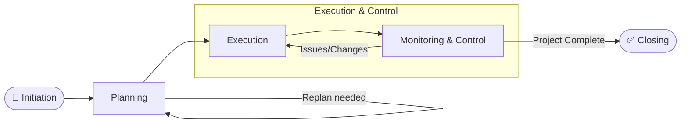

# OP04 — Project Management

> **Domain:** Operations
> **Trạng thái:** Hoàn thành
> **Level:** Intermediate
> **Prerequisites:** F01, OP01, OP03

---

## 1. Learning Objectives

Sau khi hoàn thành module này, học viên có thể:

- Giải thích 12 nguyên tắc PMBOK 7 và phân biệt với PMBOK 6 process-based approach
- So sánh và chọn methodology phù hợp: Waterfall vs Agile vs Hybrid
- Xây dựng Work Breakdown Structure (WBS) và Gantt chart
- Áp dụng Critical Path Method (CPM) để identify schedule risks
- Lập Risk Register và xây dựng Risk Response Plans
- Sử dụng Earned Value Management (EVM) để đo lường tiến độ và chi phí
- Quản lý stakeholders và thực hiện Change Control
- Nhận diện các nguyên nhân phổ biến dẫn đến thất bại dự án IT và xây dựng tại Việt Nam

---

## 2. Business Context

Project Management là kỷ luật tổ chức và quản lý nguồn lực để hoàn thành dự án đúng scope, đúng time, đúng budget.

**Tại sao Project Management quan trọng?**

Theo nghiên cứu của PMI Pulse of the Profession 2023:
- 47% dự án toàn cầu không đạt target goals
- Trung bình 13% budget bị lãng phí do poor project performance
- Tổ chức có Project Management maturity cao: 28x nhiều khả năng deliver value hơn

**Context Việt Nam:**
- Làn sóng ERP/Digital Transformation (2020–2030) tạo ra hàng nghìn dự án CNTT
- Xây dựng cơ sở hạ tầng: sân bay Long Thành, metro TP.HCM, cao tốc Bắc-Nam — các megaprojects cần PM rigor
- Thị trường PM certification: PMP holders tại VN tăng 40%/năm (PMI Vietnam Chapter)

---

## 3. Definitions

| Thuật ngữ | Định nghĩa |
|-----------|------------|
| **Project** | Nỗ lực tạm thời (có ngày bắt đầu và kết thúc) tạo ra sản phẩm, dịch vụ hoặc kết quả duy nhất |
| **Project Management** | Áp dụng kiến thức, kỹ năng, công cụ, kỹ thuật vào hoạt động dự án để đáp ứng requirements |
| **PMBOK** | Project Management Body of Knowledge — tài liệu chuẩn của PMI về PM |
| **WBS** | Work Breakdown Structure — phân rã deliverable thành các work packages nhỏ hơn |
| **Gantt Chart** | Biểu đồ cột ngang biểu diễn lịch trình dự án theo thời gian |
| **CPM** | Critical Path Method — kỹ thuật xác định chuỗi tác vụ dài nhất không có float time |
| **EVM** | Earned Value Management — phương pháp đo lường tiến độ và chi phí dự án tích hợp |
| **Risk Register** | Tài liệu lưu trữ tất cả rủi ro đã nhận diện, xác suất, impact và response plan |
| **Stakeholder** | Cá nhân hoặc tổ chức có ảnh hưởng hoặc bị ảnh hưởng bởi dự án |
| **Change Control** | Quy trình chính thức để xem xét, phê duyệt hoặc từ chối thay đổi scope/time/cost |
| **Sprint** | Timeboxed iteration trong Agile/Scrum, thường 1–4 tuần |
| **Scope Creep** | Mở rộng phạm vi dự án không được kiểm soát, không được phê duyệt chính thức |

---

## 4. Core Concepts

### 4.1 PMBOK 7 — 12 Principles

PMBOK 7 (2021) chuyển từ process-based sang principle-based:

1. **Stewardship**: PM là người quản lý tốt (steward) cho tổ chức và stakeholders
2. **Team**: Xây dựng và duy trì team hiệu quả
3. **Stakeholders**: Tương tác tích cực với stakeholders
4. **Value**: Focus vào việc deliver value, không chỉ deliverables
5. **Systems Thinking**: Dự án tồn tại trong hệ thống phức tạp
6. **Leadership**: Thể hiện hành vi leadership
7. **Tailoring**: Điều chỉnh approach cho phù hợp với context
8. **Quality**: Build quality vào processes và deliverables
9. **Complexity**: Navigate complexity
10. **Risk**: Optimize risk responses
11. **Adaptability & Resilience**: Thích nghi với thay đổi
12. **Change Management**: Enable change to achieve the envisioned future state

### 4.2 Project Lifecycle

**Traditional (Predictive/Waterfall):**
```
Initiation → Planning → Execution → Monitoring & Control → Closing
```

**Agile:**
```
Vision → Sprint 1 → Sprint 2 → Sprint N → Release
         (Plan-Build-Test-Review loop)
```

**Hybrid:**
```
Initiation & High-level Planning (Waterfall)
         ↓
Agile Sprints cho Development/Implementation
         ↓
Closing & Handover (Waterfall)
```

### 4.3 Waterfall vs Agile vs Hybrid

| Tiêu chí | Waterfall | Agile | Hybrid |
|---------|-----------|-------|--------|
| **Requirements** | Fixed, detailed upfront | Evolving, iterative | Mix |
| **Deliveries** | One big delivery at end | Incremental (sprints) | Phased |
| **Change handling** | Expensive, formal CCB | Welcome, part of process | Controlled flexibility |
| **Team size** | Any | Small (7±2) | Any |
| **Documentation** | Heavy | Light ("just enough") | Moderate |
| **Phù hợp cho** | Construction, compliance | Software, innovation | Complex IT, ERP |
| **Risk** | Front-loaded (fail late) | Distributed (fail fast) | Managed |

### 4.4 Work Breakdown Structure (WBS)

WBS là phân rã phân cấp tổng scope của dự án thành work packages có thể quản lý:

```
Level 0: Project Name
Level 1: Major Deliverables (Phases/Components)
Level 2: Sub-deliverables
Level 3: Work Packages (80-hour rule: mỗi WP ≤ 80 giờ làm việc)
Level 4: Activities/Tasks (trong schedule)
```

**WBS Dictionary:** Mô tả chi tiết từng work package: description, deliverable, responsible, estimate, acceptance criteria.

**100% Rule:** WBS phải bao gồm 100% scope của dự án — không thiếu, không dư.

### 4.5 Critical Path Method (CPM)

**Các bước thực hiện CPM:**
1. List tất cả activities và dependencies
2. Estimate duration cho từng activity
3. Xây dựng network diagram (AON: Activity On Node)
4. Tính Forward Pass: Early Start (ES) và Early Finish (EF)
5. Tính Backward Pass: Late Start (LS) và Late Finish (LF)
6. Tính Float = LS - ES (hoặc LF - EF)
7. Critical Path = chuỗi activities với Float = 0

**Ý nghĩa:** Bất kỳ delay nào trên Critical Path đều delay cả dự án. PM phải monitor và protect Critical Path.

### 4.6 Earned Value Management (EVM)

**3 chỉ số cơ bản:**
- **PV** (Planned Value): Budget được phân bổ cho công việc theo kế hoạch đến ngày hiện tại
- **EV** (Earned Value): Budget tương ứng với công việc thực tế đã hoàn thành
- **AC** (Actual Cost): Chi phí thực tế đã phát sinh

**Các chỉ số phân tích:**

| Chỉ số | Công thức | Ý nghĩa | < 1 | > 1 |
|--------|-----------|---------|-----|-----|
| **CV** (Cost Variance) | EV - AC | So sánh chi phí | Over budget | Under budget |
| **SV** (Schedule Variance) | EV - PV | So sánh tiến độ | Behind schedule | Ahead |
| **CPI** (Cost Performance Index) | EV / AC | Hiệu quả chi phí | Over budget | Under budget |
| **SPI** (Schedule Performance Index) | EV / PV | Hiệu quả tiến độ | Behind | Ahead |

**EAC** (Estimate at Completion) = BAC / CPI  
*(Dự báo tổng chi phí khi hoàn thành)*

### 4.7 Risk Management

**Risk Register Fields:**
- Risk ID, Description, Category
- Probability (Low/Medium/High)
- Impact (Low/Medium/High)
- Risk Score = Probability × Impact
- Risk Response Strategy: Avoid / Transfer / Mitigate / Accept
- Response Plan: cụ thể hành động
- Owner: ai chịu trách nhiệm
- Trigger: khi nào risk trở thành issue

**4 Response Strategies:**
- **Avoid**: Thay đổi plan để loại bỏ rủi ro
- **Transfer**: Chuyển rủi ro sang bên thứ ba (bảo hiểm, contract)
- **Mitigate**: Giảm probability hoặc impact
- **Accept**: Chấp nhận rủi ro (active: lập contingency; passive: không làm gì)

### 4.8 Stakeholder Management

**Stakeholder Analysis — Power/Interest Grid:**
```
HIGH      │  MANAGE CLOSELY  │  KEEP SATISFIED  │
POWER     │  (High Interest) │  (Low Interest)  │
          │                  │                  │
LOW       │  KEEP INFORMED   │  MONITOR         │
POWER     │  (High Interest) │  (Low Interest)  │
          └──────────────────┴──────────────────┘
                 HIGH                LOW
                INTEREST           INTEREST
```

**Stakeholder Register:** Tên, role, interest, influence, current engagement level, desired engagement level, strategy.

### 4.9 Change Control

**Change Control Board (CCB)** xem xét tất cả change requests:

1. Người yêu cầu thay đổi submit **Change Request Form**
2. PM phân tích impact: scope, schedule, cost, quality, risk
3. CCB họp để review và vote: Approve / Reject / Defer
4. Nếu approve: update project documents, communicate
5. Implement change và track

---

## 5. Business Value

| Loại giá trị | Mô tả |
|-------------|-------|
| **Deliver on time** | Structured planning giúp đạt deadline |
| **Deliver on budget** | EVM và cost control tránh overrun |
| **Deliver quality** | Quality management baked into process |
| **Manage risk** | Proactive risk identification tránh surprises |
| **Stakeholder satisfaction** | Communication planning đảm bảo alignment |
| **Organizational learning** | Lessons learned cải thiện future projects |

---

## 6. Enterprise Role

- **PMO (Project Management Office):** Governance, methodology, templates, portfolio management
- **Project Manager / PM:** Lãnh đạo team, manage triple constraint, stakeholder communication
- **Project Sponsor:** Executive champion, decision-maker, provide resources
- **Project Team:** Execute work packages
- **Steering Committee:** Strategic decisions, change approvals
- **Stakeholders:** Input requirements, provide feedback, accept deliverables

---

## 7. Departments Related

- **IT/Digital:** Chủ yếu deliver technology projects
- **Operations:** Operational change và process improvement projects
- **Finance:** Budget control, financial approval
- **HR:** Resource management, team development
- **Legal/Compliance:** Contract management, regulatory requirements
- **Procurement:** Vendor management trong project context
- **Change Management:** Organizational change component của projects

---

## 8. Input

- Project Charter (authorization để bắt đầu)
- Business Case / Feasibility Study
- Stakeholder requirements
- Organizational Process Assets (templates, lessons learned)
- Enterprise Environmental Factors (culture, IT infrastructure, market conditions)
- Resource availability (people, equipment, budget)
- Contracts (nếu có external vendors)

---

## 9. Output

- Project Management Plan (master plan với all subsidiary plans)
- Work Breakdown Structure (WBS)
- Project Schedule (Gantt chart, Network diagram)
- Risk Register
- Stakeholder Register
- Issue Log
- Change Log
- Progress Reports (weekly, monthly)
- Project Closure Report với Lessons Learned

---

## 10. Business Process

```
Project Initiation → Planning → Execution → Monitoring → Closing
```

**Initiation:**
- Develop Project Charter
- Identify Stakeholders
- Get formal authorization

**Planning:**
- Define scope → WBS
- Create schedule → Gantt, CPM
- Estimate costs → Budget
- Plan risk management → Risk Register
- Plan communications
- Plan quality, resources, procurement

**Execution:**
- Direct and manage project work
- Manage team, communications, stakeholders
- Implement approved changes

**Monitoring & Control (concurrent with Execution):**
- Track progress vs plan (EVM)
- Monitor risks
- Perform Integrated Change Control
- Validate scope (customer acceptance)

**Closing:**
- Close procurement
- Release team
- Archive project documents
- Document lessons learned
- Formal handover và sign-off

---

## 11. Data Flow

```
Requirements Gathering → Scope Document
    ↓
WBS → Activity List → Network Diagram → Schedule
    ↓
Resource Estimates → Budget Baseline
    ↓
Execution Data (actual progress, costs, issues)
    ↓
EVM Calculations (CPI, SPI, EAC)
    ↓
Status Reports → Steering Committee Decisions
    ↓
Change Requests → Approved Changes → Updated Plans
    ↓
Deliverable Acceptance → Project Closure
```

---

## 12. Money Flow

**Project Budget Components:**
- **Direct costs:** Labor (internal + external), materials, equipment, software licenses
- **Indirect costs:** Overhead, administrative support
- **Contingency reserve:** 10–20% for known-unknown risks
- **Management reserve:** 5–10% for unknown-unknown risks (controlled by Sponsor)

**Common Financial KPIs:**
- Budget at Completion (BAC)
- Actual Cost (AC) vs EV
- Cost Performance Index (CPI) — target ≥ 1.0
- Estimate at Completion (EAC)

**Project Overrun tại VN:**
- IT projects trung bình overrun 30–50%
- Construction mega-projects: 50–200% overrun (metro HN, metro HCM)

---

## 13. Document Flow

```
Business Case → Project Charter
    ↓
Project Management Plan
    ├── Scope Management Plan → WBS → WBS Dictionary
    ├── Schedule Management Plan → Gantt Chart
    ├── Cost Management Plan → Budget Baseline
    ├── Risk Management Plan → Risk Register
    ├── Communications Plan
    └── Quality Management Plan
         ↓
Weekly Status Reports
    ↓
Change Request Forms → Change Log
    ↓
Issue Log
    ↓
Project Closure Report + Lessons Learned Register
```

---

## 14. Roles

| Role | Trách nhiệm chính |
|------|------------------|
| **Project Sponsor** | Business case owner, authorize charter, resolve escalated issues |
| **Project Manager (PM)** | Plan, execute, monitor, control, close dự án |
| **Steering Committee** | Strategic oversight, major decisions, change approval |
| **PMO** | Governance, methodology, tool support |
| **Business Analyst** | Requirements, use cases, acceptance criteria |
| **Technical Lead** | Technical architecture, quality, team mentoring |
| **Team Members** | Execute work packages |
| **Change Manager** | Organizational change management |

---

## 15. Responsibilities

- **Sponsor:** Sign off charter, budget authorization, strategic decisions, political support
- **PM:** Day-to-day management, team leadership, stakeholder communication, risk management
- **Team Leads:** Manage sub-teams, technical delivery, issue escalation
- **Team Members:** Execute assigned tasks, report status accurately, raise issues early
- **Stakeholders:** Provide requirements, give timely feedback, accept deliverables, support change

---

## 16. RACI

| Hoạt động | Sponsor | PM | Steering | BA | Tech Lead | Team |
|-----------|:-------:|:--:|:--------:|:--:|:---------:|:----:|
| Project Charter | A | R | C | C | I | I |
| Project Plan | A | R | C | C | C | C |
| Requirements | C | A | I | R | C | I |
| Schedule Development | I | A | I | C | R | C |
| Risk Assessment | A | R | C | C | C | C |
| Change Request | A | R | A | C | C | I |
| Status Reporting | I | R | A | I | C | I |
| Project Closure | A | R | C | I | C | I |

*R=Responsible, A=Accountable, C=Consulted, I=Informed*

---

## 17. Frameworks

### PMBOK (PMI) — 7th Edition
- 12 principles + 8 performance domains
- Performance Domains: Stakeholders, Team, Development Approach, Planning, Project Work, Delivery, Measurement, Uncertainty

### PRINCE2 (UK Government)
- 7 Principles, 7 Themes, 7 Processes
- Strong governance focus, widely used in Europe
- PRINCE2 Agile variant

### Scrum (Agile)
- Roles: Product Owner, Scrum Master, Dev Team
- Events: Sprint, Daily Standup, Sprint Review, Sprint Retrospective
- Artifacts: Product Backlog, Sprint Backlog, Increment

### SAFe (Scaled Agile Framework)
- Agile ở scale lớn (100+ people)
- ART (Agile Release Train), PI Planning

### Hybrid Approaches
- PRINCE2 Agile
- PMI-ACP + PMBOK hybrid
- Disciplined Agile Delivery (DAD)

---

## 18. International Standards

| Chuẩn | Tổ chức | Nội dung |
|-------|---------|---------|
| **PMBOK 7** | PMI | Principles và performance domains |
| **ISO 21500:2021** | ISO | Guidance on project management |
| **PRINCE2** | Axelos | Process-based PM framework |
| **ISO 21502:2020** | ISO | Project, programme, portfolio management guidance |
| **PMP Certification** | PMI | Project Management Professional certification |
| **CAPM** | PMI | Certified Associate in PM (entry level) |
| **PSM** | Scrum.org | Professional Scrum Master |

---

## 19. Vietnam Context

**Thực trạng quản lý dự án tại Việt Nam:**

1. **Thất bại dự án IT VN:** Nhiều dự án ERP thất bại hoặc overrun nghiêm trọng do:
   - PM không có kinh nghiệm
   - Scope không được define rõ
   - Executive sponsor không active
   - Change management bị bỏ qua
   - "Big bang" implementation thay vì phased approach

2. **Xây dựng — mega-projects:**
   - Metro TP.HCM tuyến 1: 2010–2024 (14 năm), overrun 300%
   - Bài học: thiếu environmental impact assessment, scope changes liên tục, coordination issues
   - Dự án sân bay Long Thành (đang triển khai): áp dụng project governance nghiêm ngặt hơn

3. **PMI Vietnam Chapter:** Tổ chức chính thức từ 2017, hiện có 2,000+ PMP holders
   - PMP exam được tổ chức tại Hà Nội và TP.HCM
   - Preparation courses: 30–60 triệu VND

4. **Phổ biến tools:**
   - Microsoft Project (phổ biến nhất ở Enterprise VN)
   - Jira (IT projects, Agile)
   - Trello/Asana (SME, Agile)
   - Basecamp, Monday.com (growing)

5. **Agile adoption:**
   - Tech companies (VNG, FPT Software, Viettel) đã adopt Scrum/Agile
   - SME IT shops: 60–70% dùng Agile hay semi-Agile
   - Non-tech enterprise: còn phổ biến Waterfall

---

## 20. Legal Considerations

- **Luật Đầu tư công 2019:** Yêu cầu nghiêm ngặt về quản lý dự án đầu tư công
- **Nghị định 99/2021/NĐ-CP:** Quản lý, thanh toán, quyết toán vốn đầu tư công
- **Xây dựng:** Luật Xây dựng 2020, Nghị định 15/2021/NĐ-CP — yêu cầu project manager có chứng chỉ hành nghề
- **IT/Software contract:** Cần điều khoản rõ về change management, acceptance criteria, warranty
- **Labor:** Team members là nhân viên → tuân thủ Bộ Luật Lao động 2019 về overtime, chấm dứt hợp đồng
- **Data Privacy:** Dự án liên quan đến personal data → Nghị định 13/2023
- **Bản quyền phần mềm:** License compliance trong IT projects

---

## 21. Common Mistakes

1. **Skip planning để "bắt đầu làm sớm":** "Chúng ta đã có đủ info để làm rồi" → scope creep và rework tốn kém hơn nhiều

2. **Scope creep không kiểm soát:** Thêm requirement mà không assess impact → project delivery trễ, overrun

3. **PM kiêm nhiệm nhiều projects:** PM phân tán không thể monitor và manage effectively

4. **Risk Register tồn tại nhưng không được dùng:** Làm Risk Register cho đủ thủ tục rồi bỏ trong file

5. **Không có active Sponsor:** Project phát sinh issue nhưng không ai có authority giải quyết

6. **Báo cáo trạng thái không trung thực:** Culture "báo xấu = bị phạt" → issues bị giấu đến khi quá muộn

7. **Underestimate change management:** "Phần mềm đã xây xong, người dùng sẽ tự học thôi" → adoption failure

8. **Không có Lessons Learned:** Project kết thúc, team giải tán, không capture learning → repeat mistakes

9. **Bỏ qua Technical Debt:** Trong Agile, tích lũy tech debt không được address → slow down sau này

10. **One-size-fits-all methodology:** Dùng full Waterfall cho software innovation hoặc Agile cho construction

---

## 22. Best Practices

1. **Invest in planning:** Mỗi giờ planning tiết kiệm 4–6 giờ rework (PMI research)
2. **Active Sponsor:** Sponsor tham gia monthly, resolve roadblocks, communicate priority
3. **Define Done clearly:** Acceptance criteria viết rõ trước khi build
4. **Risk-driven planning:** High risks → allocate buffer, plan responses
5. **Iterative delivery:** Deliver value early và often; don't wait for big bang
6. **Transparent reporting:** Create culture of honest status reporting — no penalty for early escalation
7. **Change Control:** Ngay cả Agile project cần control scope — Product Owner role là key
8. **Communication plan:** Ai nhận thông tin gì, bao giờ, qua kênh nào — write it down
9. **Collocate team khi có thể:** Face-to-face dramatically reduces miscommunication
10. **Capture Lessons Learned throughout:** Không phải chỉ ở cuối dự án

---

## 23. KPIs

| KPI | Định nghĩa | Target |
|-----|-----------|--------|
| **Schedule Performance Index (SPI)** | EV / PV | ≥ 0.95 |
| **Cost Performance Index (CPI)** | EV / AC | ≥ 0.95 |
| **Scope Completion %** | % WBS items completed vs planned | ≥ 90% on time |
| **Change Request Rate** | Số CRs / tuần | Monitor trend (giảm theo thời gian) |
| **Risk Closure Rate** | % risks mitigated / total identified | > 80% by project end |
| **Stakeholder Satisfaction** | Survey sau project | > 4/5 |
| **On-Time Delivery Rate** | % milestones delivered on schedule | ≥ 85% |

---

## 24. Metrics

**EVM Metrics:**
- Planned Value (PV), Earned Value (EV), Actual Cost (AC)
- Cost Variance (CV), Schedule Variance (SV)
- CPI, SPI, TCPI (To-Complete Performance Index)
- EAC, VAC (Variance at Completion), ETC

**Velocity (Agile):**
- Story points completed per sprint
- Sprint burndown chart
- Release burnup chart

**Quality Metrics:**
- Defect density (defects per KLOC or per sprint)
- Test coverage %
- Rework hours
- Customer acceptance rate (% stories accepted on first demo)

---

## 25. Reports

| Báo cáo | Tần suất | Đối tượng |
|---------|---------|-----------|
| **Daily Standup Notes** | Hàng ngày | Team |
| **Weekly Status Report** | Hàng tuần | PM, Sponsor |
| **Sprint Review Report** | Mỗi sprint | Team, PO, Stakeholders |
| **Monthly Steering Report** | Hàng tháng | Steering Committee |
| **EVM Report** | Hàng tháng | Sponsor, PMO |
| **Risk Report** | Hàng tháng | Steering Committee |
| **Project Closure Report** | Khi kết thúc | Sponsor, PMO, Lessons Learned |

---

## 26. Templates

### Template 1: Project Charter

```
PROJECT CHARTER
Project Name: _______________
Project ID: _______________
Date: _______________  Version: ___

PURPOSE / BUSINESS CASE:
[Lý do dự án tồn tại, vấn đề cần giải quyết, cơ hội]

OBJECTIVES:
[SMART objectives — 3-5 điểm]

SCOPE:
In Scope: [Cụ thể những gì bao gồm]
Out of Scope: [Cụ thể những gì không bao gồm]

DELIVERABLES:
[Danh sách các sản phẩm/kết quả cụ thể]

TIMELINE:
Start Date: ___  |  End Date: ___
Key Milestones:
  - [Milestone 1]: [Date]
  - [Milestone 2]: [Date]

BUDGET: [Tổng ngân sách phê duyệt]

RISKS: [Top 3 risks at charter stage]

STAKEHOLDERS:
  Sponsor: _______________
  PM: _______________
  Key stakeholders: _______________

APPROVALS:
  Sponsor Signature: ___  Date: ___
```

### Template 2: Risk Register Entry

```
Risk ID: R-001
Description: [Mô tả rủi ro cụ thể]
Category: [Technical / Schedule / Cost / External / Operational]
Probability: [Low 1 / Medium 2 / High 3]
Impact: [Low 1 / Medium 2 / High 3]
Risk Score: [P × I = 1-9]
Priority: [High/Medium/Low]
Response Strategy: [Avoid / Transfer / Mitigate / Accept]
Response Plan: [Hành động cụ thể]
Owner: [Tên]
Status: [Open / Triggered / Closed]
Last Updated: [Date]
```

---

## 27. Checklists

### Checklist: Project Initiation
- [ ] Business case được approve
- [ ] Project Charter được viết và sign-off bởi Sponsor
- [ ] PM được assign và có đủ authority
- [ ] Stakeholders đã được identified và phân tích
- [ ] High-level scope đã được defined và agreed
- [ ] PMO notified và project registered

### Checklist: Project Planning
- [ ] Scope Statement đủ chi tiết
- [ ] WBS hoàn chỉnh (100% rule)
- [ ] Schedule với CPM đã xác định Critical Path
- [ ] Budget baseline với contingency reserve
- [ ] Risk Register với top 10 risks và response plans
- [ ] Communications Plan (ai nhận gì, bao giờ)
- [ ] Quality Plan với acceptance criteria
- [ ] Resource Plan (team, equipment, vendors)
- [ ] Project Management Plan reviewed và approved

### Checklist: Project Closure
- [ ] Tất cả deliverables đã được customer accept (sign-off)
- [ ] Contracts đã được closed (procurement)
- [ ] Team released và acknowledged
- [ ] Project documents archived
- [ ] Lessons Learned documented và shared
- [ ] Project Closure Report submitted và approved
- [ ] System/Product handed over với documentation
- [ ] Post-implementation review scheduled

---

## 28. SOP

### SOP: Quy trình Change Control (Change Request Management)

**Mục đích:** Kiểm soát thay đổi scope/schedule/budget của dự án  
**Phạm vi:** Tất cả dự án trong PMO  
**Owner:** Project Manager

**Bước 1 — Nhận Change Request (CR)**
1. Bất kỳ stakeholder nào có thể submit CR bằng Change Request Form (Template)
2. PM ghi nhận CR vào Change Log, assign CR-ID
3. Gửi xác nhận receipt cho người submit

**Bước 2 — Impact Analysis**
1. PM và Technical Lead analyze CR:
   - Impact on scope: Thêm/bớt gì?
   - Impact on schedule: Trễ bao nhiêu?
   - Impact on budget: Tốn thêm bao nhiêu?
   - Impact on risk: Rủi ro mới nào?
2. Document analysis trong CR Form
3. Timeline: 2–5 business days

**Bước 3 — CCB Review**
1. PM trình bày CR và impact analysis tại CCB meeting
2. CCB vote: Approve / Reject / Defer
3. Ghi nhận decision và rationale

**Bước 4 — Implementation (nếu Approved)**
1. Update tất cả project documents: WBS, Schedule, Budget, Risk Register
2. Communicate đến tất cả affected stakeholders
3. Update Change Log: status = Approved, implementation date

**Bước 5 — Verification**
1. Sau implementation: verify CR đã được thực hiện đúng
2. Update Change Log: status = Closed
3. Include trong Monthly Status Report

---

## 29. Case Study

### Case Study: Dự án ERP SAP B1 tại Công ty Phân phối FMCG

**Bối cảnh:** Công ty phân phối FMCG VN, 700 nhân viên, doanh thu 500 tỷ/năm. Dự án triển khai SAP Business One thay thế Excel và phần mềm kế toán cũ.

**Thông số dự án:**
- Timeline: 9 tháng
- Budget: 2.5 tỷ VND (software + consulting + hardware)
- Team: PM (1), SAP consultant (3), Business Analysts (2), IT (2), Key Users (10)

**Phase 1: Initiation & Planning (Tháng 1)**
- Project Charter được CEO ký
- 47 stakeholders identified, Steering Committee gồm CEO + CFO + COO
- WBS với 280 work packages
- Risk Register: 25 risks, top 3: Data Migration, User Adoption, Interface với Legacy

**Phase 2: Realization (Tháng 2–6)**
- Blueprint workshop: As-Is process mapping, To-Be design
- Configuration và customization
- Data cleansing (400,000 master data records)
- Tích hợp với hệ thống e-invoice (MISA)

**Sự cố Phase 3 (Tháng 7):**
- CFO yêu cầu thêm module Treasury (không có trong scope ban đầu)
- PM thực hiện Impact Analysis: +400 giờ consultant, +3 tuần timeline, +300 triệu VND
- CCB họp khẩn: Approve thêm module, revise schedule và budget

**Phase 4: Go-Live (Tháng 9)**
- User Acceptance Testing: 94 test cases, pass rate 91%
- Hypercare period: 4 tuần support intensive post go-live
- Training: 350 end users, 3 nhóm

**Kết quả:**
- Timeline: 9 → 10 tháng (delay 1 tháng do CR tháng 7)
- Budget: 2.5 tỷ → 2.85 tỷ (overrun 14%)
- User adoption rate 6 tháng sau: 88%
- Monthly closing time: từ 12 ngày → 3 ngày
- Inventory accuracy: từ 82% → 97%
- ROI payback: dự kiến 24 tháng

**Lessons Learned:**
- Scope needs to be locked more tightly with C-suite sign-off early
- Data cleansing needs to start earlier (90 days before go-live minimum)
- Change Management investment không đủ — should have been 20% of budget

---

## 30. Small Business Example

### SME: Studio thiết kế 10 người — Agile cho client projects

**Problem:** Projects bị scope creep vì client "nghĩ ra thêm" liên tục → profitability thấp.

**Giải pháp Lightweight Project Management:**
1. **Project Brief** (thay cho formal charter): 1 trang — objective, deliverables, timeline, budget, out of scope
2. **2-week sprints** với deliverables demo cho client
3. **Change Request policy:** bất cứ thứ gì ngoài brief → CR với quote mới
4. **Trello board:** Backlog → Doing → Review → Done

**Kết quả:** Scope creep giảm 70%, profitability tăng 25%, client satisfaction không giảm (thực ra tăng vì communication tốt hơn)

---

## 31. Enterprise Example

### Enterprise: Mega-project Hạ tầng Số Quốc gia

**Bối cảnh:** Dự án xây dựng hạ tầng data center quốc gia, 3 năm, 500 triệu USD, 50 vendors.

**PM Approach:**
- **Framework:** PRINCE2 kết hợp ISO 21500
- **PMO:** Dedicated PMO với 20 PM professionals
- **Governance:** Steering Committee (Bộ trưởng + CEO + CFO), monthly review
- **Schedule:** MS Project Server (1,200 activities, enterprise scheduling)
- **Risk Management:** Full risk register với 180+ risks, quarterly expert review
- **Change Control:** CCB họp mỗi 2 tuần, any change >$1M cần Minister approval

**Technology Tools:**
- MS Project Server (master schedule)
- Oracle Primavera (alternative for construction workstream)
- Power BI (executive dashboard)
- SharePoint (document management)

**Key Challenges:** Interdependencies between 50 vendors, government approval processes, technology risks

---

## 32. ERP Mapping

| PM Component | SAP | Oracle | Odoo | Standalone Tools |
|-------------|-----|--------|------|-----------------|
| Project Planning | SAP PS (Project System) | Oracle Projects | Project module | MS Project |
| Task Tracking | SAP PS | Oracle PPM | Odoo Project | Jira, Asana |
| Resource Management | SAP HR + PS | Oracle Resource Mgmt | HR + Project | Resource Guru |
| Budget Tracking | SAP CO | Oracle Projects Finance | Analytic Accounts | MS Project |
| Time Tracking | SAP CATS | Oracle Time & Labor | Timesheets | Harvest, Clockify |
| Risk | SAP GRC | Oracle Risk | No native | RiskyProject |

---

## 33. Automation

**Schedule Automation:**
- MS Project: auto-schedule với dependencies
- Jira Automation: auto-assign, auto-close subtasks

**Reporting Automation:**
- Power BI: auto-refresh từ Jira/MS Project data
- Automated weekly status report qua email
- EVM calculation automation (spreadsheet macros hoặc BI)

**Communication Automation:**
- Milestone reminder emails tự động
- Slack/Teams integration: Jira updates → channel notifications
- Automated meeting agenda từ task status

---

## 34. AI Opportunities

| Cơ hội | Mô tả | Maturity |
|--------|-------|---------|
| **AI Schedule Optimization** | AI đề xuất optimal schedule dựa trên resources và constraints | Medium |
| **Risk Prediction** | ML dự báo risk probability dựa trên project characteristics | Medium |
| **Effort Estimation** | AI estimate effort dựa trên similar past projects | Medium |
| **Document AI** | AI phân tích contracts, requirements để extract risks/scope | Medium |
| **Meeting Intelligence** | AI transcribe và summarize meetings, extract action items | High |
| **Predictive Delay Detection** | AI phát hiện early warning signs of schedule delay | Medium |
| **Chatbot PM Assistant** | NLP chatbot trả lời project status questions | Emerging |

---

## 35. Implementation Guide

### Giai đoạn 1: PMO Foundation (Tháng 1–3)
- [ ] CEO/Board approve PMO mandate
- [ ] Hire/Designate PMO Lead
- [ ] Choose PM methodology (PMBOK, PRINCE2, Agile, Hybrid)
- [ ] Develop project templates (charter, plan, status report, closure)
- [ ] Select PM tools (MS Project, Jira, Asana)
- [ ] Define project governance (categories, approval thresholds)

### Giai đoạn 2: Pilot Projects (Tháng 3–6)
- [ ] Apply new methodology to 3–5 active projects
- [ ] Train PMs on methodology and tools
- [ ] Track results vs previous approach
- [ ] Refine templates and processes

### Giai đoạn 3: Roll-out (Tháng 6–12)
- [ ] All new projects follow PMO process
- [ ] PM competency assessment và training plan
- [ ] Portfolio view — all projects visible to management
- [ ] Monthly portfolio review

### Giai đoạn 4: Maturity (Từ năm 2)
- [ ] PM certification program (PMP, PSM)
- [ ] PM competency framework
- [ ] Lessons Learned database
- [ ] PM Community of Practice

---

## 36. Consulting Guide

**Khi nào cần PM Consulting?**
- Dự án ERP/Digital Transformation lớn (>500 triệu VND)
- Project recovery (dự án đang trễ/overrun)
- PMO setup
- PM training và certification prep

**Discovery Questions:**
1. "Dự án quan trọng nhất năm nay của bạn là gì? Ai là PM? Có full-time không?"
2. "Tỷ lệ projects đã deliver đúng hạn và đúng budget trong 3 năm qua?"
3. "Khi có scope change, quy trình xử lý như thế nào?"
4. "PM có project charter không? Ai signed off?"
5. "C-level có participate vào steering committee không?"

**Typical Engagement:**
- PMO Assessment: 1–2 tuần, 50–100 triệu VND
- PMO Setup: 3–6 tháng, 200–500 triệu VND
- Project Recovery Consulting: Duration = remaining project duration, 30–80 triệu VND/tháng

---

## 37. Diagnostic Questions

1. Bao nhiêu % dự án trong 3 năm qua được deliver đúng hạn và đúng budget?
2. Có PMO không? PMO có authority gì với PM và projects?
3. Dự án có Project Charter không? Được sign off bởi cấp nào?
4. Scope creep được xử lý như thế nào? Có formal change control không?
5. PM có thời gian full-time cho dự án không hay kiêm nhiệm nhiều roles?
6. Risk management được thực hành như thế nào? Risk Register được review bao lâu một lần?
7. Sponsor có active trong dự án không hay chỉ ký charter rồi biến mất?
8. Khi dự án gặp issue, escalation process như thế nào?
9. Lessons learned có được capture và shared không?
10. Team có được đào tạo PM methodology không?

---

## 38. Interview Questions

**Cho Project Manager:**
1. "Giải thích EVM và cách bạn dùng CPI/SPI để forecast project outcome"
2. "Mô tả cách bạn handle scope creep khi Sponsor yêu cầu thêm feature mid-project"
3. "Critical Path là gì? Nếu critical path bị delay 2 tuần, bạn làm gì?"
4. "Cho ví dụ về risk response strategy cho 4 loại: Avoid, Transfer, Mitigate, Accept"
5. "Bạn sẽ manage một stakeholder quan trọng nhưng không cooperative như thế nào?"

**Cho PMO Manager / Program Manager:**
1. "Bạn sẽ build PMO từ đầu như thế nào? Governance model nào bạn chọn?"
2. "Waterfall vs Agile — khi nào bạn chọn cái nào? Hybrid approach là gì?"
3. "Mô tả cách bạn report portfolio status cho C-Level"
4. "PM maturity model — organization bạn đang ở level mấy? Cần làm gì để lên tiếp?"

---

## 39. Exercises

**Exercise 1: WBS (Beginner)**
Xây dựng WBS cho dự án "Tổ chức sự kiện công ty cuối năm 200 người". Đảm bảo 100% rule, ít nhất 3 levels, mỗi leaf node ≤ 40 giờ công.

**Exercise 2: CPM (Intermediate)**
Cho danh sách 10 activities với dependencies và durations. Vẽ network diagram, tính Forward/Backward Pass, xác định Critical Path và total project duration.

**Exercise 3: EVM Analysis (Intermediate)**
Dự án 6 tháng, BAC = 600 triệu VND. Sau tháng 3:
- PV = 300 triệu, EV = 270 triệu, AC = 310 triệu
Tính: CV, SV, CPI, SPI, EAC. Dự án đang trong tình trạng gì? Đề xuất action.

**Exercise 4: Risk Register (Intermediate)**
Cho một dự án ERP implementation. Identify và document 10 risks: Risk ID, Description, Probability (1-3), Impact (1-3), Score, Response Strategy, Response Plan, Owner.

**Exercise 5: Case Analysis (Advanced)**
Đọc case study về một dự án thất bại (giảng viên cung cấp hoặc research online). Phân tích: 5 nguyên nhân PM failures, what should have been done differently, và lessons learned.

---

## 40. References

**Sách:**
- PMI — *PMBOK Guide — 7th Edition* (PMI, 2021)
- Schwaber, K. & Sutherland, J. — *The Scrum Guide* (free tại scrumguides.org)
- Kerzner, H. — *Project Management: A Systems Approach* (12th Ed., Wiley, 2017)
- Kim, G. et al. — *The Phoenix Project* (IT Ops novel)

**Certifications:**
- PMP (PMI): https://www.pmi.org/certifications/project-management-pmp
- PSM I (Scrum.org): https://www.scrum.org/assessments/professional-scrum-master-i-certification
- CAPM (PMI): Entry-level PM certification

**Vietnam:**
- PMI Vietnam Chapter: https://pmi.org.vn
- Chứng chỉ GXDCT (Giám sát xây dựng): Bộ Xây dựng

**Tools:**
- MS Project: https://www.microsoft.com/en-us/microsoft-365/project
- Jira: https://www.atlassian.com/software/jira
- Asana: https://asana.com

---

## Output Formats

### Mermaid Diagram — Project Lifecycle



### ASCII Diagram — Earned Value Management

```
COST ($)
  │
  │         EAC (projected)
  │       /
  │      / AC (actual cost)
  │     / 
  │    /   PV (planned)
  │   /  / 
  │  / /EV (earned value)
  │ //
  │/
  └──────────────────────── TIME
      Today
      
  CV = EV - AC  (negative = over budget)
  SV = EV - PV  (negative = behind schedule)
  CPI = EV/AC   (< 1 = over budget)
  SPI = EV/PV   (< 1 = behind schedule)
```

### Flashcards

**Flashcard 1**
Q: Earned Value Management (EVM) — 3 chỉ số cơ bản và ý nghĩa của CPI < 1?
A:
- **PV** (Planned Value): Ngân sách được lên kế hoạch cho công việc đến hôm nay
- **EV** (Earned Value): Ngân sách tương ứng với công việc đã thực sự hoàn thành
- **AC** (Actual Cost): Chi phí thực tế đã chi ra
**CPI = EV / AC < 1**: Project đang over budget. Với mỗi 1 đồng chi ra, chỉ nhận được < 1 đồng giá trị.
**Ví dụ**: PV=300tr, EV=270tr, AC=310tr → CPI=0.87 (chi 310tr nhưng chỉ làm được 270tr công việc) → đang overrun 13%

**Flashcard 2**
Q: Sự khác biệt giữa Waterfall, Agile và Hybrid Project Management?
A:
- **Waterfall**: Requirements fixed upfront → sequential phases → one delivery at end. Phù hợp: construction, compliance, stable requirements
- **Agile**: Iterative sprints → incremental delivery → requirements evolve. Phù hợp: software, innovation, uncertain requirements
- **Hybrid**: Formal charter và planning (waterfall) + iterative development (agile) + formal closure (waterfall). Phù hợp: ERP implementation, large digital transformation
**Key insight**: Agile không có "no planning" — nó có sprint planning, PI planning (SAFe). The difference is granularity and flexibility.

**Flashcard 3**
Q: 4 chiến lược Response cho Risk là gì? Cho ví dụ thực tế cho mỗi loại?
A:
1. **Avoid**: Thay đổi kế hoạch để loại bỏ rủi ro hoàn toàn
   Ví dụ: Không triển khai module X vì risk quá cao, delay sang phase 2
2. **Transfer**: Chuyển rủi ro sang bên thứ ba
   Ví dụ: Mua insurance, fixed-price contract với vendor (vendor nhận risk overrun)
3. **Mitigate**: Giảm probability hoặc impact
   Ví dụ: Prototype trước để giảm technical risk; tăng test coverage; hire experienced consultant
4. **Accept**: Chấp nhận rủi ro xảy ra
   - Active accept: Lập contingency budget/plan
   - Passive accept: Không làm gì, deal with it if it happens (chỉ cho low-risk items)

### Cheat Sheet — Project Management Quick Reference

```
╔══════════════════════════════════════════════════════════╗
║         PROJECT MANAGEMENT CHEAT SHEET                   ║
╠══════════════════════════════════════════════════════════╣
║ LIFECYCLE              │ EVM METRICS                     ║
║ Initiation: Charter    │ CPI = EV/AC (>1=under budget)   ║
║ Planning: WBS+Schedule │ SPI = EV/PV (>1=ahead schedule) ║
║ Execution: Deliver     │ CV = EV-AC (+= under budget)    ║
║ Monitor: EVM+Risk      │ SV = EV-PV (+= ahead schedule)  ║
║ Closing: Lessons Lrnd  │ EAC = BAC/CPI                   ║
╠══════════════════════════════════════════════════════════╣
║ RISK MATRIX           │ STAKEHOLDER GRID                 ║
║ H │ Med │ High │ Crit │ High Power + High Interest       ║
║ M │ Low │ Med  │ High │   → MANAGE CLOSELY               ║
║ L │ Low │ Low  │ Med  │ High Power + Low Interest        ║
║   │  L  │   M  │  H   │   → KEEP SATISFIED               ║
║   IMPACT              │ Low Power + High Interest        ║
║                        │   → KEEP INFORMED               ║
╠══════════════════════════════════════════════════════════╣
║ CHANGE CONTROL: Submit CR → Impact Analysis →            ║
║ CCB Review → Approve/Reject → Implement → Verify         ║
╚══════════════════════════════════════════════════════════╝
```

### JSON Metadata

```json
{
  "module": {
    "code": "OP04",
    "name": "Project Management",
    "domain": "Operations",
    "level": "Intermediate",
    "estimated_study_hours": 14,
    "prerequisites": ["F01", "OP01", "OP03"],
    "related_modules": ["OP01", "OP02", "OP03", "OP05", "S02"],
    "key_concepts": [
      "PMBOK 7 Principles",
      "Project Lifecycle",
      "Waterfall vs Agile vs Hybrid",
      "WBS",
      "Critical Path Method",
      "Earned Value Management",
      "Risk Register",
      "Stakeholder Management",
      "Change Control"
    ],
    "tools": ["MS Project", "Jira", "Asana", "Monday.com", "Oracle Primavera"],
    "standards": ["PMBOK 7", "PRINCE2", "Scrum", "ISO 21500", "SAFe"],
    "certifications": ["PMP", "CAPM", "PSM", "PRINCE2 Practitioner"],
    "vietnam_relevance": "very_high",
    "vietnam_notes": "Critical skill for ERP/digital transformation projects; construction megaprojects; PMI Vietnam Chapter growing; common IT project failures in VN",
    "last_updated": "2026-06-30",
    "tags": ["project-management", "pmbok", "agile", "scrum", "wbs", "evm", "risk", "waterfall"]
  }
}
```
