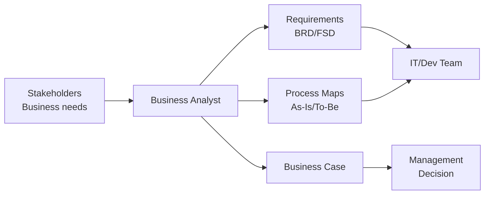

# OP05 — Business Analysis
> *Phân tích nghiệp vụ: từ elicitation đến business case và gap analysis*

---

## 1. Learning Objectives

- Hiểu vai trò và trách nhiệm của Business Analyst (BA)
- Thực hiện requirements elicitation bằng nhiều kỹ thuật
- Viết requirements rõ ràng (functional & non-functional)
- Xây dựng Business Case và Cost-Benefit Analysis
- Thực hiện Gap Analysis và Feasibility Study

---

## 2. Business Context

Business Analysis là **cầu nối giữa nghiệp vụ và công nghệ** — BA hiểu vấn đề của business và translate thành requirements cho IT/Product team.

Khi không có BA tốt: Requirements mơ hồ → Developers build sai → Rework tốn kém → Project trễ. Nghiên cứu cho thấy 70% project IT thất bại do requirements kém.

**Tại VN:** BA là role đang tăng trưởng nhanh, đặc biệt trong ERP, banking IT, fintech. Nhiều BA VN kiêm luôn PM/QA trong các project nhỏ.

---

## 3. Definitions

| Thuật ngữ | Định nghĩa |
|-----------|-----------|
| **Business Analyst (BA)** | Người phân tích nhu cầu business và định nghĩa requirements |
| **Requirements Elicitation** | Quá trình thu thập requirements từ stakeholders |
| **Functional Requirements** | Những gì hệ thống phải làm |
| **Non-functional Requirements** | Hệ thống phải làm như thế nào (performance, security) |
| **Use Case** | Mô tả tương tác giữa actor và hệ thống |
| **User Story** | Requirements dưới dạng narrative (xem MK05) |
| **Gap Analysis** | So sánh trạng thái hiện tại vs mong muốn |
| **Business Case** | Lý do kinh doanh cho một dự án/quyết định đầu tư |
| **BABOK** | Business Analysis Body of Knowledge — chuẩn của IIBA |
| **Feasibility Study** | Đánh giá tính khả thi của giải pháp |

---

## 4. Core Concepts

### 4.1 BA trong dự án

```
Business Stakeholders ←→ BUSINESS ANALYST ←→ IT / Product Team
        ↑                      ↑                      ↑
  "Chúng tôi cần..."     "Cụ thể là..."         "Chúng tôi sẽ build..."
```

### 4.2 Requirements Elicitation Techniques

```
TECHNIQUE          KHI NÀO DÙNG
─────────────────────────────────────────────────────
Interviews         Hiểu sâu 1 stakeholder, complex domain
Workshops          Align nhiều stakeholders, brainstorm
Observation        Hiểu actual workflow (không phải stated)
Document Analysis  Baseline existing processes
Surveys            Nhiều stakeholders, quantitative data
Prototyping        Validate UI/UX requirements sớm
Use Cases          Functional requirements phức tạp
```

### 4.3 Requirements Types (BABOK)

```
Business Requirements:    Mục tiêu tổ chức muốn đạt được
Stakeholder Requirements: Nhu cầu của từng nhóm stakeholder
Solution Requirements:
  Functional:  "Hệ thống phải tính VAT tự động"
  Non-functional: "Response time < 2 giây, uptime 99.9%"
Transition Requirements: Yêu cầu cho quá trình chuyển đổi
```

### 4.4 Gap Analysis Framework

```
CURRENT STATE (AS-IS):        TARGET STATE (TO-BE):
  Processes                     Optimized processes
  Systems                       New systems
  Data                          Clean data
  People/Skills                 Trained staff
         ↓                              ↓
              GAP = TO-BE minus AS-IS
              ↓
         INITIATIVES to close gap:
           - Process redesign
           - System implementation
           - Training programs
           - Data migration
```

### 4.5 Business Case Structure

```
1. EXECUTIVE SUMMARY: Tóm tắt 1 trang
2. PROBLEM/OPPORTUNITY: Vấn đề hoặc cơ hội là gì?
3. OPTIONS ANALYSIS: Ít nhất 3 options (bao gồm do-nothing)
4. RECOMMENDED OPTION: Lý do lựa chọn
5. COSTS: One-time + Ongoing costs
6. BENEFITS: Tangible (đo được) + Intangible
7. ROI / NPV / Payback Period
8. RISKS: Top 5 risks + mitigation
9. TIMELINE: High-level roadmap
10. ASSUMPTIONS & DEPENDENCIES
```

### 4.6 Use Case Diagram và Specification

```
Use Case Diagram (UML):
  Actor ──── [Use Case 1]
              [Use Case 2]
              [Use Case 3]

Use Case Specification:
  UC01: Tạo đơn hàng
  Actor: Sales Rep
  Precondition: Đã login, customer tồn tại
  Main Flow:
    1. Sales nhập thông tin khách hàng
    2. Chọn sản phẩm và số lượng
    3. System tính giá + thuế
    4. Sales confirm → order created
  Alternative Flow:
    3a. Hết hàng → System thông báo, suggest alternative
  Postcondition: Order saved, notification sent
```

---

## 5. Business Value

| Ứng dụng | Kết quả |
|---------|---------|
| Good requirements | Giảm rework 40-60% |
| Gap analysis | Roadmap rõ ràng cho transformation |
| Business case | Justified investment decisions |
| Use cases | Shared understanding dev + business |

---

## 6. Enterprise Role

- **Business Analyst:** Requirements, process analysis, documentation
- **Senior BA / Lead BA:** Complex projects, mentoring
- **Business Architect:** Higher-level capability/process design (B02)
- **Product Owner:** In Agile, BA role combined với PO

---

## 7. Departments Related

IT · Operations · Finance · All Business Units (as stakeholders)

---

## 8. Input

- Stakeholder interviews và workshops
- Existing process documentation
- Pain point list từ users
- Business strategy và objectives
- System documentation (current)

---

## 9. Output

- Business Requirements Document (BRD)
- Functional Specification Document (FSD)
- Use Cases / User Stories
- Process maps (As-Is và To-Be)
- Gap Analysis report
- Business Case

---

## 10. Business Process

```
1. Stakeholder identification và analysis
2. Elicitation (interviews, workshops, observation)
3. Documentation (requirements, process maps)
4. Analysis (gap, feasibility)
5. Validation (review với stakeholders)
6. Baseline (approved requirements)
7. Change management (requirements changes during project)
8. Post-implementation review
```

---

## 11. Data Flow

```
Stakeholder knowledge (tacit) → Elicitation → Requirements (explicit)
Current system data → As-Is mapping → Gap → To-Be design
Business objectives → Business Case → Investment decision
```

---

## 12. Money Flow

BA activities directly impact project ROI:
- Correct requirements → Less rework → Lower project cost
- Good business case → Better investment decisions
- Gap analysis → Prioritized spend on highest-value gaps

---

## 13. Document Flow

```
Business Strategy → Business Case (BA creates)
                 → BRD (BA creates)
                 → FSD (BA + Tech creates)
                 → Test Cases (QA creates from requirements)
                 → User Manuals (BA + Tech creates)
```

---

## 14. Roles

| Vai trò | Trách nhiệm |
|---------|------------|
| BA | Requirements elicitation, documentation, analysis |
| Business Sponsor | Approve business case, scope |
| Subject Matter Expert (SME) | Domain knowledge input |
| Product Owner | Prioritize backlog (Agile) |
| Developer | Technical feasibility input |

---

## 15. Responsibilities

- BA chịu trách nhiệm về **quality of requirements** — đủ rõ để build đúng
- BA không phải người quyết định scope — đó là Business Sponsor
- BA là facilitator, không phải decision maker

---

## 16. RACI

| Hoạt động | Sponsor | BA | Tech Lead | SME |
|-----------|:-------:|:--:|:---------:|:---:|
| Elicitation | C | A | I | R |
| Requirements doc | I | A | C | C |
| Gap analysis | C | A | C | C |
| Business case | A | R | C | C |
| Requirements sign-off | A | R | I | C |

---

## 17. Frameworks

- **BABOK v3** — IIBA Business Analysis Body of Knowledge
- **Agile BA** — Requirements trong Agile context
- **BPMN 2.0** — Process modeling (xem OP01)
- **UML** — Use Case, Class, Sequence diagrams
- **TOGAF** — BA trong Enterprise Architecture context

---

## 18. International Standards

- **BABOK v3** — IIBA (International Institute of Business Analysis)
- **ISO/IEC 29148** — Requirements engineering
- **PMBOK** — Requirements trong project management

---

## 19. Vietnam Context

**BA tại VN:**
- Phổ biến nhất trong: Banking IT, ERP implementation, Fintech, E-commerce
- Nhiều BA VN kiêm PM hoặc QA trong project nhỏ
- Salary range: 15-40tr/tháng (junior-senior), 40-80tr (lead BA/consultant)
- Certifications: CBAP (IIBA), PMI-PBA, ECBA phổ biến tại VN

**Thách thức:**
- "Viết spec xong rồi developer tự hiểu" — assumption nguy hiểm
- BA bị bỏ qua trong project nhỏ → requirements viết bởi developer hoặc PM
- Requirements change liên tục → thiếu change control process

---

## 20. Legal Considerations

- **NĐ 13/2023 (PDPA):** Requirements cho system xử lý personal data phải có privacy by design
- **Luật An Ninh Mạng 2018:** Requirements cho banking/gov systems có thêm security requirements
- **ISO 27001:** Security requirements phải được specify rõ

---

## 21. Common Mistakes

1. **"Requirements đủ rồi":** Assumptions không được document
2. **No non-functional requirements:** "Hệ thống phải nhanh" — cụ thể là bao nhiêu?
3. **Stakeholder bị bỏ qua:** Một nhóm user không được phỏng vấn
4. **Gold plating:** Thêm features không ai yêu cầu
5. **Requirements baseline sớm quá:** Trước khi đủ stakeholders sign-off
6. **Không có traceability:** Không biết requirement này test case nào

---

## 22. Best Practices

- **5 Whys technique** — tìm root cause, không phải symptom
- **Prototype nhanh** — đặc biệt cho UI requirements
- **Sign-off từng phase** — không để requirements float mãi
- **Requirements traceability matrix** — từ requirement đến test case đến user story
- **"As-Is trước To-Be"** — hiểu current state trước khi design future

---

## 23. KPIs

| KPI | Benchmark |
|-----|-----------|
| **Requirements stability** | < 20% change sau baseline |
| **Defects from requirements** | < 10% defects từ unclear requirements |
| **Stakeholder satisfaction** | > 80% approve requirements |
| **Elicitation coverage** | 100% identified stakeholders interviewed |

---

## 24. Metrics

- Requirements change request volume
- Time from elicitation to approved BRD
- Rework due to requirements issues

---

## 25. Reports

- **Requirements Traceability Matrix** (throughout project)
- **Change Request Log** (per change)
- **Business Case** (pre-project approval)
- **Post-implementation Review** (lessons learned)

---

## 26. Templates

**Requirements Specification (simplified):**
```
REQ-ID: [code]
Type: Functional / Non-functional
Priority: Must Have / Should Have / Could Have / Won't Have (MoSCoW)
Description: [What the system must do]
Acceptance Criteria: [How we know it's done]
Source: [Stakeholder/workshop date]
Status: Draft / Review / Approved / Implemented
```

---

## 27. Checklists

**Requirements review checklist:**
- [ ] Mỗi requirement có unique ID?
- [ ] Không có ambiguous words ("flexible", "user-friendly", "fast")?
- [ ] Non-functional requirements có numbers cụ thể?
- [ ] Tất cả stakeholders đã review?
- [ ] Conflicts giữa requirements đã được resolved?
- [ ] Traceability to business objectives?

---

## 28. SOP

**Requirements Elicitation Workshop (3 giờ):**
```
Trước: BA chuẩn bị agenda, question list, current-state docs
  
Giờ 1: Context setting
  - Mục tiêu dự án
  - Scope và boundaries
  - As-Is process walkthrough

Giờ 2: Problem identification và requirements
  - Pain points brainstorm (sticky notes)
  - Group và prioritize
  - Draft functional requirements

Giờ 3: Validation và next steps
  - Review draft requirements
  - Identify gaps cần follow-up
  - Agree on next steps

Sau: BA document và distribute cho review
```

---

## 29. Case Study

**ERP Implementation tại Công ty FMCG VN (200 nhân viên):**

Project: Triển khai Odoo thay cho Excel + phần mềm kế toán standalone.

**BA activities:**
- Phỏng vấn 15 stakeholders (kế toán, kho, sales, CEO)
- Process mapping: Order-to-Cash, Procure-to-Pay, Record-to-Report
- Gap analysis: 47 gaps giữa standard Odoo và current process
- Business case: ROI 180% trong 3 năm (giảm nhân công, lỗi, thời gian báo cáo)

**Kết quả:** 12/47 gaps cần customization (custom module), 35 gaps resolve qua process change. Project on-time và on-budget nhờ requirements rõ ràng.

---

## 30. Small Business Example

**Tiệm bán lẻ online muốn xây website thương mại:**

BA approach cho SME (không thuê BA chính thức):
```
Bước 1: Chủ shop tự viết "wish list" — 30 features
Bước 2: Group thành: Must (10), Should (12), Nice (8)
Bước 3: Estimate cost/effort cho từng nhóm
Bước 4: MVP = Must + 3 Should quan trọng nhất
Bước 5: Prototype wireframe → Validate với chủ shop trước khi dev
```

---

## 31. Enterprise Example

**Vietcombank — Core Banking Replacement:**

Project multi-year thay thế core banking system. BA team 20+ người.

**Requirements approach:**
- Process map toàn bộ nghiệp vụ ngân hàng (500+ processes)
- Tạo Requirements Repository (IBM Doors)
- 3,000+ requirements, phân loại theo module
- Traceability matrix: requirements → test cases → UAT scripts
- Change control board (CCB) approve mọi changes

---

## 32. ERP Mapping

| BA Deliverable | ERP Connection |
|---------------|---------------|
| Process maps | ERP workflow configuration |
| Data requirements | ERP data model, migration |
| Integration requirements | ERP API/interface design |
| Report requirements | ERP reporting configuration |

---

## 33. Automation Opportunities

- **Requirements management tools:** Jira, Azure DevOps, IBM Doors
- **Process mining:** Celonis discover actual processes từ system logs
- **AI-assisted documentation:** Draft requirements từ meeting transcripts

---

## 34. AI Opportunities

- **Requirements generation:** AI draft user stories từ business objectives
- **Conflict detection:** AI identify contradictory requirements
- **Impact analysis:** AI predict impact khi một requirement changes
- **Meeting transcription + extraction:** AI extract requirements từ workshop recordings

---

## 35. Implementation Guide

**Thiết lập BA practice:**
```
Tháng 1: Foundation
  - BA role description và responsibilities
  - Requirements template standard
  - Tool selection (Confluence, Jira, Word)

Tháng 2-3: Process
  - Elicitation workshop guide
  - Requirements review process
  - Sign-off workflow

Tháng 4+: Mature
  - Requirements repository
  - Traceability matrix
  - Lessons learned database
```

---

## 36. Consulting Guide

**BA engagement diagnostic:**
1. Có BRD document cho projects hiện tại không?
2. Requirements có được stakeholders sign-off không?
3. Có bao nhiêu % rework do requirements issues?
4. Có change control process cho requirements không?
5. BA và Developer có đang talk thường xuyên không?

---

## 37. Diagnostic Questions

1. Requirements hiện tại của dự án được store ở đâu?
2. Khi requirements thay đổi, có ai review impact không?
3. Developers có hỏi BA nhiều câu hỏi clarification không? (Nếu nhiều → requirements unclear)
4. Có stakeholder nào chưa được consult trong requirements phase?

---

## 38. Interview Questions

- "Mô tả quy trình elicitation của bạn cho một dự án ERP."
- "Functional vs non-functional requirements — phân biệt và cho ví dụ."
- "Stakeholder không đồng ý với requirements — bạn xử lý thế nào?"

---

## 39. Exercises

**Bài 1:** Viết 5 functional requirements và 3 non-functional requirements cho module "Đặt lịch hẹn" của app khám bệnh online VN.

**Bài 2:** Thực hiện Gap Analysis cho một công ty bán lẻ đang dùng Excel quản lý bán hàng muốn chuyển sang Odoo. Xác định 5 gaps chính và đề xuất cách đóng.

**Bài 3:** Viết Business Case 1 trang cho việc mua phần mềm HR (Base.vn) cho công ty 80 nhân viên hiện đang quản lý HR bằng Excel.

---

## 40. References

- **Sách:** *A Guide to the Business Analysis Body of Knowledge (BABOK v3)* — IIBA
- **Sách:** *Requirements Engineering Fundamentals* — Pohl & Rupp
- **Certification:** ECBA, CCBA, CBAP (IIBA)
- **VN:** Vietnam BA community (LinkedIn, Facebook groups)

---

## Output Formats

### Mermaid — BA trong dự án


### Flashcards
```
Q: Functional vs Non-functional requirements?
A: Functional: "Hệ thống phải làm gì?" → "Tính VAT tự động trên invoice"
   Non-functional: "Hệ thống hoạt động như thế nào?" → "Response < 2s, uptime 99.9%"
   Non-functional thường bị bỏ qua → dẫn đến performance issues sau go-live.

Q: Gap Analysis là gì?
A: So sánh AS-IS (trạng thái hiện tại) với TO-BE (trạng thái mong muốn).
   Gap = TO-BE - AS-IS = những gì cần thay đổi.
   Output: Danh sách initiatives (project, process change, training) để đóng gaps.

Q: MoSCoW method là gì?
A: Cách phân loại requirements theo priority:
   Must Have: Bắt buộc, không có = fail
   Should Have: Quan trọng nhưng có workaround
   Could Have: Nice to have, bỏ nếu hết thời gian
   Won't Have (this time): Ngoài scope kỳ này
```

### Cheat Sheet
```
══════════════════════════════════════
      BUSINESS ANALYSIS CHEAT SHEET
══════════════════════════════════════
ELICITATION TECHNIQUES:
  Interviews | Workshops | Observation
  Document Analysis | Prototyping | Survey

REQUIREMENTS TYPES:
  Business → Stakeholder → Solution
  Functional (what) vs Non-functional (how)

GAP ANALYSIS:
  AS-IS → GAP → TO-BE → INITIATIVES

BUSINESS CASE:
  Problem → Options → Recommended → Costs
  Benefits → ROI → Risks → Timeline

MoSCoW PRIORITY:
  Must / Should / Could / Won't
══════════════════════════════════════
```

### JSON Metadata
```json
{
  "module_code": "OP05",
  "module_name": "Business Analysis",
  "domain": "Operations",
  "level": "Intermediate-Advanced",
  "version": "1.0",
  "status": "complete",
  "prerequisites": ["F05", "B02", "OP01"],
  "related_modules": ["OP01", "OP04", "ERP01", "B02"],
  "learning_time_hours": 10,
  "key_frameworks": ["BABOK v3", "MoSCoW", "Use Cases", "UML", "Gap Analysis"],
  "key_standards": ["ISO/IEC 29148", "BABOK v3"],
  "vietnam_specific": true,
  "tags": ["business-analysis", "BA", "requirements", "gap-analysis", "business-case", "use-cases"]
}
```
