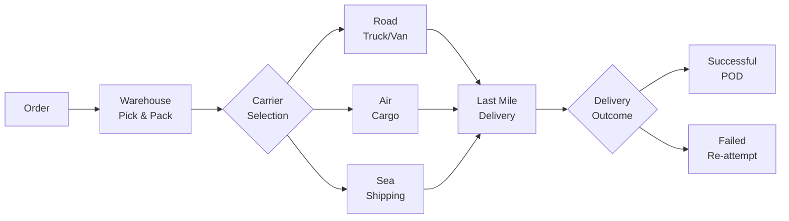

# LG01 — Logistics Management
> *Quản lý logistics: vận tải, kho bãi, last-mile và chi phí logistics*

---

## 1. Learning Objectives

- Hiểu cấu trúc hệ thống logistics và các thành phần chính
- Phân tích và lựa chọn phương thức vận tải phù hợp
- Tính toán và tối ưu logistics cost
- Hiểu mô hình 3PL/4PL và khi nào outsource logistics
- Quản lý last-mile delivery trong e-commerce

---

## 2. Business Context

Logistics là **quá trình lập kế hoạch, triển khai và kiểm soát dòng chảy của hàng hóa, dịch vụ và thông tin từ điểm xuất phát đến điểm tiêu thụ**.

**Tại VN:** Chi phí logistics chiếm ~20% GDP (cao hơn nhiều so với 8-10% của các nước phát triển) — là cơ hội lớn cho cải thiện hiệu quả. Hạ tầng logistics đang phát triển nhanh (cảng Cái Mép, sân bay Long Thành, các ICD).

---

## 3. Definitions

| Thuật ngữ | Định nghĩa |
|-----------|-----------|
| **Logistics** | Quản lý dòng chảy hàng hóa, thông tin từ nguồn đến đích |
| **3PL** | Third-Party Logistics — outsource logistics cho bên thứ ba |
| **4PL** | Fourth-Party Logistics — quản lý toàn bộ supply chain |
| **Last-mile delivery** | Chặng cuối giao hàng đến tay người nhận |
| **Cross-docking** | Chuyển hàng trực tiếp từ inbound đến outbound, không lưu kho |
| **Freight** | Hàng hóa vận chuyển (cargo) |
| **LTL** | Less-than-Truckload — ghép hàng chưa đủ xe |
| **FTL** | Full Truckload — thuê nguyên xe |
| **Intermodal** | Vận chuyển sử dụng nhiều phương thức kết hợp |
| **Reverse Logistics** | Logistics ngược (hàng trả, thu hồi, tái chế) |

---

## 4. Core Concepts

### 4.1 5 Thành phần Logistics

```
1. TRANSPORTATION:   Vận chuyển hàng hóa (đường bộ, sắt, biển, hàng không)
2. WAREHOUSING:      Lưu trữ hàng hóa (xem LG04)
3. INVENTORY:        Quản lý tồn kho (xem MF05)
4. PACKAGING:        Đóng gói bảo vệ và vận chuyển
5. INFORMATION FLOW: Tracking, documentation, communication
```

### 4.2 Phương thức vận tải so sánh

```
MODE      SPEED    COST    CAPACITY  BEST FOR
────────────────────────────────────────────────────
Đường bộ  Medium   Medium  Medium    Short/mid haul, door-to-door
Đường sắt Slow     Low     High      Heavy, bulk, long distance
Đường biển Very slow Very low Very high International, bulk
Hàng không Very fast Very high Low   Urgent, high-value, perishable
Đường sông Slow     Low     Medium   Inland, bulk (Mekong Delta VN)

MULTIMODAL: Kết hợp các mode → optimize cost + speed
```

### 4.3 Freight Rate Components

```
ĐƯỜNG BỘ:
  Cước vận chuyển = Base rate × Distance × Weight/Volume
  Phụ phí: Nhiên liệu (fuel surcharge), chờ đợi, đặc biệt

ĐƯỜNG BIỂN (International):
  Ocean Freight + BAF (Bunker Adjustment) + CAF (Currency)
  + Terminal Handling + Documentation + Insurance

ĐƯỜNG HÀNG KHÔNG:
  Air freight rate × Chargeable Weight
  Chargeable Weight = MAX(Actual weight, Volumetric weight)
  Volumetric = L×W×H (cm) / 6000
```

### 4.4 Logistics Cost Structure

```
LOGISTICS COST BREAKDOWN (Điển hình):
  Transportation:     45-55%
  Warehousing:        20-25%
  Inventory carrying: 15-20%
  Administration:     5-10%

VN SPECIFIC (2024):
  Logistics cost / GDP: ~20% (vs global average 8-10%)
  Cause: Fragmented trucking market, poor infrastructure,
         high proportion of road vs rail/sea
```

### 4.5 3PL vs 4PL vs In-house

```
IN-HOUSE LOGISTICS:
  Pros: Control, brand experience, data
  Cons: High capex, management complexity, inflexible
  Best for: High volume, differentiated delivery experience

3PL (Third-Party Logistics):
  Outsource transport và/hoặc warehousing
  Provider: J&T, Giao Hàng Nhanh, BEST Express, DHL, FedEx
  Pros: Flexible, no capex, expertise
  Cons: Less control, potential service issues

4PL (Lead Logistics Provider):
  Quản lý toàn bộ supply chain, coordinating multiple 3PLs
  Pros: Integrated view, strategic optimization
  Best for: Complex multi-country supply chains
```

### 4.6 Last-Mile Delivery — E-commerce VN

```
LAST-MILE CHALLENGES:
  Traffic congestion (HCM, HN) → Delivery time unpredictable
  Address system → Khó tìm địa chỉ, không có số nhà rõ
  Cash on delivery (COD) → 70%+ orders VN are COD → return risk
  Failed delivery → 15-20% attempts fail first time

SOLUTIONS:
  Smart routing: AI-optimized delivery routes
  Real-time tracking: Customer can track order live
  Flexible time slots: Customer chọn giờ giao
  PUDO (Pick-up/Drop-off) points: Giảm last-mile cost
  Drone/robot delivery: Thử nghiệm tại các khu công nghệ

MAJOR LAST-MILE PLAYERS VN:
  Giao Hàng Nhanh (GHN), Giao Hàng Tiết Kiệm (GHTK)
  J&T Express, Ninja Van, SPX (Shopee Xpress)
```

---

## 5. Business Value

| Ứng dụng | Kết quả |
|---------|---------|
| Route optimization | Giảm fuel cost 10-20% |
| 3PL outsourcing | Giảm capex, tăng flexibility |
| Last-mile optimization | Tăng successful delivery rate |
| Reverse logistics process | Giảm return cost |

---

## 6. Enterprise Role

- **Logistics Manager/Director:** Strategy, 3PL management, KPIs
- **Transport Coordinator:** Booking, tracking, carrier management
- **Warehouse Manager:** Inbound/outbound operations
- **Last-mile Delivery Manager:** E-commerce fulfillment

---

## 7. Departments Related

Operations · Supply Chain · Finance · Customer Service · Sales

---

## 8. Input

- Sales orders / Demand forecast
- Inventory levels
- Carrier contracts và rates
- Customer delivery requirements (time, location)

---

## 9. Output

- Delivery notes và tracking information
- Carrier invoices
- Logistics performance reports
- Cost analysis

---

## 10. Business Process

```
Order received → Pick & Pack (kho) → Carrier booking
             → Dispatch → In-transit tracking
             → Delivery attempt → Successful/Failed
             → If failed: Re-attempt or Return
             → POD (Proof of Delivery) → Invoice
```

---

## 11. Data Flow

```
Order Management System (OMS)
        ↓
Warehouse Management System (WMS) → Pick/Pack/Ship
        ↓
Transportation Management System (TMS) → Route, carrier
        ↓
Tracking data → Customer notification
        ↓
ERP (Finance) → Invoice, cost allocation
```

---

## 12. Money Flow

```
Outbound Freight Cost: Công ty trả cho carrier / 3PL
  → Phân bổ vào COGS hoặc charge lại cho khách

Inbound Freight Cost: Trả khi mua hàng
  → Thường tính vào giá vốn hàng mua

COD Collection: Carrier collect tiền từ KH
  → Transfer về công ty (trừ phí COD)
```

---

## 13. Document Flow

```
Sales Order → Delivery Order → Pick List
           → Packing List → Waybill/AWB
           → Proof of Delivery → Invoice to customer
           → Carrier invoice → AP payment
```

---

## 14. Roles

| Vai trò | Trách nhiệm |
|---------|------------|
| Logistics Manager | Strategy, 3PL contracts, KPIs |
| Transport Planner | Route planning, carrier booking |
| Dispatcher | Day-to-day shipment coordination |
| Last-mile Coordinator | Delivery management, exceptions |

---

## 15. Responsibilities

- Logistics Manager chịu trách nhiệm về On-time Delivery Rate và logistics cost
- Finance phối hợp để track và phân bổ logistics cost chính xác

---

## 16. RACI

| Hoạt động | Logistics Mgr | Transport | Warehouse | Finance |
|-----------|:-------------:|:---------:|:---------:|:-------:|
| 3PL selection | A | C | C | C |
| Daily booking | I | A | R | I |
| Cost tracking | C | I | I | A |
| KPI review | A | R | C | C |

---

## 17. Frameworks

- **SCOR Model** (xem LG02) — Supply chain performance
- **Total Logistics Cost** model
- **Lean Logistics** — Eliminate waste in logistics
- **Green Logistics** — Carbon footprint reduction

---

## 18. International Standards

- **Incoterms 2020** — Trade terms (xem LG03)
- **ISO 9001** — Quality management
- **ISO 28000** — Supply chain security
- **IATA** — Air cargo standards

---

## 19. Vietnam Context

**Hạ tầng logistics VN:**
- **Cảng biển:** Cái Mép-Thị Vải (deepwater, xuất khẩu), Hải Phòng
- **Sân bay:** Tân Sơn Nhất, Nội Bài, Long Thành (đang xây)
- **Đường bộ:** Cao tốc Bắc-Nam đang hoàn thiện (1,400km+)
- **Đường sắt:** Lạc hậu, đang đầu tư tuyến tốc độ cao HN-HCM

**Thách thức VN:**
- Logistics cost 20% GDP (cao nhất Đông Nam Á)
- Thiếu cold chain infrastructure
- Thị trường trucking phân mảnh (nhiều xe tải cá nhân)
- Last-mile: Địa chỉ không chuẩn hóa

---

## 20. Legal Considerations

- **Luật Giao Thông Đường Bộ 2024:** Quy định tải trọng xe, giờ cấm
- **Nghị Định 10/2020:** Kinh doanh vận tải, điều kiện xe
- **Luật Hải Quan 2014:** Import/export logistics
- **Bảo hiểm hàng hóa:** Cargo insurance requirements

---

## 21. Common Mistakes

1. **Chỉ nhìn vào giá cước:** Bỏ qua service quality, hidden costs
2. **Không đo KPIs:** Không biết 3PL có đang perform tốt không
3. **Over-relying on single carrier:** Single point of failure
4. **Bỏ qua reverse logistics:** Return cost không được tính
5. **Thiếu real-time visibility:** Không track shipments → blind spots

---

## 22. Best Practices

- **Multi-carrier strategy:** Ít nhất 2-3 carriers cho redundancy
- **KPI-based 3PL contracts:** Gắn payment với service levels
- **Track every shipment** — real-time visibility
- **Regular carrier review** — quarterly performance review
- **Freight audit** — kiểm tra hóa đơn carrier

---

## 23. KPIs

| KPI | Benchmark |
|-----|-----------|
| **On-time Delivery Rate** | > 95% |
| **Perfect Order Rate** | > 98% (đúng hàng, đúng giờ, không hỏng) |
| **Freight Cost as % Revenue** | < 5% (retail), < 10% (FMCG) |
| **Return Rate** | < 5% (e-com VN average 10-15%) |
| **COD Success Rate** | > 85% |

---

## 24. Metrics

- Delivery attempts per successful delivery
- Average transit time
- Carbon emissions per shipment (sustainability)
- Claims rate (hàng hỏng/mất)

---

## 25. Reports

- **Daily Delivery Performance** (operations)
- **Weekly 3PL Scorecard** (logistics manager)
- **Monthly Logistics Cost Report** (finance)
- **Quarterly Carrier Review** (strategic)

---

## 26. Templates

**3PL SLA Template (tóm tắt):**
```
KPI                    Target    Measurement
On-time delivery       ≥ 95%     Weekly
Damage rate           ≤ 0.1%    Monthly
COD remittance T+1    ≥ 98%     Daily
Customer complaint     ≤ 0.5%    Monthly
Penalty: 1% invoice value per 1% below target
```

---

## 27. Checklists

**3PL Selection Checklist:**
- [ ] Coverage area phù hợp với distribution của công ty?
- [ ] Technology: Có API integration? Real-time tracking?
- [ ] Financial stability của 3PL?
- [ ] References từ similar industry?
- [ ] Insurance coverage đủ không?
- [ ] COD remittance terms acceptable?

---

## 28. SOP

**Daily Shipment Dispatch:**
```
07:00: Review orders cần giao hôm nay
07:30: Book carrier / assign routes
08:00-11:00: Warehouse pick & pack
11:00: Handoff to carrier (scan confirmation)
Throughout day: Monitor tracking
17:00: EOD report — deliveries completed, failed, pending
18:00: Escalate failed deliveries, schedule re-attempts
```

---

## 29. Case Study

**Shopee Xpress (SPX) — Building In-house Last-mile:**

Shopee ban đầu dùng 3PL (J&T, GHN). Năm 2019-2021 xây dựng SPX riêng.

**Lý do:**
- Control over delivery experience (tracking, communication)
- Data advantage (delivery patterns, fraud detection)
- Cost — tại scale lớn, in-house rẻ hơn 3PL

**Thách thức:**
- Capex khổng lồ (fleet, sortation centers)
- Recruitment và training 10,000+ riders
- Technology infrastructure

**Kết quả:** SPX chiếm >50% Shopee shipments VN, delivery time giảm, NPS tăng.

---

## 30. Small Business Example

**Cửa hàng mỹ phẩm online HCM — Logistics optimization:**

```
Problem: Đang dùng 1 carrier (GHN), tỷ lệ giao thành công 75%
         COD remittance chậm (T+7), cost cao

Solution:
  1. Add Giao Hàng Tiết Kiệm (GHTK) cho một số tỉnh (GHTK tốt hơn outbound HCM)
  2. Negotiate COD remittance T+3 với khối lượng commit
  3. Add tracking SMS automation cho khách hàng
  4. Phân tích failed delivery pattern → tập trung re-call cho addresses có history

Result: Successful delivery rate từ 75% → 88%, COD T+7 → T+3
```

---

## 31. Enterprise Example

**Masan WinCommerce — Distribution Network:**

Masan vận hành WinMart/WinMart+ với 3,000+ điểm bán.

**Logistics setup:**
- Central Distribution Centers (DCs) tại HCM, HN
- Regional DCs cho từng vùng
- Direct store delivery (DSD) cho high-frequency SKUs
- 3PL partnership cho outbound từ DC đến store

**Innovation:** Dùng stores as mini-fulfillment centers cho online orders (omnichannel fulfillment).

---

## 32. ERP Mapping

| Logistics Activity | ERP Module |
|-------------------|-----------|
| Delivery order | SD — Outbound Delivery |
| Goods issue | MM — Goods Movement |
| Transport booking | TM — Transportation Management |
| Carrier invoice | MM/FI — Vendor Invoice |
| Cost allocation | CO — Cost Center |

---

## 33. Automation Opportunities

- **Route optimization:** AI-powered routing (reduce fuel 15-25%)
- **Carrier selection automation:** Auto-select cheapest/fastest carrier per zone
- **Delivery notification:** Auto SMS/Zalo when out for delivery
- **Exception management:** Auto flag late shipments for human follow-up

---

## 34. AI Opportunities

- **Demand-based routing:** AI predict delivery density → pre-position vehicles
- **Address standardization:** AI correct Vietnamese addresses
- **COD fraud detection:** ML model identify high-risk COD orders
- **Dynamic delivery windows:** AI suggest optimal delivery time to customer

---

## 35. Implementation Guide

**Logistics setup cho startup e-commerce VN:**
```
Tháng 1: Chọn 2 3PL chính (GHN + GHTK)
         → Ký contract, setup integration (API hoặc CSV)

Tháng 2: Vận hành và đo KPIs
         → Track: OTDR, return rate, cost/shipment, COD days

Tháng 3: Optimize
         → A/B test: Zone nào dùng carrier nào tốt hơn?
         → Negotiate rates dựa trên volume commitment

Tháng 6+: Scale
         → Cân nhắc dedicated partnership với 1 carrier cho volume discount
         → Build tracking dashboard
```

---

## 36. Consulting Guide

**Logistics assessment:**
1. OTDR hiện tại là bao nhiêu? Trend?
2. Logistics cost % revenue bao nhiêu? Benchmark vs ngành?
3. 3PL performance có được đo và reviewed không?
4. Reverse logistics process có rõ ràng không?
5. Technology integration với 3PL ở mức nào (API vs manual)?

---

## 37. Diagnostic Questions

1. On-time Delivery Rate hiện tại là bao nhiêu?
2. Nguyên nhân chính của failed deliveries là gì?
3. Logistics cost chiếm bao nhiêu % COGS/Revenue?
4. 3PL của bạn có SLA không? Có penalty clause không?

---

## 38. Interview Questions

- "3PL vs 4PL — khi nào dùng gì?"
- "Tại sao logistics cost VN cao hơn regional average?"
- "Làm thế nào optimize last-mile delivery cho e-commerce?"

---

## 39. Exercises

**Bài 1:** Một công ty FMCG HCM cần giao hàng đến 200 đại lý trên toàn quốc. So sánh: Tự vận chuyển vs 3PL vs kết hợp. Tiêu chí nào ảnh hưởng quyết định?

**Bài 2:** Tính Chargeable Weight và air freight cost: Kiện hàng 50kg, kích thước 60×40×30 cm, rate $5/kg. Volumetric weight = ?

**Bài 3:** Thiết kế KPI scorecard cho 3PL đang giao hàng cho sàn TMĐT. Chọn 5 KPIs, target, và tần suất đo.

---

## 40. References

- **Sách:** *The Logistics and Supply Chain Toolkit* — Gwynne Richards
- **VN:** Hiệp hội Logistics VN (VLA), báo cáo logistics VN hàng năm
- **Online:** Council of Supply Chain Management Professionals (CSCMP)

---

## Output Formats

### Mermaid — Logistics Flow


### Flashcards
```
Q: FTL vs LTL?
A: FTL (Full Truckload): Thuê cả xe → cheaper per kg nếu volume đủ lớn
   LTL (Less-than-Truckload): Ghép hàng nhiều shipper → flexible, đắt hơn per kg
   Rule of thumb: FTL hiệu quả khi ≥ 70% capacity của xe.

Q: 3PL vs 4PL?
A: 3PL: Outsource logistics operations (vận chuyển, kho) cho provider.
   4PL: Lead Logistics Provider quản lý toàn bộ SC, coordinate nhiều 3PLs.
   3PL = Tactical; 4PL = Strategic. Dùng 4PL khi SC phức tạp, đa quốc gia.

Q: Tại sao logistics cost VN cao (~20% GDP)?
A: Hạ tầng đường bộ kém, phụ thuộc quá nhiều vào road transport.
   Thị trường trucking phân mảnh (xe tải nhỏ, cá nhân).
   Thiếu intermodal (biển + sắt + đường bộ).
   Thủ tục hành chính phức tạp (đặc biệt import/export).
```

### JSON Metadata
```json
{
  "module_code": "LG01",
  "module_name": "Logistics Management",
  "domain": "Logistics",
  "level": "Intermediate",
  "version": "1.0",
  "status": "complete",
  "prerequisites": ["F01", "OP01", "MF01"],
  "related_modules": ["LG02", "LG03", "LG04", "MF06", "ERP05"],
  "learning_time_hours": 8,
  "key_frameworks": ["SCOR", "Total Logistics Cost", "3PL/4PL model"],
  "key_standards": ["Incoterms 2020", "ISO 28000"],
  "vietnam_specific": true,
  "tags": ["logistics", "transportation", "3PL", "last-mile", "freight", "supply-chain"]
}
```
