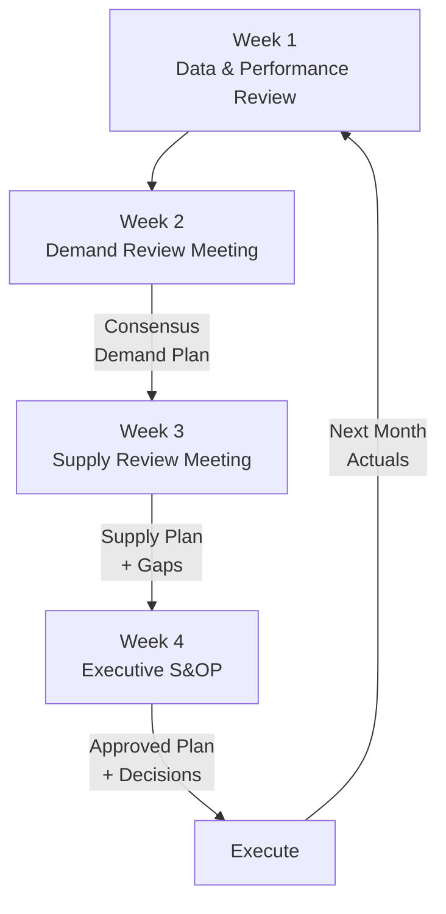

# LG02 — Supply Chain Management
> *Quản lý chuỗi cung ứng: SCOR model, S&OP, demand planning và Bullwhip Effect*

---

## 1. Learning Objectives

- Hiểu cấu trúc và thành phần của chuỗi cung ứng
- Áp dụng SCOR model để đánh giá SCM performance
- Thực hiện S&OP (Sales and Operations Planning)
- Nhận diện và giảm thiểu Bullwhip Effect
- Hiểu VN trong chuỗi cung ứng toàn cầu

---

## 2. Business Context

Supply Chain Management (SCM) là **tích hợp các quá trình kinh doanh từ nhà cung cấp gốc đến người dùng cuối** — đảm bảo sản phẩm đúng, đúng lúc, đúng nơi, đúng chi phí.

**Tại VN:** VN là manufacturing hub quan trọng trong global supply chains (Samsung 50% smartphone, Intel chip, Nike giày). COVID-19 và US-China trade war đẩy nhanh "China+1" strategy → VN hưởng lợi lớn từ supply chain diversification.

---

## 3. Definitions

| Thuật ngữ | Định nghĩa |
|-----------|-----------|
| **Supply Chain** | Mạng lưới tổ chức, người, công nghệ liên quan đến tạo ra và phân phối sản phẩm |
| **SCM** | Quản lý, điều phối toàn bộ supply chain |
| **SCOR** | Supply Chain Operations Reference — framework đánh giá SCM |
| **S&OP** | Sales & Operations Planning — quy trình align demand và supply |
| **Demand Planning** | Dự báo nhu cầu để plan production và inventory |
| **Bullwhip Effect** | Biến động nhu cầu khuếch đại khi đi ngược chuỗi |
| **Safety Stock** | Tồn kho dự phòng để buffer demand uncertainty |
| **Lead Time** | Thời gian từ đặt hàng đến nhận hàng |
| **Demand Sensing** | Sử dụng near-real-time data để cải thiện demand forecast |
| **VMI** | Vendor-Managed Inventory — nhà cung cấp quản lý tồn kho của bạn |

---

## 4. Core Concepts

### 4.1 SCOR Model — 6 Processes

```
PLAN:    Lập kế hoạch toàn bộ supply chain
SOURCE:  Mua nguyên liệu/hàng hóa từ suppliers
MAKE:    Sản xuất/chuyển đổi thành sản phẩm
DELIVER: Giao hàng đến customers
RETURN:  Xử lý hàng trả, reverse logistics
ENABLE:  Quản lý quy trình, dữ liệu, nhân sự cho SCM

Mỗi process đánh giá theo:
  Reliability | Responsiveness | Agility | Cost | Assets
```

### 4.2 Supply Chain Tiers

```
TIER 3: Raw material suppliers
    ↓
TIER 2: Component manufacturers  
    ↓
TIER 1: Direct suppliers (liên kết trực tiếp với OEM)
    ↓
OEM (Original Equipment Manufacturer) / YOUR COMPANY
    ↓
DISTRIBUTORS / WHOLESALERS
    ↓
RETAILERS
    ↓
END CUSTOMERS

VN context:
  Samsung VN (OEM) ← Tier 1 VN supplier ← Tier 2 (mostly Korea/Japan)
  Nike VN factory ← vải/nguyên liệu từ Tier 1 (Taiwan, China)
```

### 4.3 S&OP Process — Monthly Cycle

```
WEEK 1: DATA REVIEW
  - Actual vs forecast (last month)
  - Inventory levels
  - Sales pipeline

WEEK 2: DEMAND REVIEW
  - Commercial/Sales team
  - Update demand forecast by SKU/channel
  - Output: Updated demand plan

WEEK 3: SUPPLY REVIEW  
  - Operations/Supply team
  - Capacity planning vs demand
  - Identify gaps and options
  - Output: Supply plan

WEEK 4: EXECUTIVE S&OP
  - CEO/CFO/CSO/COO present
  - Resolve conflicts (demand vs supply vs finance)
  - Approve plan for next 3-18 months
  - Output: Aligned plan, decisions, action items
```

### 4.4 Bullwhip Effect

```
CUSTOMER ORDER:     ████████ (relatively stable)
RETAILER ORDER:     ██████████████ (slightly amplified)
WHOLESALER ORDER:   ████████████████████ (more amplified)
MANUFACTURER ORDER: █████████████████████████████ (much amplified)

Cause: Each level adds safety stock + order batching + price speculation
Result: Excess inventory và stockouts oscillate up the chain

SOLUTIONS:
  1. Information sharing (POS data to all tiers)
  2. Vendor-Managed Inventory (VMI)
  3. Reduce order frequency → increase information frequency
  4. Eliminate price promotions that cause demand spikes
  5. Stable pricing (EDLP — Every Day Low Price như Walmart)
```

### 4.5 Demand Planning Methods

```
METHOD              KHI NÀO DÙNG
──────────────────────────────────────────────────────────
Statistical forecast Ổn định, data đủ dài (>2 năm)
Moving average       Stable demand, ít seasonal
Exponential smoothing Demand với trend hoặc seasonality
ML/AI forecast       Nhiều variables, demand phức tạp
Collaborative (CPFR) Partner với major retailers
Judgmental           New product, insufficient history
```

### 4.6 Supply Chain Risk Management

```
RISK CATEGORIES:
  Demand risk:   Demand forecast sai
  Supply risk:   Supplier fail, quality issues, geo-political
  Process risk:  Internal operations failure
  Control risk:  IT, compliance
  Environmental: Natural disaster, pandemic

MITIGATION:
  Diversification: Multi-source, không dồn 1 supplier
  Visibility: Real-time tracking across tiers
  Buffers: Safety stock, safety capacity
  Flexibility: Alternate sources đã qualify
  Insurance: Cargo, business interruption
```

---

## 5. Business Value

| Ứng dụng | Kết quả |
|---------|---------|
| S&OP implementation | Giảm inventory 15-25%, tăng service level |
| Bullwhip reduction | Giảm order variability, stable operations |
| Supplier collaboration | Giảm lead time, cải thiện quality |
| Demand planning | Forecast accuracy cải thiện 20-40% |

---

## 6. Enterprise Role

- **Supply Chain Director/VP:** End-to-end SC strategy
- **S&OP Manager:** Process facilitation, monthly cycle
- **Demand Planner:** Forecast, consensus plan
- **Supply Planner:** Capacity, supply plan
- **Procurement Manager:** Supplier management (xem MF06)

---

## 7. Departments Related

Sales · Operations · Finance · Procurement · Logistics · Manufacturing

---

## 8. Input

- Sales history (2-3 năm+)
- Sales pipeline và promotions calendar
- Inventory levels (current)
- Capacity constraints
- Supplier lead times

---

## 9. Output

- Consensus demand plan (18-month rolling)
- Supply plan và production schedule
- Inventory targets
- Financial plan (aligned với SC plan)

---

## 10. Business Process

```
Data collection → Statistical baseline
→ Commercial input (sales, marketing)
→ Consensus demand plan
→ Supply review (capacity vs demand)
→ Gap analysis & options
→ Executive S&OP review
→ Approved plan → Execute
→ Measure actuals → Loop back monthly
```

---

## 11. Data Flow

```
ERP (sales history) ──────────────────────┐
POS data (từ retailers) ───────────────────┤
CRM pipeline ─────────────────────────────┤
                                          ↓
                           DEMAND PLANNING SOFTWARE
                                          ↓
                              Demand Plan (SKU, week, location)
                                          ↓
                           SUPPLY PLANNING (capacity check)
                                          ↓
                              Purchase Orders → Suppliers
                              Production Orders → Manufacturing
```

---

## 12. Money Flow

```
SC Costs:
  COGS: Raw materials + Direct labor + Manufacturing overhead
  Logistics: Transport + Warehousing (xem LG01)
  Inventory: Carrying cost (capital + storage + risk) ≈ 20-30%/year
  
Cash Flow Impact:
  Inventory → Ties up cash (Working Capital)
  Better forecast → Lower inventory → Better cash flow
  Lead time reduction → Lower WIP, faster cash conversion cycle
```

---

## 13. Document Flow

```
Demand Plan (Excel/APO) → Master Production Schedule
→ Purchase Orders (sent to suppliers)
→ Supplier Order Acknowledgment
→ Shipping Documents (ASN — Advance Shipping Notice)
→ Goods Receipt
→ Invoice → AP Payment
```

---

## 14. Roles

| Vai trò | Trách nhiệm |
|---------|------------|
| SC Director | Strategy, performance, major decisions |
| S&OP Manager | Monthly process, cross-functional alignment |
| Demand Planner | Statistical forecast, commercial consensus |
| Supply Planner | Capacity planning, production scheduling |
| Procurement | Supplier relations, PO management |

---

## 15. Responsibilities

- Demand Planner sở hữu forecast accuracy, không phải Sales
- S&OP Manager là người facilitate, không phải người quyết định
- Executive S&OP là nơi ra quyết định business — không phải operational meeting

---

## 16. RACI

| Activity | SC Director | S&OP Mgr | Demand Planner | Sales | Finance |
|----------|:-----------:|:--------:|:--------------:|:-----:|:-------:|
| Demand review | C | A | R | C | I |
| Supply review | C | A | C | I | C |
| Executive S&OP | A | R | C | C | C |
| Plan approval | A | R | I | I | C |

---

## 17. Frameworks

- **SCOR 12.0** — APICS/ASCM Supply Chain Operations Reference
- **CPFR** — Collaborative Planning, Forecasting & Replenishment
- **IBP** — Integrated Business Planning (evolution của S&OP)
- **Lean Supply Chain** — Waste elimination across chain
- **Agile Supply Chain** — Responsiveness vs efficiency

---

## 18. International Standards

- **SCOR Model** — ASCM (Association for Supply Chain Management)
- **ISO 28000** — Supply Chain Security
- **ISO 31000** — Risk Management (supply chain risks)
- **GS1 Standards** — Barcode, EDI, track and trace

---

## 19. Vietnam Context

**VN trong Global Supply Chains:**

| Industry | Key Companies | VN Role |
|----------|-------------|---------|
| Electronics | Samsung, Intel, LG, Foxconn | Manufacturing hub |
| Textiles/Apparel | Nike, Adidas, H&M, Zara | Production |
| Footwear | Nike, Adidas, Puma | Major producer |
| Furniture | IKEA suppliers | Manufacturing |
| Seafood | Pangasius, shrimp | Export |
| Coffee | Trung Nguyên, Vinacafé | Production + export |

**China+1 Strategy:**
- US-China trade war → nhiều MNCs diversify sang VN
- VN hưởng lợi: Samsung (50% smartphone), Apple suppliers
- Thách thức VN: Thiếu Tier 2 suppliers (phụ thuộc import từ China)

**Domestic S&OP:**
- Vinamilk: Advanced S&OP với SAP APO
- Masan, TH True Milk: Implementing IBP
- FMCG sector most mature trong SCM VN

---

## 20. Legal Considerations

- **EVFTA, RCEP, CPTPP:** FTAs ảnh hưởng supply chain strategy (Rules of Origin)
- **Luật Đấu Thầu 2023:** Public sector procurement (xem MF06)
- **Luật Hải Quan 2014 + sửa đổi:** Import/export documentation

---

## 21. Common Mistakes

1. **S&OP = Demand meeting chỉ:** Bỏ qua supply side → unbalanced plan
2. **Forecast accuracy obsession:** Target <5% MAPE → unrealistic, tốn chi phí
3. **Excel-based S&OP:** Không scalable, manual errors
4. **Ignore demand signal latency:** POS data từ 2 tuần trước → stale
5. **Single-source suppliers:** Lowest cost but highest risk
6. **Over-optimization:** Just-in-time + zero inventory → fragile (COVID lesson)

---

## 22. Best Practices

- **Rule of thumb:** Resilience > Efficiency in volatile world
- **Visibility across tiers:** Biết supplier của supplier đang gặp vấn đề gì
- **Scenario planning trong S&OP:** Best/base/worst case
- **Measure MAPE không phải chỉ forecast:** Measure bias (over vs under)
- **Hold executives accountable** cho attending S&OP meeting

---

## 23. KPIs

| KPI | Benchmark |
|-----|-----------|
| **Forecast Accuracy (MAPE)** | < 20% SKU level, < 10% aggregate |
| **Forecast Bias** | ±5% (neutral, không over/under) |
| **Inventory Days (DIO)** | Ngành-specific: 30-60 ngày (FMCG), 60-90 (mfg) |
| **Perfect Order Rate** | > 95% |
| **SC Cost as % Revenue** | < 8% (best-in-class), 10-12% average |
| **On-time In-full (OTIF)** | > 95% |

---

## 24. Metrics

- Demand sensing accuracy (near-term, 0-4 weeks)
- Supply plan attainment (actual vs plan)
- S&OP process adherence (% meetings held on time, attendance)

---

## 25. Reports

- **Weekly S&OP Pulse:** Short-cycle metrics
- **Monthly S&OP Deck:** Full process output, decisions
- **Quarterly SC Review:** Strategic performance vs benchmark

---

## 26. Templates

**S&OP Meeting Agenda (Executive, 2 giờ):**
```
1. Performance Review (20 min): Previous month actuals vs plan
2. Demand Review (30 min): Updated forecast, risks, opportunities
3. Supply Review (20 min): Capacity, constraints, options
4. Financial Bridge (15 min): Revenue/margin impact of plan
5. Decisions & Actions (25 min): Escalations, trade-offs, owners
6. Next S&OP date confirmation (10 min)
```

---

## 27. Checklists

**S&OP Maturity Checklist:**
- [ ] Monthly S&OP meeting với CEO participation?
- [ ] Demand plan cho 18 months rolling?
- [ ] Forecast accuracy đang được đo (MAPE, Bias)?
- [ ] Supply constraints được quantified?
- [ ] Financial plan aligned với SC plan?
- [ ] Actions và owners được tracked từ meeting trước?

---

## 28. SOP

**Demand Review Meeting (2 tuần trước Executive S&OP):**
```
Chuẩn bị (BA):
  - Pull statistical forecast từ system
  - Prepare actual vs forecast analysis (last 4 weeks)
  - Collect intelligence từ Sales (promotions, new wins/losses)

Meeting (2 giờ, Sales + Demand Planning + Marketing):
  1. Review forecast accuracy (bias? systematic error?)
  2. Update statistical forecast với commercial intelligence
  3. Flag high-risk SKUs / channels
  4. Output: Consensus demand plan

After: Submit demand plan to Supply Planning
```

---

## 29. Case Study

**Vinamilk — S&OP Implementation:**

Vinamilk triển khai SAP APO (Advanced Planning & Optimization) từ 2015.

**Before:** Excel-based forecasting, silo giữa Sales và Operations, thường xuyên stockout hoặc overstock sữa tươi (shelf life ngắn).

**S&OP implementation:**
- Demand planning: Statistical forecast + commercial input
- Supply planning: Constraint-based scheduling (cows — fresh milk supply constraint)
- S&OP: Monthly process với Demand Manager và CEO

**Kết quả:**
- Forecast accuracy cải thiện từ 60% → 85%
- Inventory turns tăng 20%
- Waste từ expired product giảm 30%

---

## 30. Small Business Example

**Chuỗi cà phê 15 chi nhánh — SCM đơn giản:**

```
Vấn đề: Một số chi nhánh hết hàng, một số tồn đọng — mỗi nhánh
         order độc lập, tổng nhu cầu không ai biết

Giải pháp S&OP đơn giản:
  1. Weekly order cycle (thay vì ad-hoc)
  2. Central demand aggregation (Operations manager)
  3. Par level cho từng SKU tại từng branch
  4. Weekly review: actual vs par, order top-up

Kết quả: Giảm stockouts 80%, giảm expiry 40%,
         nhà cung cấp happy vì orders ổn định hơn
```

---

## 31. Enterprise Example

**Samsung VN — Supply Chain:**

Samsung Electronics VN (SEVN) sản xuất smartphone tại Thái Nguyên và Bắc Ninh.

**SC structure:**
- Tier 1 VN: 57 Korean, 14 Vietnamese suppliers (2023)
- Raw materials: Imported mostly từ Korea, Japan, China
- Manufacturing: 10,000+ workers, 200M+ units/năm capacity
- Distribution: Global — direct từ VN đến markets worldwide

**Challenges:**
- Tier 2 localization thấp → dependency on imports
- Samsung's VN government incentive yêu cầu tăng local content

---

## 32. ERP Mapping

| SCM Activity | ERP Module |
|-------------|-----------|
| Demand planning | SAP APO/IBP, Oracle ASCP |
| MRP run | PP — Material Requirements Planning |
| S&OP process | SAP IBP, Kinaxis, o9 Solutions |
| Supplier scheduling | MM — Supplier Scheduling |
| Performance tracking | BW/Analytics |

---

## 33. Automation Opportunities

- **Automated MRP:** ERP runs MRP daily → purchase proposals
- **Automated replenishment:** Kanban triggers, min-max replenishment
- **EDI với suppliers:** Auto PO → Auto Order Acknowledgment → Auto ASN
- **Demand sensing:** Real-time POS data → daily forecast refresh

---

## 34. AI Opportunities

- **ML demand forecasting:** XGBoost, LSTM models outperform statistical methods for complex demand patterns
- **Autonomous planning:** AI auto-approve routine POs
- **Supply disruption prediction:** Monitor supplier news, weather → proactive risk
- **Dynamic safety stock:** AI calculate safety stock based on actual variability vs fixed formula

---

## 35. Implementation Guide

**S&OP implementation roadmap:**
```
Tháng 1-2: Foundation
  - Appoint S&OP process owner (SC Director)
  - Align on data: what data exists, quality?
  - Design meeting cadence và agenda
  - Excel template cho demand và supply plan

Tháng 3-4: Soft launch
  - Run first 2 S&OP cycles
  - Build habits, not perfection
  - Measure forecast accuracy baseline

Tháng 5-6: Improve
  - Address data quality issues
  - Sales engagement improvement
  - Add financial bridge

Month 7+: Advanced
  - System investment (APO/IBP/Kinaxis)
  - Scenario planning
  - Supplier integration (CPFR/VMI)
```

---

## 36. Consulting Guide

**SC diagnostic:**
1. Forecast accuracy hiện tại — được đo chưa?
2. S&OP meeting có tồn tại không? Ai attend?
3. Inventory turns vs industry benchmark?
4. Supplier delivery performance (OTIF)?
5. Có supply disruption incidents trong 12 tháng gần đây?

---

## 37. Diagnostic Questions

1. Công ty bạn có S&OP process không? Tần suất?
2. Demand forecast được làm bởi ai — Sales hay Planning?
3. Bullwhip effect có đang xảy ra không? (Volatility at supplier vs customer)
4. VN local suppliers chiếm bao nhiêu % của Tier 1?

---

## 38. Interview Questions

- "Mô tả S&OP process bạn đã run. Challenges là gì?"
- "Bullwhip Effect là gì? Làm thế nào giảm?"
- "Tại sao SCOR model quan trọng?"

---

## 39. Exercises

**Bài 1:** Công ty F&B có demand cho sản phẩm A: Tháng 1: 1,000, Tháng 2: 1,200, Tháng 3: 800, Tháng 4: 1,500. Tính 3-month moving average cho T3 và T4. Nhận xét về accuracy.

**Bài 2:** Identify 3 ví dụ về Bullwhip Effect trong thực tế VN (gợi ý: mì gói COVID, khẩu trang, xe ô tô chip shortage). Nguyên nhân và giải pháp cho từng case.

**Bài 3:** Thiết kế S&OP calendar cho tháng tới (4 tuần) cho công ty FMCG 100 SKU, 500 nhân viên. Meeting nào, ai attend, output là gì?

---

## 40. References

- **Sách:** *Supply Chain Management: Strategy, Planning, and Operation* — Chopra & Meindl
- **Sách:** *Sales and Operations Planning* — Thomas Wallace
- **ASCM:** scm.org — SCOR model, APICS certifications
- **Certification:** CSCP, CPIM (APICS/ASCM)

---

## Output Formats

### Mermaid — S&OP Monthly Cycle


### Flashcards
```
Q: Bullwhip Effect là gì và cách giảm?
A: Biến động nhu cầu khuếch đại càng lên cao chuỗi cung ứng.
   Root cause: Order batching, safety stock stacking, price speculation.
   Cách giảm: (1) Chia sẻ POS data với toàn chuỗi, (2) VMI,
   (3) Giảm order cycle, (4) EDLP pricing, (5) Eliminate promotions.

Q: S&OP vs MRP vs Demand Planning?
A: Demand Planning: Dự báo nhu cầu → output: forecast (phân theo SKU/time)
   S&OP: Align demand plan với supply capacity → output: approved plan
   MRP: Execute plan → tính toán purchase/production orders từ demand plan
   Thứ tự: Demand Planning → S&OP → MRP.

Q: SCOR model 6 processes?
A: Plan → Source → Make → Deliver → Return → Enable
   Plan: Cross-cutting, overarch toàn bộ SC
   Source/Make/Deliver: Core operational processes
   Return: Reverse logistics
   Enable: Supporting (data, HR, IT, compliance)
```

### JSON Metadata
```json
{
  "module_code": "LG02",
  "module_name": "Supply Chain Management",
  "domain": "Logistics",
  "level": "Intermediate-Advanced",
  "version": "1.0",
  "status": "complete",
  "prerequisites": ["LG01", "MF01", "OP01"],
  "related_modules": ["LG01", "LG03", "LG04", "MF05", "MF06", "ERP05"],
  "learning_time_hours": 10,
  "key_frameworks": ["SCOR", "S&OP", "IBP", "CPFR", "Bullwhip Effect"],
  "key_standards": ["SCOR 12.0", "ISO 28000", "GS1"],
  "vietnam_specific": true,
  "tags": ["supply-chain", "SCM", "S&OP", "demand-planning", "SCOR", "logistics"]
}
```
