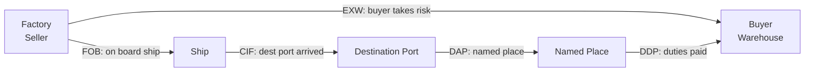

# LG03 — Export-Import Management
> *Quản lý xuất nhập khẩu: Incoterms 2020, thủ tục hải quan, chứng từ XNK và FTAs VN*

---

## 1. Learning Objectives

- Áp dụng đúng Incoterms 2020 cho từng giao dịch thương mại
- Chuẩn bị bộ chứng từ xuất khẩu hoàn chỉnh (B/L, C/O, L/C)
- Hiểu quy trình thông quan hải quan VN
- Tính toán import duties, VAT, và special taxes
- Tận dụng FTAs của VN (EVFTA, RCEP, CPTPP)

---

## 2. Business Context

Xuất nhập khẩu là **xương sống của nền kinh tế VN** — xuất khẩu chiếm ~90% GDP, VN là nền kinh tế mở nhất Đông Nam Á (theo tỷ lệ trade/GDP).

**Top xuất khẩu VN 2023:** Điện thoại ($57B), Máy tính/điện tử ($57B), Dệt may ($40B), Máy móc thiết bị ($25B), Giày dép ($20B).

**Top nhập khẩu VN:** Linh kiện điện tử (từ Hàn, Đài, TQ), Máy móc, Vải nguyên liệu, Nhựa, Thép.

---

## 3. Definitions

| Thuật ngữ | Định nghĩa |
|-----------|-----------|
| **Incoterms** | International Commercial Terms — quy định trách nhiệm buyer/seller |
| **B/L (Bill of Lading)** | Chứng từ vận tải đường biển |
| **AWB (Air Waybill)** | Chứng từ vận tải hàng không |
| **C/O (Certificate of Origin)** | Giấy chứng nhận xuất xứ |
| **L/C (Letter of Credit)** | Tín dụng thư — phương thức thanh toán |
| **HS Code** | Harmonized System Code — mã phân loại hàng hóa |
| **CIF** | Cost, Insurance and Freight — giá giao tại cảng đến (bao gồm cước + bảo hiểm) |
| **FOB** | Free On Board — giá giao tại cảng đi |
| **EXW** | Ex Works — giá tại nhà máy người bán |
| **Phân luồng** | VNACCS phân loại tờ khai: Xanh/Vàng/Đỏ |

---

## 4. Core Concepts

### 4.1 Incoterms 2020 — 11 Terms

```
NHÓM E — Departure (seller làm ít nhất):
  EXW  Ex Works         Hàng tại kho seller. Buyer chịu tất cả.

NHÓM F — Main carriage unpaid:
  FCA  Free Carrier     Seller giao cho carrier do buyer chỉ định
  FAS  Free Alongside Ship  Giao cạnh tàu tại cảng đi
  FOB  Free On Board    Giao lên tàu tại cảng đi (phổ biến VN XK)

NHÓM C — Main carriage paid:
  CFR  Cost and Freight      Seller trả cước biển, không có bảo hiểm
  CIF  Cost Insurance Freight Seller trả cước + mua bảo hiểm (phổ biến VN NK)
  CPT  Carriage Paid To      Seller trả cước đến nơi chỉ định
  CIP  Carriage Insurance Paid Seller trả cước + bảo hiểm mở rộng

NHÓM D — Arrival (seller làm nhiều nhất):
  DAP  Delivered at Place     Giao tại nơi chỉ định, chưa thông quan NK
  DPU  Delivered Place Unloaded  Giao và dỡ hàng tại nơi chỉ định
  DDP  Delivered Duty Paid    Giao tận nơi, đã thông quan và trả thuế NK

RISK TRANSFER:
EXW ──────────────────────────────────────────────────── DDP
Seller ít rủi ro ←                           → Seller nhiều rủi ro
```

### 4.2 Incoterms Selection Guide

```
SITUATION                     RECOMMENDED TERM
────────────────────────────────────────────────────────
Xuất khẩu VN đường biển       FOB (phổ biến nhất VN)
Nhập khẩu đường biển          CIF hoặc CFR
Muốn kiểm soát logistics       FOB (buyer controls freight)
Muốn đơn giản, buyer chịu hết  EXW
Giao tận nơi, mọi thứ         DDP (risk cho seller)
Nội địa/FCA phổ biến quốc tế  FCA (thay FOB trong nhiều contracts)
```

### 4.3 Chứng từ Xuất khẩu cơ bản

```
BỘ CHỨNG TỪ XUẤT KHẨU CHUẨN:
┌─────────────────────────────────────────────┐
│ 1. COMMERCIAL INVOICE                        │
│    Mô tả hàng, đơn giá, tổng giá trị        │
│                                              │
│ 2. PACKING LIST                              │
│    Chi tiết đóng gói từng kiện               │
│                                              │
│ 3. BILL OF LADING (B/L) / AIR WAYBILL       │
│    Chứng từ vận tải — do carrier cấp         │
│                                              │
│ 4. CERTIFICATE OF ORIGIN (C/O)              │
│    Chứng minh xuất xứ hàng hóa              │
│    Form B (WTO), Form D (ASEAN), EUR.1      │
│    Form E (ASEAN-China), VC/KS...           │
│                                              │
│ 5. INSURANCE CERTIFICATE (nếu CIF)          │
│                                              │
│ THÊM (tùy ngành):                           │
│ - Phytosanitary (nông sản)                  │
│ - Health Certificate (thực phẩm)            │
│ - Quality Certificate                        │
│ - Fumigation Certificate                     │
└─────────────────────────────────────────────┘
```

### 4.4 Letter of Credit (L/C)

```
Thanh toán L/C flow:

BUYER               ISSUING BANK              SELLER
(Importer)                                  (Exporter)
  │                      │                      │
  │── Apply for L/C ────→│                      │
  │                      │── Issue L/C ────────→│
  │                      │                      │── Ship goods
  │                      │                      │── Prepare docs
  │                      │←── Present docs ─────│
  │                      │── Check docs         │
  │                      │── Pay if compliant ──│
  │←── Debit account ────│                      │
  │←── Docs released ────│                      │

L/C đảm bảo: Seller được thanh toán nếu đáp ứng điều kiện
             Buyer nhận hàng đúng theo L/C terms
```

### 4.5 HS Code và Import Duties VN

```
HS CODE STRUCTURE:
  8471.30.10
  ├── 84: Chapter (Machinery and mechanical appliances)
  ├── 8471: Heading (ADP machines)
  ├── 8471.30: Sub-heading (Portable ADP)
  └── 8471.30.10: VN national sub-heading

IMPORT DUTY VN:
  = CIF value × Thuế nhập khẩu (HS code + xuất xứ)
  + (CIF + Import duty) × Thuế TTĐB (nếu có)
  + (CIF + Import duty + TTĐB) × VAT 10%

VÍ DỤ: Nhập điện thoại từ Samsung HQ Korea:
  CIF: $100
  Import duty: 0% (AKFTA/RCEP)
  TTĐB: 0%  
  VAT: 10% × $100 = $10
  Total landed: $110
```

### 4.6 Quy trình thông quan VN

```
KHAI BÁO HẢI QUAN (VNACCS/VCIS):
  
  Doanh nghiệp khai tờ khai điện tử
          ↓
  Hệ thống phân luồng:
    ┌── LUỒNG XANH (1): Thông quan ngay, không kiểm tra
    ├── LUỒNG VÀNG (2): Kiểm tra hồ sơ giấy
    └── LUỒNG ĐỎ (3): Kiểm tra thực tế hàng hóa
          ↓
  Nộp thuế (nếu có)
          ↓
  Thông quan — Nhận hàng/Giao hàng

THỜI GIAN THÔNG QUAN (trung bình VN):
  Luồng Xanh: 30 phút - 2 giờ
  Luồng Vàng: 1-2 ngày
  Luồng Đỏ:   2-5 ngày (tùy độ phức tạp)
```

### 4.7 FTAs VN đang có hiệu lực

```
FTA           ĐỐI TÁC        HIỆU LỰC  GHI CHÚ
──────────────────────────────────────────────────────
AFTA/ATIGA    ASEAN          1992       Nội khối ASEAN
AKFTA         ASEAN-Korea    2007       Điện tử, xe hơi
AJCEP         ASEAN-Japan    2008       Máy móc, điện tử
AIFTA         ASEAN-India    2010       
ACFTA         ASEAN-China    2010       Quan trọng nhất về volume
VKFTA         VN-Korea       2015       Bổ sung AKFTA
VJEPA         VN-Japan       2009       
CPTPP         11 nước        2019       Canada, Úc, Mexico, Chile...
EVFTA         VN-EU          2020       Lớn thứ 2 thị trường XK VN
UKVFTA        VN-UK          2021       Post-Brexit
RCEP          15 nước ASEAN+ 2022       Lớn nhất theo GDP
VIFTA         VN-Israel      2024       
```

---

## 5. Business Value

| Ứng dụng | Kết quả |
|---------|---------|
| Đúng Incoterms | Tránh tranh chấp, clear risk allocation |
| FTA utilization | Giảm import duty 0-5% → cạnh tranh hơn |
| L/C thay T/T | Giảm payment risk với new partners |
| Chuẩn bị chứng từ tốt | Tránh delayed clearance, phạt hải quan |

---

## 6. Enterprise Role

- **Export-Import Manager:** Quản lý bộ phận, strategy, compliance
- **Customs Declaration Specialist:** Khai báo, phân loại HS
- **Freight Forwarder (Forwarding Agent):** Tổ chức vận tải quốc tế
- **Logistics Coordinator:** Phối hợp vận chuyển, chứng từ

---

## 7. Departments Related

Logistics · Finance (LC, payment) · Legal (contracts) · Tax (import duties) · Procurement

---

## 8. Input

- Purchase Order / Sales Contract
- Packing list từ nhà máy
- HS code classification
- Origin of goods (để chọn C/O form)

---

## 9. Output

- Bộ chứng từ xuất nhập khẩu hoàn chỉnh
- Customs declaration (tờ khai hải quan)
- Duty payment
- Delivery to customer/warehouse

---

## 10. Business Process

```
XUẤT KHẨU:
  Nhận PO → Sản xuất/chuẩn bị hàng → Booking tàu/máy bay
  → Đóng gói → Khai báo hải quan XK → Customs clearance
  → Giao hàng lên tàu/máy bay → Phát hành chứng từ (B/L, C/O)
  → Gửi chứng từ cho buyer → Nhận thanh toán

NHẬP KHẨU:
  Đặt hàng → Nhận chứng từ từ supplier → Khai báo hải quan NK
  → Phân luồng → Nộp thuế → Customs clearance
  → Nhận hàng tại cảng/ICD → Vận chuyển về kho
```

---

## 11. Data Flow

```
Sales Contract → Pro Forma Invoice → Commercial Invoice
             → B/L (sau khi tàu chạy)
             → C/O (từ cơ quan cấp: Bộ Công Thương, VCCI)
             → Insurance Certificate
             → Customs Declaration (VNACCS electronic)
```

---

## 12. Money Flow

```
XUẤT KHẨU (FOB):
  Buyer pays: FOB price = Factory cost + Export clearance
  Currency: USD phổ biến nhất (EUR, JPY cho EU/Nhật)
  
NHẬP KHẨU (CIF):
  Tổng chi phí = CIF price + Import duty + TTĐB (nếu có) + VAT
  Thuế nộp cho Hải quan (qua ngân hàng)
  VAT nhập khẩu: Được hoàn/khấu trừ nếu dùng cho SXKD

THANH TOÁN QUỐC TẾ METHODS:
  T/T (Telegraphic Transfer): Phổ biến nhất
  L/C (Letter of Credit): An toàn nhất, tốn phí
  D/P (Documents against Payment): Chứng từ đổi thanh toán
  Open Account: Bán trước, trả sau (rủi ro cao cho seller)
```

---

## 13. Document Flow

```
Commercial Invoice ─────────────────────────────────┐
Packing List ───────────────────────────────────────┤
B/L (Original) ─────────────────────────────────────┤→ Buyer
C/O Form ───────────────────────────────────────────┤   (for customs + payment)
Insurance Certificate ──────────────────────────────┘
                              ↓
                    Customs Declaration (VN)
                              ↓
                    Nộp thuế NK (nếu có)
                              ↓
                    Goods released
```

---

## 14. Roles

| Vai trò | Trách nhiệm |
|---------|------------|
| XNK Manager | Compliance, strategy, relationships với hải quan |
| Customs Broker | Khai báo, phân loại, đại lý hải quan |
| Freight Forwarder | Booking tàu, tracking, B/L |
| L/C Specialist | Kiểm tra L/C, phòng ngân hàng |

---

## 15. Responsibilities

- Customs Broker chịu trách nhiệm về accuracy của tờ khai
- Company chịu trách nhiệm cuối cùng về compliance, kể cả khi dùng broker

---

## 16. RACI

| Activity | XNK Mgr | Customs Broker | Finance | Logistics |
|----------|:-------:|:--------------:|:-------:|:---------:|
| HS classification | A | R | I | I |
| Customs declaration | A | R | I | C |
| Duty payment | C | I | A | I |
| Document preparation | A | C | C | R |

---

## 17. Frameworks

- **Incoterms 2020** — ICC (International Chamber of Commerce)
- **UCP 600** — Uniform Customs and Practice for Documentary Credits (L/C rules)
- **WCO HS Convention** — Harmonized System
- **AEO (Authorized Economic Operator)** — VN: Doanh nghiệp ưu tiên

---

## 18. International Standards

- **Incoterms 2020** — ICC
- **UCP 600** — L/C rules
- **WCO HS 2022** — Commodity classification
- **ISO 28000** — Supply chain security

---

## 19. Vietnam Context

**Hải quan VN:**
- VNACCS/VCIS: Hệ thống khai báo điện tử, tự động phân luồng
- AEO Program: Doanh nghiệp ưu tiên (Samsung, Intel, Vinamilk) → Ưu đãi thông quan nhanh
- Cảng Cái Mép-Thị Vải: Cảng deepwater nhất VN, container đi thẳng Mỹ/EU
- ICD (Inland Container Depot): Hà Nội, HCM — thông quan ngay tại ICD

**Form C/O phổ biến VN:**
- Form B: WTO/MFN countries
- Form D: ASEAN/ATIGA (ASEAN intra-trade)
- Form E: ASEAN-China (ACFTA)
- Form AK: ASEAN-Korea (AKFTA)
- EUR.1: EU (EVFTA)
- Form CPTPP: CPTPP countries

---

## 20. Legal Considerations

- **Luật Hải Quan 2014** (sửa đổi 2022): Khai báo, kiểm tra, xử phạt
- **NĐ 08/2015 + sửa đổi:** Chi tiết thủ tục hải quan
- **Thông tư 38/2015:** Chứng từ hải quan
- **Luật Thuế XNK 2016:** Thuế xuất nhập khẩu, miễn giảm
- **Luật Quản lý Ngoại thương 2017:** Giấy phép, hạn ngạch

---

## 21. Common Mistakes

1. **Sai HS Code:** Phân loại sai → thiếu/thừa thuế → phạt hành chính
2. **Không tận dụng FTA:** Vẫn đóng MFN rate thay vì 0-5%
3. **C/O không đúng form:** Form không phù hợp với FTA đang dùng
4. **L/C discrepancies:** Chứng từ không khớp L/C terms → không được thanh toán
5. **Khai sai trị giá:** Undervalue để tránh thuế → rủi ro hình sự

---

## 22. Best Practices

- **HS code database:** Xây dựng internal database HS codes cho tất cả SKUs
- **FTA matrix:** Biết rõ mặt hàng nào được hưởng FTA gì với đối tác nào
- **Pre-clearance consultation:** Với hải quan cho shipments phức tạp
- **Scan L/C kỹ trước khi xuất:** Đảm bảo có thể đáp ứng tất cả điều kiện
- **AEO certification:** Nếu XNK thường xuyên → xin cấp AEO

---

## 23. KPIs

| KPI | Benchmark |
|-----|-----------|
| **Customs clearance time** | Xanh: < 4h; Vàng: < 2 ngày; Đỏ: < 5 ngày |
| **Luồng Xanh rate** | > 70% shipments |
| **L/C discrepancy rate** | < 2% |
| **FTA utilization rate** | > 80% eligible shipments |

---

## 24. Metrics

- Import duty effective rate (actual vs MFN)
- C/O accuracy rate
- Time from order to customs cleared

---

## 25. Reports

- **Monthly XNK report:** Volume, value, duties paid, FTA savings
- **Quarterly FTA utilization report:** Cơ hội tận dụng chưa khai thác
- **Annual customs compliance review**

---

## 26. Templates

**Commercial Invoice cơ bản:**
```
COMMERCIAL INVOICE

Seller: [Company, address]
Buyer: [Company, address]
Invoice No.: [INV-2024-001]
Date: [DD/MM/YYYY]
Port of Loading: Cat Lai, Ho Chi Minh City, Vietnam
Port of Discharge: [Port, Country]
Terms: FOB Ho Chi Minh City

Item  HS Code    Description        Qty    Unit Price  Amount
1     6104.43.00 Women's jacket     500    $25.00      $12,500

Total: USD 12,500.00
Country of Origin: Vietnam
```

---

## 27. Checklists

**Xuất khẩu checklist (trước khi giao hàng):**
- [ ] B/L booking confirmed với shipping line?
- [ ] Commercial Invoice và Packing List chính xác?
- [ ] C/O đã được cấp (đúng form cho market đích)?
- [ ] Hải quan xuất khẩu thông quan xong?
- [ ] Hàng đã lên tàu? Có B/L gốc/surrender?
- [ ] Insurance certificate (nếu CIF)?
- [ ] Gửi full set docs cho buyer (hoặc ngân hàng nếu L/C)?

---

## 28. SOP

**Quy trình nhập khẩu nguyên liệu:**
```
1. Nhận Invoice + Packing List từ supplier (trước khi hàng về 7 ngày)
2. Nhân viên XNK kiểm tra chứng từ:
   - HS code correct?
   - FTA applicable? (C/O form nào?)
   - Giá trị CIF tính đúng chưa?
3. Khai báo điện tử trên VNACCS
4. Nhận kết quả phân luồng và xử lý phù hợp
5. Nộp thuế nhập khẩu (nếu có) qua ngân hàng
6. Nhận thông báo thông quan
7. Lấy hàng tại cảng/ICD
8. Lưu trữ chứng từ 5 năm (theo quy định)
```

---

## 29. Case Study

**Samsung VN — FTA Optimization:**

Samsung nhập linh kiện từ Samsung Korea và các Tier 1 suppliers.

**Giải pháp:**
- Phân tích toàn bộ BOM theo HS code
- Map từng linh kiện với FTA applicable (AKFTA, RCEP)
- Yêu cầu Korean suppliers cung cấp C/O Form AK/RCEP

**Kết quả:** Tiết kiệm hàng triệu USD thuế NK/năm. AEO status giúp thông quan nhanh hơn.

---

## 30. Small Business Example

**Cửa hàng thời trang nhập quần áo từ Trung Quốc:**

```
Để nhập chính ngạch:
  1. Thành lập DN hoặc hộ kinh doanh có MST
  2. Đăng ký hoạt động XNK
  3. Ký hợp đồng chính thức với supplier TQ
  4. Khai báo hải quan, nộp thuế

HS code quần áo: CH 61 (knitted), CH 62 (woven)
Thuế NK từ TQ: 0-12% (ACFTA) + VAT 10%

Lợi ích hàng chính ngạch:
  - VAT input credit
  - Invoice hợp lệ cho B2B sales
  - Không lo rủi ro bị confiscate
```

---

## 31. Enterprise Example

**Vinamilk — Xuất khẩu sang 50+ nước:**

Mỗi thị trường có quy định khác nhau (FDA, Halal, health cert). Solutions:
- Dedicated export compliance team
- Digital document management system
- Halal certification để tiếp cận Middle East

---

## 32. ERP Mapping

| XNK Activity | ERP Module |
|-------------|-----------|
| Purchase order (nhập khẩu) | MM — Purchasing |
| Customs declaration | GTS (Global Trade Services) |
| Duty accrual | FI — Financial Accounting |
| VAT declaration | FI-TX — Tax |
| Export order | SD — Sales & Distribution |

---

## 33. Automation Opportunities

- **HS code auto-classification:** AI suggest HS code từ product description
- **FTA auto-determination:** Rule engine check eligibility automatically
- **Electronic B/L (eBL):** Paperless bill of lading
- **Single Window VN (VNSW):** Khai báo một lần cho nhiều cơ quan

---

## 34. AI Opportunities

- **Automated customs declaration:** Pre-fill từ PO data
- **HS classification AI:** Computer vision classify goods từ photos
- **Trade compliance monitoring:** AI monitor regulatory changes across markets

---

## 35. Implementation Guide

**Thiết lập XNK department:**
```
Bước 1: Đăng ký mã số XNK (tự động khi có MST)
Bước 2: Đăng ký AEO (nếu XNK > 100 shipments/năm)
Bước 3: Chọn customs broker (có thể làm in-house sau khi quen)
Bước 4: Xây dựng HS code database cho toàn bộ products
Bước 5: FTA mapping — biết hàng nào, thị trường nào, form nào
Bước 6: Setup document management (5 năm lưu trữ)
```

---

## 36. Consulting Guide

**XNK diagnostic:**
1. FTA utilization rate là bao nhiêu?
2. Có HS code database không? Có dispute với hải quan?
3. Customs clearance time trung bình? % luồng xanh?
4. L/C discrepancy rate nếu dùng L/C?
5. Có AEO status không?

---

## 37. Diagnostic Questions

1. Bạn đang dùng FTA nào? % shipments được hưởng 0% thuế?
2. Incoterms nào đang dùng cho XK/NK? Tại sao?
3. Clearance time trung bình cho import shipments?

---

## 38. Interview Questions

- "Incoterms FOB vs CIF — khác nhau thế nào và khi nào dùng gì?"
- "Rules of Origin là gì? Tại sao quan trọng khi tận dụng FTA?"
- "L/C discrepancy xảy ra thế nào và phòng tránh ra sao?"

---

## 39. Exercises

**Bài 1:** Công ty VN xuất khẩu giày dép sang EU. Giá FOB là $50/đôi. Tính CIF price nếu: Cước biển $2/đôi, bảo hiểm 0.5% giá FOB. EU import duty theo EVFTA là 0%. Buyer trả bao nhiêu total landed cost (chưa tính EU VAT)?

**Bài 2:** Công ty nhập linh kiện từ Korea. MFN rate 8%, AKFTA rate 0%. Supplier gửi C/O Form AK nhưng thiếu chữ ký. Bạn xử lý thế nào để vẫn được 0%?

**Bài 3:** Phân tích tại sao VN có nhiều FTAs nhất ASEAN. Lợi và hại của việc có quá nhiều FTAs?

---

## 40. References

- **ICC:** incoterms.iccwbo.org — Incoterms 2020 official
- **VN Customs:** customs.gov.vn — Biểu thuế, văn bản pháp quy
- **Bộ Công Thương:** moit.gov.vn — FTAs, C/O forms
- **VCCI:** vcci.com.vn — Cấp C/O Form B, tư vấn XNK

---

## Output Formats

### Mermaid — Incoterms Risk Transfer


### Flashcards
```
Q: FOB vs CIF — sự khác biệt chính?
A: FOB: Rủi ro chuyển khi hàng lên tàu tại cảng xuất. Seller không trả cước.
   CIF: Seller trả cước biển + mua bảo hiểm. Rủi ro chuyển khi hàng trên tàu.
   FOB = Buyer controls freight. CIF = Seller manages more logistics.
   VN xuất khẩu hay dùng FOB; nhập khẩu hay dùng CIF.

Q: Tại sao C/O quan trọng?
A: Chứng minh xuất xứ hàng hóa → điều kiện để hưởng FTA preferential tariff.
   Sai form C/O = không được ưu đãi, phải nộp thuế MFN đầy đủ.
   Mỗi FTA có form riêng: Form D (ASEAN), Form AK (ASEAN-Korea), EUR.1 (EVFTA).

Q: L/C discrepancy là gì?
A: Khi chứng từ xuất trình không khớp với điều kiện trong L/C.
   Ví dụ: B/L date trễ hơn latest shipment date quy định trong L/C.
   Hậu quả: Ngân hàng từ chối thanh toán.
   Phòng ngừa: Đọc kỹ L/C trước khi xuất, check lại từng điều khoản.
```

### JSON Metadata
```json
{
  "module_code": "LG03",
  "module_name": "Export-Import Management",
  "domain": "Logistics",
  "level": "Intermediate-Advanced",
  "version": "1.0",
  "status": "complete",
  "prerequisites": ["LG01", "F01", "AC03"],
  "related_modules": ["LG01", "LG02", "FIN04", "AC05", "TAX03"],
  "learning_time_hours": 12,
  "key_frameworks": ["Incoterms 2020", "UCP 600", "WCO HS"],
  "key_standards": ["Incoterms 2020", "ISO 28000"],
  "vietnam_specific": true,
  "tags": ["export", "import", "Incoterms", "customs", "FTA", "L/C", "C/O", "trade-compliance"]
}
```
