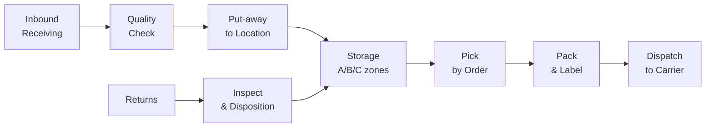

# LG04 — Warehouse Management
> *Quản lý kho: layout, receiving, WMS, cycle counting và fulfillment e-commerce*

---

## 1. Learning Objectives

- Thiết kế warehouse layout tối ưu (ABC slotting)
- Quản lý quy trình kho: Receiving, Put-away, Pick, Pack, Ship
- Triển khai và vận hành WMS (Warehouse Management System)
- Thực hiện cycle counting và đảm bảo inventory accuracy
- Quản lý cold chain và e-commerce fulfillment đặc thù VN

---

## 2. Business Context

Kho bãi là **điểm trung chuyển chiến lược** trong supply chain — không chỉ lưu trữ mà còn là nơi tạo ra giá trị (sorting, kitting, labeling, postponement).

**Tại VN:** Thị trường kho lạnh (cold chain) đang tăng trưởng mạnh theo FMCG và thực phẩm. E-commerce logistics đòi hỏi kho gần thành phố, tốc độ pick nhanh, xử lý hàng ngàn orders/ngày. Bất động sản kho logistics VN đang được các quỹ đầu tư nước ngoài (GLP, ESR, CapitaLand) đổ vốn mạnh.

---

## 3. Definitions

| Thuật ngữ | Định nghĩa |
|-----------|-----------|
| **WMS** | Warehouse Management System — phần mềm quản lý kho |
| **SKU** | Stock Keeping Unit — đơn vị quản lý tồn kho |
| **Put-away** | Quá trình cất hàng vào đúng vị trí sau khi nhận |
| **Pick & Pack** | Lấy hàng và đóng gói theo đơn hàng |
| **Slotting** | Phân bổ vị trí kho tối ưu cho từng SKU |
| **Cycle Counting** | Kiểm kê một phần kho định kỳ (thay vì toàn bộ 1 lần/năm) |
| **Cross-docking** | Chuyển hàng từ inbound thẳng sang outbound, không lưu kho |
| **Cold Chain** | Chuỗi nhiệt độ kiểm soát cho thực phẩm, dược phẩm |
| **GRN** | Goods Received Note — phiếu nhập hàng |
| **FEFO** | First Expired First Out — xuất hàng theo thứ tự hết hạn trước |

---

## 4. Core Concepts

### 4.1 Warehouse Layout Zones

```
RECEIVING AREA ──→ STAGING ──→ STORAGE AREA ──→ PICK AREA ──→ PACK ──→ DISPATCH

STORAGE ZONES (theo nhiệt độ):
  Ambient (nhiệt độ phòng): Hàng khô, dệt may, điện tử
  Chilled (2-8°C): Sữa, thịt tươi, rau củ
  Frozen (-18°C): Thịt đông lạnh, kem
  
STORAGE TYPES:
  Bulk: Pallet floor storage
  Rack: Selective pallet rack (phổ biến nhất)
  High-bay: Automated high-rise racking
  Mezzanine: Multi-level manual picking
  Carousel/ASRS: Automated retrieval systems
```

### 4.2 ABC Slotting

```
ABC ANALYSIS (dựa trên pick frequency):

CLASS A (20% SKUs, 80% picks):
  → Đặt gần pick face, tầng thấp, gần dispatch
  → Minimize travel time → tăng productivity

CLASS B (30% SKUs, 15% picks):
  → Middle locations

CLASS C (50% SKUs, 5% picks):
  → High racks, far from dispatch
  → OK để đi xa vì ít khi pick

GOLDEN ZONE (waist-to-shoulder height):
  → Dành cho A-class items → giảm ergonomic strain

RE-SLOTTING: Thực hiện hàng quý hoặc khi portfolio thay đổi
```

### 4.3 Inbound Process

```
RECEIVING FLOW:
  Truck arrives → Check appointment/booking
  → Unload (dock plate, forklift)
  → Physical count vs Packing List
  → Quality inspection (sampling)
  → GRN created in WMS/ERP
  → Barcode/RFID scan
  → Put-away instruction từ WMS
  → Product to correct location
  → System update (inventory level, location)

RECEIVING KPIs:
  Receiving accuracy: > 99.5%
  Putaway cycle time: < 2 hours
  GRN processing time: Same day
```

### 4.4 Outbound Process

```
OUTBOUND FLOW:
  Order received → Wave planning (batch orders)
  → Pick list generated (WMS optimal route)
  → Picker travels, scans, picks
  → Conveyor/manual to pack area
  → Packing + labeling
  → Quality check
  → Staging by carrier/route
  → Carrier pickup
  → System update (shipment created)

PICK METHODS:
  Discrete picking: 1 order, 1 picker (simple, slow)
  Batch picking: 1 picker, multiple orders (efficient)
  Zone picking: Each picker owns a zone (fast, high volume)
  Wave picking: Batch by time window / carrier departure
  Pick-to-Light / Voice picking: Technology-assisted
```

### 4.5 WMS Core Functions

```
WMS CAPABILITIES:
  ┌───────────────────────────────────────────┐
  │ INVENTORY MANAGEMENT                       │
  │   Real-time stock levels by location       │
  │   Lot/batch/serial tracking                │
  │   FIFO/FEFO/LIFO compliance               │
  │                                            │
  │ INBOUND MANAGEMENT                         │
  │   ASN receipt, GRN, Put-away              │
  │                                            │
  │ OUTBOUND MANAGEMENT                        │
  │   Order management, wave planning          │
  │   Pick, pack, ship                         │
  │                                            │
  │ LABOR MANAGEMENT                           │
  │   Task assignment, productivity tracking   │
  │                                            │
  │ REPORTING & ANALYTICS                      │
  │   Inventory accuracy, throughput, KPIs     │
  └───────────────────────────────────────────┘

VN WMS OPTIONS:
  SAP EWM: Enterprise (Samsung, Vinamilk)
  Oracle WMS: Enterprise
  Infor WMS: Mid-market
  3PL WMS (3PLink, CargoWise): 3PL providers
  Local: Sapo, KiotViet (small business)
```

### 4.6 Cycle Counting

```
WHY CYCLE COUNTING:
  Annual physical count: Disruptive, 1-2 ngày shutdown
  Cycle counting: Count portions daily/weekly → continuous accuracy

CYCLE COUNTING METHODS:
  ABC-based: A class daily, B weekly, C monthly
  Random: Random sample mỗi ngày
  Location-based: Rotate through all locations

CYCLE COUNT PROCESS:
  1. System generate count list (blind count)
  2. Counter count physical, không nhìn system quantity
  3. Compare physical vs system
  4. Investigate discrepancies > threshold (e.g., > 1 unit hay > $10)
  5. Adjust system (với approval)
  6. Track accuracy trends

TARGET: Inventory accuracy > 99.5%
```

### 4.7 E-commerce Fulfillment VN

```
E-COM WAREHOUSE REQUIREMENTS:
  ✓ High order volume (1,000-50,000+ orders/day)
  ✓ Many SKUs (long tail), small quantities
  ✓ Returns processing (10-20% return rate VN)
  ✓ COD handling (70% VN orders)
  ✓ B2C packing (branded packaging, inserts)
  ✓ Last-mile carrier handoff (GHN, GHTK, J&T)
  ✓ Same-day/next-day pressure

FULFILMENT MODELS VN:
  Self-warehouse: Control nhưng capex cao
  3PL Fulfillment: Giao Hàng Nhanh WMS, Fulfillment by Shopee
  Omnichannel: Dùng store như micro-fulfillment center
```

---

## 5. Business Value

| Ứng dụng | Kết quả |
|---------|---------|
| ABC slotting | Tăng pick productivity 20-30% |
| WMS implementation | Inventory accuracy từ 85% → 99%+ |
| Cycle counting | Không cần annual shutdown, continuous accuracy |
| Wave planning | Tăng throughput, đúng deadline carrier pickup |

---

## 6. Enterprise Role

- **Warehouse Manager:** Operations, KPIs, staffing
- **Inbound Supervisor:** Receiving và put-away
- **Outbound Supervisor:** Pick, pack, dispatch
- **Inventory Controller:** Accuracy, cycle counts, adjustments
- **WMS Administrator:** System maintenance, user support

---

## 7. Departments Related

Logistics · Operations · Supply Chain · Finance · IT

---

## 8. Input

- Inbound: Purchase Orders, ASN từ suppliers
- Outbound: Sales Orders từ OMS/ERP
- Returns: RMA (Return Merchandise Authorization)

---

## 9. Output

- Completed shipments (Proof of Dispatch)
- GRN (Goods Received Notes)
- Inventory adjustments
- Warehouse KPI reports

---

## 10. Business Process

```
INBOUND:
  Supplier ships → ASN → Truck arrival
  → Unload → Receive → QC → GRN
  → Put-away → Location confirmed in WMS

OUTBOUND:
  Orders → Wave planning → Pick list
  → Pick → Consolidate → Pack
  → Label → Staging → Carrier pickup

RETURNS (Reverse Logistics):
  Return received → Inspect → Disposition
  → Restock / Dispose / Refurbish
```

---

## 11. Data Flow

```
ERP/OMS → Orders → WMS (wave planning, pick instructions)
WMS → Real-time inventory levels → ERP
WMS → Carrier manifests → 3PL systems
WMS → Labor data → HR/Payroll
```

---

## 12. Money Flow

```
Warehousing costs:
  Rent/depreciation (40-50% of warehouse cost)
  Labor (30-40%)
  Utilities, equipment maintenance (10-15%)
  Technology (WMS, scanners, etc.) (5-10%)

3PL warehousing pricing models:
  Per pallet/bin/sqm: Fixed storage
  Per unit handled (inbound/outbound): Variable
  Hybrid: Fixed base + variable throughput
```

---

## 13. Document Flow

```
Purchase Order → ASN → GRN → Put-away confirmation
Sales Order → Pick list → Pack list → Waybill
            → POD (Proof of Delivery) ← Carrier
Inventory adjustments → Cycle count report → Finance approval
```

---

## 14. Roles

| Vai trò | Trách nhiệm |
|---------|------------|
| Warehouse Manager | Operations oversight, KPIs, staffing |
| Inventory Controller | Accuracy, cycle counts, reconciliation |
| Inbound Lead | Receiving, quality check, put-away |
| Outbound Lead | Picking, packing, dispatch |
| WMS Admin | System config, user support |

---

## 15. Responsibilities

- Inventory Controller chịu trách nhiệm về accuracy — không phải IT
- Finance sign-off mọi inventory adjustments trên threshold

---

## 16. RACI

| Activity | WH Manager | Inv Controller | Finance | IT |
|----------|:----------:|:--------------:|:-------:|:--:|
| Cycle count | A | R | C | I |
| Inventory adjustment | C | A | A | I |
| WMS configuration | C | I | I | A |
| KPI reporting | A | R | C | I |

---

## 17. Frameworks

- **Lean Warehouse:** 5S, waste elimination (motion, waiting, transport)
- **Six Sigma:** Defect reduction in picking accuracy
- **Kaizen:** Continuous improvement events cho warehouse
- **GS1:** Barcode standards, location labeling

---

## 18. International Standards

- **ISO 9001:** Quality management
- **HACCP/ISO 22000:** Food safety (cold chain warehousing)
- **GDP (Good Distribution Practice):** Pharmaceutical warehousing
- **GS1 SSCC:** Serial Shipping Container Code

---

## 19. Vietnam Context

**Kho lạnh VN:**
- Nhu cầu tăng mạnh theo FMCG, seafood, pharma
- Capacity thiếu so với nhu cầu
- Players: ABA Cold Chain, Minh Phú, Vinafco, các 3PL quốc tế
- Thách thức: Chi phí điện cao, kỹ thuật viên lạnh thiếu

**E-commerce warehouse VN:**
- HCM: Bình Dương, Long An industrial parks → kho fulfillment
- HN: Hà Nam, Bắc Ninh
- Xu hướng: Dark store (mini warehouse trong nội đô)
- Same-day delivery pressure → kho gần trung tâm

**Warehouse real estate VN:**
- GLP, ESR, CapitaLand đầu tư lớn vào logistics parks
- Logictics parks: VSIP, Becamex, Mapletree

---

## 20. Legal Considerations

- **PCCC (Phòng cháy chữa cháy):** Bắt buộc với mọi kho hàng
- **An toàn lao động (Luật ATVSLĐ 2015):** Forklift, racking safety
- **GDP:** Điều kiện kho dược phẩm theo Bộ Y tế
- **Kho ngoại quan:** Theo Luật Hải Quan (hàng chưa làm thủ tục)

---

## 21. Common Mistakes

1. **No slotting strategy:** A-class items ở tận góc kho → waste motion
2. **Annual count only:** Không phát hiện shrinkage real-time
3. **Paper-based GRN:** Manual, slow, error-prone
4. **No location labels:** Staff nhớ vị trí "trong đầu" → risk
5. **Ignore returns:** Returns tắc nghẽn vì không có clear process
6. **Overstock staging area:** Staging area dùng như storage → chaos

---

## 22. Best Practices

- **5S trước WMS:** Sạch sẽ, ngăn nắp là nền tảng
- **Barcode mọi location** trước khi vận hành WMS
- **Blind count** trong cycle counting (counter không thấy system qty)
- **Golden zone** cho A-class items
- **Daily accuracy report** — biết ngay khi có discrepancy

---

## 23. KPIs

| KPI | Benchmark |
|-----|-----------|
| **Inventory accuracy** | > 99.5% |
| **Order fulfillment accuracy** | > 99.9% |
| **Pick productivity** | Ngành-specific (e-com: 50-200 lines/hour) |
| **Receiving cycle time** | < 4 hours for standard goods |
| **Dock-to-stock time** | < 24 hours |
| **Warehouse utilization** | 80-85% of capacity |

---

## 24. Metrics

- Labor cost per unit handled
- Shrinkage rate (% inventory lost/damaged)
- Return processing time

---

## 25. Reports

- **Daily warehouse dashboard:** Throughput, accuracy, utilization
- **Weekly cycle count report:** Discrepancies, adjustments
- **Monthly inventory accuracy report** (Finance review)

---

## 26. Templates

**Cycle Count Sheet:**
```
Date: ___________
Location: ___________  Counter: ___________

SKU Code  | Description     | UOM | Physical Count | System Qty | Variance
----------|-----------------|-----|----------------|------------|----------
[barcode] | [Product name]  | EA  | ____           | ____       | ____

Discrepancy reason (if any): ____________________________
Supervisor sign-off: ____________________________________
```

---

## 27. Checklists

**Warehouse operations daily checklist:**
- [ ] Staging area cleared từ hôm qua?
- [ ] Receiving dock clear và ready?
- [ ] Forklift safety check done?
- [ ] Pick lists generated cho today's orders?
- [ ] Cycle count completed (today's list)?
- [ ] Temperature logs checked (cold store)?
- [ ] Outbound staged và ready for carrier?

---

## 28. SOP

**Standard Receiving Process:**
```
1. Check booking/appointment against truck arrival
2. Verify truck seal number (if applicable)
3. Unload và stage in receiving area
4. Physical count vs packing list (100%)
5. Visual inspection for damage
6. Scan barcodes cho từng pallet/carton (WMS)
7. WMS creates GRN automatically
8. QC sampling (per QC plan for each supplier)
9. WMS generates put-away task
10. Move to location, scan confirmation
11. GRN confirmed — inventory available
Timeframe: Target < 4 hours từ truck arrival đến available
```

---

## 29. Case Study

**Lazada VN — Fulfillment Center:**

Lazada vận hành FC tại HCM và HN, xử lý hàng trăm ngàn orders/ngày trong peak season (11.11, 12.12).

**Setup:**
- WMS tích hợp với Lazada's OMS
- Zone picking với put-to-light system
- Sorter conveyor cho outbound
- Multiple carrier lanes (LEX, 3PL partners)

**Challenges trong peak:**
- Volume tăng 5-10x trong 1-2 ngày
- Surge staffing (tạm thời 3-4x normal headcount)
- Carrier capacity constraint

**Solutions:**
- Pre-positioned inventory (stocking fast movers trước)
- Temp staff trained 1 tuần trước peak
- Extended hours, 24/7 operations

---

## 30. Small Business Example

**Startup e-commerce 500 orders/ngày:**

```
Phase 1: Manual warehouse (Founder-operated)
  - Excel inventory tracking
  - Mã vị trí đơn giản: A1-1, A1-2...
  - Pick theo đơn hàng in ra

Phase 2: Basic WMS (500+ orders/ngày)
  - KiotViet hoặc Sapo WMS (~2-5tr/tháng)
  - Barcode scanner
  - Location labels

Phase 3: Full WMS (5,000+ orders/ngày)
  - Enterprise WMS với conveyor
  - Zone picking
  - Cân nhắc 3PL fulfillment
```

---

## 31. Enterprise Example

**Vinamilk Distribution Center:**

Vinamilk vận hành DC tại HCM và HN phục vụ toàn quốc.

**Key requirements:**
- Cold chain: Chilled 2-8°C cho sữa tươi
- FEFO: First Expired First Out — critical cho F&B
- High throughput: Phục vụ 3,000+ điểm bán
- SAP EWM tích hợp với SAP ERP

---

## 32. ERP Mapping

| Warehouse Activity | ERP Module |
|-------------------|-----------|
| Goods Receipt | MM — Goods Receipt |
| Put-away | WM/EWM — Transfer Order |
| Goods Issue | MM/SD — Goods Issue |
| Inventory adjustment | MM — Physical Inventory |
| Cycle count | MM — Inventory Count |

---

## 33. Automation Opportunities

- **Voice picking:** Hands-free, eyes-free picking (30% productivity gain)
- **Put-to-light / Pick-to-light:** LED guidance cho pick/pack
- **Conveyor + sorter:** Automate movement from pick to pack to dispatch
- **RFID:** Real-time location tracking of pallets/cartons

---

## 34. AI Opportunities

- **Demand-driven slotting:** AI re-slot automatically based on demand changes
- **Labor planning:** AI predict labor needs based on orders
- **Predictive maintenance:** Predict forklift, conveyor maintenance needs
- **Image recognition:** Automated receiving quality check

---

## 35. Implementation Guide

**WMS implementation roadmap:**
```
Tháng 1: Foundation
  - 5S toàn bộ kho
  - Barcode tất cả locations (A01-01 format)
  - Barcode/master data tất cả SKUs
  - Select WMS phù hợp quy mô

Tháng 2: Data migration
  - Load opening inventory vào WMS
  - Physical count để verify
  - Staff training (scan, receive, pick)

Tháng 3: Go-live
  - Parallel run: WMS + paper (1 tuần)
  - Go full WMS
  - Intensive support 2 tuần đầu

Tháng 4+: Optimize
  - Slotting review
  - KPI baseline
  - Cycle count program
```

---

## 36. Consulting Guide

**Warehouse assessment:**
1. Inventory accuracy hiện tại là bao nhiêu?
2. Có WMS không? Bao nhiêu % transactions manual?
3. Slotting strategy — A-class items ở đâu trong kho?
4. Cycle counting được thực hiện không?
5. Throughput capacity vs peak demand?

---

## 37. Diagnostic Questions

1. Inventory accuracy là bao nhiêu? Khi nào lần cuối làm full physical count?
2. Mất bao lâu để process một order từ pick đến dispatch?
3. Return rate bao nhiêu? Returns được xử lý thế nào?

---

## 38. Interview Questions

- "ABC slotting là gì và tại sao quan trọng?"
- "Cycle counting vs annual physical count — ưu nhược điểm?"
- "Làm thế nào tăng pick productivity?"

---

## 39. Exercises

**Bài 1:** Bạn có kho 1,000 SKU. Phân tích picks last 3 months: SKU 1-200 chiếm 78% picks, SKU 201-600 chiếm 18%, còn lại 4%. Thiết kế slotting strategy. Vẽ layout kho 3 zones (A/B/C).

**Bài 2:** Kho đang có inventory accuracy 92%. Thiết kế cycle counting program để đưa lên 99.5% trong 6 tháng. Tần suất count cho mỗi class?

**Bài 3:** E-commerce startup nhận 200 orders/ngày, mỗi order 3 lines trung bình. Tính số picker cần nếu pick rate là 120 lines/hour/person, working 8 hours/day.

---

## 40. References

- **Sách:** *Warehouse Management: A Complete Guide to Improving Efficiency* — Gwynne Richards
- **CSCMP:** cscmp.org — Supply chain standards
- **VN:** VLA (Vietnam Logistics Association)

---

## Output Formats

### Mermaid — Warehouse Flows


### Flashcards
```
Q: ABC slotting trong kho là gì?
A: Phân bổ vị trí kho dựa trên tần suất pick:
   A-class (20% SKUs, 80% picks) → Gần dispatch, tầng thấp, golden zone
   B-class (30% SKUs, 15% picks) → Middle locations
   C-class (50% SKUs, 5% picks) → Xa, tầng cao
   Kết quả: Giảm picker travel time 20-30%, tăng throughput.

Q: Cycle counting vs Annual physical count?
A: Annual count: Count toàn bộ 1 lần/năm. Disruptive, kho ngừng hoạt động 1-2 ngày.
   Cycle counting: Count từng phần mỗi ngày. Continuous, không disruptive.
   Cycle count tốt hơn: Phát hiện vấn đề sớm, target A-class frequently.
   Best practice: A-class monthly, B-class quarterly, C-class semi-annual.

Q: FEFO là gì và khi nào bắt buộc?
A: First Expired First Out — xuất hàng theo thứ tự gần hết hạn trước.
   Bắt buộc với: Thực phẩm, dược phẩm, mỹ phẩm có date.
   Khác FIFO (First In First Out): FIFO theo thứ tự nhập, FEFO theo date.
   WMS track FEFO automatically qua lot/batch management.
```

### JSON Metadata
```json
{
  "module_code": "LG04",
  "module_name": "Warehouse Management",
  "domain": "Logistics",
  "level": "Intermediate",
  "version": "1.0",
  "status": "complete",
  "prerequisites": ["LG01", "MF05", "OP01"],
  "related_modules": ["LG01", "LG02", "MF05", "MF06", "ERP05"],
  "learning_time_hours": 8,
  "key_frameworks": ["ABC Slotting", "5S", "Lean Warehouse", "FEFO/FIFO"],
  "key_standards": ["ISO 9001", "HACCP", "GDP", "GS1"],
  "vietnam_specific": true,
  "tags": ["warehouse", "WMS", "inventory", "picking", "cold-chain", "e-commerce", "fulfillment"]
}
```
