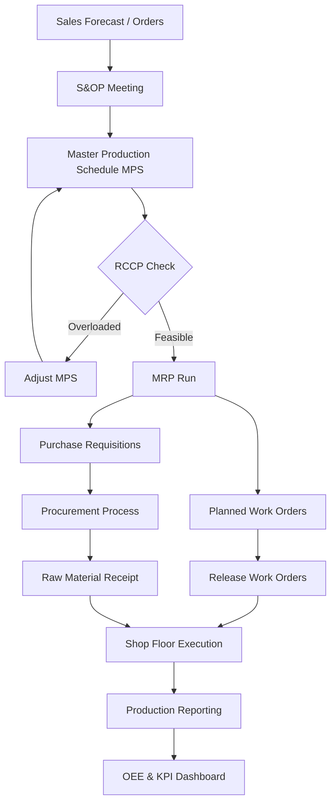

# MF01 — Manufacturing Management (Quản Lý Sản Xuất)

> **Domain:** Manufacturing
> **Trạng thái:** Hoàn thành
> **Level:** Intermediate
> **Prerequisites:** OP01 (Operations), SC01 (Supply Chain)

---

## 1. Learning Objectives (Mục tiêu học tập)

Sau khi hoàn thành module này, học viên có thể:

- Hiểu toàn bộ vòng đời Production Planning & Control (PPC) từ dự báo đến giao hàng
- Phân biệt và lựa chọn Manufacturing strategy phù hợp: MTO, MTS, ATO, ETO
- Lập kế hoạch sản xuất với MRP, MRP II và Master Production Schedule (MPS)
- Tính toán Capacity Planning (RCCP, CRP) và cân đối tải xưởng
- Quản lý Shop Floor: Work Order, Job Routing, Production Reporting
- Đo lường OEE (Overall Equipment Effectiveness) và cải thiện hiệu suất thiết bị
- Thiết kế Plant Layout tối ưu: Process, Product, Fixed-position, Cellular
- Áp dụng kiến thức vào thực tế sản xuất Việt Nam (dệt may, điện tử, nội thất)

---

## 2. Business Context (Bối cảnh kinh doanh)

Sản xuất là xương sống của nền kinh tế Việt Nam, đóng góp khoảng **30% GDP** và thu hút hơn **15 triệu lao động**. Trong bối cảnh Hiệp định EVFTA mở ra cơ hội xuất khẩu sang EU, các nhà máy VN phải nâng cấp năng lực quản lý sản xuất để đáp ứng tiêu chuẩn quốc tế.

**Xu hướng toàn cầu tác động đến sản xuất VN:**
- Dịch chuyển chuỗi cung ứng khỏi Trung Quốc (China+1) → FDI đổ vào VN (Samsung, Intel, LG)
- Yêu cầu truy xuất nguồn gốc (traceability) từ EU, Mỹ
- Áp lực chi phí lao động tăng → tự động hóa, nâng cao năng suất
- Carbon footprint tracking cho xuất khẩu vào thị trường xanh

**Thách thức thực tế tại VN:**
- Nhiều SME vẫn lập kế hoạch thủ công, thiếu ERP/MES
- Tỷ lệ OEE trung bình VN ở mức 45-55% (thế giới: 65-85%)
- Thiếu kỹ sư sản xuất có kỹ năng Planning & Control

---

## 3. Definitions (Định nghĩa)

| Thuật ngữ | Định nghĩa |
|-----------|-----------|
| **PPC** (Production Planning & Control) | Hệ thống lập kế hoạch và kiểm soát toàn bộ quá trình sản xuất từ nguyên liệu đến thành phẩm |
| **MTO** (Make-to-Order) | Sản xuất theo đơn hàng — chỉ sản xuất khi có PO từ khách |
| **MTS** (Make-to-Stock) | Sản xuất để tồn kho — sản xuất theo dự báo, bán hàng từ kho |
| **ATO** (Assemble-to-Order) | Lắp ráp theo đơn hàng — module/linh kiện được chuẩn bị sẵn, lắp theo spec KH |
| **ETO** (Engineer-to-Order) | Thiết kế theo đơn hàng — sản phẩm được thiết kế riêng cho từng KH |
| **MRP** (Material Requirements Planning) | Hệ thống tính toán nhu cầu nguyên vật liệu dựa trên MPS và BOM |
| **MRP II** (Manufacturing Resource Planning) | Mở rộng của MRP, bao gồm cả capacity planning, financial planning |
| **MPS** (Master Production Schedule) | Kế hoạch sản xuất chính — xác định sản phẩm gì, bao nhiêu, khi nào |
| **BOM** (Bill of Materials) | Danh sách toàn bộ nguyên vật liệu, linh kiện cần để sản xuất 1 đơn vị sản phẩm |
| **OEE** (Overall Equipment Effectiveness) | Chỉ số đo hiệu quả thiết bị = Availability × Performance × Quality |
| **RCCP** (Rough-Cut Capacity Planning) | Kiểm tra sơ bộ năng lực sản xuất để validate MPS |
| **CRP** (Capacity Requirements Planning) | Tính toán chi tiết năng lực cần thiết cho từng Work Center |
| **Work Order** | Lệnh sản xuất — tài liệu chỉ định sản xuất cái gì, bao nhiêu, khi nào, ở đâu |
| **Routing** | Trình tự các bước sản xuất và thời gian chuẩn cho từng operation |
| **Cellular Manufacturing** | Bố trí xưởng thành các "cell" gồm tất cả máy móc cần thiết cho một dòng sản phẩm |

---

## 4. Core Concepts (Khái niệm cốt lõi)

### 4.1 Manufacturing Strategies

```
Tùy chỉnh cao ←————————————————————→ Tiêu chuẩn hóa cao
     ETO          MTO         ATO          MTS
  (Thiết kế    (Sản xuất   (Lắp ráp    (Sản xuất
   theo đơn)   theo đơn)  theo đơn)   để tồn kho)

Lead time: Dài ←——————————————→ Ngắn
Chi phí tồn kho: Thấp ←————→ Cao
Ví dụ VN:    Cầu, đập    May mặc   Điện tử    FMCG
```

### 4.2 Production Planning Hierarchy

```
Level 1: Dự báo nhu cầu (Sales Forecast) — 6-18 tháng
    ↓
Level 2: S&OP / Aggregate Production Plan — 3-6 tháng
    ↓
Level 3: Master Production Schedule (MPS) — 4-12 tuần
    ↓
Level 4: MRP Run — Nhu cầu NVL, Work Orders — 1-4 tuần
    ↓
Level 5: Shop Floor Scheduling — Ngày/giờ
```

### 4.3 OEE Formula

```
OEE = Availability × Performance × Quality

Availability  = (Planned Time - Downtime) / Planned Time
Performance   = (Ideal Cycle Time × Total Count) / Run Time
Quality       = Good Count / Total Count

World Class OEE ≥ 85%
VN Average OEE ≈ 45-55%

Ví dụ:
- Availability: 90% (dừng 1h/ca 8h)
- Performance:  95% (chạy 95% tốc độ thiết kế)
- Quality:      99% (1% sản phẩm lỗi)
- OEE = 0.90 × 0.95 × 0.99 = 84.6%
```

### 4.4 Plant Layout Types

| Layout | Đặc điểm | Phù hợp | Ví dụ VN |
|--------|----------|---------|---------|
| **Process/Functional** | Máy cùng loại gom nhóm | Sản xuất đa dạng, volume thấp | Xưởng cơ khí vừa và nhỏ |
| **Product/Line** | Máy bố trí theo dòng sản phẩm | Volume cao, ít chủng loại | Nhà máy lắp ráp Samsung |
| **Fixed-position** | Sản phẩm cố định, người/máy di chuyển đến | Sản phẩm cồng kềnh, nặng | Đóng tàu, xây dựng |
| **Cellular** | Tế bào sản xuất khép kín | Nhóm sản phẩm tương đồng | Xưởng may cell layout |

---

## 5. Business Value (Giá trị kinh doanh)

| Lĩnh vực cải thiện | Tác động khi áp dụng tốt |
|-------------------|-------------------------|
| **On-Time Delivery (OTD)** | Tăng từ 70% → 95% với MPS và shop floor control tốt |
| **Inventory Reduction** | Giảm 20-40% WIP và raw material qua MRP chính xác |
| **Capacity Utilization** | Tăng từ 60% → 80%+ với RCCP và leveled scheduling |
| **Quality Cost** | Giảm scrap/rework 15-30% với quality checkpoints |
| **OEE Improvement** | Mỗi 1% OEE tăng ≈ $50K-$100K/năm cho nhà máy 100 máy |
| **Lead Time Reduction** | Giảm 30-50% với cellular layout + streamlined routing |

---

## 6. Enterprise Role (Vai trò trong doanh nghiệp)

Manufacturing Management là **trung tâm vận hành** của doanh nghiệp sản xuất:

- **Kết nối Sales và Operations**: chuyển đổi đơn hàng thành lệnh sản xuất khả thi
- **Tối ưu nguồn lực**: cân bằng nhân lực, máy móc, nguyên liệu
- **Kiểm soát chi phí sản xuất**: standard cost vs actual cost
- **Đảm bảo chất lượng**: quality gates tại từng công đoạn
- **Cung cấp dữ liệu cho Finance**: cost of goods manufactured (COGM)

---

## 7. Departments Related (Phòng ban liên quan)

```
┌─────────────────────────────────────────────────────┐
│              MANUFACTURING MANAGEMENT               │
├────────────┬────────────┬────────────┬─────────────┤
│   Sales/   │ Procurement│  Quality   │  Finance/   │
│  Customer  │ /Purchasing│  Assurance │ Accounting  │
│   Input:   │  Input:    │  Input:    │  Input:     │
│  PO, Spec  │  NVL, RM   │ Std, Spec  │  Budget     │
│  Output:   │  Output:   │  Output:   │  Output:    │
│  OTD, ATP  │  PO trigger│  QC result │  COGM, WIP  │
├────────────┴────────────┴────────────┴─────────────┤
│  Engineering/R&D  │  Maintenance  │  Warehouse/   │
│  BOM, Routing,    │  Downtime,    │  Inventory,   │
│  ECO management   │  PM schedule  │  Receiving    │
└───────────────────┴───────────────┴───────────────┘
```

---

## 8. Input (Đầu vào)

| Đầu vào | Nguồn | Mô tả |
|---------|-------|-------|
| Sales Orders / Forecast | Sales Department, CRM | Nhu cầu thị trường, đơn hàng xác nhận |
| Bill of Materials (BOM) | Engineering/R&D | Công thức sản phẩm, danh sách NVL |
| Routing | Engineering, IE | Trình tự công đoạn, thời gian chuẩn |
| Inventory Status | Warehouse, WMS | Tồn kho NVL, WIP, thành phẩm hiện có |
| Capacity Data | IE, Maintenance | Số ca, số máy, tốc độ, downtime dự kiến |
| Lead Times | Procurement | Thời gian đặt hàng NVL từ supplier |
| Quality Standards | QA/QC | Tiêu chuẩn kỹ thuật, acceptance criteria |

---

## 9. Output (Đầu ra)

| Đầu ra | Người nhận | Mục đích |
|--------|-----------|---------|
| Master Production Schedule (MPS) | All departments | Kế hoạch tổng thể — ai làm gì, khi nào |
| Work Orders (WO) | Shop Floor | Lệnh sản xuất từng lô hàng |
| Material Requirements (MRP Output) | Procurement | Đặt hàng NVL đúng thời điểm |
| Capacity Plan | Operations | Phân bổ máy móc, nhân lực |
| Production Reports | Management | OEE, output, efficiency, scrap rate |
| COGM Report | Finance | Chi phí thực tế hàng sản xuất |
| Delivery Schedule | Sales, Logistics | Ngày dự kiến giao hàng |

---

## 10. Business Process (Quy trình kinh doanh)

```
[Dự báo/Đơn hàng]
       ↓
[S&OP Meeting] → [Aggregate Plan] → [MPS]
       ↓
[MRP Run] → [Planned Orders]
       ↓
[RCCP/CRP Check] → [Capacity OK?] → No → [Adjust MPS]
       ↓ Yes
[Release Work Orders]
       ↓
[Material Picking & Kitting]
       ↓
[Shop Floor Execution]
    - Operation 1: Cutting/Forming
    - Operation 2: Processing
    - Operation 3: Assembly
    - Quality Inspection
       ↓
[Finished Goods → Warehouse]
       ↓
[Shipping & Delivery]
       ↓
[Production Reporting & Variance Analysis]
```

---

## 11. Data Flow (Luồng dữ liệu)

```
ERP/MRP System
├── Input Data Layer
│   ├── Item Master (SKU, BOM, Routing)
│   ├── Inventory Balances (real-time)
│   ├── Open Sales Orders
│   └── Supplier Lead Times
│
├── Planning Engine
│   ├── Demand Netting
│   ├── BOM Explosion
│   ├── MRP Calculation
│   └── Capacity Checks
│
└── Output Data Layer
    ├── Work Orders → Shop Floor
    ├── Purchase Orders → Procurement
    ├── Production Schedule → Supervisors
    └── Reports → Management Dashboard
```

---

## 12. Money Flow (Luồng tiền)

```
Chi phí sản xuất (Manufacturing Cost):

Direct Material  ─────────────────────────┐
(NVL trực tiếp)                           │
                                          ├──→ COGM
Direct Labor     ─────────────────────────┤   (Cost of Goods
(Lao động trực tiếp)                      │   Manufactured)
                                          │
Manufacturing Overhead ───────────────────┘
(Chi phí SX gián tiếp: điện, khấu hao,
  bảo trì, giám sát)

COGM → WIP Inventory → Finished Goods → COGS (khi bán)

Variance Analysis:
- Standard Cost vs Actual Cost
- Material Variance (giá và lượng)
- Labor Variance (giá và hiệu suất)
- Overhead Variance (fixed và variable)
```

---

## 13. Document Flow (Luồng tài liệu)

```
Sales Order (SO)
    ↓
Production Order / Work Order (WO)
    ↓
Material Requisition → Purchase Order (nếu thiếu NVL)
    ↓
Work Order Release → Job Card / Traveler
    ↓
Quality Inspection Record / NCR (Non-Conformance Report)
    ↓
Production Completion Report (Goods Receipt)
    ↓
COGM Journal Entry (kế toán)
    ↓
Delivery Order / Packing List → Customer
```

---

## 14. Roles (Vai trò)

| Vai trò | Mô tả |
|---------|-------|
| **Production Manager** | Quản lý toàn bộ hoạt động sản xuất, chịu trách nhiệm output, OTD, cost |
| **Production Planner** | Lập MPS, chạy MRP, phát hành Work Orders, theo dõi tiến độ |
| **Shop Floor Supervisor** | Quản lý ca sản xuất, phân công công việc, báo cáo tiến độ |
| **Industrial Engineer (IE)** | Thiết lập routing, time study, capacity analysis, layout optimization |
| **Quality Engineer** | Thiết lập inspection plan, xử lý NCR, SPC monitoring |
| **Maintenance Engineer** | Preventive maintenance, breakdown response, OEE improvement |
| **Warehouse/Stores** | Nhận NVL, cấp phát vật tư, nhập kho thành phẩm |

---

## 15. Responsibilities (Trách nhiệm)

**Production Manager:**
- Đảm bảo kế hoạch sản xuất được thực hiện đúng tiến độ, chất lượng, chi phí
- Báo cáo OEE, OTD, scrap rate hàng tuần cho Ban Giám đốc
- Phê duyệt Work Orders, thay đổi kế hoạch

**Production Planner:**
- Chạy MRP hàng tuần, update MPS khi có thay đổi đơn hàng
- Coordinate với Procurement khi thiếu NVL
- Cân bằng tải xưởng (capacity leveling)

**Shop Floor Supervisor:**
- Thực thi Work Orders đúng Routing và Standard Time
- Báo cáo actual output, downtime, scrap theo ca
- Quản lý nhân công, đào tạo on-the-job

---

## 16. RACI Matrix

| Hoạt động | Prod Manager | Planner | Supervisor | IE | QA | Finance |
|-----------|:---:|:---:|:---:|:---:|:---:|:---:|
| Lập MPS | A | R | C | C | I | I |
| Chạy MRP | I | R | I | I | I | I |
| Phát hành Work Order | A | R | C | I | I | I |
| Shop Floor Execution | C | I | R | I | C | I |
| Quality Inspection | I | I | C | I | R | I |
| OEE Reporting | A | C | R | C | I | I |
| Capacity Planning | A | R | C | R | I | I |
| COGM Reporting | I | C | I | I | I | R |

*R=Responsible, A=Accountable, C=Consulted, I=Informed*

---

## 17. Frameworks (Khung phương pháp)

### 17.1 MRP II Framework (Oliver Wight)
- Class A: Tất cả modules hoạt động tốt, data accuracy >95%
- Class B: Các module chính hoạt động, data accuracy 85-95%
- Class C: MRP hoạt động như order launching tool
- Class D: MRP không được dùng hoặc dùng sai

### 17.2 APICS CPIM Framework
- Demand Management → Master Planning → Detailed Scheduling
- Material Planning → Capacity Planning → Execution & Control

### 17.3 ISA-95 / Purdue Model
```
Level 4: Business Planning (ERP — SAP, Oracle)
Level 3: Manufacturing Operations (MES)
Level 2: Supervisory Control (SCADA, HMI)
Level 1: Control (PLC, DCS)
Level 0: Physical Process (Machines, Sensors)
```

---

## 18. International Standards (Tiêu chuẩn quốc tế)

| Tiêu chuẩn | Nội dung | Áp dụng |
|-----------|---------|---------|
| **ISO 9001:2015** | Quality Management System — yêu cầu kiểm soát sản xuất | Hầu hết nhà máy xuất khẩu VN |
| **IATF 16949:2016** | QMS cho ngành ô tô — Production Part Approval (PPAP) | Nhà máy auto components |
| **ISO 14001:2015** | Environmental Management — kiểm soát chất thải sản xuất | FDI factories |
| **ISO 45001:2018** | Occupational Health & Safety | Nhà máy có yêu cầu EU |
| **SA8000** | Social Accountability — điều kiện lao động | Ngành dệt may xuất khẩu |
| **OSHA 1910** | US safety standards | Nhà máy xuất khẩu sang Mỹ |
| **ISA-95/IEC 62264** | Integration of Enterprise and Control Systems | MES implementation |

---

## 19. Vietnam Context (Bối cảnh Việt Nam)

### 19.1 Cơ cấu ngành sản xuất VN

```
Top Manufacturing Sectors (% xuất khẩu):
1. Điện tử, điện thoại: ~35% (Samsung, LG, Intel)
2. Dệt may, da giày:    ~18% (Việt Tiến, TH Group)
3. Máy móc thiết bị:    ~12%
4. Nội thất, gỗ:         ~7% (AA Corporation)
5. Thực phẩm chế biến:   ~6%
```

### 19.2 FDI Manufacturing VN
- **Samsung** (Thái Nguyên, Bắc Ninh): áp dụng Samsung Production System (SPS) — hybrid của TPS và Six Sigma
- **Intel** (SHTP, TP.HCM): chip assembly & test, ISO 14001, OHSAS 18001
- **Nike/Adidas suppliers** (Bình Dương, Đồng Nai): áp dụng Lean + SA8000
- **Toyota VN** (Vĩnh Phúc): TPS, Kaizen, Just-in-Time

### 19.3 Thách thức SME VN
- 70% SME sản xuất không có ERP → lập kế hoạch bằng Excel
- Thiếu kỹ năng IE (Industrial Engineering): time study, routing
- Năng suất lao động VN = 1/7 so với Singapore, 1/3 so với Thái Lan
- Giải pháp: Chính phủ hỗ trợ vay ưu đãi mua phần mềm ERP (Nghị định 80/2021)

### 19.4 EVFTA và Yêu cầu sản xuất
- Quy tắc xuất xứ "từ vải" (fabric forward) cho dệt may → phải sản xuất tại VN từ giai đoạn vải
- Yêu cầu truy xuất nguồn gốc carbon (CBAM từ 2026) → cần data từ shop floor
- Tiêu chuẩn lao động ILO (chống lao động cưỡng bức) → yêu cầu document hóa

---

## 20. Legal Considerations (Các vấn đề pháp lý)

| Quy định | Cơ quan | Nội dung |
|---------|--------|---------|
| **Luật An toàn VSLĐ 2015** | Bộ LĐTBXH | An toàn lao động, huấn luyện AT, kiểm định thiết bị |
| **QCVN 01:2017/BCT** | Bộ Công Thương | Quy chuẩn kỹ thuật an toàn sử dụng điện trong sản xuất |
| **Nghị định 44/2016** | Chính phủ | Kiểm định máy, thiết bị có yêu cầu nghiêm ngặt |
| **Luật Bảo vệ MT 2020** | Bộ TNMT | Xử lý chất thải, khí thải, nước thải từ sản xuất |
| **Luật Chất lượng SP-HH 2007** | Bộ KHCN | Tiêu chuẩn chất lượng, trách nhiệm sản phẩm |
| **Bộ Luật Lao động 2019** | Bộ LĐTBXH | Giờ làm việc, OT, hợp đồng lao động, công đoàn |
| **Thông tư 47/2011/TT-BTC** | Bộ Tài chính | Kế toán chi phí sản xuất và tính giá thành |

---

## 21. Common Mistakes (Sai lầm phổ biến)

1. **MPS không thực thi được**: Lập kế hoạch quá tối ưu, không tính buffer cho breakdown, absenteeism → OTD thấp
2. **BOM không chính xác**: Sai số lượng, unit, version → MRP cho kết quả sai → thiếu/thừa NVL
3. **Bỏ qua Capacity Planning**: Phát hành quá nhiều Work Orders → bottleneck, WIP tắc nghẽn
4. **OEE đo không đúng**: Chỉ tính Performance, bỏ qua Availability và Quality losses
5. **Lẫn lộn MTO và MTS**: Áp dụng sai strategy dẫn đến tồn kho cao hoặc delivery late
6. **Shop Floor Data không real-time**: Planner không biết actual progress → không thể re-schedule kịp thời
7. **Không có Standard Time**: Không thể làm capacity planning chính xác, không đo được efficiency
8. **S&OP không thực chất**: Meeting S&OP chỉ mang tính hình thức, không ra quyết định trade-off thực sự

---

## 22. Best Practices (Thực hành tốt nhất)

1. **Data Accuracy First**: Đảm bảo BOM accuracy >98%, inventory accuracy >95% trước khi implement MRP
2. **Frozen Zone trong MPS**: Khóa kế hoạch 2-4 tuần gần nhất để ổn định sản xuất
3. **Visual Scheduling**: Dùng Gantt chart, scheduling board trực quan cho shop floor
4. **Daily Production Meeting (DPM)**: 15-phút standup mỗi sáng — actual vs plan, issues, actions
5. **Autonomous Maintenance**: Đào tạo operator tự bảo dưỡng máy → tăng Availability
6. **Queue Time Reduction**: Giảm WIP giữa các công đoạn → giảm lead time
7. **Takt Time Alignment**: Thiết kế line tốc độ bằng Takt Time = Available Time / Customer Demand
8. **SMED cho changeover**: Rút ngắn thời gian đổi khuôn/đổi mã → tăng flexibility

---

## 23. KPIs

| KPI | Công thức | Target |
|-----|-----------|--------|
| **OEE** | Availability × Performance × Quality | ≥ 85% (world class) |
| **On-Time Delivery (OTD)** | Đơn hàng đúng hạn / Tổng đơn hàng | ≥ 95% |
| **Capacity Utilization** | Actual Hours / Available Hours | 80-85% (để lại buffer) |
| **Manufacturing Cycle Efficiency (MCE)** | Value-Added Time / Total Lead Time | ≥ 25% |
| **Schedule Adherence** | WO hoàn thành đúng hạn / Tổng WO | ≥ 90% |
| **Scrap Rate** | Scrap Units / Total Produced | ≤ 1-2% |
| **Labor Efficiency** | Standard Hours / Actual Hours | ≥ 90% |
| **Cost Variance** | (Actual Cost - Standard Cost) / Standard Cost | ≤ ±5% |

---

## 24. Metrics (Chỉ số đo lường)

```
OEE Dashboard:
┌─────────────────────────────────────┐
│  Machine: CNC-001    Shift: A        │
│  Date: 30/06/2026                   │
├──────────────┬──────────────────────┤
│ Availability │ 87.5% (Planned: 90%) │
│ Performance  │ 93.2% (Planned: 95%) │
│ Quality      │ 98.1% (Planned: 99%) │
├──────────────┼──────────────────────┤
│ OEE          │ 80.0% ▲ +2.3%       │
└──────────────┴──────────────────────┘

Top Downtime Reasons:
1. Breakdown (mechanical)  - 45 min
2. Changeover              - 32 min
3. Material shortage       - 18 min
```

---

## 25. Reports (Báo cáo)

| Báo cáo | Tần suất | Người nhận | Nội dung chính |
|---------|---------|-----------|---------------|
| Daily Production Report | Hàng ngày | Production Manager | Output, efficiency, downtime, scrap |
| OEE Report | Hàng tuần | Plant Manager | OEE theo máy, nguyên nhân loss |
| MPS Adherence Report | Hàng tuần | Planning | Planned vs actual, deviation |
| Capacity Utilization | Hàng tháng | Management | % utilization by work center |
| Cost of Production | Hàng tháng | Finance | COGM, variance report |
| Quality Performance | Hàng tháng | QA, Management | First Pass Yield, Scrap, NCR |
| Supplier Performance | Hàng tháng | Procurement | OTD, quality, delivery accuracy |

---

## 26. Templates (Mẫu biểu)

### Work Order Template
```
WORK ORDER
WO#: WO-2026-001234
Product: SKU-ABC-001 (Áo sơ mi nam cotton)
Quantity: 500 units
Start Date: 01/07/2026
Due Date: 05/07/2026
Priority: High

Operations:
Op 10 | Cắt vải       | WC: Cutting-01  | Std: 0.5h/100pc
Op 20 | May thân áo   | WC: Sewing-A    | Std: 2.0h/100pc
Op 30 | May tay áo    | WC: Sewing-B    | Std: 1.5h/100pc
Op 40 | Là ủi + đóng gói | WC: Finish-01 | Std: 0.8h/100pc

Materials (BOM):
- Vải cotton: 750m (1.5m/pc)
- Cúc: 3,000 pcs (6 cúc/pc)
- Chỉ may: 5 cuộn
```

### MPS Template (Weekly)
```
Product | Week 27 | Week 28 | Week 29 | Week 30
SKU-001 |   500   |   600   |   500   |   700
SKU-002 |   300   |   300   |   400   |   300
SKU-003 |   200   |   200   |   200   |   200
Total   | 1,000   | 1,100   | 1,100   | 1,200
Capacity| 1,200   | 1,200   | 1,200   | 1,200
Buffer  |   200   |   100   |   100   |     0  ← ALERT
```

---

## 27. Checklists (Danh sách kiểm tra)

### MRP Data Readiness Checklist
- [ ] BOM accuracy ≥ 98% (kiểm tra random 50 BOM)
- [ ] Routing tồn tại cho tất cả SKU đang sản xuất
- [ ] Inventory balances được cycle count và update
- [ ] Lead times supplier được update trong 3 tháng gần nhất
- [ ] Safety stock được thiết lập cho critical materials
- [ ] Work Centers có capacity data (shift, efficiency factor)
- [ ] Open POs và WOs đã được xác nhận và update

### Daily Production Checklist (Đầu ca)
- [ ] Kiểm tra WO plan cho ca này
- [ ] Xác nhận NVL đã được kitting đầy đủ
- [ ] Kiểm tra tình trạng máy (5S + autonomous check)
- [ ] Review NCR và issues từ ca trước
- [ ] Xác nhận nhân sự đủ theo plan

---

## 28. SOP (Quy trình chuẩn)

### SOP-MFG-001: Work Order Release Process

**Mục đích:** Đảm bảo Work Orders được phát hành đúng thủ tục, đủ nguồn lực.

**Các bước:**
1. Planner kiểm tra MRP output hàng tuần (Thứ Hai)
2. Xác nhận NVL availability (check stock vs BOM requirement)
3. Xác nhận capacity availability (check RCCP)
4. Tạo Work Order trong ERP, gán Work Center và due date
5. In Job Card / Traveler gửi Supervisor
6. Supervisor xác nhận nhận WO, lập lịch chi tiết cho ca
7. Cập nhật Production Board (visual scheduling)

**Tiêu chí thành công:** WO được phát hành ít nhất 2 ngày trước start date.

---

## 29. Case Study (Tình huống thực tế)

### Case: Công ty May Nhà Bè (Garmex Saigon) áp dụng PPC

**Tình huống:** Nhà Bè nhận đơn hàng xuất khẩu EU 500,000 áo/tháng. OTD chỉ đạt 72%, khách hàng phạt late delivery.

**Vấn đề:** MPS được lập trên Excel thủ công, không kết nối với inventory. Khi thiếu NVL, shop floor vẫn chạy WO khác, dẫn đến hoàn thành sai thứ tự ưu tiên.

**Giải pháp:**
1. Implement ERP (Odoo Manufacturing) — 6 tháng
2. Thiết lập BOM và Routing chuẩn cho 200 SKU
3. Áp dụng MRP hàng tuần với frozen zone 3 tuần
4. Daily Production Meeting 15 phút với visual board

**Kết quả sau 12 tháng:**
- OTD tăng từ 72% → 94%
- WIP giảm 35%
- Overtime giảm 40% (plan ổn định hơn)
- Customer penalties = 0

---

## 30. Small Business Example (Ví dụ doanh nghiệp nhỏ)

**Xưởng gỗ nội thất 20 nhân công (Bình Dương):**

Thách thức: Nhận 50-80 đơn/tháng, mỗi đơn custom. Hay bị trễ hàng, không biết đơn nào đang ở bước nào.

Giải pháp đơn giản (không cần ERP):
- **Visual scheduling board**: bảng nam châm với 5 cột (To Do / Cutting / Sanding / Finishing / Done)
- **WO đơn giản**: phiếu A5 ghi số đơn, ngày hẹn, các bước chính
- **Daily 10 phút standup**: mỗi sáng review board, xử lý tắc nghẽn
- **Simple BOM**: Excel template với danh sách gỗ cho từng mã hàng

Kết quả: OTD tăng từ 55% → 82% chỉ với thay đổi quy trình, không cần phần mềm đắt tiền.

---

## 31. Enterprise Example (Ví dụ doanh nghiệp lớn)

**Samsung Electronics VN (Thái Nguyên) — 100,000+ nhân viên:**

- **Planning System**: SAP APO (Advanced Planning Optimizer) kết hợp SAP PP
- **MPS Horizon**: 13 tuần rolling, frozen 2 tuần
- **MRP Run**: Daily, automatic
- **Shop Floor**: MES (Samsung proprietary) kết nối với 5,000+ machines
- **OEE monitoring**: Real-time dashboard, alert khi OEE < 80%
- **Capacity Planning**: RCCP tự động, CRP theo shift
- **Quality**: SPC trên critical dimensions, auto-reject khi vượt control limits
- **Kết quả**: OEE 91%, OTD 99.2%, Scrap < 0.5%

---

## 32. ERP Mapping (Ánh xạ ERP)

| Quy trình | SAP Module | Oracle | Odoo |
|----------|-----------|--------|------|
| MPS | PP-MPS | ASCP | Manufacturing > MPS |
| MRP Run | PP-MRP | MRP | Manufacturing > Scheduler |
| Work Order | PP-WO (Production Order) | WIP | Manufacturing > Work Orders |
| BOM | PP-CS (Material Master) | BOM | Manufacturing > BoM |
| Routing | PP-RT (Work Center) | Routings | Manufacturing > Operations |
| Capacity | PP-CRP | Capacity | Manufacturing > Workcenter |
| Shop Floor | PP-SFC (PP-PI) | Shop Floor | Manufacturing > Operations |
| OEE | PM (Plant Maintenance) | EAM | Maintenance > OEE |
| COGM | CO-PC (Product Costing) | WIP Accounting | Accounting > COGM |

---

## 33. Automation (Tự động hóa)

| Công đoạn | Công nghệ | Ứng dụng VN |
|----------|-----------|------------|
| **MRP Auto-run** | Scheduled job trong ERP | Chạy MRP lúc 23:00 hàng ngày, sáng có kết quả |
| **Work Order Auto-release** | Rule-based trong ERP | Auto-release WO khi NVL available + capacity ok |
| **Production Tracking** | Barcode/RFID scan | Scan tại mỗi operation → real-time WIP visibility |
| **OEE Data Collection** | PLC → OPC-UA → MES | Tự động thu thập downtime từ máy |
| **Quality SPC** | Statistical software | Auto-alert khi process drift |
| **Scheduling Optimization** | AI/ML scheduler | Tối ưu trình tự jobs trên bottleneck machines |

---

## 34. AI Opportunities (Cơ hội AI)

| Ứng dụng | Mô tả | Impact |
|---------|-------|-------|
| **Demand Forecasting AI** | ML models dự báo nhu cầu từ historical data + external signals | Giảm forecast error 20-40% |
| **Predictive Maintenance** | AI phân tích vibration/temperature data → dự đoán breakdown | Giảm unplanned downtime 30-50% |
| **Anomaly Detection** | AI phát hiện bất thường trên production line (camera AI, sensor AI) | Giảm defect escape |
| **Scheduling Optimization** | AI tối ưu job sequencing, giảm makespan và setup times | Tăng throughput 10-15% |
| **Computer Vision QC** | Camera AI kiểm tra lỗi ngoại quan thay người | Tốc độ 10x, độ chính xác >99% |
| **Digital Twin** | Mô phỏng nhà máy số → test scenarios trước khi thực hiện | Giảm risk of changes |

---

## 35. Implementation Guide (Hướng dẫn triển khai)

### Lộ trình 12 tháng cho SME

**Tháng 1-2: Foundation**
- [ ] Kiểm tra và làm sạch BOM data
- [ ] Thiết lập Work Centers và Routing
- [ ] Cycle count inventory, cập nhật balance
- [ ] Đào tạo Planner về MRP concepts

**Tháng 3-4: MRP Pilot**
- [ ] Chạy MRP pilot cho 1 product line
- [ ] So sánh MRP suggestion với thực tế
- [ ] Hiệu chỉnh lead times, safety stock
- [ ] Daily Production Meeting

**Tháng 5-6: Shop Floor Control**
- [ ] Triển khai Work Order system
- [ ] Shop floor tracking (manual hoặc barcode)
- [ ] OEE measurement bắt đầu

**Tháng 7-12: Optimization**
- [ ] RCCP/CRP implementation
- [ ] S&OP process hàng tháng
- [ ] KPI dashboard và reporting
- [ ] Continuous improvement culture

---

## 36. Consulting Guide (Hướng dẫn tư vấn)

### Diagnostic Framework cho Manufacturing Client

**Bước 1: Current State Assessment (1 tuần)**
- Observe shop floor: 1 ngày Gemba Walk
- Interview Planning, Supervisor, IE, Quality, Procurement
- Collect data: OEE, OTD, scrap rate, inventory turns
- Map current production planning process

**Bước 2: Gap Analysis**
- So sánh với Industry Benchmark
- Identify top 3-5 pain points
- Prioritize by impact × feasibility

**Bước 3: Recommendations**
- Quick Wins (< 3 tháng): thường là process fixes, visual management
- Medium-term (3-12 tháng): ERP/MES implementation, data accuracy
- Long-term (12-36 tháng): automation, digital transformation

**Typical ROI cho Manufacturing Consulting:**
- OEE +5% → ~$200K/năm cho nhà máy 50 máy
- Inventory reduction 20% → release working capital $500K-$2M
- OTD improvement → avoid customer penalties, retain revenue

---

## 37. Diagnostic Questions (Câu hỏi chẩn đoán)

1. Công ty lập kế hoạch sản xuất bằng công cụ gì? (Excel, ERP, MES?)
2. BOM có được duy trì và kiểm tra accuracy định kỳ không?
3. OEE hiện tại là bao nhiêu? Đo bằng cách nào?
4. Tỷ lệ On-Time Delivery (OTD) tháng vừa rồi là bao nhiêu?
5. Khi có đơn hàng gấp, quy trình thay đổi kế hoạch như thế nào?
6. Shop floor supervisor biết tiến độ WO realtime không hay phải đi hỏi?
7. Bottleneck của xưởng ở đâu? Cách manage bottleneck như thế nào?
8. Scrap/rework rate là bao nhiêu? Chi phí quality failure hàng tháng?
9. Changeover time trung bình là bao lâu? Có kế hoạch giảm không?
10. Manufacturing cost variance tháng này là bao nhiêu? Do nguyên nhân gì?

---

## 38. Interview Questions (Câu hỏi phỏng vấn)

**Cho Production Planner:**
- Giải thích cách bạn chạy MRP và xử lý kết quả — bước nào hay sai?
- Khi capacity bị quá tải, bạn prioritize như thế nào?
- Làm thế nào để handle urgent orders mà không disrupt existing plan?

**Cho Production Manager:**
- Mô tả cách bạn cải thiện OEE tại nhà máy trước đây
- Kể về trường hợp OTD thấp và cách bạn xử lý
- Cách bạn cân bằng giữa yêu cầu của Sales và khả năng của sản xuất?

**Cho IE/Manufacturing Engineer:**
- Bạn sử dụng phương pháp gì để thiết lập Standard Time?
- Đã từng làm Plant Layout design? Tiêu chí nào quan trọng nhất?
- Giải thích cách tính Takt Time và áp dụng vào line balancing.

---

## 39. Exercises (Bài tập)

### Bài tập 1: OEE Calculation
Máy may công nghiệp tại xưởng dệt may:
- Giờ làm việc theo kế hoạch: 8h/ca
- Thời gian dừng máy: breakdown 30 phút, setup 20 phút, thiếu NVL 10 phút
- Tốc độ thiết kế: 200 sản phẩm/giờ
- Sản phẩm thực tế: 1,100 sản phẩm
- Sản phẩm lỗi: 22 sản phẩm

Tính: Availability, Performance, Quality, OEE.
*(Đáp án: A=87.5%, P=88.5%, Q=98%, OEE=75.9%)*

### Bài tập 2: MRP Calculation
BOM cho 1 bàn gỗ: 4 chân (SKU-101), 1 mặt bàn (SKU-102), 16 ốc vít (SKU-103)
- Đơn hàng: 100 bàn, giao tuần 5
- Lead time sản xuất: 1 tuần
- Tồn kho hiện tại: SKU-101: 150 pcs, SKU-102: 20 pcs, SKU-103: 500 pcs
- Safety stock: SKU-101: 50, SKU-102: 10, SKU-103: 200

Tính: Net requirement và ngày cần đặt hàng/sản xuất cho từng SKU.

### Bài tập 3: Capacity Planning
Work Center: Sewing-A có 10 máy, 2 ca/ngày, 8h/ca, efficiency 85%.
Nhận 3 Work Orders:
- WO-001: 500 pcs, std time 0.1h/pc
- WO-002: 800 pcs, std time 0.15h/pc
- WO-003: 600 pcs, std time 0.08h/pc

Tính Available Capacity và Load%. Có bị quá tải không?

---

## 40. References (Tài liệu tham khảo)

- Vollmann, T.E., et al. *Manufacturing Planning and Control for Supply Chain Management* (APICS/McGraw-Hill, 6th Ed.)
- Hopp, W.J., Spearman, M.L. *Factory Physics* (3rd Ed., Waveland Press)
- Groover, M.P. *Fundamentals of Modern Manufacturing* (5th Ed., Wiley)
- APICS CPIM Body of Knowledge — apics.org
- OEE.com — OEE resources and benchmarks
- Tổng cục Thống kê VN — Niên giám thống kê công nghiệp 2024
- Bộ Công Thương — Báo cáo ngành công nghiệp chế biến chế tạo 2025

---

## Output Formats

### Mermaid — Manufacturing Planning Flow


### ASCII Diagram — OEE Breakdown
```
PLANNED PRODUCTION TIME (480 min/ca)
├── DOWNTIME (60 min) = Availability Loss
│   ├── Breakdown: 30 min
│   ├── Changeover: 20 min
│   └── Material shortage: 10 min
│
└── RUN TIME (420 min) → Availability = 87.5%
    ├── SPEED LOSS (50 min) = Performance Loss
    │   ├── Reduced speed: 35 min
    │   └── Minor stops: 15 min
    │
    └── NET RUN TIME (370 min) → Performance = 88%
        ├── QUALITY LOSS (8 min) = Quality Loss
        │   └── Scrap/Rework: 8 min
        │
        └── FULLY PRODUCTIVE TIME (362 min)
            → Quality = 98%
            → OEE = 87.5% × 88% × 98% = 75.5%
```

### Flashcards
**Q1:** OEE đứng cho cái gì và công thức tính?
**A1:** Overall Equipment Effectiveness = Availability × Performance × Quality. World class ≥ 85%. Đo 3 loại tổn thất: dừng máy (downtime), tốc độ chậm (speed loss), và sản phẩm lỗi (quality loss).

**Q2:** Sự khác biệt giữa MTO, MTS, ATO, ETO là gì?
**A2:** MTO (Make-to-Order): sản xuất khi có đơn. MTS (Make-to-Stock): sản xuất để tồn kho theo dự báo. ATO (Assemble-to-Order): bán module, lắp theo spec. ETO (Engineer-to-Order): thiết kế riêng cho từng KH. Chọn strategy dựa trên mức độ customize và delivery time yêu cầu.

**Q3:** MRP cần 3 đầu vào chính là gì?
**A3:** (1) Master Production Schedule (MPS) — sản xuất cái gì, bao nhiêu, khi nào. (2) Bill of Materials (BOM) — công thức sản phẩm, cần NVL gì. (3) Inventory Records — tồn kho hiện có, open orders. MRP net off demand với supply để ra planned orders.

### Cheat Sheet
```
MANUFACTURING MANAGEMENT — CHEAT SHEET

STRATEGIES:       ETO → MTO → ATO → MTS
                  (Customize cao → Standard hóa)

PLANNING          Sales Forecast → S&OP → MPS → MRP → WO
HIERARCHY:

MRP INPUTS:       MPS + BOM + Inventory = Planned Orders
                  Net Req = Gross Req - On Hand - On Order + SS

OEE FORMULA:      OEE = Availability × Performance × Quality
                  A = (Planned - Downtime) / Planned
                  P = (Ideal CT × Count) / Run Time
                  Q = Good / Total
                  World Class: ≥ 85%

PLANT LAYOUTS:    Process | Product | Fixed-position | Cellular
                  Diverse  | Volume  | Large items    | Groups

TAKT TIME:        Available Time / Customer Demand Rate
                  (Nhịp sản xuất = nhịp khách hàng)

KEY REPORTS:      Daily Production | OEE | OTD | Cost Variance
```

### JSON Metadata
```json
{
  "module": {
    "code": "MF01",
    "name": "Manufacturing Management",
    "domain": "Manufacturing",
    "level": "Intermediate",
    "prerequisites": ["OP01", "SC01"],
    "related_modules": ["MF02", "MF03", "MF04", "MF05", "MF06"],
    "key_concepts": [
      "Production Planning & Control (PPC)",
      "Manufacturing Strategy (MTO/MTS/ATO/ETO)",
      "MRP / MRP II",
      "Master Production Schedule (MPS)",
      "Capacity Planning (RCCP/CRP)",
      "OEE",
      "Shop Floor Management",
      "Plant Layout"
    ],
    "key_tools": ["SAP PP", "Oracle WIP", "Odoo Manufacturing", "MES", "ERP"],
    "standards": ["ISO 9001:2015", "IATF 16949", "ISA-95"],
    "vietnam_context": {
      "gdp_contribution": "~30%",
      "key_industries": ["electronics", "garment", "furniture", "food processing"],
      "fdi_examples": ["Samsung", "Intel", "Nike suppliers", "Toyota VN"],
      "regulatory": ["Luat An toan VSLD 2015", "Bo luat Lao dong 2019", "Luat BVMT 2020"]
    },
    "kpis": ["OEE", "OTD", "Schedule Adherence", "Scrap Rate", "Labor Efficiency", "Cost Variance"],
    "last_updated": "2026-06-30",
    "author": "Business Knowledge Graph"
  }
}
```
