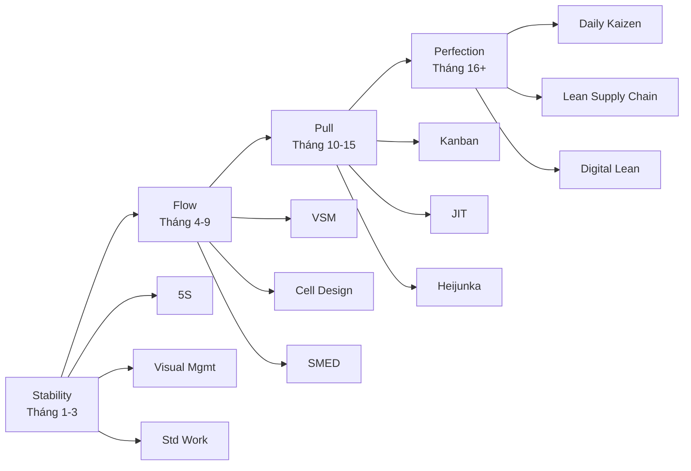

# MF02 — Lean Manufacturing (Sản Xuất Tinh Gọn)

> **Domain:** Manufacturing
> **Trạng thái:** Hoàn thành
> **Level:** Intermediate
> **Prerequisites:** MF01 (Manufacturing Management)

---

## 1. Learning Objectives (Mục tiêu học tập)

Sau khi hoàn thành module này, học viên có thể:

- Giải thích triết lý Toyota Production System (TPS) và mối liên hệ với Lean
- Nhận diện và phân loại 8 lãng phí (TIMWOODS) trong môi trường sản xuất thực tế
- Thực hiện 5S tại xưởng sản xuất với roadmap rõ ràng
- Xây dựng Value Stream Map (VSM) — current state và future state
- Thiết kế hệ thống Kanban và Just-in-Time (JIT) phù hợp
- Tổ chức Kaizen Event hiệu quả (workshop 3-5 ngày)
- Áp dụng Poka-Yoke và Andon để giảm lỗi và tăng phản ứng nhanh
- Hiểu Heijunka (production leveling) và SMED để tăng flexibility
- Áp dụng Lean vào bối cảnh nhà máy dệt may, điện tử VN

---

## 2. Business Context (Bối cảnh kinh doanh)

Lean Manufacturing ra đời từ **Toyota Production System (TPS)** — được phát triển từ những năm 1950-1970 bởi Taiichi Ohno và Shigeo Shingo. Thuật ngữ "Lean" được James Womack và Daniel Jones đặt ra trong cuốn *The Machine That Changed the World* (1990) sau khi nghiên cứu Toyota.

**Tại sao Lean quan trọng với VN năm 2026:**
- Chi phí lao động VN tăng 8-12%/năm → không thể cạnh tranh bằng nhân công rẻ mãi
- Khách hàng EU, Mỹ yêu cầu cycle time ngắn hơn, flexibility cao hơn → Lean là giải pháp
- FDI Samsung, LG, Panasonic áp dụng Lean → buộc suppliers VN phải nâng cấp
- EVFTA yêu cầu traceability → VSM giúp map toàn bộ value stream
- Lean giảm lead time 30-50%, inventory 20-40%, defects 50-80% → ROI rõ ràng

**Lean trong ngành dệt may VN (điển hình):**
- Ngành may mặc VN có ~6,000 nhà máy, xuất khẩu $38 tỷ USD/năm
- Hiệu suất trung bình chỉ 40-50% SAM (Standard Allowed Minutes)
- Lean có thể nâng lên 65-75% SAM → tăng năng suất 30-50% không cần đầu tư thêm máy

---

## 3. Definitions (Định nghĩa)

| Thuật ngữ | Định nghĩa |
|-----------|-----------|
| **TPS** (Toyota Production System) | Hệ thống sản xuất Toyota — nguồn gốc của Lean, hai trụ cột: JIT và Jidoka |
| **Lean** | Triết lý sản xuất tập trung vào loại bỏ lãng phí (Muda), tôn trọng con người |
| **Muda** | Lãng phí — hoạt động không tạo giá trị cho khách hàng |
| **Muri** | Quá tải — yêu cầu vượt quá khả năng của người/máy |
| **Mura** | Không đồng đều — biến động bất thường trong sản xuất |
| **TIMWOODS** | 8 loại lãng phí: Transport, Inventory, Motion, Waiting, Overproduction, Over-processing, Defects, Skills |
| **5S** | Sort (Sàng lọc), Set in order (Sắp xếp), Shine (Sạch sẽ), Standardize (Săn sóc), Sustain (Sẵn sàng) |
| **VSM** (Value Stream Mapping) | Công cụ vẽ bản đồ toàn bộ dòng giá trị từ nguyên liệu đến khách hàng |
| **JIT** (Just-in-Time) | Sản xuất/nhận đúng loại, đúng số lượng, đúng thời điểm cần |
| **Kanban** | Hệ thống tín hiệu kéo (pull) — thẻ/container kích hoạt sản xuất hoặc đặt hàng |
| **Kaizen** | Cải tiến liên tục nhỏ (改善) — mọi người đều tham gia |
| **Poka-Yoke** | Cơ chế chống sai lầm (mistake-proofing) — thiết kế để không thể lắp sai |
| **Andon** | Hệ thống tín hiệu cảnh báo trực quan (đèn/còi) để kêu gọi hỗ trợ |
| **Heijunka** | San bằng sản xuất — chia nhỏ và trộn đều đơn hàng để giảm biến động |
| **SMED** (Single-Minute Exchange of Die) | Phương pháp giảm thời gian changeover xuống dưới 10 phút |
| **Takt Time** | Nhịp sản xuất = Available Time / Customer Demand — pace của line |
| **Jidoka** | Automation với trí tuệ con người — máy tự dừng khi phát hiện lỗi |
| **Gemba** | Nơi sản xuất thực tế — "Gemba Walk" = đi quan sát trực tiếp tại xưởng |

---

## 4. Core Concepts (Khái niệm cốt lõi)

### 4.1 Toyota Production System (TPS) — Ngôi nhà TPS

```
         ┌─────────────────────────────────┐
         │         BEST QUALITY            │
         │      LOWEST COST               │
         │    SHORTEST LEAD TIME           │
         │      BEST SAFETY               │
         │     HIGH MORALE               │
         └──────────────┬──────────────────┘
              ┌─────────┴──────────┐
              ↓                    ↓
    ┌──────────────────┐ ┌──────────────────┐
    │   JUST-IN-TIME   │ │     JIDOKA       │
    │  - Takt Time     │ │  - Auto stop     │
    │  - Continuous    │ │  - Andon         │
    │    Flow          │ │  - Separate      │
    │  - Pull System   │ │    man/machine   │
    │    (Kanban)      │ │    work          │
    └──────────────────┘ └──────────────────┘
              ↑                    ↑
         ─────────────────────────────
         HEIJUNKA (Production Leveling)
         STANDARDIZED WORK
         KAIZEN (Continuous Improvement)
         ─────────────────────────────
                      ↑
              STABILITY FOUNDATION
         (5S, TPM, Visual Management)
```

### 4.2 8 Wastes — TIMWOODS

| Waste | Tiếng Việt | Ví dụ nhà máy may VN |
|-------|-----------|---------------------|
| **T**ransport | Vận chuyển thừa | Chuyền may ở tầng 1, kho vải tầng 3, đi lên đi xuống nhiều lần |
| **I**nventory | Tồn kho dư thừa | 2 tuần WIP chờ giữa công đoạn cắt và may |
| **M**otion | Di chuyển không cần thiết | Công nhân phải đứng dậy lấy dụng cụ cách 5m |
| **W**aiting | Chờ đợi | Chờ máy sửa, chờ NVL, chờ quyết định |
| **O**verproduction | Sản xuất thừa | May xong cất kho vì sales chưa có đơn |
| **O**ver-processing | Xử lý thừa | Kiểm tra 3 lần giống nhau, QC trùng lặp |
| **D**efects | Sản phẩm lỗi | May sai kích cỡ, đường chỉ lỏng → phải rework |
| **S**kills | Lãng phí tài năng | Kỹ sư giỏi làm báo cáo Excel thủ công mỗi ngày |

### 4.3 Value Stream Mapping (VSM)

```
CURRENT STATE MAP — Nhà máy may áo sơ mi:

Supplier          Factory                          Customer
(Vải)    ──Trk──→ ┌────────┬──────┬──────┬──────┐ ──Trk──→ (Retailer)
Weekly            │ Kho    │ Cắt  │ May  │ Hoàn │
delivery          │ Vải    │      │      │ thiện│
                  │ I=5d   │ CT=  │ CT=  │ CT=  │
                  │        │ 2min │ 8min │ 3min │
                  └────────┴──────┴──────┴──────┘
                  PUSH ──→  PUSH ──→  PUSH ──→

Timeline:
Process time:  2 + 8 + 3 = 13 min
Total Lead Time: 5d + 2d + 3d + 1d = 11 days
Value-Add %: 13 min / (11 × 480 min) = 0.25%

FUTURE STATE MAP targets:
- Pull system (Kanban) giữa cắt-may-hoàn thiện
- 1-piece flow hoặc small batch
- Daily supplier delivery (thay vì weekly)
- Total Lead Time: 2 days (giảm 82%)
- Value-Add %: >2%
```

### 4.4 Kanban System

```
2-Bin Kanban (phổ biến nhất cho VN SME):

   Bin 1 (Active)    Bin 2 (Reserve)
   ┌──────────────┐  ┌──────────────┐
   │  Nut M8      │  │  Nut M8      │  ← Khi Bin 1 hết,
   │  50 pcs      │  │  50 pcs      │    lật thẻ Kanban
   │  [KANBAN]    │  │  [KANBAN]    │    → signal đặt hàng
   └──────────────┘  └──────────────┘

Kanban Card:
┌─────────────────────────────────┐
│ Part#: NUT-M8-SS               │
│ Description: Nut inox M8       │
│ Qty: 50 pcs                    │
│ Supplier: ABC Hardware         │
│ Lead Time: 2 days              │
│ Location: Shelf B-3-2          │
└─────────────────────────────────┘

Kanban Formula:
Số thẻ Kanban = (Demand × Lead Time + Safety Stock) / Container Size
```

### 4.5 SMED Methodology

```
SMED — 4 bước:

Bước 1: Quan sát & Video toàn bộ changeover
    ↓
Bước 2: Phân loại Internal vs External activities
    Internal: chỉ làm được khi máy đang dừng
    External: có thể làm khi máy đang chạy
    ↓
Bước 3: Chuyển Internal → External (chuẩn bị sẵn trước)
    ↓
Bước 4: Streamline cả Internal và External

Kết quả điển hình:
Before: 45 min changeover
After:   8 min changeover (giảm 82%)
```

---

## 5. Business Value (Giá trị kinh doanh)

| Chỉ số | Trước Lean | Sau Lean | Cải thiện |
|--------|-----------|---------|---------|
| **Lead Time** | 15 ngày | 5 ngày | -67% |
| **WIP Inventory** | 10 ngày | 2 ngày | -80% |
| **Defect Rate** | 3% | 0.5% | -83% |
| **Space Utilization** | 60% productive | 85% productive | +42% |
| **Changeover Time** | 45 phút | 8 phút | -82% |
| **Labor Efficiency** | 45% SAM | 68% SAM | +51% |
| **On-Time Delivery** | 78% | 96% | +23% |
| **Cash freed (WIP)** | - | $300K-$2M | Tùy nhà máy |

---

## 6. Enterprise Role (Vai trò trong doanh nghiệp)

Lean không chỉ là công cụ — là **triết lý quản lý và văn hóa doanh nghiệp**:

- **Chiến lược cạnh tranh**: Lean giúp cạnh tranh bằng speed và quality thay vì giá rẻ
- **Customer Value**: Focus vào value từ góc nhìn khách hàng, loại bỏ tất cả không tạo value
- **Nhân lực**: Lean tôn trọng và phát huy trí tuệ của người lao động (Respect for People)
- **Supply Chain**: Extend Lean ra ngoài nhà máy — Lean suppliers, Lean logistics
- **Financial Impact**: Lean là "free cash machine" — giảm inventory = release working capital

---

## 7. Departments Related (Phòng ban liên quan)

```
┌──────────────────────────────────────────────┐
│            LEAN MANUFACTURING                │
│              (Core: Shop Floor)              │
├───────────┬───────────┬──────────┬──────────┤
│  Supply   │ Engineering│ Quality  │   HR &   │
│   Chain   │   (IE)    │  (QA)    │ Training │
│ JIT supply│ Layout,   │ Poka-Yoke│ Lean     │
│ Milk run  │ Routing   │ QC in    │ culture, │
│ VMI       │ Standard  │ process  │ Kaizen   │
│           │ work      │ Andon    │ teams    │
├───────────┴───────────┴──────────┴──────────┤
│  Finance: Track Lean savings, ROI           │
│  IT/MES: Digital Kanban, OEE tracking      │
│  Senior Management: Lean strategy, resource│
└─────────────────────────────────────────────┘
```

---

## 8. Input (Đầu vào)

| Đầu vào | Nguồn | Mô tả |
|---------|-------|-------|
| Current State VSM | Gemba observation | Trạng thái hiện tại của value stream |
| Customer demand data | Sales, ERP | Takt time calculation |
| Process data | IE, operators | Cycle time, changeover time, defect rates |
| Inventory levels | Warehouse, WMS | WIP, RM, FG quantities |
| Downtime data | Maintenance, MES | Breakdown frequency, duration |
| Operator input | Shop floor interviews | Practical waste identification |
| Benchmark data | Industry, consultants | Target state comparison |

---

## 9. Output (Đầu ra)

| Đầu ra | Mô tả |
|--------|-------|
| Future State VSM | Bản đồ trạng thái tương lai với Lean flows |
| 5S Audit Scores | Điểm 5S theo khu vực, trend cải thiện |
| Kanban System | Số thẻ, quy trình pull, visual management |
| Standard Work Instructions | Hướng dẫn thao tác chuẩn có hình ảnh |
| Kaizen Action Log | Danh sách cải tiến đang/đã thực hiện |
| Lean KPI Dashboard | OEE, lead time, WIP, defect trend |
| SMED Documentation | Changeover procedure sau cải tiến |
| Poka-Yoke Devices | Cơ chế chống lỗi được thiết kế và lắp đặt |

---

## 10. Business Process (Quy trình kinh doanh)

```
Lean Implementation Journey:

Phase 1: STABILITY (Tháng 1-3)
├── 5S toàn nhà máy
├── Visual management
├── Standardized work
└── Basic problem solving (A3)

Phase 2: FLOW (Tháng 4-9)
├── VSM current state
├── Identify biggest waste
├── Cell design / one-piece flow
└── SMED on critical machines

Phase 3: PULL (Tháng 10-15)
├── Kanban design và pilot
├── JIT supplier integration
├── Heijunka scheduling
└── Poka-Yoke priority items

Phase 4: PERFECTION (Tháng 16+)
├── Kaizen culture embedding
├── Daily Kaizen (small improvements)
├── Lean extend to supply chain
└── Lean accounting
```

---

## 11. Data Flow (Luồng dữ liệu)

```
PULL SYSTEM DATA FLOW:

Customer Orders
       ↓
Heijunka Box (Production Leveling)
       ↓
Final Assembly Schedule (Pacemaker)
       ↓ Kanban signal (upstream)
Finishing → Assembly → Sub-assembly → Machining
       ↑         ↑           ↑            ↑
  Replenish  Replenish   Replenish    Replenish
  from FG    from WIP    from WIP     from RM

Information flows: PULL (downstream triggers upstream)
Material flows: PUSH delivery to supermarkets
```

---

## 12. Money Flow (Luồng tiền)

```
Lean và Cash Flow:

BEFORE LEAN:
NVL order → [Kho RM: 30 ngày] → Sản xuất → [WIP: 15 ngày]
→ [Kho FG: 10 ngày] → Giao hàng → Thu tiền
Cash-to-Cash Cycle: 55+ ngày

AFTER LEAN:
NVL order → [Kho RM: 5 ngày] → Sản xuất → [WIP: 2 ngày]
→ [Kho FG: 3 ngày] → Giao hàng → Thu tiền
Cash-to-Cash Cycle: 10-12 ngày

Working Capital released: (55-12 ngày) × Daily COGS
Ví dụ nhà máy may 200 tỷ VND doanh thu:
Daily COGS ≈ 400 triệu VND
WC released = 43 ngày × 400M = 17.2 tỷ VND
```

---

## 13. Document Flow (Luồng tài liệu)

```
Lean Documentation Framework:

A3 Report (Problem Solving)
├── Background & Problem Statement
├── Current Condition (data, VSM)
├── Root Cause Analysis
├── Countermeasures
├── Target Condition
├── Implementation Plan
└── Results & Follow-up

Standard Work Documents:
├── Job Instruction Sheet (có hình ảnh)
├── Standard Work Combination Sheet
├── Production Analysis Chart
└── Time Observation Sheet

Visual Management:
├── Andon Board
├── Production Tracking Board
├── 5S Audit Sheet
└── Kaizen Log (Improvement Board)
```

---

## 14. Roles (Vai trò)

| Vai trò | Trách nhiệm Lean |
|---------|----------------|
| **Lean Champion / Director** | Sponsor chiến lược Lean, duyệt resources, remove barriers cấp cao |
| **Lean Manager / Sensei** | Dẫn dắt transformation, training, VSM facilitation, Kaizen events |
| **Lean Coordinator** | Track Kaizen action items, maintain 5S audit schedule, metrics |
| **Team Leader (Cell Leader)** | Duy trì Standard Work, lead daily Kaizen, solve problems ngay tại line |
| **Operator / Production Worker** | Thực hiện Standard Work, report abnormalities (Andon), tham gia Kaizen |
| **Maintenance Technician** | Autonomous maintenance, quick changeover support (SMED) |
| **Industrial Engineer** | Standard time study, layout design, Takt time calculation |

---

## 15. Responsibilities (Trách nhiệm)

**Lean Manager:**
- Duy trì Lean roadmap và tiến độ implementation
- Tổ chức Kaizen events (4-6 lần/năm)
- Đào tạo Team Leaders về Lean tools
- Báo cáo Lean savings cho Management hàng quý

**Team Leader:**
- Đảm bảo Standard Work được tuân thủ 100% tại cell
- Review và update Standard Work khi có cải tiến
- Giải quyết issues tại line trong vòng 5 phút
- Ghi nhận ít nhất 2 Kaizen ideas/người/tháng

**Operator:**
- Tuân thủ Standard Work
- Pull Andon cord khi phát hiện vấn đề
- Đề xuất Kaizen ideas
- Tham gia 5S hàng ngày (10 phút cuối ca)

---

## 16. RACI Matrix

| Hoạt động | Lean Mgr | Team Leader | Operator | IE | Maintenance | Management |
|-----------|:---:|:---:|:---:|:---:|:---:|:---:|
| VSM Facilitation | R | C | C | C | I | I |
| 5S Implementation | A | R | R | I | C | I |
| Kanban Design | R | C | C | R | I | A |
| SMED Event | R | C | C | R | R | I |
| Kaizen Event | R | C | R | C | C | A |
| Standard Work | C | R | C | R | I | I |
| Lean Training | R | C | I | I | I | A |
| Lean Metrics | R | C | I | I | I | A |

---

## 17. Frameworks (Khung phương pháp)

### 17.1 Lean Thinking — 5 Nguyên tắc (Womack & Jones)
1. **Value** — Xác định giá trị theo góc nhìn khách hàng
2. **Value Stream** — Map toàn bộ dòng giá trị, nhận diện lãng phí
3. **Flow** — Tạo dòng chảy liên tục, không gián đoạn
4. **Pull** — Sản xuất theo tín hiệu pull từ khách hàng
5. **Perfection** — Cải tiến liên tục, không ngừng

### 17.2 Lean Tools Landscape
```
Foundation:
└── 5S → Visual Management → Standardized Work

Flow:
└── VSM → Cell Design → One-Piece Flow → Takt Time

Pull:
└── Kanban → JIT → Heijunka → SMED

Quality:
└── Poka-Yoke → Andon → Jidoka → Andón

Problem Solving:
└── A3 → 5 Whys → 8D → PDCA
```

### 17.3 Shingo Model (2023)
- Ideal Results require Ideal Behavior
- Ideal Behavior requires Ideal Systems & Tools
- Ideal Systems require Ideal Principles (Lean thinking)

---

## 18. International Standards (Tiêu chuẩn quốc tế)

| Tiêu chuẩn | Liên quan đến Lean |
|-----------|-------------------|
| **ISO 9001:2015** | Clause 10: Continuous Improvement — khuyến khích Kaizen mindset |
| **IATF 16949:2016** | Lean requirements cho automotive suppliers: Standard Work, Error Proofing |
| **SA8000** | Cải thiện điều kiện lao động → Lean giảm overburden (Muri) |
| **Industry 4.0 / RAMI 4.0** | Digital Lean: IoT sensors → real-time waste detection |
| **Shingo Prize** | Giải thưởng Lean excellence — benchmark cao nhất thế giới |
| **The Toyota Way (2001)** | Internal Toyota standard — source of Lean principles |

---

## 19. Vietnam Context (Bối cảnh Việt Nam)

### 19.1 Lean trong Ngành Dệt May VN

**May 10 (Garment 10 Corporation):**
- Triển khai Lean từ 2015, support từ ILO Better Work program
- Áp dụng cellular layout cho dòng áo sơ mi xuất khẩu
- Kết quả: năng suất tăng 35%, OTD đạt 97%
- Model: Chuyền may "module" thay vì chuyền thẳng truyền thống

**Challenges phổ biến tại VN:**
- Tư duy "làm một lần nhiều" (batch production) khó thay đổi
- Quản lý cấp trung chưa quen với visual management
- Công nhân e ngại Kaizen sợ "làm mất việc của mình"
- Thiếu Lean trainer/sensei người Việt có kinh nghiệm thực tế

### 19.2 Toyota VN (TMV) — Vĩnh Phúc
- Áp dụng TPS đầy đủ từ khi thành lập 1995
- Hàng năm gửi managers sang Nhật "Toyota Genchi Genbutsu" training
- Kéo suppliers VN vào Toyota Supplier Support Program (TSSC)
- Mục tiêu: localization content 30-40% → phải develop Lean suppliers VN

### 19.3 Samsung VN và Lean trong Electronics
- Samsung áp dụng "Samsung Production System" (SPS) — dựa trên TPS
- Yêu cầu suppliers phải pass Samsung Lean audit để qualify
- FDI electronics tại Bắc Ninh, Thái Nguyên: Lean là điều kiện tiên quyết

### 19.4 ILO Better Work Vietnam
- Chương trình hỗ trợ ngành may mặc VN áp dụng Lean + Social Compliance
- 500+ nhà máy tham gia, cải thiện cả điều kiện lao động và productivity
- Kết quả: turnover rate giảm 20%, năng suất tăng 15-25%

---

## 20. Legal Considerations (Các vấn đề pháp lý)

| Vấn đề | Quy định VN | Lean relevance |
|--------|------------|---------------|
| **Thời gian làm việc** | Bộ Luật Lao động 2019: tối đa 8h/ngày, 48h/tuần | Lean giảm OT bằng năng suất, không bằng thêm giờ |
| **Điều kiện môi trường làm việc** | Thông tư 22/2013/TT-BYT — nhiệt độ, tiếng ồn, ánh sáng | 5S cải thiện ergonomics, giảm tai nạn lao động |
| **Tiêu chuẩn an toàn lao động** | Luật ATVSLĐ 2015 | Poka-Yoke và visual management giảm tai nạn |
| **Lương tối thiểu vùng** | Nghị định 74/2024/NĐ-CP | Lean giúp ROI từ year-over-year wage increases |
| **SA8000 / WRAP** | Voluntary but required by US/EU buyers | Lean giảm Muri (overburden) — phù hợp SA8000 |

---

## 21. Common Mistakes (Sai lầm phổ biến)

1. **5S mà không Sustain**: Làm 5S rầm rộ, sau 3 tháng quay về tình trạng cũ → cần audit và accountability
2. **Tool Lean, không phải Lean Thinking**: Triển khai Kanban như một tool mà không hiểu pull philosophy → Kanban không hoạt động
3. **Lean = cắt người**: Communication sai → công nhân chống đối Kaizen vì sợ mất việc
4. **VSM trên phòng họp**: VSM được vẽ không dựa trên Gemba observation thực tế → sai thực tế
5. **Không có Sensei**: Tự học Lean từ sách/YouTube mà không có người hướng dẫn thực chiến → implementation sai hướng
6. **Big Bang approach**: Cố gắng Lean toàn nhà máy cùng lúc → overwhelm, không sustainable
7. **Heijunka quá sớm**: Áp dụng production leveling khi supply chain chưa ổn định → stockout
8. **Bỏ qua Muri và Mura**: Chỉ focus vào Muda (waste) mà không giải quyết overburden và variation → root causes không được xử lý

---

## 22. Best Practices (Thực hành tốt nhất)

1. **Start with 5S**: Không thể làm Lean trên nền hỗn độn — 5S là foundation bắt buộc
2. **Gemba First**: Mọi quyết định Lean phải dựa trên quan sát thực tế tại xưởng (Genchi Genbutsu)
3. **Model Line approach**: Chọn 1 line/cell làm Lean model, prove concept, sau đó replicate
4. **Respect for People**: Lean không phải cắt người — communicate rõ, involve operators vào Kaizen
5. **Data-driven VSM**: Đo đạc actual data (CT, CO time, uptime, defect %) trước khi vẽ VSM
6. **Standard Work before Automation**: Chuẩn hóa quy trình bằng con người trước khi automate
7. **Daily Management System**: Visual board + daily standup 15 phút = heartbeat của Lean
8. **Leader Standard Work**: Managers và Supervisors cũng cần Standard Work cho công việc của họ
9. **A3 Problem Solving**: Dùng A3 (1 tờ giấy A3) để solve problems — buộc tư duy có cấu trúc
10. **Celebrate small wins**: Recognition cho Kaizen ideas dù nhỏ → sustain culture

---

## 23. KPIs

| KPI | Công thức | Lean Benchmark |
|-----|-----------|---------------|
| **Lead Time (Process)** | Date out - Date in | Giảm 50-70% sau Lean |
| **WIP Days** | WIP Value / Daily COGS | Giảm 60-80% |
| **First Pass Yield (FPY)** | Good units / Total units (no rework) | ≥ 98% |
| **OEE** | Availability × Performance × Quality | ≥ 85% |
| **Changeover Time** | Actual time from last good to first good | < 10 phút (SMED target) |
| **5S Score** | Audit score (0-100) | ≥ 80/100 |
| **Kaizen Ideas Submitted** | Ideas / Person / Month | ≥ 2 ideas/person/month |
| **Kaizen Implemented %** | Implemented / Submitted | ≥ 80% |
| **Labor Efficiency** | Standard Min / Actual Min (SAM%) | ≥ 65% (ngành may) |

---

## 24. Metrics (Chỉ số đo lường)

```
LEAN METRICS DASHBOARD

Production Cell: Cell-A (Sewing)
Week: 27/2026

┌───────────────┬──────────┬──────────┬────────┐
│ Metric        │ Target   │ Actual   │ Status │
├───────────────┼──────────┼──────────┼────────┤
│ Takt Time     │ 1.2 min  │ 1.2 min  │  OK    │
│ Cycle Time    │ 1.1 min  │ 1.3 min  │  SLOW  │
│ WIP (units)   │ 50       │ 120      │  HIGH  │
│ FPY           │ 98%      │ 96.2%    │  LOW   │
│ 5S Score      │ 80       │ 74       │  LOW   │
│ Changeover    │ 10 min   │ 18 min   │  HIGH  │
│ OEE           │ 85%      │ 79%      │  LOW   │
└───────────────┴──────────┴──────────┴────────┘
Priority Issue: Cycle Time > Takt Time → line imbalance
Action: Re-balance line operations this week
```

---

## 25. Reports (Báo cáo)

| Báo cáo | Tần suất | Nội dung |
|---------|---------|---------|
| Daily Lean Metrics | Hàng ngày | WIP, FPY, OEE, Takt vs Cycle Time |
| 5S Audit Report | Hàng tuần | Điểm 5S theo khu vực, actions needed |
| Kaizen Activity Report | Hàng tháng | Ideas submitted/implemented, savings |
| VSM Review | Hàng quý | Progress toward Future State VSM |
| Lean Savings Report | Hàng quý | Financial impact của Lean improvements |
| Lean Maturity Assessment | Hàng năm | Overall Lean level (Bronze/Silver/Gold) |

---

## 26. Templates (Mẫu biểu)

### 5S Audit Template
```
5S AUDIT SHEET — Khu vực: Chuyền may A
Ngày: _____ Auditor: _____

S1 - SORT (Sàng lọc)                    /20
□ Chỉ có vật dụng cần thiết tại trạm làm việc  /5
□ Không có hàng lỗi/phế liệu lẫn lộn           /5
□ Không có dụng cụ hỏng tại trạm               /5
□ Labels rõ ràng cho tất cả items              /5

S2 - SET IN ORDER (Sắp xếp)             /20
□ Mỗi item có vị trí cố định, được đánh dấu    /5
□ Dụng cụ trong tầm tay, không cần di chuyển   /5
□ Visual indicators rõ ràng (shadow boards)    /5
□ Đường đi lại thông thoáng, không chướng ngại /5

[S3, S4, S5 tương tự...]

TOTAL: ___/100
```

### A3 Problem Solving Template
```
A3 Report: ___________________
Date: _____ Owner: _____ Sponsor: _____

LEFT SIDE                   │ RIGHT SIDE
───────────────────────────┼──────────────────────────
1. Background               │ 5. Countermeasures
   Why this matters         │    What / Who / When
                           │
2. Current Condition        │ 6. Effect Confirmation
   Data, VSM, photos        │    KPIs before/after
                           │
3. Goal / Target Condition  │ 7. Follow-up Actions
   Measurable target        │    Standardize & Share
                           │
4. Root Cause Analysis      │
   5 Whys, Fishbone         │
```

---

## 27. Checklists (Danh sách kiểm tra)

### Kaizen Event Preparation Checklist
- [ ] Scope xác định rõ ràng (khu vực, vấn đề, mục tiêu)
- [ ] Sponsor cấp cao đã cam kết tham gia
- [ ] Team đủ thành phần (operator, supervisor, IE, maintenance, QA)
- [ ] Dữ liệu baseline đã thu thập (CT, OEE, defect rate)
- [ ] Phòng họp đã book cho 3-5 ngày
- [ ] Vật tư Kaizen: tape, markers, post-it, flip charts
- [ ] Management review session scheduled (ngày cuối)
- [ ] Communication với production về impact trong event week

### VSM Data Collection Checklist
- [ ] Customer demand (daily, weekly) đã xác nhận
- [ ] Cycle time đo tại mỗi process step (≥10 observations)
- [ ] Changeover time thực tế (không phải số lý thuyết)
- [ ] Uptime/Availability của mỗi process
- [ ] WIP inventory đếm thực tế giữa mỗi step
- [ ] Defect/rework rate tại mỗi step
- [ ] Batch size và push/pull nature của mỗi step
- [ ] Number of operators tại mỗi step
- [ ] Information flow (push = MRP signal, pull = Kanban)

---

## 28. SOP (Quy trình chuẩn)

### SOP-LEAN-001: Kaizen Event Process

**Pre-event (1-2 tuần trước):**
1. Sponsor và Lean Manager xác định scope và mục tiêu
2. Thu thập dữ liệu baseline
3. Chọn team 6-8 người (đa chức năng)
4. Brief team về mục tiêu, logistics

**Event Days 1-5:**
- Day 1: Gemba observation, current state mapping, problem identification
- Day 2: Root cause analysis, brainstorm solutions, prioritize
- Day 3-4: Implement selected solutions (đặt ngay, thực hiện ngay)
- Day 5: Measure results, standardize, presentation to management

**Post-event (30 ngày):**
1. Track KPIs so với baseline
2. Hoàn thành "30-day actions" từ event
3. Standardize improvements vào SOP chính thức
4. Share learnings với các team khác

---

## 29. Case Study (Tình huống thực tế)

### Case: Công ty TNHH Pouyuen VN (Footwear, Bình Chánh, TP.HCM)

**Tình huống:** Pouyuen VN, nhà máy giày lớn nhất thế giới (70,000+ công nhân), sản xuất cho Adidas, Nike. Năm 2018, chi phí lao động tăng 10%/năm, phải tìm cách duy trì competitiveness.

**Lean Implementation:**
- VSM cho 3 product lines chính (running shoes, casual, football)
- Phát hiện: 45% thời gian là waiting và transport
- Áp dụng cellular layout — từ 80-person lines xuống 15-person cells
- SMED cho mold changeover: từ 4 giờ xuống 45 phút
- 5S + Visual management toàn nhà máy
- Daily Kaizen meetings 15 phút tại cell level

**Kết quả 2 năm:**
- Năng suất/người tăng 38%
- WIP giảm 55% (từ 12 ngày xuống 5 ngày)
- Defect rate giảm từ 4.2% xuống 1.1%
- Space utilization tăng 30% (giải phóng 1 building)
- Labor cost/unit giảm 22%

---

## 30. Small Business Example (Ví dụ doanh nghiệp nhỏ)

**Xưởng chế biến thực phẩm (bánh kẹo) 30 nhân công — Hà Nội:**

Vấn đề: Đơn hàng tăng dịp Tết nhưng xưởng không tăng sản lượng được, OT cao.

Lean Application (3 tháng, không cần consultant tốn kém):
- **5S**: Dọn dẹp kho nguyên liệu, đánh dấu vị trí rõ ràng → tìm đồ nhanh hơn 50%
- **VSM đơn giản**: Vẽ tay trên whiteboard, team tự nhận diện 3 bottlenecks lớn
- **2-bin Kanban** cho packaging materials → không bao giờ bị thiếu hộp/túi giữa ca
- **Standard Work**: Hướng dẫn thao tác in ảnh dán tại chỗ → worker mới học nhanh gấp 2

Kết quả khiêm tốn nhưng thực tế:
- Sản lượng tăng 22% không tăng thêm người
- Overtime giảm 40%
- Food safety audit score tăng (5S giúp cleanliness)

---

## 31. Enterprise Example (Ví dụ doanh nghiệp lớn)

**Toyota VN (TMV) — Vĩnh Phúc:**

- **TPS Full Implementation**: Tất cả 14 TPS principles được áp dụng đầy đủ
- **Heijunka**: Sản xuất mixed models hàng ngày (Vios, Innova, Fortuner xen kẽ nhau)
- **JIT**: Suppliers giao parts 4 lần/ngày theo "milk run" schedule
- **Jidoka**: Mỗi công nhân có quyền pull Andon cord → dừng line
- **Kaizen**: Trung bình 25 Kaizen ideas/person/năm được implement
- **SMED**: Body paint changeover < 7 phút (industry average 30+ phút)
- **OEE**: 89% (so với VN average 55%)
- **Quality**: 3-4 defects per 100 vehicles (benchmark châu Á: <10)

---

## 32. ERP Mapping (Ánh xạ ERP)

| Lean Tool | ERP/Digital Solution | Ghi chú |
|-----------|---------------------|---------|
| **VSM** | Draw.io, iGrafx, Lucidchart | Không trong ERP chuẩn |
| **Kanban** | SAP Kanban (MM/PP), Oracle Kanban | Digital Kanban boards |
| **Heijunka** | SAP APO Leveling, ERP scheduling | Sequence planning |
| **5S Tracking** | Customized SharePoint, 5S apps | Audit checklists digital |
| **Kaizen Log** | SharePoint, Jira, Kaizen apps | Action tracking |
| **OEE** | SAP PM, Infor EAM, dedicated OEE software | MES integration preferred |
| **Standard Work** | Document Management Systems | SAP PLM, SharePoint |
| **A3/Problem Solving** | Qlik, Power BI (data), Word template | Process, không phải IT |

---

## 33. Automation (Tự động hóa)

| Lean Tool | Digital/Automation Version |
|-----------|--------------------------|
| **Physical Kanban** | e-Kanban: digital signal tự động trigger PO/WO |
| **Manual 5S Audit** | Mobile app chụp ảnh, tự động score |
| **Paper Production Board** | Digital Andon Board trên màn hình lớn |
| **Manual OEE tracking** | PLC → OPC-UA → MES: auto OEE real-time |
| **Paper VSM** | Digital VSM tools với real-time data integration |
| **Manual time study** | Wearable sensors, video analysis AI |
| **Andon light/sound** | IoT-based Andon: SMS/app alert đến manager |

---

## 34. AI Opportunities (Cơ hội AI)

| Ứng dụng | Mô tả | Lean Connection |
|---------|-------|----------------|
| **AI Waste Detection** | Computer vision nhận diện waste tự động từ camera | Identify Muda không cần observer |
| **Digital VSM** | AI auto-generate VSM từ ERP/MES data | VSM real-time, không phải 1 lần/năm |
| **Predictive Kanban** | AI điều chỉnh Kanban quantities dựa trên demand pattern | Dynamic JIT |
| **AI Process Mining** | Phân tích event log ERP → tự động tìm bottleneck | VSM từ data |
| **Kaizen AI Suggester** | AI phân tích production data → gợi ý Kaizen topics | Data-driven Kaizen |
| **Standard Work AI** | Computer vision + AI kiểm tra Standard Work compliance | Jidoka automation |

---

## 35. Implementation Guide (Hướng dẫn triển khai)

### 3-Month Quick Start Lean (SME)

**Tháng 1: Awareness + 5S**
- Tuần 1: Lean awareness training cho toàn bộ (2h) — tại sao Lean, 8 wastes
- Tuần 2: 5S training và Pilot area selection (chọn 1 khu vực)
- Tuần 3-4: 5S Pilot implementation + first audit

**Tháng 2: VSM + Kaizen**
- Tuần 5-6: VSM current state (Lean Manager + IE + key operators)
- Tuần 7: Prioritize top 3 wastes từ VSM
- Tuần 8: First Kaizen Event (3 ngày) cho waste #1

**Tháng 3: Pull System Pilot**
- Tuần 9-10: Kanban design cho 1 critical component
- Tuần 11: Kanban pilot launch
- Tuần 12: Review tháng 3, plan next quarter

**Budget guideline SME (nhà máy 100-300 nhân công):**
- Lean consultant (3 tháng): $15,000-$30,000
- Training materials: $2,000-$5,000
- 5S supplies (labels, boards, shadows): $3,000-$8,000
- Total: $20,000-$43,000
- Typical ROI: 3-6 tháng

---

## 36. Consulting Guide (Hướng dẫn tư vấn)

### Lean Maturity Assessment

**Level 1 — Awareness (0-20%):**
- Biết Lean là gì nhưng chưa implement
- Recommendation: Training + 5S Pilot

**Level 2 — Beginning (20-40%):**
- 5S tại một vài khu vực
- Một số Kaizen events đã làm
- Recommendation: VSM + systematic waste elimination

**Level 3 — Developing (40-60%):**
- 5S toàn nhà máy, Kanban tại một số areas
- Regular Kaizen events
- Recommendation: Pull system expansion, Standard Work, Heijunka

**Level 4 — Advanced (60-80%):**
- Pull system rộng rãi, JIT với suppliers
- Daily management system hoạt động
- Recommendation: Extend to supply chain, Lean accounting

**Level 5 — Sustaining (80-100%):**
- Lean culture embedded — không cần push từ management
- Kaizen là way of working
- Recommendation: Innovation, Digital Lean, Industry 4.0

**Consulting deliverables:**
- Lean Maturity Assessment Report
- VSM Current & Future State
- Lean Roadmap (12-24 months)
- Training materials (VN language)
- Kaizen Facilitation
- Follow-up coaching

---

## 37. Diagnostic Questions (Câu hỏi chẩn đoán)

1. Khi walk qua xưởng, bạn có thấy WIP chất đống giữa các công đoạn không? Bao nhiêu ngày WIP?
2. Công nhân có phải đi lấy dụng cụ/vật tư từ xa trong ca làm không? Tần suất?
3. Máy móc có được dừng chờ NVL, chờ sửa chữa, hay chờ quyết định thường xuyên không?
4. Khi sản phẩm lỗi được phát hiện ở công đoạn cuối, ai là người xử lý và mất bao lâu?
5. Changeover giữa các mã hàng mất bao lâu? Có ai đang cải thiện không?
6. Công nhân của bạn có đề xuất cải tiến không? Bao nhiêu ideas/người/tháng?
7. Nhà máy có Standard Work documents (có hình ảnh) cho mỗi vị trí không?
8. S&OP và MPS có được leveled (san bằng) hay production vẫn theo kiểu batch lớn?
9. Supplier giao hàng bao lâu một lần? Frequency có thể tăng lên không?
10. Management có đi Gemba Walk thường xuyên không? Tần suất?

---

## 38. Interview Questions (Câu hỏi phỏng vấn)

**Cho Lean Manager:**
- Mô tả một VSM project bạn đã dẫn dắt — từ current state đến future state, kết quả?
- Làm thế nào để Sustain 5S sau khi implement — thách thức gì thường gặp?
- Bạn đã handle phản kháng từ công nhân/supervisor khi implement Lean như thế nào?

**Cho Production Supervisor:**
- Giải thích Takt Time là gì và làm thế nào bạn sử dụng nó để quản lý line?
- Kể về một Kaizen bạn đã lead — vấn đề, giải pháp, kết quả?
- Khi WIP tăng cao tại một công đoạn, bạn diagnose và xử lý thế nào?

**Cho Industrial Engineer:**
- Cách thiết kế một Kanban system cho inbound materials?
- Bạn đã làm SMED trên loại equipment gì? Kết quả achieved?
- Tại sao một piece flow tốt hơn batch production về lead time?

---

## 39. Exercises (Bài tập)

### Bài tập 1: Nhận diện 8 Wastes
Hãy quan sát một quy trình quen thuộc (bếp nhà hàng, siêu thị, văn phòng) và liệt kê ít nhất 5 loại lãng phí (TIMWOODS) bạn nhìn thấy. Đề xuất countermeasure cho mỗi loại.

### Bài tập 2: Tính Takt Time
Nhà máy may:
- Ca làm việc: 8 giờ/ca, 2 ca/ngày
- Thời gian nghỉ: 30 phút/ca
- Customer demand: 1,200 áo/ngày
Tính Takt Time (giây/áo). Line hiện tại có Cycle Time = 22 giây. Có đủ không?

*(Đáp án: Available = (8×60-30)×2 = 870 phút = 52,200 giây. Takt = 52,200/1,200 = 43.5 giây. CT=22s < TT=43.5s → đủ capacity)*

### Bài tập 3: Kanban Calculation
- Demand: 200 units/ngày
- Lead time từ Kanban signal đến delivery: 2 ngày
- Safety factor: 20%
- Container size: 50 units
Tính số Kanban cần thiết.

*(Đáp án: Kanban = (200 × 2 × 1.2) / 50 = 480/50 = 9.6 → 10 thẻ Kanban)*

### Bài tập 4: SMED Analysis
Video changeover 30 phút tại máy dập. Phân loại từng activity:
1. Tắt máy (1 phút) — Internal
2. Lấy khuôn mới từ kho (8 phút) — ???
3. Tháo khuôn cũ (5 phút) — Internal
4. Vệ sinh máy (4 phút) — ???
5. Lắp khuôn mới (7 phút) — Internal
6. Căn chỉnh khuôn (3 phút) — Internal
7. Chạy thử 5 sản phẩm (2 phút) — Internal

Nếu chuyển tất cả External sang làm trong khi máy đang chạy, changeover time giảm còn bao nhiêu?

---

## 40. References (Tài liệu tham khảo)

- Womack, J.P., Jones, D.T., Roos, D. *The Machine That Changed the World* (1990, Free Press)
- Womack, J.P., Jones, D.T. *Lean Thinking* (2nd Ed., 2003, Free Press)
- Ohno, T. *Toyota Production System* (1988, Productivity Press)
- Rother, M., Shook, J. *Learning to See: VSM* (Lean Enterprise Institute, 1998)
- Shingo, S. *A Revolution in Manufacturing: The SMED System* (1985, Productivity Press)
- Liker, J.K. *The Toyota Way* (2004, McGraw-Hill) — 14 Management Principles
- ILO Better Work Vietnam — betterwork.org/vietnam
- Lean Enterprise Institute — lean.org
- Vụ Công nghiệp nhẹ (Bộ Công Thương) — Báo cáo năng suất ngành dệt may 2024

---

## Output Formats

### Mermaid — Lean Implementation Roadmap


### ASCII Diagram — TPS House
```
        ╔═══════════════════════════════════╗
        ║  BEST QUALITY · LOWEST COST       ║
        ║  SHORTEST LEAD TIME · SAFETY      ║
        ╠═════════════════╦═════════════════╣
        ║   JUST-IN-TIME  ║    JIDOKA       ║
        ║  ─ Takt Time    ║  ─ Auto Stop    ║
        ║  ─ Continuous   ║  ─ Andon        ║
        ║    Flow         ║  ─ Man/Machine  ║
        ║  ─ Pull/Kanban  ║    Separation   ║
        ╠═════════════════╩═════════════════╣
        ║         HEIJUNKA                  ║
        ║    STANDARDIZED WORK              ║
        ║         KAIZEN                    ║
        ╠═══════════════════════════════════╣
        ║ STABILITY: 5S | TPM | Visual Mgmt ║
        ╚═══════════════════════════════════╝
```

### Flashcards

**Q1:** 8 Wastes TIMWOODS là gì? Cho ví dụ mỗi loại.
**A1:** Transport (vận chuyển thừa), Inventory (tồn kho dư), Motion (di chuyển thừa), Waiting (chờ đợi), Overproduction (sản xuất thừa), Over-processing (xử lý thừa), Defects (lỗi), Skills (lãng phí tài năng). Waste nguy hiểm nhất là Overproduction — sinh ra tất cả các waste khác.

**Q2:** Kanban number formula và ý nghĩa từng biến số?
**A2:** N = (D × LT × SF) / C. Trong đó: D = daily demand, LT = lead time (ngày), SF = safety factor (1.1-1.3), C = container size. Kết quả làm tròn lên. Ví dụ: D=200, LT=2, SF=1.2, C=50 → N=10 thẻ.

**Q3:** Takt Time là gì và cách tính?
**A3:** Takt Time = Nhịp sản xuất phải matching với nhịp khách hàng. TT = Available Time / Customer Demand. Ví dụ: 460 phút available, demand 230 units → TT = 2 phút/unit. Nếu Cycle Time > Takt Time → sẽ miss delivery. Nếu CT << TT → over-staffed.

### Cheat Sheet
```
LEAN MANUFACTURING — CHEAT SHEET

8 WASTES:    T-I-M-W-O-O-D-S
(TIMWOODS)  Transport, Inventory, Motion, Waiting,
            Overproduction, Over-processing, Defects, Skills

TAKT TIME:  Available Time / Customer Demand
            (nhịp sx = nhịp khách hàng)

VSM STEPS:  1.Customer demand → 2.Current State
            → 3.Future State → 4.Implementation Plan

5S:         Sort → Set → Shine → Standardize → Sustain
            (Sàng → Sắp → Sạch → Săn sóc → Sẵn sàng)

KANBAN #:   (Demand × Lead Time × Safety) / Container Size

SMED:       Internal (chỉ khi máy dừng) → chuyển sang External
            Target: < 10 phút changeover

LEAN 5      1.Value  2.Value Stream  3.Flow
PRINCIPLES: 4.Pull   5.Perfection
```

### JSON Metadata
```json
{
  "module": {
    "code": "MF02",
    "name": "Lean Manufacturing",
    "domain": "Manufacturing",
    "level": "Intermediate",
    "prerequisites": ["MF01"],
    "related_modules": ["MF03", "MF04", "MF05"],
    "key_concepts": [
      "Toyota Production System (TPS)",
      "8 Wastes (TIMWOODS)",
      "5S Methodology",
      "Value Stream Mapping (VSM)",
      "Just-in-Time (JIT)",
      "Kanban",
      "Kaizen",
      "Poka-Yoke",
      "Andon",
      "Heijunka",
      "SMED",
      "Takt Time"
    ],
    "key_tools": ["VSM", "5S", "Kanban", "A3 Problem Solving", "SMED"],
    "standards": ["ISO 9001:2015 Clause 10", "IATF 16949", "SA8000"],
    "vietnam_context": {
      "key_sectors": ["garment/textile", "footwear", "electronics", "auto parts"],
      "examples": ["Pouyuen VN", "May 10", "Toyota VN", "ILO Better Work"],
      "challenge": "Labor cost rising 8-12%/year → Lean for competitiveness"
    },
    "kpis": ["Lead Time", "WIP Days", "OEE", "FPY", "Changeover Time", "5S Score"],
    "last_updated": "2026-06-30",
    "author": "Business Knowledge Graph"
  }
}
```
