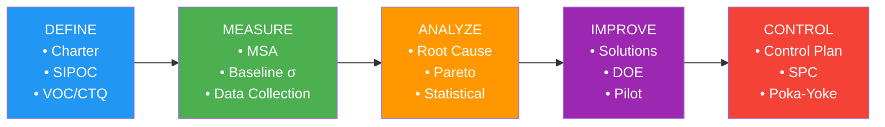

# MF03 — Six Sigma (Sáu Sigma)

> **Domain:** Manufacturing
> **Trạng thái:** Hoàn thành
> **Level:** Advanced
> **Prerequisites:** MF01 (Manufacturing Management), MF02 (Lean Manufacturing)

---

## 1. Learning Objectives (Mục tiêu học tập)

Sau khi hoàn thành module này, học viên có thể:

- Giải thích khái niệm Six Sigma — 3.4 DPMO và ý nghĩa thống kê
- Áp dụng phương pháp DMAIC (Define-Measure-Analyze-Improve-Control) cho dự án cải tiến
- Hiểu DFSS (Design for Six Sigma) và khi nào dùng thay DMAIC
- Sử dụng các công cụ thống kê: Control Charts, Pareto, Fishbone/Ishikawa, Histogram, Scatter Plot, Process Capability (Cp/Cpk)
- Phân biệt vai trò Belt System: Yellow Belt, Green Belt, Black Belt, Master Black Belt
- Kết hợp Lean và Six Sigma thành Lean Six Sigma
- Áp dụng Six Sigma trong bối cảnh sản xuất VN

---

## 2. Business Context (Bối cảnh kinh doanh)

Six Sigma ra đời tại **Motorola năm 1986** bởi Bill Smith và Mikel Harry, sau đó được Jack Welch phổ biến rộng rãi tại GE vào những năm 1990s. Tên "Six Sigma" đến từ mục tiêu thống kê: duy trì quá trình sản xuất trong vòng ±6σ so với mean → chỉ 3.4 lỗi/triệu cơ hội (DPMO).

**Tại sao Six Sigma quan trọng:**
- **Chi phí chất lượng kém (COPQ)**: trung bình 15-25% doanh thu của công ty không áp dụng Six Sigma, giảm xuống 1-3% với Six Sigma
- **Cạnh tranh toàn cầu**: Automotive (IATF 16949), Medical devices, Semiconductor — Six Sigma là requirement, không phải option
- **Data-driven culture**: Six Sigma xây dựng văn hóa ra quyết định bằng dữ liệu thay vì cảm tính

**Tại VN năm 2026:**
- Samsung, LG, Intel yêu cầu suppliers VN đạt Six Sigma quality level
- Ngành dược phẩm, thiết bị y tế VN cần Six Sigma cho FDA/CE approval
- Xu hướng: Lean Six Sigma đang được giảng dạy tại ĐH Bách Khoa, RMIT VN
- Cost of Poor Quality (COPQ) tại SME VN ước tính 20-30% doanh thu → cơ hội cải thiện lớn

---

## 3. Definitions (Định nghĩa)

| Thuật ngữ | Định nghĩa |
|-----------|-----------|
| **Six Sigma (6σ)** | Phương pháp cải tiến chất lượng hướng đến 3.4 lỗi/triệu cơ hội (DPMO) |
| **DPMO** (Defects Per Million Opportunities) | Số lỗi trên mỗi triệu cơ hội xảy ra lỗi — đơn vị đo Six Sigma |
| **DMAIC** | Define-Measure-Analyze-Improve-Control — 5 bước cải tiến Six Sigma |
| **DFSS** (Design for Six Sigma) | Thiết kế sản phẩm/quy trình ngay từ đầu đã đạt Six Sigma — dùng DMADV hoặc IDOV |
| **CTQ** (Critical to Quality) | Các đặc tính chất lượng quan trọng nhất từ góc nhìn khách hàng |
| **VOC** (Voice of Customer) | Yêu cầu và kỳ vọng của khách hàng |
| **Sigma Level** | Mức độ hiệu suất quy trình — tính từ Yield hoặc DPMO |
| **Cp** (Process Capability) | Tỷ số giữa độ rộng spec và độ rộng tự nhiên của process: (USL-LSL)/(6σ) |
| **Cpk** (Process Capability Index) | Cp có tính đến centering của mean — min[(USL-μ)/(3σ), (μ-LSL)/(3σ)] |
| **UCL/LCL** (Control Limits) | Upper/Lower Control Limit — giới hạn kiểm soát thống kê (±3σ) |
| **USL/LSL** (Specification Limits) | Giới hạn kỹ thuật do engineering hoặc customer định ra |
| **SPC** (Statistical Process Control) | Kiểm soát quy trình bằng phương pháp thống kê — Control Charts |
| **FMEA** (Failure Mode and Effects Analysis) | Phân tích các chế độ lỗi tiềm năng và tác động — Risk Priority Number (RPN) |
| **MSA** (Measurement System Analysis) | Đánh giá độ tin cậy của hệ thống đo lường (Gauge R&R) |
| **Black Belt** | Chuyên gia Six Sigma full-time dẫn dắt dự án cải tiến phức tạp |
| **Green Belt** | Người được đào tạo Six Sigma, dẫn dắt dự án part-time bên cạnh công việc chính |

---

## 4. Core Concepts (Khái niệm cốt lõi)

### 4.1 Six Sigma Level và DPMO

```
Sigma   Yield    DPMO        Ý nghĩa
Level
  1    30.9%    691,462    Rất tệ — gần như không kiểm soát được
  2    69.1%    308,538    Tệ — nhiều khiếu nại khách hàng
  3    93.3%     66,807    Trung bình — industrial average
  4    99.4%      6,210    Tốt — ≥ 99.4% sản phẩm đạt
  5    99.98%       233    Rất tốt — chỉ 233 ppm lỗi
  6    99.9997%     3.4    Xuất sắc — World Class

Ví dụ thực tế:
3 Sigma: 1 lần mất hành lý mỗi 7.5 chuyến bay
6 Sigma: 1 lần mất hành lý mỗi 3.4 TRIỆU chuyến bay

Hầu hết nhà máy VN đang ở 3-4 Sigma
Samsung/Intel target: ≥ 5 Sigma
```

### 4.2 DMAIC Methodology

```
╔══════════╗   ╔══════════╗   ╔══════════╗   ╔══════════╗   ╔══════════╗
║  DEFINE  ║→→→║ MEASURE  ║→→→║  ANALYZE ║→→→║  IMPROVE ║→→→║ CONTROL  ║
╚══════════╝   ╚══════════╝   ╚══════════╝   ╚══════════╝   ╚══════════╝
                                                                  ↑
                                              ←←←←←←←←←←←←←←←←←←

DEFINE:           MEASURE:          ANALYZE:          IMPROVE:          CONTROL:
• Project Charter • Data Collection • Root Cause      • Generate        • Control Plan
• SIPOC           • Process Mapping   Analysis          Solutions       • SPC Charts
• VOC/CTQ         • Baseline Sigma  • Fishbone        • Pilot test      • Control Charts
• Problem Stmt    • Gauge R&R       • 5 Whys          • DOE             • Poka-Yoke
• Project Scope   • MSA             • Pareto          • Kaizen Event    • Standard Work
• Business Case   • Process Cpk     • Regression      • Simulation      • Audit Plan
                                   • FMEA                              • Handoff to Owner
```

### 4.3 Statistical Tools

```
PARETO CHART (80/20 Rule):
Defects by Category (Jan 2026):
Seam open    │████████████████████│ 45% ← Fix this first!
Wrong size   │████████████        │ 28%
Color fading │████████            │ 18%
Others       │████                │  9%
             0    20    40    60    80   100%

FISHBONE (Ishikawa) for "Seam Open Defect":
        Machines           Methods
           │                 │
    Poor tension    Wrong stitch type
           │                 │
─────────────────────────→ [SEAM OPEN]←────────
           │                 │
    Worn needle        Low skill operator
           │                 │
       Materials          Manpower

CONTROL CHART (X-bar and R Chart):
UCL─── ─ ─ ─ ─ ─ ─ ─ ─ ─ ─ ─ ─ ─ ─
    ●       ●   ●   ●         ●
●       ●       ●       ●  ●    ●  ●
Mean─── ─ ─ ─ ─ ─ ─ ─ ─ ─ ─ ─ ─ ─ ─
LCL─── ─ ─ ─ ─ ─ ─ ─ ─ ─ ─ ─ ─ ─ ─
     1  2  3  4  5  6  7  8  9  10 11 12
     → In Control: no special cause variation
```

### 4.4 Process Capability (Cp và Cpk)

```
Process Capability:
Cp  = (USL - LSL) / (6σ)
Cpk = min[ (USL - μ) / (3σ),  (μ - LSL) / (3σ) ]

Cp và Cpk Interpretation:
< 1.0  : Process không capable — nhiều sản phẩm ngoài spec
1.0-1.33: Marginally capable — cần cải thiện
1.33-1.67: Capable — acceptable for most industries
≥ 1.67 : Highly capable — automotive, aerospace standard
≥ 2.0  : Six Sigma level

Cp vs Cpk:
    LSL         USL          LSL         USL
     |           |            |           |
     | ┌───────┐ |            |  ┌──────┐ |
     | │       │ |            |  │      │ |──→ Shifted
     | └───────┘ |            |  └──────┘ |
     Cp = 1.5, Cpk = 1.5      Cp = 1.5, Cpk = 0.8
     (Centered process)        (Drifted process)
```

### 4.5 FMEA — Risk Priority Number (RPN)

```
FMEA Worksheet:

Process Step | Failure Mode    | Effect      | S | O | D | RPN | Action
─────────────────────────────────────────────────────────────────────────
Sewing Op    | Thread breaks   | Seam open,  | 8 | 5 | 4 | 160 | Auto thread
             |                 | customer    |   |   |   |     | break sensor
             |                 | complaint   |   |   |   |     |
─────────────────────────────────────────────────────────────────────────
Heat setting | Wrong temp      | Color fade  | 7 | 3 | 6 | 126 | Temp auto
             |                 |             |   |   |   |     | control + alarm

S = Severity (1-10): mức độ nghiêm trọng của lỗi
O = Occurrence (1-10): tần suất xảy ra
D = Detection (1-10): khó phát hiện bao nhiêu (10 = rất khó phát hiện)
RPN = S × O × D → Prioritize actions cho RPN cao nhất (>100)
```

---

## 5. Business Value (Giá trị kinh doanh)

| Chỉ số | Trước Six Sigma | Sau Six Sigma | Impact |
|--------|----------------|--------------|--------|
| **DPMO** | 66,807 (3σ) | 3,400 (5σ) | -94.9% defects |
| **Cost of Poor Quality** | 20% revenue | 5% revenue | -75% COPQ |
| **Scrap/Rework Cost** | $500K/năm | $50K/năm | Save $450K/năm |
| **Customer Complaints** | 50/tháng | 5/tháng | -90% |
| **First Pass Yield** | 85% | 99% | +14% output |
| **Warranty Cost** | 2% revenue | 0.2% revenue | Save millions |

**GE Six Sigma Results (Jack Welch era):**
- $300M savings year 1 → $2B by year 3 of implementation
- Return on investment: 20:1

---

## 6. Enterprise Role (Vai trò trong doanh nghiệp)

Six Sigma là **hệ thống quản lý dựa trên dữ liệu** để đưa ra quyết định kinh doanh:

- **Strategic**: CEO/COO định hướng Six Sigma projects theo business priorities
- **Financial**: CFO tính toán project savings, validates ROI (typically $100K-$1M/project)
- **Operations**: Black Belts dẫn dắt cross-functional improvement projects
- **Cultural**: Xây dựng văn hóa "speak with data, not opinions"
- **Customer-centric**: VOC → CTQ → measures được directly linked to customer satisfaction

---

## 7. Departments Related (Phòng ban liên quan)

```
┌─────────────────────────────────────────────────────┐
│              SIX SIGMA ORGANIZATION                 │
│                                                     │
│  Executive Sponsor (CEO/COO/VP Manufacturing)      │
│         ↓                                          │
│  Champion (VP level, owns resources, removes       │
│           barriers)                                │
│         ↓                                          │
│  Master Black Belt (MBB) — coach, trainer          │
│         ↓                                          │
│  Black Belt (BB) — project leader full-time        │
│         ↓                                          │
│  Green Belt (GB) — project member, part-time       │
│         ↓                                          │
│  Yellow Belt (YB) — team member, basic tools       │
├─────────────────────────────────────────────────────┤
│ Quality | Engineering | Operations | Finance | HR  │
│ MSA, SPC| DOE, DFSS   | Shop floor | ROI calc| Train│
└─────────────────────────────────────────────────────┘
```

---

## 8. Input (Đầu vào)

| Đầu vào | Nguồn | Mô tả |
|---------|-------|-------|
| VOC (Voice of Customer) | Customer surveys, complaints, QC data | Yêu cầu chất lượng từ KH |
| Process Data | SPC systems, QC records, MES | Measurements, defect records |
| Business Performance Data | ERP, Finance | COPQ, scrap cost, warranty data |
| Industry Benchmarks | Industry reports, consultants | Sigma level targets |
| Management Priorities | Strategy review, P&L | Project selection criteria |
| Process Maps (SIPOC) | Teams, IE department | Current process understanding |

---

## 9. Output (Đầu ra)

| Đầu ra | Mô tả |
|--------|-------|
| Project Charter | Scope, goals, team, timeline, financial benefit |
| Sigma Level Baseline | Current performance measured in DPMO/Sigma |
| Root Cause Analysis | Validated root causes (statistical evidence) |
| Improved Process | New process/settings with documented results |
| Control Plan | How to sustain improvements |
| SPC Charts | Ongoing monitoring of critical parameters |
| Financial Savings | Verified by Finance: hard and soft savings |
| FMEA (updated) | Updated risk assessment post-improvement |

---

## 10. Business Process (Quy trình kinh doanh)

```
Six Sigma Project Lifecycle:

PROJECT SELECTION
├── Identify opportunities (VOC, COPQ analysis, customer complaints)
├── Business case development
├── Project Charter approved by Champion
└── Black Belt assigned

DEFINE PHASE (2-4 weeks)
├── Project Charter finalization
├── SIPOC diagram
├── VOC → CTQ translation
└── Process map (high level)

MEASURE PHASE (4-6 weeks)
├── Detailed process mapping
├── Measurement System Analysis (MSA/Gauge R&R)
├── Data collection plan
└── Baseline Sigma level calculation

ANALYZE PHASE (4-6 weeks)
├── Graphical analysis (Pareto, histogram, scatter)
├── Root cause analysis (Fishbone, 5 Whys)
├── Statistical analysis (regression, ANOVA, hypothesis testing)
└── Root cause validation

IMPROVE PHASE (4-8 weeks)
├── Solution generation (brainstorming, benchmarking)
├── DOE (Design of Experiments) for optimization
├── Pilot implementation
└── Results verification

CONTROL PHASE (4-6 weeks)
├── Control Plan development
├── SPC implementation
├── Poka-Yoke installation
├── Standard Work update
├── Training and handoff
└── Project closure with financial validation
```

---

## 11. Data Flow (Luồng dữ liệu)

```
DATA COLLECTION → ANALYSIS → ACTION → MONITOR

Shop Floor Sensors/Gauges
        ↓
Raw Measurement Data (continuous or attribute)
        ↓
Statistical Software (Minitab, JMP, Excel)
        ↓
Control Charts (X-bar/R, p-chart, c-chart)
        ↓
Special Cause Detection → Alarm → Investigate
Capability Analysis → Cp/Cpk Trends
        ↓
Management Reports (Sigma Dashboard)
        ↓
Decisions: Process Adjustment / Kaizen / Project Launch
```

---

## 12. Money Flow (Luồng tiền)

```
COST OF POOR QUALITY (COPQ) Framework:

Prevention Costs (đầu tư để ngăn lỗi):
├── Quality planning, training
├── Inspection planning, calibration
└── Statistical Process Control systems

Appraisal Costs (đo lường để phát hiện lỗi):
├── Inspection, testing
├── Quality audits
└── Lab testing, calibration costs

Internal Failure Costs (lỗi phát hiện trước khi giao):
├── Scrap
├── Rework/repair
└── Downgrade/concession

External Failure Costs (lỗi đến tay khách hàng — EXPENSIVE!):
├── Warranty, returns
├── Field repairs
├── Customer complaints handling
└── Loss of future business (hard to quantify but huge)

Six Sigma COPQ Reduction:
Before: Prevention+Appraisal = 3%, Internal+External = 20% revenue
After:  Prevention+Appraisal = 6%, Internal+External = 3% revenue
Net Savings: ~14% revenue improvement
```

---

## 13. Document Flow (Luồng tài liệu)

```
Six Sigma Documentation:

Project Charter → signed by Sponsor
    ↓
SIPOC Diagram
    ↓
Data Collection Plan
    ↓
MSA Study (Gauge R&R report)
    ↓
Baseline Measurement Report (Sigma Level)
    ↓
Cause & Effect Matrix / Fishbone / FMEA
    ↓
Hypothesis Testing Results
    ↓
Improvement Plan / DOE Results
    ↓
Control Plan
    ↓
SPC Charts (ongoing)
    ↓
Project Closure Report (financial validation by Finance)
    ↓
Lessons Learned & Knowledge Base
```

---

## 14. Roles (Vai trò)

| Belt Level | Đào tạo | Vai trò | Thời gian |
|-----------|---------|---------|-----------|
| **White Belt** | 1-2 ngày | Nhận thức cơ bản, team member | Part-time |
| **Yellow Belt** | 3-5 ngày | Project team member, basic tools (5S, Pareto, Fishbone) | Part-time |
| **Green Belt** | 2-3 tuần (80-100h) | Project leader nhỏ-medium, DMAIC, basic stats | Part-time (25%) |
| **Black Belt** | 4 tuần (160h) + project | Project leader complex, full statistical tools, coach GBs | Full-time |
| **Master Black Belt (MBB)** | Black Belt + 5+ years | Strategic deployment, train/coach BBs, methodology expert | Full-time |
| **Champion** | 2 ngày | Executive sponsor, resource allocation, barrier removal | Part-time |
| **Deployment Champion** | 2-4 ngày | Manages Six Sigma program across organization | Part-time |

---

## 15. Responsibilities (Trách nhiệm)

**Black Belt:**
- Dẫn dắt DMAIC project từ Define đến Control
- Apply statistical tools đúng đắn và interpret results
- Coach Green Belts và team members
- Communicate project progress đến Champion hàng tuần
- Deliver financial benefits thẩm định bởi Finance

**Champion:**
- Phê duyệt Project Charter
- Cung cấp resources (người, thời gian, budget)
- Remove organizational barriers
- Review project tiến độ hàng tháng
- Certify project completion và financial savings

**Process Owner (sau project):**
- Maintain Control Plan
- Monitor SPC charts hàng ngày
- Escalate nếu process drift detected
- Continuous improvement sau handoff

---

## 16. RACI Matrix

| Hoạt động | Champion | MBB | Black Belt | Green Belt | Process Owner | Finance |
|-----------|:---:|:---:|:---:|:---:|:---:|:---:|
| Project Selection | A | C | R | I | C | C |
| Project Charter | A | C | R | C | C | C |
| DMAIC Execution | I | C | R | C | I | I |
| Statistical Analysis | I | C | R | C | I | I |
| Improve Implementation | A | C | R | R | C | I |
| Control Plan | I | C | R | C | R | I |
| Financial Validation | I | I | C | I | I | R |
| BB/GB Certification | A | R | I | I | I | I |

---

## 17. Frameworks (Khung phương pháp)

### 17.1 DMAIC vs DFSS

| | DMAIC | DFSS (DMADV) |
|--|-------|-------------|
| **Khi nào dùng** | Process đang tồn tại, cần cải thiện | Thiết kế mới hoặc cải thiện cơ bản |
| **Starting point** | Existing process | Blank sheet |
| **Key tool** | FMEA, SPC, DOE | QFD, Pugh matrix, simulation |
| **Steps** | D-M-A-I-C | D-M-A-D-V (Define-Measure-Analyze-Design-Verify) |
| **Outcome** | Improved process | New design meeting CTQs |

### 17.2 Lean Six Sigma (LSS)
```
LEAN          +        SIX SIGMA        =    LEAN SIX SIGMA
(Speed)                (Quality)             (Speed + Quality)
Remove waste           Reduce variation       Maximum efficiency
VSM, 5S, Kanban       DMAIC, SPC, DOE        Combined toolset
                                             Typical: Black Belt uses
                                             both Lean AND Six Sigma tools
```

### 17.3 ASQ Six Sigma Body of Knowledge
- Organization-wide planning and deployment
- Team management
- Define phase tools
- Measure phase tools
- Analyze phase tools
- Improve phase tools
- Control phase tools

---

## 18. International Standards (Tiêu chuẩn quốc tế)

| Tiêu chuẩn | Six Sigma Connection |
|-----------|---------------------|
| **ISO 13053** | Quantitative methods in process improvement — Six Sigma standard (ISO official) |
| **IATF 16949:2016** | Automotive QMS — FMEA, SPC, MSA required (Core Tools) |
| **ASQ CSSGB/CSSBB** | Certified Six Sigma Green/Black Belt — widely recognized |
| **ASQ CMBB** | Certified Master Black Belt |
| **iSixSigma** | Industry resource and certification community |
| **ISO 9001:2015** | Clause 9 (Performance Evaluation) + 10 (Improvement) — Six Sigma fits |
| **FDA 21 CFR Part 820** | Medical devices — Six Sigma for process validation |

---

## 19. Vietnam Context (Bối cảnh Việt Nam)

### 19.1 Six Sigma trong FDI VN

**Samsung Electronics VN:**
- Six Sigma tích hợp vào Samsung Production System (SPS)
- Mỗi Black Belt project phải tiết kiệm ≥ 100,000 USD
- 5,000+ Green Belts tại Samsung VN
- Yêu cầu suppliers tier-1 phải có Green Belts

**Intel Products Vietnam (Saigon Hi-Tech Park):**
- Six Sigma bắt buộc cho tất cả process engineers
- Sigma level ≥ 5 cho critical-to-function parameters
- Hàng năm: 50-100 DMAIC projects

**Bosch Vietnam (Long Thành, Đồng Nai):**
- Lean Six Sigma deployed fully
- Master Black Belts người VN được đào tạo tại Đức
- COPQ reduced từ 22% xuống 4% sau 5 năm triển khai

### 19.2 Thách thức tại SME VN
- Thiếu dữ liệu: nhiều SME không có measurement system → không thể tính Sigma level
- Không có Minitab → dùng Excel với giới hạn
- Kỹ năng thống kê yếu → Green Belt đào tạo khó apply
- Management impatience: muốn kết quả nhanh, Six Sigma cần 3-6 tháng/project
- Giải pháp: Yellow Belt + Kaizen kết hợp là phù hợp hơn cho SME VN

### 19.3 Đào tạo Six Sigma tại VN
- **ASQ Vietnam Section**: đào tạo và thi CSSBB
- **RMIT Vietnam**: Six Sigma trong chương trình MBA
- **ĐH Bách Khoa TP.HCM**: môn Quản lý Chất lượng với Six Sigma
- **Consulting firms**: Kaizen Institute, Bureau Veritas, TUV Rheinland có chương trình VN
- **Chi phí đào tạo**: Green Belt 15-25 triệu VND; Black Belt 40-80 triệu VND

### 19.4 Ngành Ưu tiên
- **Electronics/Semiconductor**: FDI yêu cầu nghiêm ngặt
- **Automotive parts**: IATF 16949 mandatory
- **Medical devices**: FDA/CE requires process validation
- **Food & Beverage**: HACCP + Six Sigma for food safety
- **Pharmaceuticals**: GMP + Six Sigma

---

## 20. Legal Considerations (Các vấn đề pháp lý)

| Vấn đề | Quy định | Six Sigma Relevance |
|--------|---------|---------------------|
| **Chất lượng sản phẩm** | Luật Chất lượng SPHH 2007 | Six Sigma ensures products meet legal quality standards |
| **Tiêu chuẩn kỹ thuật** | TCVN / QCVN system (Bộ KHCN) | CTQs mapped to TCVN specifications |
| **Medical devices** | TT 39/2016/TT-BYT | FDA/CE process validation requires Six Sigma level evidence |
| **Food safety** | TCVN 22000, ISO 22000 | HACCP critical control points align with Six Sigma CTQs |
| **Measurement** | Luật Đo lường 2011 | MSA/Gauge R&R required for legal measurements |
| **GMP** | Bộ Y tế / dược phẩm | Process capability ≥ 1.33 required for drug manufacturing |

---

## 21. Common Mistakes (Sai lầm phổ biến)

1. **Chọn project sai**: Project quá nhỏ (không đủ ROI) hoặc quá lớn (không hoàn thành được trong 3-6 tháng)
2. **Bỏ qua MSA**: Đo lường mà không kiểm tra Gauge R&R → data không tin cậy → kết luận sai
3. **Jump to Improve**: Xác định root cause không đủ chặt chẽ về mặt thống kê → implement solution sai → lỗi quay lại
4. **Control phase bị bỏ qua**: Project đạt kết quả tốt nhưng không có Control Plan → 6 tháng sau regression về cũ
5. **Too many Green Belts, no Black Belt**: Thiếu statistical depth → project stuck ở Analyze phase
6. **Six Sigma standalone**: Không kết hợp với Lean → giảm defects nhưng lead time vẫn dài
7. **Metrics không connected to business**: Cải thiện process metric nhưng không translate thành financial savings
8. **Poor data collection**: Dữ liệu không đủ quantity, không representative → phân tích sai

---

## 22. Best Practices (Thực hành tốt nhất)

1. **Project Charter as Contract**: Charter phải được ký bởi Sponsor — defines scope, goals, timeline, expected ROI
2. **MSA trước khi collect data**: Xác nhận measurement system trustworthy trước khi tốn công đo
3. **Baseline trước, improve sau**: Đo Sigma level baseline thực sự trước khi thay đổi bất kỳ thứ gì
4. **Statistical significance**: Mọi kết luận trong Analyze phase phải có p-value < 0.05
5. **Pilot before full deployment**: Test improvements on small scale trước khi roll out toàn bộ
6. **Control Plan là living document**: Update khi có thay đổi process, không phải "file và quên"
7. **Finance validates savings**: Hard savings phải được CFO/Finance xác nhận — không tự declare
8. **Voice of Customer first**: Mọi project bắt đầu từ VOC và CTQ, không từ engineer assumptions
9. **Replication**: Sau khi project thành công, replicate sang similar processes/plants
10. **Knowledge Management**: Document lessons learned, share across organization

---

## 23. KPIs

| KPI | Công thức | Target |
|-----|-----------|--------|
| **Sigma Level** | Từ DPMO lookup table | ≥ 4σ (SME), ≥ 5σ (FDI) |
| **DPMO** | (Defects / (Units × Opportunities)) × 1,000,000 | < 6,210 (4σ) |
| **Cp / Cpk** | (USL-LSL)/(6σ) / adjusted for centering | Cp ≥ 1.33, Cpk ≥ 1.33 |
| **First Pass Yield** | Units pass on first try / Total units | ≥ 99% |
| **COPQ** | Internal + External failure costs | < 5% revenue |
| **Projects Completed** | DMAIC projects completed/year | 4-6 per Black Belt/year |
| **Financial ROI** | Savings / Investment in Six Sigma | ≥ 10:1 |
| **Belt Certification Rate** | Certified belts / Trained belts | ≥ 70% |

---

## 24. Metrics (Chỉ số đo lường)

```
SIX SIGMA METRICS DASHBOARD

Product Line: Electronics PCB Assembly
Period: Q2 2026

╔═══════════════════════════════════════════════════╗
║ SIGMA LEVEL TRACKER                               ║
╠══════════════════╦═══════════╦═════════════════════╣
║ CTQ Characteristic│ DPMO     │ Sigma Level         ║
╠══════════════════╬═══════════╬═════════════════════╣
║ Solder Joint     │   2,450   │  4.7σ    ▲          ║
║ Component Place  │   8,900   │  3.9σ    → (target 4σ)║
║ PCB Continuity   │     320   │  5.3σ    ▲▲         ║
║ Dimension        │   1,200   │  5.0σ    ▲          ║
╠══════════════════╬═══════════╬═════════════════════╣
║ OVERALL          │   3,218   │  4.8σ               ║
╚══════════════════╩═══════════╩═════════════════════╝

Active DMAIC Projects:
1. Reduce Component Placement DPMO (BB: Nguyen Van A)
   Status: Analyze Phase | On Track | Expected savings: $180K
```

---

## 25. Reports (Báo cáo)

| Báo cáo | Tần suất | Nội dung |
|---------|---------|---------|
| SPC Daily Report | Hàng ngày | Control chart status, out-of-control alerts |
| Sigma Level Report | Hàng tháng | DPMO, Cpk by CTQ by product line |
| COPQ Report | Hàng tháng | Scrap, rework, warranty costs |
| Project Pipeline | Hàng tháng | Projects by phase, expected savings |
| Belt Activity Report | Hàng quý | Projects completed, certifications, savings |
| Six Sigma ROI | Hàng năm | Total program savings vs investment |

---

## 26. Templates (Mẫu biểu)

### SIPOC Template
```
SIPOC — Process: PCB Wave Soldering

SUPPLIERS   INPUTS        PROCESS       OUTPUTS      CUSTOMERS
─────────── ─────────── ─────────────── ───────────── ────────────
PCB Vendor  PCBs        1.Pre-heat      Soldered PCBs Assembly
                        2.Flux apply    Solder joints   Dept
Solder Mfr  Solder bar  3.Wave solder   QC reports    Quality Dept
            Flux        4.Cool
                        5.Inspection    Rejected PCBs Rework area
Operator    Work order  6.Record

CTQs: Solder joint strength, Bridging defects, Solder ball
```

### Project Charter Template
```
PROJECT CHARTER

Project Title: Reduce Solder Defects on PCB Line A
Black Belt: [Name]        Champion: [Name]
Start Date: 01/07/2026    Target Completion: 30/11/2026

BUSINESS CASE:
Current defect rate: 3,200 DPMO (4.2σ)
COPQ from solder defects: $350,000/year
Target: Reduce to 1,000 DPMO (4.6σ) → save $250,000/year

PROBLEM STATEMENT:
PCB Line A solder defects running at 3,200 DPMO since Q3 2025.
Customer complaints increased 40% QoQ.

PROJECT SCOPE:
In scope: Wave soldering process, PCB type X-001 and X-002
Out of scope: Reflow soldering, other PCB types

GOALS & METRICS:
Primary: DPMO from 3,200 → 1,000 (by Nov 2026)
Secondary: Cpk from 1.1 → 1.5

TEAM MEMBERS:
- Process Engineer (Green Belt)
- Quality Engineer
- Maintenance Technician
- Production Supervisor

SIGNATURES: Champion ___ / BB ___ / Finance ___
```

---

## 27. Checklists (Danh sách kiểm tra)

### DMAIC Gate Review Checklist

**Define Gate:**
- [ ] Project Charter signed by Champion
- [ ] SIPOC completed
- [ ] VOC data collected, CTQs identified
- [ ] Problem statement is specific and measurable
- [ ] Business case and financial impact estimated

**Measure Gate:**
- [ ] Measurement system validated (MSA/Gauge R&R — %R&R < 30%)
- [ ] Data collection plan executed
- [ ] Process map (detailed) completed
- [ ] Baseline Sigma level calculated
- [ ] Process stable (control chart shows no special causes)

**Analyze Gate:**
- [ ] Root causes identified and prioritized
- [ ] Statistical validation of root causes (p-value < 0.05)
- [ ] Vital few vs trivial many identified (Pareto)
- [ ] FMEA updated with current risk assessment

**Improve Gate:**
- [ ] Solutions generated for root causes
- [ ] Pilot results demonstrate improvement
- [ ] Financial benefit quantified
- [ ] Implementation plan approved by Champion

**Control Gate:**
- [ ] Control Plan written and approved
- [ ] SPC charts installed and operators trained
- [ ] Poka-Yoke solutions implemented
- [ ] Standard Work updated
- [ ] Process Owner has accepted responsibility
- [ ] Financial savings validated by Finance

---

## 28. SOP (Quy trình chuẩn)

### SOP-6S-001: SPC Control Chart Response

**Mục đích:** Đảm bảo response nhất quán khi Control Chart phát tín hiệu.

**Western Electric Rules (bất kỳ 1 trong các điều kiện sau → xem xét special cause):**
1. 1 điểm ngoài UCL hoặc LCL
2. 2 trong 3 điểm liên tiếp ngoài 2σ cùng phía
3. 4 trong 5 điểm liên tiếp ngoài 1σ cùng phía
4. 8 điểm liên tiếp cùng phía với centerline

**Quy trình khi phát hiện Out-of-Control:**
1. **Dừng** ngay hoặc tăng tần suất kiểm tra
2. **Ghi nhận** thời gian và điều kiện xảy ra
3. **Điều tra** nguyên nhân (check: máy, NVL, người, phương pháp, môi trường)
4. **Tách biệt** suspect product từ khi điểm bất thường
5. **Khắc phục** special cause
6. **Tái khởi** sau khi confirm process in control
7. **Báo cáo** Quality Engineer, update log

---

## 29. Case Study (Tình huống thực tế)

### Case: Công ty Điện tử ABC (FDI tại Bắc Ninh) — Giảm Defect rate PCB

**Bối cảnh:** Nhà máy sản xuất PCB cho Samsung, defect rate 4.8% (tương đương ~3σ). Samsung yêu cầu ≤ 1% (tương đương ~4σ). Nguy cơ mất hợp đồng.

**DMAIC Project:**

**Define:** Defect rate PCB wave soldering = 4.8%. CTQ: solder joint integrity. COPQ = $2.1M/năm.

**Measure:** Gauge R&R = 12% (acceptable). Baseline: 48,000 DPMO = 3.1σ. Pareto: Solder bridge (45%), Insufficient solder (32%), Solder ball (23%).

**Analyze:** Fishbone analysis. 5 Whys → Root causes:
- Solder bridge: conveyor speed không consistent (CV = 18%)
- Insufficient solder: solder pot temperature drift (±8°C)
- Solder ball: flux volume inconsistent

**Improve:** 
- Install PLC speed controller → CV giảm từ 18% xuống 3%
- Install temperature PID controller → drift ±1°C
- Flux volume sensor + alarm

**Control:**
- SPC charts cho: conveyor speed, pot temp, flux volume
- Operator training + visual aids tại machine
- Control plan with response protocol

**Kết quả sau 5 tháng:**
- Defect rate: 4.8% → 0.7% (vượt target 1%)
- DPMO: 48,000 → 7,000 (3.1σ → 3.9σ)
- COPQ saved: $1.8M/năm
- Samsung contract renewed + additional models awarded

---

## 30. Small Business Example (Ví dụ doanh nghiệp nhỏ)

**Xưởng in lụa 15 nhân công — TP.HCM:**

Vấn đề: 8% sản phẩm bị lỗi (màu lem, lệch vị trí). Khách hàng phàn nàn, phải tặng bù hàng.

**Lean Six Sigma đơn giản (không cần Minitab):**
- **Define**: Vẽ SIPOC 1 trang, xác định CTQ: in màu đúng vị trí ±2mm
- **Measure**: Đếm lỗi 2 tuần → DPMO ~ 80,000 (2.9σ). 
- **Analyze**: Pareto (Excel) → lệch vị trí 60%, lem màu 40%. Fishbone → lệch vị trí do frame bị lỏng; lem màu do độ nhớt mực thay đổi theo nhiệt độ
- **Improve**: Fix frame cố định + kiểm tra độ nhớt mực mỗi 2 giờ (dùng viscosity cup đơn giản)
- **Control**: Checklist kiểm tra frame mỗi đầu ca + log độ nhớt mực

Kết quả: lỗi giảm từ 8% xuống 1.5% (~4.4σ) sau 2 tháng. ROI = 5:1.

---

## 31. Enterprise Example (Ví dụ doanh nghiệp lớn)

**Bosch VN (Long Thành, Đồng Nai) — Automotive Fuel Injectors:**

- **Sigma Level target**: 5.5σ (automotive standard)
- **Belt Structure**: 3 MBBs, 25 BBs (toàn bộ từ VN), 150+ GBs
- **Project portfolio**: 40-50 DMAIC projects/năm
- **Savings 2023-2025**: $18M cumulative
- **COPQ reduction**: từ 18% → 4.2% trong 6 năm
- **Key achievement**: Zero customer warranty claims từ 2024
- **Technology**: Minitab + JMP + custom SPC system integrated với MES
- **Cultural**: 100% engineers có ít nhất Yellow Belt — Six Sigma là "how we work"

---

## 32. ERP Mapping (Ánh xạ ERP)

| Six Sigma Tool | ERP/Software | Module |
|---------------|-------------|--------|
| **SPC / Control Charts** | SAP QM, Oracle Quality | Quality Management |
| **FMEA** | SAP QM, APIS IQ-FMEA, Excel | Quality Planning |
| **Inspection Plans** | SAP QM | Inspection Lot Management |
| **DPMO / Sigma Level** | Custom reports, Minitab, JMP | Analytics |
| **Gauge R&R** | Minitab, JMP, QI Macros (Excel) | External statistical |
| **COPQ Tracking** | SAP CO-PC, Oracle Cost Mgmt | Cost Accounting |
| **Corrective Actions** | SAP QM (Notification), 8D system | Quality Notification |
| **Design FMEA** | SAP PLM, PTC Windchill | Product Lifecycle Mgmt |

---

## 33. Automation (Tự động hóa)

| Hoạt động | Automation | Mô tả |
|---------|-----------|-------|
| **Data Collection** | Smart sensors → IoT → database | Real-time, no manual entry |
| **Control Chart Update** | Automated SPC software | Chart updates as data arrives |
| **Out-of-Control Alerts** | Rule-based engine → SMS/email | Instant notification to operator |
| **DPMO Calculation** | ERP/MES reports | Daily/weekly automatic |
| **Gauge Calibration Reminder** | Calibration management software | Automatic due date alerts |
| **Cpk Trend Report** | BI tools (Power BI, Tableau) | Auto-refresh dashboards |

---

## 34. AI Opportunities (Cơ hội AI)

| Ứng dụng | Mô tả | Six Sigma Benefit |
|---------|-------|-----------------|
| **AI Root Cause Analysis** | ML models correlate input variables to defects | Speed up Analyze phase |
| **Predictive Quality** | AI predicts which units likely to fail based on process params | Proactive intervention |
| **Automated MSA** | AI-assisted measurement system analysis | Faster Gauge R&R |
| **Digital FMEA** | AI suggests failure modes from historical data | More comprehensive FMEA |
| **NLP on Customer Complaints** | Extract CTQs automatically from complaint text | Better VOC analysis |
| **Adaptive SPC** | ML adjusts control limits as process evolves | Dynamic control |
| **DOE Optimization** | AI-driven experimental design, fewer runs needed | Faster Improve phase |

---

## 35. Implementation Guide (Hướng dẫn triển khai)

### Six Sigma Deployment Roadmap (12 tháng)

**Tháng 1-2: Infrastructure Setup**
- [ ] Executive alignment và commitment (CEO sponsorship)
- [ ] Select Deployment Champion
- [ ] Identify 2-3 MBB candidates (internal or hire/contract)
- [ ] Select first cohort: 5-10 Black Belt candidates
- [ ] Select pilot projects (high impact, manageable scope)

**Tháng 3-4: First BB Training Cohort**
- [ ] 4-week Black Belt training (external provider or MBB)
- [ ] Project Charter approved for each BB
- [ ] Data collection begins

**Tháng 5-9: First Wave Projects**
- [ ] BBs executing DMAIC on their projects
- [ ] Monthly Champion reviews
- [ ] First GB training cohort begins (20-30 people)

**Tháng 10-12: Results and Scale**
- [ ] First wave BB projects close (expect 50-80% success)
- [ ] Financial savings documented
- [ ] Lessons learned shared
- [ ] Plan for next wave

**Budget (manufacturing company, 500 employees):**
- External BB training: $20,000-$50,000 per person
- MBB hire/contract: $80,000-$150,000/năm
- Statistical software (Minitab): $5,000-$15,000/năm
- Total Year 1: $250,000-$500,000
- Expected savings: $1M-$3M
- ROI: 2:1 to 6:1

---

## 36. Consulting Guide (Hướng dẫn tư vấn)

### Six Sigma Readiness Assessment

**Điều kiện cần thiết trước khi deploy Six Sigma:**
1. **Data Infrastructure**: có measurement systems và data recording? 
2. **Management Commitment**: CEO có thực sự sponsor không?
3. **Financial Tracking**: có thể track COPQ và validate savings không?
4. **Process Stability**: processes có đủ ổn định để measure baseline không?
5. **Talent**: có người đủ năng lực làm Black Belt không?

**Nếu thiếu điều kiện:**
- Thiếu data infrastructure → start với Lean first, data collection systems
- Thiếu management commitment → don't deploy — will fail
- Nếu SME VN: start với Yellow Belt + Lean Kaizen, scale later

**Consulting Deliverables:**
- Six Sigma Readiness Assessment
- Deployment Plan (12-24 months)
- Training Design and Delivery
- Project Selection Matrix
- COPQ baselining
- Coach/mentor BBs through projects
- Financial validation methodology

---

## 37. Diagnostic Questions (Câu hỏi chẩn đoán)

1. Tỷ lệ lỗi/defect rate hiện tại là bao nhiêu? Đo theo DPMO hay %?
2. COPQ (scrap, rework, warranty) chiếm bao nhiêu % doanh thu?
3. Có measurement system được kiểm tra calibration và R&R không?
4. Process nào quan trọng nhất (highest COPQ hoặc most customer-visible)?
5. Dữ liệu quality được collect và lưu trữ như thế nào? Accessible không?
6. Ai là người phân tích dữ liệu chất lượng — có dùng thống kê không?
7. Control Charts có đang được dùng không? Ai review và respond?
8. Khi sản phẩm bị reject, root cause được xác định bằng cách nào?
9. Six Sigma hoặc DMAIC đã được áp dụng chưa? Kết quả thế nào?
10. Management có sẵn sàng free up Black Belt candidates full-time không?

---

## 38. Interview Questions (Câu hỏi phỏng vấn)

**Cho Black Belt:**
- Kể về một DMAIC project bạn đã dẫn dắt — kết quả thống kê và financial savings?
- Giải thích sự khác biệt giữa Cp và Cpk. Khi nào Cp cao nhưng Cpk thấp?
- Làm thế nào bạn validate rằng root cause bạn tìm ra là đúng về mặt thống kê?

**Cho Quality Engineer:**
- Mô tả cách bạn set up một SPC chart — chọn loại chart nào, tính UCL/LCL thế nào?
- Gauge R&R > 30% — bạn sẽ làm gì?
- Giải thích FMEA và cách bạn prioritize actions từ RPN?

**Cho Process Engineer:**
- Process của bạn có Cpk = 0.9. Bạn sẽ recommend gì và bước tiếp theo là gì?
- Khi nào bạn dùng X-bar/R chart vs X-bar/S chart vs Individuals chart?
- Explain design of experiments (DOE) và khi nào bạn áp dụng?

---

## 39. Exercises (Bài tập)

### Bài tập 1: DPMO và Sigma Level
Nhà máy sản xuất đinh vít: Kiểm tra 500 đinh vít, mỗi cái có 5 opportunities for defect (length, diameter, thread pitch, head diameter, hardness). Tìm được 35 defects.

Tính: DPMO và Sigma Level.
*(Đáp án: DPMO = 35/(500×5) × 1,000,000 = 14,000. Sigma ≈ 3.7σ)*

### Bài tập 2: Process Capability
Spec cho đường kính vòng bi: 10.00 ± 0.05 mm (USL=10.05, LSL=9.95)
Sample của 30 đo: mean = 10.01 mm, stdev = 0.012 mm

Tính Cp và Cpk. Nhận xét.
*(Đáp án: Cp = (10.05-9.95)/(6×0.012) = 0.1/0.072 = 1.39. Cpk = min[(10.05-10.01)/(3×0.012), (10.01-9.95)/(3×0.012)] = min[1.11, 1.67] = 1.11. Process capable về spread nhưng slightly off-center)*

### Bài tập 3: Pareto Analysis
Defects from 1,000 units: Scratch (180), Dent (45), Wrong color (120), Wrong dimension (60), Missing component (95), Other (30). Tổng 530 defects.

Vẽ Pareto chart và xác định "vital few" (chiếm 80% defects).
*(Đáp án: Sort: Scratch 34%, Wrong color 23%, Missing 18%, Wrong dim 11%, Dent 8%, Other 6%. Vital few: Scratch + Wrong color + Missing = 75% — focus 3 categories này)*

### Bài tập 4: FMEA
Hoàn thành FMEA cho process bước "Heat Seal packaging":
- Failure mode: Incomplete seal
- Effect: Product contamination (S=9)
- Occurrence: Sometimes, monthly (O=4)
- Current control: Visual inspection (D=7)
Tính RPN. Recommend action để giảm RPN xuống dưới 100.

---

## 40. References (Tài liệu tham khảo)

- Montgomery, D.C. *Introduction to Statistical Quality Control* (8th Ed., Wiley) — Textbook chuẩn
- Pande, P., Neuman, R., Cavanagh, R. *The Six Sigma Way* (McGraw-Hill, 2000)
- Pyzdek, T., Keller, P. *The Six Sigma Handbook* (5th Ed., McGraw-Hill, 2018)
- Harry, M., Schroeder, R. *Six Sigma: The Breakthrough Management Strategy* (Currency, 2000)
- George, M.L. *Lean Six Sigma* (McGraw-Hill, 2002) — Lean + Six Sigma integration
- ASQ — asq.org (Six Sigma resources, certification)
- iSixSigma — isixsigma.com
- Minitab — minitab.com (statistical software cho Six Sigma)
- Bộ Khoa học và Công nghệ — Năng suất chất lượng VN — vnpi.vn

---

## Output Formats

### Mermaid — DMAIC Process


### ASCII Diagram — Sigma Level Visual
```
SIGMA LEVEL vs DPMO

6σ │                                     ·  3.4 DPMO
   │
5σ │                                 ·  233 DPMO
   │
4σ │                        ·  6,210 DPMO    ← Good target
   │
3σ │              ·  66,807 DPMO              ← VN Average
   │
2σ │    ·  308,538 DPMO
   │
1σ │ ·  691,462 DPMO
   └──────────────────────────────────────────
     Very bad → Average → Good → World Class
```

### Flashcards

**Q1:** DMAIC là gì? Tóm tắt mục tiêu từng bước.
**A1:** Define: Xác định vấn đề, scope, business case. Measure: Đo baseline, validate measurement system. Analyze: Tìm root cause bằng thống kê. Improve: Test và implement solutions. Control: Duy trì cải tiến với SPC và Control Plan. Không skip bước — mỗi bước có gate review.

**Q2:** Sự khác biệt Cp và Cpk là gì?
**A2:** Cp đo khả năng của process về spread (độ rộng): (USL-LSL)/(6σ). Cpk đo capability có tính đến centering (mean có ở giữa spec không). Cp ≥ 1.33 AND Cpk ≥ 1.33 mới gọi là capable. Nếu Cp cao nhưng Cpk thấp → process spread đủ nhỏ nhưng đang drift về một phía.

**Q3:** Khi nào dùng DMAIC vs DFSS?
**A3:** DMAIC: khi process đang tồn tại cần cải thiện. DFSS (DMADV): khi thiết kế sản phẩm/process mới hoặc cải tiến căn bản không thể đạt bằng DMAIC. Quy tắc: nếu Cpk < 1 sau nhiều lần cải tiến → xem xét redesign với DFSS.

### Cheat Sheet
```
SIX SIGMA — CHEAT SHEET

SIGMA LEVELS:   3σ = 66,807 DPMO (VN avg)
                4σ = 6,210 DPMO (good)
                6σ = 3.4 DPMO (world class)

DMAIC:          Define → Measure → Analyze → Improve → Control
                (không được skip bước nào)

PROCESS         Cp = (USL-LSL)/(6σ)
CAPABILITY:     Cpk = min[(USL-μ)/(3σ), (μ-LSL)/(3σ)]
                Target: Cp ≥ 1.33, Cpk ≥ 1.33

DPMO:           (Defects / (Units × Opps)) × 1,000,000

FMEA RPN:       Severity × Occurrence × Detection
                Priority: RPN > 100 → action required

SPC RULES:      Out of control if:
                1. Any point outside UCL/LCL (±3σ)
                2. 8 consecutive points same side of mean
                3. 2/3 points beyond 2σ

BELT LEVELS:    YB (3-5 days) → GB (2-3 weeks) →
                BB (4 weeks + project) → MBB (expert)
```

### JSON Metadata
```json
{
  "module": {
    "code": "MF03",
    "name": "Six Sigma",
    "domain": "Manufacturing",
    "level": "Advanced",
    "prerequisites": ["MF01", "MF02"],
    "related_modules": ["MF02", "MF04"],
    "key_concepts": [
      "DMAIC",
      "DFSS",
      "DPMO / Sigma Level",
      "Process Capability (Cp/Cpk)",
      "Statistical Process Control (SPC)",
      "FMEA",
      "Measurement System Analysis (MSA)",
      "Belt System (YB/GB/BB/MBB)",
      "Cost of Poor Quality (COPQ)",
      "Design of Experiments (DOE)"
    ],
    "key_tools": ["Minitab", "JMP", "Control Charts", "Pareto", "Fishbone", "Histogram"],
    "standards": ["ISO 13053", "IATF 16949 Core Tools", "ASQ CSSBB"],
    "vietnam_context": {
      "fdi_examples": ["Samsung VN", "Intel Vietnam", "Bosch VN"],
      "sigma_avg_vn": "3-4 Sigma",
      "key_sectors": ["electronics", "automotive", "medical devices", "pharmaceuticals"]
    },
    "kpis": ["DPMO", "Sigma Level", "Cp/Cpk", "COPQ", "First Pass Yield"],
    "last_updated": "2026-06-30",
    "author": "Business Knowledge Graph"
  }
}
```
