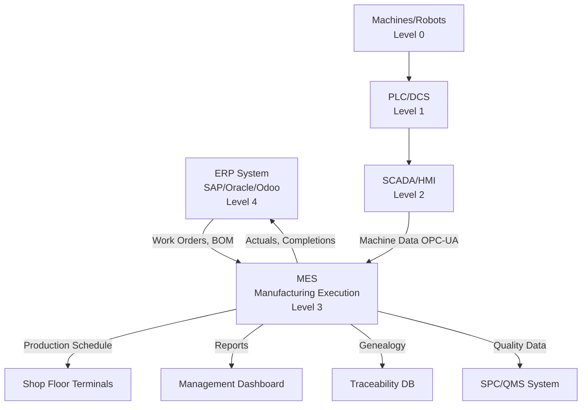

# MF04 — MES (Manufacturing Execution System)

> **Domain:** Manufacturing
> **Trạng thái:** Hoàn thành
> **Level:** Advanced
> **Prerequisites:** MF01 (Manufacturing Management), MF02 (Lean Manufacturing)

---

## 1. Learning Objectives (Mục tiêu học tập)

Sau khi hoàn thành module này, học viên có thể:

- Định nghĩa MES và phạm vi theo chuẩn ISA-95/IEC 62264
- Mô tả 11 chức năng core của MES theo MESA International
- Phân biệt rõ vai trò của MES, ERP và SCADA trong kiến trúc nhà máy
- Giải thích traceability và genealogy trong MES
- Hiểu quy trình triển khai MES và các bẫy thường gặp
- So sánh các MES vendors chính: Siemens Opcenter, Rockwell FactoryTalk, SAP ME/MII
- Kết nối MES với Industry 4.0 và Smart Manufacturing
- Phân tích context FDI factories tại VN đang sử dụng MES

---

## 2. Business Context (Bối cảnh kinh doanh)

MES là **Layer 3 trong mô hình ISA-95** — cầu nối giữa ERP (business layer) và SCADA/PLC (automation layer). Không có MES, dữ liệu shop floor không được digitize, không có visibility real-time, và ERP chỉ có thể lập kế hoạch nhưng không kiểm soát thực tế.

**Tại sao MES trở nên critical năm 2026:**
- **Traceability requirements**: EU Battery Regulation, FDA 21 CFR, IATF 16949 — yêu cầu truy xuất từng sản phẩm từng component
- **Industry 4.0**: Digital twin, AI quality — cần foundation data từ MES
- **Labor shortage**: Tự động hóa tăng → MES là hệ thống quản lý quy trình tự động
- **Real-time visibility**: CEO/COO muốn nhìn thấy OEE và production status real-time
- **Quality compliance**: ISO 9001, IATF — yêu cầu electronic records, audit trails

**MES Market Global:**
- Market size 2025: $18 tỷ USD
- CAGR: 12.5%/năm (2025-2030)
- Drivers: EV manufacturing boom, semiconductor shortage recovery, pharma compliance

**Tại VN:**
- FDI electronics (Samsung, LG, Foxconn) đã có MES từ parent company
- SME VN bắt đầu MES với phần mềm local (HMES, iMES) hoặc cloud-based
- Bộ Công Thương có chương trình hỗ trợ SME digitalize qua MES

---

## 3. Definitions (Định nghĩa)

| Thuật ngữ | Định nghĩa |
|-----------|-----------|
| **MES** (Manufacturing Execution System) | Phần mềm quản lý và kiểm soát hoạt động sản xuất trên shop floor trong real-time |
| **ISA-95** (IEC 62264) | Tiêu chuẩn quốc tế định nghĩa interface giữa ERP và hệ thống điều khiển nhà máy |
| **SCADA** (Supervisory Control and Data Acquisition) | Hệ thống giám sát và thu thập dữ liệu từ thiết bị/sensors — Level 2 trong ISA-95 |
| **PLC** (Programmable Logic Controller) | Bộ điều khiển lập trình cho máy móc/thiết bị tự động — Level 1 |
| **OPC-UA** (OPC Unified Architecture) | Giao thức truyền thông công nghiệp — kết nối PLC/SCADA với MES/ERP |
| **Work Order** | Lệnh sản xuất được release từ ERP/MPS xuống MES để thực thi |
| **Genealogy** | Lịch sử nguồn gốc đầy đủ của sản phẩm: NVL → WIP → thành phẩm |
| **Traceability** | Khả năng truy xuất ngược (backward) và tiến (forward) toàn bộ lịch sử sản phẩm |
| **OEE** (Overall Equipment Effectiveness) | Chỉ số hiệu quả thiết bị = Availability × Performance × Quality |
| **Downtime Management** | Thu thập, phân loại và phân tích thời gian dừng máy |
| **Electronic Batch Record (eBR)** | Hồ sơ lô điện tử — thay thế giấy tờ batch record trong pharma/food |
| **Lot Tracking** | Theo dõi lô sản phẩm từ khi nhận NVL đến khi giao hàng |
| **Non-Conformance (NC)** | Sản phẩm/quy trình không đạt tiêu chuẩn — được quản lý trong MES |
| **WIP (Work-in-Process)** | Sản phẩm đang trong quá trình sản xuất, chưa hoàn thành |
| **Digital Twin** | Bản sao số của nhà máy/thiết bị — real-time synchronized với thực tế |

---

## 4. Core Concepts (Khái niệm cốt lõi)

### 4.1 ISA-95 Purdue Model — MES trong kiến trúc nhà máy

```
ISA-95 / PURDUE MODEL

Level 4: Enterprise (ERP)
    SAP, Oracle, MS Dynamics
    Planning horizon: Days to months
    Functions: Forecasting, MRP, Financial, HR
         ↕  B2MML / REST API
─────────────────────────────────────────────
Level 3: Manufacturing Operations (MES) ← MES sits here
    Siemens Opcenter, Rockwell FactoryTalk, SAP ME
    Planning horizon: Shifts to days
    Functions: Production execution, Quality, Inventory, Genealogy
         ↕  OPC-UA / MQTT
─────────────────────────────────────────────
Level 2: Supervisory Control (SCADA/DCS/HMI)
    Wonderware, Ignition, Siemens WinCC
    Planning horizon: Hours to minutes
    Functions: Process control, Alarming, Data collection
         ↕  OPC-DA / Modbus / Profibus
─────────────────────────────────────────────
Level 1: Control (PLC/DCS/Drives)
    Siemens S7, Allen-Bradley, Mitsubishi
    Functions: Sequence control, PID loops
         ↕  Fieldbus / IO
─────────────────────────────────────────────
Level 0: Physical Process
    Machines, Robots, Sensors, Actuators
```

### 4.2 11 MES Functions (MESA International)

```
MES CORE FUNCTIONS:

1. RESOURCE ALLOCATION & STATUS
   - Manage machines, tools, materials, personnel
   - Real-time status of all resources

2. OPERATIONS/DETAIL SCHEDULING
   - Sequence and timing of operations
   - Conflict resolution, priority management

3. DISPATCHING PRODUCTION UNITS
   - Release Work Orders to shop floor
   - Route work through appropriate work centers

4. DOCUMENT CONTROL
   - Work instructions, recipes, drawings
   - Version control, electronic signatures

5. DATA COLLECTION / ACQUISITION
   - Real-time data from machines, sensors, operators
   - Automatic and manual data entry

6. LABOR MANAGEMENT
   - Track operator hours, skills, certifications
   - Labor efficiency, attendance

7. QUALITY MANAGEMENT
   - In-process quality inspections
   - SPC, non-conformance tracking

8. PROCESS MANAGEMENT
   - Monitor and direct execution of processes
   - Recipe management, parameter control

9. MAINTENANCE MANAGEMENT
   - Equipment maintenance tracking
   - Preventive and corrective maintenance

10. PRODUCT TRACKING & GENEALOGY
    - Track products from RM to FG
    - Complete genealogy: "who made what with what when"

11. PERFORMANCE ANALYSIS
    - OEE, KPIs, production reports
    - Real-time dashboards
```

### 4.3 MES vs ERP vs SCADA — So sánh chi tiết

| Tiêu chí | ERP | MES | SCADA/PLC |
|---------|-----|-----|-----------|
| **Planning horizon** | Ngày → tháng | Giờ → ngày | Giây → phút |
| **Transaction time** | Minutes-hours | Seconds-minutes | Milliseconds |
| **Primary user** | Planner, Finance, Management | Shop Floor Supervisor, QA, Maintenance | Operator, Technician |
| **Data granularity** | Work Order level | Operation level | Signal/parameter level |
| **Key function** | Plan what to make | Execute how to make it | Control machines |
| **Data persistence** | Years | Months to years | Hours to days |
| **Business logic** | High (financials, HR) | Medium (quality, routing) | Low (logic, alarms) |
| **Typical VN product** | SAP, Oracle, Odoo | Siemens Opcenter, SAP ME | Wonderware, Ignition, Siemens |

### 4.4 Genealogy và Traceability

```
FORWARD TRACEABILITY (từ RM đến FG):
"NVL Lot #2024-001 đã được dùng vào sản phẩm nào?"

RM Lot A-001 → WIP Lot W-123 → FG Lot F-789
                  ↓
              (Genealogy link trong MES)

BACKWARD TRACEABILITY (từ FG về RM):
"Sản phẩm bị recall #F-789 — nguyên nhân từ đâu?"

FG F-789 → WIP W-123 → RM A-001
                          ↓
                 (Supplier X, batch date: 15/03/2026)

GENEALOGY TREE (ví dụ điện thoại):
Phone SN: VN-12345
├── PCB SN: PCB-67890 (Lot: PCB-2026-001)
│   ├── Chip: Samsung Exynos (SN: EX-111222)
│   ├── RAM: SK Hynix (Lot: R-20260301)
│   └── Assembled by: Op-A-007, 10:45 15/03/2026
├── Battery: SN: BAT-99999 (Lot: B-2026-002)
├── Display: SN: LCD-55555
└── Assembly Weld: Machine CW-001, Params: 380W, 0.8s
```

### 4.5 OEE Tracking trong MES

```
MES OEE Data Collection:

Planned Stop          Unplanned Stop
(Scheduled PM,        (Breakdown, material
changeover)           shortage, quality hold)
     ↓                       ↓
Machine Signal → OPC-UA → MES OEE Module
                              ↓
                    Auto-classify downtime
                    (AI categorization)
                              ↓
                    Operator confirms reason
                    (from dropdown list)
                              ↓
                    Real-time OEE calculation
                    OEE = A × P × Q
                              ↓
                    Dashboard → Alert if OEE < threshold
```

---

## 5. Business Value (Giá trị kinh doanh)

| Benefit | Typical Improvement | Mô tả |
|---------|---------------------|-------|
| **OEE Improvement** | +5 to 15% absolute | Real-time visibility → faster response |
| **Paperwork Elimination** | -70 to 90% | Digital work orders, e-batch records |
| **Defect Detection Speed** | -80% time to detect | Real-time quality vs end-of-line |
| **Traceability** | 100% (vs 0% manual) | Complete genealogy, recall ready |
| **Labor Reporting** | -50% time spent | Automated vs manual timesheets |
| **Inventory Accuracy** | +15-25% | Real-time WIP tracking |
| **Compliance Cost** | -30-40% | Electronic records, automatic reports |
| **Machine Utilization** | +10-20% | Reduced downtime via early detection |

**ROI thực tế:**
- Nhà máy 200 máy, Availability hiện tại 80%
- MES giúp tăng Availability 5% → 85%
- 200 máy × 5% × 480 min/ca × 2 ca × 250 ngày × $0.50/min = **$1.2M/năm**
- Chi phí MES: $500K-$1M (implementation) + $150K/năm maintenance
- ROI: dưới 2 năm

---

## 6. Enterprise Role (Vai trò trong doanh nghiệp)

MES là **operational backbone** của nhà máy số hóa:

- **Thực thi chiến lược sản xuất**: ERP lập kế hoạch, MES thực thi và báo cáo
- **Quality compliance**: FDA, IATF, ISO yêu cầu electronic records → MES provides
- **Data source for AI**: MES là nguồn dữ liệu cho predictive maintenance, AI quality
- **Customer transparency**: Track-and-trace cho customers (QR code trên sản phẩm)
- **Continuous improvement**: OEE data → Lean/Six Sigma projects
- **Industry 4.0 enabler**: MES là "nervous system" của smart factory

---

## 7. Departments Related (Phòng ban liên quan)

```
┌──────────────────────────────────────────────────────┐
│                     MES ECOSYSTEM                    │
├──────────────┬──────────────┬──────────┬────────────┤
│  Production  │   Quality    │Maintenance│  Planning  │
│  Planning    │   (QA/QC)    │           │            │
│              │              │           │            │
│ Work Order   │ Inspection   │ PM/CM     │ MPS→MES    │
│ Scheduling   │ Results      │ Schedule  │ Feedback   │
│ Progress     │ Non-conform  │ OEE data  │ Actual     │
│ Tracking     │ SPC data     │ Downtime  │ vs Plan    │
├──────────────┴──────────────┴──────────┴────────────┤
│  Warehouse: WIP tracking, Material consumption      │
│  Finance: COGM from MES actuals, WIP valuation      │
│  IT: MES infrastructure, integration, cybersecurity │
│  Engineering: Recipe management, BOM/Routing in MES │
└──────────────────────────────────────────────────────┘
```

---

## 8. Input (Đầu vào)

| Đầu vào | Nguồn | Mô tả |
|---------|-------|-------|
| Work Orders | ERP (SAP, Oracle, Odoo) | Lệnh sản xuất cần thực thi |
| Master Recipes / Routing | Engineering, ERP | Quy trình, thông số sản xuất |
| BOM | ERP / Engineering | Danh sách NVL cho từng WO |
| Material Lot Numbers | Warehouse, WMS | NVL nào đang được dùng cho WO nào |
| Machine Data | PLC/SCADA via OPC-UA | Tốc độ, nhiệt độ, áp suất, counts |
| Quality Specs / Plans | QA system, ERP | Tiêu chuẩn kiểm tra, sampling plans |
| Operator Logins | HR system, ID cards | Ai đang làm gì, khi nào |
| Maintenance Events | CMMS | Downtime classification, PM completion |

---

## 9. Output (Đầu ra)

| Đầu ra | Người nhận | Mục đích |
|--------|-----------|---------|
| Production Actual Data | ERP (confirmation) | Actual vs planned |
| OEE Reports | Management, Maintenance | Equipment effectiveness |
| Genealogy Records | QA, Compliance, Customer | Traceability, recall readiness |
| Quality Results | QA, Engineering | Non-conformances, SPC data |
| Electronic Batch Records | QA, Regulatory | FDA, GMP compliance |
| WIP Status | Planning, Warehouse | Real-time inventory visibility |
| Labor Reports | HR, Finance | Actual hours, efficiency |
| Downtime Analysis | Maintenance, Management | Root cause, MTTR/MTBF |

---

## 10. Business Process (Quy trình kinh doanh)

```
MES PRODUCTION EXECUTION PROCESS:

[ERP: Release Work Order]
         ↓
[MES: Receive WO, display on shop floor terminal]
         ↓
[Operator Login → Scan WO barcode]
         ↓
[MES: Check material availability, confirm kitting]
         ↓
[MES: Display Work Instructions (with images/video)]
         ↓
[Production Execution]
    - Machine auto-reports counts, speeds (OPC-UA)
    - Operator reports manual operations
    - In-process quality checks recorded
         ↓
[Quality Hold? → MES flags NC, route to QA]
    → QA disposition: Accept / Rework / Scrap
         ↓
[MES: Track completion of each operation]
    - Update genealogy (what went into product)
    - Record actual times, quantities
         ↓
[Final Inspection in MES]
         ↓
[WO Completion → Goods Receipt to Warehouse (via ERP)]
         ↓
[MES: Update OEE, generate production report]
         ↓
[Nightly: MES sends actuals to ERP for COGM calculation]
```

---

## 11. Data Flow (Luồng dữ liệu)

```
DATA FLOWS IN MES ECOSYSTEM

ERP (Upstream)                    SCADA/PLC (Downstream)
     ↓                                    ↑
 Work Orders                      Machine Data
 BOM/Routing                      (OPC-UA, MQTT)
 Material Lots                     Counts, Speeds
 Quality Plans                     Alarms, Status
     ↓                                    ↑
┌───────────────────────────────────────────┐
│               M E S                       │
│                                           │
│  Production   Quality    Maintenance      │
│  Execution    Mgmt       Mgmt             │
│      ↕           ↕           ↕           │
│  Work Center  Inspection  Downtime        │
│  Tracking     Results     Classification  │
│      ↕           ↕           ↕           │
│         HISTORIAN (time-series DB)        │
│         (OSIsoft PI, InfluxDB, Snowflake) │
└───────────────────────────────────────────┘
     ↓                    ↓
Analytics/BI          Digital Twin
(Power BI, Tableau)   (Simulation)
     ↓
Management Dashboard
```

---

## 12. Money Flow (Luồng tiền)

```
MES và Cost Tracking:

Raw Material Consumption
├── MES tracks: which RM lot, how much, for which WO
├── ERP records: material cost = qty × std cost
└── Variance: actual consumption vs BOM standard

Labor Hours
├── MES tracks: operator login/logout per operation
├── Labor cost = hours × labor rate
└── Efficiency = Standard Hours / Actual Hours

Machine Hours (for overhead absorption)
├── MES tracks: actual machine time per WO
├── Overhead = machine hours × overhead rate
└── OEE impacts: downtime hours = lost overhead recovery

WIP Valuation
├── MES provides real-time WIP quantities
├── Finance: WIP Value = qty × (RM + Labor + OH at stage)
└── Month-end WIP report from MES → General Ledger

COGM Calculation:
RM + Direct Labor + Manufacturing OH = COGM
↑                   ↑                   ↑
From MES         From MES            From MES/ERP
material         labor               capacity
consumption      tracking            utilization
```

---

## 13. Document Flow (Luồng tài liệu)

```
MES Document Management:

Engineering               Quality                 Production
─────────────────────────────────────────────────────────────
Master Recipe (create)    Quality Plan (create)   Work Order (receive)
Routing (create/update)   Sampling Plan           Work Instructions (view)
BOM linkage                                       Electronic Sign-off
                          Inspection Results      (paperless)
ECO (Engineering          (capture in MES)
Change Orders)            Non-Conformance         Genealogy Record
→ Version Control         Report (NCR)            (auto-captured)
→ Effective Date          CAPA linkage
                                                  eBatch Record
                          SPC Charts              (pharma/food)
                          (real-time update)
─────────────────────────────────────────────────────────────
All documents: electronic, timestamped, signed, auditable
Audit Trail: who changed what, when, why
```

---

## 14. Roles (Vai trò)

| Vai trò | Mô tả |
|---------|-------|
| **MES Administrator** | Cấu hình MES, user management, master data maintenance |
| **Production Supervisor** | Sử dụng MES để dispatch WOs, monitor progress, resolve holds |
| **Quality Engineer** | Thiết lập inspection plans, review NC trong MES, SPC monitoring |
| **Maintenance Technician** | Nhận maintenance work orders từ MES, record downtime |
| **Shop Floor Operator** | Login MES terminal, report production, complete inspections |
| **MES Project Manager** | Dẫn dắt implementation project |
| **Integration Architect** | Design và maintain ERP-MES-SCADA integration |
| **MES Vendor Support** | Hỗ trợ kỹ thuật, upgrades, patches |

---

## 15. Responsibilities (Trách nhiệm)

**MES Administrator:**
- Maintain master data: Work Centers, Recipes, Routing, Users
- Manage system backups và disaster recovery
- Coordinate version upgrades
- Create reports và dashboards theo yêu cầu management

**Production Supervisor:**
- Dispatch Work Orders từ MES queue
- Monitor WO progress trên MES dashboard real-time
- Respond to MES alerts (quality holds, material shortages)
- Ensure operators are properly using MES terminals

**Quality Engineer:**
- Setup inspection plans trong MES cho mỗi product/operation
- Review và disposition Non-Conformances trong MES trong vòng 4 giờ
- Monitor SPC control charts → escalate if OOC
- Maintain quality records theo retention policy (thường 5-10 năm)

---

## 16. RACI Matrix

| Hoạt động | MES Admin | Prod Supervisor | QA Eng | Maintenance | IT | Management |
|-----------|:---:|:---:|:---:|:---:|:---:|:---:|
| MES Master Data | R | C | C | C | C | I |
| WO Dispatch | I | R | I | I | I | I |
| Quality Holds | I | C | R | I | I | I |
| OEE Dashboard | R | C | C | C | C | A |
| Genealogy Query | C | I | R | I | I | I |
| System Backup | C | I | I | I | R | I |
| User Training | R | C | I | I | C | A |
| MES Upgrade | C | I | C | I | R | A |

---

## 17. Frameworks (Khung phương pháp)

### 17.1 ISA-95 (IEC 62264) Levels
- Defines 4 activity model categories: Production, Quality, Inventory, Maintenance
- Defines information exchanges between Level 3 (MES) and Level 4 (ERP)
- B2MML (Business to Manufacturing Markup Language) — XML standard for ISA-95 data exchange

### 17.2 MESA 11 MES Functions (c11)
MESA International (Manufacturing Enterprise Solutions Association) defines:
Resource Allocation → Operations Scheduling → Dispatching → Document Control → Data Collection → Labor Management → Quality Management → Process Management → Maintenance Management → Product Tracking → Performance Analysis

### 17.3 Industry 4.0 / Smart Manufacturing
```
Smart Manufacturing Stack:

Cloud Analytics (Level 5)
    Digital Twin, AI/ML, BI
         ↑
Enterprise Layer (Level 4)
    ERP, SCM, PLM
         ↑
MES / MOM Layer (Level 3)  ← Core of Smart Factory
    Real-time execution, Quality, Genealogy
         ↑
Edge/SCADA Layer (Level 2)
    Data collection, local control
         ↑
Control Layer (Level 1)
    PLC, DCS, Robots
         ↑
Physical Layer (Level 0)
    Machines, Sensors, Actuators
```

### 17.4 MES Maturity Model
- **Level 1**: Paper-based, Excel — no MES
- **Level 2**: Basic WO tracking, digital work instructions
- **Level 3**: Genealogy, quality management, OEE tracking
- **Level 4**: Real-time dashboards, SPC, automated data collection
- **Level 5**: AI integration, predictive analytics, closed-loop quality

---

## 18. International Standards (Tiêu chuẩn quốc tế)

| Tiêu chuẩn | Nội dung | MES Relevance |
|-----------|---------|---------------|
| **ISA-95 / IEC 62264** | Enterprise-Control System Integration | Defines MES architecture and interfaces |
| **ISA-88 / IEC 61512** | Batch Control (pharma, food) | Recipe management in MES |
| **FDA 21 CFR Part 11** | Electronic Records, Electronic Signatures | MES must support audit trails, e-sigs |
| **FDA 21 CFR Part 820** | Quality System Regulation (medical devices) | MES for Device History Records |
| **EU GMP Annex 11** | Computerised Systems (pharma) | MES validation requirements |
| **IATF 16949:2016** | Automotive QMS | Production Part Approval, Traceability |
| **ISO 13485** | Medical devices QMS | Complete genealogy via MES |
| **OPC-UA (IEC 62541)** | Unified Architecture for industrial comms | MES-SCADA communication standard |

---

## 19. Vietnam Context (Bối cảnh Việt Nam)

### 19.1 FDI Factories với MES tại VN

**Samsung Electronics VN (SEV, SEVT — Thái Nguyên, Bắc Ninh):**
- MES: Samsung proprietary (Samsung Integrated Manufacturing System — SIMS)
- Tích hợp với SAP ERP tại Korea headquarters
- 5,000+ machines kết nối OPC-UA
- Genealogy: từng linh kiện smartphone được tracked
- Real-time OEE dashboard cho cả Korean và VN management
- Yêu cầu suppliers VN có traceability system tương thích

**LG Electronics VN (Hải Phòng):**
- MES: Siemens Opcenter Execution Electronics
- Full genealogy cho TV, appliance production
- Integrated với SAP S/4HANA

**Intel Products Vietnam (HCMC):**
- MES: Applied Materials Factory Intelligence (custom)
- Semiconductor industry: SEMI E10 standard for equipment tracking
- Full genealogy per wafer/die — critical for semiconductor yield

**Foxconn VN (Bắc Giang):**
- MES: Foxconn proprietary (FAIS — Foxconn Advanced Information System)
- Connects with Apple MES requirements (Apple-specific traceability)

### 19.2 VN SME và MES Adoption

**Thách thức:**
- Chi phí MES cao: implementation $300K-$2M cho enterprise MES → ngoài tầm SME
- Thiếu kỹ sư IT/OT có kinh nghiệm tích hợp MES
- Hạ tầng automation chưa sẵn sàng (nhiều máy cũ, không có OPC-UA)
- Resistance from floor workers: "thêm việc nhập liệu"

**Giải pháp đang nổi lên tại VN:**
- **Cloud MES** (SaaS): giảm capex — Plex, Fishbowl, 1Factory
- **MES VN local**: HMES (Hanoi MES), iMES by Vietek — giá ~$50K-200K
- **MES phasing**: Start với OEE tracking only (Vorne, Memex) → expand
- **Chính phủ hỗ trợ**: Chương trình "Made in Vietnam" digital manufacturing — hỗ trợ 50% chi phí phần mềm cho SME

### 19.3 Chính sách VN liên quan đến MES
- **Quyết định 749/QĐ-TTg (2020)**: Chương trình CĐS Quốc gia → khuyến khích MES trong sản xuất
- **Nghị quyết 52-NQ/TW**: VN phải là trung tâm sản xuất công nghệ cao → MES là điều kiện
- **FDI attraction**: Các khu công nghiệp thế hệ mới (VSIP, Amata) yêu cầu tenants có digital manufacturing capability

---

## 20. Legal Considerations (Các vấn đề pháp lý)

| Vấn đề | Quy định | MES Relevance |
|--------|---------|---------------|
| **Electronic records** | Luật Giao dịch Điện tử 2023 | MES electronic records có giá trị pháp lý |
| **Data retention** | ISO 9001: min 3 năm. FDA: min 5 năm. Pharma: min 10 năm | MES phải có retention policy |
| **Electronic signatures** | FDA 21 CFR 11 / EU GMP Annex 11 | MES phải support e-signature với audit trail |
| **Cybersecurity OT** | NIST SP 800-82 / IEC 62443 | MES là OT system → phải bảo vệ khỏi cyberattacks |
| **GDPR / Privacy** | EU GDPR (nếu xuất khẩu EU) | Worker monitoring data trong MES phải comply |
| **Export Control** | US EAR, ITAR | Traceability trong MES hỗ trợ export compliance |
| **Product Liability** | Luật BVNTD 2023 | Genealogy trong MES là bằng chứng trong tranh chấp chất lượng |

---

## 21. Common Mistakes (Sai lầm phổ biến)

1. **MES trước khi automation ready**: Implement MES trên nhà máy không có automation → data nhập tay → accuracy thấp, operators overwhelmed
2. **Integration afterthought**: Không plan ERP↔MES↔SCADA integration từ đầu → tốn gấp đôi tiền sau này
3. **Too much scope day 1**: Try to implement all 11 MES functions cùng lúc → project overrun, go-live fail
4. **Master data neglect**: BOM/Routing trong MES không sync với ERP → sản xuất theo spec sai
5. **No change management**: Technology deployed nhưng operators không được train đúng → MES bị "bypass" bằng Excel
6. **Vendor lock-in**: Chọn proprietary MES không có open API → không tích hợp được với ERP/SCADA
7. **OEE inflation**: Cấu hình MES sai (tính sai Planned Time) → OEE cao nhưng không thực tế
8. **Genealogy gaps**: Không capture tất cả material movements → genealogy incomplete → không traceable khi cần

---

## 22. Best Practices (Thực hành tốt nhất)

1. **Start with OEE tracking**: Module dễ nhất, ROI rõ nhất, tạo momentum cho MES adoption
2. **Mobile-first**: Dùng tablets/handhelds cho operators thay vì fixed terminals — easier adoption
3. **Integration architecture first**: Define ERP↔MES↔SCADA interfaces trước khi code/configure
4. **Pilot line approach**: Deploy MES trên 1 line, stabilize, then expand — 3-6 tháng pilot
5. **ISA-95 data model**: Follow ISA-95 standard cho data model → future-proof, vendor-independent
6. **Master data governance**: Ai sở hữu, ai maintain, review cycle cho mỗi master data element
7. **Real-time ≠ all-time**: Not every data point needs real-time — identify truly critical ones
8. **Operator buy-in**: Involve floor operators in MES design — "does it make my job easier?"
9. **Performance baseline before MES**: Document current OEE, lead time, etc. before go-live → prove ROI
10. **Cybersecurity**: OT/IT network segmentation — MES không được expose trực tiếp ra internet

---

## 23. KPIs

| KPI | Công thức | Industry Target |
|-----|-----------|----------------|
| **OEE** | Availability × Performance × Quality | ≥ 85% world class |
| **MTBF** (Mean Time Between Failures) | Total Run Time / Number of Failures | Tăng 20-30% sau PM program |
| **MTTR** (Mean Time to Repair) | Total Repair Time / Number of Failures | < 2 giờ (general manufacturing) |
| **WIP Accuracy** | MES WIP vs physical count | ≥ 98% |
| **Schedule Adherence** | WOs completed on time / Total WOs | ≥ 90% |
| **Genealogy Completeness** | WOs with complete genealogy / Total | 100% (compliance requirement) |
| **NC Closure Time** | Avg time to close Non-Conformance | < 24h critical, < 72h major |
| **MES Data Entry Accuracy** | Correct entries / Total entries | ≥ 99.5% |

---

## 24. Metrics (Chỉ số đo lường)

```
MES REAL-TIME DASHBOARD

Plant: VN Factory 1         Date: 30/06/2026  14:30
──────────────────────────────────────────────────────

OEE BY LINE:
Line 1: ██████████████████ 89%  ↑
Line 2: ████████████████   82%  →
Line 3: █████████████      65%  ↓ ALERT: Breakdown

PRODUCTION vs PLAN (Today):
Plan:   2,400 units
Actual: 1,850 units (77%)
On-pace: NO ← BEHIND by ~350 units

ACTIVE WORK ORDERS: 15 WOs in progress
  WO-001: 94% complete, on time
  WO-002: 45% complete, 2 hrs LATE ← Flag
  WO-003: 67% complete, on time

QUALITY STATUS:
Open NCs: 3 (1 critical, 2 minor)
FPY Today: 97.8%

MAINTENANCE:
Active downtime: Line 3 Machine CNC-05
Downtime reason: Spindle bearing failure
Duration: 1h 23min
ETA resolve: 45 min
```

---

## 25. Reports (Báo cáo)

| Báo cáo | Tần suất | Nội dung |
|---------|---------|---------|
| Real-time OEE Dashboard | Liên tục | OEE per machine/line, downtime alerts |
| Shift Production Report | Mỗi ca | Output, efficiency, downtime, quality summary |
| WO Status Report | Hàng ngày | Progress per WO, late WOs, completions |
| Genealogy/Traceability Report | On demand | Complete genealogy for any lot/serial |
| Non-Conformance Report | On demand / Weekly | Open NCs, disposition status, aging |
| OEE Monthly Analysis | Hàng tháng | Pareto of downtime causes, trend |
| Equipment Performance Report | Hàng tháng | MTBF, MTTR, availability per machine |
| Labor Efficiency Report | Hàng tháng | Actual vs standard hours, variance |

---

## 26. Templates (Mẫu biểu)

### Work Order in MES
```
MES WORK ORDER DISPLAY

WO#: WO-2026-001234          Priority: HIGH
Product: SKU-001 (PCB Assembly A)
Qty: 200 units               Due: 30/06/2026 17:00

PROGRESS:  Op10 ████████████████ 100% (Solder) ✓
           Op20 ████████         45% (Inspect) ← IN PROGRESS
           Op30                   0% (Test)
           Op40                   0% (Pack)

Materials: PCB Lot: PCB-2026-100 ✓ Scanned
           IC Lot: IC-2026-055  ✓ Scanned
           Solder: SLD-001      ✓ Scanned

Current Operator: Nguyen Van A (ID: OP-007)
Started: 30/06/2026 08:15
Elapsed: 6h 15min

QUALITY: 5 NCs found and dispositioned ✓
QC Sign-off: Tran Thi B ✓
```

### Non-Conformance Record
```
NCR: NC-2026-00456
Date: 30/06/2026  Severity: MINOR
WO: WO-2026-001234  Qty Affected: 3 units
Defect Type: Solder Bridge (Op10)
Discovered by: QC-Inspection  Op: Op20

Description: 3 units found with solder bridge between
pins 14-15 on U5 component

Root Cause: [QA to complete]
Disposition: REWORK ← selected
Assigned to: Rework area B
Status: OPEN
Due: 01/07/2026 09:00
```

---

## 27. Checklists (Danh sách kiểm tra)

### MES Go-Live Readiness Checklist

**Infrastructure:**
- [ ] Servers/Cloud instances provisioned and tested
- [ ] Network (OT/IT) segmentation implemented
- [ ] OPC-UA connections to all machines tested
- [ ] Barcode scanners/mobile devices deployed and tested
- [ ] Backup and recovery tested

**Master Data:**
- [ ] All Work Centers entered and configured
- [ ] BOM and Routing imported and validated (sample check)
- [ ] Personnel/users created with correct roles
- [ ] Shift schedules configured
- [ ] Downtime reason codes defined

**Integration:**
- [ ] ERP → MES: Work Orders flowing correctly
- [ ] MES → ERP: Completions posting correctly
- [ ] SCADA → MES: Machine signals received and classified

**Training:**
- [ ] Operators trained on terminal use
- [ ] Supervisors trained on dispatching and monitoring
- [ ] QA trained on inspection recording and NC handling
- [ ] Maintenance trained on downtime reporting
- [ ] MES Admin trained on system management

**Cutover:**
- [ ] Parallel run completed (manual + MES) for 2 weeks
- [ ] Discrepancies reconciled
- [ ] Management sign-off for go-live
- [ ] Hypercare support schedule confirmed

---

## 28. SOP (Quy trình chuẩn)

### SOP-MES-001: Non-Conformance Handling

**Trigger:** Inspection step in MES records a defect.

**Quy trình:**
1. MES tự động puts affected WO on **Quality Hold**
2. MES tạo NCR và notify Quality Engineer (email + MES alert)
3. **QA Engineer** trong vòng 1 giờ (critical) / 4 giờ (major) / 8 giờ (minor):
   - Review NCR trong MES
   - Determine lot size and potential impact (genealogy check)
   - Decide disposition: Accept as-is / Rework / Scrap / Return to Supplier
4. **QA Engineer** records disposition decision với root cause trong MES
5. MES **releases hold** hoặc routes to rework/scrap location
6. Rework completed → QA re-inspect → record in MES
7. NCR closed sau khi units dispositioned
8. High severity NCR → trigger CAPA (Corrective Action Preventive Action)

---

## 29. Case Study (Tình huống thực tế)

### Case: LG Electronics Việt Nam — MES Implementation

**Bối cảnh:** LG Electronics Hải Phòng sản xuất TV và home appliance cho xuất khẩu. Trước MES: giấy tờ thủ công, OEE 71%, traceability theo batch (không phải individual unit), khách hàng EU yêu cầu serial-level traceability.

**MES Implementation:**
- **Vendor**: Siemens Opcenter Execution Electronics
- **Duration**: 18 tháng (design: 6 tháng, pilot: 4 tháng, rollout: 8 tháng)
- **Scope**: 3 production lines, 80 work stations, 200+ machines
- **Integration**: SAP S/4HANA (work orders, material movements, COGM)

**Key Achievements:**
1. **Traceability**: 100% unit-level tracking — scan every component at assembly
2. **OEE**: Tăng từ 71% → 84% (real-time alerts + faster response)
3. **Paperless**: 95% giảm paper work orders và inspection sheets
4. **Quality**: Defect escape rate giảm 65% (in-process detection vs end-of-line)
5. **Compliance**: Passed EU WEEE directive audit với electronic records
6. **Labor**: 12 QC inspectors chuyển sang value-added roles (process improvement)

**ROI:**
- OEE improvement 13%: $2.3M/năm
- Quality improvement: $800K/năm (reduced warranty)
- Labor redeployment: $400K/năm
- Total investment: $1.8M
- Payback: 8 months

---

## 30. Small Business Example (Ví dụ doanh nghiệp nhỏ)

**Xưởng cơ khí chính xác 40 nhân công — Hà Nội (sản xuất parts cho Honda VN):**

Yêu cầu từ Honda: cung cấp traceability per lot, OEE report hàng tháng, quality records lưu 5 năm.

**Lightweight MES Solution** (budget $50,000):
- **OEE Software**: Vorne XL (plug-in device per machine, $2,000/machine × 10 machines = $20,000)
- **QC Software**: Intelex Quality (cloud, $500/tháng)
- **Traceability**: Custom Excel + Barcode (in-house IT, $5,000)
- **Tablet Terminals**: Samsung tablets × 5 = $2,500
- **Integration**: Power BI dashboard connecting all ($3,000 setup)

Kết quả sau 6 tháng:
- OEE tăng từ 68% → 78% (+10% = ~$180K/năm value)
- Honda audit PASSED with digital records
- Additional Honda orders: 30% volume increase

Lesson: MES không nhất thiết phải là $1M enterprise system — start simple, scale later.

---

## 31. Enterprise Example (Ví dụ doanh nghiệp lớn)

**Intel Products Vietnam (IPV) — Saigon Hi-Tech Park:**

- **Scale**: 11,000 employees, assembly & test for Atom/Core chips
- **MES**: Applied Materials / Custom Intel MES (called IMCP — Intel Manufacturing Control Platform)
- **Integration**: Oracle ERP + custom SCADA systems
- **Traceability**: Every chip tracked from bare die → tested chip → packaged → shipped. Genealogy includes equipment lot, operator, test results, firmware version
- **Quality**: SPC on 500+ critical parameters per process step
- **OEE**: 91% (2025 — one of highest in Intel global network)
- **Compliance**: FDA (chip used in medical devices), ITAR (export controlled items)
- **Industry 4.0**: Machine learning on MES data → predictive yield improvement → $15M/năm value

---

## 32. ERP Mapping (Ánh xạ ERP)

| MES Function | SAP Integration | Oracle Integration |
|-------------|----------------|-------------------|
| **Work Orders** | SAP PP Production Order → MES | Oracle WIP → MES via REST API |
| **Material Consumption** | MES → SAP goods issue posting | MES → Oracle material transactions |
| **WO Completion** | MES → SAP PP confirmation | MES → Oracle WIP completion |
| **Inventory WIP** | SAP MM WIP → MES visibility | Oracle Inventory → MES |
| **Quality Results** | MES → SAP QM Inspection Lot | MES → Oracle Quality |
| **COGM** | SAP CO-PC (based on MES actuals) | Oracle Cost Management |
| **Labor** | MES hours → SAP HR/CATS | MES hours → Oracle Time & Labor |
| **Integration Standard** | SAP ME/MII with B2MML | Oracle MES with ISA-95 adapters |

---

## 33. Automation (Tự động hóa)

| Quy trình thủ công | MES Automation | Benefit |
|-------------------|----------------|---------|
| Manual production counting | PLC counter → OPC-UA → MES | Real-time, 100% accurate |
| Paper work orders | Electronic WO on terminal | Paperless, instant dispatch |
| Manual downtime logging | Machine signal auto-classifies | Faster data, no forgetting |
| Manual quality data entry | Gauge → direct serial → MES | Faster, no transcription errors |
| Paper genealogy sheets | Auto-captured by MES scans | 100% complete, instant query |
| Manual OEE calculation | MES calculates real-time | No spreadsheet, always current |
| Email NC notifications | MES push notifications | Instant, tracked, auditable |
| Paper shift handover | Digital handover note in MES | Clear, searchable, archived |

---

## 34. AI Opportunities (Cơ hội AI)

| Ứng dụng | Mô tả | Impact |
|---------|-------|-------|
| **Predictive Maintenance** | AI model on MES sensor data → predict failures | Reduce unplanned downtime 30-50% |
| **AI Quality Prediction** | Predict defect probability from process parameters | Catch issues before they become defects |
| **Anomaly Detection** | Detect abnormal patterns in OEE data | Early warning for process drift |
| **AI Scheduling** | Optimize WO sequence on shop floor | Reduce makespan 10-15% |
| **NLP for Downtime** | Auto-categorize operator downtime notes using NLP | Better root cause analysis |
| **Computer Vision QC** | Camera inspection integrated with MES | Replace manual visual inspection |
| **Digital Twin** | Real-time simulation using MES data | Test what-if scenarios |
| **AI Genealogy** | Predict recall scope using ML on genealogy data | Faster, more precise recalls |

---

## 35. Implementation Guide (Hướng dẫn triển khai)

### MES Implementation Roadmap (18 tháng)

**Phase 1: Foundation (Tháng 1-4)**
- [ ] Current state assessment (processes, automation, IT infrastructure)
- [ ] MES vendor selection (RFP, demos, reference visits)
- [ ] Master data preparation (BOM, Routing, Work Centers in ERP)
- [ ] OT/IT network design (ISA-95 compliant segmentation)
- [ ] Change management plan

**Phase 2: Pilot (Tháng 5-9)**
- [ ] MES configuration for pilot line
- [ ] ERP integration (WO, material, labor, quality)
- [ ] SCADA/PLC integration (OPC-UA connections)
- [ ] Operator training
- [ ] Pilot Go-Live + parallel run (4 weeks)
- [ ] Stabilization and optimization

**Phase 3: Rollout (Tháng 10-16)**
- [ ] Expand to remaining lines (phased)
- [ ] Full genealogy and traceability enablement
- [ ] Advanced analytics and dashboards
- [ ] Additional modules (maintenance, quality SPC)

**Phase 4: Optimization (Tháng 17-18+)**
- [ ] AI/ML integration
- [ ] Continuous improvement based on MES data
- [ ] Mobile extensions
- [ ] Digital twin development

**Budget (medium manufacturing, 100 machines):**
- Software licenses: $300K-$600K
- Implementation services: $400K-$800K
- Hardware (servers, terminals, scanners): $100K-$200K
- Training: $50K-$100K
- Total: $850K-$1.7M
- Annual maintenance: $150K-$300K

---

## 36. Consulting Guide (Hướng dẫn tư vấn)

### MES Readiness Assessment Framework

**Technical Readiness:**
- Automation level: Bao nhiêu % máy có PLC/SCADA?
- Network infrastructure: OT/IT separation?
- ERP maturity: ERP có BOM/Routing chuẩn không?
- IT capability: Đội IT có manage MES không?

**Process Readiness:**
- Master data: BOM/Routing accuracy > 95%?
- Standard processes: Routing documented?
- Quality system: Inspection plans exist?

**Organizational Readiness:**
- Executive sponsorship: VP/Director committed?
- Change management: Communication plan ready?
- Operator readiness: Comfort level with technology?
- Budget approved?

**MES Vendor Selection Criteria:**
1. Industry fit (electronics vs pharma vs automotive — different MES needs)
2. Integration capability (ERP, SCADA, IoT)
3. Scalability (cloud vs on-premise, multi-site)
4. Local support in Vietnam (critical!)
5. Total Cost of Ownership (5-year view)
6. Reference customers in similar industry/size

**Top MES Vendors (2026):**
| Vendor | Strength | Best for VN |
|--------|---------|------------|
| Siemens Opcenter | Electronics, discrete | FDI electronics |
| Rockwell FactoryTalk | Industrial, heavy | Chemicals, metals |
| SAP ME/DM | SAP integration | SAP shops |
| Oracle MES | Oracle integration | Oracle shops |
| Aveva (Wonderware) | Process industry | Food, beverage |
| Plex (cloud) | SME, cloud-native | Cost-conscious SME |
| IBASET Solumina | Aerospace, complex discrete | High-mix, complex |

---

## 37. Diagnostic Questions (Câu hỏi chẩn đoán)

1. Hiện tại, bạn biết OEE của từng máy là bao nhiêu? Real-time hay cuối tháng?
2. Khi xảy ra customer complaint về quality, mất bao lâu để truy xuất lô sản phẩm và NVL?
3. Work Orders hiện tại được quản lý trên giấy hay hệ thống nào?
4. Dữ liệu sản xuất (output, downtime, scrap) được report theo giờ, ca, hay ngày?
5. Khi có quality hold, quy trình ghi nhận và release như thế nào?
6. Máy móc có kết nối PLC không? Có SCADA system không?
7. Operators có track thời gian per operation không?
8. Ai hiện tại "sở hữu" dữ liệu production — Planning, QA, hay không ai?
9. Khách hàng có yêu cầu traceability/genealogy không? Level nào (lot vs serial)?
10. ERP có BOM và Routing chuẩn không, hay sản xuất theo "người biết thì biết"?

---

## 38. Interview Questions (Câu hỏi phỏng vấn)

**Cho MES Project Manager:**
- Mô tả MES implementation bạn đã dẫn dắt — scope, team, challenges, results?
- Làm thế nào bạn handle integration giữa MES và ERP?
- Thách thức lớn nhất trong MES go-live là gì và bạn giải quyết thế nào?

**Cho Manufacturing IT/OT Engineer:**
- Giải thích ISA-95 và tại sao nó quan trọng trong MES architecture
- OPC-UA là gì và hoạt động thế nào trong context MES-SCADA integration?
- Làm thế nào bạn ensure cybersecurity trong OT network?

**Cho MES Business Analyst:**
- Khi design genealogy module cho electronics, bạn capture data gì tại từng step?
- Sự khác biệt giữa lot traceability và serial traceability là gì? Khi nào dùng?
- Giải thích OEE calculation trong MES — đặc biệt cách handle Planned Stops vs Unplanned?

---

## 39. Exercises (Bài tập)

### Bài tập 1: MES vs ERP Decision
Một tình huống: Planner cần biết WO progress realtime. Finance cần COGM tháng. QA cần genealogy khi có complaint. Operator cần biết bước tiếp theo.

Phân loại: Chức năng nào thuộc ERP, MES, SCADA? Tại sao?

### Bài tập 2: OEE Calculation trong MES
Máy injection molding:
- Planned time: 480 min/ca
- Machine setup (planned): 20 min
- Breakdown (unplanned): 45 min
- Slow running: chạy 85% tốc độ thiết kế trong toàn ca
- Design rate: 30 shots/min
- Total shots: 11,900
- Rejected shots: 250

Tính OEE. (Planned stop có tính vào Availability không?)

*(Đáp án: A = (480-20-45)/(480-20) = 415/460 = 90.2%. P = actual rate / ideal = (11,900/415) / 30 = 28.7/30 = 95.6%. Q = (11,900-250)/11,900 = 97.9%. OEE = 90.2% × 95.6% × 97.9% = 84.3%)*

### Bài tập 3: Genealogy Scenario
Khách hàng báo cáo 5 sản phẩm bị lỗi. Serial numbers: VN-001, VN-002, VN-005, VN-008, VN-011. Từ MES genealogy data, tất cả đều dùng RM Lot: CHIP-2026-007.

Câu hỏi:
1. Forward trace: Lot CHIP-2026-007 đã vào bao nhiêu sản phẩm khác?
2. Bao nhiêu sản phẩm cần recall/hold?
3. Làm thế nào MES giúp minimize recall scope?

### Bài tập 4: MES Business Case
Nhà máy 50 machines, OEE hiện tại 72%, downtime chủ yếu do: breakdown (40%), changeover (30%), slow running (20%), quality loss (10%).

MES investment: $600K. Dự kiến OEE tăng lên 80% sau MES.

Tính: Annual benefit nếu machine rate = $0.80/min/machine, 2 ca × 460 min/ca × 250 ngày.
Payback period?

---

## 40. References (Tài liệu tham khảo)

- MESA International — mesa.org (MES resources, whitepapers)
- ISA-95/IEC 62264 — ansi.org, isa.org
- ANSI/ISA-88: Batch Control Standard — isa.org
- FDA 21 CFR Part 11 — fda.gov/electronic-records
- Kletti, J. *Manufacturing Execution Systems — MES* (Springer, 2007)
- Meyer, H., Fuchs, F., Thiel, K. *Manufacturing Execution Systems* (McGraw-Hill, 2009)
- Rockwell Automation — MES resources — rockwellautomation.com
- Siemens Opcenter — siemens.com/opcenter
- SAP Digital Manufacturing — sap.com/digital-manufacturing
- IEC 62541 (OPC-UA) — opcfoundation.org
- Bộ Công Thương — Báo cáo Công nghiệp 4.0 VN 2025

---

## Output Formats

### Mermaid — MES Architecture


### ASCII Diagram — ISA-95 Purdue Reference Model
```
┌─────────────────────────────────────────────────────────┐
│  LEVEL 4: ERP (SAP, Oracle)                             │
│  Business Planning: Orders, Finance, HR, Supply Chain   │
├─────────────────────────────────────────────────────────┤
│  LEVEL 3: MES ← YOU ARE HERE                           │
│  Manufacturing Operations Management:                   │
│  WO Execution | Quality | Genealogy | OEE | Labor      │
├─────────────────────────────────────────────────────────┤
│  LEVEL 2: SCADA / DCS / HMI                            │
│  Supervisory Control: Alarms, Trends, Historical        │
├─────────────────────────────────────────────────────────┤
│  LEVEL 1: PLC / DCS Controllers                        │
│  Real-time Control: Sequences, PID, Safety             │
├─────────────────────────────────────────────────────────┤
│  LEVEL 0: Physical Process                             │
│  Machines, Sensors, Actuators, Robots                  │
└─────────────────────────────────────────────────────────┘
```

### Flashcards

**Q1:** Sự khác biệt chính giữa MES và ERP là gì?
**A1:** ERP lập kế hoạch (Plan what to make, hours to days horizon) — MES thực thi (Execute how to make it, seconds to hours horizon). ERP quản lý business transactions; MES quản lý shop floor activities real-time. MES nhận Work Orders từ ERP và trả về actuals (completions, labor, material consumption).

**Q2:** Genealogy và Traceability trong MES — định nghĩa và ví dụ?
**A2:** Genealogy: ghi lại TẤT CẢ về quá trình làm ra sản phẩm (RM nào, machine nào, operator nào, params gì). Traceability: khả năng query ngược (backward — FG về RM) hoặc xuôi (forward — RM về FG). Ví dụ: recall scenario — biết CHIP lot A001 → tìm tất cả phones có chip đó → targeted recall vs blanket recall.

**Q3:** Tại sao OPC-UA quan trọng trong MES?
**A3:** OPC-UA là ngôn ngữ chung cho industrial communication (IEC 62541). Cho phép MES "nói chuyện" với PLCs từ nhiều vendors (Siemens, Allen-Bradley, Mitsubishi) mà không cần custom drivers. Secure (built-in authentication/encryption), platform-independent, semantic data model. Không có OPC-UA → data collection phải thủ công hoặc custom integration tốn kém.

### Cheat Sheet
```
MES — MANUFACTURING EXECUTION SYSTEM CHEAT SHEET

ISA-95 LAYERS:   Level 4: ERP (plan)
                 Level 3: MES (execute) ← MES
                 Level 2: SCADA (supervise)
                 Level 1: PLC (control)
                 Level 0: Machines

11 MES FUNCTIONS: Resources | Scheduling | Dispatching |
                 Documents | Data Collection | Labor |
                 Quality | Process | Maintenance |
                 Tracking/Genealogy | Performance

MES vs ERP:      ERP = Plan (hours-months)
                 MES = Execute (seconds-hours)
                 Integration: WO down, Actuals up

GENEALOGY:       "Who made what, with what, on what machine,
                 when, with which parameters"
                 Supports forward AND backward traceability

OEE FORMULA:     Availability × Performance × Quality
                 Collected automatically via MES/SCADA

KEY VENDORS:     Siemens Opcenter | Rockwell FactoryTalk
                 SAP ME | Aveva | Plex (cloud)

PROTOCOL:        OPC-UA = standard for MES-SCADA comm
```

### JSON Metadata
```json
{
  "module": {
    "code": "MF04",
    "name": "MES (Manufacturing Execution System)",
    "domain": "Manufacturing",
    "level": "Advanced",
    "prerequisites": ["MF01", "MF02"],
    "related_modules": ["MF01", "MF03", "MF05"],
    "key_concepts": [
      "ISA-95 / Purdue Model",
      "MES 11 Functions (MESA)",
      "Genealogy and Traceability",
      "OEE Tracking",
      "Work Order Management",
      "Quality Management",
      "OPC-UA Integration",
      "Electronic Batch Records",
      "MES vs ERP vs SCADA",
      "Industry 4.0 / Smart Manufacturing"
    ],
    "key_vendors": [
      "Siemens Opcenter",
      "Rockwell FactoryTalk",
      "SAP ME/Digital Manufacturing",
      "Aveva (Wonderware)",
      "Plex Systems",
      "IBASET Solumina"
    ],
    "standards": ["ISA-95 (IEC 62264)", "ISA-88 (IEC 61512)", "FDA 21 CFR Part 11", "OPC-UA (IEC 62541)"],
    "vietnam_context": {
      "fdi_examples": ["Samsung VN (SIMS)", "LG Electronics (Siemens Opcenter)", "Intel IPV", "Foxconn VN"],
      "sme_solutions": ["HMES", "iMES by Vietek", "Plex cloud"],
      "government_support": "Quyết định 749/QĐ-TTg - Digital Manufacturing Program"
    },
    "kpis": ["OEE", "MTBF", "MTTR", "WIP Accuracy", "Genealogy Completeness", "NC Closure Time"],
    "last_updated": "2026-06-30",
    "author": "Business Knowledge Graph"
  }
}
```
