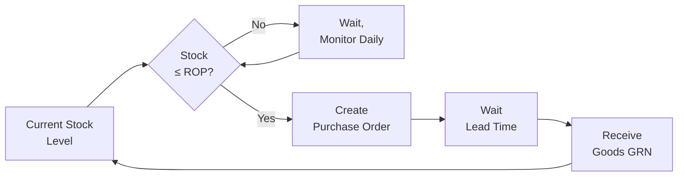

# MF05 — Inventory Management
> *Quản lý tồn kho: EOQ, safety stock, reorder point, ABC analysis, Inventory Turns và VAS 02*

---

## 1. Learning Objectives

- Tính toán EOQ (Economic Order Quantity) tối ưu
- Xác định Safety Stock và Reorder Point
- Thực hiện ABC Analysis cho tồn kho
- Tính và phân tích Inventory Turns
- Áp dụng đúng phương pháp tính giá tồn kho theo VAS 02 (FIFO và bình quân gia quyền)

---

## 2. Business Context

Tồn kho là **tài sản lớn nhất nhưng cũng là rủi ro lớn nhất** của nhiều doanh nghiệp sản xuất và thương mại. Quá nhiều tồn kho → đóng băng vốn, chi phí lưu trữ cao, nguy cơ hàng hết hạn. Quá ít → stockout, mất doanh thu, phá vỡ production.

**Tại VN:** VAS 02 (Thông tư 200/2014) cho phép 2 phương pháp tính giá xuất kho: FIFO và bình quân gia quyền (không cho phép LIFO). Inventory là đề tài kiểm toán quan trọng.

---

## 3. Definitions

| Thuật ngữ | Định nghĩa |
|-----------|-----------|
| **EOQ** | Economic Order Quantity — lượng đặt hàng tối ưu |
| **Safety Stock** | Tồn kho an toàn — buffer cho demand uncertainty |
| **Reorder Point (ROP)** | Mức tồn kho khi cần đặt lại hàng |
| **Lead Time** | Thời gian từ đặt hàng đến nhận hàng |
| **Inventory Turns** | Vòng quay tồn kho (COGS / Average Inventory) |
| **Days Sales of Inventory (DSI)** | 365 / Inventory Turns |
| **Holding Cost** | Chi phí duy trì tồn kho (vốn + kho + hao hổng) |
| **Ordering Cost** | Chi phí đặt một lần hàng |
| **Stockout Cost** | Chi phí khi hết hàng (mất doanh thu, rush order) |
| **Dead Stock** | Hàng tồn lâu ngày, không bán được |

---

## 4. Core Concepts

### 4.1 EOQ — Economic Order Quantity

```
EOQ Formula:
         ______
        / 2DS
EOQ =  /  ────
      √     H

Trong đó:
  D = Annual demand (units/year)
  S = Ordering cost per order (VND/order)
  H = Holding cost per unit per year (VND/unit/year)
  H thường = Unit cost × Holding rate (20-30%/year)

VÍ DỤ:
  D = 12,000 units/year (1,000/tháng)
  S = 500,000 VND/order (nhân công, admin)
  Unit cost = 100,000 VND
  Holding rate = 25%/year → H = 25,000 VND/unit/year

  EOQ = √(2 × 12,000 × 500,000 / 25,000) = √480,000 ≈ 693 units

Ý nghĩa: Đặt ~700 units mỗi lần là tối ưu nhất về tổng chi phí
```

### 4.2 Safety Stock và Reorder Point

```
SAFETY STOCK (Basic formula):
  SS = Z × σ_LTD

  Z = Service level factor
    95% service level → Z = 1.65
    99% service level → Z = 2.33
  σ_LTD = Std deviation of demand during lead time

SAFETY STOCK (Full formula khi LT cũng biến đổi):
  SS = Z × √(LT × σ_d² + d̄² × σ_LT²)

  d̄ = Average daily demand
  σ_d = Std deviation of daily demand
  LT = Average lead time (days)
  σ_LT = Std deviation of lead time

REORDER POINT:
  ROP = Average demand during lead time + Safety Stock
  ROP = d̄ × LT + SS

VÍ DỤ:
  d̄ = 50 units/day, LT = 10 days, σ_d = 8 units, Z = 1.65
  SS = 1.65 × 8 × √10 = 1.65 × 25.3 ≈ 42 units
  ROP = 50 × 10 + 42 = 542 units

→ Khi inventory xuống còn 542 units, đặt lại hàng
```

### 4.3 ABC Analysis

```
ABC ANALYSIS (dựa trên Pareto):

Bước 1: Tính annual consumption value mỗi SKU
         = Annual usage × Unit cost

Bước 2: Sort giảm dần theo giá trị

Bước 3: Tính % cộng dồn

Bước 4: Phân loại:
  CLASS A: 0-80% cộng dồn giá trị (thường ~20% SKUs)
  CLASS B: 80-95% cộng dồn (thường ~30% SKUs)
  CLASS C: 95-100% cộng dồn (thường ~50% SKUs)

QUẢN LÝ THEO CLASS:
  A: Theo dõi chặt chẽ, weekly/daily review, tight safety stock
  B: Monthly review, moderate control
  C: Simple min-max, periodic review, bulk order

BIẾN THỂ — ABC-XYZ ANALYSIS:
  XYZ = predictability của demand
  X: Regular, predictable (coefficient of variation < 0.5)
  Y: Some variability (0.5-1.0)
  Z: Highly variable or sporadic (> 1.0)

  AX: High value, predictable → lean stock
  CZ: Low value, unpredictable → generous stock or eliminate
```

### 4.4 Inventory Turns và KPIs

```
INVENTORY TURNS:
  Inventory Turns = COGS / Average Inventory
  
  Average Inventory = (Opening + Closing) / 2
  hoặc = (Σ Monthly ending inventory) / 12

DAYS SALES OF INVENTORY (DSI):
  DSI = 365 / Inventory Turns
  DSI = Average Inventory / (COGS / 365)

VÍ DỤ:
  COGS = 100 tỷ VND
  Avg Inventory = 20 tỷ VND
  Inventory Turns = 5x/year
  DSI = 365/5 = 73 ngày

BENCHMARKS VN (tham khảo):
  Siêu thị/FMCG:  20-30 ngày (12-18x)
  Bán lẻ chung:   45-90 ngày (4-8x)
  Sản xuất:       30-60 ngày (6-12x)
  Xây dựng:       60-120 ngày
```

### 4.5 Valuation theo VAS 02

```
VAS 02 (Thông tư 200/2014): 2 phương pháp được phép:

1. FIFO (Nhập trước xuất trước):
   Hàng nhập vào trước được tính xuất trước.
   Trong lạm phát: FIFO → COGS thấp hơn → Lợi nhuận cao hơn
   
   VÍ DỤ:
   Nhập lô 1: 100 units × 100,000 VND = 10,000,000
   Nhập lô 2: 100 units × 110,000 VND = 11,000,000
   Xuất 150 units:
     FIFO COGS = 100 × 100,000 + 50 × 110,000 = 15,500,000
     Còn lại: 50 units × 110,000 = 5,500,000

2. BÌNH QUÂN GIA QUYỀN (Weighted Average):
   Tính giá bình quân mỗi lần nhập (Moving Average) hoặc cuối kỳ
   
   Moving Average:
     Sau lô 1: (100 × 100,000) / 100 = 100,000/unit
     Nhập lô 2: (100×100,000 + 100×110,000) / 200 = 105,000/unit
     Xuất 150 units: 150 × 105,000 = 15,750,000
     Còn lại: 50 × 105,000 = 5,250,000
   
   LƯU Ý: VAS không cho phép LIFO (khác với US GAAP)
```

### 4.6 Dead Stock Management

```
DEAD STOCK IDENTIFICATION:
  Inventory không có movement trong X ngày (thường 90-180 ngày)
  
DEAD STOCK ACTION PLAN:
  Step 1: Identify và quantify (list, value, age)
  Step 2: Root cause (forecast error? quality? product change?)
  Step 3: Options analysis:
    - Discount sale / promotion
    - Bundling với fast-moving items
    - Return to supplier (nếu còn thời hạn)
    - Donate (có thể được charitable deduction)
    - Write-off (hạch toán chi phí)
  Step 4: Prevent recurrence (better forecasting, smaller MOQ)
```

---

## 5. Business Value

| Ứng dụng | Kết quả |
|---------|---------|
| EOQ optimization | Giảm ordering + holding cost tổng |
| Safety stock right-sizing | Balance stockout risk vs working capital |
| ABC-XYZ analysis | Focus management attention đúng chỗ |
| Inventory turns improvement | Giải phóng working capital |

---

## 6. Enterprise Role

- **Inventory Manager:** Policy, levels, system
- **Demand Planner:** Forecast input cho safety stock calculation
- **Supply Planner:** EOQ, ROP, purchase scheduling
- **Accountant:** Valuation (VAS 02), year-end count

---

## 7. Departments Related

Operations · Finance · Accounting · Procurement · Sales

---

## 8. Input

- Sales history và forecast
- Lead time data từ suppliers
- Supplier MOQ, pricing breaks
- Storage capacity constraints
- Cost of capital (cho holding cost)

---

## 9. Output

- Inventory level targets (safety stock, ROP, max)
- Purchase orders (triggered by ROP)
- Inventory valuation (FIFO/BQGQ)
- Inventory report (physical vs system)

---

## 10. Business Process

```
Demand forecast → Safety stock calculation → ROP setting
→ Daily monitoring: Actual stock vs ROP
→ When stock hits ROP: Trigger purchase order
→ PO sent → Goods received → Inventory level restores
→ Monthly: ABC analysis review, adjust parameters
→ Quarterly: Dead stock review
→ Annual: Physical inventory count (reconcile với book)
```

---

## 11. Data Flow

```
Sales (actual + forecast) → Demand Planner
                         → Safety Stock & ROP calc
                         ↓
ERP Inventory module → Real-time stock levels
                     → Auto PO when ROP triggered
                     ↓
Accounting → Inventory valuation → Balance Sheet
          → COGS (when issued) → P&L
```

---

## 12. Money Flow

```
INVENTORY CARRYING COST (approximate):
  Capital cost:     10-15% of inventory value (opportunity cost)
  Storage cost:     3-5% (rent, utilities, handling)
  Obsolescence:     2-3%
  Shrinkage/damage: 1-2%
  Insurance:        0.5-1%
  TOTAL:           ~20-30% of inventory value/year

WORKING CAPITAL IMPACT:
  High inventory → Ties up cash
  Inventory Turns ↑ → Cash Conversion Cycle ↓ → Cash Flow ↑
  1 ngày giảm DSI × (COGS/365) = tiền mặt được giải phóng
```

---

## 13. Document Flow

```
Inventory policy document → ERP setup (safety stock, ROP)
ERP → Purchase proposals (khi đến ROP)
PO → GRN → Inventory increase
Sales Order → Pick/Issue → Inventory decrease
Month-end: Inventory count → Comparison → Adjustment voucher
Year-end: Physical count → Auditor verification
```

---

## 14. Roles

| Vai trò | Trách nhiệm |
|---------|------------|
| Inventory Manager | Policy, level targets, write-off approval |
| Demand/Supply Planner | EOQ, ROP, safety stock calculation |
| Warehouse Staff | Physical count, cycle count |
| Accountant | Valuation method, COGS, balance sheet |

---

## 15. Responsibilities

- CFO/Finance Director approve inventory write-offs (thuế yêu cầu chứng minh)
- Kế toán chịu trách nhiệm về phương pháp tính giá nhất quán (FIFO hoặc BQGQ) trong cùng loại hàng

---

## 16. RACI

| Activity | Inv Manager | Finance | Procurement | Accounting |
|----------|:-----------:|:-------:|:-----------:|:----------:|
| Set safety stock | A | C | C | I |
| Physical count | A | C | I | C |
| Inventory adjustment | A | A | I | R |
| Write-off decision | C | A | I | R |
| Valuation method | C | A | I | A |

---

## 17. Frameworks

- **EOQ Model** — Wilson formula
- **ABC-XYZ Matrix** — Inventory classification
- **Min-Max Inventory** — Simple ROP system
- **Kanban** — Visual, pull-based replenishment (xem MF01)
- **VMI (Vendor-Managed Inventory)** — Supplier manages your stock

---

## 18. International Standards

- **VAS 02** — Tồn kho (FIFO, BQGQ, giá thấp hơn giữa giá gốc và NRV)
- **IAS 2** — Inventories (IFRS equivalent, no LIFO)
- **ISO 9001** — Inventory as part of quality management

---

## 19. Vietnam Context

**VAS 02 — Hàng tồn kho:**
- Chuẩn mực kế toán VN, ban hành theo QĐ 149/2001
- Chi tiết tại Thông tư 200/2014/TT-BTC
- 2 phương pháp: FIFO và bình quân gia quyền
- **Không được phép dùng LIFO** (khác US GAAP)
- Ghi nhận theo giá gốc, test NRV (Net Realizable Value) — nếu NRV < giá gốc → lập dự phòng

**Dự phòng giảm giá hàng tồn kho:**
- Theo TT 48/2019: Lập dự phòng khi giá bán thuần < giá gốc
- Hạch toán vào chi phí (641)
- Tax: Được khấu trừ nếu có đủ chứng từ, hàng thực sự lỗi/hết hạn

**Kiểm kê (Physical Count):**
- Bắt buộc cuối năm (31/12)
- Biên bản kiểm kê + phiếu chênh lệch
- Chênh lệch phải giải trình, được phê duyệt trước khi điều chỉnh sổ

---

## 20. Legal Considerations

- **TT 200/2014:** Hướng dẫn chế độ kế toán → quy định về phương pháp tính giá HTK
- **TT 133/2016:** Cho DN nhỏ và vừa — cùng nguyên tắc VAS 02 nhưng đơn giản hơn
- **Luật thuế TNDN:** Chi phí hàng hỏng, hết hạn được khấu trừ nếu có biên bản hủy, phê duyệt
- **Kiểm toán:** Inventory là trọng yếu kiểm toán — phải count và reconcile

---

## 21. Common Mistakes

1. **Safety stock = 0 hoặc cố định:** Không tính theo variability → sai
2. **Không review ROP:** Lead time thay đổi nhưng ROP vẫn cũ
3. **LIFO bị dùng nhầm:** Không hợp lệ theo VAS/IFRS
4. **Không nhất quán phương pháp:** Đổi giữa FIFO và BQGQ không đúng quy định
5. **Dead stock bỏ qua:** Tồn kho phình to, working capital bị khóa
6. **ABC không được update:** SKU list thay đổi nhưng ABC vẫn cũ

---

## 22. Best Practices

- **Review EOQ/ROP hàng quý** — Lead time và demand thay đổi
- **Separate inventory policy by class** — A/B/C khác nhau
- **Set expiry alerts:** WMS cảnh báo khi gần hết hạn
- **Inventory budget:** Plan inventory levels như plan tài chính
- **Slow-mover report monthly:** Action trước khi thành dead stock

---

## 23. KPIs

| KPI | Benchmark |
|-----|-----------|
| **Inventory Turns** | Ngành-specific (FMCG: 12-20x; Mfg: 4-8x) |
| **DSI (Days Sales of Inventory)** | < 60 ngày (manufacturing), < 30 ngày (retail) |
| **Service Level (Fill Rate)** | > 98% order lines shipped complete |
| **Inventory Accuracy** | > 99.5% (system vs physical) |
| **Dead Stock %** | < 2% of total inventory value |

---

## 24. Metrics

- Slow-mover inventory value (no movement in 90 days)
- Write-off value per year
- Safety stock coverage (days)
- ROP breach frequency

---

## 25. Reports

- **Daily inventory level report** (vs ROP trigger)
- **Monthly ABC analysis** (updated)
- **Monthly inventory turns** (Finance/Operations)
- **Quarterly dead stock review** (Finance/Management)
- **Annual physical count report** (Audit)

---

## 26. Templates

**Inventory Policy Card per SKU:**
```
SKU: ________________
Description: ________________
ABC Class: A / B / C    XYZ Class: X / Y / Z

Annual Demand (units): ___________
Lead Time (days): ___________
Unit Cost: ___________
MOQ from Supplier: ___________

EOQ: ___________
Safety Stock: ___________
Reorder Point: ___________
Max Stock: ___________

Valuation Method: FIFO / Weighted Average
Review frequency: Weekly / Monthly / Quarterly

Last reviewed: ___________   Next review: ___________
```

---

## 27. Checklists

**Monthly inventory review checklist:**
- [ ] ABC analysis updated với last 3-month data?
- [ ] ROP and safety stock reviewed cho A-class items?
- [ ] Dead stock list reviewed với action items?
- [ ] Inventory turns calculated và vs target?
- [ ] NRV check — bất kỳ hàng nào có giá bán < giá gốc?
- [ ] Cycle count completed và accurate?

---

## 28. SOP

**Phân tích hàng tồn kho chậm luân chuyển (Quarterly):**
```
1. Pull report: SKUs no outbound movement > 90 days
2. Phân loại theo giá trị:
   - > 50tr VND: Escalate lên Manager/Director
   - 10-50tr VND: Team leader review
   - < 10tr VND: Standard disposal process
3. Với mỗi SKU, xác định:
   - Lý do chậm (forecast error? product discontinue? quality?)
   - Options: Sell, bundle, return to supplier, donate, scrap
4. Prepare recommendation cho Finance approval
5. Sau approval: Execute action
6. Document biên bản hủy (nếu destroy) để khai thuế
```

---

## 29. Case Study

**Masan Consumer — Inventory Optimization:**

Masan Consumer sản xuất và phân phối FMCG (Chin-su, Nam Ngư, Omachi).

**Challenge:** Tồn kho nguyên liệu cao (90+ DSI) do MOQ lớn từ suppliers và demand variability.

**Actions:**
- ABC-XYZ analysis toàn bộ 500+ raw materials
- AX items (high value, stable demand) → EOQ-based ordering
- CZ items (low value, variable) → Consignment stock với suppliers
- Negotiated smaller, more frequent deliveries với key suppliers
- VMI cho top 5 suppliers theo value

**Kết quả:**
- Raw material DSI giảm từ 92 ngày → 58 ngày
- Working capital released: ~150 tỷ VND
- Stockout rate giảm (safety stock tối ưu hơn)

---

## 30. Small Business Example

**Nhà thuốc 500 SKU — Inventory control đơn giản:**

```
Vấn đề: Thuốc hết hạn nhiều (~5% value/year), đồng thời
         thường xuyên hết một số thuốc phổ biến

Giải pháp:
  1. ABC analysis: 50 SKUs chiếm 80% doanh thu → focus
  2. Min-max system cho top 50:
     Min (ROP): 2 tuần demand
     Max: 4 tuần demand
  3. FEFO strict: Xếp kho theo ngày hết hạn, bán cũ trước
  4. Weekly dead stock check (90 ngày không bán)

Kết quả: Hàng hết hạn giảm từ 5% → 1.5%, stockout giảm 70%
```

---

## 31. Enterprise Example

**Vinamilk — Dairy Inventory Complexity:**

Sữa tươi: Shelf life 7-10 ngày → FEFO critical, tiny safety stock.
Sữa bột: Shelf life 12-24 tháng → Standard EOQ model.
Nguyên liệu (sữa bột gốc nhập khẩu): Lead time 60-90 ngày → Cao safety stock.

Multi-tiered policy theo product type và criticality.

---

## 32. ERP Mapping

| Inventory Activity | ERP Module |
|-------------------|-----------|
| Safety stock setting | MM — Material Master |
| ROP automatic PO | MM — MRP/Reorder Point Planning |
| Goods Receipt | MM — Goods Receipt |
| Goods Issue | MM — Goods Issue |
| Inventory valuation | MM-IM / FI-GL |
| Physical inventory | MM — Physical Inventory |

---

## 33. Automation Opportunities

- **Automated reorder:** ERP auto-creates PO when stock hits ROP
- **Demand-driven safety stock:** Auto-recalculate monthly
- **Expiry alerts:** WMS flag items nearing expiry
- **Automatic ABC recalculation:** Monthly based on actual consumption

---

## 34. AI Opportunities

- **ML forecasting:** Improve demand forecast accuracy → better safety stock
- **Dynamic safety stock:** Real-time adjustment based on demand signals
- **Anomaly detection:** Flag unusual inventory movements (theft, error)
- **Supplier risk scoring:** Adjust safety stock based on supplier reliability

---

## 35. Implementation Guide

**Thiết lập inventory management system:**
```
Tháng 1: Foundation
  - Physical count để establish baseline inventory
  - Assign ABC class cho tất cả SKUs
  - Set initial safety stock và ROP (conservative)

Tháng 2: Calculate và configure
  - Gather lead time data từ suppliers (at least 6 months history)
  - Calculate demand variability per SKU
  - Calculate EOQ và safety stock theo formula
  - Configure ERP/WMS với new parameters

Tháng 3+: Monitor và optimize
  - Weekly review A-class ROP breaches
  - Monthly ABC recalculation
  - Quarterly dead stock review
  - After 6 months: Re-baseline với actual data
```

---

## 36. Consulting Guide

**Inventory diagnostic:**
1. Inventory turns hiện tại là bao nhiêu? Trend?
2. Có formula-based safety stock không hay "gut feel"?
3. Dead stock chiếm bao nhiêu % total inventory?
4. Stockout frequency là bao nhiêu?
5. Phương pháp tính giá xuất kho: FIFO hay BQGQ? Nhất quán không?

---

## 37. Diagnostic Questions

1. Inventory turns của công ty là bao nhiêu lần/năm vs đối thủ?
2. Bao nhiêu % SKUs chưa bán trong 90 ngày qua?
3. Giá trị inventory hết hạn/bị hủy trong năm qua là bao nhiêu?

---

## 38. Interview Questions

- "EOQ là gì? Khi nào EOQ model không phù hợp?"
- "Safety stock khác gì với ROP?"
- "FIFO vs bình quân gia quyền — khác nhau thế nào theo VAS 02?"

---

## 39. Exercises

**Bài 1:** Công ty A có: Demand 24,000 units/năm, ordering cost 600,000 VND, unit cost 50,000 VND, holding rate 24%. Tính EOQ. Số lần đặt hàng/năm là bao nhiêu?

**Bài 2:** SKU có daily demand 30 units (σ = 5 units/day), lead time 14 ngày. Tính safety stock cho service level 95% (Z=1.65) và 99% (Z=2.33). ROP cho mỗi case là bao nhiêu?

**Bài 3:** Công ty có 1,000 SKUs. Top 200 SKUs = 78% revenue, next 300 = 16%, còn lại = 6%. Thiết kế inventory policy cho từng class: safety stock bao nhiêu tuần? Review frequency? Counting frequency?

---

## 40. References

- **Sách:** *Inventory Management and Optimization in SAP ERP* — Marc Hoppe
- **Sách:** *Inventory Accuracy: People, Processes & Technology* — David Piasecki
- **VN:** VAS 02 — Thông tư 200/2014/TT-BTC (Bộ Tài chính)
- **Certification:** CPIM (APICS/ASCM) — Inventory và production planning

---

## Output Formats

### Mermaid — Inventory Replenishment Cycle


### Flashcards
```
Q: EOQ là gì? Công thức?
A: Economic Order Quantity — lượng đặt hàng tối ưu cân bằng ordering cost và holding cost.
   EOQ = √(2DS/H) với D=annual demand, S=ordering cost, H=holding cost/unit/year.
   Ý nghĩa: Tổng chi phí (ordering + holding) là thấp nhất tại điểm EOQ.
   Limitation: Assumes constant demand — không phù hợp seasonal demand.

Q: Safety Stock vs Reorder Point?
A: Safety Stock: Buffer tồn kho để handle demand/supply variability.
   SS = Z × σ_LTD (service level × std dev of demand during lead time).
   Reorder Point: Mức tồn kho khi phải order lại.
   ROP = Average demand during lead time + Safety Stock.
   Ví dụ: ROP = 500 units → Khi tồn kho xuống 500, order ngay.

Q: VAS 02 — 2 phương pháp tính giá xuất kho?
A: FIFO (First In First Out): Hàng nhập trước → xuất trước về mặt giá.
   Bình quân gia quyền (Weighted Average): Tính giá trung bình sau mỗi lần nhập hoặc cuối kỳ.
   VAS không cho phép LIFO (khác với US GAAP).
   Lạm phát: FIFO → lợi nhuận cao hơn; BQGQ → trung gian.
```

### JSON Metadata
```json
{
  "module_code": "MF05",
  "module_name": "Inventory Management",
  "domain": "Manufacturing",
  "level": "Intermediate",
  "version": "1.0",
  "status": "complete",
  "prerequisites": ["MF01", "F01", "LG04"],
  "related_modules": ["LG02", "LG04", "MF06", "ERP05", "AC02"],
  "learning_time_hours": 10,
  "key_frameworks": ["EOQ Model", "ABC-XYZ Analysis", "Safety Stock", "Min-Max", "VMI"],
  "key_standards": ["VAS 02", "IAS 2", "ISO 9001"],
  "vietnam_specific": true,
  "tags": ["inventory", "EOQ", "safety-stock", "ABC-analysis", "FIFO", "VAS02", "inventory-turns"]
}
```
