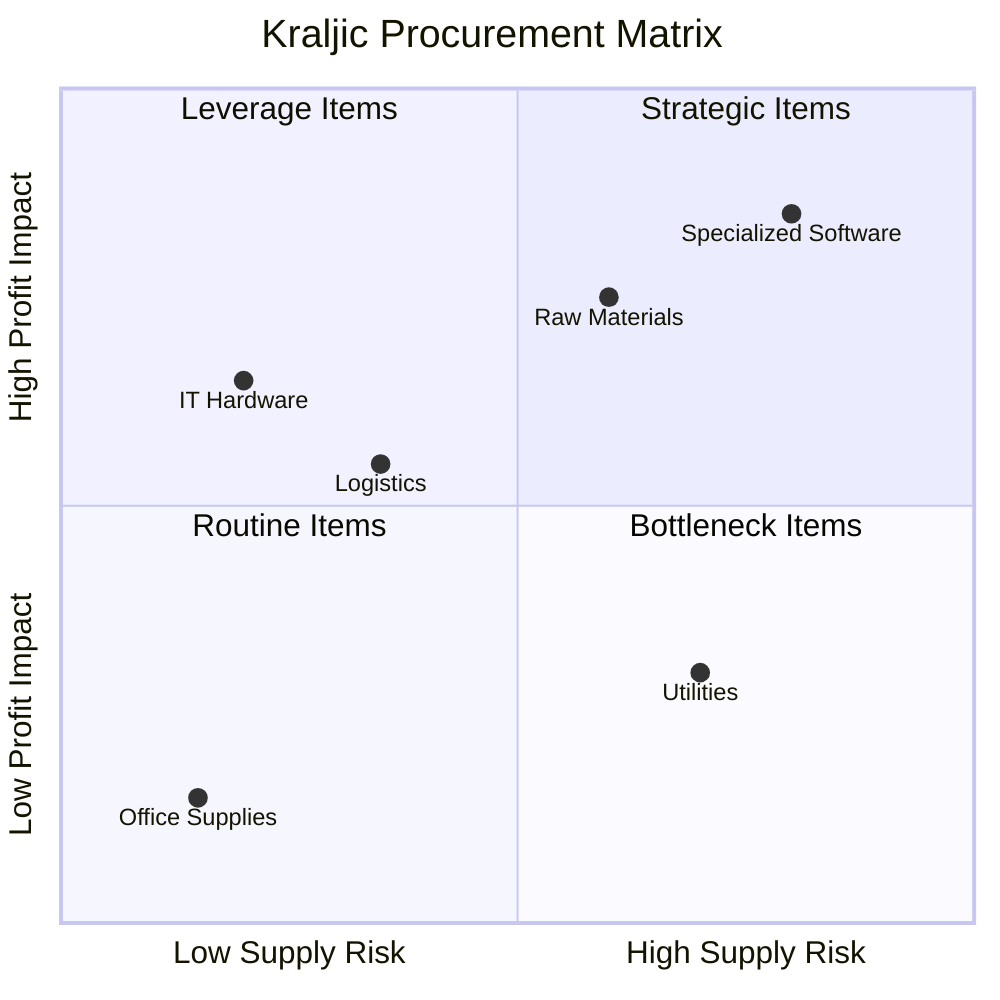

# MF06 — Procurement Management
> *Quản lý mua sắm: Kraljic Matrix, RFQ/RFP, SRM, Category Management và Luật Đấu Thầu 2023*

---

## 1. Learning Objectives

- Phân loại và chiến lược mua sắm theo Kraljic Matrix
- Thực hiện đúng quy trình RFQ/RFP và đánh giá nhà cung cấp
- Xây dựng Supplier Relationship Management (SRM)
- Hiểu Category Management trong procurement
- Áp dụng Luật Đấu Thầu 2023 cho tổ chức nhà nước và doanh nghiệp

---

## 2. Business Context

Procurement (Mua sắm) là **quá trình có hệ thống để thu mua hàng hóa, dịch vụ và công trình** từ các nhà cung cấp bên ngoài. Procurement chiến lược có thể tạo ra lợi thế cạnh tranh thông qua giảm chi phí, cải thiện chất lượng, và đảm bảo chuỗi cung ứng.

**Tại VN:** Spending của doanh nghiệp VN qua procurement có thể chiếm 50-70% revenue. Lĩnh vực công được điều chỉnh bởi Luật Đấu Thầu 2023. Nhiều DN tư nhân VN vẫn chưa có procurement function chuyên nghiệp — quyết định mua sắm phân tán, thiếu leverage.

---

## 3. Definitions

| Thuật ngữ | Định nghĩa |
|-----------|-----------|
| **Procurement** | Toàn bộ quá trình mua sắm từ need identification đến payment |
| **Purchasing** | Hành động mua (subset của procurement) |
| **Strategic Sourcing** | Phân tích và tối ưu hóa nguồn cung theo category |
| **RFQ** | Request for Quotation — yêu cầu báo giá (standard specs) |
| **RFP** | Request for Proposal — yêu cầu đề xuất (complex services) |
| **RFI** | Request for Information — thu thập thông tin thị trường |
| **SRM** | Supplier Relationship Management |
| **TCO** | Total Cost of Ownership — tổng chi phí sở hữu |
| **Kraljic Matrix** | Framework phân loại danh mục mua sắm |
| **Category Management** | Quản lý nhóm hàng mua sắm theo chiến lược |

---

## 4. Core Concepts

### 4.1 Kraljic Matrix

```
                    HIGH
                      │
  LEVERAGE ITEMS      │     STRATEGIC ITEMS
  (Mua sắm đòn bẩy)  │     (Quan hệ chiến lược)
  - Nhiều suppliers   │     - Ít supplier, quan trọng
  - Standard specs    │     - Khó thay thế
  - Leverage price    │     - Partnership, co-develop
  - Competitive bid   │     - Joint planning
────────────────────────────────────────────────
  ROUTINE ITEMS       │     BOTTLENECK ITEMS
  (Đơn giản hóa)      │     (Giảm rủi ro)
  - Low value, simple │     - Ít suppliers
  - Automate, catalog │     - Nếu thiếu → sản xuất dừng
  - Self-service      │     - Buffer stock, 2nd source
                      │     - Develop alternatives
                    LOW
                      ←── SUPPLY RISK ───→ HIGH
                    
         PROFIT IMPACT
```

### 4.2 Procurement Cycle — Procure-to-Pay (P2P)

```
1. NEED IDENTIFICATION
   Business unit xác định nhu cầu
   ↓
2. PURCHASE REQUISITION (PR)
   Requester tạo PR trong ERP
   ↓
3. APPROVAL
   Manager/Budget owner approve
   ↓
4. SOURCING
   RFI → RFQ/RFP → Evaluation → Negotiation
   ↓
5. PURCHASE ORDER (PO)
   Procurement tạo PO, gửi supplier
   ↓
6. GOODS RECEIPT (GR)
   Kho nhận hàng, xác nhận GR
   ↓
7. INVOICE PROCESSING
   Supplier gửi invoice → AP match vs PO và GR
   ↓
8. PAYMENT
   AP process payment (theo payment terms)
   ↓
9. VENDOR EVALUATION
   Performance review sau transaction
```

### 4.3 RFQ vs RFP vs RFI

```
RFI (Request for Information):
  - Mục đích: Market scanning, understand capabilities
  - Khi dùng: Bắt đầu sourcing category mới
  - Output: Market intelligence, supplier long-list

RFQ (Request for Quotation):
  - Mục đích: Nhận báo giá từ nhiều suppliers
  - Khi dùng: Sản phẩm/dịch vụ tiêu chuẩn, specs rõ ràng
  - Output: Comparable quotes → select lowest price (or best value)

RFP (Request for Proposal):
  - Mục đích: Soliciting comprehensive proposals
  - Khi dùng: Complex services, IT, consulting, constructions
  - Output: Proposals đánh giá theo nhiều tiêu chí

RFQ → PRICE focused
RFP → VALUE/SOLUTION focused
```

### 4.4 Supplier Evaluation — Scoring Matrix

```
CRITERIA (WEIGHTED SCORECARD):

Criterion         Weight  Supplier A  Supplier B  Supplier C
─────────────────────────────────────────────────────────────
Price/TCO           30%      8           9           7
Quality             25%      9           7           8
Delivery/Lead time  20%      7           8           9
Technical support   15%      9           6           7
Financial stability  10%     8           7           9
─────────────────────────────────────────────────────────────
WEIGHTED SCORE             8.2         7.7         7.9

Winner: Supplier A (8.2)

NOTE: Price NOT always the most important criterion
TCO (Total Cost of Ownership) includes:
  Purchase price + Delivery + Quality failures + Support + Switching cost
```

### 4.5 Supplier Relationship Management (SRM)

```
SUPPLIER SEGMENTATION:
  Strategic partners (Tier 1 critical):
    - Joint planning, open book costing
    - Annual strategic review
    - KPI sharing, co-investment
    
  Preferred suppliers:
    - Long-term contracts
    - Quarterly performance review
    - Volume commitments
    
  Approved suppliers:
    - Competitive bidding each time
    - Annual qualification review
    
  Transactional:
    - One-time or occasional
    - Standard PO terms

SRM ACTIVITIES:
  - Onboarding và qualification
  - Performance measurement (OTD, Quality, Service)
  - Development programs (Supplier Development)
  - Risk assessment và mitigation
  - Innovation collaboration
```

### 4.6 Category Management

```
CATEGORY MANAGEMENT PROCESS:

1. CATEGORY DEFINITION:
   Group related spend (e.g., "Packaging", "IT Hardware", "Logistics")

2. SPEND ANALYSIS:
   How much spent? On what? With which suppliers?

3. MARKET ANALYSIS:
   Supplier landscape, pricing trends, innovations

4. CATEGORY STRATEGY:
   Leverage? Partner? Consolidate? Develop?

5. SOURCING EXECUTION:
   RFQ/RFP, negotiation, contract

6. CONTRACT MANAGEMENT:
   Compliance, performance, renewal

7. PERFORMANCE REVIEW:
   Savings realized, supplier KPIs

VÍ DỤ CATEGORIES:
  Indirect: Office supplies, IT, Facilities, Travel
  Direct: Raw materials, components, packaging
  Services: Logistics, consulting, marketing
```

### 4.7 Luật Đấu Thầu 2023 (VN Public Procurement)

```
LUẬT ĐẤU THẦU 61/2023/QH15 (hiệu lực 01/01/2024):

Áp dụng cho:
  - Gói thầu sử dụng vốn nhà nước, ODA
  - Doanh nghiệp nhà nước (trên 50% vốn nhà nước)

Hình thức lựa chọn nhà thầu:
  1. Đấu thầu rộng rãi: Default, cạnh tranh cao nhất
  2. Đấu thầu hạn chế: Mời một số nhà thầu nhất định
  3. Chỉ định thầu: Đặc biệt (khẩn cấp, độc quyền) — ngưỡng hạn chế
  4. Mua sắm trực tiếp: Hàng hóa đã qua đấu thầu trước
  5. Tự thực hiện: Đơn vị tự làm

Hệ thống đấu thầu điện tử (e-procurement):
  - Đăng trên muasamcong.mpi.gov.vn
  - E-bidding bắt buộc nhiều gói thầu

Ngưỡng chỉ định thầu (2024):
  Hàng hóa, dịch vụ phi tư vấn: < 100 triệu VND
  Tư vấn: < 50 triệu VND
  Xây lắp: < 200 triệu VND

Điểm mới L61/2023:
  - Tăng cường e-procurement
  - Chống thông thầu
  - Trách nhiệm cá nhân rõ ràng hơn
  - Mở rộng ưu tiên hàng nội địa
```

---

## 5. Business Value

| Ứng dụng | Kết quả |
|---------|---------|
| Kraljic + Category strategy | 5-15% cost reduction on addressable spend |
| RFQ/RFP rigor | Tránh over-paying, better supplier terms |
| SRM với strategic suppliers | Lead time giảm, quality cải thiện |
| Spend consolidation | Volume discount leverage |

---

## 6. Enterprise Role

- **Chief Procurement Officer (CPO):** Strategy, governance, savings
- **Category Manager:** Category strategy, sourcing execution
- **Buyer/Purchasing Officer:** RFQ/RFP, PO management
- **Supplier Development Manager:** Supplier performance và development
- **AP Specialist:** Invoice processing, payment (xem AC02)

---

## 7. Departments Related

Finance · Operations · Legal · IT · All business units (requesters)

---

## 8. Input

- Business requirements/needs từ users
- Budget approved (Finance)
- Approved supplier list
- Contracts (existing)
- Market intelligence

---

## 9. Output

- Purchase Orders (POs)
- Supplier contracts
- Savings reports
- Supplier performance reports
- Vendor master data

---

## 10. Business Process

```
Need → PR → Approval → Sourcing (RFQ/RFP) → Negotiation
→ Contract → PO → GR → Invoice → Payment → Review
```

---

## 11. Data Flow

```
Business Units → PRs → Procurement System (SAP/Oracle/Ariba)
Procurement → RFQs/RFPs → Supplier Portal
Suppliers → Quotes → Evaluation
Contract signed → ERP vendor master
PO → Supplier → Goods/Services → GR
Invoice → AP (3-way match: PO + GR + Invoice) → Payment
Spend data → Analytics → Category insights
```

---

## 12. Money Flow

```
PAYMENT TERMS (phổ biến VN):
  Net 30: Trả trong 30 ngày từ invoice date
  2/10 Net 30: 2% discount nếu trả trong 10 ngày
  Net 45, Net 60: Cho suppliers lớn thương lượng được
  
EARLY PAYMENT DISCOUNT VALUE:
  2/10 Net 30 → Annual rate ≈ 37% (nếu dùng cơ hội này)
  → Worth taking nếu cost of capital < 37%

PROCUREMENT SAVINGS TYPES:
  Hard savings: Giảm actual spend (price reduction)
  Soft savings: Cost avoidance (prevent price increase)
  Working capital: Payment term extension (e.g., 30→60 days)
```

---

## 13. Document Flow

```
Purchase Requisition → Approval → RFQ/RFP → Quotes
→ Evaluation Report → Contract → Purchase Order
→ GRN → Supplier Invoice → 3-way match
→ Payment voucher → AP record
```

---

## 14. Roles

| Vai trò | Trách nhiệm |
|---------|------------|
| CPO | Strategy, governance, savings target |
| Category Manager | Category strategy, major sourcing |
| Buyer | Day-to-day purchasing, PO management |
| Contract Manager | Contract lifecycle management |
| AP | Invoice processing, payment |

---

## 15. Responsibilities

- Buyer không được tự phê duyệt PO của chính mình (segregation of duties)
- Category Manager chịu trách nhiệm về savings trong category
- Legal review contracts trên threshold (thường > 500tr VND)

---

## 16. RACI

| Activity | CPO | Category Mgr | Buyer | Legal | Finance |
|----------|:---:|:------------:|:-----:|:-----:|:-------:|
| Category strategy | A | R | C | I | C |
| RFQ/RFP | C | A | R | I | I |
| Contract negotiation | C | A | C | C | C |
| PO approval | I | C | A | I | C |
| Supplier eval | C | A | R | I | I |

---

## 17. Frameworks

- **Kraljic Matrix** — Portfolio analysis cho procurement
- **Strategic Sourcing 7-step** — Kearney model
- **Category Management** — GS1, CIPS
- **TCO (Total Cost of Ownership)** — Full cost analysis
- **Spend Analytics** — Data-driven procurement

---

## 18. International Standards

- **ISO 20400** — Sustainable Procurement
- **CIPS Standards** — Chartered Institute of Procurement & Supply
- **GDPR/Privacy** — Vendor data handling
- **ISO 31000** — Risk management trong supply chain

---

## 19. Vietnam Context

**Procurement landscape VN:**
- Majority DN tư nhân VN: Procurement chưa chuyên nghiệp
- Purchasing = Finance hoặc Admin function trong DN nhỏ
- Tập đoàn lớn (Vingroup, Masan, FPT): Procurement function riêng
- Manufacturing FDI (Samsung, Toyota): World-class procurement practice

**Thách thức VN:**
- Vendor master "dirty": Nhiều suppliers không có ESG/compliance
- Conflict of interest: Người mua + supplier có quan hệ cá nhân
- Không có spend analysis: Không biết mua gì, với ai, bao nhiêu
- E-procurement adoption thấp ở DN tư nhân

**Luật Đấu Thầu:**
- Khu vực công bị kiểm soát chặt
- DNNN (Doanh nghiệp nhà nước) phải follow — nhiều exceptions trước đây bị loại bỏ
- E-procurement mandatory cho nhiều gói thầu từ 2024

---

## 20. Legal Considerations

- **Luật Đấu Thầu 61/2023:** Áp dụng cho vốn nhà nước và DNNN
- **Nghị Định 24/2024:** Hướng dẫn chi tiết Luật Đấu Thầu 2023
- **Luật Cạnh Tranh 2018:** Chống thông thầu (bid rigging) — hình sự
- **Luật Phòng, Chống Tham Nhũng 2018:** Vendor gifts, conflict of interest
- **Luật Kế Toán 2015 + TT 200:** Chứng từ thanh toán hợp lệ

---

## 21. Common Mistakes

1. **Price-only evaluation:** Không tính TCO → highest risk
2. **Single-source without justification:** High supply risk, no leverage
3. **No approved supplier list:** Bất kỳ ai cũng có thể bán cho công ty
4. **Purchasing ≠ Procurement:** Chỉ thực hiện PO, không có strategy
5. **No contract for large spend:** Verbal agreement → tranh chấp
6. **No spend analytics:** Không biết pattern để leverage

---

## 22. Best Practices

- **Spend analysis trước:** Biết spend đang ở đâu mới chiến lược được
- **Supplier diversification:** Không phụ thuộc >70% spend vào 1 supplier
- **Annual contract review:** Không để contracts auto-renew mà không renegotiate
- **Cross-functional category teams:** Procurement + User + Finance + Technical
- **Benchmark to market:** Request quotes để biết giá thị trường dù đã có preferred supplier

---

## 23. KPIs

| KPI | Benchmark |
|-----|-----------|
| **Procurement savings (vs budget/last year)** | 3-8% of addressable spend |
| **PO compliance** | > 90% spend through PO |
| **Supplier OTIF** | > 95% |
| **PO cycle time** | < 3 ngày (standard) |
| **Spend under management** | > 80% of total spend |

---

## 24. Metrics

- Number of suppliers (rationalization target)
- % spend with strategic/preferred vs transactional suppliers
- Savings by category

---

## 25. Reports

- **Monthly spend report** (by category, supplier, department)
- **Quarterly savings report** (vs target)
- **Supplier performance dashboard** (monthly)
- **Annual sourcing plan** (category strategies, targets)

---

## 26. Templates

**RFQ Template (cơ bản):**
```
REQUEST FOR QUOTATION

To: [Supplier Name]
Date: ___________
RFQ Number: RFQ-2024-001
Response Deadline: [Date]

Company: [Your Company]
Contact: [Buyer name, email, phone]

ITEMS REQUESTED:

Item  Description              Qty   UOM   Target Price  Required Delivery
1     [Product name]           500   EA    [Optional]    DD/MM/YYYY
2     [Product name]           100   KG                  DD/MM/YYYY

EVALUATION CRITERIA:
  Price: 50%, Quality cert: 20%, Delivery: 20%, Payment terms: 10%

REQUIRED DOCUMENTATION:
  [ ] Unit price and lead time
  [ ] Company profile
  [ ] Quality certificates
  [ ] Payment terms

Please submit quote to [email] by [deadline].
```

---

## 27. Checklists

**Pre-sourcing checklist:**
- [ ] Spend analysis completed cho category?
- [ ] Current supplier performance reviewed?
- [ ] Business requirements signed off?
- [ ] Budget confirmed?
- [ ] Approved suppliers identified?
- [ ] Legal review needed (complex contracts)?

**RFQ process checklist:**
- [ ] At least 3 suppliers invited?
- [ ] Sealed bids (không để suppliers biết nhau's prices)?
- [ ] Evaluation criteria shared với suppliers?
- [ ] Decision documented và approved?
- [ ] PO created và sent?

---

## 28. SOP

**Strategic Sourcing Process (Large Category):**
```
Phase 1: Category Analysis (2-4 tuần)
  - Spend analysis: Ai mua gì, với ai, bao nhiêu?
  - Supplier market analysis: Supplier landscape, pricing trends
  - Category positioning trong Kraljic Matrix
  - Stakeholder needs assessment

Phase 2: Strategy Development (1-2 tuần)
  - Define sourcing strategy (consolidate? dual-source? develop?)
  - Define evaluation criteria và weightings
  - Identify potential suppliers (long-list 5-10)

Phase 3: Sourcing Execution (3-6 tuần)
  - RFI gửi long-list (nếu cần)
  - Short-list 3-5 suppliers
  - RFQ hoặc RFP gửi short-list
  - Evaluate, negotiate
  - Select, reference check

Phase 4: Contract & Implementation (2-4 tuần)
  - Negotiate contract terms
  - Legal review
  - Sign
  - Transition/implementation plan
  - Communicate với business users

Phase 5: Performance Management (Ongoing)
  - Quarterly supplier review
  - Track savings vs commitment
  - Manage contract renewals
```

---

## 29. Case Study

**Masan Consumer — Indirect Procurement Transformation:**

Masan Consumer có indirect spend ~500 tỷ VND/năm (IT, marketing, facilities, services) nhưng chưa có structure.

**Problem:** Spend rải rác, mỗi department tự mua, không có leverage, không có savings tracking.

**Transformation:**
- Tạo Indirect Procurement function (1 Category Manager + 2 Buyers)
- Spend analysis: 80% spend trong 8 categories
- Kraljic analysis: Marketing creative (Strategic), IT hardware (Leverage), Office (Routine)
- Sourcing events cho top categories

**Kết quả:**
- Year 1 savings: 65 tỷ VND (13% of spend)
- Consolidated office supply vendors từ 47 → 3
- IT hardware savings: 18% qua competitive bidding
- Payment terms extended: Average từ 30 → 45 ngày → working capital improvement

---

## 30. Small Business Example

**Nhà hàng 3 cơ sở — Procurement đơn giản hóa:**

```
Vấn đề: Mỗi cơ sở mua nguyên liệu riêng → giá khác nhau,
         chất lượng không đồng đều, không ai negotiate

Giải pháp đơn giản:
  1. Tập trung purchasing: Manager purchase → bulk discount
  2. Approved supplier list: 2 nhà cung cấp mỗi danh mục
  3. Weekly consolidated order: Thay vì daily ad-hoc
  4. Price comparison monthly: 2 suppliers bid hàng tháng

Kết quả: 12% giảm chi phí nguyên liệu, chất lượng đồng đều hơn
```

---

## 31. Enterprise Example

**Vingroup — Strategic Procurement:**

Vingroup với nhiều business units (Vinhomes, Vinmec, Vinmart, VinFast) có tổng procurement spending hàng chục nghìn tỷ/năm.

**Approach:**
- Corporate procurement function (leverage across BUs)
- Shared supplier base cho common categories
- VinFast: Automotive supply chain management với 300+ Tier 1 suppliers
- Collaboration với Korean/German suppliers cho technology transfer

---

## 32. ERP Mapping

| Procurement Activity | ERP Module |
|---------------------|-----------|
| Purchase Requisition | MM — Purchase Requisition |
| RFQ Management | MM — Quotation Comparison |
| Purchase Order | MM — Purchase Orders |
| Goods Receipt | MM — Goods Receipt |
| Invoice Verification | MM/FI — Invoice Verification (3-way match) |
| Vendor Evaluation | MM — Vendor Evaluation |
| Spend Analytics | BW/Ariba Analytics |

---

## 33. Automation Opportunities

- **Automated PO:** From approved PR → auto-create PO for catalog items
- **E-catalog:** Approved items với pre-negotiated prices → self-service
- **3-way match automation:** Auto-match PO + GR + Invoice → auto-approve
- **Supplier portal:** Suppliers submit quotes, invoices electronically

---

## 34. AI Opportunities

- **Spend classification:** AI auto-categorize spend transactions
- **Supplier risk monitoring:** AI scan news, financial data về suppliers
- **Price benchmarking:** AI compare prices vs market
- **Contract analytics:** AI extract key terms, flag non-standard clauses

---

## 35. Implementation Guide

**Building procurement function:**
```
Tháng 1: Foundation
  - Spend analysis: Pull all vendor payments last 12 months
  - Categorize spend
  - Identify top 20 suppliers by spend
  - Map current vs missing controls

Tháng 2: Controls
  - PO process (minimum threshold cho PO requirement)
  - Approved vendor list
  - Approval authority matrix

Tháng 3: Quick wins
  - Top 3-5 categories: Run competitive bidding
  - Consolidate routine spend (office, stationery)
  - Negotiate payment terms

Tháng 4+: Mature
  - Category strategies
  - Supplier segmentation
  - Savings tracking
  - System (Ariba, SAP MM, or basic tool)
```

---

## 36. Consulting Guide

**Procurement diagnostic:**
1. Spend analysis có tồn tại không? Biết rõ mua gì, với ai?
2. % spend qua PO vs direct payment?
3. Có approved supplier list không?
4. Competitive bidding cho major spend categories?
5. Savings tracking process có không?

---

## 37. Diagnostic Questions

1. Top 10 suppliers chiếm bao nhiêu % total spend?
2. Có bao nhiêu suppliers? Có thể rationalize không?
3. % purchases có PO trước khi mua?
4. Có ai đang conflict of interest với supplier không?

---

## 38. Interview Questions

- "Kraljic Matrix là gì? Apply thế nào trong procurement strategy?"
- "RFQ vs RFP — khi nào dùng gì?"
- "Làm thế nào measure procurement savings?"

---

## 39. Exercises

**Bài 1:** Phân loại 8 categories sau đây vào Kraljic Matrix (Strategic/Leverage/Bottleneck/Routine): Raw steel, Office stationery, Specialized software license, Logistics services, Marketing agency, Electricity, Company car fleet, IT laptops.

**Bài 2:** Thiết kế RFQ cho việc mua 500 bộ máy tính văn phòng. Xác định: Criteria đánh giá, weightings, số suppliers mời, thời gian xử lý.

**Bài 3:** Công ty có indirect spend 10 tỷ VND/năm. Sau khi consolidate suppliers và chạy competitive bidding, tiết kiệm được 8%. Tính savings bằng VND và justify việc thuê 1 Procurement Manager với salary 20tr/tháng.

---

## 40. References

- **CIPS:** cips.org — Chartered Institute of Procurement & Supply
- **Sách:** *The Procurement and Supply Manager's Desk Reference* — Sollish & Semanik
- **VN:** muasamcong.mpi.gov.vn — Hệ thống đấu thầu điện tử quốc gia
- **Luật:** Luật Đấu Thầu 61/2023/QH15, NĐ 24/2024/NĐ-CP

---

## Output Formats

### Mermaid — Kraljic Matrix


### Flashcards
```
Q: Kraljic Matrix — 4 quadrants là gì?
A: Strategic: High profit impact + High supply risk → Partnership, co-development
   Leverage: High profit impact + Low supply risk → Competitive bidding, leverage volume
   Bottleneck: Low profit impact + High supply risk → Buffer stock, develop alternatives
   Routine: Low profit impact + Low supply risk → Automate, simplify, catalog buying

Q: RFQ vs RFP khác nhau thế nào?
A: RFQ: Specs rõ ràng, cần so sánh giá → "Request for Price"
   RFP: Complex requirements, cần giải pháp → "Request for Solution"
   Dùng RFQ: Mua máy tính, nguyên liệu tiêu chuẩn, vật tư
   Dùng RFP: Thuê IT system, consulting firm, marketing agency

Q: Luật Đấu Thầu 2023 áp dụng cho ai?
A: (1) Gói thầu sử dụng vốn nhà nước (ngân sách, vốn vay)
   (2) Doanh nghiệp nhà nước (trên 50% vốn nhà nước)
   Hình thức: Đấu thầu rộng rãi (default), hạn chế, chỉ định thầu, mua sắm trực tiếp
   Ngưỡng chỉ định thầu: Hàng hóa < 100tr, Tư vấn < 50tr, Xây lắp < 200tr (2024)
```

### JSON Metadata
```json
{
  "module_code": "MF06",
  "module_name": "Procurement Management",
  "domain": "Manufacturing",
  "level": "Intermediate-Advanced",
  "version": "1.0",
  "status": "complete",
  "prerequisites": ["MF05", "LG02", "F01", "OP01"],
  "related_modules": ["MF05", "LG02", "LG03", "ERP05", "AC02", "LAW03"],
  "learning_time_hours": 10,
  "key_frameworks": ["Kraljic Matrix", "Strategic Sourcing 7-step", "Category Management", "TCO"],
  "key_standards": ["ISO 20400", "Luat Dau Thau 2023", "CIPS"],
  "vietnam_specific": true,
  "tags": ["procurement", "purchasing", "Kraljic", "RFQ", "RFP", "SRM", "category-management", "dau-thau"]
}
```
