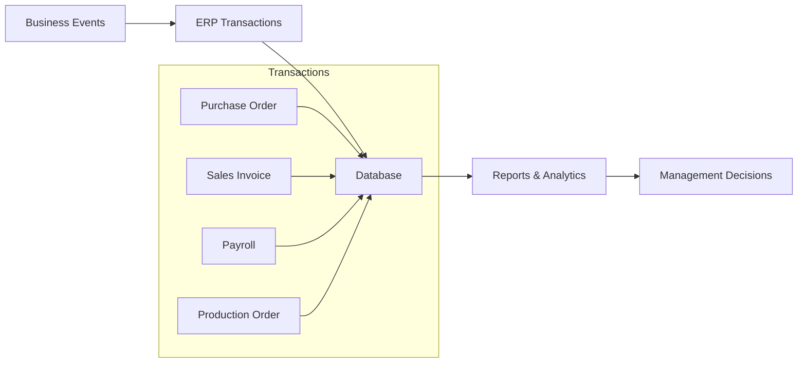
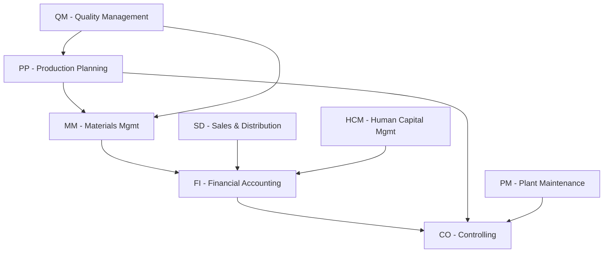

# ERP01 — ERP Fundamentals

> **Domain:** ERP
> **Trạng thái:** ✅ Hoàn thành
> **Level:** Foundation
> **Prerequisites:** Không yêu cầu

---

## 1. Learning Objectives

Sau khi hoàn thành module này, học viên có thể:

- Định nghĩa ERP và giải thích lịch sử phát triển từ MRP → MRP II → ERP → ERP II → Cloud ERP
- Liệt kê và mô tả các module chính của ERP (FI, CO, MM, SD, PP, HR, PM, QM)
- Phân tích lợi ích và rủi ro khi triển khai ERP
- Áp dụng phương pháp lựa chọn ERP (RFP, demo scoring, TCO analysis)
- So sánh các phương pháp triển khai (Waterfall, Agile, SAP ACTIVATE)
- Lập kế hoạch go-live và post-go-live support
- Tính toán Total Cost of Ownership (TCO) của dự án ERP
- Đánh giá thị trường ERP tại Việt Nam và lựa chọn phù hợp theo quy mô doanh nghiệp

---

## 2. Business Context

ERP (Enterprise Resource Planning) là xương sống của mọi doanh nghiệp hiện đại. Trong bối cảnh kinh doanh ngày nay, dữ liệu phân tán trên nhiều hệ thống silo gây ra sự thiếu nhất quán, chậm trễ trong ra quyết định, và tốn kém chi phí vận hành. ERP giải quyết vấn đề này bằng cách tích hợp tất cả quy trình kinh doanh vào một nền tảng duy nhất.

**Vấn đề doanh nghiệp trước ERP:**
- Dữ liệu tài chính, tồn kho, nhân sự lưu trữ trên các hệ thống riêng lẻ
- Nhập liệu thủ công nhiều lần, dễ sai sót
- Báo cáo mất nhiều thời gian, thiếu real-time visibility
- Khó khăn trong việc scale khi doanh nghiệp tăng trưởng

**ERP tạo ra giá trị:**
- Single source of truth cho toàn bộ dữ liệu doanh nghiệp
- Tự động hóa quy trình từ đầu đến cuối (end-to-end automation)
- Real-time reporting và analytics
- Tuân thủ quy định pháp luật (compliance) tốt hơn

---

## 3. Definitions

| Thuật ngữ | Định nghĩa |
|-----------|-----------|
| **ERP** | Enterprise Resource Planning — hệ thống phần mềm tích hợp quản lý toàn bộ quy trình kinh doanh của tổ chức |
| **MRP** | Material Requirements Planning — tiền thân của ERP, chỉ quản lý hoạch định nguyên vật liệu |
| **MRP II** | Manufacturing Resource Planning — mở rộng MRP sang lập kế hoạch sản xuất tổng thể |
| **Module** | Thành phần chức năng của ERP (FI, CO, MM, SD...) phục vụ một bộ phận/quy trình cụ thể |
| **Go-live** | Thời điểm hệ thống ERP chính thức đưa vào vận hành thực tế |
| **TCO** | Total Cost of Ownership — tổng chi phí sở hữu bao gồm license, implementation, customization, training, maintenance |
| **RFP** | Request for Proposal — tài liệu yêu cầu đề xuất gửi đến các nhà cung cấp ERP |
| **SaaS ERP** | Software as a Service ERP — ERP trên cloud, trả phí thuê bao thay vì mua license |
| **On-premise ERP** | ERP cài đặt trên server của doanh nghiệp |
| **Hypercare** | Giai đoạn hỗ trợ tập trung ngay sau go-live (thường 4-8 tuần) |

---

## 4. Core Concepts

### 4.1 Lịch sử phát triển ERP

```
1960s: Inventory Control
   ↓
1970s: MRP (Material Requirements Planning)
   ↓
1980s: MRP II (Manufacturing Resource Planning)
   ↓
1990s: ERP (Gartner đặt tên năm 1990) — SAP R/3, Oracle, PeopleSoft
   ↓
2000s: ERP II (mở rộng ra B2B, e-commerce)
   ↓
2010s: Cloud ERP (SAP S/4HANA Cloud, Oracle Fusion Cloud, NetSuite)
   ↓
2020s: Intelligent ERP (AI/ML embedded, Real-time analytics)
```

### 4.2 Các module ERP chính

| Module | Tên đầy đủ | Chức năng chính |
|--------|-----------|----------------|
| **FI** | Financial Accounting | Kế toán tài chính, sổ cái tổng hợp, công nợ |
| **CO** | Controlling | Kế toán quản trị, kiểm soát chi phí, profit center |
| **MM** | Materials Management | Mua hàng, quản lý kho, quản lý hàng tồn kho |
| **SD** | Sales & Distribution | Bán hàng, quản lý khách hàng, giao hàng, hóa đơn |
| **PP** | Production Planning | Lập kế hoạch sản xuất, quản lý lệnh sản xuất |
| **HR/HCM** | Human Resources | Quản lý nhân sự, lương, đào tạo, tuyển dụng |
| **PM** | Plant Maintenance | Bảo trì thiết bị, quản lý tài sản |
| **QM** | Quality Management | Quản lý chất lượng, kiểm định, thử nghiệm |

### 4.3 Kiến trúc ERP

```
┌─────────────────────────────────────────────────────┐
│                  ERP SYSTEM                          │
├──────────┬──────────┬──────────┬──────────┬─────────┤
│  Finance │  Supply  │  Sales   │   HR     │  Mfg    │
│  (FI/CO) │  Chain   │  (SD)    │ (HCM)    │  (PP)   │
│          │ (MM/WM)  │          │          │         │
├──────────┴──────────┴──────────┴──────────┴─────────┤
│              Shared Database (Single Source of Truth) │
├─────────────────────────────────────────────────────┤
│         Reporting & Analytics Layer                  │
└─────────────────────────────────────────────────────┘
```

---

## 5. Business Value

### Lợi ích định lượng (Quantifiable Benefits)
- **Giảm tồn kho:** 15-30% nhờ hoạch định tốt hơn
- **Giảm chu kỳ đóng sổ tháng:** Từ 10-15 ngày xuống 2-3 ngày
- **Giảm chi phí mua hàng:** 5-10% qua tập trung hóa và đàm phán tốt hơn
- **Tăng năng suất nhân viên:** 15-25% qua tự động hóa
- **Giảm lỗi nhập liệu:** 50-90% qua automation

### Lợi ích định tính (Qualitative Benefits)
- Visibility toàn công ty theo real-time
- Cải thiện khả năng tuân thủ pháp luật
- Nền tảng cho tăng trưởng và mở rộng quy mô
- Cải thiện dịch vụ khách hàng

### ROI điển hình
- Thời gian hoàn vốn: 2-5 năm cho SME, 3-7 năm cho enterprise
- ROI trung bình: 100-200% trong 5 năm

---

## 6. Enterprise Role

ERP đóng vai trò **hạ tầng số** (digital infrastructure) của doanh nghiệp:

- **Cho CFO/Finance:** Đóng sổ nhanh, báo cáo tự động, kiểm soát ngân sách
- **Cho COO/Operations:** Visibility chuỗi cung ứng, tối ưu tồn kho, lên kế hoạch sản xuất
- **Cho CEO:** Dashboard executive, KPI real-time, hỗ trợ ra quyết định chiến lược
- **Cho IT:** Giảm số hệ thống cần quản lý, tăng bảo mật tập trung
- **Cho Compliance:** Audit trail đầy đủ, báo cáo thuế tự động

---

## 7. Departments Related

| Phòng ban | Mức độ liên quan | Module ERP sử dụng |
|-----------|-----------------|-------------------|
| Kế toán / Tài chính | Rất cao | FI, CO |
| Mua hàng / Procurement | Rất cao | MM |
| Kho vận / Logistics | Rất cao | MM, WM/EWM |
| Kinh doanh / Sales | Cao | SD, CRM |
| Sản xuất | Cao | PP, QM, PM |
| Nhân sự / HR | Cao | HCM/HR |
| IT | Trung bình | Toàn bộ (infrastructure) |
| Ban lãnh đạo | Trung bình | Reporting, Analytics |

---

## 8. Input

- Yêu cầu kinh doanh (Business Requirements Document — BRD)
- Quy trình hiện tại (As-Is Process)
- Danh sách phần mềm đang dùng (IT Landscape)
- Ngân sách dự án
- Timeline triển khai
- Nhân lực tham gia dự án (Project Team)
- Dữ liệu master data (danh mục hàng hóa, khách hàng, nhà cung cấp)
- Yêu cầu pháp lý (legal và compliance requirements)

---

## 9. Output

- Hệ thống ERP vận hành (running ERP system)
- Quy trình chuẩn hóa (To-Be Process)
- Tài liệu thiết kế hệ thống (System Design Documents)
- Tài liệu hướng dẫn người dùng (User Manuals)
- Báo cáo và dashboard
- Nhân viên được đào tạo
- Dữ liệu đã được migrate vào hệ thống mới
- SLA hỗ trợ sau go-live

---

## 10. Business Process

### Quy trình lựa chọn và triển khai ERP

```
1. KHỞI ĐẦU
   ├── Xác định nhu cầu kinh doanh
   ├── Lập ban chỉ đạo dự án (Steering Committee)
   └── Phê duyệt ngân sách sơ bộ

2. LỰA CHỌN ERP
   ├── Lập RFP (Request for Proposal)
   ├── Chấm điểm nhà cung cấp (Vendor Scoring)
   ├── Demo sản phẩm (Product Demo)
   ├── Kiểm tra tham chiếu (Reference Check)
   └── Đàm phán và ký hợp đồng

3. TRIỂN KHAI
   ├── Project Kick-off
   ├── Blueprint / Business Blueprint (BBP)
   ├── Realization / Configuration
   ├── Testing (UAT, Integration Test)
   ├── Training
   └── Go-live

4. POST GO-LIVE
   ├── Hypercare (4-8 tuần)
   ├── Stabilization
   └── Continuous Improvement
```

---

## 11. Data Flow



---

## 12. Money Flow

Trong dự án ERP, dòng tiền bao gồm:

| Chi phí | Tỷ lệ thông thường | Mô tả |
|---------|-------------------|-------|
| License/Subscription | 20-35% TCO | Phí bản quyền phần mềm hoặc SaaS |
| Implementation | 35-50% TCO | Tư vấn, cấu hình, customization |
| Hardware/Infrastructure | 5-15% TCO | Server, cloud, network |
| Training | 5-10% TCO | Đào tạo người dùng |
| Data Migration | 5-10% TCO | Làm sạch và chuyển dữ liệu |
| Annual Maintenance | 15-22% license/năm | Support và upgrade |

---

## 13. Document Flow

```
RFI → RFP → Vendor Proposal → Evaluation Matrix
  ↓
Contract → Project Charter → Project Plan
  ↓
Business Blueprint (BBP) → Technical Design Document (TDD)
  ↓
Test Script → Test Result → Sign-off Document
  ↓
Training Material → User Manual → Go-live Approval
  ↓
Post-Implementation Review Report
```

---

## 14. Roles

| Vai trò | Mô tả |
|---------|-------|
| **Project Sponsor** | Chủ dự án (thường là CEO/CFO), phê duyệt ngân sách và quyết định chiến lược |
| **Project Manager (PMO)** | Quản lý tiến độ, rủi ro, nguồn lực dự án |
| **Business Process Owner** | Chủ quy trình nghiệp vụ, phê duyệt thiết kế |
| **Key User** | Người dùng chính, tham gia UAT, sau đó là super user |
| **ERP Consultant (Functional)** | Tư vấn cấu hình module theo nghiệp vụ |
| **ERP Consultant (Technical)** | Phát triển ABAP/customization, integration |
| **IT Manager** | Quản lý hạ tầng, bảo mật, system administration |
| **Data Migration Lead** | Phụ trách extract, transform, load dữ liệu cũ |
| **Change Manager** | Quản lý thay đổi tổ chức (OCM) |
| **Vendor Account Manager** | Đại diện nhà cung cấp ERP |

---

## 15. Responsibilities

- **Project Sponsor:** Phê duyệt ngân sách, giải quyết escalation, truyền thông nội bộ
- **PM:** Lập kế hoạch, track tiến độ, quản lý rủi ro, báo cáo định kỳ
- **Business Process Owner:** Quyết định thiết kế quy trình To-Be, sign-off BBP
- **Key User:** Test UAT, đào tạo end-user, first-line support sau go-live
- **Functional Consultant:** Thiết kế configuration, viết functional spec
- **Technical Consultant:** Phát triển custom objects, RICEF, integration
- **Data Migration Lead:** Mapping, cleansing, loading, validation dữ liệu

---

## 16. RACI

| Hoạt động | Sponsor | PM | BPO | Key User | Func. Consultant | Tech. Consultant |
|-----------|---------|-----|-----|---------|-----------------|-----------------|
| Phê duyệt ngân sách | A | R | C | I | I | I |
| Thiết kế quy trình | I | C | A | R | R | I |
| Cấu hình hệ thống | I | I | C | C | R/A | R |
| UAT Testing | I | C | A | R | C | C |
| Go-live Decision | A | R | C | I | C | I |
| Đào tạo người dùng | I | C | C | R/A | R | I |

*R=Responsible, A=Accountable, C=Consulted, I=Informed*

---

## 17. Frameworks

| Framework | Áp dụng cho |
|-----------|-----------|
| **SAP ACTIVATE** | SAP S/4HANA implementation |
| **AIM (Application Implementation Method)** | Oracle ERP |
| **Sure Step** | Microsoft Dynamics (cũ) |
| **Success by Design** | Microsoft D365 |
| **ASAP Methodology** | SAP (phiên bản cũ) |
| **Agile/Scrum** | Odoo, modern ERP implementations |
| **PMBOK** | Project management framework cho ERP project |
| **ITIL** | Post-go-live IT service management |

---

## 18. International Standards

| Chuẩn | Liên quan đến ERP |
|-------|-------------------|
| **ISO 9001** | Quality Management — ERP hỗ trợ traceability |
| **SOX (Sarbanes-Oxley)** | Kiểm soát tài chính — ERP tạo audit trail |
| **IFRS / GAAP** | Chuẩn kế toán — ERP FI module phải tuân thủ |
| **ISO 27001** | Bảo mật thông tin — ERP data security |
| **ISO 55001** | Asset Management — PM module |
| **GS1 Standards** | Barcode, RFID trong WMS/MM |

---

## 19. Vietnam Context

### Thị trường ERP tại Việt Nam

**Phân khúc SME (Doanh nghiệp vừa và nhỏ):**
- **MISA AMIS:** Phổ biến nhất cho SME VN, tích hợp kế toán theo chuẩn VAS, 250,000+ doanh nghiệp sử dụng
- **Fast Accounting:** Mạnh về kế toán VAS, phổ biến ở các công ty thương mại
- **Bravo ERP:** Cho doanh nghiệp vừa, có module sản xuất
- **1C Enterprise:** Từ Nga, phổ biến ở một số ngành

**Phân khúc Enterprise:**
- **SAP:** PetroVietnam, Vingroup, Masan, Sabeco, các ngân hàng lớn
- **Oracle ERP Cloud / JDE:** FPT, một số tập đoàn nhà nước
- **Microsoft D365:** Các công ty multinational tại VN

**Thách thức triển khai ERP tại VN:**
- Kế toán VAS khác với IFRS — cần localization
- Thiếu nhân lực ERP có kinh nghiệm
- SME ngại chi phí cao và thời gian triển khai dài
- Văn hóa tổ chức chưa sẵn sàng thay đổi (change resistance)
- Dữ liệu master data chất lượng thấp (thiếu nhất quán)

**Quy định liên quan:**
- Thông tư 133/2016/TT-BTC và 200/2014/TT-BTC (chế độ kế toán VN)
- Nghị định về hóa đơn điện tử (Nghị định 123/2020/NĐ-CP)
- Luật Kế toán 2015

---

## 20. Legal Considerations

- **Hóa đơn điện tử:** Theo Nghị định 123/2020/NĐ-CP, bắt buộc từ 7/2022, ERP phải tích hợp với provider hóa đơn điện tử (VNPT, MISA, Viettel)
- **Lưu trữ chứng từ:** Tối thiểu 5-10 năm theo Luật Kế toán
- **Bảo mật dữ liệu:** Nghị định 13/2023/NĐ-CP về bảo vệ dữ liệu cá nhân
- **Kiểm toán:** ERP phải tạo được audit trail đủ để phục vụ kiểm toán thuế
- **Contract ERP:** Cần điều khoản SLA, IP ownership của customization, data ownership

---

## 21. Common Mistakes

1. **Underestimating scope:** Tưởng đơn giản, thực ra phức tạp hơn nhiều
2. **Poor data quality:** Migrate dữ liệu rác vào hệ thống mới
3. **Over-customization:** Sửa quá nhiều thành "cây nhà lá vườn", khó upgrade
4. **Lack of executive sponsorship:** Không có sự ủng hộ từ ban lãnh đạo
5. **Insufficient training:** Người dùng không biết dùng, quay lại Excel
6. **Big bang go-live cho hệ thống lớn:** Nên go-live từng phần (phased rollout)
7. **Bỏ qua change management:** Nhân viên kháng cự thay đổi
8. **Thiếu business process re-engineering:** Giữ nguyên quy trình cũ, force ERP vào
9. **Budget overrun không kiểm soát:** Scope creep không có change control
10. **Không có hypercare plan:** Go-live xong bỏ mặc người dùng

---

## 22. Best Practices

1. **Fit-to-standard trước:** Hãy thay đổi quy trình theo best practice của ERP, không nên customize quá nhiều
2. **Executive sponsorship mạnh:** CEO/CFO phải chủ động tham gia
3. **Dedicated project team:** Người dùng chủ chốt (key user) phải dành ít nhất 50% thời gian cho dự án
4. **Data governance trước go-live:** Làm sạch dữ liệu master data trước khi migrate
5. **Test kỹ trước khi go-live:** Ít nhất 3 vòng UAT
6. **Phased rollout cho doanh nghiệp lớn:** Đừng go-live tất cả cùng lúc
7. **Change management song song:** OCM (Organizational Change Management) phải bắt đầu từ ngày đầu
8. **Document mọi thứ:** BBP, config guide, user manual, SOPs
9. **Plan for hypercare:** Chuẩn bị đội support mạnh cho 4-8 tuần sau go-live
10. **Continuous improvement mindset:** ERP không phải dự án có điểm kết, cần cải tiến liên tục

---

## 23. KPIs

| KPI | Mô tả | Target |
|-----|-------|--------|
| Project Schedule Variance | % chênh lệch so với kế hoạch | < 10% |
| Budget Variance | % chênh lệch so với ngân sách | < 15% |
| Data Migration Error Rate | % lỗi trong quá trình migrate | < 1% |
| UAT Pass Rate | % test cases pass | > 95% |
| Training Completion Rate | % người dùng hoàn thành training | > 90% |
| System Uptime post go-live | % thời gian hoạt động | > 99% |
| Ticket Resolution Time | Thời gian xử lý issues sau go-live | < 4 giờ (critical) |
| User Adoption Rate | % người dùng sử dụng đúng | > 85% sau 3 tháng |

---

## 24. Metrics

**Operational Metrics (sau go-live):**
- Month-end close cycle time: Trước/Sau ERP
- PO processing time: Số giờ từ yêu cầu mua đến PO
- Invoice processing time: Số giờ từ nhận hóa đơn đến phê duyệt
- Inventory turnover: Vòng quay tồn kho
- Order fulfillment cycle time: Từ đặt hàng đến giao hàng
- Report generation time: Tự động vs thủ công

---

## 25. Reports

| Báo cáo | Module | Tần suất |
|---------|--------|---------|
| Báo cáo tài chính tháng (P&L, Balance Sheet) | FI/CO | Hàng tháng |
| Báo cáo tồn kho | MM | Hàng ngày/tuần |
| Báo cáo doanh thu theo kênh | SD | Hàng ngày |
| Báo cáo tiến độ sản xuất | PP | Hàng ngày |
| Báo cáo công nợ phải thu/phải trả | FI | Hàng tuần |
| Báo cáo lương | HCM | Hàng tháng |
| Dashboard KPI tổng giám đốc | All | Real-time |
| Báo cáo thuế VAT | FI | Hàng tháng/quý |

---

## 26. Templates

### RFP Scoring Template

```
| Tiêu chí                  | Trọng số | SAP | Oracle | MISA |
|--------------------------|---------|-----|--------|------|
| Functional Fit            | 30%     |  8  |   8    |  7   |
| VN Localization           | 20%     |  7  |   6    | 10   |
| Implementation Cost       | 15%     |  5  |   5    |  9   |
| Total Cost of Ownership   | 15%     |  5  |   5    |  8   |
| Vendor Support Quality    | 10%     |  9  |   8    |  7   |
| Technology & Scalability  | 10%     | 10  |   9    |  6   |
| TỔNG                      | 100%    | 7.3 |  7.0   | 7.9  |
```

---

## 27. Checklists

### Checklist Go-live Readiness

- [ ] Tất cả test cases UAT đã pass (>95%)
- [ ] Data migration đã được validate và sign-off
- [ ] Tất cả người dùng đã hoàn thành training
- [ ] Cutover plan đã được duyệt
- [ ] Hypercare team đã sẵn sàng
- [ ] Helpdesk/ticketing system đã setup
- [ ] Rollback plan đã được chuẩn bị
- [ ] Executive sign-off cho go-live
- [ ] Parallel run (nếu có) đã hoàn thành
- [ ] Hệ thống cũ đã được freeze dữ liệu

---

## 28. SOP

### SOP: Quy trình lựa chọn ERP

**Mục đích:** Đảm bảo quá trình lựa chọn ERP khách quan, minh bạch, đúng nhu cầu doanh nghiệp.

**Bước 1 — Xác định yêu cầu (2-4 tuần)**
- Phỏng vấn các phòng ban để thu thập yêu cầu
- Phân loại: Must-have vs Nice-to-have
- Lập Business Requirements Document (BRD)

**Bước 2 — Lập RFP (1-2 tuần)**
- Mô tả công ty và bối cảnh
- Liệt kê yêu cầu chức năng và phi chức năng
- Yêu cầu demo, reference sites, TCO estimate

**Bước 3 — Đánh giá nhà cung cấp (4-6 tuần)**
- Gửi RFP cho 3-5 nhà cung cấp
- Review proposal
- Demo sản phẩm với kịch bản thực tế (scripted demo)
- Chấm điểm theo scorecard

**Bước 4 — Chọn và đàm phán (2-4 tuần)**
- Short-list 2 nhà cung cấp
- Kiểm tra reference (gọi cho khách hàng đang dùng)
- Đàm phán giá, SLA, contract terms
- Sign contract

---

## 29. Case Study

### Case Study: Công ty FMCG Việt Nam triển khai SAP S/4HANA

**Công ty:** Tập đoàn thực phẩm & đồ uống (3,000 nhân viên, doanh thu 5,000 tỷ VND)

**Vấn đề trước ERP:**
- 7 hệ thống phần mềm riêng lẻ, không kết nối
- Đóng sổ tháng mất 15 ngày
- Tồn kho sai lệch 15-20% so với thực tế
- Báo cáo CEO phải tổng hợp thủ công từ nhiều nguồn

**Giải pháp:** SAP S/4HANA (FI, CO, MM, SD, PP, QM)

**Triển khai:**
- Thời gian: 18 tháng
- Phương pháp: SAP ACTIVATE (Phased rollout — Finance trước, sau đó Supply Chain)
- Partner: Công ty tư vấn SAP tier-1
- Ngân sách: 25 tỷ VND (gồm license, implementation, infrastructure)

**Kết quả sau 1 năm go-live:**
- Đóng sổ tháng: 15 ngày → 3 ngày
- Sai lệch tồn kho: 15% → 2%
- Tiết kiệm chi phí tồn kho: 12 tỷ VND/năm
- Real-time dashboard cho Ban lãnh đạo

---

## 30. Small Business Example

### Công ty thương mại 50 nhân viên — Triển khai MISA AMIS

**Bối cảnh:** Công ty phân phối thiết bị văn phòng, đang dùng Excel và phần mềm kế toán riêng.

**Vấn đề:**
- Không kiểm soát được tồn kho thực tế
- Công nợ khách hàng theo dõi bằng Excel, thường quên
- Kế toán mất 3-4 ngày để nộp báo cáo thuế

**Giải pháp:** MISA AMIS (Kế toán + Bán hàng + Kho) — SaaS, ~15 triệu VND/năm

**Kết quả:**
- Hóa đơn điện tử tích hợp, giảm 80% thời gian kế toán
- Kiểm soát tồn kho real-time
- Nhắc nợ tự động cho khách hàng
- Nộp báo cáo thuế điện tử trong 1 ngày

---

## 31. Enterprise Example

### Petrovietnam — SAP ERP tích hợp toàn tập đoàn

Tập đoàn Dầu khí Việt Nam (PVN) triển khai SAP tích hợp cho các công ty thành viên (PVEP, PVGAS, BSR, PVFCCo...) để:
- Consolidate báo cáo tài chính tập đoàn
- Chuẩn hóa quy trình mua hàng, kiểm soát ngân sách đầu tư
- Quản lý chi phí dự án thăm dò/khai thác

**Modules:** FI, CO, MM, PM (Plant Maintenance cho nhà máy lọc dầu), PS (Project Systems)

---

## 32. ERP Mapping

```
Quy trình Procure-to-Pay:
PR (Purchase Requisition) → PO (Purchase Order) → GR (Goods Receipt) → Invoice → Payment
   MM.ME51N          MM.ME21N              MM.MIGO             FI.MIRO      FI.F-53

Quy trình Order-to-Cash:
Sales Order → Delivery → Goods Issue → Invoice → Payment Receipt
  SD.VA01      SD.VL01N    SD.VL02N    SD.VF01    FI.F-28

Quy trình Record-to-Report:
Journal Entries → Period-end Closing → Trial Balance → Financial Statements
   FI.FB50         FI.F-02, CO periods    FI.S_ALR      FI.F.01
```

---

## 33. Automation

| Quy trình | Automation Level | Công nghệ |
|-----------|-----------------|-----------|
| Invoice processing (AP) | Cao | OCR + AI matching |
| PO auto-approval | Cao | Workflow rules |
| Inventory replenishment | Trung bình | MRP/ATP |
| Month-end close | Cao | Scheduled jobs |
| Payroll calculation | Rất cao | Rules engine |
| Tax reporting | Cao | E-invoice integration |
| Intercompany reconciliation | Cao | Automated matching |
| KPI report generation | Cao | Scheduled BI refresh |

---

## 34. AI Opportunities

- **Intelligent Invoice Processing:** AI đọc hóa đơn PDF, tự động đề xuất GL coding
- **Demand Forecasting:** ML dự báo nhu cầu cho PP/MM planning
- **Anomaly Detection:** Phát hiện giao dịch bất thường trong FI
- **Chatbot for ERP:** Nhân viên hỏi số liệu qua chat thay vì vào ERP
- **Predictive Maintenance:** PM module + IoT + AI dự đoán hỏng hóc thiết bị
- **Credit Risk Scoring:** AI đánh giá rủi ro tín dụng khách hàng trong SD
- **Smart Procurement:** AI đề xuất nhà cung cấp, thời điểm mua, giá hợp lý

---

## 35. Implementation Guide

### Giai đoạn 1: Discover & Prepare (4-8 tuần)
- Kick-off meeting với toàn bộ stakeholder
- Lập project organization chart
- Setup project tools (Jira, SharePoint, Teams)
- Cài đặt môi trường development

### Giai đoạn 2: Explore / Blueprint (8-12 tuần)
- Workshop từng module với key users
- Thiết kế quy trình To-Be (Business Process Design)
- Xác định gaps và quyết định: configure vs customize vs change process
- Viết Business Blueprint Document

### Giai đoạn 3: Realize / Realization (16-24 tuần)
- Configuration theo thiết kế đã duyệt
- Development RICEF objects
- Unit testing, Integration testing
- Data migration preparation

### Giai đoạn 4: Deploy (6-8 tuần)
- User Acceptance Testing (UAT)
- Training end-users
- Cutover planning và rehearsal
- Go-live

### Giai đoạn 5: Run (ongoing)
- Hypercare (4-8 tuần đầu)
- Stabilization
- Continuous improvement

---

## 36. Consulting Guide

**Khi tư vấn lựa chọn ERP cho khách hàng, hỏi:**

1. **Quy mô và ngành:** Bao nhiêu nhân viên? Ngành gì? Quy trình đặc thù?
2. **Ngân sách thực tế:** Có sẵn sàng chi bao nhiêu? (Không nên gợi ý trước)
3. **Timeline:** Khi nào cần go-live? Có deadline pháp lý không?
4. **IT maturity:** Có IT team nội bộ không? Cloud hay on-premise?
5. **Pain points hiện tại:** Vấn đề cấp bách nhất là gì?
6. **Change readiness:** Ban lãnh đạo có cam kết không? Nhân viên có chống đối không?
7. **Integration needs:** Cần kết nối với hệ thống nào khác (e-commerce, logistics)?
8. **Compliance:** Có yêu cầu báo cáo đặc thù không (ngân hàng, chứng khoán, FDI)?

**Framework đề xuất ERP theo quy mô:**
- < 50 nhân viên: MISA, KiotViet, Zoho Books
- 50-500 nhân viên: MISA AMIS, Bravo, Odoo Community/Enterprise
- 500-2000 nhân viên: Odoo Enterprise, Microsoft D365 Business Central
- > 2000 nhân viên: SAP S/4HANA, Oracle ERP Cloud, D365 Finance & Operations

---

## 37. Diagnostic Questions

1. Hiện tại bạn đang dùng bao nhiêu phần mềm khác nhau để quản lý doanh nghiệp?
2. Đóng sổ tháng mất bao nhiêu ngày? Đâu là bottleneck?
3. Bạn có biết tồn kho thực tế của mình là bao nhiêu không, theo real-time?
4. CEO/CFO muốn xem báo cáo gì và phải chờ bao lâu để có số liệu?
5. Đã từng có dự án ERP thất bại chưa? Bài học là gì?
6. Nhân viên kế toán/kho mất bao nhiêu giờ/ngày cho công việc nhập liệu thủ công?
7. Có bao nhiêu lần sai sót đơn hàng/giao hàng mỗi tháng? Chi phí xử lý là bao nhiêu?
8. Nếu có ERP tốt, quy trình nào bạn muốn cải thiện đầu tiên?

---

## 38. Interview Questions

**Cho vị trí ERP Business Analyst / Consultant:**

1. Giải thích sự khác nhau giữa FI và CO trong SAP? Tại sao cần cả hai?
2. Procure-to-Pay process gồm những bước nào? Document nào được tạo ra ở mỗi bước?
3. Khi khách hàng yêu cầu customization, bạn phân tích như thế nào để quyết định có nên làm không?
4. Bạn xử lý như thế nào khi key user từ chối thay đổi quy trình trong dự án ERP?
5. Sự khác nhau giữa Go-live strategy Big Bang và Phased Rollout là gì? Khi nào dùng cái nào?
6. TCO của ERP bao gồm những gì? Làm sao thuyết phục CFO phê duyệt ngân sách?
7. Kể về một dự án ERP khó khăn bạn đã trải qua. Vấn đề gì xảy ra và bạn giải quyết thế nào?

---

## 39. Exercises

**Bài tập 1 — RFP Scoring:**
Lập bảng chấm điểm cho 3 nhà cung cấp ERP (SAP, Odoo, MISA) cho một công ty sản xuất 200 nhân viên tại Hà Nội. Xác định 8 tiêu chí và trọng số phù hợp.

**Bài tập 2 — TCO Calculation:**
Tính TCO 5 năm cho hai lựa chọn: (a) SAP S/4HANA Cloud (b) Odoo Enterprise On-premise. Giả định công ty 500 nhân viên.

**Bài tập 3 — Process Design:**
Vẽ quy trình Order-to-Cash cho công ty phân phối, bao gồm các bước, người thực hiện, và hệ thống ERP hỗ trợ.

**Bài tập 4 — Change Management Plan:**
Lập kế hoạch Change Management cho dự án ERP 12 tháng. Xác định stakeholder, communication plan, training plan, và resistance mitigation.

**Bài tập 5 — Go-live Checklist:**
Tạo go-live checklist đầy đủ cho dự án ERP với 3 module FI, MM, SD. Tối thiểu 20 hạng mục.

---

## 40. References

- Gartner Magic Quadrant for Cloud ERP for Service-Centric Enterprises (annual)
- SAP ACTIVATE Methodology — help.sap.com
- Panorama Consulting: ERP Report (Annual Industry Survey)
- Thomas H. Davenport: "Putting the Enterprise into the Enterprise System" (HBR 1998)
- Vinnie Mirchandani: "The New Polymath" — Modern ERP architecture
- Thông tư 200/2014/TT-BTC — Chế độ kế toán doanh nghiệp Việt Nam
- Nghị định 123/2020/NĐ-CP — Hóa đơn, chứng từ
- MISA AMIS: amis.misa.vn
- SAP Vietnam: sap.com/vietnam

---

## Output Formats

### Mermaid: ERP Module Dependencies



### ASCII Diagram: ERP Implementation Phases

```
PHASE 1       PHASE 2       PHASE 3       PHASE 4       PHASE 5
Discover  --> Blueprint --> Realize   --> Deploy    --> Run
(4-8 wks)    (8-12 wks)   (16-24 wks)   (6-8 wks)    (ongoing)
   |              |             |              |             |
Project      Process       Config +       UAT +        Hypercare
Setup        Design        Dev            Go-live      + Support
```

### Flashcards

**Q1:** ERP viết tắt của gì và ra đời khi nào?
**A1:** Enterprise Resource Planning. Thuật ngữ do Gartner đặt tên năm 1990, phát triển từ MRP (1970s) → MRP II (1980s) → ERP (1990s).

**Q2:** TCO trong ERP gồm những thành phần nào?
**A2:** License/Subscription + Implementation (consulting, config, development) + Infrastructure (hardware/cloud) + Training + Data Migration + Annual Maintenance (thường 15-22% license/năm).

**Q3:** Sự khác nhau giữa Big Bang và Phased Rollout go-live?
**A3:** Big Bang: tất cả modules go-live cùng lúc — rủi ro cao nhưng nhanh. Phased Rollout: go-live từng phần (theo module hoặc theo địa lý) — an toàn hơn nhưng phức tạp hơn về integration.

### Cheat Sheet

```
ERP SELECTION CHEAT SHEET
═══════════════════════════════════════
BY COMPANY SIZE (Vietnam):
< 50 NV     → MISA AMIS, KiotViet
50-500 NV   → Bravo, Odoo, MISA AMIS
500-2000 NV → Odoo Enterprise, D365 BC
> 2000 NV   → SAP S/4HANA, Oracle, D365

KEY MODULES:
FI = Finance (kế toán tài chính)
CO = Controlling (kế toán quản trị)
MM = Materials Mgmt (mua hàng, kho)
SD = Sales & Distribution (bán hàng)
PP = Production Planning (sản xuất)
HCM = Human Capital Mgmt (nhân sự)
PM = Plant Maintenance (bảo trì)
QM = Quality Management (chất lượng)

IMPLEMENTATION PHASES (SAP ACTIVATE):
1. Discover  2. Prepare  3. Explore
4. Realize   5. Deploy   6. Run

TCO BREAKDOWN:
License 20-35% | Implementation 35-50%
Infrastructure 5-15% | Training 5-10%
Data Migration 5-10%
```

### JSON Metadata

```json
{
  "module_code": "ERP01",
  "module_name": "ERP Fundamentals",
  "domain": "ERP",
  "level": "Foundation",
  "estimated_study_time_hours": 8,
  "prerequisites": [],
  "related_modules": ["ERP02", "ERP03", "ERP04", "ERP05"],
  "key_concepts": ["ERP", "MRP", "TCO", "RFP", "Go-live", "SAP ACTIVATE", "RICEF", "Change Management"],
  "erp_systems_covered": ["SAP", "Oracle", "Microsoft D365", "Odoo", "MISA", "Bravo", "Fast"],
  "vietnam_context": true,
  "last_updated": "2026-06-30",
  "tags": ["erp", "enterprise-software", "implementation", "sap", "fundamentals"]
}
```
