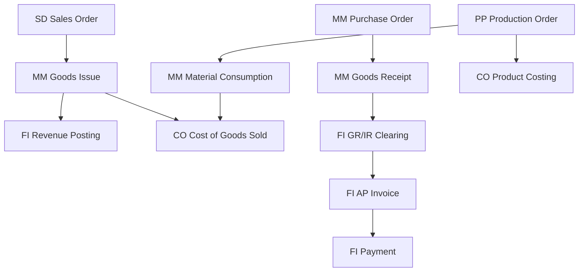
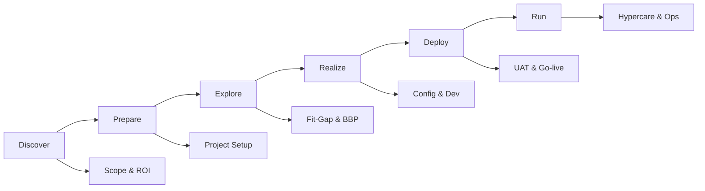

# ERP02 — SAP

> **Domain:** ERP
> **Trạng thái:** ✅ Hoàn thành
> **Level:** Intermediate
> **Prerequisites:** ERP01 — ERP Fundamentals

---

## 1. Learning Objectives

Sau khi hoàn thành module này, học viên có thể:

- Mô tả kiến trúc SAP S/4HANA và sự khác biệt với SAP ECC
- Giải thích vai trò từng module SAP (FI/CO, MM, SD, PP, HR/HCM, PM, QM, PS, WM/EWM)
- Áp dụng SAP ACTIVATE methodology qua 6 giai đoạn (Discover-Prepare-Explore-Realize-Deploy-Run)
- Định nghĩa và phân loại RICEF objects (Reports, Interfaces, Conversions, Enhancements, Forms)
- Hiểu cơ chế Transport Management và Authorization trong SAP
- Nhận diện các tình huống triển khai SAP tại Việt Nam

---

## 2. Business Context

SAP là nhà cung cấp ERP lớn nhất thế giới (chiếm ~22% thị phần ERP toàn cầu). SAP S/4HANA là thế hệ ERP thứ 4 của SAP, chạy trên nền tảng in-memory database SAP HANA, cho phép xử lý dữ liệu thời gian thực thay vì batch processing truyền thống.

Tại Việt Nam, SAP được triển khai chủ yếu tại:
- Tập đoàn nhà nước lớn (PetroVietnam, Vietnam Airlines, EVN)
- Tập đoàn tư nhân lớn (Vingroup, Masan, Techcombank, BIDV)
- Công ty FDI (Samsung, LG, Unilever, P&G, Nestle)

Hiểu SAP là kỹ năng cốt lõi cho bất kỳ ERP consultant hay Business Analyst nào làm việc với doanh nghiệp enterprise tại VN.

---

## 3. Definitions

| Thuật ngữ | Định nghĩa |
|-----------|-----------|
| **SAP S/4HANA** | Thế hệ SAP ERP hiện đại nhất, chạy trên SAP HANA in-memory database |
| **SAP ECC** | ERP Central Component — phiên bản SAP truyền thống (sẽ hết support 2027) |
| **SAP HANA** | High-performance ANalytic Appliance — database in-memory của SAP |
| **RICEF** | Reports, Interfaces, Conversions, Enhancements, Forms — các loại development objects trong SAP |
| **Transport** | Cơ chế chuyển configuration/development từ DEV → QA → PROD |
| **Authorization** | Phân quyền người dùng trong SAP theo roles và profiles |
| **T-code** | Transaction code — mã lệnh để truy cập chức năng trong SAP (vd: ME21N = tạo PO) |
| **Business Blueprint** | Tài liệu thiết kế quy trình nghiệp vụ trong dự án SAP |
| **Fiori** | Giao diện web/mobile hiện đại của SAP S/4HANA |
| **SAP BTP** | Business Technology Platform — nền tảng cloud của SAP cho extension và integration |

---

## 4. Core Concepts

### 4.1 SAP S/4HANA Architecture

```
┌─────────────────────────────────────────────────────────────┐
│                    User Layer                               │
│  SAP Fiori (Web/Mobile) | SAP GUI | APIs                   │
├─────────────────────────────────────────────────────────────┤
│                 Application Layer                           │
│  Finance | Supply Chain | Manufacturing | HR | Sales       │
├─────────────────────────────────────────────────────────────┤
│              SAP HANA Database Layer                        │
│  In-Memory Processing | Real-time Analytics                │
├─────────────────────────────────────────────────────────────┤
│              Infrastructure Layer                           │
│  On-Premise | SAP RISE (Cloud) | Hybrid                    │
└─────────────────────────────────────────────────────────────┘
```

### 4.2 Các Module SAP chính

| Module | Tên đầy đủ | Chức năng |
|--------|-----------|-----------|
| **FI** | Financial Accounting | Sổ cái tổng hợp (GL), AP, AR, Asset Accounting, Banking |
| **CO** | Controlling | Cost Center Accounting, Profit Center, Internal Orders, Product Costing |
| **MM** | Materials Management | Procurement, Inventory Management, Invoice Verification |
| **SD** | Sales & Distribution | Sales Orders, Pricing, Shipping, Billing |
| **PP** | Production Planning | MRP, Production Orders, Capacity Planning, Shop Floor |
| **HCM** | Human Capital Management | Org Management, Personnel Admin, Payroll, Time Management |
| **PM** | Plant Maintenance | Equipment, Maintenance Orders, Preventive Maintenance |
| **QM** | Quality Management | Inspection Lots, Quality Notifications, Control Charts |
| **PS** | Project System | WBS, Networks, Project Budgeting, Milestone Billing |
| **WM/EWM** | (Extended) Warehouse Management | Warehouse structure, Picking, Packing, Transfer Orders |
| **TM** | Transportation Management | Freight Orders, Carrier Management, Route Optimization |
| **RE-FX** | Real Estate Management | Lease Contracts, Property Management |

### 4.3 SAP ACTIVATE Methodology

```
DISCOVER → PREPARE → EXPLORE → REALIZE → DEPLOY → RUN
   ↑           ↑         ↑         ↑          ↑       ↑
  Scope      Project    Fit-Gap   Config +   UAT +  Support
  Define     Setup      Analysis   Dev       Go-live  Improve
 (Pre-sale)  (Kickoff)  (BBP)     (Build)   (Train)  (Ops)
```

**Chi tiết từng giai đoạn:**

**Discover (2-4 tuần):** Demo system, ROI justification, project scope approval

**Prepare (4-6 tuần):** Project kickoff, team setup, system provisioning, learning plan

**Explore (8-12 tuần):** Fit-to-standard workshops, business process design, delta requirements, sign-off Business Blueprint

**Realize (12-20 tuần):** System configuration, custom development (RICEF), integration build, testing (unit, integration)

**Deploy (6-8 tuần):** UAT, user training, data migration cutover, go-live

**Run (ongoing):** Hypercare, operations, continuous improvement, upgrade cycles

---

## 5. Business Value

- **Real-time analytics:** SAP HANA cho phép chạy báo cáo trên data live, không cần data warehouse riêng cho operational reports
- **Simplified data model:** S/4HANA giảm số bảng dữ liệu từ hàng nghìn xuống vài trăm (universal journal)
- **Process automation:** Intelligent automation tích hợp trong S/4HANA (AI-based invoice matching, predictive analytics)
- **Mobile access:** SAP Fiori cho phép nhân viên phê duyệt PO, xem tồn kho từ điện thoại
- **Compliance:** SAP hỗ trợ chuẩn kế toán IFRS, local GAAP, báo cáo thuế nhiều quốc gia

---

## 6. Enterprise Role

SAP là **hệ thống lõi (core system of record)** trong kiến trúc IT của enterprise:

- FI/CO: System of record cho tài chính, là nguồn dữ liệu tin cậy nhất
- MM/SD: Quản lý toàn bộ supply chain từ mua hàng đến giao hàng khách
- PP: Điều phối sản xuất, đồng bộ với kế hoạch bán hàng
- HCM: Quản lý workforce, tính lương
- Hệ thống khác (CRM, BI, e-commerce) tích hợp vào SAP thông qua API/SAP BTP

---

## 7. Departments Related

| Phòng ban | Module SAP | Chức năng chính |
|-----------|-----------|----------------|
| Kế toán / Tài chính | FI, CO | Sổ cái, công nợ, báo cáo tài chính |
| Mua hàng | MM (Purchasing) | PR, PO, hợp đồng mua hàng |
| Kho vận | MM (IM), WM/EWM | Nhập xuất kho, kiểm kê |
| Kinh doanh | SD | Đơn hàng, giao hàng, hóa đơn bán |
| Sản xuất | PP | Lệnh sản xuất, MRP |
| Chất lượng | QM | Kiểm định chất lượng |
| Nhân sự | HCM | Lương, chấm công, tổ chức |
| Kỹ thuật / Bảo trì | PM | Bảo trì thiết bị |
| Dự án | PS | Quản lý dự án đầu tư |

---

## 8. Input

- Business Requirements Document (BRD) từ khách hàng
- As-Is process documentation
- Master data lists (vật tư, khách hàng, nhà cung cấp, chart of accounts)
- Integration requirements với hệ thống ngoài SAP
- Authorization matrix (phân quyền người dùng)
- Legacy data để migrate

---

## 9. Output

- SAP system đã configure và customize
- Business Blueprint Document
- Test scripts và test results
- Dữ liệu đã migrate vào SAP production
- User manuals và training materials
- Authorization roles/profiles
- Transport requests (DEV → QA → PROD)
- Post-implementation support documentation

---

## 10. Business Process

### Order-to-Cash trong SAP SD

```
Customer PO Received
      ↓
Sales Order (VA01) — SD
      ↓
Credit Check (FD32) — FI
      ↓
Delivery (VL01N) — SD
      ↓
Goods Issue (VL02N/PGI) — MM + FI (COGS posting)
      ↓
Billing (VF01) — SD + FI (Revenue posting)
      ↓
Payment Received (F-28) — FI
      ↓
Clearing (F-32) — FI
```

### Procure-to-Pay trong SAP MM

```
Purchase Requisition (ME51N) — MM
      ↓
Request for Quotation (ME41) — MM
      ↓
Purchase Order (ME21N) — MM
      ↓
Goods Receipt (MIGO) — MM + FI (GR/IR posting)
      ↓
Invoice Verification (MIRO) — MM + FI
      ↓
Payment (F110 — Automatic Payment) — FI
```

---

## 11. Data Flow



---

## 12. Money Flow

| Giao dịch SAP | FI Posting | Tài khoản Debit | Tài khoản Credit |
|---------------|-----------|-----------------|-----------------|
| Goods Receipt (MIGO) | Tự động | Inventory (13x) | GR/IR Clearing (21x) |
| Invoice Verification (MIRO) | Tự động | GR/IR Clearing (21x) | Accounts Payable (33x) |
| Payment Run (F110) | Tự động | Accounts Payable (33x) | Bank (11x) |
| Billing (VF01) | Tự động | Accounts Receivable (13x) | Revenue (71x) |
| Goods Issue (VL02N) | Tự động | COGS (63x) | Inventory (13x) |

---

## 13. Document Flow

```
Trong SAP, mỗi giao dịch tạo ra một "document" và các documents liên kết với nhau:

Sales Order (VA) ──→ Delivery (VL) ──→ Goods Issue (FI Material Doc)
                                    ──→ Billing (VF) ──→ FI Invoice Doc

Purchase Req (MM) ──→ Purchase Order (MM) ──→ GR Doc (MM + FI)
                                           ──→ Invoice (MM + FI)
                                           ──→ Payment (FI)

SAP Document Principles:
- Mỗi posting tạo một FI document với document number
- Document number là audit trail
- Không thể xóa document đã post (chỉ reverse)
```

---

## 14. Roles

| Vai trò | Trách nhiệm |
|---------|------------|
| **SAP Basis Administrator** | Hệ thống, transport, user management, performance tuning |
| **SAP Functional Consultant (FI/CO)** | Configure finance modules, viết functional spec |
| **SAP Functional Consultant (MM/SD)** | Configure supply chain modules |
| **SAP ABAP Developer** | Phát triển RICEF objects, custom reports, BAdIs |
| **SAP Project Manager** | Quản lý dự án, timeline, budget |
| **Business Process Owner** | Sở hữu quy trình, phê duyệt thiết kế |
| **SAP Key User** | Test UAT, train end users, first line support |
| **SAP Security Consultant** | Thiết kế authorization roles |
| **SAP Data Migration Lead** | ETL từ legacy sang SAP |

---

## 15. Responsibilities

- **Basis Admin:** System health, transports, user creation, performance
- **Functional Consultant:** IMG configuration, BBP authoring, testing coordination
- **ABAP Developer:** Custom development theo functional spec, unit test
- **Key User:** Xác nhận quy trình, test UAT, đào tạo đồng nghiệp
- **BPO:** Quyết định quy trình To-Be, sign-off BBP và UAT

---

## 16. RACI

| Hoạt động | SAP PM | Func. Consultant | ABAP Developer | Basis | Key User | BPO |
|-----------|--------|-----------------|----------------|-------|---------|-----|
| Business Blueprint | C | R/A | I | I | R | A |
| System Configuration | I | R/A | I | C | C | C |
| Custom Development | I | R (spec) | R/A (code) | I | C | C |
| Transport to PROD | A | C | C | R | I | I |
| UAT | C | C | C | I | R | A |
| Authorization Design | I | C | I | R/A | I | C |

---

## 17. Frameworks

| Framework | Dùng khi nào |
|-----------|-------------|
| **SAP ACTIVATE** | Framework triển khai chính thức của SAP cho S/4HANA |
| **ASAP (Accelerated SAP)** | Framework cũ cho SAP ECC, vẫn còn được tham chiếu |
| **SAP Best Practices** | Quy trình chuẩn sẵn trong S/4HANA, dùng cho Fit-to-Standard |
| **SAP Solution Manager** | Tool quản lý dự án, testing, monitoring của SAP |
| **SAP Signavio** | Process intelligence — phân tích và thiết kế quy trình |
| **PMBOK** | Project management framework chung |

---

## 18. International Standards

| Chuẩn | SAP Module hỗ trợ |
|-------|-------------------|
| **IFRS (International Financial Reporting Standards)** | FI — Parallel Ledger |
| **US GAAP** | FI — Parallel Ledger |
| **VAS (Vietnam Accounting Standards)** | SAP VN localization (chart of accounts, reports) |
| **GS1/EAN** | MM — Material numbering, barcode |
| **ISO 9001** | QM module |
| **GDPR / Data Privacy** | SAP Data Privacy Governance |
| **SOX Compliance** | FI — Segregation of Duties (SoD) via GRC |

---

## 19. Vietnam Context

### SAP tại Việt Nam

**Các triển khai SAP lớn:**
- **PetroVietnam (PVN):** SAP S/4HANA cho tập đoàn và các công ty thành viên (PVEP, PVGAS, BSR, PVFCCo). Modules: FI, CO, MM, PM, PS, PP
- **Vingroup:** SAP S/4HANA cho Vinmart, VinFast, VinHomes — quản lý chuỗi cung ứng phức tạp
- **Masan Group:** SAP cho FMCG (Masan Consumer), quản lý đa kênh phân phối
- **Techcombank, BIDV, Vietcombank:** SAP Banking (không phải S/4HANA standard, mà SAP for Banking)
- **Samsung Electronics VN:** SAP MM/SD cho quản lý chuỗi cung ứng nhà máy

**SAP Partners tại Việt Nam:**
- IBM Vietnam, Deloitte Vietnam (Big 4 SAP implementation)
- Coda (local SAP Gold Partner)
- FPT Software (đang phát triển SAP practice)
- Harvey Nash (staffing cho SAP projects)

**Thách thức triển khai SAP tại VN:**
- VAS accounting khác IFRS — cần custom chart of accounts và báo cáo thuế
- Hóa đơn điện tử: tích hợp SAP với VNPT, MISA, Viettel e-invoice
- Thiếu SAP consultants có kinh nghiệm (supply < demand)
- Giá license SAP cao cho doanh nghiệp VN
- ABAP developers khan hiếm

---

## 20. Legal Considerations

- **VAS Compliance:** SAP phải được cấu hình theo Thông tư 200/2014/TT-BTC hoặc 133/2016/TT-BTC
- **Hóa đơn điện tử (e-Invoice):** Tích hợp SAP SD billing với nhà cung cấp hóa đơn điện tử theo Nghị định 123/2020
- **Báo cáo thuế:** Mẫu báo cáo thuế VN (bảng kê hàng hóa, VAT declaration) phải được customize trong SAP
- **Data residency:** Nếu dùng SAP RISE Cloud, cần xem xét quy định về dữ liệu tại VN
- **Audit requirements:** SAP audit log phải đủ cho kiểm toán thuế và kiểm toán độc lập

---

## 21. Common Mistakes

1. **Over-customization:** Không dùng SAP best practices, sửa quá nhiều dẫn đến khó upgrade
2. **Thiếu data cleansing:** Migrate dữ liệu kém chất lượng từ hệ thống cũ
3. **Authorization được thiết kế quá rộng:** Risk SoD (Segregation of Duties) violations
4. **Không transport đúng:** Move objects sai thứ tự, gây lỗi production
5. **Bỏ qua end-user training:** Người dùng không biết T-code, không hiểu quy trình
6. **Thiếu integration testing:** Test từng module OK nhưng khi kết hợp thì lỗi
7. **Hard-code values trong ABAP:** Khó maintain sau này
8. **Không có rollback plan:** Go-live thất bại không có cách quay lại
9. **Underestimate data migration:** Thường chiếm 20-30% effort nhưng bị underestimate
10. **Không document configuration:** Thay đổi IMG không ghi lại lý do

---

## 22. Best Practices

1. **Fit-to-Standard:** Chạy SAP Best Practices trước, chỉ customize khi thực sự cần
2. **Three-tier landscape:** Luôn có DEV → QA → PROD, không sửa trực tiếp PROD
3. **Document mọi transport:** Ghi rõ purpose, functional spec, tester name
4. **SoD analysis:** Định kỳ review SAP GRC access risk violations
5. **Performance testing:** Test với volume dữ liệu production-like trước go-live
6. **Clean Core strategy (S/4HANA):** Minimize modifications, dùng BAdI/Extension points, Side-by-Side via BTP
7. **SAP Notes:** Luôn check SAP Notes (OSS) trước khi report bug
8. **Parallel Ledger:** Cấu hình parallel ledger cho VAS và IFRS/management reporting
9. **Test cutover nhiều lần:** Thực hành data migration cutover ít nhất 2 lần trước go-live
10. **Hypercare staffing:** Tăng consultant support trong 4-8 tuần sau go-live

---

## 23. KPIs

| KPI | Mục tiêu | Đo bằng |
|-----|---------|---------|
| Transport Success Rate | > 98% | SAP CTS logs |
| System Availability | > 99.5% | SAP Solution Manager |
| ABAP Dump Rate | < 5 dumps/ngày | SM21 |
| Open Support Tickets | < 20 critical tickets mở cùng lúc | ITSM tool |
| UAT Pass Rate | > 95% first pass | Test management tool |
| Authorization Violations (SoD) | 0 critical violations | SAP GRC |
| Data Migration Error Rate | < 0.5% | Migration logs |

---

## 24. Metrics

- **Number of RICEF objects:** Chỉ số độ phức tạp customization (SME: 20-50, Enterprise: 200-500+)
- **Transport volume:** Số transport requests/sprint/tháng
- **Open defects by severity:** Critical/High/Medium/Low
- **Training completion rate:** % người dùng hoàn thành trước go-live
- **Cut-over duration:** Số giờ thực tế vs kế hoạch để complete migration

---

## 25. Reports

| Báo cáo SAP | T-code | Mô tả |
|------------|--------|-------|
| Trial Balance | S_ALR_87012277 | Bảng cân đối thử |
| Financial Statements | F.01 | Bảng kết quả kinh doanh, Balance Sheet |
| Accounts Receivable Aging | S_ALR_87012178 | Tuổi nợ phải thu |
| Accounts Payable Aging | S_ALR_87012083 | Tuổi nợ phải trả |
| Stock Overview | MMBE | Tổng quan tồn kho |
| Purchase Order History | ME2M | Lịch sử PO theo vật tư |
| Sales Summary | VA05 | Tổng hợp đơn hàng |
| Production Order Overview | CO03 | Tổng quan lệnh sản xuất |
| Cost Center Report | S_ALR_87013611 | Chi phí theo cost center |

---

## 26. Templates

### RICEF Inventory Template

```
| ID    | Type       | Name                     | Module | Priority | Status    |
|-------|-----------|--------------------------|--------|---------|-----------|
| R-001 | Report     | Custom P&L Report VAS    | FI     | High    | Complete  |
| I-001 | Interface  | E-Invoice Integration    | SD/FI  | High    | In Dev    |
| C-001 | Conversion | Vendor Master Migration  | MM/FI  | High    | Testing   |
| E-001 | Enhancement| Payment Terms Custom     | FI     | Medium  | Design    |
| F-001 | Form       | PO Output Form (bilingual)| MM    | Medium  | Complete  |
```

---

## 27. Checklists

### Checklist Transport to Production

- [ ] Functional testing complete trong QA system
- [ ] UAT sign-off từ Key User / BPO
- [ ] Technical review (ABAP code review)
- [ ] Performance testing (nếu có custom query)
- [ ] Transport documentation hoàn chỉnh
- [ ] Change Control Board approval
- [ ] Basis team đã schedule transport window
- [ ] Rollback plan nếu transport fail
- [ ] Post-transport validation test trong PROD
- [ ] Communication to affected users

---

## 28. SOP

### SOP: SAP User Access Request Process

**Bước 1 — Yêu cầu truy cập:**
- Manager gửi form yêu cầu: User name, position, business justification
- Đính kèm: Danh sách T-codes cần dùng hoặc Role cần gán

**Bước 2 — SoD Analysis:**
- SAP Security team chạy SoD check qua SAP GRC
- Nếu có conflict: leo thang lên Compliance team để quyết định

**Bước 3 — Tạo user và gán role:**
- Basis admin tạo user (SU01)
- Gán roles phù hợp
- Set initial password

**Bước 4 — Verification:**
- User test login và xác nhận access đúng
- Security team log record vào access management system

**Bước 5 — Periodic Review:**
- Quarterly review danh sách user và roles
- Deactivate user khi nghỉ việc hoặc thay đổi vị trí

---

## 29. Case Study

### Case Study: FMCG Company VN — SAP S/4HANA Go-live Finance First

**Công ty:** Tập đoàn thực phẩm (doanh thu 8,000 tỷ VND, 5 nhà máy sản xuất)

**Tình trạng trước SAP:**
- SAP ECC 6.0 (legacy, sẽ hết support)
- Kế toán dùng parallel manual process cho VAS reports
- Không có real-time inventory visibility
- MRP chạy overnight batch, dữ liệu trễ 24 giờ

**Giải pháp:** Migrate lên SAP S/4HANA (brownfield conversion)

**Approach:** Finance First (FI/CO go-live Q1), sau đó MM/SD (Q3), cuối cùng PP (Q4)

**Thách thức chính:**
- VAS parallel ledger setup phức tạp
- E-invoice integration với Viettel
- Data quality cũ rất kém (1000+ duplicate vendors)

**Kết quả:**
- Real-time FI reporting, đóng sổ tháng từ 8 ngày → 2 ngày
- MRP chạy trong 2 giờ (thay vì overnight)
- E-invoice tích hợp tự động, tiết kiệm 3 FTE kế toán

---

## 30. Small Business Example

### Công ty 200 nhân viên — SAP Business One

**Bối cảnh:** Công ty phân phối hàng tiêu dùng tại TP.HCM muốn upgrade từ MISA lên SAP.

**Lựa chọn:** SAP Business One (S1) — không phải S/4HANA, dành cho SME với chi phí thấp hơn

**Modules:** Finance, Sales, Purchasing, Inventory, Basic MRP

**Chi phí:** ~$20,000-40,000 USD license + implementation

**Kết quả:** Kiểm soát tồn kho đa kho, real-time P&L, tích hợp với web sales

---

## 31. Enterprise Example

### Samsung Electronics VN — SAP MM/SD cho Manufacturing

Samsung SEVT (Thái Nguyên) và SEHC (TP.HCM) sử dụng SAP MM/SD để:
- Quản lý hàng nghìn materials cho dây chuyền sản xuất điện thoại
- Tích hợp với SAP hệ thống của Samsung HQ Hàn Quốc
- MRP tự động generate PO cho suppliers
- Real-time GR/GI tracking tại kho

Scale: Xử lý hàng triệu transactions/ngày trên SAP production system.

---

## 32. ERP Mapping

```
SAP Module → Business Function → Key T-codes:

FI - Financial Accounting:
  GL: FB50 (Journal), F-02, FS10N (Balance)
  AP: F-43, MIRO, F110 (Payment Run)
  AR: F-22, F-28 (Receipt), F-32 (Clearing)
  AA: AS01 (Create Asset), AFAB (Depreciation)

MM - Materials Management:
  PR: ME51N   PO: ME21N   GR: MIGO
  Stock: MMBE  Invoice: MIRO

SD - Sales & Distribution:
  SO: VA01   Delivery: VL01N   Billing: VF01
  Customer: XD01  Pricing: VK11

PP - Production Planning:
  MRP: MD01  Prod Order: CO01  Confirmation: CO11N
```

---

## 33. Automation

| Process | SAP Tool | Level |
|---------|---------|-------|
| Automatic Payment Run | F110 | Rất cao |
| Automatic Dunning (nhắc nợ) | F150 | Cao |
| MRP Run | MD01/MD01N | Cao |
| Depreciation Run | AFAB | Rất cao |
| Period-end Closing | F.16, CO period | Cao |
| Workflow PO Approval | SAP Workflow | Cao |
| E-Invoice Generation | SD Billing + e-invoice connector | Cao |
| Intelligent Invoice (AI) | SAP Cash Application | AI-powered |

---

## 34. AI Opportunities

- **SAP Joule (Copilot):** AI assistant tích hợp trong S/4HANA — chat để tạo PO, xem tồn kho
- **Intelligent Cash Application:** AI tự động match incoming payments với open invoices
- **Predictive Analytics:** SAP Analytics Cloud với ML forecast
- **Intelligent Plant Maintenance:** PM + IoT sensors dự đoán maintenance
- **SAP Document Information Extraction:** AI đọc PDF invoices, tự động đề xuất MIRO posting
- **Cash Flow Prediction:** FI module với ML dự đoán dòng tiền

---

## 35. Implementation Guide

### SAP S/4HANA Implementation Approach Options

**1. Greenfield (New Implementation):**
- Xây dựng từ đầu trên S/4HANA
- Phù hợp khi: không có SAP ECC cũ, hoặc muốn re-engineer hoàn toàn
- Thời gian: 12-24 tháng

**2. Brownfield (System Conversion):**
- Convert SAP ECC → S/4HANA
- Giữ lại customization và historical data
- Thời gian: 8-18 tháng
- Ít re-training, nhưng phải handle simplifications

**3. Selective Data Transition:**
- Hybrid: giữ cấu trúc ECC nhưng migrate selective data
- Phức tạp nhất, dùng khi historical data quan trọng nhưng muốn clean start

**Sizing:**
- DEV server: 512GB RAM, 16-32 cores
- PROD server: 1-4TB RAM tùy số user và transaction volume

---

## 36. Consulting Guide

**Khi tư vấn SAP implementation:**

1. **Assess current state:** Doanh nghiệp đang dùng SAP ECC hay chưa có SAP?
2. **Greenfield vs Brownfield:** Nếu có ECC, đánh giá mức độ customization để quyết định approach
3. **Scope definition:** Modules nào trong scope? Phased hay big bang?
4. **Partner selection:** Tier-1 (IBM, Deloitte) cho enterprise; local partner cho mid-market
5. **Fit-gap analysis:** Chạy SAP Best Practices workshops để xác định gap
6. **RICEF estimation:** Số lượng RICEF quyết định budget custom development
7. **Data quality assessment:** Đây thường là rủi ro lớn nhất — assess sớm
8. **VN localization:** Đảm bảo VAS accounting, e-invoice, báo cáo thuế được xử lý

---

## 37. Diagnostic Questions

1. Công ty đang dùng SAP phiên bản nào? ECC 6.0 sẽ hết support năm 2027.
2. Bao nhiêu customization (RICEF objects) hiện tại? Đây ảnh hưởng đến migration effort.
3. Báo cáo VAS có đang được làm thủ công bên ngoài SAP không?
4. Hóa đơn điện tử đã tích hợp SAP chưa?
5. SAP Basis admin có đủ năng lực vận hành nội bộ không?
6. Có kế hoạch upgrade lên S/4HANA chưa? Lộ trình thế nào?
7. SAP system có đang bị performance vấn đề không?
8. User count và concurrent users là bao nhiêu? Để sizing infrastructure.

---

## 38. Interview Questions

**Cho vị trí SAP Functional Consultant FI/CO:**

1. Giải thích Universal Journal trong SAP S/4HANA và tại sao nó quan trọng?
2. Sự khác nhau giữa Cost Center và Profit Center trong CO?
3. Quy trình Procure-to-Pay hoàn chỉnh trong SAP với các T-codes tương ứng?
4. Parallel Ledger trong SAP FI dùng để làm gì? Cấu hình thế nào?
5. Khi nào dùng Internal Order vs WBS Element trong CO?
6. Giải thích SAP ACTIVATE methodology với 6 giai đoạn?
7. RICEF là gì? Khi nào cần tạo Enhancement thay vì Configuration?
8. Làm thế nào để integrate SAP SD billing với hệ thống hóa đơn điện tử VN?

---

## 39. Exercises

**Bài tập 1 — T-code Mapping:**
Liệt kê T-code cho từng bước của quy trình Procure-to-Pay (PR → PO → GR → Invoice → Payment).

**Bài tập 2 — RICEF Estimation:**
Cho danh sách 20 requirements, phân loại thành C (Configuration) hay R/I/C/E/F (Custom Development). Ước tính effort cho mỗi RICEF object.

**Bài tập 3 — SAP ACTIVATE Planning:**
Lập project plan theo SAP ACTIVATE cho dự án SAP S/4HANA Finance module, 200 users, công ty sản xuất. Xác định milestones, deliverables, và timeline cho từng giai đoạn.

**Bài tập 4 — Authorization Design:**
Thiết kế authorization roles cho nhân viên kế toán AP (Accounts Payable). Xác định T-codes nào được phép, xem xét SoD risks.

**Bài tập 5 — VN Localization Analysis:**
Liệt kê 10 customization/localization cần thiết khi triển khai SAP FI tại Việt Nam (VAS, e-invoice, thuế...).

---

## 40. References

- SAP Help Portal: help.sap.com
- SAP Learning Hub: learning.sap.com
- SAP Community: community.sap.com
- "SAP S/4HANA: An Introduction" — Claus Gruenewald et al. (SAP Press)
- SAP ACTIVATE Methodology: sap.com/activate
- Thông tư 200/2014/TT-BTC — Chế độ kế toán VN
- Nghị định 123/2020/NĐ-CP — Hóa đơn điện tử
- SAP Vietnam: sap.com/vietnam
- Gartner Magic Quadrant for Cloud ERP for Product-Centric Enterprises

---

## Output Formats

### Mermaid: SAP ACTIVATE Phases



### ASCII Diagram: SAP Three-Tier Landscape

```
┌──────────┐    Transport    ┌──────────┐    Transport    ┌──────────┐
│   DEV    │ ─────────────→ │    QA    │ ─────────────→ │   PROD   │
│          │                │          │                │          │
│ Configure│                │  Testing │                │  Live    │
│ Develop  │                │   UAT    │                │  System  │
└──────────┘                └──────────┘                └──────────┘
  Developer                  Key Users                  All Users
  access only               + Consultants              Business use
```

### Flashcards

**Q1:** SAP ACTIVATE có mấy giai đoạn và tên gọi?
**A1:** 6 giai đoạn: Discover → Prepare → Explore → Realize → Deploy → Run. Đây là phương pháp triển khai chính thức của SAP cho S/4HANA.

**Q2:** RICEF là gì? Viết tắt của gì?
**A2:** RICEF = Reports, Interfaces, Conversions, Enhancements, Forms. Đây là 5 loại custom development objects trong dự án SAP. Số lượng RICEF quyết định effort và budget của phần customization.

**Q3:** Sự khác nhau giữa SAP ECC và SAP S/4HANA là gì?
**A3:** S/4HANA chạy trên SAP HANA in-memory database (real-time analytics), có Universal Journal (gộp FI và CO), giao diện SAP Fiori (web/mobile). ECC dùng database truyền thống, batch processing, giao diện SAP GUI cũ. SAP ECC hết support năm 2027.

### Cheat Sheet

```
SAP KEY T-CODES CHEAT SHEET
══════════════════════════════
FI - Finance:
  FB50 = Journal Entry
  F-43 = Vendor Invoice
  F-28 = Customer Payment
  F110 = Auto Payment Run
  F.01 = Financial Statements

MM - Materials Mgmt:
  ME51N = Purchase Requisition
  ME21N = Create PO
  MIGO  = Goods Movement (GR/GI)
  MIRO  = Invoice Verification
  MMBE  = Stock Overview

SD - Sales:
  VA01 = Create Sales Order
  VL01N = Create Delivery
  VF01 = Create Billing
  VK11 = Create Pricing Condition

PP - Production:
  MD01 = MRP Run
  CO01 = Create Production Order
  CO11N = Confirm Production

HR - Human Resources:
  PA30 = Maintain HR Master Data
  PC00_M99_CALC = Payroll Run
```

### JSON Metadata

```json
{
  "module_code": "ERP02",
  "module_name": "SAP",
  "domain": "ERP",
  "level": "Intermediate",
  "estimated_study_time_hours": 12,
  "prerequisites": ["ERP01"],
  "related_modules": ["ERP01", "ERP03", "ERP04"],
  "key_concepts": ["SAP S/4HANA", "SAP HANA", "SAP ACTIVATE", "RICEF", "T-code", "Transport Management", "Authorization", "FI", "CO", "MM", "SD", "PP", "HCM"],
  "erp_systems_covered": ["SAP S/4HANA", "SAP ECC", "SAP Business One"],
  "vietnam_context": true,
  "vietnam_examples": ["PetroVietnam", "Vingroup", "Samsung VN", "Techcombank"],
  "last_updated": "2026-06-30",
  "tags": ["sap", "s4hana", "erp", "implementation", "abap", "activate"]
}
```
