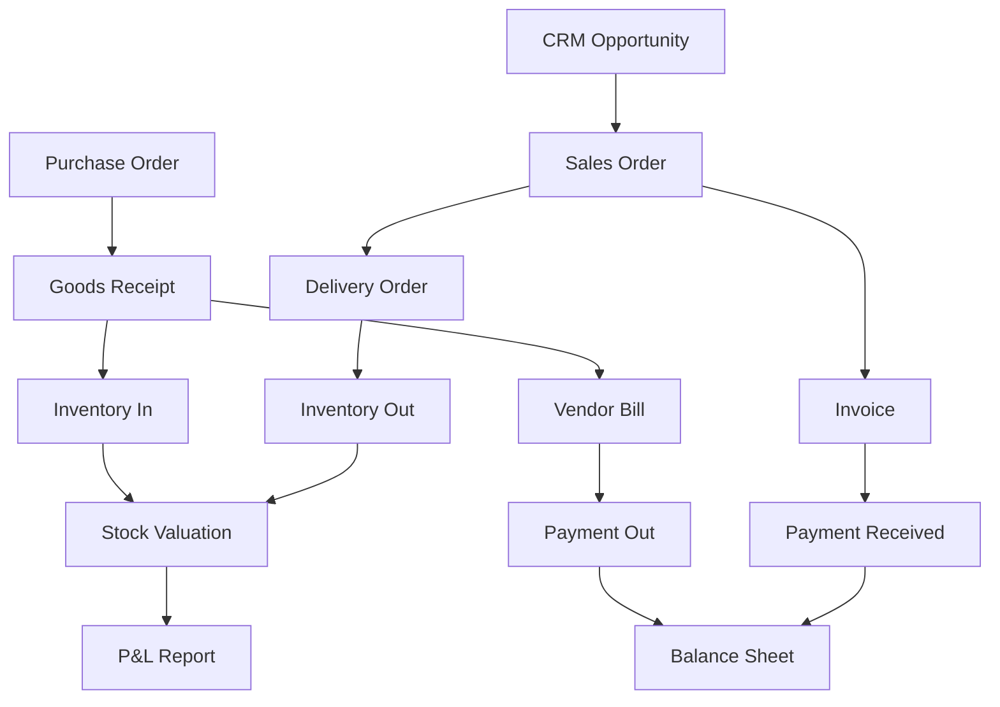
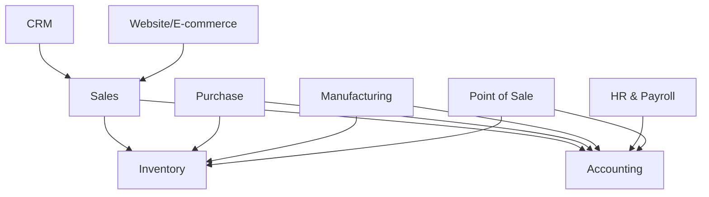

# ERP03 — Odoo

> **Domain:** ERP
> **Trạng thái:** ✅ Hoàn thành
> **Level:** Intermediate
> **Prerequisites:** ERP01 — ERP Fundamentals

---

## 1. Learning Objectives

Sau khi hoàn thành module này, học viên có thể:

- Phân biệt Odoo Community và Odoo Enterprise về tính năng và chi phí
- Mô tả các module chính của Odoo (Accounting, Sales, Purchase, Inventory, Manufacturing, HR, CRM, Website)
- Giải thích cách tiếp cận customization Odoo (Studio, custom modules, Python ORM)
- So sánh Odoo và SAP về phù hợp với từng quy mô doanh nghiệp
- Nhận diện hệ sinh thái Odoo tại Việt Nam (Viindoo, Koda, BESCO)
- Hiểu yêu cầu localization kế toán VAS cho Odoo tại Việt Nam

---

## 2. Business Context

Odoo là ERP mã nguồn mở (open-source) phổ biến nhất thế giới, được phát triển bởi Odoo S.A. (Bỉ) từ năm 2005 (ban đầu gọi là OpenERP, sau đổi thành Odoo năm 2014). Với mô hình open-source, Odoo phù hợp với:

- **Startup và SME:** Chi phí license thấp hơn SAP/Oracle nhiều lần
- **Doanh nghiệp cần tùy biến cao:** Có thể modify source code Python
- **Công ty Tech:** Có in-house developer để tự maintain

Tại Việt Nam, Odoo đang tăng trưởng mạnh trong phân khúc SME và mid-market (50-500 nhân viên) nhờ chi phí hợp lý và cộng đồng partner VN đông đảo.

---

## 3. Definitions

| Thuật ngữ | Định nghĩa |
|-----------|-----------|
| **Odoo Community** | Phiên bản mã nguồn mở, miễn phí, không có tất cả tính năng cao cấp |
| **Odoo Enterprise** | Phiên bản thương mại, trả phí/user/tháng, đầy đủ tính năng |
| **Odoo Studio** | Tool drag-and-drop để customize giao diện, fields, views không cần code |
| **Odoo Apps** | Các module chức năng (Sales, Inventory, Accounting...) |
| **Odoo.sh** | Hosting platform cloud chính thức của Odoo |
| **ORM** | Object-Relational Mapping — framework của Odoo để tương tác database |
| **XML-RPC / JSON-RPC** | API của Odoo để tích hợp bên ngoài |
| **Viindoo** | Công ty VN fork Odoo thành sản phẩm riêng với localization VN mạnh |
| **VAS Localization** | Tùy chỉnh Odoo Accounting theo chuẩn kế toán Việt Nam |
| **Odoo Partner** | Công ty được Odoo S.A. chứng nhận để triển khai Odoo |

---

## 4. Core Concepts

### 4.1 Odoo Community vs Enterprise

| Tính năng | Community | Enterprise |
|-----------|----------|-----------|
| Source code | Open (LGPL) | Proprietary add-ons |
| Giá | Miễn phí | ~$24-37/user/tháng |
| Odoo Studio | Không | Có |
| Mobile app | Có | Có (đầy đủ hơn) |
| IoT Box | Không | Có |
| E-commerce đầy đủ | Hạn chế | Có |
| Marketing Automation | Không | Có |
| Sign (e-signature) | Không | Có |
| Support chính thức | Community forum | Odoo S.A. support |
| Upgrade | Tự handle | Odoo migration service |

### 4.2 Các Module Odoo chính

| Module | Chức năng |
|--------|-----------|
| **Accounting** | Kế toán tài chính, hóa đơn, thanh toán, báo cáo |
| **Sales** | Báo giá, đơn bán hàng, hợp đồng bán |
| **Purchase** | Yêu cầu mua hàng, đơn mua hàng, RFQ |
| **Inventory** | Quản lý kho, nhập xuất, tồn kho, traceability |
| **Manufacturing** | Lệnh sản xuất, BOM, work orders, MRP |
| **Project** | Quản lý dự án, tasks, timesheets, Gantt |
| **HR & Payroll** | Nhân sự, chấm công, tính lương |
| **CRM** | Leads, opportunities, pipeline bán hàng |
| **Website** | CMS website, landing pages |
| **E-commerce** | Cửa hàng online tích hợp với Inventory/Accounting |
| **Helpdesk** | Ticket hỗ trợ khách hàng |
| **Field Service** | Dịch vụ kỹ thuật tại hiện trường |
| **Point of Sale** | Bán lẻ tại quầy |

### 4.3 Odoo Architecture

```
┌────────────────────────────────────────────────────────┐
│           Web Browser / Mobile App                     │
├────────────────────────────────────────────────────────┤
│         Odoo Web Framework (OWL - Odoo Web Library)    │
├────────────────────────────────────────────────────────┤
│          Odoo Server (Python / Werkzeug)               │
│  ┌────────┬────────┬────────┬────────┬───────────┐     │
│  │ Sales  │Inventory│Acctng │  Mfg  │    HR     │     │
│  └────────┴────────┴────────┴────────┴───────────┘     │
│              ORM Layer (Python Classes)                │
├────────────────────────────────────────────────────────┤
│           PostgreSQL Database                          │
└────────────────────────────────────────────────────────┘
```

---

## 5. Business Value

- **Chi phí thấp:** So với SAP, Odoo rẻ hơn 5-10 lần về license và implementation
- **Triển khai nhanh:** Odoo có thể go-live trong 4-12 tuần cho SME (SAP mất 12-24 tháng)
- **All-in-one:** Accounting, Sales, Inventory, HR, CRM, E-commerce — một hệ thống
- **Customizable:** Python/XML, dễ tìm developer hơn ABAP
- **Cộng đồng lớn:** 7 triệu+ users, marketplace với 40,000+ apps
- **Cloud và On-premise:** Linh hoạt lựa chọn deployment

---

## 6. Enterprise Role

Trong doanh nghiệp SME đến mid-market, Odoo đóng vai trò:
- **Hệ thống kế toán và quản lý tài chính:** Thay thế Excel và phần mềm kế toán đơn lẻ
- **Quản lý đơn hàng và khách hàng:** Từ báo giá đến hóa đơn
- **Quản lý kho và mua hàng:** Visibility tồn kho, tự động hóa mua hàng
- **Nền tảng thương mại điện tử:** Tích hợp website và cửa hàng online với backend
- **Quản lý nhân sự:** Onboarding, chấm công, tính lương

---

## 7. Departments Related

| Phòng ban | Module Odoo |
|-----------|------------|
| Kế toán | Accounting, Invoicing |
| Kinh doanh | Sales, CRM |
| Mua hàng | Purchase |
| Kho | Inventory |
| Sản xuất | Manufacturing, Quality |
| Nhân sự | Employees, Payroll, Time Off |
| IT/Digital | Website, E-commerce |
| Dịch vụ | Helpdesk, Field Service, Project |

---

## 8. Input

- Danh sách yêu cầu nghiệp vụ
- Danh mục sản phẩm/dịch vụ (product catalog)
- Danh sách khách hàng, nhà cung cấp
- Chart of accounts theo VAS
- Quy trình hiện tại cần cải thiện
- Yêu cầu báo cáo tùy chỉnh

---

## 9. Output

- Odoo system đã cấu hình và customize
- Dữ liệu master data đã import
- Hóa đơn điện tử tích hợp
- Custom reports và dashboards
- Tài liệu hướng dẫn người dùng
- Nhân viên đã được đào tạo

---

## 10. Business Process

### Quy trình bán hàng trong Odoo (Order-to-Cash)

```
1. CRM: Lead/Opportunity → Qualified
      ↓
2. Sales: Quotation (Báo giá) → Confirm → Sales Order
      ↓
3. Inventory: Delivery Order → Validate (Goods Issue)
      ↓
4. Accounting: Invoice → Send to Customer
      ↓
5. Accounting: Register Payment → Reconcile
```

### Quy trình mua hàng (Procure-to-Pay)

```
1. Inventory: Reorder Rule triggers automatically, OR
   Manual: Purchase → Request for Quotation
      ↓
2. Purchase: Confirm PO → Send to Vendor
      ↓
3. Inventory: Receive Products → Validate (Goods Receipt)
      ↓
4. Accounting: Vendor Bill → Register Payment
```

---

## 11. Data Flow



---

## 12. Money Flow

| Giao dịch | Odoo Action | Journal Entry |
|-----------|-----------|---------------|
| Bán hàng giao | Validate Delivery | Dr Inventory Out / Cr COGS |
| Xuất hóa đơn | Confirm Invoice | Dr AR / Cr Revenue |
| Thu tiền | Register Payment | Dr Bank / Cr AR |
| Nhận hàng mua | Validate Receipt | Dr Inventory / Cr Stock Input |
| Xác nhận hóa đơn mua | Confirm Vendor Bill | Dr Stock Input / Cr AP |
| Trả tiền nhà cung cấp | Register Payment | Dr AP / Cr Bank |

---

## 13. Document Flow

```
Báo giá (Quotation)
    ↓
Đơn hàng bán (Sales Order)
    ↓
Phiếu giao hàng (Delivery Order / DO)
    ↓
Hóa đơn bán (Customer Invoice) → Hóa đơn điện tử
    ↓
Phiếu thu (Payment)
    ↓
Bảng sao kê ngân hàng (Bank Statement)
```

---

## 14. Roles

| Vai trò | Mô tả |
|---------|-------|
| **Odoo Administrator** | Cấu hình hệ thống, quản lý users, install apps |
| **Odoo Developer** | Phát triển custom modules bằng Python/XML |
| **Functional Consultant** | Thiết kế quy trình, cấu hình modules, training |
| **Odoo Project Manager** | Quản lý dự án triển khai |
| **Key User** | Người dùng chính, test UAT, train đồng nghiệp |
| **Accountant/Finance** | Sử dụng Accounting module hàng ngày |
| **Sales Manager** | Sử dụng Sales, CRM |
| **Warehouse Manager** | Sử dụng Inventory |

---

## 15. Responsibilities

- **Administrator:** Install/uninstall apps, user access, system config
- **Developer:** Custom modules, ORM models, views, controllers, wizards
- **Functional Consultant:** Configure via Settings, mapping requirements, training
- **Key User:** Business test, UAT, validate outputs, train end users

---

## 16. RACI

| Hoạt động | Odoo PM | Functional Consultant | Developer | Key User | Admin |
|-----------|---------|----------------------|---------|---------|-------|
| Requirements gathering | C | R/A | I | R | I |
| System configuration | I | R/A | C | C | C |
| Module development | I | R (spec) | R/A | C | C |
| UAT Testing | C | C | C | R/A | I |
| User training | C | R/A | I | R | I |
| Go-live | A | R | C | C | R |

---

## 17. Frameworks

| Framework | Dùng cho |
|-----------|---------|
| **Agile/Scrum** | Phổ biến cho Odoo project do scope linh hoạt |
| **Odoo Implementation Methodology** | Hướng dẫn chính thức từ Odoo S.A. |
| **Viindoo Methodology** | Của Viindoo cho triển khai Odoo VN |
| **PMBOK** | Quản lý dự án tổng quát |

---

## 18. International Standards

- **IFRS:** Odoo Accounting hỗ trợ multi-currency, multi-company consolidation
- **VAS (Thông tư 200/133):** Cần localization module cho VN chart of accounts
- **PCI-DSS:** Odoo E-commerce với payment gateway phải tuân thủ
- **GDPR:** Odoo có Data Protection module (Enterprise)

---

## 19. Vietnam Context

### Odoo tại Việt Nam

**Odoo Partners chính thức tại VN:**

**Viindoo (Viện Đổi mới Doanh nghiệp):**
- Fork của Odoo Community với VN localization mạnh
- Tích hợp sẵn kế toán VAS, hóa đơn điện tử VNPT/MISA/Viettel
- Cộng đồng phát triển VN, tài liệu tiếng Việt
- Website: viindoo.com

**Koda (BESCO/Koda Group):**
- Odoo Gold Partner tại VN
- Triển khai nhiều dự án Odoo cho manufacturing, distribution
- Có practice riêng cho VN accounting localization

**OCA VN Community:**
- Cộng đồng developer VN đóng góp Odoo modules
- Modules VN: l10n_vn (Vietnamese accounting), hóa đơn điện tử

**Localization cần thiết cho VN:**
- Chart of accounts theo TT200/TT133
- Báo cáo tài chính theo mẫu Bộ Tài chính (B01-DN, B02-DN, B09-DN)
- Tích hợp hóa đơn điện tử (Nghị định 123/2020)
- Quyết toán lương theo quy định VN
- Báo cáo thuế VAT (bảng kê 01/GTGT, tờ khai VAT)
- Thuế TNCN (Personal Income Tax calculation)

**Sectors dùng Odoo nhiều tại VN:**
- Thương mại, phân phối (mid-size)
- Sản xuất vừa và nhỏ
- Công ty dịch vụ, tư vấn
- Startup có yêu cầu tùy biến cao

---

## 20. Legal Considerations

- **Kế toán VAS:** Phải localize chart of accounts theo TT200/TT133
- **Hóa đơn điện tử:** Module l10n_vn_edi hoặc tích hợp API với VNPT, MISA eSign
- **Báo cáo thuế:** Tùy chỉnh tax reports theo mẫu Cục thuế VN
- **Lương VN:** BHXH, BHYT, BHTN, thuế TNCN theo biểu thuế lũy tiến VN
- **Data privacy:** Nghị định 13/2023/NĐ-CP về bảo vệ dữ liệu cá nhân

---

## 21. Common Mistakes

1. **Dùng Community cho enterprise:** Thiếu nhiều tính năng quan trọng (Studio, full payroll)
2. **Hack core Odoo code:** Sửa trực tiếp source, khó upgrade lên version mới
3. **Cài quá nhiều third-party modules:** Conflict, performance issues, abandon ware
4. **Không đủ server capacity:** Odoo PostgreSQL cần đủ RAM và I/O
5. **Bỏ qua localization VN:** Mua Odoo Enterprise global nhưng không làm VAS localization
6. **Training không đủ:** Odoo giao diện thân thiện nhưng logic nghiệp vụ vẫn phức tạp
7. **Import dữ liệu không validate:** Import sai product template, sai opening balance
8. **Thiếu backup strategy:** Production crash, không có backup gần nhất
9. **Multi-company setup sai:** Intercompany transactions không được setup đúng
10. **Customization không document:** Developer nghỉ việc, không ai biết logic custom

---

## 22. Best Practices

1. **Stick to Odoo Enterprise + official localization:** Ổn định hơn community modules
2. **Use Studio for minor changes:** Tránh code cho những thay đổi UI nhỏ
3. **Custom modules trong separate addons:** Không chạm vào Odoo core
4. **Version control (Git) cho custom code:** Mọi developer phải commit code
5. **Staging environment:** Luôn test trên staging trước khi deploy production
6. **Database backup daily:** Odoo.sh có backup tự động; on-premise phải tự làm
7. **Performance monitoring:** Install Odoo debug tools, monitor PostgreSQL slow queries
8. **Module dependency management:** Document rõ dependency giữa custom modules
9. **Upgrade planning:** Odoo ra version mới hàng năm, lên kế hoạch upgrade
10. **Train super users kỹ:** Họ sẽ là first-line support cho đồng nghiệp

---

## 23. KPIs

| KPI | Mục tiêu |
|-----|---------|
| System response time | < 3 giây cho most actions |
| Uptime | > 99% |
| Bug resolution time | Critical < 4h, High < 1 ngày |
| User adoption rate | > 90% sau 1 tháng go-live |
| Invoice processing time | Giảm 70% so với manual |
| Inventory accuracy | > 98% |
| Month-end close time | Giảm 50% so với trước |

---

## 24. Metrics

- Số lượng custom modules
- Lines of code trong custom modules (complexity indicator)
- Số lượng open bugs theo severity
- Database size growth rate
- Average page load time
- Number of active users / licensed users

---

## 25. Reports

| Báo cáo | Module | Mô tả |
|---------|--------|-------|
| P&L (Lãi/Lỗ) | Accounting | Thu nhập, chi phí, lợi nhuận |
| Balance Sheet | Accounting | Tài sản, nợ phải trả, vốn chủ |
| Cash Flow Statement | Accounting | Dòng tiền hoạt động/đầu tư/tài chính |
| Aged Receivables | Accounting | Công nợ phải thu theo tuổi nợ |
| Inventory Valuation | Inventory | Giá trị tồn kho |
| Sales Analysis | Sales | Doanh thu theo sản phẩm/khách hàng |
| Purchase Analysis | Purchase | Chi phí mua theo nhà cung cấp |
| Payroll Summary | Payroll | Chi phí lương tháng |

---

## 26. Templates

### Odoo Implementation Timeline (SME - 3 modules)

```
Week 1-2:  Setup & Configuration (Accounting, basic settings)
Week 3-4:  Sales & Purchase setup, product catalog
Week 5-6:  Inventory setup, opening balances
Week 7-8:  Data import, testing
Week 9-10: UAT, training
Week 11:   Go-live preparation
Week 12:   Go-live + hypercare
```

---

## 27. Checklists

### Checklist Odoo Go-live

- [ ] VN localization đã được cài đặt và cấu hình
- [ ] Chart of accounts theo TT200/TT133 đúng
- [ ] Hóa đơn điện tử tích hợp và test thành công
- [ ] Opening balances đã được import và verify
- [ ] Sản phẩm (product catalog) đã import đầy đủ
- [ ] Khách hàng và nhà cung cấp đã import
- [ ] Users đã được tạo với đúng access rights
- [ ] Backup strategy đã được thiết lập
- [ ] Tất cả key users đã được train
- [ ] UAT sign-off từ phòng kế toán
- [ ] Tax configuration đúng cho từng loại hàng hóa/dịch vụ

---

## 28. SOP

### SOP: Quy trình tạo và gửi hóa đơn trong Odoo

**Bước 1:** Sales Order đã confirm → Odoo tự động đề xuất tạo Invoice

**Bước 2:** Kế toán vào Accounting → Customers → Invoices → tạo hoặc xem invoices từ SO

**Bước 3:** Kiểm tra thông tin: khách hàng, sản phẩm, số lượng, giá, thuế

**Bước 4:** Confirm Invoice → Odoo tạo journal entry tự động

**Bước 5:** Gửi qua email (Send & Print) hoặc xuất e-invoice qua connector

**Bước 6:** Khi nhận thanh toán: Register Payment → chọn ngân hàng/tiền mặt → số tiền → Apply

**Bước 7:** Bank Reconciliation: đối chiếu với sao kê ngân hàng import

---

## 29. Case Study

### Case Study: Công ty Phân phối thiết bị y tế — Odoo Enterprise tại VN

**Công ty:** 150 nhân viên, phân phối thiết bị y tế, có văn phòng tại 3 tỉnh

**Vấn đề:**
- 3 phần mềm riêng lẻ (MISA kế toán, Excel bán hàng, phần mềm kho riêng)
- Kiểm kê tồn kho không chính xác, thường xuyên thiếu hàng hoặc dư hàng
- Khó theo dõi hạn sử dụng thiết bị y tế (lot tracking)
- Báo cáo CEO phải tổng hợp thủ công

**Giải pháp:** Odoo Enterprise 16 (Accounting + Sales + Purchase + Inventory với lot/serial tracking)

**Partner triển khai:** Koda Vietnam

**Thời gian:** 4 tháng (phased: tháng 1-2 Finance, tháng 3-4 Sales/Inventory)

**Chi phí:** ~$18,000 USD (license + implementation)

**Kết quả:**
- Lot tracking cho 100% thiết bị có hạn sử dụng
- Kiểm kê định kỳ giảm từ 3 ngày → 4 giờ
- Hóa đơn điện tử tự động qua VNPT
- Dashboard real-time cho giám đốc

---

## 30. Small Business Example

### Cửa hàng bán lẻ 10 nhân viên — Odoo Community + POS

**Bối cảnh:** Cửa hàng điện máy tại Đà Nẵng, muốn quản lý tồn kho và POS

**Lựa chọn:** Odoo 17 Community (miễn phí) + Odoo POS

**Setup:** Point of Sale, Inventory, Invoicing cơ bản

**Chi phí:** 0 đồng license, chỉ trả hosting (~500k VND/tháng Odoo.sh hoặc tự host VPS)

**Kết quả:** Quản lý tồn kho real-time, in hóa đơn tại quầy, báo cáo doanh thu ngày

---

## 31. Enterprise Example

### Nhà máy Sản xuất 800 nhân viên — Odoo Enterprise Manufacturing

**Công ty:** Sản xuất bao bì nhựa tại Bình Dương

**Scope:** Manufacturing (MRP, Work Centers, BoM), Quality, Inventory, Accounting, HR

**Thách thức:** Production planning phức tạp với nhiều BoM cấp độ, tracking nguyên liệu theo lot

**Giải pháp:** Odoo Enterprise với custom Manufacturing module thêm công thức tính định mức nguyên liệu theo đặc thù ngành nhựa

**Kết quả:** MRP tự động, giảm 20% waste nguyên liệu, track được scrap rate theo từng máy

---

## 32. ERP Mapping

```
Odoo vs SAP Module Mapping:

Odoo Accounting    ↔  SAP FI (GL, AR, AP, AA)
Odoo Inventory     ↔  SAP MM (IM, WM)
Odoo Purchase      ↔  SAP MM (Purchasing)
Odoo Sales         ↔  SAP SD
Odoo Manufacturing ↔  SAP PP
Odoo Employees/Payroll ↔  SAP HCM
Odoo Project       ↔  SAP PS
Odoo CRM           ↔  SAP SD CRM / C4C
Odoo Quality       ↔  SAP QM
Odoo Maintenance   ↔  SAP PM
```

---

## 33. Automation

| Quy trình | Odoo Automation |
|-----------|----------------|
| Reorder rule | Tự động tạo PO khi tồn kho < min qty |
| Invoice reminder | Scheduled action gửi email nhắc nợ |
| Lead assignment | CRM rules tự động gán lead cho sales |
| Approval workflow | Odoo Approvals module |
| Report generation | Scheduled reports gửi email |
| Bank reconciliation | Auto-match bank statements |
| E-invoice sending | Trigger sau khi confirm invoice |

---

## 34. AI Opportunities

- **Odoo AI (v17+):** Tích hợp OpenAI API cho chatbot và email auto-reply trong helpdesk
- **Lead Scoring:** AI đánh giá lead quality trong CRM
- **Invoice Digitization:** AI đọc PDF/scan hóa đơn mua vào (OCR)
- **Demand Forecasting:** Custom ML model tích hợp qua external API
- **Smart Search:** Semantic search trong product catalog

---

## 35. Implementation Guide

### Giai đoạn 1: Analysis (1-2 tuần)
- Thu thập requirements
- Demo Odoo theo use cases thực tế của khách hàng
- Xác định custom development cần thiết

### Giai đoạn 2: Setup (1-2 tuần)
- Install Odoo (cloud/on-premise)
- Cài localization VN
- Cấu hình chart of accounts, tax, payment terms

### Giai đoạn 3: Configuration (2-6 tuần tùy scope)
- Cấu hình từng module
- Tạo product templates, warehouses, routes
- Custom development (nếu có)

### Giai đoạn 4: Data Migration (1-2 tuần)
- Import customers, vendors, products
- Import opening balances

### Giai đoạn 5: Testing & Training (1-2 tuần)
- UAT với key users
- Training all users

### Giai đoạn 6: Go-live
- Freeze old system, go-live mới
- Hypercare 2-4 tuần

---

## 36. Consulting Guide

**Câu hỏi chẩn đoán khi đề xuất Odoo:**

1. Quy mô công ty? Số nhân viên sẽ dùng ERP?
2. Ngành nghề? Có quy trình đặc thù không?
3. Đang dùng phần mềm gì? Có dữ liệu cần migrate không?
4. Ngân sách? Cần so sánh Community vs Enterprise
5. Có in-house IT/developer không? Họ có thể support sau go-live không?
6. Timeline go-live? Có deadline kinh doanh nào quan trọng không?
7. Tích hợp bên ngoài cần: hóa đơn điện tử, ngân hàng, sàn TMĐT?

**Khi nào KHÔNG nên đề xuất Odoo:**
- Doanh nghiệp > 2000 users, giao dịch cực lớn → SAP/Oracle
- Yêu cầu compliance phức tạp như ngân hàng, bảo hiểm → Core banking / SAP
- Đã đầu tư SAP ECC và chỉ muốn upgrade → SAP S/4HANA

---

## 37. Diagnostic Questions

1. Phần mềm hiện tại gây khó khăn nhất ở đâu: kế toán, kho, bán hàng hay nhân sự?
2. Bao nhiêu người sẽ dùng hệ thống mới? Số lượng users ảnh hưởng đến chi phí Enterprise.
3. Có website bán hàng online không? Cần tích hợp với hệ thống backend không?
4. Quy trình sản xuất có phức tạp (multi-level BoM, work centers) không?
5. Cần quản lý serial number hoặc lot tracking không?
6. Công ty có nhiều công ty con không? Cần multi-company không?
7. Đã từng thử ERP nào chưa? Vì sao không thành công?

---

## 38. Interview Questions

**Cho vị trí Odoo Functional Consultant:**

1. Sự khác nhau giữa Odoo Community và Enterprise? Khi nào đề xuất Community?
2. Quy trình Procure-to-Pay trong Odoo với các bước cụ thể?
3. Làm thế nào để configure VAS chart of accounts trong Odoo Accounting?
4. Odoo reorder rule là gì? Cấu hình như thế nào?
5. Khi cần thêm custom field vào form, bạn dùng Studio hay viết custom module? Khi nào dùng cái nào?
6. Batch picking trong Odoo Inventory là gì? Use case nào phù hợp?
7. Giải thích multi-company setup trong Odoo và intercompany transactions?

---

## 39. Exercises

**Bài tập 1 — Odoo Community vs Enterprise Decision:**
Cho 3 kịch bản khách hàng, quyết định Community hay Enterprise và giải thích:
a) Startup 15 người, ngân sách hạn chế, cần Accounting + Sales + Inventory
b) Công ty sản xuất 300 người, cần Manufacturing, Payroll, E-commerce
c) Công ty dịch vụ 80 người, cần Project + Helpdesk + HR

**Bài tập 2 — VN Localization Checklist:**
Liệt kê đầy đủ các bước localization cần thiết khi setup Odoo Accounting cho công ty VN.

**Bài tập 3 — Custom Module Design:**
Thiết kế (không code) một custom module Odoo để quản lý warranty (bảo hành) cho công ty bán thiết bị. Xác định: models, fields, views cần thiết.

**Bài tập 4 — Odoo vs SAP Comparison:**
Lập bảng so sánh chi tiết Odoo Enterprise vs SAP Business One cho công ty phân phối 200 nhân viên tại VN. Đưa ra recommendation.

---

## 40. References

- Odoo Documentation: docs.odoo.com
- Odoo Community: odoo.com/forum
- Odoo Apps Marketplace: apps.odoo.com
- Viindoo (VN Odoo): viindoo.com/docs
- OCA (Odoo Community Association): odoo-community.org
- GitHub Odoo Vietnam l10n: github.com/OCA/l10n-vietnam
- Thông tư 200/2014/TT-BTC — VAS Accounting Standards
- Nghị định 123/2020/NĐ-CP — E-Invoice regulations

---

## Output Formats

### Mermaid: Odoo Module Integration



### ASCII Diagram: Odoo Community vs Enterprise

```
ODOO EDITIONS COMPARISON
═══════════════════════════════════════
COMMUNITY (Free):          ENTERPRISE ($24+/user/month):
✓ Core Accounting          ✓ Everything in Community
✓ Sales & Purchase         ✓ Odoo Studio (drag-drop)
✓ Inventory                ✓ Full Manufacturing
✓ Basic Manufacturing      ✓ Full Payroll
✓ CRM                      ✓ Marketing Automation
✓ Project                  ✓ Sign (e-signature)
✓ HR (basic)               ✓ IoT Box
✗ Studio                   ✓ Odoo.sh hosting
✗ Full Payroll             ✓ Mobile offline
✗ Marketing Automation     ✓ Official support
```

### Flashcards

**Q1:** Sự khác nhau chính giữa Odoo Community và Enterprise là gì?
**A1:** Enterprise có Odoo Studio (kéo thả tùy biến), full Payroll module, Marketing Automation, IoT Box, Sign (chữ ký điện tử), và support chính thức từ Odoo S.A. Community miễn phí nhưng thiếu các tính năng này.

**Q2:** Tại sao không nên sửa trực tiếp Odoo core source code?
**A2:** Vì khi upgrade lên version mới (Odoo ra version mới hàng năm), các sửa đổi trong core sẽ bị conflict và mất. Thực hành đúng là tạo custom module riêng hoặc dùng inheritance để override, không chạm vào core.

**Q3:** Viindoo là gì và khác Odoo như thế nào?
**A3:** Viindoo là công ty VN fork Odoo Community thành sản phẩm riêng với Vietnamese localization tích hợp sẵn (VAS accounting, hóa đơn điện tử, bảo hiểm xã hội VN, tiếng Việt). Giá cạnh tranh hơn Odoo Enterprise cho thị trường VN.

### Cheat Sheet

```
ODOO QUICK REFERENCE
═══════════════════════════════════════
KEY MODULES:
Accounting | Sales | Purchase | Inventory
Manufacturing | HR & Payroll | CRM
Website | E-commerce | Helpdesk | Project

ODOO CUSTOMIZATION TOOLS:
Studio       = Drag-drop UI changes (no code)
Inherited View = XML override (developer)
Custom Module = Full Python/XML development
OCA Modules  = Community extra modules

VN LOCALIZATION CHECKLIST:
□ l10n_vn (Chart of accounts TT200)
□ E-invoice connector (VNPT/MISA/Viettel)
□ VN Tax reports (VAT, CIT)
□ VN Payroll (BHXH, BHYT, TNCN)
□ Vietnamese language pack

DEPLOYMENT OPTIONS:
Odoo.sh      = Official Odoo Cloud (~$24+/month)
Self-hosted  = VPS với Ubuntu + PostgreSQL
Viindoo Cloud = VN provider, tiếng Việt

ODOO vs SAP:
           Odoo          SAP S/4HANA
License    ~$24/user/mo  ~$150+/user/mo
Impl Time  1-6 months    12-24 months
Tech       Python/PG     ABAP/HANA
Best for   SME/Mid       Enterprise
```

### JSON Metadata

```json
{
  "module_code": "ERP03",
  "module_name": "Odoo",
  "domain": "ERP",
  "level": "Intermediate",
  "estimated_study_time_hours": 10,
  "prerequisites": ["ERP01"],
  "related_modules": ["ERP01", "ERP02", "ERP04"],
  "key_concepts": ["Odoo Community", "Odoo Enterprise", "Odoo Studio", "VAS Localization", "Python ORM", "Odoo ACTIVATE", "RICEF equivalent"],
  "erp_systems_covered": ["Odoo Community", "Odoo Enterprise", "Viindoo", "Koda"],
  "vietnam_context": true,
  "vietnam_partners": ["Viindoo", "Koda", "BESCO"],
  "last_updated": "2026-06-30",
  "tags": ["odoo", "open-source", "erp", "sme", "vietnam", "python", "accounting"]
}
```
