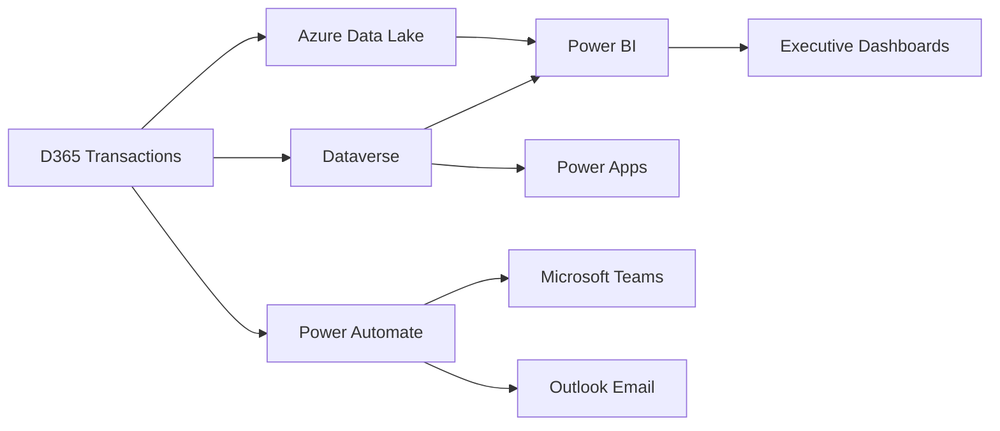
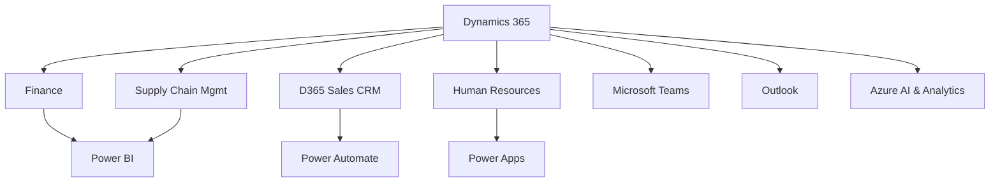

# ERP04 — Microsoft Dynamics 365

> **Domain:** ERP
> **Trạng thái:** ✅ Hoàn thành
> **Level:** Intermediate
> **Prerequisites:** ERP01 — ERP Fundamentals

---

## 1. Learning Objectives

Sau khi hoàn thành module này, học viên có thể:

- Phân biệt D365 Finance & Operations (F&O) và D365 Business Central (BC)
- Mô tả các module chính của D365 và ứng dụng kinh doanh
- Giải thích lợi thế hệ sinh thái Microsoft (Teams, Power BI, Power Automate, Azure)
- So sánh D365 với SAP và Odoo để đề xuất phù hợp theo quy mô
- Mô tả phương pháp triển khai Success by Design của Microsoft
- Nhận diện thị trường D365 tại Việt Nam và các Microsoft Partners

---

## 2. Business Context

Microsoft Dynamics 365 là bộ giải pháp ERP và CRM trên cloud của Microsoft, được ra mắt năm 2016 thay thế cho Dynamics AX, Dynamics NAV, và Dynamics CRM. Lợi thế lớn nhất của D365 là **tích hợp sâu với hệ sinh thái Microsoft**: Office 365, Teams, Power Platform, Azure, SharePoint — những công cụ mà đa phần doanh nghiệp đã sử dụng.

Tại Việt Nam, D365 đang tăng trưởng mạnh trong các tổ chức:
- Các công ty đa quốc gia (MNC) đã dùng Microsoft stack toàn cầu
- Doanh nghiệp Việt Nam muốn cloud ERP với chi phí thấp hơn SAP
- Tổ chức giáo dục, bán lẻ, dịch vụ tài chính đang digital transformation

---

## 3. Definitions

| Thuật ngữ | Định nghĩa |
|-----------|-----------|
| **D365 F&O** | Dynamics 365 Finance & Operations — ERP cho enterprise, thay thế Dynamics AX |
| **D365 BC** | Dynamics 365 Business Central — ERP cho SME, thay thế Dynamics NAV |
| **D365 Finance** | Phần Finance module tách riêng từ F&O |
| **D365 Supply Chain** | Phần Supply Chain Management tách riêng từ F&O |
| **Power Platform** | Bộ tool no-code/low-code: Power BI, Power Apps, Power Automate, Power Virtual Agents |
| **Power Automate** | Tool tạo workflow automation không cần code (giống Zapier) |
| **Power Apps** | Tool tạo ứng dụng mobile/web không cần code nhiều |
| **Dataverse** | Database cloud của Microsoft, nơi D365 lưu trữ dữ liệu |
| **Azure** | Nền tảng cloud của Microsoft, D365 chạy trên Azure |
| **Success by Design** | Phương pháp triển khai D365 chính thức của Microsoft |
| **ISV** | Independent Software Vendor — third-party developer tạo apps cho D365 |
| **AppSource** | Marketplace của Microsoft cho D365 apps và extensions |

---

## 4. Core Concepts

### 4.1 D365 Product Portfolio

```
DYNAMICS 365
├── ERP (Operations)
│   ├── D365 Finance & Operations (Enterprise)
│   │   ├── D365 Finance
│   │   ├── D365 Supply Chain Management
│   │   └── D365 Commerce
│   └── D365 Business Central (SME)
│
├── CRM (Customer Engagement)
│   ├── D365 Sales
│   ├── D365 Customer Service
│   ├── D365 Marketing
│   └── D365 Field Service
│
└── Cross-cutting
    ├── D365 Human Resources
    ├── D365 Project Operations
    └── D365 Customer Insights
```

### 4.2 D365 Finance & Operations vs Business Central

| Tiêu chí | D365 F&O | D365 Business Central |
|----------|---------|----------------------|
| Phân khúc | Enterprise (500+ users) | SME (2-500 users) |
| Chi phí/user/tháng | ~$180-300 | ~$70-100 |
| Công nghệ | Azure cloud, X++ code | AL language (extension) |
| Triển khai | 12-24 tháng | 3-9 tháng |
| Customization | X++ (phức tạp) | AL Extensions (dễ hơn) |
| Manufacturing | Đầy đủ (complex discrete/process) | Cơ bản |
| Multi-country | Rất mạnh | Hạn chế |
| Tích hợp Power BI | Native | Native |

### 4.3 Power Platform Integration

```
D365 ←→ Power Platform Ecosystem:

D365 Data → Power BI → Interactive Dashboards, Reports
D365 Data ← Power Apps → Custom Mobile/Web Apps
D365 Process ← Power Automate → Automated Workflows
D365 + Power Virtual Agents → Chatbots for Customer Service
D365 + Azure AI → Predictive Analytics, AI Insights
```

### 4.4 Microsoft Ecosystem Advantages

```
Microsoft 365 (Office)
    └── Teams → D365 embedded in Teams (approve POs in Teams chat)
    └── Outlook → D365 Sales Timeline in Outlook
    └── Excel → Export/Import D365 data seamlessly
    └── SharePoint → D365 document management

Azure
    └── Azure Active Directory → SSO với D365
    └── Azure Data Lake → Analytics và reporting
    └── Azure AI → Copilot, Predictive features
    └── Azure DevOps → D365 implementation CI/CD
```

---

## 5. Business Value

- **Familiar interface:** D365 trông giống Office 365, người dùng quen thuộc nhanh hơn
- **Microsoft stack leverage:** Doanh nghiệp đã trả tiền Microsoft 365, D365 là add-on tự nhiên
- **Power Platform synergy:** Tạo custom apps và automation không cần nhiều developer
- **Cloud-first:** Luôn up-to-date, Microsoft tự handle infrastructure
- **Copilot AI:** Microsoft nhúng AI (Copilot) khắp D365, giúp tự động hóa công việc routine
- **Global compliance:** Hỗ trợ 54+ countries với local regulatory requirements

---

## 6. Enterprise Role

- D365 F&O là **system of record** cho Finance, Supply Chain, Manufacturing ở enterprise
- D365 BC đóng vai trò **all-in-one ERP** cho SME thay thế phần mềm rời lẻ
- D365 Sales/Service/Marketing là **CRM layer** tích hợp chặt với ERP
- Power BI là **analytics và reporting layer** lấy data từ D365 và các nguồn khác
- Power Automate là **process automation layer** kết nối D365 với hàng trăm hệ thống khác

---

## 7. Departments Related

| Phòng ban | D365 Module |
|-----------|------------|
| Kế toán / Tài chính | D365 Finance (GL, AR, AP, Fixed Assets, Budgeting) |
| Mua hàng | D365 Supply Chain (Procurement) |
| Kho vận | D365 Supply Chain (Warehouse Management) |
| Sản xuất | D365 Supply Chain (Manufacturing) |
| Bán hàng | D365 Sales / D365 Commerce |
| HR | D365 Human Resources |
| IT / Dự án | D365 Project Operations |
| Marketing | D365 Marketing / Customer Insights |
| Dịch vụ khách hàng | D365 Customer Service / Field Service |

---

## 8. Input

- Yêu cầu chức năng (Functional Requirements)
- Danh sách integration với hệ thống Microsoft đang dùng
- Master data (chart of accounts, customers, vendors, items)
- Authorization matrix (Active Directory groups)
- Current business processes (As-Is)
- Reporting requirements

---

## 9. Output

- D365 system đã cấu hình và customize
- Power BI dashboards
- Power Automate flows (tự động hóa)
- Tài liệu hướng dẫn (user guide)
- Training recordings trong Teams
- Support documentation

---

## 10. Business Process

### Order-to-Cash trong D365

```
D365 Sales: Opportunity → Quote → Order
      ↓
D365 Supply Chain: Sales Order → Pick/Pack/Ship
      ↓
D365 Finance: Invoice → Post to GL
      ↓
Customer Pays → Bank Reconciliation
      ↓
D365 Finance: Cash Application → Clear AR
```

### Financial Close Process trong D365 Finance

```
Period Activities:
1. Post all transactions (AR, AP, GL)
2. Reconcile sub-ledgers (AR/AP aging)
3. Depreciation run (Fixed Assets)
4. Inventory cost revaluation
5. Intercompany eliminations
6. Financial reporting (P&L, Balance Sheet)
7. Period close → Open next period
```

---

## 11. Data Flow



---

## 12. Money Flow

| D365 Transaction | Finance Entry | Module |
|-----------------|---------------|--------|
| Sales Invoice Posted | Dr AR / Cr Revenue | Finance |
| Customer Payment | Dr Bank / Cr AR | Finance |
| Vendor Invoice | Dr Expense/Inventory / Cr AP | Finance |
| Vendor Payment | Dr AP / Cr Bank | Finance |
| Goods Receipt | Dr Inventory / Cr Accrual | Supply Chain + Finance |
| Depreciation | Dr Depreciation Exp / Cr Accum Depr | Finance |
| Payroll Posted | Dr Salary Expense / Cr AP Payroll | HR + Finance |

---

## 13. Document Flow

```
Sales Quotation → Sales Order → Packing Slip → Sales Invoice
Purchase Order → Product Receipt → Vendor Invoice → Payment Journal
General Journal → Posted Journal → Financial Report
Budget → Actual vs Budget Report
Expense Report → Approved Expense → Payment
```

---

## 14. Roles

| Vai trò | Trách nhiệm |
|---------|------------|
| **D365 System Administrator** | Environment management, security, upgrades |
| **D365 Functional Consultant** | Configuration, process design, training |
| **D365 Developer (X++ / AL)** | Custom development, extensions |
| **Power Platform Developer** | Power BI reports, Power Automate flows |
| **D365 Project Manager** | Triển khai dự án, timeline, budget |
| **Business Analyst** | Requirements, testing, UAT |
| **Finance Key User** | Test finance processes, train accountants |
| **IT Manager** | Azure infrastructure, security, networking |

---

## 15. Responsibilities

- **System Admin:** User management (AAD), security roles, environment provisioning
- **Functional Consultant:** Configure F&O/BC modules, BBP, testing coordination
- **Developer:** X++ extensions cho F&O hoặc AL extensions cho BC
- **Power Platform Dev:** Build Power BI dashboards, Power Automate approval flows
- **Key User:** UAT, train colleagues, first-line support

---

## 16. RACI

| Hoạt động | D365 PM | Func. Consultant | Developer | Power Platform Dev | Key User |
|-----------|---------|-----------------|---------|------------------|---------|
| Requirements | C | R/A | I | I | R |
| Configuration | I | R/A | C | C | C |
| Custom Dev | I | R (spec) | R/A | C | C |
| Power BI Design | I | C | I | R/A | C |
| UAT | C | C | C | C | R/A |
| Training | C | R/A | I | C | R |

---

## 17. Frameworks

| Framework | Dùng cho |
|-----------|---------|
| **Success by Design** | D365 implementation framework chính thức của Microsoft |
| **Microsoft FastTrack** | Chương trình triển khai nhanh cho D365 (Microsoft hỗ trợ trực tiếp) |
| **Sure Step** | Framework cũ của Microsoft (Dynamics AX/NAV era), ít dùng cho D365 |
| **PMBOK** | Project management |
| **Agile/Scrum** | Phổ biến cho D365 BC implementation |

### Success by Design Phases

```
Initiate → Implement → Prepare → Operate
   ↓            ↓          ↓          ↓
Scope &    Configuration  Go-live   Support &
Planning   + Testing      Prep      Optimize
```

---

## 18. International Standards

| Chuẩn | D365 Support |
|-------|-------------|
| **IFRS** | D365 Finance multi-ledger support |
| **US GAAP** | Natively supported |
| **VAS** | Cần VN localization extension |
| **GDPR** | Microsoft Compliance Manager |
| **SOX** | Audit trail, segregation of duties |
| **ISO 27001** | Microsoft Azure ISO certified |
| **PCI-DSS** | D365 Commerce payment processing |

---

## 19. Vietnam Context

### Microsoft D365 tại Việt Nam

**Thị trường D365 VN:**
D365 tăng trưởng mạnh tại VN từ 2019-nay, chủ yếu trong:
- Multinational companies (MNC) rolling out D365 globally, VN subsidiary included
- Retail chains (Thế Giới Di Động, Bách Hóa Xanh đang đánh giá)
- Financial services (bảo hiểm, chứng khoán)
- Manufacturing cho các công ty có parent dùng Microsoft

**Microsoft Partners tại VN triển khai D365:**
- **FPT Software:** Microsoft Gold Partner, có D365 F&O practice lớn
- **Netsmart:** Chuyên D365 Business Central cho SME VN
- **NavConsult:** D365 BC specialist
- **Seta International:** D365 partner focus manufacturing

**VN Localization D365:**
- **D365 Finance VN:** Cần localize chart of accounts theo TT200, báo cáo thuế VN
- **E-Invoice Integration:** Microsoft đã có connector cho VNPT, Viettel eInvoice
- **Vietnamese language pack:** Có sẵn, tuy nhiên một số thuật ngữ cần customize
- **VN Payroll:** Cần ISV solution hoặc custom module cho BHXH/TNCN VN

**Thách thức:**
- Chi phí license D365 F&O cao hơn Odoo, thấp hơn SAP
- Thiếu chuyên gia D365 F&O tại VN (demand > supply)
- VN localization chưa mạnh bằng SAP và Odoo/Viindoo
- Một số quy trình kế toán VN đặc thù cần customization

---

## 20. Legal Considerations

- **VAS Compliance:** D365 Finance cần custom chart of accounts và báo cáo tài chính theo mẫu BTC
- **E-Invoice (Nghị định 123/2020):** Integration với nhà cung cấp hóa đơn điện tử VN
- **Data Residency:** D365 trên Azure, data có thể lưu tại các Azure regions; cần check quy định data localization VN
- **GDPR / VN Data Protection:** Nghị định 13/2023/NĐ-CP, Microsoft có Data Processing Addendum
- **Audit Trail:** D365 có built-in audit log đáp ứng yêu cầu kiểm toán

---

## 21. Common Mistakes

1. **Chọn D365 F&O cho SME:** Quá phức tạp và đắt; nên dùng Business Central
2. **Không tận dụng Power Platform:** Triển khai D365 xong rồi không build Power BI, Power Automate
3. **Over-customization X++:** Nên dùng extensibility framework, không modify standard code
4. **Thiếu Azure expertise:** D365 là cloud product, cần team biết Azure
5. **Bỏ qua FastTrack:** Microsoft FastTrack cung cấp best practice miễn phí, nhiều project không dùng
6. **License complexity:** D365 có nhiều license type (Attach, Full, Team Member) — mua sai ảnh hưởng lớn đến budget
7. **Integration underestimated:** Kết nối D365 với legacy systems thường khó hơn dự kiến
8. **Power BI governance thiếu:** Data không chuẩn, nhiều reports khác nhau cho cùng một metric

---

## 22. Best Practices

1. **Tận dụng Microsoft Ecosystem:** Integrate với Teams, Outlook, Power BI ngay từ đầu
2. **Use Standard Extensions (AppSource):** Kiểm tra AppSource trước khi custom develop
3. **FastTrack for large projects:** Đăng ký Microsoft FastTrack cho project > $300K
4. **License optimization:** Dùng Team Member license cho approvers, Full license chỉ khi cần thiết
5. **Power Automate for approvals:** Không cần code phức tạp để làm approval workflow
6. **Azure DevOps cho deployment:** CI/CD pipeline cho D365 customizations
7. **Test with E2E scenarios:** Test business scenarios đầu-cuối, không chỉ test từng module
8. **Data migration early:** Bắt đầu data migration và cleansing sớm trong dự án
9. **Train on Power BI:** Key users phải biết tự làm báo cáo Power BI cơ bản
10. **Regular updates:** D365 được update tự động (7+8 updates/năm), có review release notes

---

## 23. KPIs

| KPI | Target |
|-----|--------|
| System Availability (Azure SLA) | 99.9% |
| User Adoption Rate | > 85% sau 3 tháng |
| Power BI Report Refresh Time | < 30 phút |
| Support Ticket Resolution | Critical < 4h |
| Budget Variance | < 15% |
| Go-live on-time | Đúng date ±2 tuần |
| Data Migration Accuracy | > 99.5% |

---

## 24. Metrics

- Số Power Apps tạo ra bởi business users (citizen developers)
- Số Power Automate flows active
- Power BI report views/week
- Azure consumption cost/month
- Number of ISV/AppSource apps installed
- Customization size (lines of X++/AL code)

---

## 25. Reports

| Báo cáo | D365 Module | Tool |
|---------|------------|------|
| Financial Statements | Finance | D365 built-in / Power BI |
| Cash Flow Forecast | Finance | D365 built-in |
| Accounts Receivable Aging | Finance | D365 built-in |
| Inventory Turnover | Supply Chain | Power BI |
| Sales Analysis | Sales | Power BI |
| Purchase Spend Analysis | Supply Chain | Power BI |
| Budget vs Actual | Finance | D365 built-in |
| HR Headcount Dashboard | HR | Power BI |

---

## 26. Templates

### D365 Success by Design Milestone Checklist

```
INITIATE PHASE:
□ Solution blueprint approved
□ Project team onboarded
□ Environments provisioned (DEV/UAT/PROD)
□ FastTrack enrollment (if applicable)

IMPLEMENT PHASE:
□ Fit-gap analysis complete
□ Configuration complete per module
□ Integration specs signed off
□ Custom development done and unit-tested

PREPARE PHASE:
□ UAT complete (>95% pass rate)
□ Performance testing done
□ Training complete (>90% coverage)
□ Data migration rehearsal done
□ Go-live checklist reviewed

OPERATE PHASE:
□ Hypercare team in place
□ Support tickets < 20 open critical
□ Users adopting system (>80%)
```

---

## 27. Checklists

### Checklist D365 Go-live

- [ ] Production environment provisioned và configured
- [ ] All customizations (X++/AL) deployed to PROD
- [ ] Data migration validated in PROD
- [ ] User accounts và security roles configured (Azure AAD)
- [ ] Integration với e-invoice tested end-to-end
- [ ] Power BI reports connected to PROD data
- [ ] Power Automate flows tested in PROD
- [ ] Training completed for all users
- [ ] UAT sign-off received
- [ ] Hypercare support plan ready
- [ ] Cutover plan reviewed và rehearsed
- [ ] Rollback plan documented

---

## 28. SOP

### SOP: D365 Change Management Process

**Bước 1 — Yêu cầu thay đổi:**
- Business user tạo Change Request (CR) với mô tả yêu cầu, business justification
- CR gửi cho Business Analyst để phân tích impact

**Bước 2 — Impact Analysis:**
- Functional consultant đánh giá: cấu hình hay custom development?
- Ước tính effort, testing scope
- Đề xuất solution design

**Bước 3 — Phê duyệt:**
- Change Advisory Board (CAB) review và phê duyệt
- Sign-off về effort và timeline

**Bước 4 — Development & Testing:**
- Developer implement trong DEV environment
- Unit test → Deploy to UAT → UAT testing

**Bước 5 — Production Deployment:**
- Lên lịch deployment window
- Deploy to PROD
- Smoke test trong PROD
- Notify users về thay đổi

---

## 29. Case Study

### Case Study: Công ty Bảo hiểm — D365 Finance tại VN

**Công ty:** Công ty bảo hiểm nhân thọ nước ngoài, VN subsidiary ~300 nhân viên

**Tình trạng trước:** Hệ thống báo cáo tài chính cũ (Oracle), manual reporting tốn nhiều ngày

**Lý do chọn D365:**
- Global HQ đang dùng D365 Finance
- Microsoft Teams đã được dùng toàn công ty
- Power BI nhu cầu cao từ Management

**Scope:** D365 Finance (GL, AR, AP, Fixed Assets, Budgeting) + Power BI dashboards

**Thách thức VN:** VAS localization, hóa đơn điện tử VNPT, báo cáo ODA (cho regulator)

**Kết quả:**
- Financial close từ 10 ngày → 3 ngày
- Management dashboard real-time trên Power BI
- CFO approve payments trong Teams app

---

## 30. Small Business Example

### Công ty Dịch vụ 80 nhân viên — D365 Business Central

**Bối cảnh:** Công ty tư vấn kỹ thuật, đang dùng Excel + MISA kế toán

**Lý do chọn D365 BC:**
- Công ty mẹ (Úc) đang dùng D365 BC
- Muốn Project tracking và timesheet

**Modules:** Finance, Sales, Project Management, HR (basic)

**Chi phí:** ~$100/user/tháng × 20 users = $2,000/tháng

**Kết quả:**
- Project profitability real-time
- Timesheet nhân viên qua mobile app
- Hóa đơn từ project tự động

---

## 31. Enterprise Example

### FPT Corporation — D365 F&O Rollout

FPT đã triển khai D365 F&O cho một số công ty thành viên, đặc biệt là FPT Software (đơn vị ~20,000+ nhân viên toàn cầu) để:
- Manage project financials (WBS, revenue recognition theo IFRS 15)
- Multi-currency AP/AR cho global business
- Intercompany transactions giữa các FPT entities
- D365 HR cho workforce management

---

## 32. ERP Mapping

```
D365 Finance & Operations ↔ SAP S/4HANA Modules:

D365 Finance         ↔  SAP FI/CO
D365 Supply Chain    ↔  SAP MM + SD + PP + WM
D365 Commerce        ↔  SAP SD + Hybris (Commerce)
D365 Manufacturing   ↔  SAP PP + QM
D365 HR             ↔  SAP HCM
D365 Project Ops     ↔  SAP PS
D365 Customer Insights ↔  SAP CX/C4C

D365 Business Central ↔ SAP Business One:
Both target SME market with simpler ERP
```

---

## 33. Automation

| Quy trình | D365 + Power Platform Tool |
|-----------|--------------------------|
| PO Approval workflow | Power Automate |
| Invoice auto-matching | D365 AI Invoice Processing |
| Expense claim approval | Power Automate + Teams |
| Sales quote notification | Power Automate |
| KPI alert to manager | Power BI Alerts |
| Bank reconciliation | D365 Bank Reconciliation AI |
| Collections email | D365 Collections module |
| Onboarding checklist | Power Apps + Dataverse |

---

## 34. AI Opportunities

- **Microsoft Copilot in D365:** Chat-based interface để query ERP data, create records
- **D365 Copilot for Finance:** Auto-draft follow-up emails for overdue invoices
- **D365 Copilot for Sales:** AI meeting summaries, next best action
- **AI-powered Cash Application:** Auto-match incoming payments
- **Demand Forecasting (Intelligent Order Management):** ML demand sensing
- **Power BI Copilot:** Natural language queries để tạo báo cáo ("Show me top 10 customers by revenue this quarter")

---

## 35. Implementation Guide

### Success by Design Framework

**Phase 1 — Initiate (4-6 tuần):**
- Solution architecture review
- Team onboarding
- Environment setup (DEV, TEST, PROD in Azure)
- FastTrack enrollment

**Phase 2 — Implement (12-20 tuần):**
- Configuration workshops (per module)
- Custom development sprints (Agile)
- Integration development
- Data migration preparation

**Phase 3 — Prepare (6-8 tuần):**
- UAT
- Performance testing
- End-user training
- Data migration cutover rehearsal

**Phase 4 — Operate (Post go-live):**
- Hypercare (4-8 tuần)
- Steady state operations
- Continuous enhancement sprints

---

## 36. Consulting Guide

**Khi đề xuất D365 cho khách hàng:**

1. Hỏi: Công ty đang dùng Microsoft 365 không? → Nếu có, D365 tích hợp tự nhiên
2. Hỏi: Global parent của họ dùng D365 không? → Rollout D365 từ HQ là lý do phổ biến
3. Hỏi: Quy mô: F&O cho > 250 users, BC cho < 250 users
4. Hỏi: Cloud-only hay hybrid? D365 là cloud-first
5. Kiểm tra: Đặc thù ngành có ISV solutions sẵn trên AppSource không?
6. Estimate: Power Platform adoption — họ có BI và automation needs?
7. VN context: Localization partner có kinh nghiệm không?

**D365 vs SAP vs Odoo Decision Matrix:**
- Microsoft ecosystem nặng → D365
- Manufacturing phức tạp, enterprise scale → SAP
- Budget thấp, SME, cần tùy biến nhanh → Odoo
- Cloud-first, already Office 365 → D365 BC (SME) hoặc D365 F&O (enterprise)

---

## 37. Diagnostic Questions

1. Công ty hiện đang dùng phần mềm Microsoft nào? (Office 365, Teams, Azure?)
2. Có phải subsidiary của MNC đang dùng D365 globally không?
3. Quy mô: bao nhiêu users cần ERP? Finance chỉ hay toàn công ty?
4. Có yêu cầu Power BI dashboards advanced không?
5. Có cần mobile app cho field staff không? (Power Apps use case)
6. Có yêu cầu cloud-only hay có thể hybrid/on-premise?
7. Budget so với SAP có competitive không?
8. IT team có Azure skills không?

---

## 38. Interview Questions

**Cho vị trí D365 Functional Consultant:**

1. Sự khác nhau giữa D365 Finance & Operations và D365 Business Central?
2. Khi nào dùng D365 F&O, khi nào dùng Business Central?
3. Giải thích Success by Design methodology với các phases?
4. Power Platform gồm những gì? Tích hợp thế nào với D365?
5. D365 Finance có mấy loại legal entities? Intercompany transactions hoạt động như thế nào?
6. Làm thế nào để setup multi-currency trong D365 Finance?
7. Sự khác nhau giữa customization X++ (F&O) và AL extensions (BC)?

---

## 39. Exercises

**Bài tập 1 — License Planning:**
Công ty 300 nhân viên, trong đó: 10 accountants (cần full access Finance), 50 approvers (chỉ cần approve PO/invoices), 240 general employees (chỉ cần submit expenses). Tính chi phí license D365 tháng/năm. So sánh với Odoo Enterprise.

**Bài tập 2 — Power Platform Use Cases:**
Cho 5 business problems phổ biến, đề xuất giải pháp bằng Power Platform (Power BI, Power Apps, Power Automate):
a) Manager cần dashboard doanh thu real-time
b) Nhân viên cần submit expense report từ mobile
c) PO cần approval từ nhiều cấp (multi-level approval)
d) Customer service cần chatbot hỗ trợ FAQ
e) Finance cần alert khi chi phí vượt ngân sách 10%

**Bài tập 3 — D365 vs SAP Comparison:**
Lập bảng so sánh D365 F&O vs SAP S/4HANA cho công ty sản xuất enterprise 1000 nhân viên tại VN. Đưa ra recommendation có giải thích.

**Bài tập 4 — VN Localization Requirements:**
Liệt kê tất cả VN localization requirements cần thiết khi triển khai D365 Finance tại VN. Ưu tiên theo mức độ quan trọng.

---

## 40. References

- Microsoft D365 Documentation: docs.microsoft.com/dynamics365
- Microsoft Learn D365: learn.microsoft.com
- D365 FastTrack: aka.ms/fasttrack
- Power Platform Documentation: docs.microsoft.com/power-platform
- AppSource Marketplace: appsource.microsoft.com
- D365 Community Forum: community.dynamics.com
- "Microsoft Dynamics 365 Finance & Operations" — Packt Publishing
- FPT Software D365 Practice: fpt-software.com/dynamics365
- Thông tư 200/2014/TT-BTC — VAS Accounting
- Nghị định 123/2020/NĐ-CP — E-Invoice

---

## Output Formats

### Mermaid: D365 Ecosystem Map



### ASCII Diagram: D365 vs SAP vs Odoo

```
SELECTION GUIDE: D365 vs SAP vs ODOO
══════════════════════════════════════════════════════
                D365 BC    D365 F&O    Odoo Ent    SAP S/4
Target         SME        Enterprise  SME/Mid     Enterprise
Users          2-250      100+        10-500      200+
License/user   $70-100    $180-300    $24-37      $150+
Impl months    3-9        12-24       1-6         12-24
Tech           AL (cloud) X++ (cloud) Python      ABAP
MS Integration ★★★★★     ★★★★★      ★★★        ★★★
Customizable   ★★★★       ★★★        ★★★★★      ★★★★
VN Localization ★★★       ★★★        ★★★★★      ★★★★
Manufacturing  ★★★        ★★★★★      ★★★★       ★★★★★
```

### Flashcards

**Q1:** D365 Finance & Operations và Business Central khác nhau thế nào?
**A1:** D365 F&O dành cho enterprise (500+ users), phức tạp, chi phí cao (~$180-300/user/tháng), code bằng X++. Business Central dành cho SME (2-250 users), đơn giản hơn, chi phí thấp hơn (~$70-100/user/tháng), code bằng AL.

**Q2:** Power Platform gồm những gì và tích hợp với D365 như thế nào?
**A2:** Power Platform = Power BI (analytics) + Power Apps (custom apps) + Power Automate (workflow) + Power Virtual Agents (chatbot). Tất cả dùng Dataverse — cùng nơi D365 lưu data — nên tích hợp liền mạch, không cần ETL phức tạp.

**Q3:** Microsoft Copilot trong D365 làm được gì?
**A3:** Copilot trong D365 cho phép: tạo đơn hàng/PO bằng chat, tóm tắt meeting và đề xuất bước tiếp theo (Sales), tự động draft email nhắc nợ (Finance), query dữ liệu bằng ngôn ngữ tự nhiên thay vì viết query.

### Cheat Sheet

```
MICROSOFT D365 CHEAT SHEET
═══════════════════════════════════════
EDITIONS:
D365 Business Central → SME, simple, quick
D365 Finance & Operations → Enterprise, complex
D365 Sales/Service → CRM layer (separate)
D365 Human Resources → HR module

POWER PLATFORM:
Power BI       = Analytics & Dashboards
Power Apps     = Custom Mobile/Web Apps
Power Automate = Workflow Automation
Power Pages    = External Portals

MICROSOFT ECOSYSTEM SYNERGY:
Teams  + D365 = Approve POs in Teams chat
Outlook + D365 = CRM timeline in Outlook
Excel  + D365 = Export/import data easily
Azure  + D365 = AI, Analytics, Security

SUCCESS BY DESIGN PHASES:
1. Initiate  2. Implement  3. Prepare  4. Operate

D365 KEY ADVANTAGES vs SAP:
✓ Microsoft ecosystem (Teams/Office)
✓ Power Platform (no-code automation)
✓ Lower cost than SAP
✓ Microsoft Copilot AI built-in
✓ Cloud-native, auto-updates
```

### JSON Metadata

```json
{
  "module_code": "ERP04",
  "module_name": "Microsoft Dynamics 365",
  "domain": "ERP",
  "level": "Intermediate",
  "estimated_study_time_hours": 10,
  "prerequisites": ["ERP01"],
  "related_modules": ["ERP01", "ERP02", "ERP03"],
  "key_concepts": ["D365 F&O", "D365 Business Central", "Power Platform", "Power BI", "Power Automate", "Success by Design", "FastTrack", "Microsoft Copilot", "Azure"],
  "erp_systems_covered": ["D365 Finance & Operations", "D365 Business Central", "D365 Sales", "D365 HR"],
  "vietnam_context": true,
  "vietnam_partners": ["FPT Software", "Netsmart", "NavConsult"],
  "last_updated": "2026-06-30",
  "tags": ["dynamics365", "microsoft", "erp", "power-platform", "cloud", "d365"]
}
```
