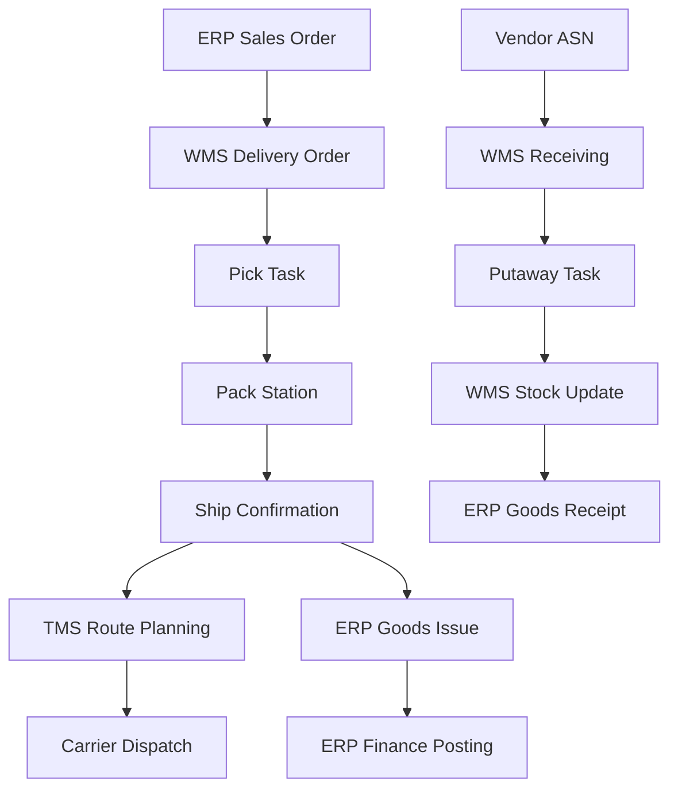
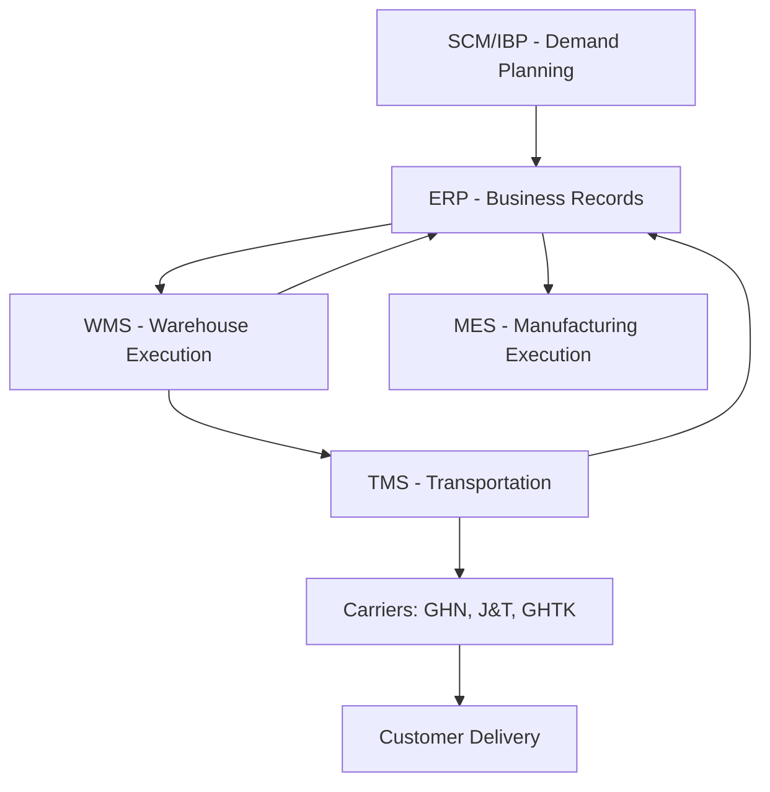

# ERP05 — SCM & WMS Systems

> **Domain:** ERP
> **Trạng thái:** ✅ Hoàn thành
> **Level:** Intermediate
> **Prerequisites:** ERP01 — ERP Fundamentals

---

## 1. Learning Objectives

Sau khi hoàn thành module này, học viên có thể:

- Phân biệt SCM, WMS, TMS và mối quan hệ với ERP
- Mô tả landscape phần mềm SCM (SAP SCM/IBP, Oracle SCM, Blue Yonder, o9)
- Giải thích các chức năng của WMS (Warehouse Management System)
- So sánh WMS enterprise (SAP EWM, Manhattan) và WMS local VN (KiotViet, Tanca)
- Mô tả TMS và vai trò trong logistics
- Thiết kế kiến trúc tích hợp ERP → WMS → TMS → MES
- Nhận diện xu hướng SCM/WMS trong thương mại điện tử tại Việt Nam

---

## 2. Business Context

Trong thời đại thương mại điện tử bùng nổ và chuỗi cung ứng toàn cầu, SCM (Supply Chain Management) và WMS (Warehouse Management System) trở thành các hệ thống then chốt. Chỉ riêng ERP không đủ để quản lý chi tiết kho hàng phức tạp hoặc tối ưu hóa chuỗi cung ứng. Cần các hệ thống chuyên biệt:

- **SCM:** Lập kế hoạch chuỗi cung ứng (demand planning, supply planning, S&OP)
- **WMS:** Quản lý chi tiết hoạt động kho (slotting, picking, packing, shipping)
- **TMS:** Quản lý vận chuyển (carrier selection, route optimization, freight tracking)

Tại Việt Nam, sự bùng nổ của TMĐT (Shopee, Lazada, TikTok Shop) và 3PL logistics thúc đẩy nhu cầu WMS và TMS tăng mạnh.

---

## 3. Definitions

| Thuật ngữ | Định nghĩa |
|-----------|-----------|
| **SCM** | Supply Chain Management — quản lý toàn bộ chuỗi từ nguyên liệu đến tay người tiêu dùng |
| **WMS** | Warehouse Management System — phần mềm quản lý chi tiết hoạt động kho |
| **TMS** | Transportation Management System — quản lý vận tải, lộ trình, nhà vận chuyển |
| **MES** | Manufacturing Execution System — quản lý thực thi sản xuất tại dây chuyền |
| **Demand Planning** | Dự báo nhu cầu để lên kế hoạch sản xuất và tồn kho |
| **S&OP** | Sales & Operations Planning — quy trình đồng bộ kế hoạch bán hàng và vận hành |
| **IBP** | Integrated Business Planning — thế hệ S&OP mới hơn, dùng dữ liệu real-time |
| **3PL** | Third-Party Logistics — công ty logistics thuê ngoài (GIAO HANG NHANH, J&T, Ninja Van) |
| **SKU** | Stock Keeping Unit — đơn vị quản lý hàng hóa trong kho |
| **Slotting** | Bố trí vị trí hàng hóa trong kho để tối ưu picking |
| **Putaway** | Quy trình xếp hàng nhập kho vào vị trí phù hợp |
| **Cycle Count** | Kiểm kê định kỳ theo vùng/loại hàng, thay thế kiểm kê toàn kho |
| **Cross-docking** | Hàng nhập về được chuyển thẳng ra xe giao, không lưu kho |

---

## 4. Core Concepts

### 4.1 Phân cấp hệ thống chuỗi cung ứng

```
STRATEGIC (dài hạn)
└── Network Design (thiết kế mạng lưới nhà máy/kho)

TACTICAL (trung hạn)
└── S&OP / IBP (6-18 tháng)
    ├── Demand Planning (dự báo nhu cầu)
    └── Supply Planning (lập kế hoạch nguồn cung)

OPERATIONAL (ngắn hạn)
├── Production Scheduling (lịch sản xuất)
├── Inventory Replenishment (bổ sung tồn kho)
└── Order Fulfillment

EXECUTION (real-time)
├── WMS (chi tiết kho)
├── TMS (vận tải)
└── MES (sản xuất)
```

### 4.2 SCM Software Landscape

| Phân khúc | Phần mềm |
|-----------|---------|
| **Enterprise SCM/IBP** | SAP IBP, Oracle SCM Cloud, Blue Yonder (JDA), o9 Solutions, Kinaxis |
| **Mid-market SCM** | Infor Nexus, E2open, Logility |
| **WMS Enterprise** | SAP EWM, Manhattan Associates WM, Blue Yonder WM, Infor WMS |
| **WMS Mid-market** | SnapFulfil, 3PL Central, Fishbowl |
| **WMS SME (VN)** | KiotViet, Tanca, MISA eCommerce |
| **TMS Enterprise** | SAP TM, Oracle TMS, MercuryGate |
| **TMS VN** | Abivin vRoute, GHN Express API, VNPT Logistics |

### 4.3 WMS Core Functions

```
Inbound (Nhập kho):
  Advance Shipping Notice (ASN) → Receiving → Putaway
  ├── Barcode/RFID scanning
  ├── Quality inspection
  └── License plate tracking

Storage Management:
  ├── Slotting optimization
  ├── Bin/Location management
  └── Inventory visibility (real-time)

Outbound (Xuất kho):
  Order → Wave Planning → Pick → Pack → Ship
  ├── Pick strategies (wave, batch, zone, cluster)
  ├── Pack verification
  └── Shipping label / carrier integration

Cross-functional:
  ├── Cycle counting
  ├── Replenishment
  └── Returns (reverse logistics)
```

### 4.4 Integration Architecture

```
┌─────────────────────────────────────────────────────┐
│                    ERP (SAP / D365 / Odoo)          │
│  Master Data: Products, Vendors, Customers           │
│  Business: PO, SO, Financials                       │
└──────────────────────┬──────────────────────────────┘
                       │ API/EDI
         ┌─────────────┴──────────────┐
         ↓                            ↓
┌────────────────┐          ┌────────────────┐
│      WMS       │ ←──────→ │      TMS       │
│ Warehouse ops  │  Orders  │ Transportation │
│ Picking,Packing│  Shipments│ Route Opt.    │
└────────────────┘          └────────────────┘
         │                            │
         ↓                            ↓
┌────────────────┐          ┌────────────────┐
│      MES       │          │   Carrier      │
│ Shop floor     │          │ (GHN, J&T...)  │
│ execution      │          └────────────────┘
└────────────────┘
```

---

## 5. Business Value

**WMS:**
- Tăng pick accuracy: 99.5%+ (so với 95-97% thủ công)
- Giảm thời gian nhận hàng: 50-70%
- Tối ưu không gian kho: 15-25% space utilization tốt hơn
- Real-time inventory visibility → giảm inventory write-offs

**SCM/IBP:**
- Tăng forecast accuracy: 20-40%
- Giảm inventory 15-30% trong khi vẫn maintain service level
- Giảm stockout: 20-50%
- Tối ưu hóa supply chain cost tổng thể

**TMS:**
- Giảm freight cost: 8-15% qua route optimization và carrier consolidation
- Improve on-time delivery
- Visibility cho customers (tracking)

---

## 6. Enterprise Role

- **SCM** đóng vai trò **bộ não chiến lược** của chuỗi cung ứng — quyết định sản xuất bao nhiêu, khi nào, tại đâu
- **WMS** là **bộ não thực thi kho** — điều phối từng movement của hàng hóa trong kho
- **TMS** là **bộ não vận tải** — tối ưu hóa chi phí và tốc độ giao hàng
- **ERP** là **backbone tài chính** — ghi nhận value của inventory, cost of goods

---

## 7. Departments Related

| Phòng ban | Hệ thống sử dụng |
|-----------|----------------|
| Supply Chain / Demand Planning | SCM, IBP |
| Kho vận / Warehouse | WMS |
| Logistics / Transportation | TMS |
| Mua hàng / Procurement | ERP (MM/Purchase) + SCM |
| Kinh doanh / Sales | ERP (SD/Sales) + SCM (forecast) |
| Sản xuất | MES + SCM (production planning) |
| Tài chính | ERP FI/CO (inventory valuation) |
| IT | Integration architecture |

---

## 8. Input

- Đơn hàng bán (Sales Orders từ ERP)
- Đơn mua hàng (POs từ ERP)
- Lịch nhận hàng (ASN từ vendors)
- Lịch giao hàng (shipment requests)
- Thông tin hàng hóa (weight, dimension, hazmat classification)
- Quy tắc kho (putaway rules, pick strategies)
- Forecast dữ liệu bán hàng

---

## 9. Output

- Xác nhận nhập kho (GR confirmation → ERP)
- Xác nhận xuất kho (GI confirmation → ERP)
- Tình trạng tồn kho real-time
- Lịch vận chuyển và tracking
- Báo cáo hiệu suất kho (KPIs)
- Vận đơn (waybill / Bill of Lading)

---

## 10. Business Process

### Quy trình Inbound (Nhập kho) trong WMS

```
1. Nhận ASN từ vendor/ERP
2. Cổng kho: Kiểm tra xe, xác nhận lô hàng
3. Tạo Receiving Order trong WMS
4. Dỡ hàng và quét barcode/RFID
5. Quality Check (nếu yêu cầu)
6. WMS tính toán Putaway path (slot tối ưu)
7. Nhân viên kho thực hiện Putaway theo chỉ dẫn
8. Cập nhật inventory record trong WMS
9. Gửi GR (Goods Receipt) confirmation về ERP
10. ERP cập nhật AP (Invoice Verification)
```

### Quy trình Outbound (Xuất kho, giao hàng)

```
1. ERP gửi Sales Order / Delivery Order sang WMS
2. WMS tạo Wave (nhóm các orders)
3. WMS tạo Pick List cho từng nhân viên
4. Nhân viên Picking theo chỉ dẫn WRF/HHT
5. Packing tại packing station
6. Kiểm tra trọng lượng (weight check)
7. In shipping label
8. TMS tính route, assign carrier
9. Staging area → Load lên xe
10. Gửi Ship Confirmation về ERP, update tracking
```

---

## 11. Data Flow



---

## 12. Money Flow

| Hoạt động | Tác động tài chính |
|-----------|-------------------|
| Goods Receipt (WMS → ERP) | Tăng inventory value (debit), tăng liability AP (credit) |
| Goods Issue - Sales (WMS → ERP) | Giảm inventory (credit), tăng COGS (debit) |
| Goods Issue - Scrap | Giảm inventory, ghi nhận loss |
| Freight cost (TMS → ERP) | Tăng freight expense hoặc landed cost |
| Inventory write-down | Giảm inventory value, ghi nhận loss |
| 3PL fulfillment fees | Operational cost từ WMS pick/pack |

---

## 13. Document Flow

```
Vendor → ASN (Advance Shipping Notice) → WMS Receiving → ERP GR

ERP Sales Order → WMS Delivery Order → Pick List → Packing List
    → Shipping Label → Bill of Lading / Waybill → POD (Proof of Delivery)

WMS Cycle Count → Count Results → Inventory Adjustment → ERP Inventory Posting

TMS → Freight Invoice → ERP AP Processing → Payment
```

---

## 14. Roles

| Vai trò | Mô tả |
|---------|-------|
| **Warehouse Manager** | Quản lý tổng thể hoạt động kho, KPI |
| **Receiving Supervisor** | Giám sát nhập kho, chất lượng hàng nhập |
| **Picking/Packing Supervisor** | Giám sát xuất kho, accuracy |
| **Inventory Controller** | Kiểm kê, điều chỉnh tồn kho, báo cáo |
| **WMS System Administrator** | Config WMS, user management, master data |
| **SCM Planner** | Demand planning, replenishment planning |
| **Logistics Coordinator** | Điều phối vận chuyển, TMS |
| **3PL Account Manager** | Quản lý quan hệ với nhà cung cấp logistics |

---

## 15. Responsibilities

- **Warehouse Manager:** KPI kho, safety, staffing, system health
- **SCM Planner:** Demand forecast, inventory target setting, reorder point
- **WMS Admin:** Master data kho (locations, zones, rules), user training
- **Logistics Coordinator:** Book carriers, track shipments, resolve delays
- **Inventory Controller:** Daily cycle counts, variance investigation, reporting

---

## 16. RACI

| Hoạt động | Warehouse Manager | SCM Planner | WMS Admin | Inventory Controller | Logistics |
|-----------|-----------------|-------------|---------|---------------------|---------|
| Putaway rules setup | A | C | R | C | I |
| Demand forecast | I | R/A | I | C | I |
| Carrier selection | I | I | I | I | R/A |
| Inventory adjustment | A | C | I | R | I |
| KPI reporting | R/A | C | C | R | C |
| WMS configuration | A | I | R | C | I |

---

## 17. Frameworks

| Framework | Áp dụng |
|-----------|---------|
| **SCOR Model (Supply Chain Operations Reference)** | Đánh giá và thiết kế quy trình chuỗi cung ứng |
| **S&OP / IBP Process** | Quy trình lập kế hoạch tích hợp kinh doanh |
| **Lean Warehousing** | Giảm lãng phí trong hoạt động kho |
| **RFID / GS1 Standards** | Chuẩn barcode và RFID trong WMS |
| **VNA (Very Narrow Aisle)** | Thiết kế kho sử dụng xe nâng VNA |
| **APICS CSCP** | Chứng chỉ chuyên gia Supply Chain |
| **Gartner Supply Chain Top 25** | Benchmark supply chain excellence |

---

## 18. International Standards

| Chuẩn | Liên quan |
|-------|---------|
| **GS1 (Barcode/RFID)** | Product identification trong WMS |
| **ISO 28000** | Supply Chain Security Management |
| **ISO 9001** | Quality management trong warehouse |
| **CTPAT** | Customs-Trade Partnership Against Terrorism (cho xuất khẩu US) |
| **EDI (Electronic Data Interchange)** | Trao đổi dữ liệu với partners (ASN, PO) |
| **AS2/SFTP/API** | Phương thức kết nối trong supply chain |

---

## 19. Vietnam Context

### Thị trường WMS/SCM tại Việt Nam

**WMS cho Enterprise:**
- **SAP EWM:** Các công ty lớn đã có SAP (Samsung VN, Unilever VN)
- **Manhattan Associates:** Một số retailer lớn, 3PL
- **Infor WMS:** Công ty logistics quốc tế hoạt động tại VN

**WMS cho SME/Mid-market VN:**
- **KiotViet:** Phổ biến cho bán lẻ, tạp hóa, nhà hàng; tích hợp POS
- **Tanca:** HRM + WMS cho SME
- **MISA eCommerce:** Quản lý kho cho TMĐT
- **Sapo:** Giải pháp omnichannel bán hàng + quản lý kho

**TMS tại VN:**
- **Abivin vRoute:** Startup VN về route optimization cho last-mile delivery
- **GHN, GIAO HANG TIET KIEM, J&T:** Cung cấp API tracking cho merchants
- **Ninja Van, Lazada Logistics:** Regional 3PL có TMS riêng

**Xu hướng WMS/SCM tại VN:**
1. **TMĐT WMS:** Sự bùng nổ của Shopee/Lazada/TikTok Shop đòi hỏi WMS nhanh, tích hợp multi-channel
2. **3PL Fulfillment:** Các công ty thuê ngoài kho (outsource to GHTK, Ninja Van Fulfillment)
3. **Cold chain logistics:** Nhu cầu quản lý kho lạnh cho thực phẩm, dược phẩm tăng
4. **Last-mile optimization:** Abivin, các công ty logistics tập trung route optimization
5. **Automation kho:** Robot kho (Goods-to-Person), conveyor belt đang được triển khai tại kho của Shopee, TH True Milk

**Thách thức:**
- Địa hình VN phức tạp (36 tỉnh thành, giao thông hạn chế vùng nông thôn)
- Thiếu địa chỉ chuẩn hóa (gây khó khăn TMS)
- Nhân lực kho đang thiếu, chi phí tăng → xu hướng automation
- Hạ tầng kho lạnh thiếu

---

## 20. Legal Considerations

- **Hải quan điện tử (VNACCS):** Kết nối WMS với hệ thống hải quan điện tử cho hàng xuất nhập khẩu
- **Kiểm dịch thực vật:** WMS phải track quarantine status cho hàng nông sản
- **Dược phẩm:** WMS cho kho dược phẩm cần đáp ứng GDP (Good Distribution Practice), FEFO (First Expired First Out)
- **Hóa chất nguy hiểm:** WMS cần flagging và separation rules cho dangerous goods
- **Phòng cháy chữa cháy:** Tiêu chuẩn PCCC cho kho hàng (Nghị định 136/2020/NĐ-CP)
- **Bảo hiểm hàng hóa:** WMS cần ghi nhận incident reports cho bảo hiểm

---

## 21. Common Mistakes

1. **Coi WMS chỉ là "phần mềm nhập xuất kho":** WMS thực ra là optimization engine cho toàn bộ warehouse operations
2. **Không làm slotting optimization:** Hàng bán chạy đặt xa lối đi, giảm pick efficiency
3. **Master data kho kém:** Dimensions sản phẩm sai → conveyor belt jam, pallet không vừa
4. **Thiếu Wi-Fi coverage trong kho:** WRF handhelds mất kết nối, nhân viên phải chạy ra ngoài để sync
5. **Không tích hợp WMS → ERP chặt chẽ:** Inventory discrepancy giữa WMS và ERP
6. **Bỏ qua returns process:** Hàng trả về không được xử lý đúng cách trong WMS
7. **Không train Warehouse Manager về system:** Manager phụ thuộc 100% vào IT
8. **Chọn WMS quá phức tạp cho quy mô doanh nghiệp:** Over-engineered solution
9. **Thiếu cycle count process:** Chỉ kiểm kê năm/quý, inventory drift lớn
10. **Không có fallback manual process:** WMS down, cả kho tê liệt

---

## 22. Best Practices

1. **Demand-driven replenishment:** WMS tự động trigger replenishment dựa trên min/max levels
2. **ABC Analysis cho slotting:** Hàng A (bán nhiều) gần cổng xuất, hàng C xa
3. **FEFO/FIFO enforcement:** WMS enforce first expired / first in first out tự động
4. **Barcode mọi vị trí kho:** Mọi bin location phải có barcode để scan
5. **Cycle counting thay vì full stocktake:** Đếm 100% inventory theo rolling schedule (20% mỗi tuần)
6. **Bi-directional ERP integration:** Real-time sync, không batch
7. **KPI dashboard cho Warehouse Manager:** Pick rate, putaway rate, accuracy, fill rate
8. **Simulate before go-live:** Test WMS với volume dữ liệu thực tế, không chỉ test với 10 items
9. **Document all warehouse processes:** Bao gồm cả quy trình thủ công khi system down
10. **Regular slotting review:** Re-slot định kỳ khi mix hàng thay đổi

---

## 23. KPIs

| KPI | Benchmark tốt |
|-----|--------------|
| Pick Accuracy | > 99.5% |
| On-Time Shipment Rate | > 98% |
| Receiving Cycle Time | < 2 giờ/lô hàng |
| Putaway Time | < 1 giờ sau nhận hàng |
| Order Fulfillment Cycle Time | < 24h (B2C), < 48h (B2B) |
| Inventory Accuracy | > 99% |
| Dock-to-Stock Time | < 4 giờ |
| Labor Utilization | > 85% |
| Demand Forecast Accuracy (MAPE) | < 20% |
| Inventory Turnover | Theo ngành (FMCG: 12-24x/năm) |

---

## 24. Metrics

- **Lines picked per hour:** Năng suất nhân viên picking
- **Cost per order shipped:** Tổng chi phí kho / số đơn hàng
- **Space utilization:** % diện tích kho được sử dụng
- **Carrier on-time performance:** % shipments đúng ngày hẹn
- **Return rate:** % đơn hàng bị trả về
- **Damage rate:** % hàng hóa bị hỏng trong kho
- **Dead stock %:** % hàng không có movement trong 90 ngày

---

## 25. Reports

| Báo cáo | Hệ thống | Tần suất |
|---------|---------|---------|
| Tồn kho theo location | WMS | Real-time |
| Báo cáo nhập xuất ngày | WMS | Hàng ngày |
| Aging tồn kho | WMS/ERP | Hàng tuần |
| Pick accuracy report | WMS | Hàng ngày |
| Carrier performance | TMS | Hàng tuần |
| Inventory valuation | ERP | Hàng tháng |
| Demand vs actual | SCM | Hàng tháng |
| Slotting efficiency | WMS | Hàng quý |

---

## 26. Templates

### WMS Selection Criteria Scorecard

```
| Tiêu chí                    | Trọng số | SAP EWM | Manhattan | KiotViet |
|-----------------------------|---------|---------|-----------|---------|
| Functional completeness     | 25%     |   10    |    10     |    6    |
| ERP Integration (SAP/Odoo)  | 20%     |   10    |     8     |    5    |
| Implementation cost         | 20%     |    4    |     5     |   10    |
| VN localization             | 15%     |    7    |     5     |   10    |
| Scalability                 | 10%     |   10    |    10     |    6    |
| Mobile/RF support           | 10%     |   10    |    10     |    7    |
| TỔNG                        | 100%    |  7.95   |   7.95    |   7.3   |
```

---

## 27. Checklists

### Checklist WMS Go-live Readiness

- [ ] Tất cả bin locations đã được setup và barcode dán
- [ ] RF handheld terminals đã được test Wi-Fi trong toàn kho
- [ ] Product master data (dimensions, weight) đã verify
- [ ] Putaway rules đã được configure và test
- [ ] Pick strategies đã configure (wave, batch, zone)
- [ ] ERP integration đã test end-to-end (GR, GI)
- [ ] TMS integration đã test (shipment creation, tracking)
- [ ] Nhân viên kho đã được training (tối thiểu 2 ngày)
- [ ] Opening inventory đã được counted và loaded
- [ ] Fallback manual SOP đã có (khi WMS down)
- [ ] KPI dashboard đã setup cho Warehouse Manager

---

## 28. SOP

### SOP: Quy trình xử lý hàng nhập kho (WMS)

**Bước 1 — Chuẩn bị nhận hàng:**
- WMS nhận ASN từ vendor/ERP (trước khi xe đến 24h)
- Tạo Inbound Shipment trong WMS
- Assign dock door

**Bước 2 — Nhận hàng tại cổng:**
- Xác nhận xe vào, kiểm tra seal/niêm phong
- Dỡ hàng, sắp xếp lên pallet/tote
- Scan barcode từng item/carton với RF handheld

**Bước 3 — Quality Check (nếu áp dụng):**
- WMS tự động route hàng vào khu QC nếu required
- QC team kiểm tra và ghi nhận trong WMS (pass/fail/partial)

**Bước 4 — Putaway:**
- WMS tính toán putaway location (theo rules: FEFO, ABC, capacity)
- Nhân viên scan bin location, đặt hàng đúng vị trí
- WMS xác nhận putaway, cập nhật inventory

**Bước 5 — Gửi confirmation về ERP:**
- WMS gửi GR confirmation → ERP xử lý AP invoice
- Cập nhật Available Stock cho Sales team

---

## 29. Case Study

### Case Study: Nhà bán lẻ điện tử — WMS cho kho 10,000 SKU

**Công ty:** Chuỗi bán lẻ điện tử 50 cửa hàng, 1 trung tâm phân phối tại Hà Nội

**Vấn đề:**
- Quản lý kho bằng Excel + phần mềm kế toán thủ công
- Pick accuracy chỉ 94%, mỗi tháng xử lý 200+ khiếu nại sai hàng
- Mất 3 ngày nhận hàng mới vào system
- Không biết chính xác tồn kho theo cửa hàng

**Giải pháp:** WMS mid-market (Fishbowl + tích hợp ERP)

**Triển khai:**
- 3 tháng: setup + data migration + training
- Chi phí: 300 triệu VND (license + implementation)

**Kết quả sau 6 tháng:**
- Pick accuracy: 94% → 99.2%
- Receiving cycle time: 3 ngày → 4 giờ
- Giảm 80% khiếu nại sai hàng
- Tiết kiệm 2 FTE nhờ automation

---

## 30. Small Business Example

### Cửa hàng online 3 nhân viên — KiotViet

**Bối cảnh:** Shop bán hàng thời trang online trên Shopee + website, 1 kho nhỏ

**Vấn đề:** Excel không đồng bộ với Shopee, thường xuyên oversell hàng đã hết

**Giải pháp:** KiotViet (gói kho + bán hàng, ~500k VND/tháng)

**Tích hợp:** Kết nối Shopee, TikTok Shop API → auto-sync tồn kho

**Kết quả:** Tự động giảm tồn kho khi bán trên Shopee, không còn oversell

---

## 31. Enterprise Example

### Shopee Logistics — WMS cho Fulfillment Center tại VN

Shopee vận hành nhiều Fulfillment Centers tại VN (Hà Nội, TP.HCM, Đà Nẵng) với:
- WMS tùy chỉnh nội bộ (proprietary)
- Hàng triệu SKU
- Automation: conveyor belt, sorting system tự động
- Integration với Shopee platform (order → WMS → carrier) < 24h
- Robots picking tại một số kho (Goods-to-Person automation)

---

## 32. ERP Mapping

```
ERP ↔ WMS ↔ TMS Integration Points:

ERP MM/Purchase:
  PO Created → WMS Inbound Shipment (ASN)
  GR Posted ← WMS Receiving Confirmation

ERP SD/Sales:
  Delivery Order → WMS Outbound Order
  Goods Issue ← WMS Ship Confirmation

ERP FI:
  Inventory Value ← WMS Stock Movements
  Freight Invoice ← TMS Cost Actuals

WMS → TMS:
  Shipment Request (weight, dims, destination)
  ← Route Assignment + Carrier Label
  ← Tracking Number
```

---

## 33. Automation

| Quy trình | Automation |
|-----------|-----------|
| Replenishment trigger | Min/max rules → auto PO suggestion |
| Putaway path calculation | Rules engine theo product + location |
| Wave release | Scheduled (mỗi giờ) hoặc event-driven |
| Carrier selection | TMS rate-shop tự động (cheapest/fastest) |
| Inventory alerts | Alert khi tồn kho < safety stock |
| Cycle count scheduling | WMS auto-assign locations theo ABC |
| Cross-dock routing | Hàng nhập được WMS auto-route sang outbound |
| Demand forecasting | ML model trong SCM/IBP |

---

## 34. AI Opportunities

- **Demand Sensing:** AI đọc POS data, weather, social media để improve short-term forecast
- **Dynamic Slotting:** AI liên tục re-optimize vị trí hàng hóa dựa trên pick velocity
- **Predictive Replenishment:** ML model dự đoán stockout trước 7-14 ngày
- **Anomaly Detection:** AI phát hiện bất thường trong inventory (sudden shrinkage, damage patterns)
- **Route Optimization (AI):** Không chỉ shortest path mà còn tính traffic real-time (Abivin vRoute dùng AI)
- **Computer Vision:** Camera AI tự động đếm hàng, phát hiện sai lệch khi picking

---

## 35. Implementation Guide

### WMS Implementation Steps

**Phase 1 — Assessment (2-4 tuần):**
- Khảo sát kho thực tế (layout, equipment, processes)
- Đánh giá ERP integration requirements
- Chọn WMS phù hợp quy mô và ngân sách

**Phase 2 — Design (4-6 tuần):**
- Thiết kế zone/location structure trong WMS
- Config putaway rules, pick strategies
- Define integration specs (ERP ↔ WMS, WMS ↔ TMS)

**Phase 3 — Setup & Integration (4-8 tuần):**
- WMS configuration
- ERP integration development & testing
- TMS integration
- RF terminal setup

**Phase 4 — Data & Training (2-4 tuần):**
- Import product master data (dimensions, FEFO/FIFO rules)
- Opening inventory count & load
- Train warehouse staff

**Phase 5 — Go-live & Stabilize:**
- Phased go-live (một zone trước, sau đó expand)
- 2-4 tuần hypercare

---

## 36. Consulting Guide

**Khi tư vấn WMS/SCM:**

1. **Volume & Complexity:** Bao nhiêu SKU? Bao nhiêu order/ngày? Có serial/lot tracking không?
2. **Kho layout:** Nhiều tầng? Racking? Cold storage?
3. **ERP đang dùng:** SAP → SAP EWM; Odoo → native WMS hoặc connector
4. **Integration needs:** Bao nhiêu channels? Shopee/Lazada API?
5. **Budget:** Enterprise WMS vs mid-market vs SaaS WMS
6. **In-house IT:** Có developer để maintain integration không?
7. **3PL strategy:** Tự vận hành kho hay thuê 3PL? (3PL có WMS riêng)
8. **Future automation:** Có kế hoạch robot/conveyor không?

---

## 37. Diagnostic Questions

1. Inventory accuracy hiện tại của bạn là bao nhiêu %?
2. Bao nhiêu phần trăm đơn hàng xuất đi sai (sai hàng, sai số lượng)?
3. Mất bao lâu để nhận một lô hàng vào kho và cập nhật system?
4. Nhân viên kho có đang dùng paper-based process không?
5. Bạn biết real-time bin location của từng SKU không?
6. Có bao nhiêu cases hàng "ghost" (system có nhưng kho không có)?
7. Demand forecast accuracy của bạn là bao nhiêu? (MAPE)
8. Có bao nhiêu SKU bị stockout trong tháng qua?

---

## 38. Interview Questions

**Cho vị trí SCM/WMS Business Analyst:**

1. SCOR Model gồm những processes nào? Giải thích từng element?
2. WMS putaway strategy là gì? Có những loại strategy nào?
3. Làm thế nào để integrate WMS với SAP ERP? Những data flows nào cần?
4. FEFO và FIFO khác nhau thế nào? Khi nào dùng cái nào?
5. S&OP process gồm những bước nào? Tần suất?
6. Cycle counting là gì? Tại sao tốt hơn annual physical inventory?
7. Khi demand forecast accuracy thấp, bạn làm gì để cải thiện?
8. Cross-docking là gì? Áp dụng trong trường hợp nào?

---

## 39. Exercises

**Bài tập 1 — WMS Slotting Design:**
Cho kho 1000 pallet positions, 200 SKU (phân loại A: 30 SKU chiếm 70% picks; B: 70 SKU chiếm 25%; C: 100 SKU chiếm 5%). Thiết kế slotting strategy tối ưu.

**Bài tập 2 — KPI Dashboard Design:**
Thiết kế KPI dashboard cho Warehouse Manager với 8 KPIs quan trọng nhất. Mỗi KPI: định nghĩa, công thức tính, target, nguồn dữ liệu.

**Bài tập 3 — WMS Selection:**
Cho công ty FMCG 50 nhân viên kho, 5000 SKU, đang dùng SAP. Đề xuất WMS phù hợp với budget 200 triệu VND. So sánh 3 options với analysis.

**Bài tập 4 — Integration Architecture:**
Vẽ sơ đồ integration cho: ERP (Odoo) → WMS → TMS (GHN) → Customer tracking. Xác định data flows, API endpoints, trigger events.

**Bài tập 5 — Demand Planning:**
Cho dữ liệu sales 12 tháng của 5 SKU, tính forecast tháng tiếp theo dùng 3 methods (Moving Average, Exponential Smoothing, Seasonal Decomposition). So sánh MAPE của các methods.

---

## 40. References

- APICS CSCP Certification Body of Knowledge
- "Supply Chain Management: Strategy, Planning, and Operations" — Chopra & Meindl
- Gartner Magic Quadrant for Supply Chain Planning Solutions
- Gartner Magic Quadrant for Warehouse Management Systems
- SAP EWM Documentation: help.sap.com/ewm
- Blue Yonder (JDA) WMS: blueyonder.com
- SCOR Model: ascm.org/supply-chain-reference-model
- Abivin vRoute (VN TMS): abivin.com
- KiotViet: kiotviet.vn
- Nghị định 136/2020/NĐ-CP — PCCC cho kho hàng

---

## Output Formats

### Mermaid: SCM Stack Architecture



### ASCII Diagram: WMS Warehouse Flow

```
INBOUND                    STORAGE               OUTBOUND
──────────                ─────────             ──────────
Receiving Dock             Zone A (Fast)         Pick Zone
     │                     ┌──────┐                  │
     ▼                     │ A-01 │             Wave Planning
  Scan ASN                 │ A-02 │                  │
     │                     └──────┘             Pick → Pack
     ▼                     Zone B (Med)               │
Quality Check              ┌──────┐             Ship Confirm
     │                     │ B-01 │                  │
     ▼                     └──────┘              Staging
  Putaway ──────────────→  Zone C (Slow)              │
                           ┌──────┐              Load Truck
                           │ C-01 │
                           └──────┘
```

### Flashcards

**Q1:** Sự khác nhau giữa WMS và ERP Inventory Management?
**A1:** ERP Inventory Management theo dõi quantity và value ở mức độ tổng hợp (bao nhiêu cái, giá bao nhiêu). WMS theo dõi chi tiết vị trí vật lý (bin location), chỉ dẫn nhân viên picking, tối ưu hóa putaway/picking routes. WMS cần ERP cho financial transactions; ERP cần WMS cho chi tiết warehouse execution.

**Q2:** FEFO là gì và áp dụng cho ngành nào?
**A2:** FEFO = First Expired First Out — hàng nào gần hết hạn nhất thì xuất trước. Áp dụng bắt buộc cho thực phẩm, dược phẩm, mỹ phẩm — bất kỳ sản phẩm nào có ngày hết hạn. WMS phải track expiry date và enforce FEFO tự động trong picking.

**Q3:** S&OP là gì và diễn ra như thế nào?
**A3:** S&OP (Sales & Operations Planning) là quy trình hàng tháng đồng bộ kế hoạch bán hàng với khả năng sản xuất/cung ứng. Gồm: Demand Review (Sales forecast) → Supply Review (Capacity check) → Pre-S&OP (reconcile gaps) → Executive S&OP (phê duyệt kế hoạch). Kết quả: một kế hoạch thống nhất cho toàn bộ supply chain.

### Cheat Sheet

```
SCM/WMS CHEAT SHEET
═══════════════════════════════════════
WMS CORE FUNCTIONS:
Inbound: Receive → QC → Putaway
Storage: Slotting, Locations, Cycle Count
Outbound: Wave → Pick → Pack → Ship

WMS PICK STRATEGIES:
Discrete   = 1 picker, 1 order
Batch      = 1 picker, multiple orders
Zone       = Picker stays in zone
Cluster    = Multiple order totes, one trip
Wave       = Release batch of orders simultaneously

SCM PLANNING HIERARCHY:
Strategic  → Network Design
Tactical   → S&OP / IBP (6-18 months)
Operational → Replenishment, Scheduling
Execution  → WMS, TMS, MES

KEY KPIS:
Pick Accuracy    > 99.5%
On-Time Shipment > 98%
Inventory Accuracy > 99%
MAPE (forecast)  < 20%

VN WMS OPTIONS:
SME     → KiotViet, Sapo, MISA
Mid     → Custom + Odoo WMS
Enterprise → SAP EWM, Manhattan

VN CARRIERS (TMS integration):
GHN, GHTK, J&T Express, Ninja Van
Viettel Post, Vietnam Post, DHL, FedEx
```

### JSON Metadata

```json
{
  "module_code": "ERP05",
  "module_name": "SCM & WMS Systems",
  "domain": "ERP",
  "level": "Intermediate",
  "estimated_study_time_hours": 10,
  "prerequisites": ["ERP01"],
  "related_modules": ["ERP01", "ERP02", "ERP03", "ERP04"],
  "key_concepts": ["SCM", "WMS", "TMS", "MES", "S&OP", "IBP", "Demand Planning", "FEFO", "FIFO", "Slotting", "3PL", "Cross-docking"],
  "systems_covered": ["SAP EWM", "SAP IBP", "Manhattan Associates", "Blue Yonder", "KiotViet", "Abivin", "GHN", "GHTK"],
  "vietnam_context": true,
  "vietnam_examples": ["Shopee Logistics", "GIAO HANG NHANH", "KiotViet", "Abivin vRoute"],
  "last_updated": "2026-06-30",
  "tags": ["scm", "wms", "tms", "warehouse", "supply-chain", "logistics", "vietnam"]
}
```
