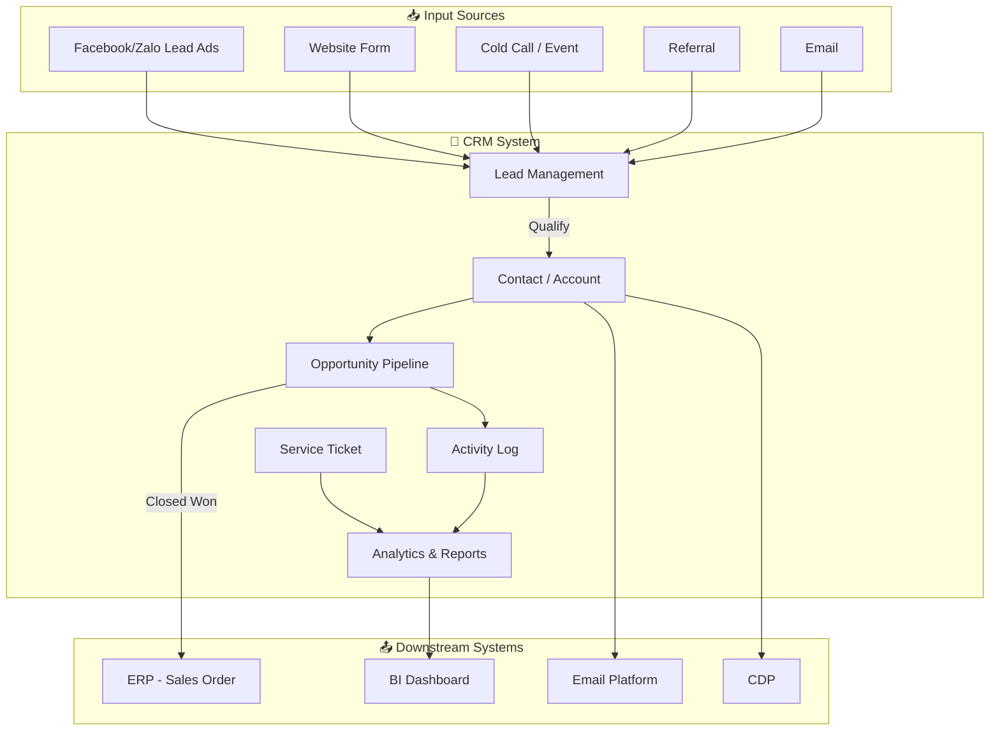
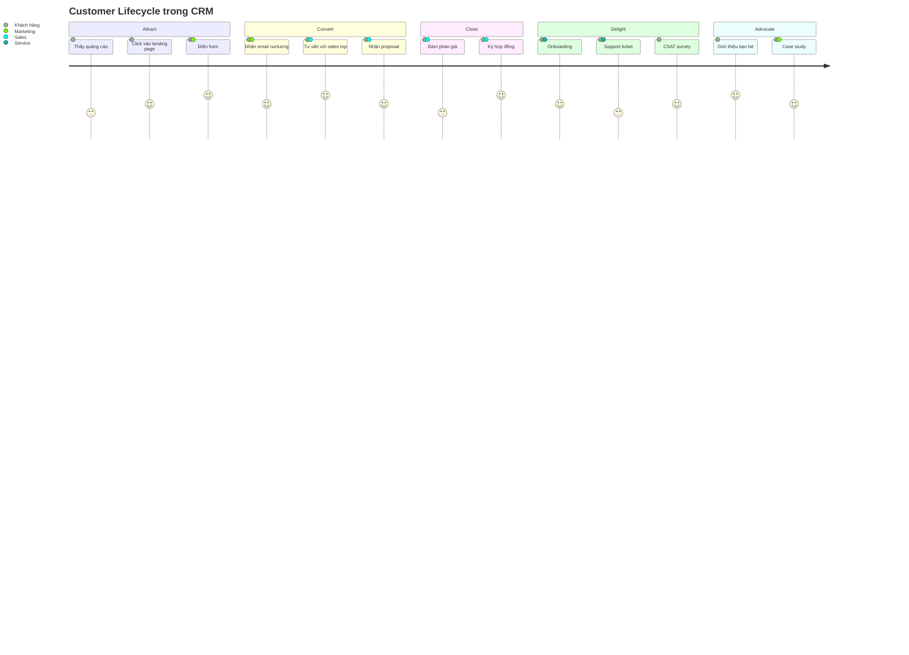

# CRM01 — Hệ Thống CRM (Customer Relationship Management)

> **Tóm tắt:** CRM (Customer Relationship Management) là chiến lược, quy trình và công nghệ giúp doanh nghiệp quản lý toàn diện mối quan hệ với khách hàng — từ lần đầu tiếp xúc đến khi trở thành khách hàng trung thành và giới thiệu người khác. Đây là nền tảng cốt lõi để tăng doanh thu, giảm chi phí bán hàng và xây dựng lợi thế cạnh tranh bền vững.

---

## Mục Lục

1. [Learning Objectives](#1-learning-objectives)
2. [Business Context](#2-business-context)
3. [Definitions](#3-definitions)
4. [Core Concepts](#4-core-concepts)
5. [Business Value](#5-business-value)
6. [Enterprise Role](#6-enterprise-role)
7. [Departments Related](#7-departments-related)
8. [Input](#8-input)
9. [Output](#9-output)
10. [Business Process](#10-business-process)
11. [Data Flow](#11-data-flow)
12. [Money Flow](#12-money-flow)
13. [Document Flow](#13-document-flow)
14. [Roles](#14-roles)
15. [Responsibilities](#15-responsibilities)
16. [RACI](#16-raci)
17. [Frameworks](#17-frameworks)
18. [International Standards](#18-international-standards)
19. [Vietnam Context](#19-vietnam-context)
20. [Legal Considerations](#20-legal-considerations)
21. [Common Mistakes](#21-common-mistakes)
22. [Best Practices](#22-best-practices)
23. [KPIs](#23-kpis)
24. [Metrics](#24-metrics)
25. [Reports](#25-reports)
26. [Templates](#26-templates)
27. [Checklists](#27-checklists)
28. [SOP](#28-sop)
29. [Case Study](#29-case-study)
30. [Small Business Example](#30-small-business-example)
31. [Enterprise Example](#31-enterprise-example)
32. [ERP Mapping](#32-erp-mapping)
33. [Automation Opportunities](#33-automation-opportunities)
34. [AI Opportunities](#34-ai-opportunities)
35. [Implementation Guide](#35-implementation-guide)
36. [Consulting Guide](#36-consulting-guide)
37. [Diagnostic Questions](#37-diagnostic-questions)
38. [Interview Questions](#38-interview-questions)
39. [Exercises](#39-exercises)
40. [References](#40-references)
41. [Output Formats](#output-formats)

---

## 1. Learning Objectives

Sau khi hoàn thành module này, học viên có thể:

- **Hiểu** định nghĩa CRM trên 3 tầng: chiến lược (strategy), quy trình (process) và công nghệ (technology)
- **Phân biệt** CRM với ERP, Marketing Automation và CDP — biết khi nào dùng cái gì
- **Mô tả** vòng đời khách hàng (customer lifecycle) và cách CRM hỗ trợ từng giai đoạn
- **Giải thích** 3 module chính: Sales CRM, Marketing CRM, Service CRM và cách chúng liên kết
- **Tính toán** ROI của CRM và xây dựng business case cho ban lãnh đạo
- **Đánh giá** các giải pháp CRM phổ biến tại Việt Nam: Base.vn, AMIS CRM, GetFly, Salesforce, HubSpot
- **Nhận diện** các thách thức adoption CRM tại SME Việt Nam và cách vượt qua
- **Thiết kế** pipeline bán hàng cơ bản với lead scoring và opportunity stages
- **Áp dụng** CRM vào bối cảnh B2B và B2C khác nhau tại thị trường Việt Nam

---

## 2. Business Context

### Tại Sao CRM Quan Trọng

Trong môi trường kinh doanh hiện đại, việc **giành được một khách hàng mới tốn gấp 5-7 lần** chi phí giữ chân khách hàng cũ (Bain & Company). Tuy nhiên, hầu hết doanh nghiệp Việt Nam — đặc biệt là SME — vẫn quản lý khách hàng qua Excel, sổ tay, Zalo và email rời rạc. Kết quả là:

- **Mất khách hàng** khi nhân viên bán hàng nghỉ việc (dữ liệu nằm trong điện thoại cá nhân)
- **Bỏ lỡ cơ hội** do không theo dõi được pipeline một cách hệ thống
- **Trải nghiệm khách hàng kém** vì mỗi lần gọi điện phải giải thích lại từ đầu
- **Không đo được hiệu quả** của đội sales và marketing

### Xu Hướng Thị Trường

- Thị trường CRM toàn cầu đạt **$96 tỷ USD năm 2027** (Gartner)
- Tại Việt Nam, tỷ lệ doanh nghiệp dùng CRM chuyên dụng ước tính chỉ **15-20%** (phần lớn là enterprise)
- COVID-19 thúc đẩy digital transformation, nhiều SME bắt đầu tìm kiếm giải pháp CRM nội địa
- Làn sóng nền tảng CRM Việt như Base.vn, AMIS CRM, GetFly đang tăng trưởng mạnh

### Bối Cảnh Doanh Nghiệp Việt Nam

| Loại DN | Hiện trạng | Nhu cầu CRM |
|---------|-----------|-------------|
| Startup | Notion, Trello, Zalo | HubSpot Free, Base.vn |
| SME (<200 nhân viên) | Excel, Zalo OA | AMIS CRM, GetFly |
| Mid-market | Excel + phần mềm lẻ | Base.vn Enterprise, AMIS Pro |
| Enterprise | SAP, Oracle ERP | Salesforce, SAP CRM, Microsoft Dynamics |

---

## 3. Definitions

### Định Nghĩa Chính Thức

**CRM (Customer Relationship Management)** — Theo Gartner: "Chiến lược kinh doanh được thiết kế để tối ưu hóa lợi nhuận, doanh thu và sự hài lòng của khách hàng thông qua việc tổ chức doanh nghiệp xung quanh các phân khúc khách hàng, khuyến khích hành vi đáp ứng nhu cầu khách hàng và kết nối các quy trình từ khách hàng đến nhà cung cấp."

### Phân Loại CRM

| Loại | Mô tả | Ví dụ |
|------|-------|-------|
| **Operational CRM** | Tự động hóa quy trình sales, marketing, service | Salesforce Sales Cloud |
| **Analytical CRM** | Phân tích dữ liệu khách hàng để ra quyết định | Salesforce Analytics, Power BI |
| **Collaborative CRM** | Chia sẻ thông tin khách hàng giữa các phòng ban | Microsoft Dynamics 365 |
| **Strategic CRM** | Định hướng toàn bộ văn hóa công ty lấy khách hàng làm trung tâm | N/A (triết lý) |

### Thuật Ngữ Quan Trọng

- **Lead**: Khách hàng tiềm năng chưa được xác nhận (người điền form, gọi điện hỏi)
- **Prospect**: Lead đã được xác nhận có nhu cầu và ngân sách
- **Opportunity**: Cơ hội bán hàng cụ thể, đang trong quá trình đàm phán
- **Account**: Tổ chức/công ty khách hàng (trong B2B)
- **Contact**: Cá nhân liên hệ trong một Account
- **Pipeline**: Tập hợp các Opportunity đang trong quá trình bán hàng
- **Customer Lifecycle**: Vòng đời khách hàng từ Awareness → Purchase → Retention → Advocacy
- **Churn Rate**: Tỷ lệ khách hàng rời bỏ trong một kỳ
- **LTV (Lifetime Value)**: Tổng giá trị mà một khách hàng mang lại trong suốt vòng đời

---

## 4. Core Concepts

### 4.1 Customer Lifecycle (Vòng Đời Khách Hàng)

```
ATTRACT → CONVERT → CLOSE → DELIGHT → ADVOCATE
   |          |        |        |          |
Marketing  Lead Mgmt  Sales  Service   Referral
```

**Giai đoạn 1 — Attract (Thu hút):**
- Mục tiêu: Tạo awareness và thu hút đúng đối tượng khách hàng mục tiêu
- Công cụ CRM: Marketing campaigns, landing pages, web tracking
- Ví dụ Vinamilk: Chạy campaign trên Facebook/Zalo, thu thập lead từ form khuyến mãi

**Giai đoạn 2 — Convert (Chuyển đổi):**
- Mục tiêu: Chuyển visitor/lead thành prospect đủ điều kiện (qualified)
- Công cụ CRM: Lead scoring, email nurturing, chatbot
- Ví dụ Masan Consumer: Phân loại lead theo khu vực địa lý và kênh phân phối

**Giai đoạn 3 — Close (Chốt đơn):**
- Mục tiêu: Chuyển prospect thành khách hàng
- Công cụ CRM: Opportunity management, proposal tracking, e-signature
- Ví dụ FPT Software: Theo dõi RFP/RFQ trong pipeline B2B

**Giai đoạn 4 — Delight (Làm hài lòng):**
- Mục tiêu: Cung cấp trải nghiệm xuất sắc sau mua
- Công cụ CRM: Service tickets, SLA tracking, satisfaction surveys
- Ví dụ VCB: Chatbot hỗ trợ khách hàng 24/7, phân loại ticket theo độ ưu tiên

**Giai đoạn 5 — Advocate (Giới thiệu):**
- Mục tiêu: Biến khách hàng hài lòng thành người giới thiệu
- Công cụ CRM: Loyalty programs, referral tracking, NPS surveys
- Ví dụ Techcombank: Chương trình giới thiệu bạn bè tích hợp vào app

### 4.2 CRM Modules (Các Module CRM)

#### Sales CRM
- **Pipeline Management**: Quản lý cơ hội bán hàng qua từng giai đoạn
- **Lead Management**: Thu nhận, phân loại, phân công lead
- **Contact Management**: Lưu trữ thông tin liên hệ, lịch sử tương tác
- **Activity Tracking**: Ghi nhận cuộc gọi, email, meeting
- **Forecasting**: Dự báo doanh thu dựa trên pipeline

#### Marketing CRM
- **Campaign Management**: Lên kế hoạch, thực hiện và đo lường chiến dịch
- **Email Marketing**: Gửi email hàng loạt, A/B testing
- **Lead Nurturing**: Chuỗi email tự động theo hành vi khách hàng
- **Segmentation**: Phân khúc khách hàng theo nhiều tiêu chí
- **ROI Tracking**: Đo lường hiệu quả từng kênh marketing

#### Service CRM
- **Ticket Management**: Tạo, phân công và xử lý yêu cầu hỗ trợ
- **Knowledge Base**: Cơ sở tri thức tự phục vụ cho khách hàng
- **SLA Management**: Theo dõi cam kết dịch vụ
- **Customer Portal**: Cổng thông tin để khách hàng tự theo dõi ticket
- **Satisfaction Surveys**: CSAT, NPS sau mỗi lần tương tác

### 4.3 Pipeline Management

**Các giai đoạn pipeline điển hình (B2B):**

```
Lead In → Qualified → Proposal Sent → Negotiation → Closed Won/Lost
  (10%)      (25%)        (50%)          (75%)         (100%/0%)
```

**Xác suất (Probability) và ý nghĩa:**
- 10%: Lead mới, chưa xác nhận nhu cầu
- 25%: Đã có cuộc gọi khám phá, xác nhận có nhu cầu
- 50%: Đã gửi đề xuất/báo giá
- 75%: Đang đàm phán điều khoản
- 90%: Chờ ký hợp đồng
- 100%: Closed Won (Thắng)
- 0%: Closed Lost (Thua) — ghi rõ lý do

**Weighted Pipeline (Pipeline có trọng số):**
```
Tổng pipeline dự báo = Σ (Giá trị opportunity × Xác suất)
VD: 500M × 75% + 200M × 50% + 100M × 25% = 375M + 100M + 25M = 500M VND
```

### 4.4 Lead Scoring

Lead scoring là hệ thống chấm điểm tự động để ưu tiên xử lý lead:

| Tiêu chí | Điểm | Ví dụ |
|---------|------|-------|
| Chức vụ = Giám đốc/CEO | +20 | CEO công ty 50 nhân viên |
| Quy mô công ty > 100 nhân viên | +15 | Công ty vừa |
| Tải whitepaper | +10 | Tải tài liệu kỹ thuật |
| Xem trang pricing | +15 | Quan tâm giá cả |
| Mở email > 3 lần | +5 | Có engagement |
| Ngành phù hợp | +10 | Ngành mục tiêu |
| **Tổng < 30** | Cold | Chưa ready |
| **Tổng 30-60** | Warm | Cần nurturing |
| **Tổng > 60** | Hot | Ưu tiên liên hệ ngay |

### 4.5 CRM vs ERP vs CDP vs Marketing Automation

| Hệ thống | Trọng tâm | Dữ liệu chính | Người dùng |
|----------|----------|---------------|-----------|
| **CRM** | Quản lý quan hệ khách hàng | Contact, Opportunity, Activity | Sales, Service |
| **ERP** | Quản lý nguồn lực nội bộ | Invoice, Inventory, HR | Kế toán, Kho, HR |
| **CDP** | Hợp nhất dữ liệu khách hàng | Behavioral, Transactional | Marketing, Data |
| **Marketing Auto** | Tự động hóa marketing | Campaigns, Journeys | Marketing |

**Quy tắc đơn giản:**
- CRM = Người bán hàng cần gì?
- ERP = Kế toán/kho cần gì?
- CDP = Data team cần gì?
- MA = Marketing team cần gì?

### 4.6 ROI của CRM

**Công thức tính ROI:**
```
ROI (%) = [(Lợi ích - Chi phí) / Chi phí] × 100
```

**Lợi ích định lượng được:**
- Tăng tỷ lệ chốt đơn: +15-30%
- Giảm thời gian sales cycle: -20-40%
- Tăng upsell/cross-sell: +20-35%
- Giảm churn: -10-25%
- Tăng năng suất sales rep: +25-40%

**Ví dụ Business Case cho SME VN:**
```
Chi phí triển khai AMIS CRM: 50M VND/năm (10 user)
Lợi ích:
- Tăng 20% tỷ lệ chốt: +2 hợp đồng/tháng × 30M avg = +60M/tháng = 720M/năm
- Tiết kiệm 2h/sales rep/ngày × 5 rep × 250 ngày × 150K/h = 375M/năm
Tổng lợi ích: 1,095M/năm
ROI = [(1,095M - 50M) / 50M] × 100 = 2,090%
```

---

## 5. Business Value

### Giá Trị Trực Tiếp

| Giá trị | Mô tả | Đo lường |
|--------|-------|----------|
| **Tăng doanh thu** | Pipeline rõ ràng, không bỏ sót cơ hội | Revenue growth % |
| **Tăng năng suất** | Tự động hóa thủ tục, focus vào bán hàng | Activities per rep |
| **Giảm churn** | Phát hiện sớm khách hàng có nguy cơ rời đi | Churn rate reduction |
| **Cải thiện UX** | Biết lịch sử khách hàng, không hỏi lại | CSAT score |
| **Ra quyết định tốt hơn** | Dashboard real-time, không chờ báo cáo | Decision speed |

### Giá Trị Gián Tiếp

- **Giữ chân nhân tài**: Sales rep có tool tốt làm việc hiệu quả hơn, ít bỏ việc hơn
- **Scalability**: Tăng quy mô mà không tăng tỷ lệ với headcount
- **Institutional knowledge**: Dữ liệu khách hàng thuộc về công ty, không phải cá nhân
- **Compliance**: Dữ liệu có audit trail, phục vụ kiểm toán và pháp lý

### Giá Trị Với Từng Stakeholder

- **CEO/Founder**: Nhìn thấy pipeline real-time, dự báo được doanh thu
- **Sales Director**: Coaching dựa trên data, phân bổ territory fair
- **Sales Rep**: Không dùng Excel, focus vào bán hàng
- **Marketing**: Biết lead nào chuyển đổi, tối ưu campaign
- **Customer Service**: Biết lịch sử mua hàng khi khách gọi điện

---

## 6. Enterprise Role

Trong doanh nghiệp, CRM đóng vai trò **trung tâm thông tin khách hàng (Customer Intelligence Hub)**:

```
Marketing ──→ CRM ←── Sales
                ↑         ↑
             Service ── Finance
```

**3 vai trò chiến lược:**

1. **System of Record**: Lưu trữ toàn bộ thông tin khách hàng (source of truth)
2. **System of Engagement**: Nơi nhân viên tương tác với khách hàng hàng ngày
3. **System of Intelligence**: Phân tích, dự báo, gợi ý hành động tiếp theo

**Vị trí trong kiến trúc hệ thống:**
- Nhận dữ liệu từ: Website, Zalo, Email, Phone, Event, Social
- Cung cấp dữ liệu cho: ERP (khi tạo đơn hàng), BI (báo cáo), CDP (unified profile)

---

## 7. Departments Related

| Phòng ban | Mức độ liên quan | Cách sử dụng CRM |
|----------|-----------------|-----------------|
| **Sales** | Cao nhất (Core user) | Pipeline, opportunity, activity log |
| **Marketing** | Cao | Campaign, lead gen, attribution |
| **Customer Service** | Cao | Ticket, SLA, knowledge base |
| **Finance/Accounting** | Trung bình | Quote-to-cash, revenue forecast |
| **Management/CEO** | Trung bình | Dashboard, KPI, forecast |
| **HR** | Thấp | Sales rep performance (liên kết HRM) |
| **IT** | Trung bình | Integration, maintenance, security |
| **Legal** | Thấp | Contract management (nếu có module) |

---

## 8. Input

### Dữ Liệu Đầu Vào

**Từ Marketing:**
- Danh sách lead từ campaign (Facebook Ads, Google Ads, Zalo OA)
- Form đăng ký/tải tài liệu từ website
- Business cards từ sự kiện/hội chợ
- Danh sách mua từ đối tác (lưu ý: cần kiểm tra pháp lý PDPA)

**Từ Sales:**
- Thông tin khách hàng tiềm năng (cold call, referral)
- Lịch sử tương tác (email, cuộc gọi, meeting)
- Đề xuất/báo giá đã gửi
- Kết quả đàm phán và lý do thắng/thua

**Từ Service:**
- Yêu cầu hỗ trợ của khách hàng
- Feedback sau sử dụng
- Đánh giá CSAT, NPS

**Từ Hệ Thống Khác:**
- Đơn hàng từ ERP/phần mềm bán hàng
- Giao dịch từ POS/e-commerce
- Dữ liệu hành vi từ website (Google Analytics integration)

---

## 9. Output

### Kết Quả Đầu Ra

**Cho Sales Team:**
- Danh sách lead được phân công theo territory/product
- Pipeline report với probability và forecast
- Activity reminders và next-step suggestions
- Win/Loss analysis

**Cho Marketing Team:**
- Campaign performance report
- Lead source attribution
- Lead-to-customer conversion rate by channel
- ROI by marketing channel

**Cho Service Team:**
- Ticket reports (volume, resolution time, CSAT)
- SLA compliance report
- Knowledge base utilization

**Cho Leadership:**
- Revenue forecast dashboard
- Sales rep performance ranking
- Customer health score overview
- Churn risk alerts

---

## 10. Business Process

### Quy Trình Quản Lý Lead (Lead Management Process)

```
BƯỚC 1: Lead Generation
└── Campaign → Form điền → Lead tạo trong CRM tự động

BƯỚC 2: Lead Qualification
└── MQL (Marketing Qualified Lead): Marketing đánh giá
└── SQL (Sales Qualified Lead): Sales xác nhận

BƯỚC 3: Lead Assignment
└── Round-robin / Territory / Product-based assignment

BƯỚC 4: Lead Nurturing (nếu chưa sẵn sàng)
└── Email sequence, retargeting ads

BƯỚC 5: Convert to Opportunity
└── Lead → Account + Contact + Opportunity

BƯỚC 6: Pipeline Management
└── Qualify → Propose → Negotiate → Close

BƯỚC 7: Post-Sale
└── Opportunity Closed → ERP tạo đơn hàng → Service onboard
```

### Quy Trình Xử Lý Ticket Dịch Vụ

```
Khách hàng liên hệ → Ticket tạo (auto/manual) → Phân loại & ưu tiên
→ Giao cho agent → Xử lý → Escalate (nếu cần) → Resolve → CSAT survey
```

---

## 11. Data Flow

```
[Nguồn dữ liệu]
Website Form ──→ ┐
Facebook Lead ──→ │
Zalo OA ────── →  │   [CRM Database]           [Downstream]
Email ─────────→  ├──→ Lead/Contact ──────────→ ERP (tạo SO)
Cold Call ─────→  │    Opportunity ──────────→ BI/Dashboard
Referral ──────→  │    Activity Log ─────────→ CDP
Event ─────────→  │    Service Ticket ───────→ Email platform
                  ┘
```

**Data Quality Rules:**
- Duplicate detection: Tìm kiếm theo email, phone trước khi tạo mới
- Mandatory fields: Họ tên, Số điện thoại, Nguồn lead
- Data enrichment: Tự động điền tên công ty từ email domain

---

## 12. Money Flow

### Chi Phí CRM

```
CAPEX (One-time):
├── License phần mềm (nếu on-premise): 50-500M VND
├── Triển khai/tùy chỉnh: 20-200M VND
└── Training: 10-50M VND

OPEX (Recurring):
├── SaaS subscription: 200K-2M/user/tháng
├── Maintenance & support: 10-20% license/năm
└── Data storage: Tùy volume
```

### Revenue Flow CRM Tạo Ra

```
Lead → Opportunity (có giá trị) → Deal Closed Won → Invoice → Payment
         ↑                              ↓
   (CRM tracking)               (Transfer to ERP)
```

### ROI Framework

| Metric | Before CRM | After CRM | Delta |
|--------|-----------|----------|-------|
| Win rate | 15% | 22% | +47% |
| Sales cycle (ngày) | 45 | 32 | -29% |
| Revenue per rep | 2B/năm | 2.8B/năm | +40% |
| Churn rate | 25% | 18% | -28% |

---

## 13. Document Flow

| Document | Tạo bởi | Lưu ở | Liên kết đến |
|----------|---------|-------|-------------|
| Lead form | Marketing | CRM (Lead record) | Campaign |
| Proposal/Báo giá | Sales | CRM (Opportunity) + Google Drive | Opportunity |
| Contract/Hợp đồng | Sales/Legal | CRM + DMS | Account |
| Service ticket | Customer/Agent | CRM (Service) | Account, Contact |
| CSAT survey | Auto | CRM (Survey response) | Ticket |
| Invoice | Finance | ERP | Opportunity (reference) |

---

## 14. Roles

### Trong Team Triển Khai CRM

| Role | Mô tả |
|------|-------|
| **CRM Administrator** | Quản trị hệ thống, user management, cấu hình |
| **CRM Project Manager** | Điều phối triển khai, timeline, budget |
| **Business Analyst** | Thu thập yêu cầu, mapping quy trình |
| **CRM Developer** | Tùy chỉnh, tích hợp API |
| **Data Migration Specialist** | Di chuyển dữ liệu từ hệ thống cũ |
| **Change Management Lead** | Training, adoption |

### Trong Team Vận Hành CRM

| Role | Mô tả |
|------|-------|
| **Sales Rep** | Nhập liệu, cập nhật pipeline hàng ngày |
| **Sales Manager** | Review pipeline, coaching, forecast |
| **Marketing Manager** | Campaign setup, lead assignment rules |
| **Customer Service Agent** | Xử lý ticket, cập nhật resolution |
| **CRM Admin** | Duy trì hệ thống, fix issues |

---

## 15. Responsibilities

### Sales Rep
- Cập nhật pipeline hàng ngày (tối thiểu 1 lần/ngày)
- Log tất cả hoạt động: cuộc gọi, email, meeting
- Không tạo contact trùng lặp
- Điền đầy đủ thông tin Opportunity: giá trị, ngày dự kiến close, stage
- Cập nhật kết quả win/loss với lý do cụ thể

### Sales Manager
- Review pipeline weekly với từng rep
- Đảm bảo forecast accuracy
- Escalate deals bị stuck
- Coaching dựa trên CRM data

### Marketing Manager
- Đảm bảo lead có đủ thông tin nguồn (UTM tracking)
- Định nghĩa rõ MQL criteria
- Theo dõi lead-to-SQL conversion rate
- Báo cáo marketing ROI monthly

### CRM Admin
- Maintain data quality (deduplicate monthly)
- User onboarding/offboarding
- Backup data định kỳ
- Cập nhật cấu hình theo yêu cầu business

---

## 16. RACI

| Hoạt động | Sales Rep | Sales Mgr | Marketing | CRM Admin | IT | CEO |
|----------|-----------|-----------|-----------|-----------|-----|-----|
| Nhập liệu khách hàng | R | A | I | I | - | - |
| Định nghĩa pipeline stages | I | A | I | R | - | C |
| Lead assignment rules | I | C | R/A | I | - | - |
| CRM configuration | I | C | C | R/A | I | - |
| Integration với ERP | I | I | I | C | R/A | I |
| User training | I | A | I | R | I | - |
| Báo cáo tháng | I | R | R | I | - | A |
| Data backup | I | I | - | R | A | - |

*R=Responsible, A=Accountable, C=Consulted, I=Informed*

---

## 17. Frameworks

### 1. AIDA Framework (Attention-Interest-Desire-Action)
Áp dụng cho marketing trong CRM: từng email/campaign được thiết kế theo AIDA.

### 2. BANT (Budget, Authority, Need, Timeline)
Tiêu chí qualify lead B2B:
- **B**udget: Có ngân sách không?
- **A**uthority: Đây có phải người ra quyết định không?
- **N**eed: Có nhu cầu thực sự không?
- **T**imeline: Khi nào cần mua?

### 3. MEDDIC (Enterprise Sales)
Phức tạp hơn BANT, dùng cho enterprise deals:
- **M**etrics: Đo lường thành công thế nào?
- **E**conomic Buyer: Ai kiểm soát ngân sách?
- **D**ecision Criteria: Tiêu chí quyết định?
- **D**ecision Process: Quy trình phê duyệt?
- **I**dentify Pain: Vấn đề cốt lõi?
- **C**hampion: Ai sẽ bảo vệ deal nội bộ?

### 4. SPIN Selling
Framework hỏi để khám phá nhu cầu khách hàng:
- **S**ituation: Hiện tại đang dùng gì?
- **P**roblem: Vấn đề đang gặp phải?
- **I**mplication: Hậu quả của vấn đề?
- **N**eed-payoff: Nếu giải quyết được thì lợi ích là gì?

### 5. Customer Success Framework
- Onboarding → Adoption → Renewal → Expansion → Advocacy
- Health Score: Đo mức độ "khỏe mạnh" của từng khách hàng

---

## 18. International Standards

### ISO 9001:2015
Hệ thống quản lý chất lượng — CRM hỗ trợ yêu cầu về:
- Quản lý rủi ro liên quan đến khách hàng (Clause 6.1)
- Đo lường sự hài lòng khách hàng (Clause 9.1.2)
- Quản lý thông tin dạng văn bản (Clause 7.5)

### ISO 10002:2018
Tiêu chuẩn quản lý khiếu nại khách hàng — áp dụng trực tiếp vào Service CRM module.

### GDPR (EU General Data Protection Regulation)
- Applicable cho doanh nghiệp VN có khách hàng EU
- Right to be forgotten: CRM phải hỗ trợ xóa dữ liệu theo yêu cầu
- Consent tracking: Ghi nhận consent khi thu thập email, phone

### Salesforce CRM Analytics Standards
De facto industry standard cho CRM reporting và analytics.

---

## 19. Vietnam Context

### Đặc Thù Thị Trường Việt Nam

**1. Văn hóa kinh doanh:**
- Quan hệ cá nhân (guanxi/quan hệ) rất quan trọng — CRM cần capture notes về quan hệ cá nhân
- Quyết định mua thường qua "người thân thiết" — cần track referral source kỹ
- Đàm phán giá phổ biến hơn giá niêm yết — CRM cần flexible discount approval workflow

**2. Kênh tương tác đặc thù:**
- **Zalo**: Kênh chính để chat với khách hàng (Zalo OA cho business)
- **Facebook Messenger**: Phổ biến cho B2C
- **Phone (gọi điện)**: Vẫn là kênh chính cho B2B
- Email: Ít dùng hơn so với thị trường phương Tây

**3. CRM nội địa phổ biến:**

| Phần mềm | Nhà phát triển | Phân khúc | Giá (2024) |
|----------|----------------|----------|-----------|
| **Base.vn** | Base Enterprise | SME-Enterprise | 200K-1M/user/tháng |
| **AMIS CRM** | MISA | SME | 150K-400K/user/tháng |
| **GetFly** | GetFly | SME | 100K-300K/user/tháng |
| **Bitrix24** | Bitrix (Nga) | SME | Free-500K/user/tháng |
| **Salesforce** | Salesforce (US) | Enterprise | 1-5M/user/tháng |

**4. Thách thức adoption:**
- **Kháng cự từ sales team**: "Nhập liệu tốn thời gian", "Sếp muốn kiểm soát mình"
- **Thiếu quy trình chuẩn**: Nhiều công ty chưa có sales process rõ ràng trước khi mua CRM
- **Dữ liệu ban đầu**: Excel cũ lộn xộn, không đủ trường thông tin
- **Leadership support yếu**: Sếp không dùng CRM nên nhân viên không thấy cần thiết
- **Internet/thiết bị**: Sales field không phải ai cũng có laptop tốt (mobile CRM quan trọng)

**5. SME VN — điển hình dùng CRM:**
- Phần lớn SME vẫn dùng Excel + Zalo Group để quản lý khách hàng
- Khi đội sales > 5 người, bắt đầu cần CRM
- Trigger thường là: "Nhân viên nghỉ việc, mang theo toàn bộ danh sách khách hàng"

---

## 20. Legal Considerations

### Nghị Định 13/2023/NĐ-CP (Bảo Vệ Dữ Liệu Cá Nhân)

Có hiệu lực từ 01/07/2023, ảnh hưởng trực tiếp đến CRM:

- **Điều 9**: Cần có sự đồng ý rõ ràng khi thu thập dữ liệu cá nhân (tên, email, SĐT)
- **Điều 10**: Người dùng có quyền xem, sửa, xóa dữ liệu của mình
- **Điều 11**: Phải thông báo về mục đích sử dụng dữ liệu
- **CRM Implication**: Cần có cơ chế consent capture, data subject request workflow

### Luật An Ninh Mạng 2018
- Dữ liệu của người dùng Việt Nam phải được lưu trữ tại Việt Nam (Điều 26) — ảnh hưởng đến lựa chọn CRM cloud vs on-premise
- Cloud CRM nước ngoài cần xem xét data residency

### Luật Giao Dịch Điện Tử 2023
- Hợp đồng điện tử có giá trị pháp lý — CRM có thể lưu trữ contract số
- E-signature được công nhận

### Luật Quảng Cáo và Spam
- Nghị định 91/2020/NĐ-CP: Quy định về tin nhắn quảng cáo
- Cần có opt-in trước khi gửi SMS/email marketing qua CRM
- Phải có cơ chế opt-out dễ dàng

---

## 21. Common Mistakes

### Sai Lầm Khi Triển Khai

1. **Mua CRM trước khi có sales process**
   - Vấn đề: Không biết cấu hình pipeline stages như thế nào
   - Giải pháp: Vẽ sales process trên giấy trước, rồi mới chọn CRM

2. **Triển khai quá nhiều tính năng cùng lúc**
   - Vấn đề: Users overwhelmed, adoption thất bại
   - Giải pháp: Start with core (Contact + Pipeline), expand dần

3. **Không có champion nội bộ**
   - Vấn đề: Không ai chịu trách nhiệm thúc đẩy adoption
   - Giải pháp: Chỉ định CRM champion trong team sales

4. **Dữ liệu migration kém chất lượng**
   - Vấn đề: Garbage in, garbage out — CRM full data rác
   - Giải pháp: Clean data trước khi migrate, không migrate hết

5. **Thiếu training thực tế**
   - Vấn đề: Training lý thuyết, không theo use case thực
   - Giải pháp: Train trên dữ liệu thực của công ty

### Sai Lầm Khi Vận Hành

6. **Sales rep không cập nhật pipeline**
   - Vấn đề: Manager không có data để quản lý
   - Giải pháp: CRM hygiene là KPI, review hàng tuần bắt buộc

7. **Duplicate records tràn lan**
   - Vấn đề: Cùng khách hàng có 5 records, không biết cái nào đúng
   - Giải pháp: Enforce unique check theo email/phone khi tạo mới

8. **Không tích hợp với email**
   - Vấn đề: Sales vẫn dùng Gmail riêng, email không vào CRM
   - Giải pháp: Cài CRM email plugin (Gmail/Outlook sidebar)

9. **Chỉ dùng CRM như phonebook**
   - Vấn đề: Không dùng pipeline, không log activity
   - Giải pháp: Đào tạo lại về mục tiêu CRM, set minimum activity logging

10. **Reports không ai xem**
    - Vấn đề: Dashboard đẹp nhưng không drive action
    - Giải pháp: Weekly sales meeting bắt buộc xem CRM dashboard

---

## 22. Best Practices

### Triển Khai CRM

1. **Define Before Deploy**: Vẽ customer journey và sales process TRƯỚC khi cấu hình CRM
2. **Executive Sponsorship**: CEO/Sales Director phải là người đầu tiên dùng CRM và hỏi nhân viên về data
3. **Phase it out**: Tháng 1-2 (basic), Tháng 3-4 (automation), Tháng 5-6 (reporting)
4. **Mobile First**: Với sales field VN, mobile app quan trọng không kém desktop
5. **Quick Win**: Chọn 1-2 use case mang lại lợi ích ngay (VD: không bỏ sót follow-up)

### Quản Lý Dữ Liệu

6. **Golden Record**: Định nghĩa rõ ai là master record khi có duplicate
7. **Mandatory Fields**: Giữ ở mức tối thiểu (5-7 fields), không yêu cầu quá nhiều
8. **Regular Deduplication**: Monthly cleanup session cho CRM admin
9. **Archive Policy**: Lead > 2 năm không active → archive (không xóa)

### Vận Hành

10. **CRM Meeting Rhythm**: Daily standup check pipeline, weekly review với manager
11. **Incentivize Adoption**: Gamification (leaderboard tổng pipeline, số deal close)
12. **Integration as Priority**: CRM phải kết nối với email, calendar, ERP — đừng để standalone
13. **Document Everything**: Mọi cuộc gọi, meeting, email đều phải có note trong CRM
14. **Customer Health Score**: Định kỳ review điểm sức khỏe của từng khách hàng key account

---

## 23. KPIs

### Sales CRM KPIs

| KPI | Công thức | Target điển hình |
|-----|----------|-----------------|
| **Win Rate** | Closed Won / Total Opportunities | 20-30% (B2B) |
| **Pipeline Coverage** | Total Pipeline / Revenue Target | 3-4x |
| **Sales Cycle Length** | Ngày TB từ Lead đến Close | Tùy ngành |
| **Average Deal Size** | Total Revenue / Số Deals | Trending up |
| **Activities per Rep per Day** | Cuộc gọi + Email + Meeting | 8-15 activities |
| **Lead Response Time** | Thời gian từ lead tạo đến contact | < 5 phút (hot lead) |

### Marketing CRM KPIs

| KPI | Công thức | Target |
|-----|----------|--------|
| **Lead-to-MQL Rate** | MQL / Tổng Lead | 20-30% |
| **MQL-to-SQL Rate** | SQL / MQL | 40-60% |
| **Cost per Lead** | Marketing Budget / Số Lead | Tùy kênh |
| **Lead Source Attribution** | % revenue từ mỗi kênh | Benchmark by industry |

### Service CRM KPIs

| KPI | Công thức | Target |
|-----|----------|--------|
| **First Response Time** | TB thời gian trả lời đầu tiên | < 4h (B2B), < 1h (B2C) |
| **Resolution Time** | TB thời gian giải quyết ticket | SLA dependent |
| **CSAT Score** | Customer Satisfaction Score | > 4.0/5.0 |
| **NPS** | % Promoters - % Detractors | > 50 |
| **Ticket Volume per Agent** | Số ticket / Agent | Benchmark by team |

---

## 24. Metrics

### Operational Metrics (Đo lường hàng ngày/tuần)

- **Pipeline Velocity**: (Số deals × Win rate × Avg deal size) / Sales cycle length
- **Lead Age**: Số ngày kể từ khi lead tạo — alert nếu quá 7 ngày chưa contact
- **Task Completion Rate**: % task được hoàn thành đúng hạn
- **CRM Adoption Score**: % activities được log trong CRM / tổng activities

### Strategic Metrics (Đo lường hàng tháng/quý)

- **Customer Acquisition Cost (CAC)**: Tổng chi phí S&M / Số khách hàng mới
- **Customer Lifetime Value (LTV)**: Doanh thu TB/năm × Số năm trung bình giữ chân
- **LTV:CAC Ratio**: Target > 3:1 (tức là mỗi đồng bỏ ra để có khách phải thu về ít nhất 3 đồng)
- **Churn Rate**: (Số KH mất / Tổng KH đầu kỳ) × 100
- **Net Revenue Retention (NRR)**: (Doanh thu cuối kỳ từ KH cũ) / (Doanh thu đầu kỳ từ KH đó)

---

## 25. Reports

### Báo Cáo Thường Xuyên

**Daily (Hàng ngày):**
- My Activities Today: Danh sách việc cần làm
- Overdue Tasks: Task quá hạn chưa xử lý
- New Leads Today: Lead mới cần liên hệ

**Weekly (Hàng tuần):**
- Pipeline Report: Danh sách deal theo stage, giá trị, ngày close dự kiến
- Activity Summary: Số cuộc gọi/email/meeting của từng rep
- Lead Flow Report: Lead mới, MQL, SQL theo tuần

**Monthly (Hàng tháng):**
- Revenue Achievement: Doanh thu thực tế vs target
- Win/Loss Analysis: Lý do thắng/thua theo sản phẩm, đối thủ
- Campaign ROI Report: Chi phí vs doanh thu theo từng campaign

**Quarterly (Hàng quý):**
- Sales Forecast: Dự báo doanh thu quý tới
- Customer Health Review: Điểm sức khỏe của key accounts
- Churn Analysis: Phân tích nguyên nhân khách hàng rời bỏ

---

## 26. Templates

### Template: Cấu Trúc Opportunity Record

```
Opportunity Name: [Tên công ty] - [Sản phẩm/Dịch vụ]
Account: [Liên kết đến Account]
Amount: [Giá trị VND]
Close Date: [DD/MM/YYYY]
Stage: [Lead/Qualified/Proposal/Negotiation/Closed]
Probability: [%]
Source: [Zalo/Facebook/Referral/Cold Call/Event]
Next Step: [Hành động cụ thể + ngày]
Decision Maker: [Tên + chức vụ]
Budget Confirmed: [Yes/No/Unknown]
Description: [Tóm tắt vấn đề và giải pháp]
```

### Template: Activity Log Note

```
[Ngày giờ] - [Loại hoạt động: Call/Email/Meeting]
Người tham gia: [Tên + chức vụ]
Nội dung thảo luận:
- [Key point 1]
- [Key point 2]
Kết quả:
- [Quyết định/thỏa thuận đạt được]
Next Action:
- [Ai làm gì, deadline]
```

### Template: Weekly Pipeline Review

```
Sales Rep: [Tên]
Tuần: [DD/MM - DD/MM]

DEALS CLOSING THIS WEEK:
- [Deal name] | [Amount] | [Probability] | [Action needed]

DEALS AT RISK:
- [Deal name] | [Lý do rủi ro] | [Action plan]

NEW OPPORTUNITIES ADDED:
- [Deal name] | [Amount] | [Source]

SUPPORT NEEDED FROM MANAGER:
- [Yêu cầu cụ thể]
```

---

## 27. Checklists

### Checklist: Triển Khai CRM (Phase 1 — Foundation)

- [ ] Vẽ và thống nhất sales process (stages, criteria mỗi stage)
- [ ] Xác định fields bắt buộc (mandatory) cho Lead, Contact, Opportunity
- [ ] Cấu hình pipeline stages trong CRM
- [ ] Import dữ liệu khách hàng cũ (đã clean)
- [ ] Setup user accounts và phân quyền
- [ ] Cài đặt email integration (Gmail/Outlook plugin)
- [ ] Training session với toàn đội sales (tối thiểu 2h)
- [ ] Định nghĩa CRM usage rules (tần suất cập nhật, mandatory activities)
- [ ] Setup báo cáo tuần cơ bản (pipeline report, activity report)
- [ ] Chỉ định CRM Champion để hỗ trợ team

### Checklist: CRM Data Quality (Hàng tháng)

- [ ] Deduplication: Tìm và merge records trùng lặp
- [ ] Incomplete records: Hoàn thiện fields còn thiếu
- [ ] Stale opportunities: Review deal > 60 ngày không có activity
- [ ] Lost reasons: Đảm bảo mọi Closed Lost đều có lý do
- [ ] Inactive leads: Archive lead > 6 tháng không có hoạt động
- [ ] Contact info validation: Kiểm tra email, phone còn valid không

### Checklist: Onboard Sales Rep Mới Vào CRM

- [ ] Tạo user account với quyền phù hợp
- [ ] Gán territory/product line
- [ ] Training 1:1 (1-2h) với CRM admin
- [ ] Cung cấp guide quick reference (1 trang A4)
- [ ] Shadowing: Theo dõi rep cũ làm việc trong CRM 1 ngày
- [ ] Review sau 2 tuần: Kiểm tra adoption, fix issues

---

## 28. SOP

### SOP-CRM-001: Quy Trình Xử Lý Lead Mới

**Mục tiêu:** Đảm bảo mọi lead được liên hệ trong vòng 24h làm việc

**Bước 1:** Lead tạo trong CRM (auto từ form hoặc manual)
- Ai: Hệ thống hoặc Marketing Executive
- Khi nào: Ngay lập tức
- Điều kiện: Lead có ít nhất tên + SĐT/email

**Bước 2:** Phân công lead (Assignment)
- Ai: CRM automation rule hoặc Sales Manager
- Khi nào: Trong vòng 2h sau khi lead tạo
- Tiêu chí: Territory/product/round-robin

**Bước 3:** Sales Rep xác nhận nhận lead
- Ai: Sales Rep được phân công
- Khi nào: Trong vòng 1h sau assignment
- Hành động: Đổi status lead thành "Assigned — In Progress"

**Bước 4:** Liên hệ lần đầu
- Ai: Sales Rep
- Khi nào: Trong vòng 24h (giờ làm việc)
- Kết quả: Log call/email trong CRM với note

**Bước 5:** Qualification
- Nếu qualified: Convert sang Opportunity
- Nếu chưa ready: Chuyển vào nurturing sequence
- Nếu không phù hợp: Đánh dấu Disqualified + lý do

**SLA:** 24h từ lead → first contact; 72h từ lead → qualification decision

---

## 29. Case Study

### Case Study: FPT Software Triển Khai Salesforce CRM

**Bối cảnh:**
FPT Software (doanh thu ~1 tỷ USD, hơn 27,000 nhân viên) cần hệ thống CRM thống nhất cho đội sales B2B toàn cầu (Japan, US, Europe, APAC).

**Vấn đề trước CRM:**
- Sales data rải rác ở Excel, email, Slack
- Pipeline không có visibility → Forecast không chính xác
- Mất deal vì không follow-up đúng thời điểm
- Không biết deal nào profitable (margin), chỉ biết revenue

**Giải pháp triển khai:**
- Salesforce Sales Cloud (Enterprise Edition)
- Tích hợp với SAP ERP cho resource planning
- Custom objects cho IT project estimation
- Mobile app cho sales rep ở client site

**Kết quả sau 18 tháng:**
- Win rate tăng từ 18% lên 26%
- Forecast accuracy cải thiện từ 65% lên 85%
- Sales cycle giảm 22% (từ 6 tháng xuống 4.7 tháng)
- Pipeline visibility 100% (từ 40%)

**Bài học:**
- Executive buy-in là yếu tố quyết định (CEO dùng dashboard hàng ngày)
- Phải integrate với ERP để có full picture
- Training phải ongoing, không chỉ 1 lần

---

## 30. Small Business Example

### Ví Dụ: Công Ty Tư Vấn Giáo Dục Du Học (10 nhân viên)

**Bối cảnh:** Công ty tư vấn du học ở Hà Nội, 3 tư vấn viên, xử lý ~50 lead/tháng từ Facebook và giới thiệu.

**Trước CRM (Excel + Zalo):**
- Lead ghi vào group Zalo, dễ mất
- Tư vấn viên có Excel riêng, không chia sẻ
- Khi học sinh gọi lại, không nhớ đã tư vấn gì
- Không biết học sinh nào đã đóng tiền, đang pending

**Triển khai GetFly CRM (2.5M/tháng cho 5 user):**
- Pipeline: Tiếp nhận → Tư vấn 1 → Tư vấn 2 → Đăng ký → Đã đóng tiền → Xuất cảnh
- Tích hợp Facebook Lead Ads → GetFly tự động
- Zalo integration: Chat với học sinh trong CRM

**Kết quả sau 3 tháng:**
- Không bỏ sót lead nào (trước đây mất ~20% lead)
- Conversion rate tăng từ 8% lên 14%
- Director nhìn thấy pipeline real-time, không cần hỏi từng tư vấn
- Doanh thu tăng ~35% mà không tăng thêm nhân sự

**Chi phí**: 2.5M/tháng → Tăng doanh thu 50M/tháng → ROI 1,900%

---

## 31. Enterprise Example

### Ví Dụ: Techcombank — CRM Trong Ngân Hàng

**Bối cảnh:** Techcombank (ngân hàng top 3 Việt Nam tính theo lợi nhuận) với hơn 10 triệu khách hàng cần CRM để cạnh tranh trong mảng wealth management và SME banking.

**Thách thức:**
- Dữ liệu khách hàng phân tán ở 20+ legacy systems
- Relationship Manager không có full picture về tài sản, giao dịch, sản phẩm
- Cross-sell/upsell dựa vào cảm tính, không data-driven
- Khó identify khách hàng VIP thực sự

**Giải pháp (Microsoft Dynamics 365 + Custom):**
- Unified customer view: Hợp nhất dữ liệu từ core banking, internet banking, credit
- Next Best Action: AI gợi ý sản phẩm phù hợp cho từng khách
- Relationship Manager Cockpit: Dashboard 1 màn hình có tất cả thông tin
- Event-triggered alerts: Khách có tiền về tài khoản → alert RM để tư vấn đầu tư

**Kết quả (2022-2023):**
- Cross-sell ratio tăng 40%
- NPS cải thiện +15 points
- RM productivity tăng 30% (ít thời gian tìm thông tin hơn)
- Churn của khách VIP giảm 25%

---

## 32. ERP Mapping

### CRM ↔ ERP Integration Points

| CRM Object | ERP Object | Trigger | Direction |
|------------|-----------|---------|-----------|
| Opportunity (Closed Won) | Sales Order | Auto khi stage = Closed Won | CRM → ERP |
| Quote/Proposal | Quotation | Sales rep tạo quote trong CRM | CRM → ERP |
| Account | Customer Master | Khách hàng mới được tạo | CRM → ERP |
| Product Catalog | Item Master | Đồng bộ sản phẩm | ERP → CRM |
| Invoice (reference) | AR Invoice | Sau khi tạo SO | ERP → CRM (reference) |
| Payment Status | AR Payment | Để sales biết khách đã thanh toán | ERP → CRM |

### Với MISA AMIS (Phổ biến ở SME VN)

AMIS CRM và AMIS Kế Toán đều thuộc hệ sinh thái MISA:
- Tích hợp native: Lead → Khách hàng → Đơn hàng → Hóa đơn
- Không cần custom integration
- Dữ liệu khách hàng chia sẻ giữa CRM và Kế Toán
- Hạn chế: Ít customization hơn best-of-breed

---

## 33. Automation Opportunities

### Automation Có Thể Làm Ngay (Quick Wins)

| Automation | Công cụ | Lợi ích |
|-----------|---------|---------|
| Lead tự động từ Facebook form → CRM | Zapier/Make | Không mất lead, instant |
| Email follow-up tự động sau 24h không phản hồi | CRM Email Sequence | Tăng contact rate |
| Reminder cho task quá hạn | CRM notification | Không bỏ sót |
| Tự động assign lead theo territory | CRM assignment rule | Tiết kiệm thời gian manager |
| Alert khi deal bị stuck > 14 ngày | CRM workflow | Phát hiện sớm rủi ro |
| CSAT survey tự động sau close ticket | CRM service workflow | Đo satisfaction liên tục |

### Automation Nâng Cao

- **Lead Scoring tự động**: Tính điểm theo behavior (email opened, page visited, form filled)
- **Churn prediction alert**: Khi khách hàng ít tương tác hơn, tự động alert CSM
- **Renewal reminder**: 90, 60, 30 ngày trước khi hợp đồng hết hạn → alert + task
- **Territory balancing**: Tự động rebalance lead khi một rep overload

---

## 34. AI Opportunities

### AI Ứng Dụng Trong CRM

**1. Predictive Lead Scoring:**
- AI phân tích lịch sử để dự đoán lead nào có khả năng chuyển đổi cao
- VD: Salesforce Einstein, HubSpot AI scoring
- VN Application: Có thể train model trên data của chính công ty sau 6-12 tháng

**2. Next Best Action:**
- AI gợi ý hành động tốt nhất tiếp theo cho sales rep
- "Deal này nên gửi case study về ngành F&B"
- "Khách hàng này đến hạn gia hạn trong 30 ngày, hãy liên hệ"

**3. Conversation Intelligence:**
- Ghi âm + transcribe cuộc gọi sales, phân tích sentiment
- Tự động điền note vào CRM từ call transcript
- VD: Gong.io, Chorus.ai
- VN: Tích hợp với các dịch vụ transcription tiếng Việt (Whisper API)

**4. Email Intelligence:**
- Gợi ý thời điểm gửi email tốt nhất
- Tự động suggest subject line theo A/B test history
- Detect email bounce/unsubscribe tự động

**5. Churn Prediction:**
- AI theo dõi các tín hiệu: giảm login frequency, giảm feature usage, giảm ticket activity
- Alert Account Manager khi customer health score giảm mạnh

**6. Generative AI (2024+):**
- Auto-generate meeting summary và next action từ transcript
- Draft email/proposal từ opportunity context
- Trả lời ticket customer service tự động (draft + human review)
- VD: Salesforce Einstein Copilot, HubSpot AI Assistant

---

## 35. Implementation Guide

### Roadmap Triển Khai CRM (6 Tháng)

**Tháng 1-2: Foundation**
- [ ] Kick-off meeting, align với ban lãnh đạo
- [ ] Workshop: Vẽ sales process, định nghĩa pipeline stages
- [ ] Chọn CRM platform và ký hợp đồng
- [ ] Cấu hình cơ bản: Fields, stages, users, permissions
- [ ] Data cleanup và migration từ Excel
- [ ] Training đợt 1: Toàn team sales

**Tháng 3-4: Adoption**
- [ ] Daily check-in: Review pipeline trong CRM mỗi sáng
- [ ] Tích hợp email (Gmail/Outlook)
- [ ] Setup automated lead assignment
- [ ] Training đợt 2: Marketing team
- [ ] First monthly report từ CRM data

**Tháng 5-6: Optimization**
- [ ] Tích hợp với ERP/kế toán
- [ ] Setup automation workflows
- [ ] Lead scoring configuration
- [ ] Advanced reporting và dashboard
- [ ] Review và cải thiện dựa trên user feedback

### Budget Estimation (SME, 10 sales users)

| Hạng mục | Chi phí ước tính |
|---------|----------------|
| CRM License (AMIS/GetFly) | 15-25M/năm |
| Implementation (nếu thuê tư vấn) | 20-50M (one-time) |
| Data migration | 5-15M (one-time) |
| Training | 5-10M (one-time) |
| Integration development | 10-30M (nếu cần) |
| **Tổng năm đầu** | **55-130M** |
| **Từ năm 2 trở đi** | **15-25M/năm** |

---

## 36. Consulting Guide

### Khi Tư Vấn Khách Hàng Về CRM

**Phase 1: Discovery (2-4 tuần)**
- Phỏng vấn Sales Director, Marketing Director, CEO
- Quan sát quy trình bán hàng thực tế (shadow sales rep)
- Thu thập và phân tích dữ liệu hiện tại (Excel, Zalo, email)
- Xác định pain points ưu tiên

**Phase 2: Assessment (1-2 tuần)**
- Đánh giá mức độ trưởng thành CRM (CRM Maturity Assessment)
- So sánh các giải pháp phù hợp với quy mô và ngân sách
- Estimate TCO (Total Cost of Ownership) 3 năm
- Xây dựng business case với ROI cụ thể

**Phase 3: Recommendation (1 tuần)**
- Trình bày shortlist (2-3 giải pháp)
- Demo với dữ liệu thực của khách hàng
- Đề xuất implementation roadmap
- Risk assessment và mitigation plan

**Pricing Guide cho Consulting VN:**
- Discovery & Assessment: 20-50M VND
- CRM Implementation (SME): 30-80M VND
- CRM Implementation (Enterprise): 100-500M VND
- Training & Change Management: 10-30M VND
- Ongoing Support (monthly): 5-15M VND/tháng

---

## 37. Diagnostic Questions

### Hỏi Để Đánh Giá Hiện Trạng CRM

**Về quy trình:**
1. Hiện tại, ai là người nhận lead đầu tiên và xử lý thế nào?
2. Một cơ hội bán hàng đi qua những bước nào từ khi phát hiện đến khi ký hợp đồng?
3. Làm thế nào để biết deal nào đang ở đâu trong pipeline?
4. Khi nhân viên sales nghỉ việc, điều gì xảy ra với thông tin khách hàng của họ?

**Về dữ liệu:**
5. Bạn có bao nhiêu khách hàng/lead trong database hiện tại?
6. Thông tin đang được lưu ở đâu? (Excel, Zalo, email, phần mềm khác?)
7. Chất lượng dữ liệu thế nào? Có bị trùng lặp, thiếu không?

**Về reporting:**
8. Mỗi tuần/tháng, bạn biết pipeline của mình bao nhiêu (giá trị, số deal)?
9. Bạn dự báo doanh thu tháng tới như thế nào?
10. Bạn biết deal nào đang bị stuck không?

**Về team:**
11. Đội sales có bao nhiêu người? Làm việc từ đâu (office/field)?
12. Ai sẽ là người champion cho dự án CRM?
13. Ngân sách dự kiến cho CRM là bao nhiêu?

---

## 38. Interview Questions

### Câu Hỏi Phỏng Vấn — CRM Manager / Sales Operations

**Level Junior:**
1. Giải thích sự khác nhau giữa Lead, Opportunity và Account trong CRM?
2. Pipeline stage là gì? Tại sao nó quan trọng?
3. Lead scoring hoạt động như thế nào?

**Level Mid:**
4. Làm thế nào để bạn đo ROI của CRM?
5. Mô tả quy trình onboard nhân viên sales mới vào CRM.
6. Bạn xử lý vấn đề duplicate records như thế nào?
7. Tại sao CRM adoption thường thất bại và bạn làm gì để ngăn?

**Level Senior:**
8. Thiết kế CRM strategy cho một công ty B2B có 50 sales reps và target 100M USD revenue.
9. Làm thế nào để tích hợp CRM với ERP và CDP?
10. Nếu forecast accuracy của team chỉ đạt 50%, bạn sẽ diagnose và fix như thế nào?
11. So sánh BANT vs MEDDIC trong B2B enterprise sales context VN.

**Situational:**
12. Sales Director phàn nàn rằng nhân viên không chịu cập nhật CRM. Bạn xử lý thế nào?
13. Bạn vừa migrate 10,000 records từ Excel vào CRM và phát hiện 30% bị duplicate. Kế hoạch xử lý?

---

## 39. Exercises

### Bài Tập Thực Hành

**Bài 1: Thiết Kế Pipeline (Cơ bản)**
Công ty bạn bán phần mềm kế toán cho SME. Thiết kế pipeline 6 stages phù hợp với B2B sales cycle của VN, bao gồm tên stage, definition và probability cho mỗi stage.

**Bài 2: Lead Scoring Matrix (Trung bình)**
Xây dựng lead scoring matrix cho công ty bán giải pháp ERP cho enterprise VN. Định nghĩa ít nhất 10 tiêu chí, điểm cho mỗi tiêu chí, và ngưỡng phân loại Cold/Warm/Hot.

**Bài 3: Business Case ROI (Trung bình)**
Một công ty phân phối FMCG có 20 sales reps, doanh thu 200 tỷ/năm, win rate 20%, đang dùng Excel. Xây dựng business case để thuyết phục CEO đầu tư 80M VND vào CRM.

**Bài 4: Data Migration Plan (Nâng cao)**
Công ty có 5,000 records trong Excel (nhiều sheet, format không thống nhất, 30% thiếu email). Lập kế hoạch data cleanup và migration vào CRM mới trong 2 tuần.

**Bài 5: CRM Audit (Nâng cao)**
Công ty đã dùng CRM 1 năm nhưng adoption thấp (chỉ 40% activities được log). Thiết kế kế hoạch 90 ngày để cải thiện CRM adoption lên 80%.

---

## 40. References

### Sách

- **"CRM at the Speed of Light"** — Paul Greenberg — Kinh điển về CRM strategy
- **"The Challenger Sale"** — Matthew Dixon & Brent Adamson — B2B sales methodology
- **"Predictable Revenue"** — Aaron Ross — Outbound sales process
- **"Customer Success"** — Nick Mehta — CS và churn reduction

### Online Resources

- Salesforce Trailhead (trailhead.salesforce.com) — Free CRM learning
- HubSpot Academy (academy.hubspot.com) — CRM & Inbound certification
- Gartner Magic Quadrant for CRM — Industry benchmark
- CRM Magazine (destinationCRM.com)

### Việt Nam Resources

- Base.vn Blog — Case studies thực tế từ thị trường VN
- MISA AMIS Academy — Training CRM tiếng Việt
- Vietnam CRM Community (Facebook Group)

### Standards & Regulations

- Nghị định 13/2023/NĐ-CP về bảo vệ dữ liệu cá nhân
- Nghị định 91/2020/NĐ-CP về spam marketing
- Luật An Ninh Mạng 2018
- ISO 10002:2018 — Customer complaints management

---

## Output Formats

### Mermaid Diagram: CRM System Architecture



### Mermaid Diagram: Customer Lifecycle trong CRM



---

### Flashcards

**Flashcard 1:**
> **Q:** CRM là gì và khác ERP như thế nào?
>
> **A:** CRM (Customer Relationship Management) là hệ thống quản lý mối quan hệ với **khách hàng bên ngoài** — tập trung vào Lead, Opportunity, Contact, Activity và Service ticket. ERP (Enterprise Resource Planning) là hệ thống quản lý **nguồn lực nội bộ** — tập trung vào Invoice, Inventory, HR, Accounting. Quy tắc đơn giản: CRM = Sales/Marketing/Service cần gì; ERP = Finance/Kho/HR cần gì. Hai hệ thống tích hợp tại điểm Opportunity Closed Won → Sales Order trong ERP.

**Flashcard 2:**
> **Q:** Lead Scoring là gì và tại sao quan trọng?
>
> **A:** Lead Scoring là hệ thống chấm điểm tự động để ưu tiên lead nào cần xử lý trước. Mỗi hành vi/đặc điểm của lead được gán điểm (VD: CEO +20 điểm, xem trang pricing +15 điểm, tải whitepaper +10 điểm). Lead đạt đủ điểm (VD > 60) được đánh dấu Hot và phân cho sales liên hệ ngay. Quan trọng vì: sales không thể xử lý 100 lead với chất lượng bằng nhau — cần focus vào lead có khả năng mua cao nhất. Kết quả: tăng win rate, giảm time wasted on cold leads.

**Flashcard 3:**
> **Q:** Tại sao CRM adoption thường thất bại và cách phòng tránh?
>
> **A:** 5 nguyên nhân chính: (1) Mua CRM trước khi có sales process rõ ràng; (2) Thiếu executive sponsorship — sếp không dùng thì nhân viên không dùng; (3) Nhập liệu tốn thời gian mà không thấy lợi ích ngay; (4) Training 1 lần không đủ; (5) Không enforce — không có hậu quả khi không dùng. Cách phòng tránh: CEO/Sales Director phải dùng CRM hàng ngày và hỏi về data; Make CRM the only source of truth; Enforce thông qua meeting routine (weekly pipeline review BẮT BUỘC qua CRM); Gamification và quick wins sớm.

---

### JSON Metadata

```json
{
  "module": {
    "code": "CRM01",
    "name": "CRM System",
    "domain": "CRM System",
    "category": "Customer Management",
    "level": "Foundation",
    "difficulty": "intermediate",
    "estimated_study_time_hours": 8,
    "last_updated": "2026-06-30",
    "version": "1.0",
    "status": "active",
    "language": "vi",
    "author": "Business OS Handbook"
  },
  "learning_outcomes": [
    "Hiểu CRM trên 3 tầng: chiến lược, quy trình, công nghệ",
    "Phân biệt CRM vs ERP vs CDP vs Marketing Automation",
    "Thiết kế pipeline và lead scoring cơ bản",
    "Tính ROI và xây dựng business case cho CRM",
    "Triển khai CRM thành công tại SME Việt Nam"
  ],
  "key_concepts": [
    "Customer Lifecycle",
    "Pipeline Management",
    "Lead Scoring",
    "CRM Modules (Sales/Marketing/Service)",
    "CRM ROI",
    "CRM Adoption"
  ],
  "vietnam_context": {
    "local_crm_solutions": ["Base.vn", "AMIS CRM (MISA)", "GetFly"],
    "enterprise_solutions": ["Salesforce", "Microsoft Dynamics 365", "SAP CRM"],
    "key_channels": ["Zalo", "Facebook Messenger", "Phone"],
    "legal_framework": ["NĐ 13/2023/NĐ-CP", "Luật An Ninh Mạng 2018", "NĐ 91/2020/NĐ-CP"],
    "case_studies": ["FPT Software", "Techcombank"]
  },
  "related_modules": [
    {"code": "CRM02", "name": "Salesforce", "relationship": "tool"},
    {"code": "CRM03", "name": "HubSpot", "relationship": "tool"},
    {"code": "CRM04", "name": "Customer Data Platform", "relationship": "advanced"}
  ],
  "frameworks": ["BANT", "MEDDIC", "SPIN Selling", "Customer Success Framework", "AIDA"],
  "standards": ["ISO 9001:2015", "ISO 10002:2018", "GDPR"],
  "tags": ["crm", "sales", "marketing", "customer", "pipeline", "lead-scoring", "vietnam"]
}
```

---

*Module CRM01 — Phiên bản 1.0 | Business Operating System Handbook | Cập nhật: 2026-06-30*
