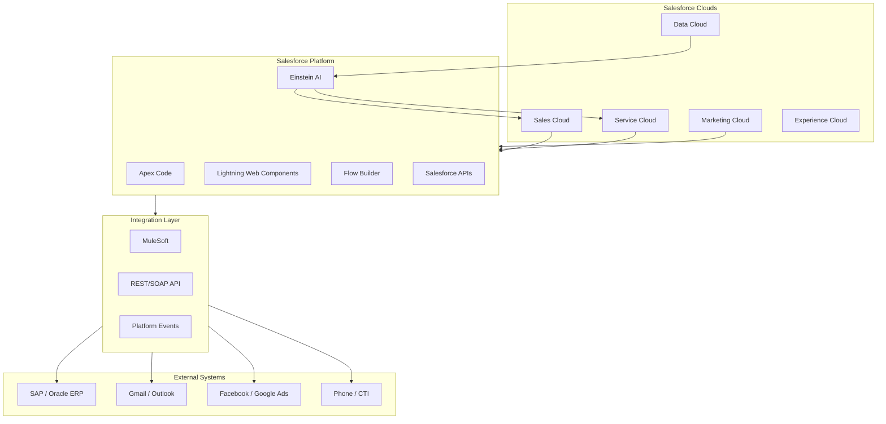
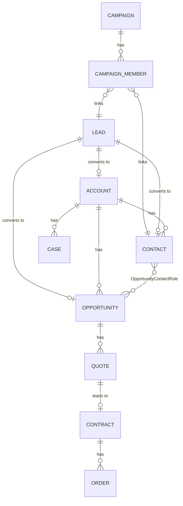

# CRM02 — Salesforce: Nền Tảng CRM Hàng Đầu Thế Giới

> **Tóm tắt:** Salesforce là platform CRM số 1 thế giới (market share ~22%, Gartner 2024), cung cấp hệ sinh thái toàn diện từ Sales Cloud, Service Cloud, Marketing Cloud đến Platform (Apex, Lightning). Tại Việt Nam, Salesforce được sử dụng bởi các enterprise lớn như FPT Software, Standard Chartered Vietnam, và nhiều công ty đa quốc gia. Module này đi sâu vào kiến trúc, objects, SOQL, ecosystem và roadmap sự nghiệp cho Salesforce professionals.

---

## Mục Lục

1. [Learning Objectives](#1-learning-objectives)
2. [Business Context](#2-business-context)
3. [Definitions](#3-definitions)
4. [Core Concepts](#4-core-concepts)
5. [Business Value](#5-business-value)
6. [Enterprise Role](#6-enterprise-role)
7. [Departments Related](#7-departments-related)
8. [Input](#8-input)
9. [Output](#9-output)
10. [Business Process](#10-business-process)
11. [Data Flow](#11-data-flow)
12. [Money Flow](#12-money-flow)
13. [Document Flow](#13-document-flow)
14. [Roles](#14-roles)
15. [Responsibilities](#15-responsibilities)
16. [RACI](#16-raci)
17. [Frameworks](#17-frameworks)
18. [International Standards](#18-international-standards)
19. [Vietnam Context](#19-vietnam-context)
20. [Legal Considerations](#20-legal-considerations)
21. [Common Mistakes](#21-common-mistakes)
22. [Best Practices](#22-best-practices)
23. [KPIs](#23-kpis)
24. [Metrics](#24-metrics)
25. [Reports](#25-reports)
26. [Templates](#26-templates)
27. [Checklists](#27-checklists)
28. [SOP](#28-sop)
29. [Case Study](#29-case-study)
30. [Small Business Example](#30-small-business-example)
31. [Enterprise Example](#31-enterprise-example)
32. [ERP Mapping](#32-erp-mapping)
33. [Automation Opportunities](#33-automation-opportunities)
34. [AI Opportunities](#34-ai-opportunities)
35. [Implementation Guide](#35-implementation-guide)
36. [Consulting Guide](#36-consulting-guide)
37. [Diagnostic Questions](#37-diagnostic-questions)
38. [Interview Questions](#38-interview-questions)
39. [Exercises](#39-exercises)
40. [References](#40-references)
41. [Output Formats](#output-formats)

---

## 1. Learning Objectives

Sau khi hoàn thành module này, học viên có thể:

- **Mô tả** kiến trúc Salesforce: multi-tenant cloud, metadata-driven, Trust Layer
- **Phân biệt** các Clouds: Sales Cloud, Service Cloud, Marketing Cloud, Experience Cloud, Platform
- **Hiểu** cấu trúc data model: Standard Objects (Lead, Account, Contact, Opportunity, Case) và Custom Objects
- **Viết** SOQL queries cơ bản để truy vấn dữ liệu Salesforce
- **So sánh** Lightning Experience vs Salesforce Classic và tại sao nên migrate
- **Khám phá** AppExchange ecosystem và cách đánh giá managed packages
- **Phân biệt** các role: Admin, Developer, Architect, Consultant và path certification
- **Hiểu** Apex (programming language) và Lightning Web Components ở mức khái niệm
- **Áp dụng** Salesforce vào bối cảnh enterprise Việt Nam

---

## 2. Business Context

### Tại Sao Salesforce Là Tiêu Chuẩn

Salesforce được thành lập năm 1999 bởi Marc Benioff với mô hình "No Software" — SaaS CRM đầu tiên. Đến 2024:
- **Revenue**: $34.9 tỷ USD (FY2024)
- **Market Share**: #1 CRM toàn cầu với 22%
- **Customers**: 150,000+ khách hàng toàn cầu
- **AppExchange**: 7,000+ ứng dụng từ ecosystem
- **Trailhead**: 3+ triệu learners

### Vì Sao Doanh Nghiệp VN Quan Tâm

**Enterprise VN cần Salesforce khi:**
- Quy mô > 100 sales reps, cần customization sâu
- Hoạt động đa quốc gia, cần multi-currency, multi-language
- Cần integrate với nhiều hệ thống phức tạp (SAP, Oracle, custom)
- Muốn build platform riêng (apps, portals) trên nền Salesforce
- Khách hàng/đối tác nước ngoài yêu cầu dùng Salesforce

**SME VN thường KHÔNG cần Salesforce:**
- Chi phí cao: $75-300+/user/tháng = 1.8M-7.2M/user/năm
- Cần Salesforce developer/admin chuyên dụng
- Quá phức tạp cho quy trình bán hàng đơn giản

### Xu Hướng Salesforce 2024-2026

- **Agentforce**: AI agents tích hợp sâu vào Salesforce (Marc Benioff đặt cược lớn)
- **Data Cloud**: CDP natively trong Salesforce
- **Einstein AI**: Predictive và Generative AI cho mọi Cloud
- **Industry Clouds**: Financial Services Cloud, Healthcare Cloud, Manufacturing Cloud

---

## 3. Definitions

### Salesforce Platform

**Salesforce** — Nền tảng CRM SaaS (Software as a Service) đa cloud, multi-tenant, metadata-driven, cho phép doanh nghiệp quản lý khách hàng, tự động hóa quy trình và xây dựng ứng dụng tùy chỉnh mà không cần infrastructure riêng.

### Các Thuật Ngữ Quan Trọng

| Thuật ngữ | Định nghĩa |
|----------|-----------|
| **Org** | Một instance Salesforce của một khách hàng |
| **Object** | Bảng dữ liệu trong Salesforce (tương đương table trong DB) |
| **Record** | Một dòng dữ liệu trong Object (tương đương row) |
| **Field** | Cột dữ liệu trong Object (tương đương column) |
| **SOQL** | Salesforce Object Query Language — ngôn ngữ query dữ liệu |
| **Apex** | Ngôn ngữ lập trình của Salesforce (giống Java) |
| **LWC** | Lightning Web Components — framework UI hiện đại |
| **Flow** | Công cụ automation không cần code (low-code) |
| **Sandbox** | Môi trường test (Dev/Staging) tách biệt Production |
| **Managed Package** | Ứng dụng từ AppExchange, được encapsulate |
| **Governor Limits** | Giới hạn hệ thống để bảo vệ multi-tenant performance |

---

## 4. Core Concepts

### 4.1 Salesforce Architecture

#### Multi-Tenant Architecture

```
┌─────────────────────────────────────────┐
│          Salesforce Platform            │
│  ┌────────┐ ┌────────┐ ┌────────┐      │
│  │ Org A  │ │ Org B  │ │ Org C  │      │
│  │ (VN)   │ │ (US)   │ │ (EU)   │      │
│  └────────┘ └────────┘ └────────┘      │
│         Shared Infrastructure           │
│    (App Server, DB, Storage, AI)        │
└─────────────────────────────────────────┘
```

**Lợi ích Multi-Tenant:**
- Không cần quản lý server/infrastructure
- Automatic upgrades (3 lần/năm: Spring, Summer, Winter releases)
- Dữ liệu của từng Org hoàn toàn tách biệt
- Scale tự động theo nhu cầu

#### Metadata-Driven Platform

Salesforce hoạt động dựa trên metadata: mọi cấu hình (fields, layouts, workflows, reports) đều là metadata, không phải hardcode. Điều này cho phép:
- Thay đổi cấu hình qua UI mà không cần deploy code
- Version control cho configuration
- Package và deploy sang Org khác dễ dàng

#### Trust Layer

Salesforce có trang **trust.salesforce.com** — real-time status của tất cả instances. Cam kết:
- 99.9% uptime SLA
- ISO 27001, SOC 2 Type II certified
- GDPR compliant

### 4.2 Salesforce Clouds

#### Sales Cloud (Core Product)

**Mục đích:** Quản lý toàn bộ quy trình bán hàng từ lead đến close

**Tính năng chính:**
- **Lead Management**: Capture, qualify, convert leads
- **Opportunity Management**: Pipeline tracking, stage management
- **Account & Contact Management**: 360° view của khách hàng
- **Activity Management**: Tasks, Events, Calls, Emails
- **Forecasting**: Revenue prediction với hierarchy
- **Einstein AI**: Predictive scoring, Next Best Action
- **Mobile CRM**: iOS/Android app đầy đủ tính năng

**Phù hợp với:** B2B sales teams, complex deal cycles, multi-stakeholder sales

#### Service Cloud

**Mục đích:** Hỗ trợ khách hàng omnichannel với tốc độ và chất lượng cao

**Tính năng chính:**
- **Case Management**: Ticket lifecycle, priority, escalation
- **Omni-Channel Routing**: Phân công ticket tự động theo load/skill
- **Knowledge Base**: Bài viết, FAQ cho agent và self-service
- **Live Chat / Messaging**: Chat real-time tích hợp vào Service Cloud
- **Field Service**: Cho technician ngoài thực địa
- **Einstein Bots**: Chatbot tự động xử lý câu hỏi phổ biến

#### Marketing Cloud (SFMC)

**Mục đích:** Omnichannel marketing automation ở quy mô enterprise

**Tính năng chính:**
- **Email Studio**: Email marketing với personalization
- **Journey Builder**: Thiết kế customer journey phức tạp
- **Advertising Studio**: Connect với Facebook/Google Ads
- **Social Studio**: Lắng nghe và publish social media
- **Mobile Studio**: SMS, Push Notifications
- **Data Studio**: Audience sharing với publishers

**Lưu ý:** Marketing Cloud là sản phẩm riêng biệt, tốn kém — chỉ phù hợp enterprise lớn. SME nên dùng Account Engagement (Pardot) hoặc HubSpot.

#### Account Engagement (Pardot)

B2B Marketing Automation tích hợp native với Sales Cloud. Phù hợp hơn Marketing Cloud cho B2B:
- Email nurturing sequences
- Lead scoring
- Form landing page builder
- Salesforce native integration (không cần ETL)

#### Experience Cloud (Community Cloud)

**Mục đích:** Xây dựng portal cho khách hàng, đối tác, nhân viên

**Use cases:**
- **Customer Portal**: Khách hàng xem đơn hàng, tạo ticket
- **Partner Portal**: Đối tác xem lead được chia sẻ, report deal
- **Employee Community**: Intranet, knowledge sharing

#### Salesforce Platform (PaaS)

**Mục đích:** Xây dựng custom applications trên nền Salesforce

**Công cụ:**
- **Apex**: Server-side code (triggers, classes, batch jobs)
- **Lightning Web Components**: Modern UI framework
- **Flow Builder**: Low-code automation
- **Salesforce Functions**: Serverless compute
- **Heroku**: Polyglot PaaS integration

### 4.3 Standard Objects và Data Model

#### Core Objects và Quan Hệ

```
Campaign ──→ CampaignMember
                  ↓
Lead ──────────────→ Contact ←── Account
                         ↓          ↑
                    Opportunity ────┘
                         ↓
                       Quote
                         ↓
                      Contract
                         ↓
                       Order
                         
Account ←── Case (Service)
Account ←── Contract
Contact ←── Case
```

#### Lead Object

**Mục đích:** Lưu thông tin khách hàng tiềm năng CHƯA được qualify

**Key fields:**
- `FirstName`, `LastName`: Họ tên
- `Email`, `Phone`, `MobilePhone`
- `Company`: Tên công ty
- `LeadSource`: Nguồn (Web, Phone, Partner, Advertisement...)
- `Status`: New, Working, Nurturing, Qualified, Unqualified
- `Rating`: Hot, Warm, Cold
- `Industry`, `AnnualRevenue`, `NumberOfEmployees`

**Convert Lead → Account + Contact + Opportunity** (quan trọng!)

#### Account Object

**Mục đích:** Tổ chức/công ty khách hàng (B2B) hoặc hộ gia đình/nhóm (B2C)

**Account Hierarchy:** Parent Account → Child Account (VD: Masan Group → Masan Consumer)

**Key fields:**
- `Name`: Tên công ty
- `Type`: Customer, Prospect, Partner, Competitor
- `Industry`: Ngành (F&B, Technology, Banking...)
- `AnnualRevenue`, `NumberOfEmployees`
- `BillingAddress`, `ShippingAddress`
- `OwnerId`: Salesrep phụ trách

#### Contact Object

**Mục đích:** Cá nhân liên hệ trong một Account

**Relationship với Account:** Many-to-One (nhiều Contact thuộc 1 Account)
**Relationship với Opportunity:** Many-to-Many thông qua OpportunityContactRole

**Key fields:**
- `FirstName`, `LastName`
- `AccountId`: Liên kết đến Account
- `Title`, `Department`
- `Email`, `Phone`
- `ReportsToId`: Báo cáo cho ai (hierarchy trong công ty)

#### Opportunity Object

**Mục đích:** Cơ hội bán hàng cụ thể đang trong quá trình theo đuổi

**Key fields:**
- `Name`: Tên deal (thường là Account - Product)
- `AccountId`: Liên kết Account
- `Amount`: Giá trị deal (VND/USD)
- `CloseDate`: Ngày dự kiến close
- `StageName`: Qualification, Proposal, Negotiation, Closed Won, Closed Lost
- `Probability`: % khả năng thắng (tự động theo Stage)
- `LeadSource`: Nguồn (từ Lead hoặc nhập tay)
- `ForecastCategory`: Pipeline, Best Case, Commit, Closed

#### Case Object (Service Cloud)

**Mục đích:** Ticket yêu cầu hỗ trợ từ khách hàng

**Key fields:**
- `Subject`, `Description`
- `Status`: New, In Progress, Escalated, Closed
- `Priority`: Low, Medium, High, Critical
- `Origin`: Email, Phone, Chat, Web
- `AccountId`, `ContactId`
- `OwnerId`: Agent phụ trách

### 4.4 SOQL — Salesforce Object Query Language

#### Cú Pháp Cơ Bản

```sql
SELECT field1, field2, field3
FROM ObjectName
WHERE condition
ORDER BY field ASC/DESC
LIMIT number
```

#### Ví Dụ SOQL Thực Tế

**Query 1: Lấy tất cả Opportunity đang mở > 100 triệu VND**
```sql
SELECT Id, Name, Amount, StageName, CloseDate, Account.Name
FROM Opportunity
WHERE IsClosed = false
  AND Amount > 100000000
  AND StageName NOT IN ('Closed Won', 'Closed Lost')
ORDER BY CloseDate ASC
LIMIT 50
```

**Query 2: Đếm lead theo nguồn trong tháng này**
```sql
SELECT LeadSource, COUNT(Id) leadCount
FROM Lead
WHERE CreatedDate = THIS_MONTH
GROUP BY LeadSource
ORDER BY COUNT(Id) DESC
```

**Query 3: Contact của Account với opportunity > 500 triệu**
```sql
SELECT c.FirstName, c.LastName, c.Email, c.Account.Name
FROM Contact c
WHERE c.AccountId IN (
    SELECT AccountId
    FROM Opportunity
    WHERE Amount > 500000000
      AND IsClosed = false
)
```

#### SOSL — Salesforce Object Search Language

Dùng để full-text search:
```sql
FIND {Masan} IN ALL FIELDS
RETURNING Account(Name, Industry), Contact(Name, Email), Opportunity(Name, Amount)
```

### 4.5 Lightning Experience vs Classic

| Tính năng | Lightning Experience | Salesforce Classic |
|----------|---------------------|-------------------|
| **UI Framework** | Modern, component-based | Old Flash/HTML |
| **Performance** | Nhanh hơn | Chậm hơn |
| **Mobile** | Responsive design | Limited |
| **AI Features** | Full Einstein | Hạn chế |
| **New Features** | Tất cả features mới | Không còn update |
| **LWC/Aura** | Supported | Hạn chế |
| **Migration** | Nên migrate NGAY | Deprecated 2026 |

**Kết luận:** Không nên dùng Classic cho bất kỳ triển khai mới nào. Classic sẽ bị EOL trong tương lai gần.

### 4.6 AppExchange Ecosystem

**AppExchange** là marketplace của Salesforce với 7,000+ ứng dụng.

**Phân loại:**
- **Managed Packages**: Code được đóng gói, không xem được source (Salesforce Labs, ISV Partners)
- **Unmanaged Packages**: Code mở, có thể customize (dùng cho demos, quick start)
- **Bolts**: Industry-specific templates
- **Flow Solutions**: Pre-built automation flows

**Apps nổi bật:**

| App | Danh mục | Giá |
|-----|---------|-----|
| DocuSign | E-Signature | Paid |
| Conga Composer | Document Generation | Paid |
| Gong.io | Revenue Intelligence | Paid |
| Twilio | SMS/Phone | Usage-based |
| Clearbit | Data Enrichment | Paid |
| DemandTools | Data Quality | Paid |

**Đánh giá AppExchange Package:**
1. Reviews và star rating
2. Security Review status (bắt buộc cho public apps)
3. Số installations
4. Support model (ISV hay Salesforce Labs?)
5. Compatibility với API version hiện tại

### 4.7 Salesforce Automation Tools

#### Thứ tự ưu tiên (Admin perspective)

```
1. Flow Builder ────────→ Dùng trước tiên (Low-code)
2. Approval Processes ──→ Nếu cần approval workflow
3. Apex Triggers ───────→ Khi Flow không đủ (Code)
4. Platform Events ─────→ Real-time event-based (Advanced)
```

#### Flow Builder

Thay thế cho Process Builder và Workflow Rules (deprecated):
- **Record-Triggered Flow**: Chạy khi record được tạo/sửa
- **Schedule-Triggered Flow**: Chạy theo lịch
- **Screen Flow**: Hướng dẫn user qua nhiều bước
- **Autolaunched Flow**: Chạy từ Apex hoặc external system

#### Apex Trigger Pattern

```java
trigger OpportunityTrigger on Opportunity (before insert, after update) {
    // Handler pattern (best practice)
    OpportunityTriggerHandler handler = new OpportunityTriggerHandler();
    
    if (Trigger.isBefore && Trigger.isInsert) {
        handler.onBeforeInsert(Trigger.new);
    }
    if (Trigger.isAfter && Trigger.isUpdate) {
        handler.onAfterUpdate(Trigger.new, Trigger.oldMap);
    }
}
```

---

## 5. Business Value

### Giá Trị Của Salesforce Với Enterprise

| Value Driver | Mô tả | Đo lường |
|-------------|-------|----------|
| **Single Source of Truth** | Tất cả dữ liệu KH trong 1 platform | Data accuracy % |
| **360° Customer View** | Toàn bộ lịch sử: sales, service, marketing | Time to find info |
| **Scalability** | Scale từ 10 đến 10,000 users không cần re-architecture | Onboarding time |
| **AppExchange ROI** | 7,000+ apps giải quyết mọi use case | Integration cost savings |
| **Einstein AI** | AI predictions không cần data science team riêng | Forecast accuracy |
| **Platform Flexibility** | Xây dựng custom apps cho mọi quy trình | Custom development cost |

### TCO (Total Cost of Ownership) Analysis

**Năm 1:**
```
Licenses: 10 users × $75/tháng (Professional) × 12 = $9,000 (~220M VND)
Implementation: $30,000-$80,000 (Salesforce partner VN)
Training: $5,000-$10,000
Total Year 1: ~$44,000-$99,000
```

**Lưu ý quan trọng:** Salesforce ROI thường dương từ năm 2 trở đi. Cần commit dài hạn.

---

## 6. Enterprise Role

Trong enterprise, Salesforce đóng vai trò **Customer Platform**:

```
Marketing Cloud/Pardot ────→ Salesforce Core (CRM) ←── Service Cloud
                                      ↑
                            Sales Cloud (Opportunity)
                                      ↓
                         SAP/Oracle ERP (via MuleSoft/Boomi)
                                      ↓
                            BI/Analytics (Tableau/Einstein)
```

**Salesforce trong Enterprise Architecture:**
- **CRM Layer**: Quản lý customer data và interactions
- **Integration Hub**: MuleSoft cho API-led connectivity
- **Analytics Layer**: Tableau + Einstein Analytics
- **Experience Layer**: Experience Cloud cho portals
- **Platform Layer**: Apex + LWC cho custom apps

---

## 7. Departments Related

| Phòng ban | Sử dụng Salesforce Cloud | Use case |
|----------|------------------------|---------|
| **Sales** | Sales Cloud | Pipeline, Forecasting |
| **Marketing** | Marketing Cloud / Pardot | Campaign, Lead Nurturing |
| **Customer Service** | Service Cloud | Case Management, SLA |
| **IT** | Platform, Integration | Admin, Developer |
| **Finance** | CPQ, Revenue Cloud | Quoting, Revenue Recognition |
| **Partner/Channel** | Experience Cloud | PRM Portal |
| **HR** | (không phải Salesforce) | WFM/HRM riêng |

---

## 8. Input

### Dữ Liệu Đầu Vào Salesforce

**Manual Entry:**
- Sales rep nhập lead từ business card, cold call
- Customer service agent tạo case từ email, phone
- Admin import CSV data

**Automated Integration:**
- Website forms → Salesforce Web-to-Lead
- Marketing emails → Click tracking vào Activity
- ERP → Account/Contact sync (bidirectional)
- Support email → Web-to-Case
- Chat platforms → Omni-channel Case creation

**External Data:**
- Data enrichment từ Clearbit, ZoomInfo, LinkedIn Sales Navigator
- Social media listening từ Social Studio
- Call recordings từ Gong/Chorus

---

## 9. Output

### Kết Quả Đầu Ra Salesforce

**Operational Reports:**
- Pipeline by Stage (Funnel chart)
- Activity Report (Calls made, Emails sent)
- Case Volume by Priority
- Win/Loss Report

**Management Reports:**
- Revenue Forecast (Commit vs Best Case vs Pipeline)
- Sales Rep Performance Dashboard
- Customer Health Score
- Marketing Campaign Attribution

**Integration Output:**
- API calls cho ERP (khi deal closed)
- Email/SMS cho customers
- Data cho Data Cloud/CDP
- Webhook events cho external systems

---

## 10. Business Process

### Salesforce-Enabled Quote-to-Cash Process

```
Marketing generates Lead
       ↓
Lead qualifies → Converted to Opportunity + Account + Contact
       ↓
Sales pursues Opportunity through Pipeline stages
       ↓
CPQ (Configure-Price-Quote) → Quote generated
       ↓
Quote approved (Approval Process) → Sent to customer
       ↓
Customer accepts → Contract created in Salesforce
       ↓
Opportunity Closed Won → Order created (or pushed to ERP)
       ↓
Service Cloud onboards customer
       ↓
Renewal reminder 90 days before contract expiry
```

### Case-to-Resolution Process (Service Cloud)

```
Customer contacts → Case created (Email/Chat/Phone/Portal)
       ↓
Omni-Channel routes to available agent
       ↓
Agent looks up Account/Contact history in 360° view
       ↓
Search Knowledge Base → Apply solution
       ↓
If complex → Escalate to Tier 2 / Engineering
       ↓
Resolution found → Case closed
       ↓
Auto CSAT survey sent (24h after close)
```

---

## 11. Data Flow

```
[External Sources]
Web Form ──────→ Web-to-Lead API ──→ Lead Object
Email Client ──→ Email Integration ──→ Activity
ERP ───────────→ MuleSoft/API ─────→ Account/Order
Social ─────────→ Social Studio ───→ Case/Activity
Call Center ───→ CTI Integration ──→ Activity/Case

[Salesforce Core Data]
Lead ──[Convert]──→ Account → Contact → Opportunity
                                            ↓
                                          Quote
                                            ↓
                                         Contract
                                            ↓
                                   [Closed Won] → Push to ERP

[Outbound]
Salesforce ──→ ERP (Sales Order, Customer Master)
Salesforce ──→ Marketing Cloud (Customer Journey)
Salesforce ──→ Data Cloud (Unified Profile)
Salesforce ──→ Tableau (Analytics)
Salesforce ──→ External via REST API/Webhooks
```

---

## 12. Money Flow

### Licensing Model

**Salesforce Pricing (USD/user/tháng, 2024):**

| Edition | Price | Target |
|---------|-------|--------|
| Essentials | $25 | Startup (<10 users) |
| Professional | $75 | SMB |
| Enterprise | $150 | Mid-Market |
| Unlimited | $300 | Enterprise |
| Einstein 1 | $500 | AI-first |

**Lưu ý cho VN:**
- Giá trên chưa bao gồm VAT và phí triển khai
- Annual contract, trả trước 1 năm
- Quy đổi: $150/user/tháng ≈ 3.6M VND/user/tháng

**Additional Costs:**
- Marketing Cloud: $1,250/tháng minimum
- Service Cloud: $25-300/user/tháng
- CPQ: $75/user/tháng (add-on)
- Data Cloud: $108,000/năm minimum

### Implementation Cost Estimate (VN Market)

| Scope | Chi phí ước tính |
|-------|----------------|
| Basic Sales Cloud (10-20 user) | $15,000-$30,000 |
| Full CRM (Sales + Service, 50 user) | $50,000-$120,000 |
| Enterprise (all clouds, integration) | $150,000-$500,000+ |
| Salesforce Partner VN rate | $50-$150/hour |

---

## 13. Document Flow

| Document | Tạo trong Salesforce | Lưu trữ | Chia sẻ |
|----------|---------------------|---------|--------|
| Quote/Báo giá | CPQ / Native Quote | Files (Salesforce) | Email từ Salesforce |
| Proposal | Template + Conga | Google Drive (link) | Email |
| Contract | Contract Object | Files + DocuSign | DocuSign |
| Case Notes | Case Comments | Case record | Email to customer |
| Knowledge Articles | Knowledge Base | Salesforce Knowledge | Portal / Email |
| Reports | Report Builder | Salesforce | Dashboard, Email schedule |

---

## 14. Roles

### Salesforce Job Roles

#### Salesforce Administrator

**Mô tả:** Quản trị viên hệ thống — không cần code, dùng declarative tools

**Trách nhiệm:**
- User management (create, deactivate, permission sets)
- Customize objects: fields, page layouts, record types
- Build Flows (automation không cần code)
- Report và Dashboard creation
- Data management: import, export, deduplication
- Sandbox management và deployment

**Certification:** Salesforce Certified Administrator (ADM-201)
**Lương tham khảo VN:** 15-25M/tháng

#### Salesforce Developer

**Mô tả:** Lập trình viên phát triển custom features trên Salesforce

**Kỹ năng:**
- Apex (server-side programming language)
- Lightning Web Components (LWC)
- SOQL/SOSL
- Salesforce APIs (REST, SOAP, Bulk, Streaming)
- Git + Salesforce DX

**Certification:** Platform Developer I, Platform Developer II
**Lương tham khảo VN:** 20-45M/tháng

#### Salesforce Architect

**Mô tả:** Thiết kế solution toàn diện, đưa ra quyết định kiến trúc

**Specializations:**
- Application Architect
- System Architect
- Integration Architect
- Data Architecture
- CTA (Certified Technical Architect) — highest cert

**Lương tham khảo VN:** 40-80M/tháng

#### Salesforce Functional Consultant

**Mô tả:** Kết nối business requirements với Salesforce capabilities

**Trách nhiệm:**
- Discovery workshops với client
- Solution design document
- User story writing
- UAT facilitation
- Training

**Certification:** Sales Cloud Consultant, Service Cloud Consultant
**Lương tham khảo VN:** 20-40M/tháng

---

## 15. Responsibilities

### Admin Daily Tasks
- Monitor system health, failed jobs, error emails
- Process user requests (new fields, reports, access)
- Review duplicates và merge records
- Triage Salesforce support tickets (Premier Support)

### Developer Sprint Tasks
- Requirement analysis với BA/Consultant
- Technical design và code review
- Unit testing (75% code coverage required for deployment)
- Deploy changes từ Sandbox → Production

### Architect Responsibilities
- Define data model và integration pattern
- Governor limits analysis
- Technical debt assessment
- Security và sharing model design

---

## 16. RACI

| Hoạt động | Admin | Developer | Architect | Consultant | PM | Business |
|----------|-------|-----------|-----------|-----------|-----|---------|
| User setup | R | - | - | C | I | I |
| Field creation | R | I | C | C | I | A |
| Flow automation | R | C | A | R | I | A |
| Apex coding | I | R | A | C | I | - |
| Integration design | C | C | R/A | I | I | I |
| Data migration | R | C | A | C | I | A |
| Deployment | C | R | A | C | I | - |
| User training | C | - | - | R/A | I | I |
| Report building | R | - | - | C | - | A |

---

## 17. Frameworks

### Salesforce Well-Architected Framework

**4 Pillars:**
1. **Trusted**: Security, reliability, compliance
2. **Easy**: Usability, low-code first
3. **Adaptable**: Flexible, extensible
4. **Connected**: Integration, data sharing

### Salesforce Implementation Methodology: Agile Accelerate

- Sprint-based delivery (2-week sprints)
- User stories với acceptance criteria
- Definition of Done bao gồm code coverage, documentation

### Salesforce DX (Developer Experience)

Modern development workflow:
```
VSCode + Salesforce Extension Pack
    ↓
Scratch Orgs (ephemeral dev environments)
    ↓
Version Control (Git)
    ↓
CI/CD Pipeline (GitHub Actions / Jenkins)
    ↓
Staging Sandbox → UAT → Production
```

### Apex Design Patterns

- **Trigger Handler Pattern**: Tách logic khỏi trigger
- **Service Layer Pattern**: Business logic trong separate class
- **Repository Pattern**: Data access tách biệt
- **Selector Pattern**: SOQL queries tập trung

---

## 18. International Standards

### Salesforce Compliance Certifications

| Certification | Relevance |
|-------------|---------|
| ISO 27001 | Information Security Management |
| SOC 2 Type II | Security, Availability, Confidentiality |
| GDPR | EU Data Protection |
| FedRAMP | US Federal Government |
| PCI DSS | Payment Card Industry |
| HIPAA | Healthcare (với BAA) |

### Salesforce Trust & Security

- **Shield**: Encryption at rest, Event Monitoring, Field Audit Trail (add-on)
- **Health Check**: Built-in security scanner
- **MFA**: Multi-factor authentication (bắt buộc từ 2022)
- **IP Restrictions**: Limit access by IP range
- **Session Settings**: Timeout, HTTPS only

---

## 19. Vietnam Context

### Doanh Nghiệp VN Dùng Salesforce

**Enterprise sử dụng Salesforce:**
- **FPT Software**: Sales Cloud cho global B2B sales (Japan, US, Europe)
- **Standard Chartered Vietnam**: Service Cloud cho banking customer service
- **AIA Vietnam**: Insurance sales và service
- **Manulife Vietnam**: Financial advisory management
- **Johnson & Johnson Vietnam**: Medical device sales
- **Unilever Vietnam**: Distributor management

**Đặc thù triển khai tại VN:**
- VND currency phải cấu hình riêng (Salesforce default USD)
- Multi-language: Tiếng Việt cho UI (Salesforce hỗ trợ)
- Timezone: Asia/Ho_Chi_Minh (ICT, UTC+7)
- Date format: DD/MM/YYYY (cần validate custom)

### Salesforce Partners Tại Việt Nam

| Partner | Specialization | Level |
|---------|---------------|-------|
| FPT Information System | Full-service | Platinum |
| KMS Technology | Development, Testing | Registered |
| Sota Digital | SMB implementation | Registered |
| Accenture Vietnam | Enterprise, Industry | Global SI |
| Deloitte Vietnam | Financial Services Cloud | Global SI |

### Thách Thức Riêng VN

1. **Tiếng Việt dữ liệu**: Unicode handling, tên riêng có dấu (Nguyễn, Trần)
2. **Tax/Invoice compliance**: Cần tích hợp với phần mềm hóa đơn điện tử (VNPT-Invoice, Viettel-Invoice)
3. **Local payment methods**: VNPay, Momo — cần custom integration
4. **Data residency**: Luật An Ninh Mạng yêu cầu lưu data ở VN, nhưng Salesforce data center gần nhất là Singapore/Japan
5. **Cost sensitivity**: $150/user/tháng = 3.6M VND — đây là chi phí lớn với công ty VN

---

## 20. Legal Considerations

### Data Residency Issue (Quan Trọng!)

**Vấn đề:** Điều 26, Luật An Ninh Mạng 2018 yêu cầu lưu trữ dữ liệu người dùng VN tại VN. Tuy nhiên, Salesforce data center gần nhất là Singapore.

**Hiện trạng thực tế:** Phần lớn enterprise VN chấp nhận rủi ro này vì:
- Chưa có hướng dẫn chi tiết về enforcement
- Nghị định hướng dẫn (NĐ 13/2023) có nhiều ngoại lệ
- Salesforce có Data Processing Addendum (DPA) GDPR-compliant

**Khuyến nghị:** Tham khảo tư vấn pháp lý trước khi triển khai, đặc biệt với ngành Tài chính-Ngân hàng-Bảo hiểm.

### PDPA — NĐ 13/2023/NĐ-CP

Salesforce hỗ trợ compliance thông qua:
- Privacy Center: Quản lý consent và data subject requests
- Data Mask: Ẩn PII trong Sandbox
- Event Monitoring: Audit log ai truy cập dữ liệu gì
- Field-Level Security: Granular access control

### Salesforce Data Processing Addendum

Khi ký hợp đồng Salesforce:
- Yêu cầu Data Processing Addendum (DPA) cho GDPR compliance
- Salesforce là Data Processor (không phải Data Controller)
- Standard Contractual Clauses (SCCs) cho cross-border transfer

---

## 21. Common Mistakes

### Sai Lầm Trong Triển Khai Salesforce

1. **Point-and-click trước, Apex sau** bị đảo ngược: Developer code Apex cho mọi thứ → overly complex, hard to maintain
   - Fix: Luôn thử Flow trước. Apex chỉ khi Flow không đáp ứng được.

2. **Không có sandbox strategy**
   - Vấn đề: Develop thẳng trên Production → break live data
   - Fix: Dev Sandbox → Full Sandbox (UAT) → Production

3. **Governor limits violations**
   - Vấn đề: SOQL trong vòng lặp → "Too many SOQL queries: 101" error
   - Fix: Bulkify code, sử dụng collections, lazy loading

4. **Không document customizations**
   - Vấn đề: Admin nghỉ việc → không ai biết custom fields dùng để làm gì
   - Fix: Mô tả (Description) cho mọi field, Flow, Apex class

5. **Over-customization**
   - Vấn đề: Tùy chỉnh quá nhiều → khó upgrade khi Salesforce release mới
   - Fix: Ưu tiên out-of-box features, chỉ customize khi thực sự cần

6. **Xây dựng sai data model ngay từ đầu**
   - Vấn đề: Đặt data ở sai object → sau này rất khó migrate
   - Fix: Thiết kế data model kỹ trước khi build

7. **Bỏ qua User Training**
   - Vấn đề: Beautiful system, nobody uses it
   - Fix: Train theo role, không train chung chung. Cung cấp sandbox để thực hành.

8. **Report = Dashboard nhầm lẫn**
   - Report: Bảng dữ liệu chi tiết (raw data)
   - Dashboard: Visualization tổng hợp từ nhiều reports

---

## 22. Best Practices

### Architecture Best Practices

1. **Declarative First**: Flow → Process Builder (deprecated) → Apex. Không dùng Apex khi Flow đủ.
2. **Separation of Concerns**: Tách trigger, handler, service, selector layers
3. **Bulkify Everything**: Code phải xử lý được 200 records cùng lúc
4. **Error Handling**: Try-catch với logging, không để errors âm thầm fail
5. **Test Coverage**: 75% minimum, nhưng aim for 90%+

### Admin Best Practices

6. **Least Privilege**: User chỉ có quyền tối thiểu cần thiết
7. **Field Label vs API Name**: Label thân thiện cho user, API name snake_case_c
8. **Record Types thoughtfully**: Không tạo record type nếu chỉ cần picklist
9. **Regular Data Audits**: Monthly duplicate check, weekly data quality review
10. **Change Management Log**: Document mọi thay đổi Production với date, reason, author

### Development Best Practices

11. **Source-Driven Development**: Salesforce DX + Git, không deploy manual
12. **Code Review**: Mọi PR cần 1 reviewer khác
13. **Named Credentials**: Không hardcode credentials, dùng Named Credentials
14. **Limit Custom Settings**: Dùng Custom Metadata Types thay Custom Settings

---

## 23. KPIs

### KPIs Cho Salesforce Admin

| KPI | Mục tiêu |
|-----|---------|
| **User Adoption Rate** | > 80% active users weekly |
| **Data Completeness** | > 90% mandatory fields filled |
| **Duplicate Rate** | < 2% records |
| **Case Resolution Time** | Meeting SLA > 95% |
| **Sandbox Refresh Cycle** | Full refresh quarterly |

### KPIs Cho Salesforce Developer

| KPI | Mục tiêu |
|-----|---------|
| **Code Coverage** | > 85% overall |
| **Deployment Success Rate** | > 95% first-time success |
| **Bug Escape Rate** | < 5% bugs found in Production |
| **Sprint Velocity** | Consistent delivery |

### Business KPIs Enabled By Salesforce

| KPI | Salesforce Feature |
|-----|------------------|
| **Forecast Accuracy** | Forecast module + Einstein |
| **Lead Response Time** | Assignment rules + Activity tracking |
| **Case Resolution Time** | Service Cloud + SLA |
| **Sales Cycle Length** | Opportunity stage tracking |

---

## 24. Metrics

### Technical Health Metrics

- **API Calls / Day**: Giới hạn theo edition (Enterprise: 1,000/user/day). Monitor để không bị throttled.
- **Storage Used**: File storage và data storage. Alert khi > 80%.
- **Batch Job Success Rate**: Scheduled Apex jobs. Alert nếu failure rate > 5%.
- **Flow Error Rate**: Track flow interview failures trong Setup > Paused and Failed Flow Interviews.
- **Login History**: Theo dõi failed logins (potential security breach).

### Business Performance Metrics

- **Pipeline Created per Rep per Month**: Leading indicator của future revenue
- **Stage Conversion Rate**: % deals moving from stage to stage
- **Days in Stage**: Bao lâu deals bị stuck ở mỗi stage
- **Win Rate by Product/Region/Rep**: Phân tích sâu để coaching

---

## 25. Reports

### Salesforce Native Report Types

**1. Tabular Report:** Danh sách đơn giản (VD: All Open Opportunities)

**2. Summary Report:** Group by field (VD: Opportunities by Stage)

**3. Matrix Report:** Row + Column grouping (VD: Opportunities by Rep vs Month)

**4. Joined Report:** Nhiều object trong 1 report (VD: Accounts với Cases AND Opportunities)

### Dashboard Components

- **Chart**: Bar, Line, Donut, Funnel, Scatter
- **Metric**: Single KPI number (VD: Total Pipeline This Month)
- **Table**: Top 10 deals by Amount
- **Gauge**: Progress to goal

### Essential Dashboards

1. **Sales Rep Dashboard**: My pipeline, my activities, my target
2. **Sales Manager Dashboard**: Team pipeline, forecast, performance ranking
3. **Service Dashboard**: Case volume, SLA compliance, CSAT
4. **Executive Dashboard**: Revenue vs target, win rate, top accounts

---

## 26. Templates

### Template: Salesforce Solution Design Document

```
PROJECT: [Tên dự án]
DATE: [Ngày]
VERSION: [1.0]

1. BUSINESS REQUIREMENTS
   - AS A [role], I WANT [feature] SO THAT [benefit]

2. SOLUTION APPROACH
   - Object: [Standard/Custom]
   - Automation: [Flow/Apex/Process Builder]
   - Integration: [API/Platform Event/Middleware]

3. DATA MODEL
   - New objects: [List]
   - New fields: [Object.FieldName (Type)]
   - Relationships: [Object A → Object B (type)]

4. SECURITY MODEL
   - OWD: [Private/Public Read/Public Read Write]
   - Sharing Rules: [Criteria/Owner-based]
   - Profiles/Permission Sets: [List]

5. GOVERNOR LIMITS ANALYSIS
   - SOQL queries: [Max expected per transaction]
   - DML statements: [Max expected per transaction]
   - Risk: [Low/Medium/High]

6. TEST PLAN
   - Unit tests: [List test scenarios]
   - UAT scenarios: [List]

7. DEPLOYMENT PLAN
   - Dev Sandbox → Staging → Production
   - Rollback plan: [Steps]
```

### Template: Salesforce Change Request

```
CHANGE REQUEST #[CRxxx]
Date: [DD/MM/YYYY]
Requested by: [Tên + phòng ban]
Priority: [Low/Medium/High/Critical]

DESCRIPTION:
[Mô tả thay đổi cần làm]

BUSINESS JUSTIFICATION:
[Tại sao cần thay đổi này?]

IMPACT ANALYSIS:
- Objects affected: [List]
- Users affected: [Number + roles]
- Reports affected: [List]

TESTING REQUIRED:
- [ ] Unit test (Developer)
- [ ] Integration test (Admin)
- [ ] UAT (Business)

ESTIMATED EFFORT: [hours]
DEPLOYMENT WINDOW: [Date/Time]
ROLLBACK PLAN: [Steps to undo]
```

---

## 27. Checklists

### Checklist: Salesforce Org Health Check

**Security:**
- [ ] MFA enabled for all users
- [ ] Password policy: minimum 8 chars, complexity required
- [ ] IP restrictions configured (nếu có văn phòng cố định)
- [ ] Login hours set cho non-admin users
- [ ] Profile với "Modify All" chỉ cho System Admin
- [ ] Last login review: deactivate user > 90 ngày không login

**Data Quality:**
- [ ] Duplicate Rules enabled cho Lead, Contact, Account
- [ ] Matching Rules cấu hình theo email + phone
- [ ] Required fields có validation rules phù hợp
- [ ] No orphaned records (Contact không có Account nếu cần)

**Automation:**
- [ ] No Process Builder (migrate sang Flow)
- [ ] No Workflow Rules (migrate sang Flow — deprecated 2025)
- [ ] All Apex has > 75% code coverage
- [ ] Scheduled jobs monitored và alerting configured

### Checklist: Go-Live Preparation

- [ ] All user stories accepted bởi business
- [ ] Data migration verified (record count, sample data check)
- [ ] Integration tested end-to-end
- [ ] Reports và dashboards verified với real data
- [ ] Training completed cho tất cả user roles
- [ ] Super users (champions) được identified và briefed
- [ ] Support plan in place (helpdesk email/phone)
- [ ] Rollback plan documented
- [ ] Executive sign-off obtained

---

## 28. SOP

### SOP-SF-001: Salesforce Release Management

**Mục tiêu:** Đảm bảo thay đổi được deploy an toàn, không break Production

**Environments:**
```
Developer Org / Dev Sandbox
        ↓ (deploy & test)
Full/Partial Sandbox (UAT)
        ↓ (UAT pass)
Staging Sandbox (Pre-prod)
        ↓ (smoke test)
Production
```

**Bước 1: Development**
- Developer tạo branch trong Git: `feature/CR-123-opportunity-stage`
- Build và test trong Dev Sandbox
- Code review qua Pull Request

**Bước 2: QA/UAT**
- Deploy vào Full Sandbox
- QA team chạy test scripts
- Business UAT: confirm acceptance criteria met

**Bước 3: Change Approval**
- Change Request form được submit
- Change Advisory Board (CAB) review (weekly)
- Approval từ Salesforce Admin Lead và Business Owner

**Bước 4: Deployment**
- Deploy trong maintenance window (thường 9PM-12PM)
- Post-deployment smoke test
- Document "Deployed successfully" trong Change Log

**Bước 5: Hypercare**
- Monitor 48h sau deployment
- Immediate rollback nếu critical issue

---

## 29. Case Study

### Case Study: FPT Software — Salesforce Sales Cloud Triển Khai Toàn Cầu

**Bối cảnh:**
FPT Software (subsidiary của FPT Corp) cung cấp IT outsourcing cho khách hàng Nhật Bản, Mỹ, châu Âu và APAC. Với hơn 27,000 nhân viên và doanh thu gần 1 tỷ USD, FPT Software cần hệ thống CRM thống nhất cho đội sales ở 30 quốc gia.

**Vấn đề trước khi có Salesforce:**
- Mỗi thị trường dùng Excel/Google Sheets riêng
- Không có global pipeline view cho C-suite
- Cùng khách hàng nhưng được sales ở Tokyo và San Jose tiếp cận độc lập
- Sales cycle dài 6-12 tháng mà không có visibility
- Forecast dựa trên "gut feeling" của Regional Directors

**Giải pháp Salesforce:**
- **Sales Cloud Enterprise**: Pipeline management, opportunity tracking
- **Custom Objects**: IT Project Estimation, Resource Demand (liên kết resource planning)
- **Territory Management**: Phân vùng theo Market Unit (Japan, US, Europe, APAC)
- **MuleSoft Integration**: Kết nối với SAP HR (tìm available resource) và SAP Finance (revenue booking)
- **Tableau CRM (Einstein Analytics)**: Executive dashboard real-time
- **Experience Cloud**: Partner portal cho channel partners

**Implementation Timeline:** 18 tháng (phased approach)
- Phase 1 (6 tháng): Core Sales Cloud, Japan + US market
- Phase 2 (6 tháng): Europe + APAC, integrations
- Phase 3 (6 tháng): Advanced analytics, Partner portal

**Kết quả đo lường được:**
- **Pipeline visibility**: Từ 40% lên 100% (tất cả deals trong Salesforce)
- **Win Rate**: 18% → 26% (+44%)
- **Forecast Accuracy**: 65% → 87%
- **Sales Cycle**: 7 tháng → 5.2 tháng (-26%)
- **Cross-market conflicts**: Giảm 80% (duplicate account detection)
- **ROI**: Positive ROI từ tháng 20

**Bài học:**
1. Executive mandate là critical — CEO Marc Benioff is không đủ, cần CEO của FPT Software cũng "dùng Salesforce hàng ngày"
2. Data quality là prerequisite — 3 tháng đầu chỉ là data cleanup
3. Change management quan trọng hơn technical implementation với global team
4. Don't customize too early — dùng standard features 6 tháng trước khi custom

---

## 30. Small Business Example

### Ví Dụ: Công Ty Phân Phối Medical Device (20 nhân viên)

**Bối cảnh:** Công ty phân phối thiết bị y tế nhập khẩu từ Mỹ/Đức, khách hàng là bệnh viện, phòng khám tư nhân tại TP.HCM và Hà Nội.

**Tại sao chọn Salesforce thay vì AMIS CRM?**
- Khách hàng (distributor của Medtronic) yêu cầu dùng Salesforce để đồng bộ deal registration
- Cần Sales Cloud và Health Cloud (industry-specific)
- Technical team đủ năng lực (1 in-house admin + Salesforce partner)

**Cấu hình được thực hiện:**
- Custom Object: `Medical_Device_c` (sản phẩm với FDA registration, CE marking)
- Custom Field trên Account: `Hospital_Type_c` (Public/Private/FDI)
- Record Type trên Opportunity: Capital Equipment vs Consumables
- Approval Process: Deal > 500M VND cần VP Sales approve
- Dashboard: Territory performance by province

**Kết quả:**
- Deal registration với nhà sản xuất nước ngoài được đồng bộ tự động
- Sales cycle giảm 15% (không mất thời gian hỏi "deal này ai đang làm?")
- Win Rate tăng 25% do không conflict giữa sales reps

**Cost:** $75/user × 8 users = $600/tháng (~14.4M VND/tháng)
**ROI:** Tăng 1 deal win/tháng × 200M avg = 200M/tháng → ROI 1,289%

---

## 31. Enterprise Example

### Ví Dụ: AIA Vietnam — Insurance Sales Cloud

**Bối cảnh:** AIA Vietnam (bảo hiểm nhân thọ, hơn 200,000 tư vấn tài chính) cần digital platform để quản lý đội ngũ agent và customer relationship.

**Thách thức:**
- 200,000+ agents, data rải rác tại các Chi nhánh
- Cần track policy referrals và commissions
- Compliance với Bộ Tài Chính về báo cáo
- Mobile-first vì agents làm việc ngoài thực địa

**Giải pháp:**
- Salesforce Financial Services Cloud (FSC): Tối ưu cho insurance/banking
- Custom Mobile App trên Salesforce Platform
- MuleSoft tích hợp với Policy Admin System (legacy)
- Einstein AI: Next Product Recommendation cho agents

**Kết quả:**
- Agent onboarding time: 2 tuần → 3 ngày
- Policy issuance cycle: 7 ngày → 2 ngày
- Cross-sell per agent: tăng 35%
- Agent retention rate: tăng 20% (tool tốt hơn → agent happy hơn)

---

## 32. ERP Mapping

### Salesforce → SAP Integration (Most Common Enterprise Pattern)

| Salesforce Object | SAP Object | Sync Direction | Trigger |
|------------------|-----------|---------------|---------|
| Account | BP (Business Partner) | Bidirectional | Create/Update |
| Opportunity (Closed Won) | Sales Quotation → Sales Order | SF → SAP | Stage = Closed Won |
| Quote | SAP Quotation | Bidirectional | Created/Accepted |
| Contract | SAP Contract (VA41) | SF → SAP | Status = Activated |
| Product Catalog | Material Master | SAP → SF | Daily sync |
| Invoice (reference) | FI Invoice | SAP → SF | Posted |

### Integration Patterns

**1. MuleSoft Anypoint Platform (Native Salesforce)**
- Best cho complex, enterprise-grade integrations
- Out-of-box Salesforce connectors
- API management capabilities

**2. REST API Direct Integration**
- Salesforce REST API → Custom middleware
- Use case: Simple, one-way sync
- Ví dụ: ERP posts Invoice data vào Salesforce via REST

**3. Platform Events (Real-time)**
- Salesforce publish event → ERP subscribes
- Dùng cho real-time triggers (VD: Closed Won → ngay lập tức tạo SO trong SAP)

### Với MISA AMIS (SME VN Scenario)

Nếu dùng MISA AMIS Kế Toán + Salesforce:
- Cần custom middleware (Zapier/Make hoặc custom API)
- AMIS có Open API nhưng limited
- Alternative: Export từ Salesforce → Import vào AMIS (manual, not ideal)

---

## 33. Automation Opportunities

### Declarative Automation (Flow)

| Use Case | Flow Type | Complexity |
|---------|----------|-----------|
| Create Task khi Opportunity stage thay đổi | Record-Triggered | Low |
| Send Email khi Case unresolved > 24h | Schedule-Triggered | Low |
| Multi-step onboarding wizard cho new customer | Screen Flow | Medium |
| Complex approval routing dựa trên amount + territory | Approval Process | Medium |
| Sync Salesforce data với external system | Flow + HTTP callout | High |

### Apex Automation

| Use Case | Pattern | Complexity |
|---------|---------|-----------|
| Real-time validation phức tạp khi save record | Before Trigger | Medium |
| Integration với external API khi record saved | After Trigger + @future | High |
| Nightly batch processing 100k+ records | Schedulable + Batchable | High |
| Queueable jobs cho async processing | Queueable | Medium |

### Einstein AI Automation

- **Einstein Lead Scoring**: Tự động score lead dựa trên historical data
- **Einstein Opportunity Scoring**: Probability dự đoán thực tế (vs manual)
- **Einstein Activity Capture**: Tự động sync Gmail/Outlook email vào Salesforce
- **Einstein Next Best Action**: Gợi ý hành động tối ưu cho sales rep

---

## 34. AI Opportunities

### Einstein Platform AI (Built-in)

**1. Einstein Lead Scoring**
- Phân tích historical win/loss patterns
- Score lead mới từ 1-100 (khả năng convert)
- Minimal setup: 1,000+ historical leads để train
- VN Application: Cần ~6 tháng data trước khi Einstein đủ dữ liệu train

**2. Einstein Opportunity Insights**
- Cảnh báo: "Deal này có nguy cơ slipping"
- Gợi ý: "Khách hàng tương tự đã chốt khi được offer ROI calculator"
- Yêu cầu: Sales Cloud Einstein add-on (~$50/user/tháng)

**3. Einstein Activity Capture**
- Tự động sync email Gmail/Outlook vào Salesforce Activities
- No manual data entry cho email
- Privacy concern: Cần inform users về email monitoring

**4. Agentforce (2024-2025, New!)**
- AI Agents tự động xử lý tasks thay human
- **Sales Agent**: Tự động nurture leads, draft email, schedule meeting
- **Service Agent**: Giải quyết 80% tickets thông thường mà không cần human
- **Marketing Agent**: Tự động create và optimize campaigns

**5. Einstein Copilot**
- Generative AI assistant trong Salesforce UI
- Ask in natural language: "Show me all at-risk deals in Q3"
- Draft email cho opportunity: "Write a follow-up email for this prospect"
- Summarize: "Summarize the last 3 months of activity with this account"

**VN-specific AI consideration:**
- Einstein models được train chủ yếu trên data tiếng Anh
- Tiếng Việt support đang cải thiện nhưng chưa hoàn toàn
- Workaround: Dùng tiếng Anh cho field values, tiếng Việt cho notes

---

## 35. Implementation Guide

### Salesforce Implementation Phases

**Phase 0: Discovery & Design (4-6 tuần)**

Deliverables:
- Business Requirements Document (BRD)
- Solution Design Document (SDD)
- Data Model Diagram
- Integration Architecture Diagram
- Project Plan (sprints)
- Risk Register

**Phase 1: Foundation (4-6 tuần)**

Deliverables:
- Org setup: Users, Profiles, Roles hierarchy
- Data model: Objects, Fields, Relationships
- Security model: OWD, Sharing Rules
- Core automation: Assignment rules, basic Flows
- Data migration planning

**Phase 2: Core Features (6-8 tuần)**

Deliverables:
- Pipeline configuration
- Email templates
- Report & Dashboard basic set
- Integration development (if any)
- Training materials

**Phase 3: UAT & Go-Live (2-4 tuần)**

Deliverables:
- UAT session với business users
- Data migration execution
- Go-live checklist completed
- Hypercare plan

**Phase 4: Optimization (Ongoing)**

Deliverables:
- Monthly admin sprints
- New feature requests processed
- Performance tuning
- Advanced Einstein AI features

### Staffing Requirements

| Phase | Roles Needed |
|-------|-------------|
| Discovery | Consultant (2), BA (1), Architect (1 part-time) |
| Implementation | Admin (1), Developer (1-2), Consultant (1), PM (1) |
| Go-Live | All + extra support staff |
| Post Go-Live | Admin (1 FTE), Developer (part-time retainer) |

---

## 36. Consulting Guide

### Khi Đề Xuất Salesforce Cho Khách Hàng

**Điều kiện "Green Light" cho Salesforce:**
- Revenue > $5M USD hoặc doanh thu > 100 tỷ VND
- Đội sales > 20 người
- Cần integrate với nhiều hệ thống phức tạp
- Có IT team hoặc có thể thuê SF Admin/Dev
- Có kế hoạch scale quốc tế
- Ngành yêu cầu compliance cao (Banking, Insurance, Healthcare)

**Điều kiện "Red Flag" — Đừng đề xuất Salesforce:**
- SME < 20 nhân viên, ngân sách < 500M VND/năm
- Không có IT budget để maintain
- Sales process quá đơn giản (chỉ cần phonebook + pipeline)
- Timeline triển khai < 3 tháng (unrealistic)
- Không có executive champion

**Đề Xuất Thay Thế Cho SME VN:**
- AMIS CRM: Tốt cho SME có MISA ecosystem
- Base.vn: Enterprise-grade nhưng giá VN, hỗ trợ tiếng Việt tốt
- HubSpot: Nếu marketing-driven business

### Pricing Negotiation Tips

- Salesforce thường give discount 20-40% cho new customers
- Annual upfront vs quarterly billing: 15-20% discount
- Bundle deals: Thêm Service Cloud vào Sales Cloud deal
- Negotiation leverage: Có offer từ Microsoft Dynamics
- Fiscal year end (Jan 31): Sales quota pressure → better deals

---

## 37. Diagnostic Questions

### Hỏi Khách Hàng Để Assess Salesforce Fit

**Technical:**
1. Bạn có bao nhiêu hệ thống cần integrate với CRM (ERP, email, phone, billing)?
2. Bạn có internal developer/IT team không?
3. Bạn có data ở đâu hiện tại và format như thế nào?

**Business:**
4. Sales process của bạn phức tạp đến mức nào? (Số bước, số stakeholders, timeline)
5. Bạn có bán ở nhiều quốc gia/currency không?
6. Revenue của bạn bao nhiêu và growth target trong 3 năm tới?

**Budget:**
7. Ngân sách hàng năm cho CRM là bao nhiêu (license + implementation + maintenance)?
8. Bạn đã dùng gì trước đây và đã bỏ bao nhiêu tiền vào đó?

**People:**
9. Ai sẽ là Salesforce Admin sau khi go-live?
10. Executive nào sẽ champion dự án và dùng dashboard hàng ngày?

---

## 38. Interview Questions

### Salesforce Admin Interview

**Basic:**
1. Sự khác nhau giữa Profile và Permission Set trong Salesforce?
2. OWD (Org-Wide Default) là gì? Giải thích các options.
3. Khi nào dùng Validation Rule vs Required Field?
4. Formula Field vs Rollup Summary Field — khác nhau thế nào?

**Intermediate:**
5. Bạn sẽ troubleshoot như thế nào khi user phàn nàn không thấy record dù bạn đã share?
6. Sự khác nhau giữa Flow và Workflow Rule? Cái nào nên dùng cho use case mới?
7. Sandbox types (Developer, Developer Pro, Partial, Full) — khi nào dùng cái nào?

**Advanced:**
8. Explain data skew và tại sao nó ảnh hưởng đến performance?
9. Thiết kế sharing model cho một company có 3 cấp territory: National → Regional → Local.
10. Làm thế nào để implement "the most recently touched Account by a user" hiệu quả?

### Salesforce Developer Interview

**Technical:**
1. Governor Limits là gì? Tại sao Salesforce có giới hạn này?
2. Viết trigger Apex để tự động update Account khi Opportunity Closed Won.
3. Sự khác nhau giữa `@future`, `Queueable`, `Batchable` trong Apex async?
4. LWC vs Aura Components — tại sao LWC là future?
5. Khi nào dùng Platform Events vs Change Data Capture?

---

## 39. Exercises

### Bài Tập Thực Hành

**Bài 1: Tạo Salesforce Developer Org (Free)**
- Đăng ký tại developer.salesforce.com
- Tạo 5 Custom Fields cho Opportunity Object
- Build 1 Flow tự động tạo Task khi Opportunity stage = "Proposal Sent"
- Tạo 1 Dashboard với 3 components: Pipeline Chart, Top Deals Table, Activities This Week

**Bài 2: SOQL Practice**
Viết SOQL queries cho:
- Tất cả Accounts có Annual Revenue > 1 triệu USD
- Opportunities closing this quarter theo Stage
- Contacts tại công ty trong ngành "Technology" ở Việt Nam
- Count số Opportunities per Account (subquery)

**Bài 3: Data Model Design**
Thiết kế data model trong Salesforce cho công ty bán phần mềm SaaS:
- Cần track: Customers, Subscriptions, Feature Requests, Renewals
- Xác định: Standard Objects có thể dùng, Custom Objects cần tạo, Relationships
- Vẽ ERD diagram

**Bài 4: Integration Design**
Một công ty dùng Salesforce Sales Cloud + MISA Kế Toán + Zalo OA. Thiết kế integration architecture:
- Zalo lead → Salesforce Lead (real-time)
- Salesforce Closed Won → MISA Kế Toán (Sales Order)
- MISA Invoice → Salesforce (Payment status update)
Xác định: Tools/middleware, direction, trigger, frequency

**Bài 5: Trailhead Paths**
Hoàn thành các Trailhead modules sau (free):
- "Salesforce Platform Basics"
- "Data Modeling"
- "Flow Basics"
- "Reports & Dashboards for Lightning Experience"
Tổng ước tính: 8-12 giờ học

---

## 40. References

### Official Salesforce Resources

- **Salesforce Documentation**: help.salesforce.com
- **Trailhead** (Free Learning): trailhead.salesforce.com
- **Developer Docs**: developer.salesforce.com
- **AppExchange**: appexchange.salesforce.com
- **Salesforce Blog**: salesforce.com/blog
- **Trust Status**: trust.salesforce.com

### Certification Paths

| Level | Certification | Prerequisite |
|-------|-------------|-------------|
| Entry | Salesforce Associate | None |
| Admin | Admin (ADM-201) | 6 months admin experience |
| Dev | Platform Developer I | Programming knowledge |
| Consultant | Sales Cloud Consultant | Admin cert + 2 years exp |
| Architect | Application Architect | Multiple certs |
| Elite | CTA (Certified Technical Architect) | 5+ years + board review |

### Books

- **"Salesforce for Beginners"** — Sharif Shaalan
- **"Salesforce Lightning Platform Enterprise Architecture"** — Andrew Fawcett
- **"Apex Design Patterns"** — Jitendra Zaa, Anshul Verma

### VN Community

- Salesforce Vietnam User Group (Facebook/LinkedIn)
- Trailblazer Community Vietnam: trailblazers.salesforce.com
- FPT IS Salesforce Practice Blog

---

## Output Formats

### Mermaid Diagram: Salesforce Cloud Architecture



### Mermaid Diagram: Salesforce Object Relationships



---

### Flashcards

**Flashcard 1:**
> **Q:** Salesforce Governor Limits là gì và tại sao quan trọng cho developer?
>
> **A:** Governor Limits là giới hạn hệ thống của Salesforce nhằm bảo vệ multi-tenant architecture — đảm bảo một Org không thể chiếm dụng tài nguyên ảnh hưởng đến Org khác. Ví dụ quan trọng nhất: **100 SOQL queries per transaction** (synchronous) và **150 DML statements per transaction**. Sai lầm phổ biến nhất: Đặt SOQL query trong vòng lặp `for`. Fix: Luôn query trước vòng lặp, dùng Collections (Map, List, Set). Code vi phạm governor limits sẽ throw exception và fail — không thể deploy lên Production nếu test coverage không đạt 75%.

**Flashcard 2:**
> **Q:** Khi nào dùng Flow vs Apex Trigger trong Salesforce automation?
>
> **A:** Rule: **Flow trước, Apex sau**. Flow (declarative, không cần code) đủ cho ~80% use cases: create/update records, send emails, create tasks, basic branching logic. Chọn Apex khi: (1) Logic quá phức tạp cho Flow; (2) Cần gọi external API với complex payload; (3) Need sub-second performance với large data volumes; (4) Complex string manipulation hoặc math không làm được trong Flow. Flow Benefits: Business users có thể maintain, deploy không cần code review, dễ troubleshoot. Apex Benefits: Full programming power, better performance at scale, can call all Governor-limited operations. **Salesforce best practice 2024**: Tuyệt đối không dùng Process Builder/Workflow Rules cho mới — chỉ Flow.

**Flashcard 3:**
> **Q:** Giải thích Salesforce Sharing Model: OWD, Roles, Sharing Rules hoạt động như thế nào?
>
> **A:** Salesforce security theo model "most restrictive first, then open up": (1) **OWD (Org-Wide Default)**: Baseline access cho tất cả records của một object. Private = chỉ owner thấy; Public Read = tất cả có thể đọc; Public Read/Write = tất cả có thể sửa. (2) **Role Hierarchy**: User ở role cao hơn tự động thấy records của user cấp dưới (roll-up access). VD: Sales Director thấy hết records của tất cả Sales Reps. (3) **Sharing Rules**: Chia sẻ thêm dựa trên criteria hoặc ownership. VD: "Chia sẻ tất cả Opportunities tại Hà Nội với Hanoi Sales Team". (4) **Manual Sharing**: User tự chia sẻ record cụ thể. Thứ tự luôn là: OWD → Roles → Sharing Rules → Manual, không bao giờ restrict hơn OWD (trừ dùng Apex managed sharing).

---

### JSON Metadata

```json
{
  "module": {
    "code": "CRM02",
    "name": "Salesforce",
    "domain": "CRM System",
    "category": "CRM Platform",
    "level": "Intermediate to Advanced",
    "difficulty": "advanced",
    "estimated_study_time_hours": 16,
    "last_updated": "2026-06-30",
    "version": "1.0",
    "status": "active",
    "language": "vi",
    "author": "Business OS Handbook"
  },
  "salesforce_products": {
    "sales_cloud": {
      "description": "Core CRM for sales teams",
      "pricing_usd_per_user_month": {"essentials": 25, "professional": 75, "enterprise": 150, "unlimited": 300},
      "target": "B2B Sales Teams"
    },
    "service_cloud": {
      "description": "Customer service and support",
      "target": "Customer Service Teams"
    },
    "marketing_cloud": {
      "description": "Enterprise omnichannel marketing",
      "minimum_price_usd_month": 1250,
      "target": "Enterprise Marketing Teams"
    }
  },
  "certifications": [
    {"name": "Salesforce Administrator", "code": "ADM-201", "level": "entry"},
    {"name": "Platform Developer I", "code": "PDI", "level": "intermediate"},
    {"name": "Sales Cloud Consultant", "code": "SCC", "level": "intermediate"},
    {"name": "Certified Technical Architect", "code": "CTA", "level": "elite"}
  ],
  "vietnam_context": {
    "enterprise_users": ["FPT Software", "Standard Chartered Vietnam", "AIA Vietnam", "Manulife Vietnam"],
    "local_partners": ["FPT Information System", "Accenture Vietnam", "Deloitte Vietnam"],
    "challenges": ["Data residency Law on Cybersecurity 2018", "Cost sensitivity", "Vietnamese language AI limitations"],
    "data_center_nearest": "Singapore / Japan"
  },
  "related_modules": [
    {"code": "CRM01", "name": "CRM System", "relationship": "prerequisite"},
    {"code": "CRM03", "name": "HubSpot", "relationship": "comparison"},
    {"code": "CRM04", "name": "CDP", "relationship": "extension"}
  ],
  "key_technologies": ["Apex", "Lightning Web Components", "SOQL", "Flow Builder", "MuleSoft", "Einstein AI", "Agentforce"],
  "tags": ["salesforce", "crm", "sales-cloud", "service-cloud", "apex", "soql", "lwc", "einstein", "enterprise"]
}
```

---

*Module CRM02 — Phiên bản 1.0 | Business Operating System Handbook | Cập nhật: 2026-06-30*
