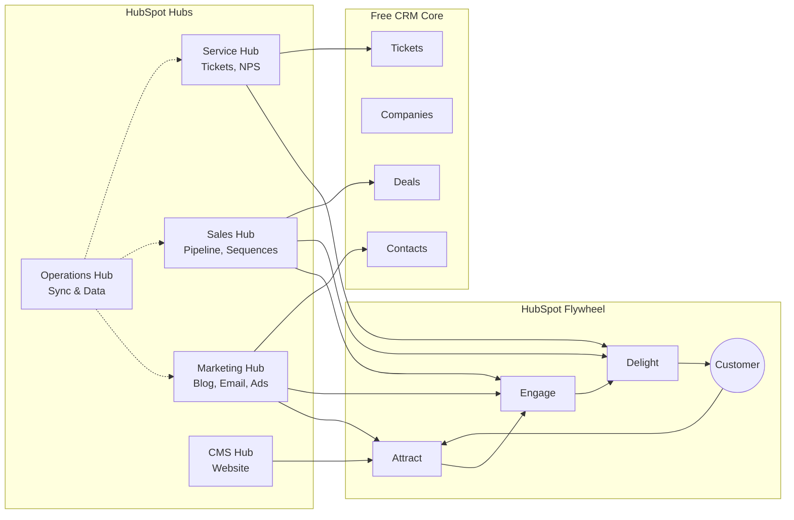
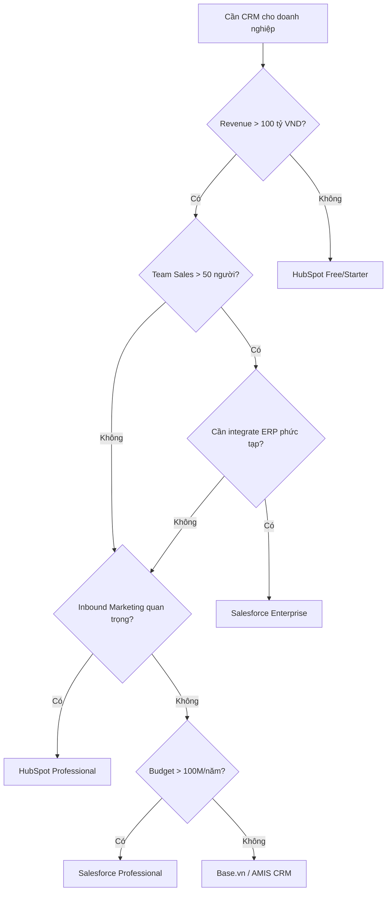

# CRM03 — HubSpot: Nền Tảng Inbound Marketing & CRM Tất Cả Trong Một

> **Tóm tắt:** HubSpot là platform All-in-One bao gồm CRM miễn phí + Marketing Hub + Sales Hub + Service Hub + CMS Hub + Operations Hub. Được xây dựng trên triết lý Inbound Marketing (thu hút khách hàng thay vì quảng cáo gián đoạn) và Flywheel model (thay thế Sales Funnel truyền thống). HubSpot đặc biệt phù hợp với SME và mid-market tại Việt Nam nhờ free tier mạnh, dễ sử dụng và mô hình pricing transparent. Module này so sánh sâu HubSpot vs Salesforce và hướng dẫn chọn đúng platform cho từng trường hợp.

---

## Mục Lục

1. [Learning Objectives](#1-learning-objectives)
2. [Business Context](#2-business-context)
3. [Definitions](#3-definitions)
4. [Core Concepts](#4-core-concepts)
5. [Business Value](#5-business-value)
6. [Enterprise Role](#6-enterprise-role)
7. [Departments Related](#7-departments-related)
8. [Input](#8-input)
9. [Output](#9-output)
10. [Business Process](#10-business-process)
11. [Data Flow](#11-data-flow)
12. [Money Flow](#12-money-flow)
13. [Document Flow](#13-document-flow)
14. [Roles](#14-roles)
15. [Responsibilities](#15-responsibilities)
16. [RACI](#16-raci)
17. [Frameworks](#17-frameworks)
18. [International Standards](#18-international-standards)
19. [Vietnam Context](#19-vietnam-context)
20. [Legal Considerations](#20-legal-considerations)
21. [Common Mistakes](#21-common-mistakes)
22. [Best Practices](#22-best-practices)
23. [KPIs](#23-kpis)
24. [Metrics](#24-metrics)
25. [Reports](#25-reports)
26. [Templates](#26-templates)
27. [Checklists](#27-checklists)
28. [SOP](#28-sop)
29. [Case Study](#29-case-study)
30. [Small Business Example](#30-small-business-example)
31. [Enterprise Example](#31-enterprise-example)
32. [ERP Mapping](#32-erp-mapping)
33. [Automation Opportunities](#33-automation-opportunities)
34. [AI Opportunities](#34-ai-opportunities)
35. [Implementation Guide](#35-implementation-guide)
36. [Consulting Guide](#36-consulting-guide)
37. [Diagnostic Questions](#37-diagnostic-questions)
38. [Interview Questions](#38-interview-questions)
39. [Exercises](#39-exercises)
40. [References](#40-references)
41. [Output Formats](#output-formats)

---

## 1. Learning Objectives

Sau khi hoàn thành module này, học viên có thể:

- **Giải thích** triết lý Inbound Marketing và Flywheel model — tại sao HubSpot được thiết kế như vậy
- **Mô tả** 6 Hubs của HubSpot và use case của từng Hub
- **Phân biệt** Free, Starter, Professional, Enterprise tiers và biết khi nào upgrade
- **Thiết kế** automation workflow cho lead nurturing, email sequences, chatbots
- **So sánh** HubSpot vs Salesforce và đưa ra khuyến nghị cho từng trường hợp cụ thể
- **Áp dụng** HubSpot vào SME Việt Nam: setup, migration từ Excel/Zalo, adoption
- **Sử dụng** Playbooks, Sequences, và Conversations Inbox cho Sales Hub
- **Đo lường** ROI của HubSpot qua Attribution Reports và Revenue Attribution
- **Hiểu** HubSpot Academy certification paths và giá trị trong thị trường VN

---

## 2. Business Context

### HubSpot — Từ Blog Tool Đến Platform Toàn Diện

HubSpot được thành lập năm 2006 bởi Brian Halligan và Dharmesh Shah tại MIT, với luận điểm: **Inbound Marketing tốt hơn Outbound Marketing**. Thay vì mua ads, cold call và spam email, hãy tạo nội dung tốt để khách hàng tự tìm đến.

**Timeline:**
- 2006: Thành lập, focus vào marketing software
- 2014: IPO trên NYSE, ra mắt CRM miễn phí
- 2018: Mở rộng Service Hub
- 2020: Đổi từ Funnel sang Flywheel model
- 2022: Operations Hub (data sync)
- 2023: AI Tools tích hợp (ChatSpot, Content Assistant)
- 2024: Breeze AI platform launch

### Market Position

- **Revenue FY2023**: $2.2 tỷ USD
- **Customers**: 200,000+ khách hàng ở 120+ quốc gia
- **Focus**: SMB và Mid-Market (contrast với Salesforce focus on Enterprise)
- **Differentiator**: All-in-one, easy to use, transparent pricing, free CRM

### Tại Sao HubSpot Phù Hợp VN

**Điểm mạnh với thị trường VN:**
1. **Free CRM** mạnh — phù hợp cho startup không có ngân sách
2. **HubSpot Academy** miễn phí — tài nguyên học tập tốt nhất ngành
3. **Dễ dùng** — sales rep VN không cần training dài ngày
4. **Starter $20/tháng** — chỉ 500K VND/tháng, cực kỳ accessible
5. **Tích hợp Zalo** qua third-party (Zapier, Make) — phù hợp thị trường VN
6. **Agency ecosystem** — nhiều digital agency VN dùng HubSpot cho clients

---

## 3. Definitions

### HubSpot CRM

**HubSpot CRM** — Hệ thống quản lý khách hàng miễn phí (Free Forever) được cung cấp bởi HubSpot Inc., đóng vai trò nền tảng dữ liệu chung cho tất cả các Hubs khác. Khác với Salesforce cần mua license CRM, HubSpot CRM là free và không giới hạn users.

### Thuật Ngữ Đặc Thù HubSpot

| Thuật ngữ | Định nghĩa |
|----------|-----------|
| **Hub** | Module chức năng của HubSpot (Marketing, Sales, Service, CMS, Ops) |
| **Deal** | Cơ hội bán hàng trong Sales Hub (tương đương Opportunity trong Salesforce) |
| **Ticket** | Yêu cầu hỗ trợ trong Service Hub (tương đương Case) |
| **Workflow** | Automation sequence theo event/condition (Marketing Hub) |
| **Sequence** | Email/task automation 1-1 từ Sales Hub (personalized) |
| **Snippet** | Short text block tái sử dụng trong email, chat |
| **Playbook** | Hướng dẫn/script cho sales rep khi gọi điện, demo |
| **Conversation Inbox** | Hộp thư chung: Email, Chat, WhatsApp, Facebook vào 1 nơi |
| **HubDB** | CMS database trong HubSpot CMS Hub |
| **Property** | Field/thuộc tính của Contact, Company, Deal (tương đương field Salesforce) |

### Inbound vs Outbound

| Khái niệm | Inbound (HubSpot Way) | Outbound (Traditional) |
|----------|----------------------|----------------------|
| **Cách tiếp cận** | Kéo khách đến bằng content | Đẩy quảng cáo đến khách |
| **Kênh** | SEO, Blog, Social, Email nurture | Cold call, TV ads, banner |
| **Chi phí** | Cao ban đầu, giảm theo thời gian | Liên tục phải chi |
| **Quan hệ** | Long-term trust | Transactional |
| **VN applicability** | Tốt cho B2B có sản phẩm phức tạp | Vẫn cần cho FMCG/retail |

---

## 4. Core Concepts

### 4.1 Inbound Methodology

**Triết lý cốt lõi:** Tạo nội dung có giá trị → Khách hàng tự tìm đến → Build trust → Convert → Delight

**3 Giai Đoạn của Inbound:**

**1. Attract (Thu hút):**
- Content Marketing: Blog articles, ebooks, webinars
- SEO: Tối ưu để rank trên Google
- Social Media: Chia sẻ nội dung hữu ích
- Mục tiêu: Đưa đúng người đến đúng nội dung đúng thời điểm

**2. Engage (Tương tác):**
- Landing pages + Forms: Thu thập thông tin contact
- Email Marketing: Nurture với nội dung relevant
- CRM: Theo dõi tương tác
- Chat/Chatbot: Hỗ trợ real-time
- Mục tiêu: Build relationship, qualify leads

**3. Delight (Làm hài lòng):**
- Customer Success
- Knowledge Base
- NPS Surveys
- Upsell/Cross-sell relevant
- Mục tiêu: Turn customers into promoters

### 4.2 Flywheel Model (Thay thế Sales Funnel)

**Vấn đề với Funnel truyền thống:**
```
Awareness → Interest → Decision → Action
                                     ↓
                              [Khách hàng biến mất]
```
Funnel xem khách hàng là OUTPUT của process — họ mua xong là xong. Không tận dụng khách hàng cũ.

**HubSpot Flywheel:**
```
        ATTRACT
           ↑
DELIGHT → [Customer Hub] → ENGAGE
           ↓
        (Tạo momentum)
```

Flywheel = Vòng quay đà — **Khách hàng hài lòng tạo ra năng lượng** cho quá trình thu hút khách mới (review, referral, case study). Lực cản (Friction) làm chậm vòng quay: quy trình phức tạp, support chậm, sản phẩm kém.

**Ứng dụng tại VN:** Đặc biệt relevant vì người Việt rất tin vào word-of-mouth và review từ người quen.

### 4.3 The Six HubSpot Hubs

#### HubSpot CRM (Free — Mãi Mãi)

**Included free:**
- Contact Management: Unlimited contacts
- Company Records
- Deal Pipeline (1 pipeline)
- Activity Timeline: Email, Call, Meeting logs
- Email Templates (5 free)
- Meeting Scheduler (1 link)
- Live Chat
- Basic Reporting

**Lưu ý:** Free CRM có branding "Powered by HubSpot" — có thể xóa với paid plans

#### Marketing Hub

**Free:** Basic forms, email marketing (2,000 emails/tháng), landing pages (limited)

**Starter ($20/tháng):**
- Unlimited emails
- Remove HubSpot branding
- Basic automation (sequences of emails)
- A/B testing

**Professional ($890/tháng, 3 users):**
- Workflows: Phức tạp, multi-step automation
- SEO Recommendations
- Social Media
- Account-Based Marketing (ABM) tools
- Custom Reporting
- Campaign Management

**Enterprise ($3,600/tháng, 5 users):**
- Multi-touch Revenue Attribution
- Custom Objects
- Team Hierarchies
- Sandboxes
- Adaptive Testing

**VN SME Sweet Spot:** Marketing Hub Professional — mạnh nhất cho inbound marketing

#### Sales Hub

**Free:** 
- Deals pipeline
- Email open tracking
- Meeting scheduler

**Starter ($20/user/tháng):**
- Sequences (automated email + task cadences)
- Multiple deal pipelines
- Goals
- Call recording (limited)

**Professional ($100/user/tháng):**
- Playbooks (call scripts, objection handling)
- Forecasting
- Custom Reporting
- eSignature (10/tháng)
- Products & Quotes

**Enterprise ($150/user/tháng):**
- Predictive Lead Scoring
- Recurring Revenue Tracking
- Custom Objects
- Advanced Permissions

#### Service Hub

**Free:**
- Ticketing system
- Team email
- Basic reports

**Professional ($100/user/tháng):**
- Knowledge Base
- Customer feedback surveys (NPS, CSAT, CES)
- Ticket Automation
- Video messaging

**Enterprise ($130/user/tháng):**
- Custom Objects
- Flexible Associations
- Playbooks

#### CMS Hub (Content Management)

- HubSpot-hosted website + blog
- Drag-and-drop editor
- Personalization (show different content to different segments)
- A/B testing
- SEO recommendations
- **VN Use Case:** Digital agency dùng HubSpot CMS để build website cho client kèm CRM

#### Operations Hub

**Mục đích:** Data sync + Programmable Automation + Data Quality

**Starter ($20/tháng):**
- Data sync với 300+ apps (bidirectional)
- Historical sync

**Professional ($720/tháng):**
- Programmable Automation: Viết code (JavaScript) trong Workflows
- Data Quality Automation
- Custom Reporting

**Enterprise ($2,000/tháng):**
- Sandboxes
- Record Customization with code

### 4.4 HubSpot Workflows (Automation)

**Workflow là gì:**
Automation engine của HubSpot — tự động thực hiện hành động khi điều kiện được thỏa mãn.

**Trigger Types:**
- Contact-based: Khi contact điền form, mở email, visit URL
- Deal-based: Khi deal tạo, stage thay đổi, amount update
- Company-based: Khi company thêm property
- Ticket-based: Khi ticket tạo, status thay đổi
- Date-centered: Khi đến ngày cụ thể (renewal reminder)

**Ví dụ Workflow — Lead Nurturing:**
```
TRIGGER: Contact điền form "Tải Ebook"
    ↓
WAIT: 1 giờ
    ↓
SEND EMAIL: "Cảm ơn! Đây là ebook của bạn" (kèm link)
    ↓
WAIT: 3 ngày
    ↓
IF Property: "Job Title" contains "Director" OR "Manager"
    ↓ YES                    ↓ NO
SEND EMAIL:            SEND EMAIL:
"Use Case cho           "Intro Guide dành
 Decision Makers"        cho Practitioners"
    ↓                        ↓
WAIT: 5 ngày            WAIT: 5 ngày
    ↓                        ↓
NOTIFY Owner:           ADD to List:
"Hot lead ready         "Long-term nurture"
 for Sales Call"
```

### 4.5 Sequences (Sales Hub)

**Khác với Workflow:**
- Workflow: Automation Marketing, 1-to-many, triggered by behavior
- Sequence: 1-to-1 từ sales rep, personalized, gửi từ email cá nhân

**Ví dụ Sequence cho Cold Outreach:**
```
Day 1: Email "Intro + Value proposition" (từ email của sales rep)
Day 3: Auto Task reminder: "Gọi điện follow up"
Day 5: Email "Case study relevant đến ngành của prospect"
Day 8: Task: "LinkedIn connection request"
Day 12: Email "Final breakup email - Có muốn tôi dừng lại không?"
```

**Khi nào enroll contact vào Sequence:** 
- Sau khi contact mở email > 2 lần
- Sau khi contact xem pricing page
- Sau khi đã có cuộc gọi discovery đầu tiên

### 4.6 HubSpot Playbooks

**Playbook là gì:** Script/hướng dẫn có cấu trúc cho sales rep dùng trong real-time khi gọi điện, demo, hoặc handling objections.

**Các loại Playbook:**
1. **Discovery Call Playbook**: Câu hỏi SPIN Selling được guide qua màn hình
2. **Demo Playbook**: Flow demo theo ngành/use case
3. **Objection Handling**: "Giá cao quá" → script xử lý chuẩn
4. **Closing Call Playbook**: Checklist trước khi close

**VN Application:** Rất hữu ích cho công ty có nhiều sales rep mới — đảm bảo chất lượng cuộc gọi nhất quán.

---

## 5. Business Value

### Giá Trị Tổng Thể

| Value | Truyền thống | Với HubSpot |
|-------|-------------|------------|
| Marketing tạo lead | Không đo được | Attributed revenue per channel |
| Thời gian setup email campaign | 2-3 ngày | 30 phút |
| Lead nurturing | Manual, skip nhiều | Automated 24/7 |
| Sales biết marketing làm gì | Không biết | Shared CRM, tất cả trong 1 |
| Reporting | Excel manual | Real-time dashboards |

### All-in-One Value Proposition

**Thay vì dùng 5-7 tools riêng lẻ:**
- Mailchimp (email marketing)
- WordPress (website)
- Calendly (meeting scheduler)
- Intercom (live chat)
- Zendesk (ticketing)
- Pipedrive (CRM)
- SurveyMonkey (surveys)

**HubSpot thay thế tất cả với 1 platform, 1 database, 1 bill**

**Lợi ích thực tế:**
- Không cần Zapier để sync data giữa tools
- Reporting unified (toàn bộ customer journey từ 1 visit đến deal)
- 1 vendor để negotiate, 1 support team
- Đào tạo nhân viên chỉ 1 tool

---

## 6. Enterprise Role

HubSpot trong enterprise đóng vai trò **Marketing & Sales Intelligence Platform**:

```
[Top of Funnel]                [Middle]           [Bottom]
Marketing Hub → Lead → Sales Hub → Deal → Service Hub
     ↑                                              ↓
     └──────── Flywheel (Delight → Referral) ───────┘
                           ↓
                    CRM (Shared Data Layer)
                           ↓
                   Operations Hub (Sync to ERP/Data)
```

---

## 7. Departments Related

| Phòng ban | HubSpot Hub | Cách sử dụng |
|----------|-------------|-------------|
| **Marketing** | Marketing Hub | Blog, Email campaigns, Landing pages, Ads |
| **Sales** | Sales Hub | Deal pipeline, Sequences, Meetings |
| **Customer Service** | Service Hub | Tickets, Knowledge Base, NPS |
| **IT** | Operations Hub | Integration, Data Quality |
| **Website/Content** | CMS Hub | Website management |
| **Management** | All Hubs | Reporting, Attribution |

---

## 8. Input

### Dữ Liệu Đầu Vào HubSpot

**Organic (Inbound):**
- Website visitors (tracking code)
- Form submissions (landing pages, embedded forms)
- Blog/content readers (content engagement)
- Live chat conversations

**Paid (Marketing):**
- Facebook Lead Ads → HubSpot (native integration)
- Google Ads → Conversion tracking → HubSpot
- LinkedIn Lead Gen Forms → HubSpot

**Sales Input:**
- Manual contact creation
- Email import (bulk upload CSV)
- Business cards scan (mobile app)
- LinkedIn Sales Navigator integration

**Customer Service:**
- Email to shared inbox
- Chat inquiries
- Phone (với CTI integration)
- Customer portal submissions

**Operations Hub Sync:**
- Bidirectional sync từ 300+ apps
- Salesforce (nếu hybrid setup)
- Shopify (e-commerce orders)
- Stripe (payment events)

---

## 9. Output

### Kết Quả Đầu Ra

**Marketing Output:**
- MQL list (contacts đủ điều kiện từ marketing)
- Campaign performance reports
- Multi-touch attribution report
- SEO ranking changes

**Sales Output:**
- Deal pipeline với stage và forecast
- Sequence performance (reply rate, meeting booked)
- Individual rep activity reports
- Win/Loss analysis

**Service Output:**
- CSAT, NPS, CES scores
- Ticket resolution reports
- Knowledge Base article views
- Customer health scores

**Operational Output:**
- Synced data to ERP/Accounting
- Unified contact database
- Revenue attribution across channels
- Custom dashboard reports

---

## 10. Business Process

### Inbound Lead Generation Process với HubSpot

```
CONTENT CREATION (Marketing Hub)
Blog post → SEO → Google rank → Organic visit
    ↓
CONTENT OFFER (Landing Page)
CTA: "Tải Ebook Miễn Phí" → Landing Page → Form
    ↓
CONTACT CREATED IN CRM
HubSpot tự động tạo Contact record
    ↓
WORKFLOW TRIGGERED
Auto-enrollment vào lead nurturing sequence
    ↓
LEAD SCORING (Marketing Hub Professional)
Points tích lũy từ behavior (email open, page visit, etc.)
    ↓
MQL THRESHOLD REACHED (VD: score > 50)
Auto-notify Sales + Auto-create Deal in Pipeline
    ↓
SALES FOLLOW-UP (Sales Hub)
Sales rep nhận notification → Dùng Sequence để follow up
    ↓
DEAL MANAGEMENT
Discovery → Proposal → Negotiation → Closed
    ↓
CUSTOMER ONBOARDING (Service Hub)
Ticket created → Knowledge Base → CSAT survey
```

---

## 11. Data Flow

```
[Traffic Sources]
Organic Search ──→ ┐
Social Media ───→  │
Paid Ads ───────→  │  [HubSpot Tracking Code]
Email Links ────→  │     + Cookie tracking
Direct ─────────→  ┘
                   ↓
            [HubSpot CRM Database]
            Contact (anonymous → known)
            Company (auto-enriched)
            Deal (created by sales or automation)
            Ticket (service requests)
                   ↓
         [Marketing Hub]        [Sales Hub]      [Service Hub]
         Workflow automation    Sequences         Ticket routing
         Campaign tracking      Meeting tracking   SLA tracking
                   ↓
         [Operations Hub]
         Sync to external: Shopify, Salesforce, SAP, Slack
                   ↓
         [Reporting Layer]
         Custom Reports + Attribution
```

---

## 12. Money Flow

### HubSpot Pricing (2024)

**Free:**
- CRM: Free forever, unlimited users
- Marketing: 2,000 emails/tháng, basic forms
- Sales: Email tracking, 5 email templates
- Service: Ticketing, conversations

**Starter Bundle ($20/tháng = 500K VND):**
- Marketing Starter + Sales Starter + Service Starter
- Phù hợp cho startup VN

**Professional Bundle ($1,600/tháng):**
- Marketing Professional + Sales Professional (5 users) + Service Professional (5 users)
- Phù hợp cho mid-market VN

**Enterprise Bundle ($5,000+/tháng):**
- Tất cả Enterprise features
- Phù hợp cho enterprise VN hoặc multi-national

### HubSpot Implementation Costs (VN)

| Scope | Chi phí |
|-------|---------|
| Tự triển khai (Starter) | Miễn phí (tự học HubSpot Academy) |
| Agency partner triển khai (SME) | 20-80M VND |
| Consulting (Mid-market) | 50-200M VND |
| Enterprise implementation | 200-500M VND |

**HubSpot Partner Discount:**
- Nếu mua qua HubSpot Certified Partner (agency) thường được 20% discount
- Partners tại VN: nhiều digital marketing agencies

---

## 13. Document Flow

| Document | Tạo bởi | Lưu trong HubSpot | Chia sẻ |
|----------|---------|-------------------|--------|
| Lead Magnet (Ebook, Whitepaper) | Marketing | Files/CDN | Download link trong email |
| Proposal | Sales | Document Tracking | Được track (ai xem, bao lâu) |
| Quote | Sales Hub (Professional) | Quote record | Link gửi cho khách |
| Contract | eSignature (Professional) | Documents | DocuSign integration |
| Knowledge Base Article | Service Team | Knowledge Base | Public URL |
| Case Study | Marketing | HubSpot Files | Blog/Landing page |

---

## 14. Roles

### HubSpot User Roles

| Role | Mô tả | Hub chính |
|------|-------|----------|
| **Super Admin** | Toàn quyền, quản lý users và billing | All |
| **Marketing Manager** | Tạo campaign, workflow, reports | Marketing Hub |
| **Content Creator** | Viết blog, landing page, email | Marketing Hub, CMS |
| **Sales Rep** | Pipeline management, sequences | Sales Hub |
| **Sales Manager** | Pipeline review, forecasting, coaching | Sales Hub |
| **Customer Service Rep** | Xử lý tickets, Knowledge Base | Service Hub |
| **RevOps Manager** | System admin, reporting, integrations | Operations Hub |
| **HubSpot Admin** | Technical config, integrations | All |

### External Roles (VN Market)

- **HubSpot Certified Agency**: Thiết kế và triển khai cho clients
- **HubSpot Freelance Consultant**: Tư vấn độc lập, setup cho SME

---

## 15. Responsibilities

### Marketing Manager
- Duy trì editorial calendar cho blog
- Setup và monitor email campaigns
- Review workflow performance hàng tuần
- MQL definition và handoff process với Sales
- Monthly attribution report

### Sales Rep
- Cập nhật deal stage mỗi ngày
- Log tất cả calls/meetings vào HubSpot
- Sử dụng Sequences (không dùng email cá nhân riêng)
- Follow up trong vòng 24h khi lead được assign
- Update deal với notes sau mỗi conversation

### HubSpot Admin/RevOps
- User management và permissions
- Properties cleanup (xóa unused properties)
- Data quality monitoring
- Integration maintenance
- Monthly reporting package
- Training onboarding cho users mới

---

## 16. RACI

| Hoạt động | Marketing | Sales Rep | Sales Mgr | Service | Admin | CEO |
|----------|-----------|-----------|-----------|---------|-------|-----|
| Tạo email campaign | R/A | I | C | I | C | I |
| Thiết lập workflow | C | I | C | I | R/A | I |
| Deal pipeline config | I | C | A | I | R | C |
| Lead handoff MQL→SQL | R | A | C | I | I | I |
| Knowledge Base | I | I | I | R/A | C | I |
| Integration setup | I | I | I | I | R/A | I |
| Monthly report | R | I | R | R | C | A |
| Pricing update | I | C | C | I | R | A |

---

## 17. Frameworks

### 1. Inbound Methodology (HubSpot's Own)

Attract → Engage → Delight — xem chi tiết trong Core Concepts

### 2. Flywheel Model

Customers at center, Force = Marketing + Sales + Service

### 3. SMarketing (Sales + Marketing Alignment)

HubSpot advocate cho sự hợp tác Sales-Marketing:
- **MQL Definition**: Marketing và Sales cùng thống nhất tiêu chí MQL
- **SLA**: Marketing cam kết số MQL/tháng; Sales cam kết follow-up trong 24h
- **Shared Revenue Goal**: Marketing không chỉ báo cáo leads, mà báo cáo revenue contributed
- **Regular SMarketing meeting**: Monthly review cùng nhau

### 4. Jobs to Be Done (JTBD)

Phân tích content theo JTBD của buyer persona — người mua muốn "done" gì khi tìm kiếm?
Thay vì: "Tôi cần phần mềm CRM"
JTBD: "Tôi cần không mất deal vì nhân viên sales bỏ việc"

### 5. Pillar Content Strategy

HubSpot content methodology:
- **Pillar Page**: Trang chủ đề rộng, comprehensive (VD: "Guide to CRM 2024")
- **Cluster Content**: Bài blog chi tiết liên kết về Pillar (VD: "Lead Scoring in CRM")
- **Topic Cluster**: Liên kết nội bộ tạo authority SEO

---

## 18. International Standards

### HubSpot Compliance

| Standard | HubSpot Support |
|---------|----------------|
| GDPR | Privacy settings, Consent records, Right to delete |
| CAN-SPAM | Unsubscribe links tự động, opt-out management |
| CASL (Canada) | Implied vs Express consent tracking |
| SOC 2 Type II | Salesforce data security |
| ISO 27001 | Infrastructure security |

### HubSpot Data Centers

- Headquarters: Cambridge, Massachusetts, USA
- Data Centers: US (primary), EU (Frankfurt) — EU customers có thể chọn EU hosting
- VN customers: Default US, không có option Singapore/VN

---

## 19. Vietnam Context

### HubSpot Adoption Tại Việt Nam

**Ai dùng HubSpot tại VN:**
- Digital Marketing Agencies (dùng cho clients)
- B2B SaaS startups (tự triển khai)
- EdTech companies (lead nurturing cho học sinh/phụ huynh)
- Recruitment firms (candidate nurturing)
- Export companies (nurturing buyers nước ngoài)

**Ít phổ biến hơn cho:**
- FMCG (cần traditional marketing + KA channels)
- Ngân hàng/bảo hiểm (cần enterprise compliance)
- Manufacturing (ít focus on inbound content)

### Kênh Tích Hợp Đặc Thù VN

**Zalo Integration:**
- Native: Không có tích hợp official Zalo ↔ HubSpot
- Via Make.com hoặc Zapier: Zalo OA message → Contact trong HubSpot
- Via Stringee (Vietnamese CTI): Call từ Zalo → log vào HubSpot

**Facebook/Instagram:**
- HubSpot Marketing Hub có native Facebook Ads integration
- Facebook Lead Ads → Auto-create Contact trong HubSpot
- FB Messenger → HubSpot Conversations Inbox (via third-party)

**Email Marketing VN:**
- HubSpot email có khả năng deliverability tốt
- Nhưng cần verify domain (SPF, DKIM) để tránh vào spam
- Vietnamese email content không bị penalize bởi HubSpot (UTF-8 support)

### HubSpot Partners Tại VN

| Partner | Type | Focus |
|---------|------|-------|
| Mango Digital | Agency | B2B Marketing, HubSpot setup |
| Novaon Digital | Agency | Marketing Automation |
| HubSpot (Self-serve) | Direct | Mid-market tự triển khai |
| Freelancers | Individual | SME, startup |

### Giá Cả Thực Tế VN (2024)

- **Free CRM**: 0 VND — tốt cho startup
- **Starter Bundle**: ~500K VND/tháng — micro business
- **Professional** (Marketing + Sales): ~40M VND/tháng — mid SME
- **Enterprise**: ~120M+ VND/tháng — lớn

**So sánh với Base.vn Professional**: 
- HubSpot Pro: ~40M/tháng (global, inbound focused)
- Base.vn Pro: ~5-10M/tháng (local, all-in-one VN)
- Kết luận: SME VN budget-conscious → Base.vn; Company cần inbound content → HubSpot

---

## 20. Legal Considerations

### NĐ 13/2023/NĐ-CP và HubSpot

**Thu thập consent:**
- HubSpot Forms có built-in GDPR fields: Checkbox "Tôi đồng ý nhận email marketing"
- Consent được lưu trong Contact property: `GDPR legal basis`
- HubSpot lưu timestamp và IP của consent

**Double opt-in:**
- HubSpot hỗ trợ double opt-in cho email subscription
- Phù hợp với yêu cầu NĐ 13 về xác nhận rõ ràng

**Right to deletion:**
- HubSpot cho phép xóa contact theo GDPR request (RTBF - Right to be Forgotten)
- Xóa contact → xóa tất cả associated data (emails, activities, forms)
- Audit log: HubSpot giữ record về deletion (không giữ PII)

### Anti-Spam (NĐ 91/2020/NĐ-CP)

HubSpot tự động:
- Thêm unsubscribe link vào mọi marketing email
- Respect unsubscribe ngay lập tức
- Không gửi email cho contacts đã unsubscribe

Doanh nghiệp VN phải:
- Không mua/sử dụng danh sách email mua ngoài
- Phải có explicit consent trước khi gửi marketing email
- Địa chỉ vật lý hợp lệ trong email footer

### Data Processing Agreement

HubSpot cung cấp DPA (Data Processing Agreement) có thể ký:
- HubSpot là Data Processor
- Business là Data Controller
- HubSpot cam kết xử lý data theo instruction của Controller

---

## 21. Common Mistakes

### Sai Lầm Phổ Biến Khi Dùng HubSpot

**1. Dùng HubSpot như một phần mềm gửi email đơn thuần**
- Vấn đề: Chỉ dùng Email Marketing, bỏ qua toàn bộ CRM và automation
- Fix: Implement full CRM workflow từ đầu — contact management, deal pipeline

**2. Tạo quá nhiều Properties không cần thiết**
- Vấn đề: Database bị rác, báo cáo không chính xác, users confuse
- Fix: Audit properties mỗi quý, xóa unused properties. Giữ <50 custom properties

**3. Không dùng Lists đúng cách**
- Active List vs Static List:
  - Active: Tự động update theo criteria (dùng cho segments)
  - Static: Snapshot tại thời điểm (dùng cho one-off campaigns)
- Sai lầm: Dùng Static List cho email campaign thường xuyên → danh sách cũ

**4. Workflow conflicts**
- Vấn đề: Contact enroll vào 2 workflows mâu thuẫn → nhận email không đúng
- Fix: Luôn có suppression logic. Review workflow overlaps định kỳ.

**5. Không setup tracking đúng**
- Vấn đề: Không cài tracking code trên website → không biết visit, không track form
- Fix: Cài HubSpot tracking snippet trên tất cả pages (kể cả landing pages ngoài HubSpot)

**6. Bỏ qua lead scoring**
- Vấn đề: Marketing gửi tất cả contacts sang Sales mà không qualify → Sales overloaded với bad leads
- Fix: Setup lead scoring với ít nhất 5-10 behaviors, threshold rõ ràng

**7. Không tận dụng HubSpot Academy**
- Vấn đề: Dùng HubSpot mà không biết 70% tính năng
- Fix: Yêu cầu team hoàn thành ít nhất 2 certifications

**8. One-size-fits-all email content**
- Vấn đề: Gửi cùng 1 email cho Lead, Prospect, Customer → không relevant
- Fix: Segment list theo lifecycle stage, personalize content

---

## 22. Best Practices

### Content Marketing Best Practices

1. **Publish consistently**: 2-4 blog posts/tháng, không 10 bài rồi dừng 3 tháng
2. **Topic Clusters**: Mỗi pillar page cần 8-12 cluster articles
3. **SEO first**: Keyword research trước khi viết, không viết rồi mới nghĩ SEO
4. **CTA everywhere**: Mỗi blog post có 1-3 CTAs liên kết đến relevant offer

### Email Marketing Best Practices

5. **List hygiene**: Clean list mỗi 6 tháng — remove bounced, unengaged contacts
6. **Subject line testing**: A/B test subject lines với ít nhất 20% list trước khi send full
7. **Mobile-first**: 70% email mở trên mobile — test trên mobile trước
8. **Personalization token**: Dùng `{{contact.firstname}}` — nhưng kiểm tra fallback

### Sales Hub Best Practices

9. **Deal Naming Convention**: Nhất quán — `[Company] - [Product] - [Tháng/Năm]`
10. **Required properties**: Số điện thoại và Email bắt buộc khi tạo Contact
11. **Sequence over one-off email**: Dùng Sequence thay vì gửi email riêng lẻ
12. **Meeting link**: Mọi sales rep có Meetings link riêng trong email signature

### Technical Best Practices

13. **UTM Parameters**: Mọi URL trong email/social phải có UTM tracking
14. **Custom bot for website**: Setup Chatbot cho giờ ngoài làm việc
15. **Bidirectional sync**: Nếu có Salesforce cũng, dùng HubSpot-Salesforce connector native

---

## 23. KPIs

### Marketing Hub KPIs

| KPI | Cách đo trong HubSpot | Target |
|-----|----------------------|--------|
| **New Contacts/Month** | Contacts report | Growth 10-20%/tháng |
| **MQL Rate** | MQL list / Total new contacts | 20-30% |
| **Email Open Rate** | Email analytics | > 25% |
| **Email Click Rate** | Email analytics | > 3% |
| **Landing Page Conversion** | Landing page analytics | > 20% |
| **Organic Traffic Growth** | Traffic Analytics | +10%/tháng |
| **Marketing-attributed Revenue** | Multi-touch attribution | 30-50% of total |

### Sales Hub KPIs

| KPI | Cách đo trong HubSpot | Target |
|-----|----------------------|--------|
| **Deal Created/Month** | Deals dashboard | Trending up |
| **Win Rate** | Deal reports: Won / Total closed | 25-35% |
| **Sequence Reply Rate** | Sequences analytics | > 15% |
| **Meeting Booked Rate** | Meetings analytics | >10% of sequences |
| **Sales Cycle Length** | Avg days from created to won | Trending down |

### Service Hub KPIs

| KPI | Cách đo trong HubSpot | Target |
|-----|----------------------|--------|
| **CSAT Score** | Feedback surveys | > 4.0/5.0 |
| **NPS** | NPS surveys | > 50 |
| **Ticket Volume** | Service reports | Trending stable |
| **First Response Time** | Conversation analytics | < 4h |
| **Resolution Rate** | Ticket close rate | > 90% SLA |

---

## 24. Metrics

### Attribution Metrics (Marketing Hub Pro+)

**Single-touch Attribution:**
- First-touch: Credit cho nguồn đầu tiên khách hàng biết đến
- Last-touch: Credit cho nguồn cuối cùng trước khi convert

**Multi-touch Attribution (Enterprise):**
- Linear: Credit đều cho tất cả touchpoints
- J-shaped: 90% cho first + last touch, 10% cho middle
- Full Path: 22.5% each for first, lead creation, deal creation, close

**VN Application:** Với SME, single-touch first là đủ. Multi-touch khi có nhiều campaigns chạy đồng thời.

### Funnel Conversion Metrics

```
Visitors → Contacts: Conversion Rate (target: 1-3%)
Contacts → MQLs: Qualification Rate (target: 20%)
MQLs → SQLs: Acceptance Rate (target: 50%)
SQLs → Deals: Pipeline Creation Rate (target: 70%)
Deals → Customers: Close Rate (target: 25-35%)
```

---

## 25. Reports

### Báo Cáo Quan Trọng Trong HubSpot

**Marketing Dashboard:**
- **Traffic Sources Report**: Organic/Paid/Social/Direct breakdown
- **Contact Lifecycle Stage Funnel**: Visual funnel từ Visitor → Customer
- **Email Performance Summary**: Opens, clicks, unsubscribes
- **Campaign ROI**: Revenue attributed / Campaign cost

**Sales Dashboard:**
- **Deal Forecast**: Expected revenue vs Target
- **Pipeline Overview**: Deals per stage với total value
- **Activity Reports**: Calls, Emails, Meetings per rep
- **Win/Loss Reasons**: Pie chart lý do thắng/thua

**Service Dashboard:**
- **Ticket Volume Trend**: So sánh vs kỳ trước
- **Support SLA**: % tickets resolved within SLA
- **CSAT/NPS Trend**: Tracking over time
- **Rep Performance**: Tickets closed per agent

**Executive Dashboard (Custom):**
- MQLs vs Target
- Revenue (Closed Won) vs Target
- Customer Acquisition Cost (CAC)
- NPS trend
- Active Deals in Pipeline

---

## 26. Templates

### Template: HubSpot Landing Page Structure

```
HEADLINE: [Benefit-driven, clear value prop]
SUBHEADLINE: [Elaborate on headline with specifics]

[Hero Image or Video]

OFFER:
□ [Benefit 1]
□ [Benefit 2]
□ [Benefit 3]

FORM:
- First Name (required)
- Email (required)
- Company (required for B2B)
- Phone (optional — reduce friction)
- [GDPR Checkbox] "Tôi đồng ý nhận thông tin từ [Company]"
[CTA Button: "Tải ngay / Đăng ký ngay"]

SOCIAL PROOF:
[Logo bar hoặc testimonial]

PRIVACY: "Thông tin của bạn được bảo mật. Không spam."
```

### Template: Lead Nurturing Email Sequence (5 Email)

```
Email 1 (Day 0): Welcome + Deliver Promise
- Subject: "Đây là [tài liệu] bạn đã đăng ký..."
- Content: Thank you + link download + brief intro
- CTA: Download

Email 2 (Day 3): Educational
- Subject: "[Tip] Cách [achieve goal] hiệu quả hơn"
- Content: Value-add tips liên quan đến offer đã tải
- CTA: Read related blog

Email 3 (Day 7): Social Proof
- Subject: "[Company X] đã [achieve result] như thế nào"
- Content: Case study relevant
- CTA: Read case study

Email 4 (Day 12): Problem + Solution
- Subject: "Bạn có đang gặp [common pain point]?"
- Content: Identify pain, introduce solution
- CTA: Book a demo / View pricing

Email 5 (Day 18): Offer / CTA
- Subject: "Dành riêng cho bạn: [Offer/Trial]"
- Content: Clear offer, urgency (if applicable)
- CTA: Start Free Trial / Talk to Sales
```

---

## 27. Checklists

### Checklist: HubSpot Setup Mới (Free/Starter)

**Account Setup:**
- [ ] Kết nối domain email (SPF, DKIM records)
- [ ] Cài tracking code lên website
- [ ] Upload logo và brand colors
- [ ] Invite team members với đúng permission

**CRM Setup:**
- [ ] Tạo Deal Pipeline với stages phù hợp business
- [ ] Xác định required properties (Contact, Deal)
- [ ] Import contacts từ Excel (clean trước khi import)
- [ ] Setup duplicate management rules

**Marketing Setup:**
- [ ] Tạo ít nhất 1 form (Subscribe/Contact)
- [ ] Tạo ít nhất 1 landing page
- [ ] Setup email subscription types
- [ ] Connect Facebook Ads account (nếu có)

**Sales Setup:**
- [ ] Setup Meetings link cho mỗi sales rep
- [ ] Tạo 3-5 email templates phổ biến nhất
- [ ] Tạo 1-2 Snippets (đoạn text dùng nhiều)
- [ ] Setup Deals notifications

**Service Setup:**
- [ ] Tạo Ticket pipeline
- [ ] Setup shared inbox (support@company.vn)
- [ ] Tạo ít nhất 5 Knowledge Base articles

### Checklist: Trước Khi Gửi Email Campaign

- [ ] Subject line: A/B test setup hoặc đã review
- [ ] Preview text: Điền đầy đủ (không để blank)
- [ ] Personalization: Test với contact có đủ thông tin VÀ contact thiếu thông tin
- [ ] Links: Test tất cả links hoạt động
- [ ] Mobile preview: Kiểm tra trên mobile
- [ ] From name và email: Đúng format
- [ ] Unsubscribe link: Present
- [ ] GDPR/Consent: Chỉ gửi cho opted-in contacts
- [ ] Send time: Chọn thời điểm tốt (Tue-Thu, 9-11AM hoặc 1-3PM VN time)
- [ ] List: Đúng segment, đúng exclusion list

---

## 28. SOP

### SOP-HS-001: Quy Trình Xử Lý Lead Từ MQL Đến SQL

**Điều kiện kích hoạt:** Contact đạt lead score ≥ 50 điểm

**Bước 1: Tự động (Workflow)**
- Lifecycle stage thay đổi: Lead → MQL
- Notification email gửi cho Sales Manager
- Task tạo: "Review MQL: [Contact Name]" — assign cho Sales Manager, due: 4h

**Bước 2: Sales Manager Review (trong 4h)**
- Mở Contact record trong HubSpot
- Xem Lead Score breakdown, activity timeline
- Quyết định: Accept (→ SQL) hoặc Reject (→ Return to Nurturing)

**Bước 3a: Accept → SQL**
- Đổi Lifecycle Stage: MQL → SQL
- Assign cho Sales Rep (dựa trên territory/product)
- Create Deal in pipeline: Stage = "Qualification"
- Sales Rep nhận notification

**Bước 3b: Reject**
- Add note: Lý do reject
- Enroll vào Workflow: "Long-term Nurture"
- Lifecycle Stage: Stay as Lead

**Bước 4: Sales Rep Follow-Up (trong 24h)**
- Enroll contact vào Sequence phù hợp
- Log first outreach attempt
- Update Deal với notes sau contact

**SLA:**
- MQL created → Sales Manager review: 4h
- SQL assigned → Sales Rep first contact: 24h
- Miss SLA → Alert sent to Sales Director

---

## 29. Case Study

### Case Study: Công Ty B2B SaaS VN Tăng Trưởng Với HubSpot

**Bối cảnh:**
Một startup SaaS Việt Nam (giải pháp quản lý nhà hàng) với team 15 người, bán cho nhà hàng và chuỗi F&B. Revenue ban đầu 2 tỷ/năm, target 10 tỷ/năm trong 3 năm.

**Vấn đề:**
- 90% revenue từ cold calling — tốn kém và không scalable
- Website có traffic nhưng không capture lead
- Marketing và Sales không đồng bộ — Marketing làm branding, Sales làm sales riêng biệt
- Không biết kênh nào mang lại khách hàng tốt nhất

**Giải pháp HubSpot (Professional):**
- **Marketing Hub Pro**: Blog về F&B management, email nurturing
- **Sales Hub Pro**: Pipeline, sequences
- **Service Hub Starter**: Ticket + NPS

**Implementation (3 tháng):**
1. Tháng 1: Setup HubSpot, migrate contacts từ Excel, cài tracking code lên website
2. Tháng 2: Viết 8 blog posts SEO (chủ đề: quản lý nhà hàng, F&B trends VN)
3. Tháng 3: Launch email nurturing, setup Sequences cho sales team

**Kết quả sau 12 tháng:**
- Organic traffic tăng 340%
- Lead từ website: 0 → 80 leads/tháng
- MQLs từ content: 25/tháng
- Cold calling giảm 60% (sales tập trung vào inbound)
- Revenue: 2B → 4.5B (tăng 125% trong 12 tháng)
- CAC giảm 40% (inbound cheaper than outbound)
- **HubSpot cost**: ~40M VND/tháng
- **Additional revenue attributable**: ~2.5B/năm
- **ROI**: 521%

---

## 30. Small Business Example

### Ví Dụ: Trung Tâm Tiếng Anh (5 nhân viên, Hà Nội)

**Bối cảnh:** Trung tâm tiếng Anh tư nhân, 200 học sinh, cạnh tranh với ILA, VUS, Apax English.

**Dùng HubSpot Free + Starter ($20/tháng):**

**Marketing:**
- Blog: "Cách chọn trung tâm tiếng Anh", "IELTS prep guide"
- Lead Magnet: "E-book 200 từ vựng IELTS" → Form trên landing page
- Email sequence: 5 emails nurturing cho phụ huynh cân nhắc

**Sales:**
- Pipeline: Lead → Tư vấn → Đã tham quan → Đăng ký → Enrolled
- Meetings: Phụ huynh book lịch tư vấn trực tiếp trên link
- Deal tracking: Biết tuần này bao nhiêu đang xem xét đăng ký

**Kết quả sau 6 tháng:**
- Lead generation: 30 leads/tháng từ website (trước: 0)
- Enrollment rate từ leads: 25% (tức 7-8 học sinh mới/tháng từ inbound)
- Doanh thu tăng thêm: 7 học sinh × 5M/khóa = 35M/tháng
- Chi phí HubSpot: 500K/tháng
- ROI: (35M - 500K) / 500K × 100 = 6,900%

---

## 31. Enterprise Example

### Ví Dụ: Công Ty Logistics VN — HubSpot cho B2B Enterprise Sales

**Bối cảnh:** Công ty logistics với 500 nhân viên, doanh thu 500 tỷ/năm, khách hàng là các công ty xuất nhập khẩu.

**Challenge:**
- 15 sales reps quản lý 300+ accounts bằng Excel
- Marketing không tạo được lead quality cho B2B logistics
- Không biết contract nào sắp hết hạn (renewal risk)

**HubSpot Enterprise Setup:**
- **Sales Hub Enterprise**: Custom pipeline cho logistics deals (FCL, LCL, Air Freight)
- **Marketing Hub Professional**: Account-Based Marketing (ABM) cho top 50 prospects
- **Operations Hub Pro**: Tích hợp với Freight Management System nội bộ
- **Custom Objects**: `Shipment`, `Lane` (trade route)

**Kết quả sau 18 tháng:**
- Pipeline visibility: 100% (từ 0)
- Renewal alert: Tất cả contracts sắp hết hạn được alert 90 ngày trước
- Churn giảm 30% (proactive renewal management)
- Cross-sell (thêm service mới): Tăng 25%
- Net Revenue Retention (NRR): 95% → 115%

---

## 32. ERP Mapping

### HubSpot ↔ Phần Mềm Kế Toán VN

**HubSpot + MISA AMIS Kế Toán:**
- Via Zapier: Deal Closed Won → Tạo khách hàng + đơn bán hàng trong AMIS
- Giới hạn: Không bidirectional native, cần Zapier (~250K/tháng)
- Data mapping: HubSpot Deal Amount → AMIS Giá trị đơn hàng

**HubSpot + MISA SME:**
- Tương tự AMIS, via Zapier
- Không có native connector

**HubSpot + Fast Accounting:**
- Via custom webhook
- Cần developer để setup

**HubSpot + SAP (Enterprise):**
- Via Operations Hub Pro + SAP connector
- Native bidirectional sync
- Account/Contact/Order đồng bộ

### HubSpot ↔ E-commerce VN

| Platform | Tích hợp | Sync data |
|---------|---------|----------|
| Shopify | Native HubSpot | Orders, customers, products |
| WooCommerce | HubSpot plugin | Orders, carts |
| Haravan | Via Zapier | Orders |
| Pancake/KiotViet | Via Zapier | Orders, customers |

---

## 33. Automation Opportunities

### Marketing Automations

| Automation | Trigger | Action | Value |
|-----------|---------|--------|-------|
| Welcome sequence | Form submit | 5-email sequence | Convert first-time visitors |
| Re-engagement | No email open > 90 days | "Chúng tôi nhớ bạn" email | Reactivate cold leads |
| Webinar reminder | Registered for webinar | -24h, -1h reminder | Reduce no-show |
| Birthday email | Birthday property | Automated birthday email | Relationship building |
| Lead score alert | Score ≥ threshold | Notify sales rep | Faster follow-up |

### Sales Automations

| Automation | Trigger | Action | Value |
|-----------|---------|--------|-------|
| Deal stage task | Stage changes | Create follow-up task | Never miss next step |
| Stale deal alert | No activity > 7 days | Email to rep's manager | Pipeline hygiene |
| Close date reminder | Close date - 7 days | Task: "Review and update close date" | Forecast accuracy |
| Renewal workflow | Contract end date - 90 days | Task + email to CSM | Reduce churn |

### Service Automations

| Automation | Trigger | Action | Value |
|-----------|---------|--------|-------|
| Ticket acknowledgment | Ticket created | Auto-reply email within 5min | Set expectations |
| SLA breach alert | Ticket > 4h unresponded | Alert to Service Manager | Meet SLA |
| CSAT survey | Ticket closed | Send satisfaction survey | Measure quality |
| Knowledge Base suggestion | New ticket | Auto-suggest articles | Deflection |

---

## 34. AI Opportunities

### HubSpot Breeze AI (2024 Platform)

**1. Breeze Copilot (ChatSpot evolved):**
- Natural language commands: "Show me all deals closing this month"
- "Draft a follow-up email for [contact name] about our demo"
- "Create a segment of contacts who visited pricing page but didn't convert"
- VN: Interface tiếng Anh, nhưng có thể prompt bằng tiếng Anh + content output tiếng Việt

**2. Breeze Content Agent:**
- Auto-generate blog post draft từ topic và keywords
- SEO optimization suggestions trong khi viết
- Landing page copy generation
- Email subject line suggestions
- **VN Use case:** Generate draft tiếng Việt → Human editor review → Publish

**3. Breeze Social Agent:**
- Tự động tạo social media posts từ blog content
- Schedule optimal time
- Multi-platform (LinkedIn, Facebook, Instagram)

**4. Breeze Prospecting Agent:**
- Research company/contact từ public data
- Auto-generate personalized outreach email
- **VN Application:** Research về công ty VN từ DNSE, LinkedIn, website trước khi cold outreach

**5. Breeze Customer Agent:**
- AI chatbot cho customer service
- Tra cứu Knowledge Base tự động
- Escalate to human khi không resolve
- **VN Consideration:** Cần train với nội dung tiếng Việt — khả năng hiểu ngữ cảnh VN còn hạn chế

**6. Predictive Lead Scoring (AI-powered):**
- Tự động adjust lead score dựa trên historical conversion patterns
- Không cần manual define scoring rules
- Available: Marketing Hub Professional+

**7. Conversation Intelligence:**
- Record + transcribe sales calls
- Sentiment analysis
- Keyword tracking (mentions "competitor", "pricing", "budget")
- Coaching insights cho Sales Manager

---

## 35. Implementation Guide

### Roadmap Triển Khai HubSpot (SME VN, 4 Tháng)

**Tháng 1: Foundation**
- [ ] Account setup: Domain, email, branding
- [ ] Website tracking code cài đặt
- [ ] Import contacts từ Excel (clean data trước)
- [ ] Define lifecycle stages và lead scoring criteria
- [ ] Train toàn team (HubSpot Academy videos + 1 buổi live training)

**Tháng 2: Marketing Engine**
- [ ] Publish 4 blog posts (SEO research trước)
- [ ] Tạo 2 lead magnets (ebook/checklist)
- [ ] Setup landing pages cho lead magnets
- [ ] Launch welcome email sequence
- [ ] Connect Facebook/Google Ads

**Tháng 3: Sales Process**
- [ ] Configure deal pipeline theo actual sales process
- [ ] Setup deal automation (tasks, notifications)
- [ ] Create email templates và snippets
- [ ] Enroll sales team vào Sequences training
- [ ] First weekly pipeline review meeting trong HubSpot

**Tháng 4: Optimization**
- [ ] Review analytics từ 3 tháng đầu
- [ ] A/B test email subject lines
- [ ] Tối ưu landing page conversion (Heatmap?)
- [ ] Setup advanced lead scoring
- [ ] Build custom reports và dashboards

### Team Yêu Cầu

| Role | Thời gian/tuần | Notes |
|------|---------------|-------|
| HubSpot Admin | 5-10h | Marketing Manager kiêm nhiệm (SME) |
| Content Creator | 10-15h | Viết blog, email, social |
| Sales Rep | 2-3h | Cập nhật deals, dùng sequences |
| Management | 1h | Review dashboard |

---

## 36. Consulting Guide

### Khi Nào Khuyên Khách Dùng HubSpot

**Dùng HubSpot khi:**
- SME (<200 nhân viên) với inbound marketing strategy
- Doanh nghiệp cần all-in-one (website + CRM + email + service)
- Startup với ngân sách hạn chế (Free/Starter)
- Team không có technical resource (HubSpot dễ dùng hơn Salesforce)
- B2B với sales cycle trung bình (1-3 tháng)
- Company muốn build content marketing từ đầu

**Dùng Salesforce thay vì HubSpot khi:**
- Enterprise với > 200 sales reps
- Cần customization sâu (custom objects, complex automation logic)
- Đã có SAP/Oracle ERP → cần enterprise-grade integration
- Ngành tài chính/bảo hiểm cần compliance mạnh (Shield, FedRAMP)
- Có in-house Salesforce team

**Dùng HubSpot + Salesforce (Hybrid):**
- Marketing team dùng HubSpot (better for inbound)
- Sales team dùng Salesforce (better for complex B2B)
- HubSpot → Salesforce connector native (bidirectional)

### Typical Consulting Engagement (HubSpot)

**Phase 1: Discovery (1-2 tuần):** 10-20M VND
**Phase 2: Implementation (4-8 tuần):** 20-80M VND
**Phase 3: Training & Handoff (1-2 tuần):** 5-15M VND
**Retainer:** 5-15M VND/tháng (content + optimization)

---

## 37. Diagnostic Questions

### Assess HubSpot Fit

**Marketing:**
1. Bạn có đang làm content marketing (blog, ebook, webinar) không?
2. SEO có phải là một kênh quan trọng cho business của bạn không?
3. Bạn có budget cho marketing automation không?

**Sales:**
4. Team sales của bạn có bao nhiêu người?
5. Sales cycle bao lâu (ngày/tuần/tháng)?
6. Bạn có cần complex approval workflows không?

**Service:**
7. Bạn có team customer support không?
8. Khách hàng liên hệ qua kênh nào (email, phone, chat)?
9. Bạn có cần Knowledge Base cho self-service không?

**Technical:**
10. Bạn có IT team hoặc developer không?
11. Bạn đang dùng phần mềm kế toán nào và cần tích hợp không?
12. Ngân sách tool hàng tháng là bao nhiêu?

**Strategy:**
13. Mục tiêu 12 tháng tới về revenue và khách hàng mới?
14. Bạn muốn grow qua inbound hay outbound?
15. Ai sẽ là người quản lý HubSpot sau khi setup xong?

---

## 38. Interview Questions

### HubSpot Marketing Specialist Interview

**Basic:**
1. Inbound methodology là gì? Tại sao HubSpot tin vào Flywheel thay vì Funnel?
2. Sự khác nhau giữa Workflow và Sequence trong HubSpot?
3. MQL và SQL là gì? Ai định nghĩa MQL trong công ty?

**Intermediate:**
4. Làm thế nào để setup lead scoring hiệu quả? Bạn sẽ chọn tiêu chí gì?
5. Bạn có một danh sách 10,000 contacts muốn gửi email nhưng 30% chưa opt-in. Bạn xử lý như thế nào?
6. Landing page conversion rate của bạn chỉ đạt 5%. Bạn sẽ optimize như thế nào?

**Advanced:**
7. Thiết kế full inbound marketing strategy cho B2B SaaS VN với budget 30M VND/tháng.
8. Bạn sẽ đo ROI của HubSpot như thế nào để present cho CFO?
9. HubSpot và Salesforce đang chạy song song. Describe cách bạn sync data và ai là master record.

**Situational:**
10. CEO hỏi: "Chúng ta đã mua HubSpot 6 tháng nhưng chưa thấy kết quả. Tại sao?" — Bạn trả lời thế nào?

---

## 39. Exercises

### Bài Tập Thực Hành

**Bài 1: Setup HubSpot Free Account**
- Đăng ký tại hubspot.com/free
- Import 20 contacts giả định từ CSV
- Tạo 1 deal pipeline với 5 stages
- Tạo 3 email templates
- Setup meetings link của bạn

**Bài 2: Workflow Design**
Thiết kế (vẽ flowchart) một workflow cho:
- Trigger: Contact tải ebook "Guide to Digital Marketing"
- Nếu Job Title = "Marketing": Gửi series email về marketing tools
- Nếu Job Title = "CEO": Gửi series email về ROI của marketing
- Sau 14 ngày: Tất cả → Notification cho Sales nếu score > 40

**Bài 3: Inbound Content Plan**
Cho một công ty B2B kế toán phần mềm tại VN:
- Xác định 3 buyer personas
- Viết 5 blog post ideas cho mỗi stage (Attract, Engage, Delight)
- Xác định 2 lead magnets phù hợp
- Phác thảo email nurturing 5-email cho lead mới

**Bài 4: HubSpot Academy**
Hoàn thành và nhận certificate:
- "HubSpot CRM" (free, ~4h)
- "Inbound Marketing" (free, ~4h)
- "Email Marketing" (free, ~4h)

**Bài 5: A/B Testing Plan**
Email campaign gửi cho 1,000 contacts:
- Thiết kế A/B test cho subject line
- Xác định winning criteria (open rate? click rate?)
- Sample size cho test group (A: 25%, B: 25%, Winner: 50%)
- Timeline test: Bao nhiêu giờ để determine winner?

---

## 40. References

### Official HubSpot Resources

- **HubSpot Academy** (free): academy.hubspot.com — Best marketing/sales learning
- **HubSpot Blog**: blog.hubspot.com — Hàng nghìn articles
- **HubSpot Community**: community.hubspot.com — Q&A từ users
- **HubSpot Knowledge Base**: knowledge.hubspot.com — Technical documentation
- **HubSpot YouTube**: youtube.com/HubSpot — Video tutorials

### Certification Paths (Tất cả miễn phí)

| Certification | Thời gian | Value |
|-------------|---------|-------|
| HubSpot CRM | 3h | Foundation |
| Inbound Marketing | 4h | Marketing strategy |
| Email Marketing | 4h | Email campaigns |
| Content Marketing | 5h | SEO, blog, content |
| Sales Enablement | 3h | Sales process |
| HubSpot Marketing Software | 4h | Platform hands-on |
| Inbound Sales | 3h | B2B sales methodology |

### Books

- **"Inbound Marketing"** — Brian Halligan & Dharmesh Shah (HubSpot founders)
- **"They Ask You Answer"** — Marcus Sheridan — Content marketing bible
- **"Content Machine"** — Dan Norris — Content marketing for small business

### Blogs & Newsletters

- HubSpot Blog (blog.hubspot.com)
- Content Marketing Institute (contentmarketinginstitute.com)
- Backlinko (Brian Dean) — SEO deep dives

---

## Output Formats

### Mermaid Diagram: HubSpot Flywheel và Hub Integration



### Mermaid Diagram: HubSpot vs Salesforce Decision Tree



---

### Flashcards

**Flashcard 1:**
> **Q:** Flywheel model của HubSpot khác gì Sales Funnel truyền thống?
>
> **A:** Sales Funnel truyền thống xem khách hàng là **output** — họ mua xong là hết, "rơi ra" khỏi funnel. Khuyết điểm: Không tận dụng customer satisfaction để tăng trưởng; mỗi tháng phải "đổ" khách hàng mới vào top of funnel. HubSpot Flywheel xem khách hàng là **trung tâm của vòng quay**: Khách hàng hài lòng (Delight) tạo ra **Force** (referrals, reviews, word-of-mouth) cho giai đoạn Attract và Engage tiếp theo. Ví dụ VN: Techcombank khách hàng hài lòng giới thiệu bạn bè → acquisition cost gần như 0. **3 giai đoạn**: Attract (Content/SEO) → Engage (CRM/Sequences) → Delight (Service/NPS). **Friction** làm chậm flywheel: quy trình mua phức tạp, service chậm, không resolve được vấn đề.

**Flashcard 2:**
> **Q:** Sự khác biệt cốt lõi giữa HubSpot Workflow và Sequence?
>
> **A:** **Workflow** (Marketing Hub): (1) Automation 1-to-MANY — chạy cho danh sách lớn; (2) Triggered by behavior hoặc property changes; (3) Email gửi từ company address (marketing@company.vn); (4) Impersonal, branded email; (5) Dùng cho: lead nurturing, drip campaigns, lifecycle stage changes, internal notifications. **Sequence** (Sales Hub): (1) Automation 1-to-1 — personalized cho từng prospect; (2) Sales rep manually enroll từng contact; (3) Email gửi từ email cá nhân của sales rep (hung.nguyen@company.vn); (4) Looks like personal email; (5) Dùng cho: cold outreach, follow-up sau demo, re-engagement prospect cụ thể. **Rule of thumb**: Workflow = Marketing automation at scale; Sequence = Sales personalization at speed.

**Flashcard 3:**
> **Q:** HubSpot Free CRM có gì và khi nào cần upgrade lên Starter/Professional?
>
> **A:** **HubSpot Free** bao gồm: Unlimited contacts, 1 deal pipeline, email tracking, 5 email templates, 1 meeting link, live chat, basic forms, 2,000 marketing emails/tháng. **Upgrade lên Starter ($20/tháng) khi**: Cần xóa HubSpot branding, cần gửi > 2,000 emails/tháng, cần email sequences tự động cho sales, cần multiple pipelines. **Upgrade lên Professional** khi: Cần automation Workflows phức tạp, cần SEO tools, cần Custom Reporting, cần A/B testing email, cần lead scoring, cần Playbooks cho sales. **Không cần upgrade Enterprise** trừ khi: Cần Custom Objects (như Salesforce), cần multi-team hierarchies, cần sandbox environment, cần multi-touch revenue attribution. **VN SME tip**: Bắt đầu Free → dùng 3 tháng → upgrade Starter → sau 6 tháng đánh giá nhu cầu Professional.

---

### JSON Metadata

```json
{
  "module": {
    "code": "CRM03",
    "name": "HubSpot",
    "domain": "CRM System",
    "category": "CRM Platform",
    "level": "Beginner to Intermediate",
    "difficulty": "intermediate",
    "estimated_study_time_hours": 12,
    "last_updated": "2026-06-30",
    "version": "1.0",
    "status": "active",
    "language": "vi",
    "author": "Business OS Handbook"
  },
  "hubspot_hubs": [
    {"name": "CRM", "pricing_tier": "Free Forever", "target": "All businesses"},
    {"name": "Marketing Hub", "free": true, "starter_usd": 20, "pro_usd": 890, "enterprise_usd": 3600},
    {"name": "Sales Hub", "free": true, "starter_usd_per_user": 20, "pro_usd_per_user": 100, "enterprise_usd_per_user": 150},
    {"name": "Service Hub", "free": true, "starter_usd_per_user": 20, "pro_usd_per_user": 100, "enterprise_usd_per_user": 130},
    {"name": "CMS Hub", "free": false, "starter_usd": 25, "pro_usd": 400, "enterprise_usd": 1200},
    {"name": "Operations Hub", "free": true, "starter_usd": 20, "pro_usd": 720, "enterprise_usd": 2000}
  ],
  "key_concepts": [
    "Inbound Methodology",
    "Flywheel Model",
    "Workflow Automation",
    "Sequences",
    "Lead Scoring",
    "Playbooks",
    "Multi-touch Attribution"
  ],
  "vietnam_context": {
    "typical_users": ["Digital Marketing Agencies", "B2B SaaS Startups", "EdTech", "Recruitment Firms"],
    "integrations_vn": ["Zalo via Zapier", "Facebook Lead Ads (native)", "MISA via Zapier", "KiotViet via Zapier"],
    "price_vnd_approx": {
      "free": 0,
      "starter_bundle": 500000,
      "professional_marketing_plus_sales": 40000000
    },
    "recommended_segment": "SME with inbound marketing strategy"
  },
  "vs_salesforce": {
    "hubspot_wins": ["Easier to use", "Better inbound marketing tools", "Free CRM", "Transparent pricing", "HubSpot Academy"],
    "salesforce_wins": ["More customizable", "Better for enterprise", "Stronger compliance", "Larger ecosystem", "More developer tools"]
  },
  "certifications": [
    "HubSpot CRM Certification",
    "Inbound Marketing Certification",
    "Email Marketing Certification",
    "Content Marketing Certification",
    "Sales Enablement Certification"
  ],
  "related_modules": [
    {"code": "CRM01", "name": "CRM System", "relationship": "prerequisite"},
    {"code": "CRM02", "name": "Salesforce", "relationship": "comparison"},
    {"code": "CRM04", "name": "CDP", "relationship": "extension"}
  ],
  "tags": ["hubspot", "inbound-marketing", "crm", "marketing-automation", "flywheel", "workflows", "sequences", "content-marketing", "sme", "vietnam"]
}
```

---

*Module CRM03 — Phiên bản 1.0 | Business Operating System Handbook | Cập nhật: 2026-06-30*
