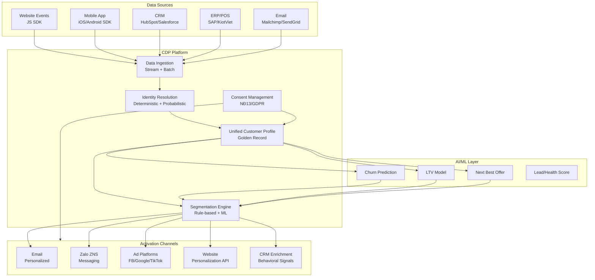
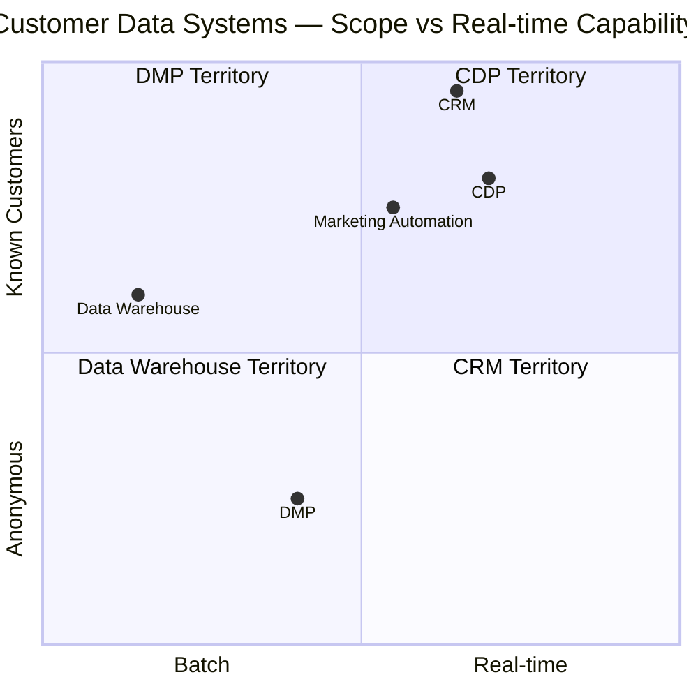

# CRM04 — Customer Data Platform (CDP): Thống Nhất Dữ Liệu Khách Hàng Thời Đại Post-Cookie

> **Tóm tắt:** CDP (Customer Data Platform) là hệ thống tập trung thu thập, hợp nhất và kích hoạt dữ liệu khách hàng từ mọi touchpoint — online và offline — để tạo ra Single Customer View (Hồ sơ khách hàng thống nhất). Trong bối cảnh third-party cookies bị loại bỏ (2024), first-party data strategy và CDP trở thành nền tảng cạnh tranh chiến lược. Module này phân tích sâu sự khác biệt CDP vs CRM vs DMP, kiến trúc CDP, chiến lược triển khai tại VN (MoMo, Shopee VN, VinID), và tác động của NĐ 13/2023/NĐ-CP đến việc quản lý dữ liệu cá nhân.

---

## Mục Lục

1. [Learning Objectives](#1-learning-objectives)
2. [Business Context](#2-business-context)
3. [Definitions](#3-definitions)
4. [Core Concepts](#4-core-concepts)
5. [Business Value](#5-business-value)
6. [Enterprise Role](#6-enterprise-role)
7. [Departments Related](#7-departments-related)
8. [Input](#8-input)
9. [Output](#9-output)
10. [Business Process](#10-business-process)
11. [Data Flow](#11-data-flow)
12. [Money Flow](#12-money-flow)
13. [Document Flow](#13-document-flow)
14. [Roles](#14-roles)
15. [Responsibilities](#15-responsibilities)
16. [RACI](#16-raci)
17. [Frameworks](#17-frameworks)
18. [International Standards](#18-international-standards)
19. [Vietnam Context](#19-vietnam-context)
20. [Legal Considerations](#20-legal-considerations)
21. [Common Mistakes](#21-common-mistakes)
22. [Best Practices](#22-best-practices)
23. [KPIs](#23-kpis)
24. [Metrics](#24-metrics)
25. [Reports](#25-reports)
26. [Templates](#26-templates)
27. [Checklists](#27-checklists)
28. [SOP](#28-sop)
29. [Case Study](#29-case-study)
30. [Small Business Example](#30-small-business-example)
31. [Enterprise Example](#31-enterprise-example)
32. [ERP Mapping](#32-erp-mapping)
33. [Automation Opportunities](#33-automation-opportunities)
34. [AI Opportunities](#34-ai-opportunities)
35. [Implementation Guide](#35-implementation-guide)
36. [Consulting Guide](#36-consulting-guide)
37. [Diagnostic Questions](#37-diagnostic-questions)
38. [Interview Questions](#38-interview-questions)
39. [Exercises](#39-exercises)
40. [References](#40-references)
41. [Output Formats](#output-formats)

---

## 1. Learning Objectives

Sau khi hoàn thành module này, học viên có thể:

- **Phân biệt** CDP vs CRM vs DMP vs Data Warehouse — hiểu rõ vai trò và overlap
- **Giải thích** kiến trúc CDP: Data ingestion → Identity Resolution → Unified Profile → Activation
- **Hiểu** vấn đề cookie deprecation và tại sao first-party data strategy là bắt buộc sau 2024
- **Phân tích** chiến lược dữ liệu của MoMo, Shopee VN, VinID như những CDP use cases thực tế
- **Đánh giá** tác động của NĐ 13/2023/NĐ-CP và PDPA đến CDP architecture
- **Thiết kế** data collection strategy tuân thủ pháp luật (consent-based)
- **Lựa chọn** CDP platform phù hợp: Segment.io, Tealium, Adobe RTCDP, Salesforce Data Cloud
- **Xây dựng** business case cho CDP với ROI từ personalization và reduced CAC
- **Nhận diện** khi nào SME VN cần CDP và khi nào CRM là đủ

---

## 2. Business Context

### Cuộc Khủng Hoảng Dữ Liệu: Tại Sao CDP Trở Nên Quan Trọng Năm 2024

**Three simultaneous shocks:**

**1. Cookie Deprecation:**
- Google Chrome loại bỏ third-party cookies (hoàn thành 2024-2025)
- Safari (Apple) đã block cookies từ 2020 (ITP - Intelligent Tracking Prevention)
- Firefox đã block từ 2019
- **Impact**: Retargeting ads, cross-site tracking, attribution — tất cả bị phá vỡ

**2. Privacy Regulation Explosion:**
- GDPR (EU, 2018) — phạt tới 4% global revenue
- CCPA (California, 2020)
- PDPA Thailand (2022) — ảnh hưởng nhiều công ty VN bán hàng sang Thailand
- **NĐ 13/2023/NĐ-CP** (Vietnam) — hiệu lực 07/2023

**3. Consumer Privacy Awareness:**
- 86% người tiêu dùng global lo ngại về privacy (Cisco 2022)
- iOS App Tracking Transparency (ATT): 75% users opt-out Facebook tracking
- VN: Người dùng ngày càng cẩn thận hơn về data sharing

**Kết quả:** Doanh nghiệp phải chuyển từ third-party data (dữ liệu mua từ bên ngoài, tracking ẩn) sang **first-party data** (dữ liệu khách hàng tự cung cấp có consent). CDP là hệ thống giúp quản lý first-party data này.

### Market Size

- CDP Market: $3.5 tỷ USD (2023) → $19 tỷ USD (2030) — CAGR 28%
- Top vendors: Segment (Twilio), Tealium, Adobe RTCDP, Salesforce Data Cloud, mParticle
- Asia Pacific growing fastest: Driven bởi e-commerce, fintech, super apps

### Tại Sao VN Cần Quan Tâm

- Việt Nam có 77 triệu internet users, 70+ triệu smartphone users
- Super apps (MoMo, ZaloPay, Grab) đã triển khai CDP nội bộ
- Các tập đoàn lớn (Vingroup, Masan, FPT) đang xây dựng first-party data moat
- Digital advertising market VN: $1.5 tỷ USD và growing

---

## 3. Definitions

### CDP — Định Nghĩa Chính Thức

**CDP (Customer Data Platform)** — Theo CDP Institute: "Phần mềm đóng gói tạo ra cơ sở dữ liệu khách hàng thống nhất, liên tục, có thể truy cập bởi các hệ thống khác. Nó thu thập dữ liệu từ nhiều nguồn, làm sạch và kết hợp dữ liệu để tạo ra một hồ sơ khách hàng duy nhất, sau đó làm cho hồ sơ hợp nhất đó có thể truy cập bởi các hệ thống marketing, sales và customer service khác."

**4 Đặc Điểm Định Nghĩa CDP:**
1. **Packaged software**: Không phải custom-built data warehouse
2. **Persistent, unified customer database**: Kết hợp tất cả data về một người
3. **Accessible to other systems**: API-ready để kích hoạt
4. **Marketer-controlled**: Không cần IT để vận hành hàng ngày

### First-Party Data vs Second-Party vs Third-Party Data

| Loại | Định nghĩa | Ví dụ | Trust Level |
|------|-----------|-------|------------|
| **First-party** | Dữ liệu bạn thu thập trực tiếp từ khách hàng với consent | Web analytics, purchase history, form data | Cao nhất |
| **Second-party** | Dữ liệu first-party của đối tác được chia sẻ theo thỏa thuận | Dữ liệu từ đối tác phân phối | Trung bình |
| **Third-party** | Dữ liệu từ bên thứ ba (data brokers, cookies) | Facebook audience, Nielsen data | Thấp, đang biến mất |

### Zero-Party Data

Mới nhất, quan trọng nhất: **Dữ liệu khách hàng chủ động cung cấp** để đổi lấy lợi ích.
- Preference surveys: "Bạn thích nhận thông báo về gì?"
- Quizzes: "Loại da của bạn là gì?" → Recommend sản phẩm
- Loyalty profile: "Ngày sinh nhật, sở thích"
- **Đặc điểm**: Độ chính xác cao nhất, không cần inference, consent rõ ràng

---

## 4. Core Concepts

### 4.1 CDP vs CRM vs DMP vs Data Warehouse

Đây là điểm gây nhầm lẫn nhiều nhất — cần hiểu rõ:

```
┌─────────────────────────────────────────────────────────────────┐
│                    CUSTOMER DATA LANDSCAPE                       │
├─────────────────┬─────────────────┬──────────────┬─────────────┤
│      CRM        │      CDP        │     DMP      │ Data Warehouse│
├─────────────────┼─────────────────┼──────────────┼─────────────┤
│ Known customers │ Known + Unknown │ Anonymous    │ All data     │
│ B2B focus       │ B2C + B2B       │ B2C/Ads      │ Analytics    │
│ Sales/Service   │ Marketing       │ Ad targeting │ Reporting    │
│ Named contacts  │ Unified profile │ Cookie-based │ Historical   │
│ Operational     │ Activation      │ Lookalike    │ Insights     │
│ Real-time       │ Real-time       │ Batch        │ Batch        │
│ Human-managed   │ Automated       │ Automated    │ Analysts     │
└─────────────────┴─────────────────┴──────────────┴─────────────┘
```

**Quy tắc đơn giản hóa:**
- **CRM**: "Ai đang mua hàng từ tôi và lịch sử của họ?"
- **CDP**: "Ai là customer thực sự (kể cả ẩn danh), họ đã làm gì ở mọi touchpoint?"
- **DMP**: "Tôi cần nhắm mục tiêu quảng cáo đến segment nào?" (đang chết vì cookies)
- **Data Warehouse**: "Tôi cần phân tích historical data để hiểu business"

**Overlap và tích hợp:**
```
CRM → cung cấp customer data cho CDP
CDP → enrich customer profile → gửi segment về CRM
CDP → audience → DMP/Ads platform (Google, Facebook)
CDP → data → Data Warehouse (để analytics sâu hơn)
```

### 4.2 CDP Architecture: 4 Layers

#### Layer 1: Data Ingestion (Thu Thập Dữ Liệu)

**Nguồn dữ liệu:**
```
Online Sources:
├── Website events (page views, clicks, scrolls)
├── Mobile app events (taps, screens viewed)
├── Email interactions (opens, clicks)
├── Social media interactions
└── Ad click data

Offline Sources:
├── POS transactions (mua tại cửa hàng)
├── CRM data (contacts, deals)
├── ERP data (orders, invoices)
├── Call center logs
└── Survey responses

Third-Party Data (still useful):
├── Second-party partner data
├── Enrichment data (demographics, firmographics)
└── Loyalty partner data
```

**Phương pháp thu thập:**
- **Streaming (Real-time)**: Kafka, Segment, Google Pub/Sub — cho events
- **Batch ETL**: Daily/hourly pulls từ databases, CRM, ERP
- **API**: REST/GraphQL calls từ external systems
- **SDK**: Mobile SDK, JavaScript snippet trên web

#### Layer 2: Identity Resolution (Nhận Dạng Danh Tính)

Đây là **magic** của CDP — khả năng nhận ra rằng cùng 1 người trên nhiều thiết bị/kênh.

**Vấn đề:**
```
Cùng người Nguyễn Thị Mai nhưng:
- Mobile (chưa login): user_id = mobile_anon_abc123
- Desktop (đã login): user_id = registered_user_xyz789
- Email click: contact_id = email_hai@gmail.com
- CRM: contact_id = CRM-12345
- Loyalty card: card_id = VIP-99887
→ 5 records khác nhau, thực ra là 1 người
```

**Identity Resolution Methods:**

1. **Deterministic Matching (Exact match):**
   - Email address match (most reliable)
   - Phone number match
   - User ID match (if user logged in across devices)
   - High confidence, lower volume

2. **Probabilistic Matching (Statistical inference):**
   - Cùng IP address + device fingerprint + behavior pattern
   - Location, time-of-day patterns
   - Lower confidence, higher volume
   - Privacy concern: Có thể vi phạm NĐ 13/2023

3. **Federated Identity (Emerging):**
   - Google Privacy Sandbox Topics API
   - Apple SKAdNetwork
   - Không identify individual, chỉ dùng audience cohorts

**Identity Graph:**
```
[Golden Record: Nguyễn Thị Mai]
├── email: mai.nguyen@gmail.com (deterministic)
├── phone: 0901234567 (deterministic)
├── mobile_id: abc123 (probabilistic)
├── cookie_id: xyz789 (deterministic, pre-deprecation)
├── CRM_id: CRM-12345 (deterministic)
└── loyalty_card: VIP-99887 (deterministic)
```

#### Layer 3: Unified Customer Profile (Hồ Sơ Khách Hàng Thống Nhất)

**Single Customer View (SCV) bao gồm:**

```json
{
  "customer_id": "CDP-GOLDEN-001",
  "identity": {
    "email": "mai.nguyen@gmail.com",
    "phone": "+84901234567",
    "name": "Nguyễn Thị Mai",
    "age_range": "28-35",
    "location": "Hà Nội"
  },
  "behavioral": {
    "lifetime_purchases": 45,
    "total_spend_vnd": 12500000,
    "avg_order_value": 277778,
    "last_purchase_date": "2024-12-15",
    "favorite_categories": ["beauty", "fashion"],
    "browse_frequency": "3x per week",
    "preferred_device": "mobile"
  },
  "preferences": {
    "communication_channel": "zalo",
    "best_contact_time": "evening",
    "promo_sensitivity": "high",
    "loyalty_tier": "gold"
  },
  "segments": [
    "high_value_customer",
    "fashion_enthusiast",
    "zalo_preferred",
    "monthly_repurchaser"
  ],
  "predictive_scores": {
    "churn_risk": 0.12,
    "upsell_propensity": 0.78,
    "next_purchase_probability_30d": 0.65,
    "preferred_offer_type": "percentage_discount"
  },
  "consent": {
    "marketing_email": true,
    "sms_marketing": false,
    "third_party_sharing": false,
    "consent_date": "2023-08-15",
    "consent_source": "app_registration"
  }
}
```

#### Layer 4: Activation (Kích Hoạt)

Unified profile được dùng để gửi personalized experience đến:
- **Email platform**: Send relevant email với personalized content
- **Mobile push**: Trigger push notification dựa trên behavior
- **Ad platforms**: Upload custom audience lên Facebook/Google (custom audiences)
- **CRM**: Enrich contact data với behavioral signals
- **Website**: Real-time personalization (show different homepage to different segments)
- **Call center**: Hiển thị customer profile cho agent khi gọi đến

### 4.3 Real-Time CDP vs Batch CDP

| Tính năng | Batch CDP | Real-Time CDP |
|----------|----------|--------------|
| **Xử lý data** | Hàng giờ / Hàng ngày | Milliseconds |
| **Use case** | Email campaigns, reporting | Website personalization, fraud detection |
| **Chi phí** | Thấp hơn | Cao hơn |
| **Complexity** | Đơn giản hơn | Phức tạp hơn |
| **VN Example** | Batch: Daily email campaign | Real-time: Show promo khi user xem sản phẩm lần 3 |

### 4.4 Customer Segmentation Trong CDP

**Types of Segments:**

1. **Rule-based Segments (Static Rules):**
```
Segment "VIP Gold": 
- Total purchase > 5M VND in last 12 months
- AND At least 3 purchases
- AND Last purchase within 90 days
```

2. **Behavioral Segments (Dynamic):**
```
Segment "About to Churn":
- Has purchased before
- No purchase in last 60 days
- Used to purchase every 20-30 days
- Churn risk score > 0.7
```

3. **Predictive Segments (AI/ML):**
```
Segment "High Upsell Potential":
- AI model identifies based on:
  * Purchase velocity increasing
  * Browse sessions increasing
  * Category expansion
  * Price sensitivity decreasing
```

4. **Lookalike Segments:**
```
Input: Top 100 VIP customers
CDP Output: 10,000 prospects that look similar
Activation: Target on Facebook/TikTok ads
```

### 4.5 First-Party Data Strategy

**Building First-Party Data Moat:**

```
STEP 1: VALUE EXCHANGE (Trao đổi giá trị)
"Tôi cung cấp giá trị → Bạn cung cấp data"
├── Loyalty program → Email + Purchase history
├── Personalized quiz → Preferences + Contact
├── Exclusive content → Registration data
└── Better UX → Behavioral data (with consent)

STEP 2: CONSENT MANAGEMENT
├── Clear value proposition ("Để gợi ý sản phẩm phù hợp")
├── Granular consent (email OK, SMS không)
├── Easy opt-out
└── Consent storage với timestamp

STEP 3: DATA QUALITY
├── Validated email, phone
├── Enrich với behavioral data
└── Regular deduplication

STEP 4: ACTIVATION
├── Personalized comms
├── Better product recommendations
├── Smarter retargeting
└── Lookalike audiences
```

### 4.6 Cookie Deprecation — Impact và Solution

**Timeline:**
- 2019: Firefox blocks third-party cookies
- 2020: Safari ITP fully active
- 2024-2025: Chrome blocks third-party cookies (87% browser market)

**What breaks:**
- Cross-site retargeting (xem giày Lazada → quảng cáo giày xuất hiện trên VnExpress)
- Cross-publisher frequency capping
- Multi-touch attribution (last-click measurement)
- Third-party audience segments

**CDP Solution:**
```
Old World (Third-party Cookies):
User visits Lazada → Cookie set → VnExpress shows Lazada ad
(No consent needed, user không biết)

New World (First-party CDP):
User registers on Lazada → Consents to marketing
→ Lazada CDP profiles user
→ Lazada uploads hashed email to Facebook Custom Audiences
→ Facebook matches + shows ad (user đã consent)
```

---

## 5. Business Value

### Giá Trị Định Lượng

| Value Driver | Mô tả | ROI Benchmark |
|-------------|-------|--------------|
| **Personalization Revenue** | Relevant offers → Tăng conversion | +15-25% revenue |
| **Reduced Wasted Ad Spend** | Target đúng người → CPM hiệu quả | -30-50% ad waste |
| **Churn Prevention** | Identify at-risk → Proactive intervention | -10-25% churn |
| **Cross-sell/Upsell** | Right product, right time | +20-40% basket size |
| **Unified Measurement** | True attribution → Better budget allocation | +20% marketing efficiency |

### VN-specific Business Value

**Cho Retail/E-commerce VN:**
- Personalized Zalo ZNS (Zalo Notification Service): Đúng người, đúng offer
- Unified view: Mua online + mua tại cửa hàng = 1 customer profile
- VIP recognition: Khách quen được nhận biết ngay khi vào cửa hàng (loyalty card scan)

**Cho Banking/Fintech VN:**
- Next best product: Khách hàng có tiết kiệm → Gợi ý bảo hiểm
- Fraud detection: Behavior bất thường → Alert
- Churn prevention: Tài khoản không giao dịch → Proactive outreach

---

## 6. Enterprise Role

CDP đóng vai trò **Data Foundation** — là cơ sở hạ tầng dữ liệu cho toàn bộ marketing và customer experience:

```
[Data Sources]
CRM → ┐
ERP → │
Web → │ [CDP — Single Customer View] → [Activation Channels]
App → │       ↓                         ├── Email (Mailchimp, SendGrid)
POS → ┘  Identity Resolution             ├── SMS/Zalo
         Unified Profile                  ├── Ad Platforms (FB, GG, TikTok)
         Segmentation                     ├── CRM (enrich)
         Predictive Scores                ├── Web Personalization
                                          └── Call Center
```

**CDP không thay thế CRM hay Data Warehouse:**
- CDP + CRM = Complete customer management
- CDP + DWH = Full analytics capability
- CDP là "nervous system" kết nối tất cả

---

## 7. Departments Related

| Phòng ban | Sử dụng CDP | Use case |
|----------|-------------|---------|
| **Marketing** | Primary user | Segmentation, personalization, campaign targeting |
| **CRM/Sales** | Consumer | Enriched contact profiles từ CDP |
| **Data/Analytics** | Technical user | Data pipeline, ML models |
| **IT** | Operator | Infrastructure, integrations |
| **Legal/Compliance** | Overseer | PDPA compliance, consent management |
| **Customer Service** | Viewer | 360° view khi customer contacts |
| **Product** | Data consumer | User behavior insights |
| **Executive** | Dashboard | Customer analytics, LTV, churn |

---

## 8. Input

### Dữ Liệu Đầu Vào CDP

**Behavioral Data (Online):**
- Page views, clicks, scroll depth, session duration
- App screens, features used, time in app
- Search queries on site
- Video views, content consumption
- Cart additions, abandonments, purchases

**Transactional Data (Offline + Online):**
- Purchase history (date, amount, items, channel)
- Returns và refunds
- Loyalty point transactions
- Payment method, frequency patterns

**Profile Data:**
- CRM contacts: name, email, phone, demographics
- Registration data từ loyalty programs
- Survey responses
- Preferences settings

**Engagement Data:**
- Email: sent, delivered, opened, clicked, unsubscribed
- SMS: sent, delivered, clicked
- Push notification: sent, opened, dismissed
- Social: likes, shares, comments

**Customer Service Data:**
- Ticket history
- Call recordings/transcripts
- CSAT, NPS scores
- Complaint categories

**Partner/Second-Party Data:**
- Retailer purchase data (nếu brand CPG)
- Airline miles redemption (nếu partner loyalty)
- Banking transaction categories (nếu bank open data)

---

## 9. Output

### Kết Quả Đầu Ra

**To Marketing Channels:**
- Personalized email content (dynamic content blocks)
- SMS/Zalo: Triggered messages theo behavior
- Mobile push: Timed và behavior-triggered
- Ad platforms: Custom Audiences, Lookalike Audiences

**To CRM/Sales:**
- Enriched contact profiles với behavioral data
- Customer health scores
- Propensity scores (upsell, churn, purchase)
- Segment memberships

**To Website/App:**
- Real-time segment data for personalization API
- Product recommendations
- Personalized homepage content
- Dynamic pricing signals

**To Analytics:**
- Customer segments for cohort analysis
- LTV models feed data
- Attribution reports
- Churn prediction results

**To Call Center:**
- Customer summary card (purchase history, segment, open tickets)
- Next best action suggestions
- Account risk flag

---

## 10. Business Process

### CDP-Enabled Personalization Loop

```
DATA COLLECTION
Khách hàng tương tác (web, app, offline, email)
           ↓
DATA INGESTION
Events stream vào CDP real-time (web) + batch (CRM, ERP)
           ↓
IDENTITY RESOLUTION
CDP khớp events với Customer Profile
(anon visitor → sau khi login → known customer)
           ↓
PROFILE ENRICHMENT
Update unified profile với new events, attributes
           ↓
SEGMENTATION
Profile match vào dynamic segments
(VD: "Viewed shoes > 3 times without purchase" → segment)
           ↓
ACTIVATION DECISION
Business rules + AI decide: What action to take?
(VD: Send Zalo ZNS với 10% discount trên đôi giày đó)
           ↓
CHANNEL DELIVERY
Message sent qua Zalo/Email/Push
           ↓
MEASUREMENT
Track response: Did they convert?
Feedback loop: Update model, adjust rules
           ↓
LOOP BACK TO COLLECTION
```

### Churn Prevention Process

```
CDP monitors: Login frequency, purchase recency, support tickets
           ↓
AI model detects: Churn risk score rising (>0.7 threshold)
           ↓
CDP creates segment: "At Risk - Churn Probability High"
           ↓
Workflow triggered:
  Day 0: Retention email "Chúng tôi nhớ bạn" + personalized offer
  Day 3: If no response → Zalo message
  Day 7: If no response → Flag for CSM outreach
  Day 14: If no response → Downgrade VIP tier gracefully
           ↓
Measure: Saved vs Lost customers from intervention
```

---

## 11. Data Flow

```
[INGESTION LAYER]
Web SDK → Event Stream (Kafka/Segment)
Mobile SDK → Event Stream
CRM API → Batch Pull (nightly)
ERP API → Batch Pull (nightly)
POS → File transfer + ETL
Email Platform → Engagement events

[IDENTITY LAYER]
Raw Events Database
      ↓
Identity Graph Service
(Deterministic + Probabilistic matching)
      ↓
Golden Record Creation

[PROFILE LAYER]
Unified Customer Database
(Real-time updatable)
      ↓
Segmentation Engine
(Rule-based + ML models)

[ACTIVATION LAYER]
CDP API ──→ Email ESP (SendGrid, Mailchimp)
CDP API ──→ Zalo OA API
CDP API ──→ Facebook Custom Audiences (hashed emails)
CDP API ──→ Google Customer Match
CDP API ──→ CRM (enrich contacts)
CDP API ──→ Website (real-time personalization API)
CDP API ──→ Data Warehouse (for deep analysis)
```

---

## 12. Money Flow

### CDP Cost Structure

**Build vs Buy Decision:**

**Buy (CDP SaaS):**
| Platform | Pricing Model | Estimate |
|---------|-------------|---------|
| Segment (Twilio) | Per Monthly Tracked Users (MTU) | $120/tháng (1,000 MTU) đến $1M+/năm |
| Tealium | Annual contract | $50K-$500K/năm |
| Adobe RTCDP | Annual, enterprise | $200K-$2M/năm |
| Salesforce Data Cloud | Per Unified Individual (UI) | $65K/năm min |
| mParticle | Per MTU | Similar to Segment |

**Build in-house:**
- Engineering team: 3-5 engineers × $30-50K/năm (VN rate) = $90-250K/năm
- Cloud infrastructure: $2-10K/tháng (AWS/GCP)
- Tools (Kafka, dbt, Airflow): $5-20K/tháng
- **Total**: $200K-500K/năm
- **Note**: Thường chỉ cost-effective ở quy mô lớn (>10M customers)

**VN Enterprise Approach:**
- Large companies (VinID, MoMo, Shopee): Build in-house
- Mid-market: Segment hoặc Tealium (affordable tier)
- SME: Chưa cần CDP — HubSpot/CRM đủ

### CDP ROI Calculation

**Framework:**

```
Revenue Impact:
+ Personalization uplift: (Baseline revenue × 15%) = X
+ Churn reduction: (Lost revenue at 20% churn vs 15% churn) = Y
+ Cross-sell increase: (Avg basket × 20% increase × volume) = Z

Cost Reduction:
+ Ad spend efficiency: (Current ad budget × 30% waste reduction) = W
+ Customer acquisition: (CAC decrease × new customers) = V

Total Benefits = X + Y + Z + W + V
CDP Cost = Platform + Implementation + Maintenance

ROI = (Total Benefits - CDP Cost) / CDP Cost × 100
```

**Ví dụ cho Retailer Online VN (500,000 customers):**
```
Personalization uplift: 200B × 10% = 20B VND/năm
Churn reduction: 50B × 5% reduction = 2.5B VND/năm
Ad waste reduction: 30B × 30% = 9B VND/năm
Total Benefits: 31.5B VND/năm
CDP Cost (Segment Pro): ~2B VND/năm
ROI: 1,475%
```

---

## 13. Document Flow

| Document | Tạo bởi | Lưu trong | Đi đến |
|----------|---------|-----------|--------|
| Consent Record | CDP (on form submit) | CDP Consent Database | Legal Audit |
| Customer Profile (JSON) | CDP | CDP Profile Store | All activation channels |
| Segment Definition | Marketing Analyst | CDP Segment Config | Activation |
| Data Processing Agreement | Legal | Document Management | Partner agreements |
| Privacy Policy | Legal | Website + CDP | End users |
| Breach Notification | Legal/IT | Regulatory filing | Cục An toàn thông tin |
| Attribution Report | CDP | BI Tool | Executive, Marketing |

---

## 14. Roles

### CDP Team Roles

| Role | Mô tả | Kỹ năng cần |
|------|-------|-----------|
| **CDP Manager / MarTech Lead** | Chiến lược, vendor selection, roadmap | Marketing, data, business |
| **CDP Engineer / Data Engineer** | Build pipelines, integrations, maintain infra | Python, SQL, Kafka, dbt |
| **Data Analyst / Scientist** | Segmentation, ML models, attribution | SQL, Python, Stats |
| **Marketing Technologist** | Connect business needs với CDP capabilities | Marketing + Tech |
| **Privacy/Compliance Officer** | Đảm bảo PDPA compliance | Legal, data governance |
| **Digital Marketing Analyst** | Use CDP segments for campaigns | Marketing analytics |

### VN Market: Ai đang làm CDP work?

Tại VN, "CDP work" thường được đảm nhiệm bởi:
- Data Team (Data Engineers + Analysts) — xây dựng pipeline
- Marketing Analytics Team — sử dụng segments
- Growth/CRM Team — activation
- IT/Platform Team — infra và security

Chức danh "CDP Manager" còn hiếm tại VN — thường là "Head of Data" hoặc "Marketing Technology Manager"

---

## 15. Responsibilities

### CDP Engineer
- Design và maintain data ingestion pipelines
- Identity resolution algorithm maintenance
- API integrations với upstream và downstream systems
- Performance monitoring, SLA compliance
- Data quality checks và anomaly detection

### Marketing Analyst/CDP User
- Define và create customer segments
- Configure audience sync với ad platforms
- Build automated activation workflows
- Measure campaign lift với control groups
- Monthly performance reporting

### Privacy/Compliance Officer
- Maintain consent database compliance
- Process data subject requests (access, deletion)
- Annual privacy audit của CDP configurations
- Review và approve new data sources
- Training cho team về NĐ 13/2023

---

## 16. RACI

| Hoạt động | CDP Eng | Data Analyst | Marketing | Legal | IT | CMO |
|----------|---------|-------------|-----------|-------|-----|-----|
| CDP platform selection | C | C | C | C | C | A |
| Data ingestion pipeline | R/A | C | I | I | C | I |
| Identity resolution config | R/A | C | I | C | C | I |
| Segment creation | C | R | A | I | I | I |
| Campaign activation | I | C | R/A | I | I | I |
| Consent management | C | I | C | R/A | C | I |
| Privacy audit | I | C | C | R/A | C | I |
| Ad platform sync | C | C | R/A | C | C | I |
| ML model deployment | R/A | R | C | I | C | I |
| Performance reporting | C | R/A | C | I | I | I |

---

## 17. Frameworks

### 1. The 4 V's of Customer Data

- **Volume**: Bao nhiêu data? (CDP cần handle millions of events/day)
- **Variety**: Bao nhiêu loại data? (behavioral, transactional, profile, contextual)
- **Velocity**: Data cần real-time không? (website personalization vs batch email)
- **Veracity**: Data có chính xác không? (garbage in, garbage out)

### 2. Identity Resolution Framework

- Tier 1 (Deterministic): Email, Phone, UserID — 100% confidence
- Tier 2 (Probabilistic): Device fingerprint, IP + User Agent — 70-85% confidence
- Tier 3 (Inferred): Behavioral patterns — 50-70% confidence

### 3. Data Governance Framework (DAMA-DMBOK)

- Data Quality: Accuracy, Completeness, Consistency, Timeliness
- Data Security: Who can access what data
- Data Privacy: Consent management, data minimization
- Data Architecture: How data flows through the organization

### 4. Jobs To Be Done (JTBD) for CDP

- Marketer's JTBD: "Tôi cần gửi đúng message đến đúng người đúng thời điểm"
- Data Team's JTBD: "Tôi cần một source of truth duy nhất về customers"
- Executive's JTBD: "Tôi cần biết ai là khách hàng tốt nhất và làm sao giữ chân họ"

### 5. Customer Engagement Maturity Model

```
Level 1: Mass Marketing (Tất cả nhận cùng email)
Level 2: Segmented Marketing (5-10 segments cơ bản)
Level 3: Targeted Marketing (Dozens of segments, behavior-based)
Level 4: Personalized Marketing (Individual-level, CDP powered)
Level 5: Predictive Marketing (AI-driven, anticipate needs)
```

---

## 18. International Standards

### GDPR (EU) và CDP

- **Data Minimization (Article 5)**: Chỉ thu thập data cần thiết → CDP config phải reflect
- **Purpose Limitation**: Dữ liệu thu thập cho mục đích A không được dùng cho mục đích B
- **Storage Limitation**: Xóa data khi không còn cần thiết → CDP cần data retention policies
- **Data Subject Rights**: Access, Rectification, Erasure, Portability — CDP phải support
- **Privacy by Design**: CDP architecture phải embed privacy từ đầu, không phải add-on

### ISO 27701 — Privacy Information Management

Extension của ISO 27001 cho privacy:
- Yêu cầu có Privacy Management System
- Áp dụng trực tiếp cho tổ chức vận hành CDP

### NIST Privacy Framework

- **Identify**: Biết bạn đang xử lý data gì
- **Govern**: Policies và procedures
- **Control**: Technical và organizational measures
- **Communicate**: Transparency với customers
- **Protect**: Security safeguards

### IAB Transparency and Consent Framework (TCF)

- Tiêu chuẩn ngành quảng cáo cho consent management
- CDP cần tích hợp với Consent Management Platform (CMP) theo TCF 2.0
- Ví dụ CMP: OneTrust, Cookiebot, TrustArc

---

## 19. Vietnam Context

### Công Ty VN Đang Dùng CDP

**MoMo (VNPay):**
- Với 30+ triệu users, MoMo là data goldmine
- Internal CDP: Track tất cả transactions, bill payments, money transfers
- Use case: "Người dùng hay mua Grab? → Gợi ý mã giảm giá Grab vào đúng thời điểm"
- First-party data: Cực mạnh (biết thu nhập, chi tiêu, thói quen thanh toán)
- MoMo data không chia sẻ cho third-party quảng cáo — đây là moat của họ

**Shopee Vietnam:**
- Shopee SG là HQ — Customer data platform tập trung tại Singapore
- VN operation: Tất cả purchase data, browse data, chat data vào Shopee Data Platform
- Personalized recommendations: Thuật toán AI trên customer behavioral data
- ShopeeFood, ShopeePay: Cross-product data enrichment
- Challenge VN: Data residency (dữ liệu người VN lưu ở Singapore)

**VinID (Vingroup):**
- Super Loyalty App: Tích hợp VinMart (nay WinMart), VinFast, Vinpearl, VinSchool
- CDP use case: "Khách mua WinMart hàng tuần nhưng chưa dùng VinFast" → Targeted VinFast ad
- First-party data: Purchase history across Vingroup ecosystem
- Challenge: Vingroup đang tái cơ cấu → Data strategy unclear

**Techcombank:**
- Open Banking data: 10M+ customers, biết thu nhập, chi tiêu, investment của họ
- CDP-like system: "Customer 360" để gợi ý sản phẩm tài chính
- Dữ liệu giao dịch là vàng: Biết bạn mua nhà từ trước khi bạn bắt đầu tìm kiếm

**ViettelPost/Viettel Telecom:**
- 30+ triệu SIM subscribers
- Location data, call patterns, data usage → powerful behavioral signals
- Use case: Churn prediction, ARPU optimization

### Thách Thức Đặc Thù VN

**1. Dữ liệu rời rạc (Fragmented Data):**
- Người VN mua ở nhiều kênh: Online (Shopee, Lazada), offline (cửa hàng), social (Facebook shop)
- Không có dữ liệu tập trung = khó identity resolution
- Solution: Loyalty program như chiếc chìa khóa (1 email/phone cho tất cả channels)

**2. Cash economy (Kinh tế tiền mặt):**
- 50%+ giao dịch offline vẫn dùng tiền mặt → Không có data về đơn hàng
- Solution: QR code loyalty check-in tại cửa hàng để capture offline behavior

**3. Zalo-centric Communication:**
- Email ít được dùng hơn (không phải primary communication channel)
- CDP cần integrate với Zalo OA API (Official Account)
- Zalo API giới hạn hơn Email — ít dữ liệu hơn từ Zalo channel

**4. Low Trust Về Data Sharing:**
- Sau các scandal data breach (Facebook-Cambridge Analytica được biết đến ở VN)
- Người VN increasingly skeptical về data sharing
- Solution: Radical transparency về data usage, clear value exchange

**5. SME Không Đủ Scale:**
- CDP có ý nghĩa khi có > 100,000 customers (để segmentation meaningful)
- Phần lớn SME VN: < 10,000 customers → CRM đủ rồi

---

## 20. Legal Considerations

### NĐ 13/2023/NĐ-CP — Bảo Vệ Dữ Liệu Cá Nhân

**Hiệu lực:** 01/07/2023 — Một trong những quy định pháp lý quan trọng nhất ảnh hưởng đến CDP

**Các điều khoản quan trọng với CDP:**

**Điều 2 — Phân loại dữ liệu:**
- **Dữ liệu thông thường**: Tên, email, địa chỉ, lịch sử mua hàng
- **Dữ liệu nhạy cảm** (xử lý chặt chẽ hơn): Sức khỏe, tài chính, tín ngưỡng, vị trí
- **CDP implication**: Behavioral data (location tracking, health app data) = nhạy cảm → Cần consent đặc biệt

**Điều 9 — Sự đồng ý:**
- Phải có consent **trước** khi xử lý dữ liệu
- Consent phải **rõ ràng, tự nguyện, có thông tin đầy đủ**
- Không được ép buộc consent là điều kiện dùng dịch vụ (controversial cho CDP)
- **CDP implication**: Mọi tracking pixel, cookie, form đều cần consent dialog

**Điều 10 — Quyền của chủ thể dữ liệu:**
- Quyền được biết: Tôi đang xử lý data gì về họ?
- Quyền được sửa: Họ có thể yêu cầu cập nhật sai sót
- Quyền xóa (Right to be Forgotten): Họ có thể yêu cầu xóa toàn bộ data
- **CDP implication**: CDP phải có API để xử lý data subject requests

**Điều 16 — Thông báo vi phạm:**
- Phải báo cáo data breach trong **72 giờ**
- Cho cả cơ quan nhà nước (Bộ Công an) VÀ cho chủ thể dữ liệu bị ảnh hưởng
- **CDP implication**: Cần incident response plan và breach notification workflow

**Điều 20-22 — Chuyển dữ liệu ra nước ngoài:**
- Cần đánh giá tác động (DTIA - Data Transfer Impact Assessment)
- Cơ quan tiếp nhận ở nước ngoài phải có mức bảo vệ tương đương
- **CDP implication**: Nếu dùng Segment.io (US) hay Salesforce Data Cloud — cần xem xét điều này

### Consent Management Platform (CMP) — Yêu Cầu Kỹ Thuật

Với CDP, cần tích hợp CMP để:
- Hiển thị cookie consent banner đúng luật
- Ghi nhận consent (what, when, who, version of privacy policy)
- Propagate consent decisions đến tất cả systems (CDP, email, ads)
- Honor opt-out ngay lập tức

**CMP phổ biến có thể dùng tại VN:**
- OneTrust (enterprise, đắt)
- Cookiebot (mid-market, hợp lý)
- TrustArc
- Custom-built (nhiều công ty VN tự build consent component)

### Luật An Ninh Mạng 2018

- Khoản 3, Điều 26: Dữ liệu người dùng VN phải được **lưu trữ tại VN**
- Nghị định hướng dẫn chưa rõ ràng về enforcement
- **CDP implication thực tế**: Doanh nghiệp lớn (Telco, Banking) deploy CDP on-premise hoặc cloud VN (Viettel Cloud, VNPT Cloud)
- Start-up và mid-market thường dùng AWS Singapore với chấp nhận rủi ro pháp lý

---

## 21. Common Mistakes

### Sai Lầm Chiến Lược

**1. Mua CDP trước khi có data strategy**
- Vấn đề: CDP là tool, không phải strategy. Tool không tự giải quyết data silo problems.
- Fix: Xác định rõ use cases, data sources, activation goals TRƯỚC khi mua CDP

**2. Nhầm CDP với Data Warehouse**
- Vấn đề: Tổ chức đã có BigQuery/Redshift → nghĩ không cần CDP
- Thực tế: DWH là analytics; CDP là activation. Cần cả hai.
- Fix: Hiểu rõ sự khác biệt và làm rõ với leadership

**3. Over-engineer identity resolution**
- Vấn đề: Cố match mọi anonymous visitor → nhiều false positives → bad personalization
- Fix: Start với deterministic matching (email/phone). Thêm probabilistic dần.

**4. Bỏ qua consent architecture**
- Vấn đề: Build CDP xong mới nghĩ đến consent → phải rebuild
- Fix: Privacy by design từ đầu. CMP phải là part of CDP architecture.

### Sai Lầm Kỹ Thuật

**5. Không bulkify event processing**
- Vấn đề: Database chịu không nổi khi traffic spike (Black Friday)
- Fix: Design for 10x peak traffic từ đầu

**6. Profile data staleness**
- Vấn đề: Segment "active user" dựa trên 30-day data nhưng chỉ update weekly
- Fix: Real-time segment updates hoặc tần suất update phù hợp với use case

**7. Không có data quality monitoring**
- Vấn đề: Tracking pixel không load → Events missing → Segments wrong → Bad personalization
- Fix: Data observability tools (Monte Carlo, Soda, Great Expectations)

**8. Duplicate events**
- Vấn đề: User reload page → Đếm 2 lần "purchase complete" → Inflated metrics
- Fix: Idempotency keys cho mọi event

### Sai Lầm Vận Hành

**9. Marketing team không được train**
- Vấn đề: CDP tốn 500K USD nhưng marketing vẫn dùng cách cũ
- Fix: Dedicated training program + CDP champion trong marketing team

**10. Không đo lift**
- Vấn đề: Không biết CDP actually working hay không
- Fix: A/B test mọi personalization: Control group (no CDP) vs Treatment (CDP)

---

## 22. Best Practices

### Data Strategy Best Practices

1. **Start with use cases, not technology**: "Tôi muốn giảm churn 15% bằng cách identify at-risk customers" → rồi mới design CDP

2. **Privacy by Design**: Consent management phải là core, không phải afterthought

3. **Data Minimization**: Chỉ thu thập data thực sự cần. Không thu thập "just in case"

4. **Single source of truth**: CDP là master customer record, không có conflicts với CRM

### Technical Best Practices

5. **Event naming convention**: Chuẩn hóa event names: `noun_verb` pattern (VD: `product_viewed`, `order_completed`)

6. **Schema registry**: Document tất cả events và properties trong catalog

7. **Test in staging before production**: Luôn test tracking code trong staging env

8. **Data freshness SLA**: Define rõ: Profile phải update trong bao lâu sau event?

### Activation Best Practices

9. **Control groups always**: Mọi CDP-powered campaign phải có holdout group để measure lift

10. **Frequency capping across channels**: Tránh harassment — cùng 1 user nhận email + Zalo + push cùng 1 ngày

11. **Segment hygiene**: Review và archive unused segments định kỳ

12. **Attribution**: Chọn attribution model phù hợp với business model (first-touch vs last-touch vs data-driven)

---

## 23. KPIs

### CDP Platform Health KPIs

| KPI | Mục tiêu |
|-----|---------|
| **Profile completeness rate** | > 80% profiles có email OR phone |
| **Identity match rate** | > 70% events matched to known profile |
| **Data freshness** | Profile updated < 1h sau event (real-time) |
| **Consent rate** | > 60% visitors consent to tracking |
| **Data quality score** | < 2% invalid emails, < 1% duplicates |

### Business Impact KPIs (CDP-Attributed)

| KPI | Baseline | Target sau CDP |
|-----|---------|---------------|
| **Email CTR (personalized vs generic)** | 2% | > 5% |
| **Churn Rate** | 15% | < 10% |
| **Cross-sell Rate** | 10% | > 18% |
| **Ad ROAS (with Custom Audiences)** | 3x | > 5x |
| **CAC (with better targeting)** | 500K VND | < 350K VND |

---

## 24. Metrics

### Data Quality Metrics

- **Match Rate**: Số events được ghép vào profile / Tổng events
- **Profile Completeness**: % profiles có đủ identifier (email, phone)
- **Duplicate Rate**: % records bị trùng lặp trong database
- **Data Freshness**: Thời gian từ event → Profile updated

### Personalization Effectiveness Metrics

- **Uplift Rate**: (Conversion rate treatment - Conversion rate control) / Conversion rate control
- **Incremental Revenue**: Revenue từ personalized interactions - Revenue từ control group
- **Segment Overlap Rate**: % customers trong nhiều conflicting segments (cần minimize)

### Privacy Compliance Metrics

- **Consent Rate**: % users consent to specific processing purpose
- **Opt-out Rate**: % users withdrawing consent (tăng cao = trust problem)
- **DSAR (Data Subject Access Request) Response Time**: Phải < 30 ngày (theo NĐ 13)
- **Time to Delete**: Sau RTBF request → data deleted trong bao lâu?

---

## 25. Reports

### CDP Reporting Framework

**Real-time Dashboard:**
- Active customer count right now (on site/app)
- Events per minute (health monitoring)
- Segment membership changes today

**Daily Reports:**
- New profiles created today
- Profile enrichment summary (% profiles upgraded)
- Consent/opt-out changes
- Campaign activation performance

**Weekly Reports:**
- Segment health report (size, growth, overlap)
- Attribution summary (revenue per channel)
- Data quality report (completeness, freshness, accuracy)

**Monthly Reports:**
- Customer LTV distribution (are we acquiring better customers?)
- Churn analysis (who left, what signals we missed)
- CDP ROI report (incremental revenue from CDP-powered campaigns)
- Privacy compliance report

**Quarterly Reports:**
- Data strategy review (are use cases delivering?)
- CDP architecture review (scaling, new data sources needed)
- Privacy audit report

---

## 26. Templates

### Template: CDP Use Case Definition

```
USE CASE: [Tên ngắn gọn]
DATE: [DD/MM/YYYY]
OWNER: [Marketing Manager / CDP Team]

BUSINESS PROBLEM:
[Mô tả vấn đề kinh doanh cần giải quyết]

CUSTOMER JOURNEY STAGE:
[ ] Acquisition  [ ] Activation  [ ] Retention  [ ] Revenue  [ ] Referral

DATA NEEDED:
- Customer attributes: [List]
- Behavioral events: [List]
- Third-party data: [List if any]

SEGMENT DEFINITION:
Include:
- [Criteria 1] AND
- [Criteria 2] AND
- [Criteria 3]
Exclude:
- [Exclusion criteria]
Estimated size: [Number of customers]

ACTIVATION CHANNEL:
[ ] Email  [ ] SMS  [ ] Push  [ ] Zalo  [ ] Ads  [ ] Web personalization

PERSONALIZATION LOGIC:
IF [segment A] → Show [content/offer A]
IF [segment B] → Show [content/offer B]
ELSE → Default [content/offer]

SUCCESS METRICS:
Primary KPI: [e.g., Conversion rate uplift]
Secondary KPI: [e.g., Revenue per user]
Control group: [Yes/No, %]

EXPECTED LIFT: [%]
TIMELINE: [Start date → Measure date]
```

### Template: Data Inventory (Kiểm Kê Dữ Liệu)

```
DATA ASSET INVENTORY — [Company Name]

| Source | Data Type | Volume | Update Freq | PII? | Consent? | Current Location |
|--------|-----------|--------|-------------|------|---------|-----------------|
| Website | Behavioral | 1M events/day | Real-time | Partial | Cookie consent | Google Analytics |
| CRM | Profile | 500K contacts | Daily | Yes | Form consent | HubSpot |
| ERP | Transactional | 2M orders | Daily | Yes | Purchase T&C | SAP |
| Mobile App | Behavioral | 500K sessions/day | Real-time | Yes | App consent | Firebase |
| POS | Transactional | 10K receipts/day | Hourly | Partial | Loyalty signup | POS System |

GAPS IDENTIFIED:
1. No unified identifier across web and CRM
2. POS data has no email, only phone
3. Mobile app events not linked to CRM contacts
```

---

## 27. Checklists

### Checklist: CDP Vendor Evaluation

**Functional:**
- [ ] Supports all required data sources (web, mobile, CRM, ERP, offline)
- [ ] Identity resolution capabilities (deterministic + probabilistic)
- [ ] Real-time profile update (< 1 second for critical use cases)
- [ ] Segmentation: Rule-based + ML-powered
- [ ] Pre-built connectors to our activation channels (email, Zalo, FB, Google)
- [ ] Consent management built-in or easy to integrate

**Technical:**
- [ ] API-first architecture (REST/GraphQL)
- [ ] Event streaming support (Kafka/Kinesis compatible)
- [ ] Data governance: Field-level encryption, data masking
- [ ] SLA: 99.9%+ uptime, data freshness SLA
- [ ] Scalability: Can handle our peak load (Black Friday?)
- [ ] GDPR/NĐ 13 compliance features

**Commercial:**
- [ ] Pricing model transparent (per MTU/UI/event/volume)
- [ ] Contract flexibility (monthly vs annual)
- [ ] SLA penalties if uptime not met
- [ ] Professional services support for implementation
- [ ] Reference customers in our industry / region

**Security:**
- [ ] SOC 2 Type II certification
- [ ] ISO 27001 (or equivalent)
- [ ] Data residency options (VN server? Singapore? EU?)
- [ ] Penetration testing reports available

### Checklist: CDP Go-Live Readiness

**Data:**
- [ ] All major data sources connected và validated
- [ ] Identity resolution tested (match rate > 60%)
- [ ] Historical data backfilled (nếu cần)
- [ ] Data quality baseline established

**Privacy:**
- [ ] Consent management platform integrated
- [ ] All tracking có consent gate
- [ ] Privacy policy updated và reflect CDP usage
- [ ] DSAR process tested end-to-end

**Technical:**
- [ ] All activation channels connected và tested
- [ ] Monitoring và alerting set up
- [ ] Disaster recovery plan documented

**Business:**
- [ ] At least 3 use cases ready to launch Day 1
- [ ] Marketing team trained
- [ ] KPIs defined và tracking setup
- [ ] Executive briefing done

---

## 28. SOP

### SOP-CDP-001: Xử Lý Data Subject Access Request (DSAR)

**Bối cảnh:** NĐ 13/2023 cho phép cá nhân yêu cầu xem, sửa, xóa dữ liệu của họ

**Trigger:** Nhận email/form từ khách hàng yêu cầu:
- "Tôi muốn xem tất cả dữ liệu công ty đang giữ về tôi" (Access Request)
- "Tôi muốn chỉnh sửa thông tin sai" (Rectification Request)
- "Tôi muốn xóa toàn bộ dữ liệu của tôi" (Erasure Request)

**Bước 1: Xác minh danh tính (Day 0-2)**
- Ai: Privacy Officer
- Yêu cầu: Confirm email/phone khớp với request
- Mục đích: Tránh xóa data sai người

**Bước 2: Tra cứu trong CDP (Day 2-5)**
- Ai: CDP Engineer + Privacy Officer
- Query CDP bằng email/phone để tìm tất cả records
- Xuất profile: Tất cả attributes, events, consents, activations

**Bước 3: Xử lý request (Day 5-25)**

*Với Access Request:*
- Compile report dạng readable (PDF hoặc JSON nếu technical)
- Bao gồm: Profile data, purchase history, email history, behavioral data
- Gửi qua email bảo mật

*Với Erasure Request:*
- Kiểm tra legal basis: Một số data có thể phải giữ (hóa đơn cho kế toán theo Luật Kế Toán)
- Xóa data trong CDP, CRM, Email platform, Ad Platforms (Facebook custom audiences)
- Document gì đã xóa, gì giữ lại và lý do

**Bước 4: Confirm cho khách hàng (Day < 30)**
- Email xác nhận: "Chúng tôi đã xử lý yêu cầu của bạn..."
- Nếu erasure: "Dữ liệu của bạn đã được xóa, ngoại trừ X vì lý do Y"

**SLA:** Không quá 30 ngày (theo NĐ 13/2023, Điều 10)

---

## 29. Case Study

### Case Study: MoMo — Building Vietnam's Most Powerful Consumer CDP

**Bối cảnh:**
MoMo (M_Service) với 30+ triệu users tích cực là ví điện tử phổ biến nhất VN. Với mọi giao dịch được log (thanh toán hóa đơn, chuyển tiền, mua vé, nạp tiền điện thoại), MoMo sở hữu một trong những bộ dữ liệu hành vi tài chính phong phú nhất Việt Nam.

**CDP Architecture của MoMo (Inferred từ public info):**

**Data Collection:**
- Mọi giao dịch trong app được log real-time
- Behavioral events: App opens, screens viewed, features used
- Location data (với consent) khi thanh toán tại cửa hàng
- Partner data: Khi user dùng Grab Pay by MoMo, Shopee Pay bằng MoMo

**Unified Profile:**
- "Nguyễn Văn A" profile includes:
  - Demographics: Age range (từ giao dịch), location (từ bills)
  - Financial behavior: Thu nhập proxy (từ chuyển tiền), chi tiêu pattern
  - Lifestyle: Thường xuyên đặt Grab → Tech-savvy urban
  - Loyalty: Tần suất sử dụng, feature adoption

**Segmentation và Activation:**
- VD: "Users đặt taxi thường xuyên nhưng chưa dùng MoMo Insurance" → Targeted insurance ad trong app
- "Users nạp tiền điện thoại cho người khác" → Likely to send remittances → Target với Gửi Tiền Quốc Tế
- Personalized home screen: VIP users thấy investment products; New users thấy cashback offers

**Privacy Approach:**
- MoMo cập nhật Privacy Policy phù hợp NĐ 13/2023
- Consent khi đăng ký app
- Users có thể opt-out marketing trong Settings
- Data stored tại VN (on-premise + VNG Cloud, không phải AWS/Azure)

**Kết quả (Estimated):**
- Cross-sell rate: Services per active user tăng mỗi năm
- User Retention: Churn rate giảm nhờ personalized engagement
- Ad Revenue: MoMo Ads network cho partner merchants dùng user segments

**Bài học:**
1. Super app = natural CDP — mọi touchpoint trong 1 app
2. Financial data = most powerful CDP data (nhưng cũng nhạy cảm nhất)
3. Trust là yếu tố tiên quyết — người dùng cần tin tưởng mới grant data access
4. Data localization (lưu data trong VN) là competitive advantage (compliance + trust)

---

## 30. Small Business Example

### Ví Dụ: Chuỗi Cửa Hàng Mỹ Phẩm (5 chi nhánh, 50,000 khách hàng)

**Bối cảnh:** Chuỗi mỹ phẩm tự sản xuất, 5 cửa hàng tại HCM, website Shopify, và Shopee store.

**Vấn đề:**
- Cùng 1 khách hàng mua online + offline nhưng không biết đây là cùng người
- Không có unified view: Shopee data riêng, POS riêng, website riêng
- Email marketing generic: Gửi cùng newsletter cho tất cả

**Không cần CDP đầy đủ — Giải pháp affordable:**

Phase 1 (Không cần CDP — dùng Shopify + Klaviyo):
- Shopify: Unified e-commerce data (website + Shopify POS)
- Loyalty program: Điểm thưởng → Capture email/phone offline
- Klaviyo: Email automation với Shopify data (behavior-triggered)
- Budget: ~5M VND/tháng

Phase 2 (Mini-CDP với Segment.io Free):
- Segment Free: 1,000 MTU/tháng
- Connect Shopify + website tracking
- Basic unified profile
- Budget: Free đến $120/tháng

**Kết quả Phase 1:**
- Post-purchase email sequence → Repeat purchase +22%
- Browse abandonment email → Recovery rate 8%
- Birthday email → Highest open rate (45%)
- Nhận ra 30% khách online cũng mua offline (sau khi match email)

**Bài học cho SME:** CDP không cần thiết cho < 100K customers. Shopify + Klaviyo + Loyalty program = 80% CDP value ở 10% chi phí.

---

## 31. Enterprise Example

### Ví Dụ: Vinamilk — First-Party Data Strategy Cho FMCG

**Bối cảnh:**
Vinamilk (doanh thu 60K tỷ VND/năm) bán qua supermarket, convenience stores, và trực tiếp (vinamilk.com.vn, app). Challenge: 90% doanh thu qua kênh GT/MT — không biết gì về end consumer.

**The Problem:**
- Vinamilk bán cho Lotte Mart, Co.opmart, WinMart — không phải cho consumer trực tiếp
- Retailer giữ consumer data, không chia sẻ
- Vinamilk không biết ai đang uống sữa của mình

**First-Party Data Strategy (2022-2025):**

**Initiative 1: VinamilkME App (Loyalty)**
- App cho người tiêu dùng: Scan barcode sản phẩm → Earn points
- Thu thập: Email, phone, age, location, family size, purchase frequency
- 1 triệu registered users trong 18 tháng

**Initiative 2: D2C E-commerce**
- vinamilk.com.vn + Tiki + Lazada với Vinamilk store
- Mọi online order = data về customer
- Track: Sản phẩm nào, tần suất, địa chỉ giao hàng

**Initiative 3: Vending Machines + QR**
- Máy bán hàng tự động tại trường học, văn phòng
- Quét QR = Earn points = Data collected

**CDP Architecture:**
- Platform: Custom-built trên Google Cloud (Bigquery + Vertex AI)
- Identity: Email/Phone là primary identifier từ VinamilkME
- Unified Profile: Combines app, D2C, survey data
- Activation: Email, app push, Zalo ZNS

**Kết quả (Estimated):**
- D2C revenue growth: 200% YoY
- App users: 1M+ (valuable first-party data)
- Personalized promotions: Better conversion than generic
- Segmentation: "Gia đình có trẻ em < 5 tuổi" → Target Optimum Gold specifically

---

## 32. ERP Mapping

### CDP ↔ ERP Integration Pattern

| ERP Module | Data Flow | CDP Use |
|-----------|----------|---------|
| **Order Management** | ERP → CDP (batch daily) | Purchase history, frequency, value |
| **Invoice/AR** | ERP → CDP | Payment behavior, creditworthiness proxy |
| **Customer Master** | ERP ↔ CDP (bidirectional) | Master contact data |
| **Returns/Refunds** | ERP → CDP | Return behavior, satisfaction signals |
| **Contracts (B2B)** | ERP → CDP | Contract value, renewal date |

### CDP ↔ MISA / Vietnamese Accounting Software

**Thực tế:** Phần mềm kế toán VN ít có CDP-ready APIs.

**Workaround thực tế:**
```
MISA Kế Toán → Export CSV (daily) → ETL pipeline → CDP
CDP đọc: Customer ID, Order dates, Amounts, Products
Không real-time, nhưng acceptable cho most use cases
```

**Long-term:** Chờ MISA/Fast/BRAVO develop proper API ecosystem (đang trong progress 2024-2025).

---

## 33. Automation Opportunities

### CDP-Powered Automations

**Acquisition Automations:**
| Automation | Trigger | Channel | Benefit |
|-----------|---------|---------|---------|
| Lookalike audience creation | New VIP customer added | Facebook/Google Ads | Better prospecting |
| Retargeting refresh | Browse without purchase > 2x | Display Ads | Recover lost interest |
| Referral trigger | Customer reaches NPS > 9 | Email | Leverage promoters |

**Retention Automations:**
| Automation | Trigger | Channel | Benefit |
|-----------|---------|---------|---------|
| Churn prevention | Risk score > 0.7 | Zalo + Email | Save at-risk customers |
| Win-back | 90 days no purchase | Email sequence | Reactivate dormant |
| VIP milestone | Reach spend threshold | Push + Email | Celebrate + upsell |
| Renewal reminder | 90/60/30 days to contract end | Email + CRM task | Reduce churn |

**Personalization Automations:**
| Automation | Trigger | Channel | Benefit |
|-----------|---------|---------|---------|
| Product recommendation | Browse category | Email next day | Increase basket |
| Cart abandonment | Cart idle > 1h | Email + Push | Recover revenue |
| Post-purchase | 3 days after delivery | Email | Review request + cross-sell |
| Birthday | 7 days before birthday | Zalo ZNS | Relationship + promo |

---

## 34. AI Opportunities

### AI trong CDP

**1. ML-Powered Segmentation:**
- K-means clustering để tự động discover customer segments mà human chưa nghĩ đến
- VD: Phát hiện segment "Late-night shoppers" (mua 11PM-2AM) → Có behaviors khác
- Platform: Python Scikit-learn, Google Vertex AI, AWS SageMaker

**2. Churn Prediction Models:**
- Input: 50+ behavioral và transactional features
- Output: Probability score 0-1 per customer
- Typical accuracy: 75-85% AUC
- VN training data: Cần 12+ tháng historical data với outcomes

**3. Next Best Offer (NBO):**
- Collaborative filtering: "Người giống bạn đã mua X sau Y"
- Content-based: "Bạn đã mua A, đây là products complement"
- Hybrid: Kết hợp cả hai
- VN Example: Shopee's "Sản phẩm tương tự" và "Thường mua cùng nhau"

**4. LTV Prediction:**
- Predict customer Lifetime Value ngay từ lần mua đầu tiên
- Quyết định: Chi bao nhiêu để acquire/retain customer này?
- High LTV prediction → prioritize in customer service

**5. Dynamic Pricing / Offer Optimization:**
- AI quyết định mức discount tối ưu cho mỗi customer
- VD: Customer A nhạy cảm về giá (luôn đợi sale) → Cần deeper discount
- Customer B mua ngay khi thấy thích → Không cần discount
- Tiết kiệm margin trong khi maintain conversion

**6. Generative AI Applications (2024+):**
- Auto-generate personalized email content từ customer profile
- "Xin chào Minh, chúng tôi thấy bạn thích [category]. Đây là selection mới cho bạn..."
- Dynamic website copy personalization
- AI-powered chatbot với context từ CDP profile

**7. Predictive Send Time Optimization:**
- ML predict: Khi nào user này thường mở email/app nhất?
- Send email at predicted optimal time per individual
- Improvement: +10-20% open rate vs fixed send time

---

## 35. Implementation Guide

### CDP Implementation Roadmap (Enterprise, 12 Tháng)

**Phase 0: Foundation (Tháng 1-2)**
- [ ] Data audit: Inventory tất cả data sources và formats
- [ ] Use case definition: Prioritize top 5 use cases với business impact
- [ ] Consent architecture design (với Legal team)
- [ ] Vendor selection: RFP → POC → Decision
- [ ] Team setup: CDP Engineer, Privacy Officer, Marketing Analyst

**Phase 1: Core Platform (Tháng 3-5)**
- [ ] CDP platform provisioned
- [ ] Web tracking implemented (JavaScript SDK)
- [ ] Mobile SDK integrated (iOS + Android)
- [ ] CRM integration (bidirectional)
- [ ] Basic identity resolution configured
- [ ] Consent management platform live on website

**Phase 2: Data Enrichment (Tháng 6-8)**
- [ ] ERP/POS integration (batch)
- [ ] Email platform bidirectional sync
- [ ] Historical data backfill
- [ ] Identity match rate optimization
- [ ] First 3 use cases live (email personalization, churn, upsell)
- [ ] A/B testing framework established

**Phase 3: AI & Advanced (Tháng 9-12)**
- [ ] ML models deployed (churn, LTV, NBO)
- [ ] Real-time personalization API for website
- [ ] Ad platform connections (Facebook, Google, TikTok)
- [ ] Advanced attribution model live
- [ ] Privacy audit complete

### Budget Estimation (Enterprise VN)

| Hạng mục | Chi phí ước tính |
|---------|----------------|
| CDP Platform (Segment/Tealium) | $50K-200K/năm |
| Implementation (internal + partner) | $100K-300K |
| Cloud infrastructure (nếu custom) | $20K-100K/năm |
| CMP (OneTrust) | $15K-50K/năm |
| ML/Data Science tools | $10K-50K/năm |
| **Tổng năm đầu** | **$195K-700K** |
| **Từ năm 2** | **$80K-400K/năm** |

---

## 36. Consulting Guide

### Khi Tư Vấn CDP Cho Khách Hàng

**Qualify trước khi đề xuất CDP:**
1. Bao nhiêu customers? (< 100K → Chưa cần CDP)
2. Bao nhiêu data sources cần hợp nhất? (1-2 → CRM đủ rồi)
3. Có team data/engineering không?
4. Budget cho platform? ($50K+ minimum meaningful CDP)
5. Đã có first-party data strategy chưa?

**CDP Readiness Assessment:**
- **Level 1 (Not Ready)**: Single data source, < 50K customers, no data team
- **Level 2 (Considering)**: 2-3 data sources, 50K-500K customers, marketing analytics team
- **Level 3 (Ready)**: Multiple sources, 500K+ customers, data engineering team, clear use cases

**Common Objections và Cách Xử Lý:**

*"Chúng tôi đã có CRM, tại sao cần CDP?"*
Response: CRM quản lý customers bạn biết; CDP hợp nhất tất cả data về customers — kể cả trước khi họ cho bạn biết danh tính. CRM là "what happened in sales", CDP là "what happens across every touchpoint".

*"Chúng tôi đã có Data Warehouse (BigQuery), tại sao cần CDP?"*
Response: DWH là cho analysts — truy vấn lịch sử, báo cáo. CDP là cho marketers — activation real-time. DWH chưa kết nối được với email system, ad platform, website personalization. CDP làm bridge đó.

*"Data của chúng tôi phải ở VN, cloud CDP không được"*
Response: Có options: (1) Hybrid: CDP metadata ở cloud, PII trong VN data center; (2) Self-hosted CDP (Rudderstack, CDP.com open-source); (3) Tealium/Segment với VN partner deployment.

---

## 37. Diagnostic Questions

### Hỏi Để Assess CDP Readiness

**Data:**
1. Dữ liệu khách hàng của bạn đang nằm ở đâu? (Liệt kê tất cả hệ thống)
2. Bạn có thể identify cùng 1 khách hàng mua online và mua tại cửa hàng không?
3. Tỷ lệ đơn hàng offline vs online là bao nhiêu?
4. Bạn có email hoặc phone của bao nhiêu % khách hàng offline?

**Marketing:**
5. Campaign hiện tại của bạn segmented đến mức độ nào?
6. Bạn có đang gửi cùng 1 email cho tất cả khách hàng không?
7. Bạn đo attribution như thế nào hiện tại?
8. Personalization ở mức nào: Tên? Sản phẩm relevant? Kênh ưa thích?

**Privacy:**
9. Bạn có Consent Management Platform chưa?
10. Bạn có biết mình đang thu thập data nào từ user không?
11. Khi khách hàng yêu cầu xóa data, bạn xử lý thế nào?

**Organization:**
12. Ai sẽ sử dụng CDP hàng ngày?
13. Bạn có data engineer/scientist trong team không?
14. Budget hàng năm cho MarTech là bao nhiêu?

---

## 38. Interview Questions

### CDP / Data Product Manager Interview

**Conceptual:**
1. CDP khác CRM và DMP như thế nào? Khi nào dùng cái nào?
2. Identity Resolution là gì? Sự khác biệt giữa Deterministic và Probabilistic?
3. Cookie deprecation ảnh hưởng đến marketing analytics như thế nào và giải pháp là gì?

**Technical:**
4. Mô tả kiến trúc CDP từ ingestion đến activation.
5. Làm thế nào để handle event deduplication trong real-time pipeline?
6. Profile merge conflict: 2 profiles có same phone nhưng different email. Bạn xử lý như thế nào?

**Business:**
7. Làm thế nào để tính ROI của CDP investment?
8. Executive hỏi: "CDP của chúng ta đang hoạt động tốt không?" — Bạn sẽ dùng metrics nào để trả lời?
9. Design first-party data strategy cho FMCG company không có D2C channel.

**Privacy:**
10. Giải thích NĐ 13/2023 ảnh hưởng đến CDP architecture thế nào?
11. User yêu cầu xóa toàn bộ dữ liệu. Quy trình xử lý trong CDP?
12. Làm thế nào để ensure consent được propagate đến tất cả downstream systems?

---

## 39. Exercises

### Bài Tập Thực Hành

**Bài 1: Data Audit (Cơ bản)**
Cho một công ty bán lẻ có: Website (Google Analytics), CRM (HubSpot), Email (Mailchimp), POS (KiotViet), Shopee Store.
- Liệt kê tất cả data points có thể thu thập từ mỗi nguồn
- Xác định unique identifiers từng nguồn dùng
- Map ra: "Cùng 1 khách hàng xuất hiện như thế nào trong mỗi hệ thống?"
- Propose: Làm thế nào để match/unify?

**Bài 2: Segment Design (Trung bình)**
Thiết kế 5 customer segments cho chuỗi coffee shop VN với CDP:
- Viết criteria rõ ràng cho mỗi segment
- Ước tính % customers trong mỗi segment
- Propose activation strategy cho mỗi segment (channel, message, offer)
- Identify potential overlap và cách xử lý

**Bài 3: First-Party Data Strategy (Trung bình)**
Một brand thời trang VN (Routine, Gymer...) 100% bán qua Shopee và Instagram, không có website riêng, không có email list.
- Thiết kế 3-year first-party data roadmap
- Xác định value exchange tactics (tại sao khách hàng sẽ cho data?)
- Propose phương pháp consent thu thập phù hợp NĐ 13/2023
- Budget estimate cho mỗi phase

**Bài 4: Churn Model Feature Engineering (Nâng cao)**
Cho dataset của 50,000 khách hàng của dịch vụ subscription (gym, app, SaaS):
- Liệt kê 20 features có thể dùng để predict churn
- Phân loại: Behavioral, Transactional, Engagement, Support
- Giải thích tại sao mỗi feature có thể liên quan đến churn
- Propose data collection gaps cần fill

**Bài 5: CDP Platform Evaluation (Nâng cao)**
So sánh Segment.io vs Tealium AudienceStream vs Adobe RTCDP cho một ngân hàng VN với 5 triệu customers:
- Define 10 evaluation criteria (prioritized)
- Research và score mỗi platform trên từng criteria
- Đề xuất và justify lựa chọn cuối cùng
- Identify key risks và mitigation

---

## 40. References

### Industry Resources

- **CDP Institute** (cdpinstitute.org) — Tổ chức tiêu chuẩn ngành CDP
- **Gartner Market Guide for CDPs** — Hàng năm, benchmark
- **Forrester Wave: CDPs** — Vendor evaluation
- **Marketing Land CDP Coverage** — News và analysis

### Technical Resources

- **Segment Documentation** (docs.segment.com) — Industry standard for event tracking
- **Apache Kafka** (kafka.apache.org) — Real-time event streaming
- **dbt Documentation** (docs.getdbt.com) — Data transformation
- **Rudderstack** (rudderstack.com) — Open-source CDP alternative

### Privacy và Legal

- **Nghị định 13/2023/NĐ-CP** — Toàn văn trên thuvienphapluat.vn
- **GDPR.eu** — EU regulation reference
- **IAPP (International Association of Privacy Professionals)** — Privacy training
- **OneTrust Resource Library** — Consent management guides

### Books

- **"Data-Driven Marketing"** — Mark Jeffery
- **"Customer Analytics for Dummies"** — Jeff Sauro
- **"Privacy Engineering"** — Ian Oliver — Technical privacy implementation
- **"Clean Data"** — Megan Squire — Data quality

### VN-specific Resources

- **Vụ Pháp chế, Bộ Công an** — NĐ 13 enforcement guidance
- **VNISA** (Vietnam Information Security Association) — Cybersecurity và data governance
- **Techsignin Vietnam** — Tech news về MarTech, CDP tại VN
- **Vietnam E-commerce Association (VECOM)** — Digital commerce best practices

---

## Output Formats

### Mermaid Diagram: CDP Architecture



### Mermaid Diagram: CDP vs CRM vs DMP Comparison



---

### Flashcards

**Flashcard 1:**
> **Q:** CDP khác CRM và DMP như thế nào? Khi nào dùng cái gì?
>
> **A:** **CRM**: Quản lý *known customers* — những người đã cho bạn biết họ là ai (contact, account, deal). Focus vào sales và service. Dùng khi: Quản lý quan hệ khách hàng, pipeline bán hàng. **DMP**: Data Management Platform — quản lý *anonymous* audience từ third-party cookies, dùng để target quảng cáo. Đang chết dần do cookie deprecation. **CDP**: Bridge cả hai — hợp nhất data về *known AND unknown* customers từ mọi touchpoint (web, app, offline, CRM, ERP) thành một Unified Profile. Focus vào activation: personalized marketing, real-time targeting, churn prevention. **Khi nào dùng**: CRM khi cần quản lý customer relationships; CDP khi cần hợp nhất data từ 5+ sources và personalize ở scale; DMP chỉ còn relevant cho publisher/media buying.

**Flashcard 2:**
> **Q:** First-party data strategy là gì và tại sao quan trọng sau 2024?
>
> **A:** **First-party data** là dữ liệu khách hàng *tự cung cấp cho bạn* (purchase history, form data, app behavior, loyalty program) — có consent, độ chính xác cao, miễn phí về mặt pháp lý. **Third-party data** là dữ liệu từ data brokers, cross-site cookies — đang bị xóa bỏ (Chrome 2024-2025, đã mất trên Safari, Firefox). **Tại sao critical 2024+**: (1) Chrome loại bỏ cookies → retargeting không còn work; (2) iOS ATT → 75% users opt-out Facebook tracking; (3) NĐ 13/2023 VN yêu cầu consent rõ ràng. **Chiến lược xây first-party data**: Value exchange — loyalty programs, personalized experiences, exclusive content, quizzes/surveys. Khách hàng cho data khi họ nhận được gì đó rõ ràng có giá trị. CDP là hệ thống để *tổ chức và kích hoạt* first-party data này.

**Flashcard 3:**
> **Q:** Identity Resolution trong CDP là gì và tại sao khó?
>
> **A:** Identity Resolution là quá trình nhận ra rằng nhiều records (từ các nguồn khác nhau, trên các thiết bị khác nhau) thuộc về *cùng 1 người thực*. Khó vì: Cùng người có thể xuất hiện với 5+ IDs: cookie trên laptop, user_id trên app, email trong CRM, loyalty card, phone. **Deterministic matching**: Exact match trên email/phone — 100% confidence nhưng ít records hơn (cần người đã login/register). **Probabilistic matching**: Statistical inference từ IP, device fingerprint, behavior patterns — cover nhiều records hơn nhưng 70-85% confidence, có thể sai. **Identity Graph**: Kết quả cuối cùng — một "Golden Record" cho mỗi người thực, link tất cả IDs. **VN challenge**: Nhiều người dùng điện thoại cũ/borrowed; SĐT hay đổi; email ít dùng → identity resolution khó hơn thị trường phát triển. **Giải pháp**: Loyalty program là anchor — mọi channel đều yêu cầu scan/nhập loyalty ID.

---

### JSON Metadata

```json
{
  "module": {
    "code": "CRM04",
    "name": "Customer Data Platform",
    "domain": "CRM System",
    "category": "Data Strategy",
    "level": "Advanced",
    "difficulty": "advanced",
    "estimated_study_time_hours": 14,
    "last_updated": "2026-06-30",
    "version": "1.0",
    "status": "active",
    "language": "vi",
    "author": "Business OS Handbook"
  },
  "key_concepts": [
    "CDP vs CRM vs DMP",
    "Identity Resolution",
    "Unified Customer Profile",
    "First-Party Data Strategy",
    "Cookie Deprecation",
    "Consent Management",
    "Customer Segmentation",
    "Real-time Activation"
  ],
  "cdp_vendors": [
    {"name": "Segment (Twilio)", "pricing": "Per MTU, starts $120/month", "target": "Mid-market to Enterprise"},
    {"name": "Tealium AudienceStream", "pricing": "Annual $50K+", "target": "Enterprise"},
    {"name": "Adobe Real-Time CDP", "pricing": "Annual $200K+", "target": "Enterprise"},
    {"name": "Salesforce Data Cloud", "pricing": "$65K/year min", "target": "Salesforce Enterprise"},
    {"name": "Rudderstack", "pricing": "Open-source, self-hosted", "target": "Tech-savvy mid-market"}
  ],
  "vietnam_context": {
    "cdp_users_vn": ["MoMo", "Shopee Vietnam", "VinID (Vingroup)", "Techcombank", "Viettel"],
    "regulatory_framework": {
      "primary": "NĐ 13/2023/NĐ-CP",
      "effective_date": "2023-07-01",
      "key_requirements": ["Explicit consent before processing", "Right to access/delete", "72h breach notification", "Data residency (Art. 26 Cybersecurity Law 2018)"]
    },
    "challenges_vn": [
      "Cash economy (offline purchases no data)",
      "Zalo-centric communication (limited API vs email)",
      "Data residency uncertainty",
      "Low first-party data maturity",
      "SME too small for full CDP"
    ],
    "smb_threshold": "100K+ customers before CDP meaningful"
  },
  "data_types": {
    "first_party": "Directly collected from customers with consent",
    "second_party": "First-party data shared by partners",
    "third_party": "Data brokers, cookies (being deprecated)",
    "zero_party": "Data customers proactively share (most valuable)"
  },
  "related_modules": [
    {"code": "CRM01", "name": "CRM System", "relationship": "prerequisite"},
    {"code": "CRM02", "name": "Salesforce", "relationship": "integration (Salesforce Data Cloud)"},
    {"code": "CRM03", "name": "HubSpot", "relationship": "integration (HubSpot CDP)"}
  ],
  "tags": ["cdp", "customer-data-platform", "first-party-data", "identity-resolution", "personalization", "cookie-deprecation", "pdpa", "nd13", "momo", "shopee", "vinid", "data-strategy", "vietnam"]
}
```

---

*Module CRM04 — Phiên bản 1.0 | Business Operating System Handbook | Cập nhật: 2026-06-30*
