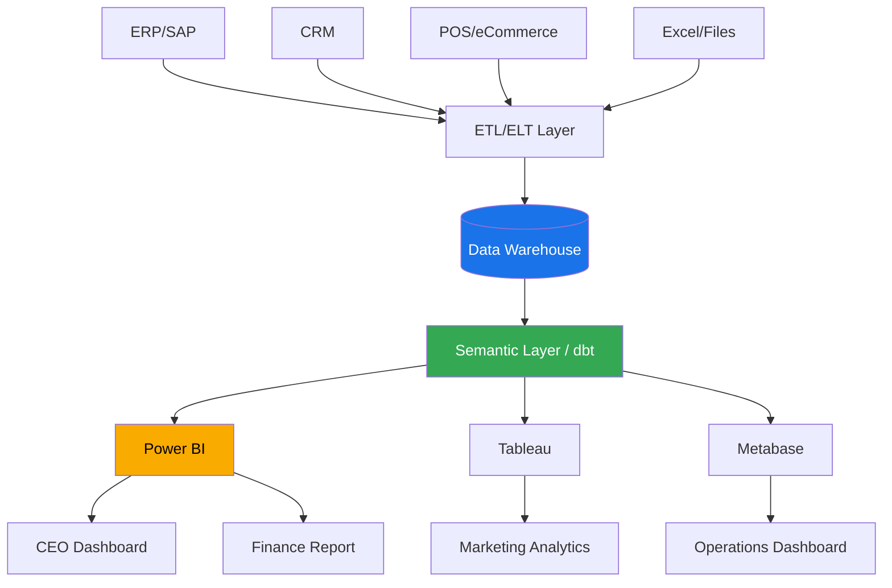

# DA01 — Business Intelligence (BI)

> **Triết lý cốt lõi:** "Dữ liệu không có nghĩa lý nếu không ai hiểu nó. BI biến số liệu thành quyết định."

---

## 1. Learning Objectives

Sau khi hoàn thành module này, người học có thể:

- Giải thích kiến trúc BI stack từ nguồn dữ liệu đến dashboard cuối cùng
- Phân biệt OLTP vs OLAP và biết khi nào dùng loại nào
- So sánh các BI tools phổ biến (Power BI, Tableau, Looker, Metabase) và chọn phù hợp cho từng bối cảnh VN
- Thiết kế KPI dashboard theo nguyên tắc chuyên nghiệp
- Triển khai self-service BI cho người dùng nghiệp vụ không có kỹ năng kỹ thuật
- Đánh giá mức độ data literacy của một doanh nghiệp VN
- Tư vấn lộ trình BI cho SME và enterprise VN

**Cấp độ:** Intermediate → Advanced  
**Thời gian học:** 20–30 giờ  
**Prerequisites:** Hiểu cơ bản về Excel, SQL cơ bản, khái niệm database

---

## 2. Business Context

### Tại sao BI quan trọng trong doanh nghiệp VN hiện nay?

Năm 2024–2025, các doanh nghiệp Việt Nam đang đối mặt với:

- **Dữ liệu nhiều nhưng insight ít:** Doanh nghiệp tích lũy dữ liệu từ ERP, CRM, POS, website — nhưng phần lớn chỉ dùng Excel để báo cáo
- **Ra quyết định chậm:** CEO chờ CFO báo cáo cuối tháng để biết kết quả kinh doanh tháng trước
- **Thiếu nhất quán số liệu:** Phòng Sales báo doanh thu khác với phòng Kế toán do cách tính khác nhau
- **Cạnh tranh tăng:** Các đối thủ nước ngoài (Grab, Shopee, Lazada) dùng real-time analytics để ra quyết định trong vài giây

**Ví dụ thực tế:**
- **VCB (Vietcombank):** Triển khai Oracle BI để theo dõi performance 1.100+ chi nhánh theo real-time
- **Vinamilk:** Dùng SAP BusinessObjects để theo dõi doanh thu 63 tỉnh thành theo ngày
- **FPT Software:** Xây dựng BI Practice riêng, cung cấp dịch vụ BI cho khách hàng quốc tế
- **Masan Group:** Dùng BI để quản lý chuỗi cung ứng 3.000+ SKU trên toàn quốc

### Bối cảnh số VN:
- Chuyển đổi số đang tăng tốc: 70% doanh nghiệp VN có kế hoạch đầu tư data analytics trong 2024–2026
- Thiếu nhân lực: Ước tính thiếu 150.000 chuyên gia data vào 2025 (theo McKinsey Vietnam)
- Chi phí cloud giảm: Google Cloud, AWS, Azure đều có data center tại Singapore/VN → latency thấp hơn

---

## 3. Definitions

| Thuật ngữ | Định nghĩa | Ví dụ VN |
|-----------|-----------|----------|
| **Business Intelligence (BI)** | Tập hợp công nghệ, quy trình và phương pháp thu thập, tích hợp, phân tích và trình bày dữ liệu để hỗ trợ ra quyết định kinh doanh | Dashboard doanh thu theo ngày của Vinamilk |
| **OLTP (Online Transaction Processing)** | Hệ thống xử lý giao dịch hàng ngày: INSERT, UPDATE nhanh, nhiều user đồng thời | Hệ thống POS của Thế Giới Di Động |
| **OLAP (Online Analytical Processing)** | Hệ thống phân tích dữ liệu lịch sử: truy vấn phức tạp trên dữ liệu lớn, ít user | Báo cáo doanh thu 5 năm của Masan |
| **ETL (Extract, Transform, Load)** | Quy trình lấy dữ liệu từ nguồn, biến đổi theo format chuẩn, nạp vào kho dữ liệu | Đồng bộ dữ liệu từ SAP sang Power BI |
| **Data Warehouse (DWH)** | Kho lưu trữ dữ liệu lịch sử, tối ưu cho truy vấn phân tích | DWH của VCB chứa 10 năm giao dịch |
| **Dashboard** | Màn hình hiển thị trực quan các chỉ số kinh doanh quan trọng | CEO Dashboard của FPT Telecom |
| **KPI (Key Performance Indicator)** | Chỉ số đo lường hiệu suất then chốt | Tỷ lệ nợ xấu của ngân hàng ACB |
| **Self-service BI** | Người dùng nghiệp vụ tự tạo báo cáo mà không cần IT | Nhân viên Sales tự kéo báo cáo khách hàng |
| **Data Literacy** | Khả năng đọc, hiểu, phân tích và làm việc với dữ liệu | Nhân viên Masan đọc được biểu đồ Pareto |
| **Ad-hoc Report** | Báo cáo được tạo theo yêu cầu đột xuất | CEO hỏi: "Doanh thu tuần này của miền Trung?" |

---

## 4. Core Concepts

### 4.1 BI Stack Architecture

Kiến trúc BI hiện đại gồm 5 lớp:

```
┌─────────────────────────────────────────────────────────────────┐
│                     BI STACK ARCHITECTURE                        │
├─────────────────────────────────────────────────────────────────┤
│  LAYER 5: CONSUMPTION (Presentation)                            │
│  ┌──────────────┐ ┌──────────────┐ ┌──────────────┐           │
│  │  Dashboards  │ │   Reports    │ │   Alerts     │           │
│  │  (Power BI)  │ │  (Scheduled) │ │  (Real-time) │           │
│  └──────────────┘ └──────────────┘ └──────────────┘           │
├─────────────────────────────────────────────────────────────────┤
│  LAYER 4: SEMANTIC (Business Logic)                             │
│  ┌──────────────────────────────────────────────────────────┐  │
│  │  Data Model | Metrics Definitions | Business Rules       │  │
│  │  (dbt, LookML, Power BI Dataset)                         │  │
│  └──────────────────────────────────────────────────────────┘  │
├─────────────────────────────────────────────────────────────────┤
│  LAYER 3: STORAGE (Data Warehouse / Data Mart)                  │
│  ┌──────────────────────────────────────────────────────────┐  │
│  │  DWH: Snowflake / BigQuery / Redshift / SQL Server       │  │
│  │  Data Mart: Finance Mart | Sales Mart | HR Mart          │  │
│  └──────────────────────────────────────────────────────────┘  │
├─────────────────────────────────────────────────────────────────┤
│  LAYER 2: INTEGRATION (ETL/ELT)                                 │
│  ┌──────────────────────────────────────────────────────────┐  │
│  │  Fivetran | Airbyte | SSIS | Talend | Apache Nifi       │  │
│  │  Staging Area → Transform → Load                         │  │
│  └──────────────────────────────────────────────────────────┘  │
├─────────────────────────────────────────────────────────────────┤
│  LAYER 1: SOURCE SYSTEMS                                        │
│  ┌──────┐ ┌──────┐ ┌──────┐ ┌──────┐ ┌──────┐ ┌──────┐      │
│  │ ERP  │ │ CRM  │ │ POS  │ │ Web  │ │Excel │ │ API  │      │
│  │(SAP) │ │(SFDC)│ │      │ │ App  │ │Files │ │Third │      │
│  └──────┘ └──────┘ └──────┘ └──────┘ └──────┘ └──────┘      │
└─────────────────────────────────────────────────────────────────┘
```

### 4.2 OLTP vs OLAP — So sánh chi tiết

| Tiêu chí | OLTP | OLAP |
|----------|------|------|
| **Mục đích** | Xử lý giao dịch hàng ngày | Phân tích, báo cáo |
| **Thiết kế DB** | Normalized (3NF) | Denormalized (Star/Snowflake) |
| **Kích thước query** | Nhỏ, cụ thể | Lớn, tổng hợp |
| **Số lượng user** | Hàng nghìn đồng thời | Vài chục analyst |
| **Dữ liệu** | Hiện tại, real-time | Lịch sử, theo thời kỳ |
| **Ví dụ VN** | Phần mềm kế toán MISA | Báo cáo BI Vinamilk |
| **Tốc độ write** | Rất nhanh (ms) | Chậm (batch) |
| **Tốc độ read phức tạp** | Chậm | Nhanh (tối ưu) |
| **Tool** | MySQL, SQL Server, Oracle | Snowflake, BigQuery, Redshift |

### 4.3 ETL vs ELT

```
ETL (Traditional):
Source → [Extract] → Staging → [Transform] → [Load] → DWH
         ↑ lấy dữ liệu    ↑ biến đổi ngoài DWH   ↑ nạp vào

ELT (Modern Cloud):
Source → [Extract] → [Load] → DWH → [Transform in-place]
         ↑ lấy nhanh  ↑ nạp thô vào DWH  ↑ dbt transform bên trong DWH
```

**Khi nào dùng ETL (VN context):**
- Hạ tầng on-premise (server nội bộ)
- Dữ liệu nhạy cảm không được đưa lên cloud
- Hệ thống legacy (ngân hàng cũ, BHXH...)

**Khi nào dùng ELT (modern):**
- Cloud DWH (BigQuery, Snowflake)
- Volume lớn, cần tốc độ cao
- Team có kỹ năng dbt/SQL tốt

### 4.4 OLAP Cube và Dimensions

```
OLAP CUBE — Ví dụ Vinamilk:

          Thời gian
          (Q1-Q4)
         /
        /
       /_________ Sản phẩm
      |           (Sữa tươi, Sữa chua, Kem...)
      |
   Khu vực
   (HN, HCM, Đà Nẵng...)

→ Câu hỏi: "Doanh thu Sữa tươi tại HN trong Q1/2024 là bao nhiêu?"
→ Drill-down: Tháng 1 → Tuần 1 → Ngày 1
→ Slice: Chỉ xem Q1 (cố định 1 dimension)
→ Dice: Q1 + Sữa tươi + HN (cố định nhiều dimensions)
→ Roll-up: Xem theo Quý thay vì Tháng
→ Pivot: Đổi hàng/cột trong báo cáo
```

### 4.5 BI Tools Comparison — VN Context

| Tiêu chí | Power BI | Tableau | Looker (Google) | Metabase |
|----------|----------|---------|---------|----------|
| **Chi phí** | $10/user/tháng | $70/user/tháng | $$ (enterprise) | Free (OSS) |
| **Dễ dùng** | ★★★★ | ★★★★ | ★★★ | ★★★★★ |
| **Tích hợp M365** | ★★★★★ | ★★ | ★★★ | ★★ |
| **Scalability** | ★★★ | ★★★★ | ★★★★★ | ★★★ |
| **Self-service** | ★★★★ | ★★★★ | ★★★ | ★★★★★ |
| **VN dùng nhiều** | ★★★★★ | ★★★ | ★★ | ★★★ |
| **Phù hợp với** | SME-Enterprise có Office 365 | Enterprise có budget lớn | Tech company dùng GCP | Startup, SME tech |
| **Ví dụ VN** | VCB, Masan, FPT | Grab VN, Shopee | VNG (nội bộ) | KiotViet, MISA |

### 4.6 KPI Dashboard Design Principles

**Nguyên tắc thiết kế dashboard chuyên nghiệp:**

```
┌─────────────────────────────────────────────────────────────┐
│  EXECUTIVE DASHBOARD — VINAMILK Q2/2024                     │
│  Cập nhật: 30/06/2024 | Người xem: CEO                     │
├────────────────────┬────────────────────┬───────────────────┤
│  DOANH THU         │  LỢI NHUẬN GỘP     │  THỊ PHẦN        │
│  ▲ 12.5%          │  ▲ 8.3%            │  ► 40.2%         │
│  2.450 tỷ VND     │  35.6%             │  (Stable)        │
├────────────────────┴────────────────────┴───────────────────┤
│  Top 5 Sản phẩm        │  Doanh thu theo khu vực           │
│  [Bar Chart]           │  [Map of Vietnam]                 │
├────────────────────────┴───────────────────────────────────┤
│  Xu hướng 12 tháng     │  Alerts: ▼ Miền Trung -5%        │
│  [Line Chart]          │  [Action Required]                │
└─────────────────────────────────────────────────────────────┘
```

**5 nguyên tắc vàng:**
1. **5-second rule:** CEO phải hiểu tình trạng trong 5 giây
2. **1 screen = 1 story:** Mỗi dashboard kể 1 câu chuyện, không nhồi nhét
3. **Traffic light colors:** Đỏ = vấn đề, Vàng = cảnh báo, Xanh = tốt
4. **Context matters:** Luôn so sánh với kỳ trước / target
5. **Drill-down ready:** Click được để xem chi tiết

### 4.7 Self-Service BI

**Mô hình tổ chức BI theo cấp độ:**

```
CẤP ĐỘ TỰ PHỤC VỤ (Self-service Maturity):

Level 4: Enterprise BI Platform        ← CEO tự kéo báo cáo
         (Governed, consistent)

Level 3: Department BI                 ← Trưởng phòng tự làm
         (Business users create)

Level 2: Power User BI                 ← Data Analyst làm
         (Guided templates)

Level 1: IT-Driven Reports             ← IT làm tất cả
         (Bottleneck, slow)

→ Mục tiêu: Đẩy lên Level 3-4 trong 2-3 năm
```

### 4.8 Data Literacy Framework

**4 cấp độ Data Literacy:**

| Cấp độ | Khả năng | Ví dụ |
|--------|---------|-------|
| **Cơ bản** | Đọc và hiểu biểu đồ đơn giản | Đọc cột bar chart |
| **Trung cấp** | Tự tạo pivot table, lọc dữ liệu | Dùng Excel PivotTable |
| **Nâng cao** | Tạo dashboard, phân tích xu hướng | Dùng Power BI |
| **Chuyên gia** | Xây dựng mô hình, statistical analysis | Data Scientist |

---

## 5. Business Value

### Giá trị BI mang lại cho doanh nghiệp VN:

**Quantitative (Đo lường được):**
- Giảm thời gian làm báo cáo: từ 5 ngày/tháng → 2 giờ/tháng (ví dụ thực tế tại FPT Telecom)
- Tăng tốc độ ra quyết định: từ "chờ cuối tháng" → "real-time"
- Giảm lỗi báo cáo: không còn "2 phòng báo số khác nhau"
- ROI BI implementation thường 3x–10x chi phí trong 3 năm

**Qualitative (Định tính):**
- Văn hóa data-driven thay vì gut-feeling
- Phát hiện vấn đề sớm hơn (early warning)
- Tăng niềm tin của investor/board với số liệu minh bạch
- Nền tảng cho AI/ML về sau

**Case số liệu thực:**
- Techcombank triển khai BI → giảm 60% thời gian risk reporting
- Masan Consumer dùng BI → tăng 15% hiệu quả phân phối tại 63 tỉnh

---

## 6. Enterprise Role

**BI trong cấu trúc doanh nghiệp:**

```
BOARD / CEO
    │
    ├── CFO ←──── Finance BI Dashboard (P&L, Cash Flow, Budget vs Actual)
    │
    ├── CMO ←──── Marketing BI (Campaign ROI, Customer Segment, Churn)
    │
    ├── CSO ←──── Sales BI (Pipeline, Win Rate, Revenue by Region/Rep)
    │
    ├── COO ←──── Operations BI (OEE, SLA, Inventory Turnover)
    │
    └── CHRO ←─── HR BI (Headcount, Attrition, Productivity)
         │
         └── IT/Data Team ──→ Quản lý BI Platform (Data Engineer, BI Developer)
```

**Vị trí trong Data Maturity Model:**

```
Stage 1: Descriptive   → "Chuyện gì đã xảy ra?" (báo cáo BI cơ bản)
Stage 2: Diagnostic    → "Tại sao xảy ra?" (drill-down analysis)
Stage 3: Predictive    → "Sẽ xảy ra gì?" (forecast, ML)
Stage 4: Prescriptive  → "Nên làm gì?" (AI recommendation)

BI chủ yếu phục vụ Stage 1 và 2.
```

---

## 7. Departments Related

| Phòng ban | Cách dùng BI | Ví dụ metric |
|-----------|-------------|-------------|
| **Ban Giám đốc / Board** | Executive dashboards, KPI tổng thể | Revenue, EBITDA, Market Share |
| **Tài chính - Kế toán** | Budget vs Actual, Cash flow, Cost analysis | Variance %, DSO, DPO |
| **Kinh doanh / Sales** | Pipeline, territory performance, forecast | Win rate, ASP, Revenue by rep |
| **Marketing** | Campaign analytics, customer segment | CAC, ROAS, Conversion rate |
| **Vận hành** | Production KPI, SLA tracking, OEE | OEE, Defect rate, On-time delivery |
| **Nhân sự (HR)** | Headcount, attrition, training | Attrition rate, Cost per hire |
| **IT** | System performance, ticket metrics | Uptime, SLA compliance |
| **Chuỗi cung ứng** | Inventory, supplier, logistics | Inventory turnover, Stockout rate |

---

## 8. Input

**Nguồn dữ liệu đầu vào cho BI:**

| Loại nguồn | Ví dụ | Format |
|-----------|-------|--------|
| **ERP Systems** | SAP, Oracle, MISA, Bravo | Database tables, API |
| **CRM** | Salesforce, HubSpot, AMIS | REST API, Database |
| **POS / eCommerce** | KiotViet, Shopify, Lazada | API, CSV export |
| **HRM** | HRMS VN, SAP HR, BambooHR | Database, Excel |
| **File-based** | Excel báo cáo tay, CSV | Excel/CSV files |
| **External data** | GSO statistics, Nielsen, đối thủ | Web scraping, purchased data |
| **IoT / sensor** | Nhà máy Vinamilk, máy móc | Real-time streams |
| **Web/App** | Google Analytics, Firebase | API |
| **Banking** | Core banking transactions | Batch file, API |

---

## 9. Output

**Sản phẩm đầu ra của BI:**

| Output | Mô tả | Người nhận |
|--------|-------|-----------|
| **Executive Dashboard** | KPI tổng quan, traffic light | CEO, Board |
| **Operational Report** | Chi tiết hàng ngày/tuần | Manager |
| **Financial Report** | P&L, Balance Sheet dạng BI | CFO, Kế toán |
| **Ad-hoc Analysis** | Phân tích đột xuất theo yêu cầu | Any stakeholder |
| **Scheduled Email Report** | Tự động gửi PDF/Excel | Subscription list |
| **Alert / Notification** | Khi KPI vượt/dưới ngưỡng | Responsible owner |
| **Self-service Workspace** | Người dùng tự khám phá | Business users |
| **Embedded Analytics** | BI tích hợp vào app nội bộ | End users in app |

---

## 10. Business Process

**Quy trình BI end-to-end:**

```
BPMN-style BI Process:

[Source Systems]
     │
     ▼
[Data Extraction] ← Hàng ngày / real-time / event-based
     │
     ▼
[Data Staging] ← Lưu tạm dữ liệu thô, chưa transform
     │
     ▼
[Data Transformation] ← Làm sạch, chuẩn hóa, enrich
     │
     ▼
[Data Warehouse / Data Mart] ← Lưu dữ liệu đã chuẩn
     │
     ▼
[Semantic Layer] ← Định nghĩa business metrics, KPI logic
     │
     ▼
[BI Tool / Dashboard] ← Visualization, report
     │
     ▼
[End Users] → Quyết định kinh doanh

Governance Loop:
[End Users] → Feedback → [Data Team] → Cải thiện definitions → [Semantic Layer]
```

**Chu kỳ BI điển hình tại doanh nghiệp VN:**
- **Daily:** Refresh data lúc 6:00 sáng, dashboard sẵn sàng cho họp 8:00
- **Weekly:** Báo cáo tuần tự động gửi email thứ Hai 7:00 sáng
- **Monthly:** Báo cáo tháng có data đến ngày cuối tháng (T+1 hoặc T+2)
- **Ad-hoc:** Data analyst xử lý yêu cầu đột xuất trong 4–24 giờ

---

## 11. Data Flow

```
DATA FLOW TRONG HỆ THỐNG BI:

┌──────────────────────────────────────────────────────────────┐
│ SOURCE SYSTEMS (Operational)                                  │
│  MISA ERP → SAP → CRM → POS → Excel → External APIs         │
└──────────────────────┬───────────────────────────────────────┘
                       │ CDC / Batch Extract / API Pull
                       ▼
┌──────────────────────────────────────────────────────────────┐
│ INGESTION LAYER                                               │
│  Airbyte / Fivetran / Custom scripts / SSIS                  │
└──────────────────────┬───────────────────────────────────────┘
                       │ Raw data (unchanged)
                       ▼
┌──────────────────────────────────────────────────────────────┐
│ RAW LAYER (Bronze / Staging)                                  │
│  Dữ liệu thô, chưa transform, lưu để audit                  │
└──────────────────────┬───────────────────────────────────────┘
                       │ dbt transformations
                       ▼
┌──────────────────────────────────────────────────────────────┐
│ CONFORMED LAYER (Silver / Cleaned)                            │
│  Dữ liệu đã chuẩn hóa, deduplicate, validate               │
└──────────────────────┬───────────────────────────────────────┘
                       │ Business logic applied
                       ▼
┌──────────────────────────────────────────────────────────────┐
│ PRESENTATION LAYER (Gold / Data Mart)                         │
│  Star Schema, pre-aggregated, optimized for BI               │
└──────────────────────┬───────────────────────────────────────┘
                       │ Direct Connect / Import
                       ▼
┌──────────────────────────────────────────────────────────────┐
│ BI TOOLS (Power BI / Tableau / Metabase)                      │
│  Dashboard → Report → Alert → Self-service                   │
└──────────────────────────────────────────────────────────────┘
```

---

## 12. Money Flow

**Chi phí và đầu tư BI:**

```
BI COST STRUCTURE (Ước tính cho SME VN 200 nhân viên):

CAPEX (Đầu tư ban đầu):
├── License/Setup: $5,000–$20,000
├── Implementation (tư vấn, setup): $10,000–$50,000
└── Training: $2,000–$5,000

OPEX (Chi phí vận hành hàng năm):
├── Software license: $3,000–$15,000/năm
├── Cloud infrastructure: $1,000–$5,000/năm
├── BI Developer/Analyst: 1–2 FTE ($15,000–$40,000/năm VN)
└── Maintenance & support: $2,000–$5,000/năm

ROI Typical:
├── Giảm thời gian báo cáo: 50–80%
├── Phát hiện vấn đề sớm → tiết kiệm: $50,000+/năm
└── Payback period: 12–24 tháng
```

**Luồng tiền liên quan đến BI decisions:**
- BI giúp phát hiện revenue leak (rò rỉ doanh thu)
- Monitor cost variance để kiểm soát chi phí
- Cash flow forecasting dashboard
- Phát hiện fraud (bất thường trong giao dịch)

---

## 13. Document Flow

**Luồng tài liệu trong dự án BI:**

```
PROJECT INITIATION:
Business Requirements Doc → Technical Spec → Data Mapping Doc

DEVELOPMENT:
ETL Design Doc → Data Model Doc → Dashboard Mockup → Test Cases

DEPLOYMENT:
User Guide → Training Materials → SOP Dashboard Usage

OPERATIONS:
Data Quality Report (hàng ngày) → BI Performance Report (hàng tháng)
Incident Report (khi có lỗi) → Change Request (khi có yêu cầu mới)
```

---

## 14. Roles

| Vai trò | Mô tả | Kỹ năng cần có |
|---------|-------|----------------|
| **BI Manager / Lead** | Dẫn dắt chiến lược BI, quản lý team | Business acumen + Tech leadership |
| **Data Engineer** | Build pipelines ETL/ELT, maintain infrastructure | Python, SQL, Airflow, dbt |
| **BI Developer** | Xây dựng dashboards, data models trong BI tool | Power BI/Tableau, DAX/SQL |
| **Data Analyst** | Phân tích ad-hoc, trả lời câu hỏi business | SQL, Excel, statistics |
| **Business Analyst (BA)** | Cầu nối giữa business và data team | Business domain, requirements |
| **Data Steward** | Đảm bảo data quality và governance | Domain knowledge, process |
| **Business User** | Dùng dashboard để ra quyết định | Data literacy cơ bản |

---

## 15. Responsibilities

**Phân chia trách nhiệm:**

- **C-Level:** Define business questions cần trả lời, approve KPI definitions
- **BI Manager:** Chiến lược BI, roadmap, quản lý team, prioritize backlog
- **Data Engineer:** Đảm bảo pipeline chạy ổn định, dữ liệu tươi, không mất mát
- **BI Developer:** Đảm bảo dashboard chính xác, hiệu suất tốt, UX tốt
- **Data Analyst:** Phân tích sâu, insight generation, ad-hoc requests
- **Business User:** Dùng dashboard đúng cách, báo cáo lỗi, đề xuất cải tiến

---

## 16. RACI Matrix

| Hoạt động | CEO | BI Manager | Data Engineer | BI Developer | Business User |
|-----------|-----|------------|--------------|--------------|---------------|
| Define KPI strategy | A | R | I | I | C |
| Build ETL pipeline | I | A | R | C | I |
| Design dashboard | I | A | C | R | C |
| Data quality review | I | A | C | R | I |
| Approve go-live | A | R | C | C | C |
| Training users | I | A | I | R | I |
| Daily monitoring | I | A | R | C | I |

**R**=Responsible, **A**=Accountable, **C**=Consulted, **I**=Informed

---

## 17. Frameworks

### 17.1 Gartner BI & Analytics Maturity Model

```
Level 5: Autonomy     → AI tự ra quyết định
Level 4: Predictive   → Dự báo tương lai
Level 3: Diagnostic   → Giải thích nguyên nhân
Level 2: Descriptive  → Báo cáo những gì đã xảy ra ← Most VN companies
Level 1: Reactive     → Excel, báo cáo tay ← SME VN
```

### 17.2 Data & Analytics Framework (Gartner)

- **Information Architecture:** Cách tổ chức và quản lý dữ liệu
- **Analytics Platforms:** Công cụ phân tích và visualization
- **Governance & Trust:** Đảm bảo dữ liệu chính xác và tin cậy
- **People & Process:** Con người và quy trình vận hành

### 17.3 Balanced Scorecard + BI

```
BSC Perspective → KPI → BI Dashboard

Financial     → Revenue, ROE, EBITDA           → Finance Dashboard
Customer      → NPS, Retention, CSAT           → CX Dashboard
Internal      → OEE, Defect Rate, Cycle Time   → Operations Dashboard
Learning      → Training completion, Attrition  → HR Dashboard
```

---

## 18. International Standards

| Standard | Áp dụng trong BI | Relevance cho VN |
|---------|-----------------|-----------------|
| **ISO 8000** | Data quality standards | Quan trọng cho DN xuất khẩu |
| **DAMA-DMBOK** | Data management body of knowledge | Framework tham chiếu của Data team |
| **COBIT** | IT governance bao gồm BI/data | Ngân hàng VN phải tuân thủ |
| **GDPR** | Bảo vệ dữ liệu cá nhân (EU) | Relevance nếu có khách hàng EU |
| **ISO/IEC 25012** | Data quality model | Reference model |
| **TOGAF** | Enterprise Architecture bao gồm data | FPT, Viettel áp dụng |

---

## 19. Vietnam Context

### Bối cảnh BI tại Việt Nam:

**Đặc điểm riêng của thị trường VN:**

1. **Hệ thống phân mảnh:** Nhiều DN VN dùng nhiều phần mềm khác nhau không kết nối (MISA kế toán + Excel sales + phần mềm riêng HRM)

2. **Thiếu Data Engineer:** Năm 2024, VN có khoảng 5.000 Data Engineer, thiếu ít nhất 30.000 người

3. **Văn hóa báo cáo truyền thống:** CEO VN quen nhận báo cáo Word/Excel, chưa quen dùng dashboard

4. **Ưu tiên Power BI:** Microsoft có market share cao tại VN (Office 365 phổ biến) → Power BI là lựa chọn phổ biến nhất

5. **Cloud adoption tăng:** Các ngân hàng, bảo hiểm VN đang move to cloud theo Thông tư 09/2020/TT-NHNN

**Các công ty BI/Data service tại VN:**
- **FPT Software:** BI Practice lớn nhất VN, phục vụ khách hàng Nhật, Mỹ, AU
- **Harvey Nash Vietnam:** Data & Analytics consulting
- **Dgroup:** Power BI specialist
- **KMS Technology:** Data engineering services
- **VietBI (cộng đồng):** Community of Power BI users tại VN

**Use cases thực tế theo ngành:**
- **Banking (VCB, ACB, Techcombank):** Risk dashboard, NPA monitoring, branch performance
- **Retail (MWG, Vinmart):** Inventory heatmap, store comparison, shrinkage analysis  
- **Manufacturing (Hòa Phát, Vinamilk):** OEE dashboard, production vs plan
- **Telecom (Viettel, VNPT):** Churn prediction dashboard, network quality
- **Real estate (Novaland, VHM):** Project progress, sales velocity

---

## 20. Legal Considerations

**Các quy định pháp lý liên quan đến BI tại VN:**

| Quy định | Nội dung | Ảnh hưởng đến BI |
|----------|----------|-----------------|
| **Nghị định 13/2023/NĐ-CP** | Bảo vệ dữ liệu cá nhân | Phải anonymize personal data trong BI |
| **Luật An ninh mạng 2018** | Quản lý dữ liệu quan trọng | Data localization cho dữ liệu nhạy cảm |
| **Thông tư 09/2020/TT-NHNN** | An toàn thông tin trong NH | Yêu cầu audit log, data classification |
| **Thông tư 02/2023/TT-BTC** | Hóa đơn điện tử | BI phải xử lý được data hóa đơn điện tử |
| **Nghị định 47/2020/NĐ-CP** | Quản lý hạ tầng số | Quy định về cloud storage |

**Lưu ý thực hành:**
- Không lưu CCCD, số tài khoản, dữ liệu y tế trong dashboard không được bảo vệ
- Cần có Role-Based Access Control (RBAC) trong BI tool
- Dữ liệu ngân hàng: phải theo quy định NHNN về bảo mật

---

## 21. Common Mistakes

**10 lỗi phổ biến khi triển khai BI tại VN:**

1. **"Làm BI trước khi có data tốt"**
   - Lỗi: Build dashboard khi data source còn bẩn, nhiều NULL, không nhất quán
   - Fix: Audit data quality trước, fix MDM issues trước

2. **"Không có Data Dictionary"**
   - Lỗi: "Doanh thu" ở phòng Sales ≠ "Doanh thu" ở phòng Kế toán
   - Fix: Viết Business Glossary rõ ràng, được CEO/CFO approve

3. **"Dashboard quá nhiều chỉ số"**
   - Lỗi: Dashboard có 50 biểu đồ, CEO không biết nhìn đâu
   - Fix: Mỗi dashboard ≤ 7 KPI chính (Miller's Law)

4. **"Dữ liệu không được update kịp thời"**
   - Lỗi: Dashboard hôm nay vẫn hiển thị dữ liệu hôm qua
   - Fix: Thiết lập pipeline rõ SLA (ví dụ: data sẵn sàng trước 7:00 sáng)

5. **"Không có ownership rõ ràng"**
   - Lỗi: Khi data sai không ai chịu trách nhiệm
   - Fix: Assign Data Owner cho từng domain (Finance data owner = CFO)

6. **"Bỏ qua training người dùng"**
   - Lỗi: Deploy xong, không ai dùng vì không biết
   - Fix: Training + user guide + office hours

7. **"Chọn tool quá phức tạp"**
   - Lỗi: SME 50 người mua Tableau Enterprise ($70k/năm)
   - Fix: Metabase (free) hoặc Power BI Pro ($10/user) đã đủ

8. **"Không có data governance"**
   - Lỗi: Mỗi phòng tự làm BI riêng → conflict số liệu
   - Fix: Central BI team + data catalog + single source of truth

9. **"Chỉ làm báo cáo tĩnh"**
   - Lỗi: Export PDF, email đi → không drill-down được
   - Fix: Interactive dashboard với filter, drill-down

10. **"Không đo ROI của BI"**
    - Lỗi: Không chứng minh được giá trị → budget bị cắt
    - Fix: Track: giờ tiết kiệm × lương nhân viên, quyết định được cải thiện

---

## 22. Best Practices

**Best practices từ các DN VN thành công:**

1. **Start with CEO's burning questions** — Hỏi CEO "3 câu hỏi quan trọng nhất bạn muốn trả lời mỗi sáng?" → build those first

2. **Single Source of Truth (SSOT)** — Chỉ có 1 nơi cho "Revenue", mọi dashboard phải lấy từ đó

3. **Data-as-a-Product mindset** — Treat mỗi dataset như một sản phẩm: có owner, SLA, documentation

4. **Agile BI development** — Sprint 2 tuần, ra mắt MVP dashboard sau 4–6 tuần, iterate

5. **Business user co-creation** — Mời business user tham gia thiết kế dashboard từ đầu

6. **Automated data quality checks** — Chạy Great Expectations hoặc dbt tests hàng ngày

7. **Version control for BI code** — Lưu DAX/SQL measures trong Git, không hardcode trong file .pbix

8. **Row-level security** — Sales Rep chỉ thấy data của region mình

9. **Certified dataset program** — IT/Data team "certify" dataset tin cậy, mark rõ ràng

10. **BI literacy program** — Training định kỳ, có BI champion trong mỗi phòng ban

---

## 23. KPIs

**KPIs đo lường hiệu quả của BI platform:**

| KPI | Định nghĩa | Target |
|-----|-----------|--------|
| **Dashboard Adoption Rate** | % user login vào BI tool ít nhất 1 lần/tuần | >70% |
| **Report Turnaround Time** | Thời gian từ khi yêu cầu → có báo cáo | <24 giờ |
| **Data Freshness** | % dataset được refresh đúng SLA | >99% |
| **Data Quality Score** | % records không có lỗi (NULL, outlier, duplicate) | >98% |
| **Self-service Rate** | % báo cáo do business user tự tạo | >40% |
| **BI Ticket Volume** | Số tickets yêu cầu IT làm báo cáo | Giảm 50% YoY |
| **Dashboard Load Time** | Thời gian dashboard load | <3 giây |
| **User Satisfaction** | Điểm NPS của BI platform | >50 |

---

## 24. Metrics

**Metrics theo từng domain BI:**

**Finance BI Metrics:**
- Revenue vs Budget variance: `(Actual - Budget) / Budget × 100%`
- Gross Margin: `(Revenue - COGS) / Revenue × 100%`
- DSO (Days Sales Outstanding): `AR / Revenue × 30`

**Sales BI Metrics:**
- Win Rate: `Closed Won / Total Opportunities × 100%`
- Average Deal Size: `Total Revenue / Number of Deals`
- Sales Cycle Length: `Avg days from lead → close`

**Operations BI Metrics:**
- OEE (Overall Equipment Effectiveness): `Availability × Performance × Quality`
- On-time Delivery Rate: `Orders delivered on time / Total orders`

---

## 25. Reports

**Danh mục báo cáo BI chuẩn cho DN VN:**

| Báo cáo | Tần suất | Người nhận | Tool |
|---------|---------|-----------|------|
| CEO Morning Dashboard | Hàng ngày | CEO | Power BI |
| P&L vs Budget | Hàng tháng | CFO, CEO, Board | Power BI / Excel |
| Sales Performance | Hàng tuần | CSO, Sales managers | Power BI |
| Cash Flow Forecast | Hàng tuần | CFO, Treasurer | Power BI / Excel |
| Inventory Analysis | Hàng ngày | Supply Chain | Power BI |
| HR Metrics | Hàng tháng | CHRO, HR managers | Power BI |
| Customer Analytics | Hàng tháng | CMO, CX team | Power BI / Tableau |
| Risk Dashboard (NH) | Real-time | Risk managers, CRO | Specialized BI |

---

## 26. Templates

**Templates cần có trong BI project:**

**1. Business Requirements Template:**
```
Tên dashboard: ___________
Người yêu cầu: ___________
Mục tiêu: ___________
Câu hỏi cần trả lời:
  1. ___________
  2. ___________
KPI cần hiển thị: ___________
Data source: ___________
Refresh frequency: ___________
Người dùng: ___________
Deadline: ___________
```

**2. Data Dictionary Template:**
```
Tên metric: Revenue
Định nghĩa business: Tổng giá trị đơn hàng đã xác nhận trong kỳ
Cách tính: SUM(order_value) WHERE status = 'confirmed'
Data source: ERP/Orders table
Owner: CFO
Cập nhật: Hàng ngày lúc 6:00
Loại trừ: Đơn hàng hủy, đơn hàng trả lại
```

---

## 27. Checklists

### Checklist triển khai BI dự án:

**Phase 1 — Assessment:**
- [ ] Audit tất cả data sources hiện tại
- [ ] Phỏng vấn stakeholders về nhu cầu báo cáo
- [ ] Đánh giá data quality hiện tại
- [ ] Định nghĩa KPIs và business glossary
- [ ] Chọn BI tool phù hợp

**Phase 2 — Foundation:**
- [ ] Setup data warehouse / data storage
- [ ] Build ETL/ELT pipelines
- [ ] Implement data quality checks
- [ ] Setup role-based access control
- [ ] Document data models

**Phase 3 — Development:**
- [ ] Build semantic layer / data model
- [ ] Develop dashboards theo priority
- [ ] User acceptance testing (UAT)
- [ ] Performance optimization
- [ ] Security review

**Phase 4 — Launch:**
- [ ] Training người dùng
- [ ] Go-live với monitoring
- [ ] Feedback collection
- [ ] Hypercare period (2 tuần hỗ trợ tích cực)
- [ ] Handover documentation

---

## 28. SOP

### SOP: Vận hành BI Platform hàng ngày

**Tên:** SOP-BI-001 — Daily BI Operations  
**Tần suất:** Hàng ngày  
**Người thực hiện:** Data Engineer / BI Developer

```
05:30 — Automated ETL pipelines start
06:00 — Data refresh hoàn tất (target)
06:15 — Automated data quality checks chạy
06:30 — Alert nếu có lỗi → Data Engineer on-call xử lý
07:00 — CEO/Management có thể dùng dashboard
07:30 — Daily stand-up của Data team (nếu có incident)
08:00 — Business users bắt đầu dùng

Nếu có lỗi:
1. Data Engineer nhận alert
2. Kiểm tra pipeline logs
3. Fix hoặc escalate (15 phút)
4. Thông báo cho BI Manager và users bị ảnh hưởng
5. Dashboard hiển thị "Last updated: [timestamp]" rõ ràng
6. Incident report sau khi fix xong
```

---

## 29. Case Study

### Case Study 1: VCB (Vietcombank) — Enterprise BI

**Bối cảnh:**
VCB có 1.100+ chi nhánh, 20 triệu khách hàng, cần monitor performance theo real-time.

**Vấn đề trước BI:**
- Báo cáo tổng hợp mất 3–5 ngày làm việc
- 15+ file Excel khác nhau, dữ liệu không nhất quán
- Không thể phát hiện chi nhánh có vấn đề kịp thời

**Giải pháp:**
- Triển khai Oracle Analytics Cloud + Oracle DWH
- Tích hợp Core Banking (T24 Temenos) → DWH → BI
- Build 50+ dashboards cho từng level (Teller → Branch Manager → Regional → HQ)

**Kết quả:**
- Báo cáo real-time thay vì T+3
- Phát hiện chi nhánh có tỷ lệ nợ xấu tăng sớm 30 ngày
- CEO có Executive Dashboard trên iPad
- Giảm 200 giờ làm báo cáo thủ công/tháng

---

### Case Study 2: FPT Telecom — Self-service BI

**Bối cảnh:**
FPT Telecom cần cung cấp BI cho 63 chi nhánh tỉnh, mỗi chi nhánh có nhu cầu báo cáo khác nhau.

**Giải pháp:**
- Power BI với Row-Level Security theo chi nhánh
- Self-service workspace: Chi nhánh tự tạo báo cáo tùy chỉnh
- Central certified datasets cho core metrics

**Kết quả:**
- 200+ business users tự tạo báo cáo
- IT giảm 70% thời gian làm báo cáo ad-hoc
- KPI churn reduction: phát hiện pattern churn sớm → giảm 8% churn rate

---

## 30. Small Business Example

### SME Example: Chuỗi cà phê 5 cửa hàng (50 nhân viên)

**Công ty:** The Coffee XYZ — 5 chi nhánh tại HCM  
**Budget BI:** 5 triệu VND/tháng  
**Tool chọn:** Metabase (free) + Google Sheets + POS API

**Dashboard cần:**
1. Doanh thu từng cửa hàng theo ngày
2. Best-selling items
3. Giờ cao điểm (để tối ưu nhân lực)
4. Chi phí nguyên vật liệu vs doanh thu

**Cách triển khai:**
- Dùng KiotViet POS → Google Sheets (API sync)
- Connect Metabase → Google Sheets
- Build 4 dashboards cơ bản trong 2 tuần
- Chủ tiệm dùng điện thoại xem Metabase mỗi sáng

**ROI:**
- Phát hiện 1 chi nhánh có chi phí nguyên liệu/doanh thu = 45% (thay vì target 30%)
- Điều tra → nhân viên nhập kho không đúng
- Tiết kiệm ước tính: 20 triệu/tháng

---

## 31. Enterprise Example

### Enterprise Example: Masan Group — BI cho Consumer Goods

**Công ty:** Masan Consumer Holdings — 3.000+ SKU, 63 tỉnh  
**BI Stack:** SAP BW on HANA + Power BI + Azure Synapse

**Use case chính:**
1. **Sell-out tracking:** Real-time dữ liệu bán ra từ điểm bán (Nielsen data integration)
2. **Distributor performance:** 3.000+ nhà phân phối, KPI theo vùng
3. **Promotion effectiveness:** ROI từng chương trình khuyến mại
4. **Inventory optimization:** Tránh stockout và overstock theo mùa vụ

**Architecture:**
```
SAP ERP → Azure Data Factory → Azure Synapse (DWH)
                                      ↓
Nielsen Market Data → Connector →  dbt transforms
                                      ↓
                               Power BI Premium
                               (3.000+ reports/tháng)
```

**Kết quả đo lường:**
- Inventory cost giảm 12% nhờ tối ưu
- Sales force productivity tăng 18% nhờ real-time data
- Thời gian lập kế hoạch khuyến mại giảm từ 2 tuần → 3 ngày

---

## 32. ERP Mapping

**BI tích hợp với ERP như thế nào:**

| ERP | BI Integration | Ghi chú |
|-----|---------------|---------|
| **SAP ECC/S4HANA** | SAP BW, SAP Analytics Cloud, Power BI (via SAP connector) | Phức tạp, cần SAP consultant |
| **Oracle EBS** | Oracle Analytics Cloud, Power BI (ODBC) | Thường dùng với Oracle DWH |
| **Microsoft Dynamics** | Power BI tích hợp native | Dễ nhất nếu đã có M365 |
| **MISA ERP** | Export Excel/CSV → Power BI | Manual hoặc API (MISA API) |
| **Odoo** | Odoo BI built-in + Power BI via PostgreSQL | Community version hạn chế |
| **Bravo (VN)** | Export CSV → BI | Không có native BI connector |
| **Fast Accounting (VN)** | Export → BI | Tương tự MISA |

**Lưu ý ERP VN:** MISA, Bravo, Fast — phần lớn không có native BI connector tốt → cần custom ETL hoặc dùng API nếu có.

---

## 33. Automation Opportunities

**Cơ hội tự động hóa trong BI:**

| Quy trình | Manual hiện tại | Tự động hóa | Tool |
|----------|----------------|------------|------|
| Data extraction từ ERP | Xuất Excel tay hàng ngày | Scheduled connector | Fivetran, Airbyte |
| Transform data | SQL query tay | dbt models chạy tự động | dbt + Airflow |
| Phát hiện data anomaly | Analyst check tay | Automated alerts | Great Expectations |
| Gửi báo cáo email | Xuất PDF, đính kèm email | Scheduled delivery | Power BI Subscriptions |
| Dashboard refresh | Nhấn nút tay | Scheduled refresh | Power BI Service |
| Data quality report | Analyst làm hàng tuần | Automated daily | dbt tests + Slack alert |
| Commentary generation | Analyst viết tay | AI-generated | GPT-4 API + BI |

---

## 34. AI Opportunities

**AI/ML trong BI:**

| AI Use Case | Mô tả | Tool | VN Readiness |
|------------|-------|------|-------------|
| **AI-generated insights** | Tự động giải thích biến động KPI | Power BI Smart Narratives, Tableau Pulse | Hiện có |
| **Anomaly detection** | Phát hiện bất thường tự động | Azure Anomaly Detector | Intermediate |
| **Natural Language Query** | Hỏi dashboard bằng tiếng Việt | Power BI Q&A, Metabase AI | Đang develop |
| **Predictive analytics** | Dự báo revenue, demand | Power BI AI visuals, Python in BI | Intermediate |
| **Auto-classification** | Tự động phân loại khách hàng | ML model embedded | Advanced |
| **Narrative BI** | Tự động viết tóm tắt báo cáo | GPT-4 + BI API | Emerging |

**Ví dụ AI BI tại VN:**
- Techcombank dùng AI để phát hiện giao dịch bất thường (fraud detection dashboard)
- VinFast dùng ML để dự báo nhu cầu đặt hàng phụ tùng
- FPT AI center cung cấp AI analytics cho khách hàng doanh nghiệp

---

## 35. Implementation Guide

### Lộ trình triển khai BI 6 tháng cho DN VN (100–500 người):

**Tháng 1 — Foundation:**
- Tuần 1–2: Discovery (phỏng vấn stakeholders, audit data)
- Tuần 3: Chọn BI tool, setup infrastructure
- Tuần 4: Kết nối data sources đầu tiên (ERP)

**Tháng 2 — Quick Wins:**
- Build 3–5 dashboards cơ bản (Finance, Sales, Operations)
- Pilot với 10 người dùng
- Gather feedback và iterate

**Tháng 3–4 — Scale:**
- Mở rộng thêm data sources (HR, Marketing)
- Build phân tầng user: Executive / Manager / Analyst
- Training wave 1 (50 users)

**Tháng 5 — Governance:**
- Viết Data Dictionary đầy đủ
- Implement Row-Level Security
- Setup data quality monitoring
- Document SOPs

**Tháng 6 — Self-service:**
- Training wave 2 (toàn bộ)
- Mở workspace self-service
- BI Center of Excellence kickoff
- ROI review và planning next phase

**Budget estimate SME VN (100 người):**
- Power BI Pro: 100 users × $10 = $1,000/tháng
- Azure SQL / BigQuery: $200–$500/tháng
- BI Developer (1 FTE): $1,500–$2,500/tháng VN
- Implementation (one-time): $10,000–$30,000
- **Total Year 1:** ~$50,000–$80,000

---

## 36. Consulting Guide

### Khi tư vấn BI cho khách hàng VN:

**Bước 1 — Diagnostics (2 buổi):**
- Hỏi CEO/CFO: "Quyết định quan trọng nhất mỗi tuần là gì? Bạn có đủ data để ra quyết định không?"
- Audit: Xem họ đang dùng bao nhiêu file Excel báo cáo
- Đánh giá data quality (có thể lấy mẫu 1.000 records)

**Bước 2 — Proposal:**
- Đừng bán "BI platform" — bán "Câu trả lời cho câu hỏi của CEO"
- ROI calculation cụ thể (giờ tiết kiệm, quyết định tốt hơn)
- Phased approach: quick wins trước, full platform sau

**Bước 3 — Implementation:**
- Luôn có executive sponsor (CFO hoặc CEO)
- Ưu tiên "1 source of truth" ngay từ đầu
- Training không phải optional — là critical success factor

**Red flags khi tư vấn:**
- "Data của chúng tôi không cần clean, cứ lấy vào dùng luôn" → Stop, fix data first
- "IT sẽ làm tất cả" → Business must be involved
- "Mua tool xong là xong" → Tool là 20%, process + people là 80%

---

## 37. Diagnostic Questions

**Câu hỏi chẩn đoán BI maturity của DN:**

**Cho CEO:**
1. Anh/chị nhận báo cáo doanh thu lần cuối là khi nào? Qua format gì?
2. Khi cần một số liệu đột xuất, mất bao lâu để có?
3. Có bao giờ 2 phòng ban báo cho anh/chị 2 con số khác nhau không?
4. Anh/chị biết chi nhánh/sản phẩm nào đang lỗ không?

**Cho CFO:**
1. Budget vs Actual được so sánh theo tần suất nào?
2. Cash flow forecast được cập nhật thường xuyên không?
3. Có dashboard nào để xem tổng quan tài chính real-time không?

**Cho Data/IT Team:**
1. Có bao nhiêu nguồn dữ liệu khác nhau?
2. Dữ liệu từ các nguồn có được tích hợp không?
3. Data refresh SLA hiện tại là gì?
4. Có Data Dictionary không? Ai maintain?

**Để đánh giá maturity:**
- 0 dashboard → Level 1 (Reactive)
- Dashboard nhưng manual → Level 2 (Descriptive)
- Automated + drill-down → Level 3 (Diagnostic)
- Predictive analytics → Level 4+

---

## 38. Interview Questions

**Câu hỏi phỏng vấn BI Developer/Analyst:**

**Kỹ thuật:**
1. Giải thích sự khác nhau giữa Star Schema và Snowflake Schema. Khi nào dùng loại nào?
2. Viết SQL query tính Rolling 3-Month Average Revenue.
3. DAX: Viết measure tính YoY Growth %.
4. Giải thích OLAP operations: Drill-down, Roll-up, Slice, Dice, Pivot.
5. Làm thế nào để xử lý slowly changing dimension (SCD)?

**Thiết kế:**
6. Nếu CEO muốn dashboard "chỉ nhìn là biết ngay tình trạng kinh doanh", bạn thiết kế gì?
7. Khi business user bảo "con số BI khác với Excel tôi tính", bạn xử lý thế nào?

**Kinh nghiệm:**
8. Dự án BI khó nhất bạn làm là gì? Vấn đề lớn nhất là gì?
9. Làm thế nào để đảm bảo data quality trong pipeline?
10. Bạn giải thích SQL query hay Power BI logic cho non-technical stakeholder như thế nào?

---

## 39. Exercises

**Bài tập thực hành:**

**Bài tập 1 — SQL/BI (Intermediate):**
Cho bảng Sales với columns: date, product, region, quantity, revenue. Viết query tính:
- Doanh thu theo tháng YTD
- Top 5 sản phẩm theo doanh thu trong Q1
- Region có tăng trưởng cao nhất MoM

**Bài tập 2 — Dashboard Design:**
Công ty bán lẻ 50 cửa hàng, CEO muốn xem hàng ngày. Vẽ mockup dashboard với tối đa 5 KPI. Giải thích tại sao chọn những KPI đó.

**Bài tập 3 — Tool Evaluation:**
Công ty 200 nhân viên, đang dùng Office 365, có SAP ERP, budget BI $2.000/tháng. Đề xuất BI stack và lý do.

**Bài tập 4 — Business Case:**
Viết business case 1 trang cho CFO của một công ty logistics VN để approve đầu tư BI $100.000.

**Bài tập 5 — Consulting Simulation:**
Đóng vai consultant gặp CEO của chuỗi nhà hàng 20 chi nhánh. CEO phàn nàn "tôi không biết chi nhánh nào lời lỗ". Conduct discovery interview (5 phút) và đề xuất quick win.

---

## 40. References

**Tài liệu tham khảo:**

**Sách:**
- *The Data Warehouse Toolkit* — Ralph Kimball (kinh điển về DWH & BI)
- *Storytelling with Data* — Cole Nussbaumer Knaflic (dashboard design)
- *Business Intelligence Guidebook* — Rick Sherman
- *The Analytics Setup Guidebook* — Pedram Navid

**Tiêu chuẩn & Framework:**
- DAMA-DMBOK (Data Management Body of Knowledge)
- Gartner BI & Analytics Magic Quadrant (hàng năm)
- Microsoft Power BI Documentation: docs.microsoft.com/powerbi

**Khóa học VN:**
- FUNiX: Data Analytics với Python
- CoderSchool: Data Engineering
- Vietnam Data Science Community (VDSC)

**Cộng đồng VN:**
- VietBI Facebook Group (10,000+ members)
- Power BI Vietnam Community
- Data Engineer Vietnam (Slack/Facebook)

**Công cụ thực hành miễn phí:**
- Power BI Desktop (free download)
- Metabase (open source)
- Google Looker Studio (free)
- DBeaver (SQL client free)

---

## Output Formats

### Mermaid Diagram — BI Architecture



---

### ASCII Diagram — BI Maturity Journey

```
HÀNH TRÌNH BI MATURITY CỦA DN VN:

REACTIVE          DESCRIPTIVE        DIAGNOSTIC        PREDICTIVE
(Level 1)    →   (Level 2)      →   (Level 3)     →  (Level 4)
    │                │                   │                │
Excel báo cáo    Dashboard tự động   Drill-down       ML Forecast
tay hàng tháng   nhưng còn lag       analysis          Revenue
    │                │                   │                │
"Tháng trước     "Hôm nay thế        "Tại sao         "Tháng tới
 thế nào?"        nào?"               vậy?"            thế nào?"
    │                │                   │                │
Phần lớn SME VN   SME tốt /          Enterprise VN    Tech/Banking
                  Enterprise VN       tiên tiến        VN top tier
```

---

### Flashcards

**Flashcard 1:**
Q: OLTP khác OLAP như thế nào? Cho ví dụ từng loại tại VN.
A: OLTP (Online Transaction Processing) xử lý giao dịch hàng ngày — nhanh, nhiều user (ví dụ: hệ thống POS Thế Giới Di Động). OLAP (Online Analytical Processing) dùng để phân tích dữ liệu lịch sử, truy vấn phức tạp (ví dụ: báo cáo doanh thu 5 năm của Masan). OLTP được normalize (3NF) để tối ưu write; OLAP được denormalize (Star Schema) để tối ưu read.

**Flashcard 2:**
Q: 3 sai lầm phổ biến nhất khi triển khai BI tại VN là gì?
A: (1) Build dashboard khi data còn bẩn — nên fix data quality trước; (2) Không có Business Glossary dẫn đến "Revenue" của Sales ≠ "Revenue" của Kế toán; (3) Không training người dùng — tool deploy xong nhưng không ai dùng. Thêm vào đó: chọn tool quá phức tạp/đắt so với nhu cầu thực tế.

**Flashcard 3:**
Q: Self-service BI là gì? Tại sao quan trọng với DN VN?
A: Self-service BI cho phép người dùng nghiệp vụ (không cần IT) tự tạo báo cáo và khám phá dữ liệu. Quan trọng với VN vì: (1) IT team thường quá tải với ad-hoc report requests; (2) Business user hiểu domain tốt hơn IT → tự phân tích hiệu quả hơn; (3) Tăng tốc ra quyết định từ ngày → giờ. Power BI và Metabase là 2 tool self-service BI phổ biến nhất tại VN.

---

### JSON Metadata

```json
{
  "module": {
    "code": "DA01",
    "name": "Business Intelligence",
    "domain": "Data",
    "subdomain": "Analytics & Reporting",
    "version": "1.0",
    "level": ["Intermediate", "Advanced"],
    "status": "complete",
    "estimated_hours": 25,
    "prerequisites": ["Excel cơ bản", "SQL cơ bản", "Khái niệm database"]
  },
  "topics": [
    "BI Stack Architecture",
    "OLTP vs OLAP",
    "ETL vs ELT",
    "Power BI",
    "Tableau",
    "Looker",
    "Metabase",
    "KPI Dashboard Design",
    "Self-service BI",
    "Data Literacy"
  ],
  "tools": ["Power BI", "Tableau", "Looker Studio", "Metabase", "Fivetran", "Airbyte", "dbt", "Apache Airflow"],
  "vietnam_context": {
    "relevant_companies": ["VCB", "FPT", "Masan", "Vinamilk", "Techcombank", "ACB"],
    "regulations": ["Nghị định 13/2023/NĐ-CP", "Luật An ninh mạng 2018", "Thông tư 09/2020/TT-NHNN"],
    "local_tools": ["MISA", "Bravo", "KiotViet"]
  },
  "frameworks": ["DAMA-DMBOK", "Gartner BI Maturity Model", "Balanced Scorecard"],
  "standards": ["ISO 8000", "COBIT", "GDPR"],
  "keywords": ["business intelligence", "dashboard", "OLAP", "ETL", "data warehouse", "KPI", "self-service BI", "data literacy"],
  "related_modules": ["DA02-data-warehouse", "DA03-master-data", "DA04-enterprise-architecture"],
  "last_updated": "2026-06-30"
}
```

---

*Module DA01 — Business Intelligence | Business Operating System Handbook v1.0*
