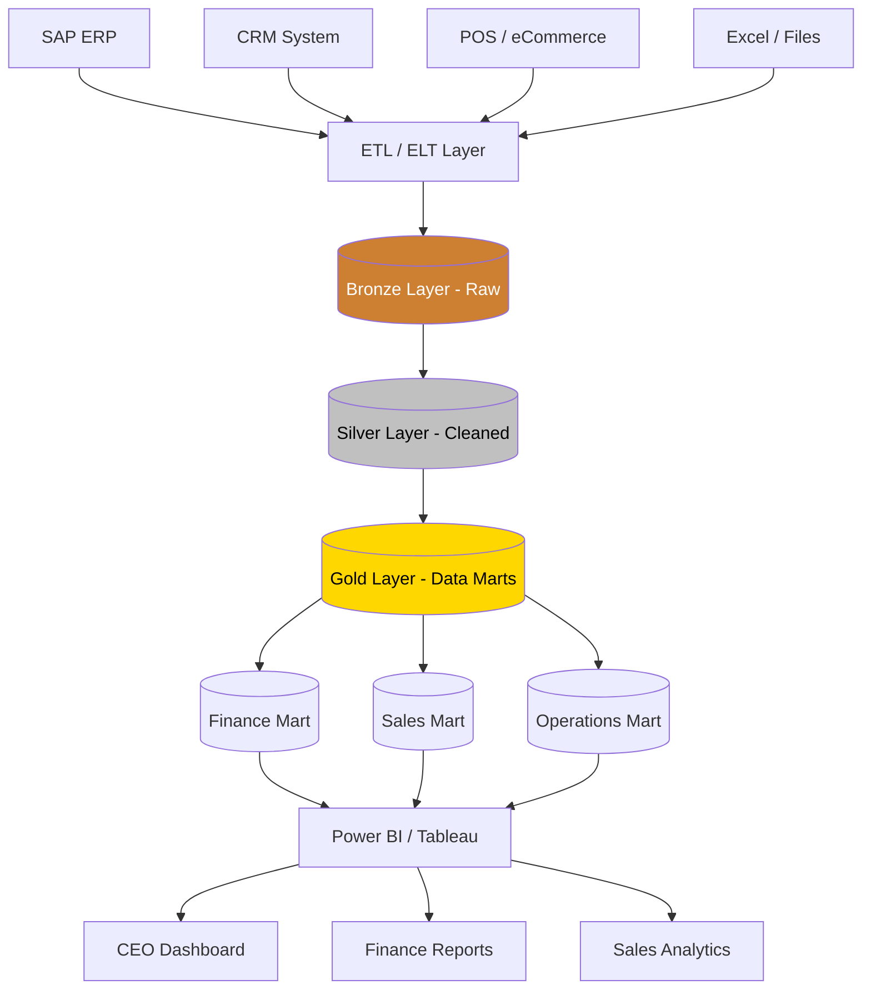

# DA02 — Data Warehouse (DWH)

> **Triết lý cốt lõi:** "Data Warehouse là bộ nhớ dài hạn của doanh nghiệp — lưu trữ lịch sử, đảm bảo nhất quán, và là nền tảng cho mọi phân tích."

---

## 1. Learning Objectives

Sau khi hoàn thành module này, người học có thể:

- Giải thích kiến trúc Data Warehouse và phân biệt với database thông thường
- So sánh phương pháp Kimball vs Inmon và biết khi nào áp dụng loại nào
- Thiết kế Star Schema và Snowflake Schema cho một domain nghiệp vụ cụ thể
- Hiểu và áp dụng Medallion Architecture (Bronze/Silver/Gold)
- Phân biệt Data Lake, Data Warehouse, Lakehouse — chọn đúng cho từng tình huống
- Đánh giá và lựa chọn modern data stack phù hợp (dbt, Snowflake, BigQuery, Databricks)
- Tư vấn lộ trình DWH cho doanh nghiệp VN từ on-premise đến cloud

**Cấp độ:** Intermediate → Advanced  
**Thời gian học:** 25–35 giờ  
**Prerequisites:** SQL trung cấp, khái niệm relational database, hiểu cơ bản về BI (DA01)

---

## 2. Business Context

### Tại sao doanh nghiệp VN cần Data Warehouse?

**Vấn đề thực tế:**

Một công ty sản xuất VN quy mô 500 người thường có:
- MISA ERP cho kế toán
- Phần mềm MES (Manufacturing Execution) riêng cho sản xuất
- Excel cho báo cáo quản lý
- CRM riêng cho sales team
- 5–10 file Excel báo cáo/tháng được compile thủ công

**Hậu quả:**
- Mất 3–5 ngày mỗi tháng compile báo cáo
- "Single version of truth" không tồn tại — mỗi phòng có số riêng
- Không thể phân tích cross-functional (vd: margin theo kênh phân phối)
- Dữ liệu lịch sử bị mất khi upgrade ERP

**Data Warehouse giải quyết:**
- Một nơi duy nhất chứa tất cả dữ liệu lịch sử, đã chuẩn hóa
- Queries phân tích không ảnh hưởng performance hệ thống operational
- Dữ liệu luôn nhất quán dù source systems khác nhau

**Ví dụ VN áp dụng thành công:**
- **FPT Group:** DWH tập trung cho toàn tập đoàn (FPT Software, FPT Telecom, FPT Education)
- **VNG Corporation:** DWH cho Zalo, ZaloPay analytics
- **Techcombank:** Oracle Exadata DWH cho risk analytics
- **Vinamilk:** SAP BW/4HANA DWH cho supply chain và sales analytics

---

## 3. Definitions

| Thuật ngữ | Định nghĩa | Ví dụ |
|-----------|-----------|-------|
| **Data Warehouse (DWH)** | Hệ thống lưu trữ dữ liệu tích hợp, định hướng chủ đề, không thay đổi, và theo thời gian — phục vụ phân tích và ra quyết định (Bill Inmon) | Oracle DWH của Techcombank |
| **Data Mart** | Tập con của DWH, tập trung vào một domain nghiệp vụ cụ thể | Finance Data Mart trong DWH VCB |
| **Star Schema** | Mô hình dữ liệu có 1 bảng Fact trung tâm kết nối với các Dimension tables | Fact_Sales ← Dim_Product, Dim_Date, Dim_Region |
| **Snowflake Schema** | Mở rộng của Star Schema, các Dimension được normalize thêm | Dim_Product → Dim_Category → Dim_Brand |
| **Fact Table** | Bảng chứa các sự kiện đo lường được (measures) + khóa ngoại đến Dimensions | Fact_Sales: sale_id, product_id, date_id, quantity, amount |
| **Dimension Table** | Bảng chứa thuộc tính mô tả (context) cho Fact | Dim_Product: product_id, name, category, brand, price |
| **ETL** | Extract (trích xuất) → Transform (biến đổi) → Load (nạp) | Lấy data từ SAP, clean, nạp vào DWH |
| **ELT** | Extract → Load → Transform (transform bên trong DWH) | Airbyte load thô vào BigQuery, dbt transform |
| **SCD (Slowly Changing Dimension)** | Cách xử lý khi thuộc tính dimension thay đổi theo thời gian | Khách hàng đổi địa chỉ → SCD Type 2 |
| **Data Lake** | Kho lưu trữ dữ liệu thô (raw), mọi format, quy mô lớn | AWS S3 chứa log file, JSON, CSV thô |
| **Lakehouse** | Kết hợp Data Lake (flexibility) + DWH (governance, performance) | Databricks Delta Lake |
| **Medallion Architecture** | Bronze (raw) → Silver (cleaned) → Gold (business-ready) | Kiến trúc của Databricks |
| **dbt (data build tool)** | Framework transform data bằng SQL, có version control và testing | dbt models chạy trong BigQuery |

---

## 4. Core Concepts

### 4.1 Bill Inmon vs Ralph Kimball — Hai trường phái DWH

```
INMON APPROACH (Top-Down):                KIMBALL APPROACH (Bottom-Up):
                                          
Enterprise DWH                             Separate Data Marts
(normalized, 3NF)                         (denormalized, Star Schema)
      │                                         │         │
      │                                    Finance    Sales
   Finance                                  Mart       Mart
   Data Mart                                           
      │                                   → Sau đó hợp nhất thành
    Sales                                   Conformed Dimensions
   Data Mart                               
                                          
Ưu điểm:                                  Ưu điểm:
✓ Nhất quán cao                           ✓ Triển khai nhanh hơn
✓ Ít redundancy                           ✓ Dễ hiểu với business users
✓ Tốt cho enterprise lớn                  ✓ Performance tốt hơn cho BI

Nhược điểm:                               Nhược điểm:
✗ Phức tạp, tốn time                      ✗ Có thể thiếu nhất quán
✗ Cần data modeling expertise             ✗ Redundancy dữ liệu cao hơn

→ VN context: Phần lớn SME/mid-market dùng Kimball (nhanh, thực tế)
  Enterprise lớn (VCB, Vinamilk) có xu hướng hybrid
```

### 4.2 Star Schema — Kiến trúc phổ biến nhất

```
STAR SCHEMA — Ví dụ Masan Consumer:

                    ┌─────────────────┐
                    │   DIM_DATE      │
                    │ date_key (PK)   │
                    │ date, month     │
                    │ quarter, year   │
                    └────────┬────────┘
                             │
┌─────────────────┐          │         ┌─────────────────┐
│   DIM_PRODUCT   │          │         │   DIM_REGION    │
│ product_key(PK) │          │         │ region_key (PK) │
│ product_name    │          │         │ province        │
│ category        ├──────────┤         │ region_name     │
│ brand           │          │         │ zone            │
│ SKU             │          │         └────────┬────────┘
└─────────────────┘          │                  │
                    ┌────────┴──────────────────┐
                    │       FACT_SALES           │
                    │ sale_key (PK)              │
                    │ date_key (FK)              │
                    │ product_key (FK)           │
                    │ region_key (FK)            │
                    │ distributor_key (FK)       │
                    │ quantity (MEASURE)         │
                    │ revenue (MEASURE)          │
                    │ cost (MEASURE)             │
                    │ discount (MEASURE)         │
                    └────────────────────────────┘
                             │
┌─────────────────┐          │
│ DIM_DISTRIBUTOR │          │
│ distributor_key │──────────┘
│ name, tier      │
│ province, code  │
└─────────────────┘
```

### 4.3 Snowflake Schema

```
SNOWFLAKE SCHEMA — DIM_PRODUCT được normalize thêm:

FACT_SALES
    │
    ├── DIM_PRODUCT ──── DIM_CATEGORY ──── DIM_DEPARTMENT
    │   (product details)  (category info)    (dept info)
    │
    ├── DIM_DATE ──────── (không normalize thêm thường)
    │
    └── DIM_REGION ──── DIM_PROVINCE ──── DIM_COUNTRY

Khi nào dùng Snowflake Schema:
✓ Dimension rất lớn (triệu records)
✓ Muốn giảm storage
✗ Không nên dùng nếu BI tool cần performance cao
✗ Phức tạp hơn cho business users hiểu
```

### 4.4 Slowly Changing Dimensions (SCD)

```
SCD Types — Xử lý thay đổi theo thời gian:

SCD Type 1 — Overwrite (ghi đè):
  Khách hàng đổi email → Update trực tiếp
  → Mất lịch sử thay đổi
  → Dùng khi: không cần lịch sử (điện thoại sai, typo)

SCD Type 2 — Versioning (phổ biến nhất):
  customer_key | customer_id | email           | start_date | end_date | is_current
  1001         | C001        | old@email.com   | 2020-01-01 | 2023-06-30 | N
  1002         | C001        | new@email.com   | 2023-07-01 | 9999-12-31 | Y
  → Giữ lịch sử đầy đủ
  → Dùng khi: cần phân tích theo từng version (địa chỉ, hạng thẻ...)

SCD Type 3 — Add Column:
  Thêm cột "previous_address" bên cạnh "current_address"
  → Chỉ lưu 1 lịch sử trước đó
  → Ít dùng, chỉ khi biết cần tối đa 2 versions

VN Example (ngân hàng):
  Khách hàng ACB đổi từ "Thẻ Cơ bản" → "Thẻ Vàng" → "Thẻ Platinum"
  → SCD Type 2: lưu từng giai đoạn để phân tích behavior theo tier
```

### 4.5 ETL vs ELT — So sánh chi tiết

```
ETL (Extract → Transform → Load):
┌────────┐    ┌────────┐    ┌────────────┐    ┌──────────┐
│Source  │───▶│Extract │───▶│ Transform  │───▶│   DWH    │
│Systems │    │(Raw)   │    │(ETL Server)│    │(Cleaned) │
└────────┘    └────────┘    └────────────┘    └──────────┘
                               ↑ Heavy processing here

Tools: SSIS, Informatica, Talend, Pentaho
Tốt cho: On-premise, sensitive data, legacy systems
VN dùng: MISA/SAP on-prem → ETL → On-prem DWH

ELT (Extract → Load → Transform):
┌────────┐    ┌────────┐    ┌──────────────────────────┐
│Source  │───▶│Extract │───▶│     Cloud DWH            │
│Systems │    │& Load  │    │  [Raw] ──▶ [dbt] ──▶ [Gold]│
└────────┘    └────────┘    └──────────────────────────┘
                               ↑ Transform happens inside DWH

Tools: Fivetran/Airbyte + dbt + BigQuery/Snowflake
Tốt cho: Cloud-native, large volume, modern stack
VN dùng: Tech startups, FPT Software dùng cho khách hàng
```

### 4.6 Data Lake vs Data Warehouse vs Lakehouse

```
┌─────────────────┬──────────────────┬──────────────────┐
│   DATA LAKE     │   DATA WAREHOUSE │   LAKEHOUSE      │
├─────────────────┼──────────────────┼──────────────────┤
│ Mọi loại data   │ Structured only  │ Cả hai          │
│ (structured,    │                  │                  │
│  semi, unstr.)  │                  │                  │
├─────────────────┼──────────────────┼──────────────────┤
│ Schema-on-read  │ Schema-on-write  │ Schema-on-read   │
│ (định nghĩa khi │ (định nghĩa khi  │ + governance     │
│  đọc)           │  ghi)            │                  │
├─────────────────┼──────────────────┼──────────────────┤
│ Rẻ/GB          │ Đắt hơn/GB      │ Cân bằng        │
├─────────────────┼──────────────────┼──────────────────┤
│ Slow queries    │ Fast queries     │ Fast queries     │
├─────────────────┼──────────────────┼──────────────────┤
│ AWS S3,         │ Snowflake,       │ Databricks       │
│ Azure ADLS      │ BigQuery,        │ Delta Lake,      │
│ GCS             │ Redshift         │ Apache Iceberg   │
├─────────────────┼──────────────────┼──────────────────┤
│ Data Scientists │ BI Analysts      │ Both             │
│ ML engineers    │ Business users   │                  │
└─────────────────┴──────────────────┴──────────────────┘

VN Context:
→ SME: Start với DWH (BigQuery free tier, SQL Server)
→ Mid-market: DWH → dần dần thêm Data Lake
→ Enterprise (VNG, FPT): Lakehouse trên cloud
```

### 4.7 Medallion Architecture (Bronze/Silver/Gold)

```
MEDALLION ARCHITECTURE — Được phổ biến bởi Databricks:

┌─────────────────────────────────────────────────────────────┐
│                    DATA SOURCES                             │
│  ERP (SAP) | CRM | POS | Logs | IoT | External APIs       │
└─────────────────────────┬───────────────────────────────────┘
                          │ Ingest (raw, unchanged)
                          ▼
┌─────────────────────────────────────────────────────────────┐
│                  🥉 BRONZE LAYER (Raw)                      │
│  - Dữ liệu thô, chưa biến đổi                             │
│  - Lưu toàn bộ history của ingestion                       │
│  - Format: Parquet, Delta, JSON                            │
│  - Dùng để: Audit, re-process nếu cần                     │
│  - Ví dụ: raw_sales_20240101.parquet (như gốc từ SAP)      │
└─────────────────────────┬───────────────────────────────────┘
                          │ Clean, validate, deduplicate
                          ▼
┌─────────────────────────────────────────────────────────────┐
│                  🥈 SILVER LAYER (Cleaned)                  │
│  - Dữ liệu đã được làm sạch, chuẩn hóa                   │
│  - Đã deduplicate, handle NULL, fix types                  │
│  - Cross-source joins đã được thực hiện                    │
│  - Vẫn ở grain thấp (transaction level)                    │
│  - Ví dụ: clean_sales (sau khi fix encoding, currency...)  │
└─────────────────────────┬───────────────────────────────────┘
                          │ Aggregate, apply business logic
                          ▼
┌─────────────────────────────────────────────────────────────┐
│                  🥇 GOLD LAYER (Business-ready)             │
│  - Dữ liệu đã aggregate theo business logic               │
│  - Tối ưu cho BI queries                                   │
│  - Star Schema / Data Marts                                │
│  - Ví dụ: monthly_sales_by_product_region                  │
│  - Người dùng: BI tools, dashboards, reports               │
└─────────────────────────────────────────────────────────────┘
```

### 4.8 Modern Data Stack

```
MODERN DATA STACK (2024):

INGESTION: Fivetran / Airbyte / Stitch
    ↓
STORAGE: Snowflake / BigQuery / Databricks / Redshift
    ↓
TRANSFORM: dbt (data build tool)
    ↓
ORCHESTRATION: Apache Airflow / Prefect / Dagster
    ↓
REVERSE ETL: Census / Hightouch (push data back to CRM/tools)
    ↓
BI: Looker / Power BI / Tableau / Metabase

VN TECH STACK PHỔ BIẾN 2024:
├── Startup/SME tech: Airbyte + BigQuery + dbt + Metabase
├── Mid-market: SSIS/Fivetran + SQL Server / BigQuery + Power BI
└── Enterprise: Informatica/ADF + Snowflake/Oracle + Tableau/Power BI
```

---

## 5. Business Value

**Giá trị DWH mang lại:**

**Tangible ROI:**
- Giảm 80% thời gian compile báo cáo tháng (từ 5 ngày → 1 ngày)
- Single source of truth → không còn tranh luận về số liệu trong họp
- Phân tích historical trends mà OLTP không làm được (5–10 năm dữ liệu)
- Nền tảng cho ML/AI về sau (không thể train ML model nếu không có clean historical data)

**Ví dụ ROI thực tế:**
- **Techcombank:** DWH trên Oracle Exadata → xử lý risk report từ 6 giờ → 20 phút
- **FPT Telecom:** DWH → phân tích churn pattern → giảm 10% churn rate → +$2M/năm
- **Vinamilk:** DWH cho supply chain → tối ưu inventory → giảm 8% inventory cost

---

## 6. Enterprise Role

```
DWH VỊ TRÍ TRONG DATA ECOSYSTEM:

┌────────────────────────────────────────────────────┐
│              AI / ML LAYER                          │
│     (Predictive models, Recommendation)             │
└────────────────────┬───────────────────────────────┘
                     │ training data
┌────────────────────▼───────────────────────────────┐
│              BI / ANALYTICS LAYER                   │
│     (Power BI, Tableau, Looker, Metabase)           │
└────────────────────┬───────────────────────────────┘
                     │ queries
┌────────────────────▼───────────────────────────────┐
│           DATA WAREHOUSE (Core)                     │
│  Star Schema | Data Marts | Semantic Layer          │
│  Single Source of Truth                             │
└────────────────────┬───────────────────────────────┘
                     │ ETL/ELT
┌────────────────────▼───────────────────────────────┐
│           OPERATIONAL SYSTEMS (Source)              │
│  ERP | CRM | POS | HRM | MES | External APIs       │
└────────────────────────────────────────────────────┘

DWH = Backbone của Data Platform
```

---

## 7. Departments Related

| Phòng ban | Cách dùng DWH | Data Domain |
|-----------|-------------|-------------|
| **IT / Data Engineering** | Build và maintain DWH, ETL pipelines | Infrastructure owner |
| **Finance / Accounting** | Finance DWH: GL, P&L, Budget vs Actual | Finance data mart |
| **Sales / Business Development** | Sales performance, pipeline, territory | Sales data mart |
| **Marketing** | Campaign analytics, customer segmentation | Marketing data mart |
| **Supply Chain / Operations** | Inventory, supplier, logistics | Operations data mart |
| **HR** | Workforce analytics, attrition, payroll | HR data mart |
| **Risk / Internal Audit** | Risk data, audit trails, compliance | Risk data mart |
| **Senior Management** | Cross-functional KPIs, strategic metrics | Enterprise-wide |

---

## 8. Input

**Data sources đưa vào DWH:**

| Nguồn | Loại dữ liệu | Tần suất ingest | Phương thức |
|-------|-------------|----------------|------------|
| **SAP/Oracle ERP** | GL transactions, PO, Invoices | Batch hàng đêm | DB connector, RFC |
| **CRM (Salesforce)** | Opportunities, Contacts, Activities | Hourly/realtime | REST API |
| **POS System** | Sales transactions, SKU-level | Near real-time | API, CDC |
| **HRM System** | Employee, payroll, attendance | Daily batch | Database |
| **Web Analytics** | Sessions, events, conversions | Hourly | GA4 API |
| **Banking Core** | Transactions, accounts, balances | Real-time / batch | MQ, batch file |
| **Excel / Manual files** | Budget, planning, exceptions | Monthly / ad-hoc | Manual upload |
| **External data** | Market data, FX rates, GSO stats | Daily / monthly | API, file |
| **IoT / Sensors** | Production line, delivery tracking | Real-time | Kafka, MQTT |

---

## 9. Output

**Sản phẩm đầu ra từ DWH:**

| Output | Mô tả | Người dùng |
|--------|-------|-----------|
| **Data Marts** | Tập con cho từng domain (Finance, Sales...) | BI tools |
| **BI Dashboards** | Connect trực tiếp vào DWH hoặc Data Mart | Business users |
| **Scheduled Reports** | SQL queries tự động chạy, export kết quả | Management |
| **Data API** | Expose DWH data qua REST API cho apps | Developers |
| **ML Training Data** | Export datasets cho Data Scientists | DS team |
| **Regulatory Reports** | Báo cáo cho cơ quan quản lý (NHNN, Bộ TC) | Compliance |
| **Audit Trails** | Lịch sử thay đổi dữ liệu để audit | Internal audit |

---

## 10. Business Process

**Quy trình xây dựng và vận hành DWH:**

```
PHASE 1: DESIGN (2–4 tuần)
├── Requirements gathering với business stakeholders
├── Identify data sources và data owners
├── Design conceptual data model
├── Design physical schema (Star/Snowflake)
└── Define ETL/ELT strategy

PHASE 2: BUILD (4–8 tuần)
├── Setup DWH infrastructure (cloud hoặc on-prem)
├── Build ETL/ELT pipelines
├── Implement data quality rules
├── Build data models (dbt hoặc stored procedures)
└── Load historical data (backfill)

PHASE 3: VALIDATE (1–2 tuần)
├── UAT với business users
├── Reconciliation với source systems
├── Performance testing
└── Security review

PHASE 4: OPERATE (ongoing)
├── Daily: Monitor pipeline health, data freshness
├── Weekly: Data quality review
├── Monthly: Capacity planning, performance tuning
└── Quarterly: Schema review, cost optimization
```

**DAILY OPERATIONS CYCLE:**
```
22:00 — Operational systems chạy batch export
00:00 → 04:00 — ETL/ELT pipelines chạy
05:00 — Data quality checks
06:00 — DWH ready for business users
08:00 — Business day bắt đầu, dashboard dùng được
```

---

## 11. Data Flow

```
DATA FLOW TRONG DWH ECOSYSTEM:

SOURCE SYSTEMS                    DATA WAREHOUSE
━━━━━━━━━━━━━━                    ━━━━━━━━━━━━━━
ERP (SAP) ─────────────────────▶ STAGING AREA
                 Extract         (Raw tables, tmp)
CRM ───────────────────────────▶      │
                                      │ Transform
POS ───────────────────────────▶      │ (clean, validate,
                                      │  conform, aggregate)
Excel files ───────────────────▶      ▼
                               ┌──────────────┐
External APIs ─────────────────▶│   DWH CORE   │
                               │  (Fact + Dim  │
                               │  Star Schema) │
                               └──────┬───────┘
                                      │ Load into marts
                                      ▼
                               ┌──────────────┐
                               │ DATA MARTS   │
                               │ Finance Mart │
                               │ Sales Mart   │
                               │ HR Mart      │
                               └──────┬───────┘
                                      │
                                      ▼
                               BI Tools → Dashboards
                               ML Models → Predictions
                               Reports → Management

METADATA FLOW (parallel):
All layers → Data Catalog (Apache Atlas, DataHub)
          → Data Lineage tracking
          → Quality monitoring alerts
```

---

## 12. Money Flow

**Chi phí DWH:**

```
DWH COST STRUCTURE:

ON-PREMISE DWH (VN traditional):
├── Server hardware: $20,000–$100,000 (one-time)
├── Oracle/SQL Server license: $10,000–$50,000/năm
├── ETL tool (Informatica/SSIS): $5,000–$30,000/năm
├── DBA/Data Engineer: 1–3 FTE ($25,000–$75,000/năm VN)
└── Total TCO 3 năm: $100,000–$300,000+

CLOUD DWH (Modern, 2024):
├── BigQuery: $5/TB query + $20/TB storage/tháng
│  → SME 100GB/tháng: ~$50–$100/tháng
├── Snowflake: ~$2/credit, 2–10 credits/ngày
│  → SME: $200–$500/tháng
├── dbt Cloud: $50–$500/tháng (vs dbt Core: free)
├── Fivetran/Airbyte: $500–$2,000/tháng
├── Data Engineer: 1 FTE $1,500–$2,500/tháng VN
└── Total cloud SME: $2,000–$5,000/tháng

ROI COMPARISON:
Traditional Excel reporting: 3 analysts × 5 ngày/tháng × $50/ngày = $750/tháng
DWH automation cost: $3,000/tháng (cloud + engineer)
Break-even: Khi tiết kiệm $3,000+/tháng từ reduced manual work
→ Thường break-even sau 6–12 tháng cho mid-size enterprise
```

---

## 13. Document Flow

```
TÀI LIỆU TRONG DỰ ÁN DWH:

PROJECT PLANNING:
├── Data Architecture Document (kiến trúc tổng thể)
├── Data Source Catalog (danh sách tất cả nguồn dữ liệu)
├── Business Requirements Document (BRD)
└── Project Charter

DESIGN PHASE:
├── Conceptual Data Model (high-level entities)
├── Logical Data Model (entities + attributes + relationships)
├── Physical Data Model (tables, columns, types, indexes)
├── ETL Design Document (mapping từ source → target)
└── Data Dictionary (định nghĩa mọi field)

DEVELOPMENT:
├── ETL/dbt Code (trong Git)
├── Data Quality Rules Document
├── Test Cases & Test Results
└── Performance Baseline

OPERATIONS:
├── Runbook (SOP vận hành hàng ngày)
├── Incident Response Playbook
├── Capacity Planning Report (quarterly)
└── Data Quality Report (weekly/monthly)
```

---

## 14. Roles

| Vai trò | Trách nhiệm chính | Kỹ năng |
|---------|------------------|---------|
| **Data Architect** | Thiết kế kiến trúc DWH tổng thể, data modeling | Advanced SQL, Modeling theory, Cloud architecture |
| **Data Engineer** | Build ETL pipelines, maintain infrastructure | Python, SQL, Spark, Airflow, dbt |
| **DWH Developer** | Xây dựng stored procedures, data marts, ETL jobs | SQL, SSIS/Informatica, performance tuning |
| **dbt Developer** | Build dbt models, tests, documentation | SQL, dbt, Git, Jinja |
| **Data Steward** | Đảm bảo data quality, maintain data dictionary | Business domain, process knowledge |
| **Database Administrator (DBA)** | Manage database performance, backups, security | DBA tools, SQL tuning |
| **BI Developer** | Build dashboards dựa trên DWH data | Power BI/Tableau, DAX |

---

## 15. Responsibilities

**Trách nhiệm theo vai trò:**

- **Data Architect:** Chịu trách nhiệm kiến trúc đúng đắn, scalable, không bị bottleneck khi scale
- **Data Engineer:** Đảm bảo pipeline chạy đúng SLA (data fresh trước 6:00 sáng), không mất data
- **DBA:** Đảm bảo availability >99.9%, performance đáp ứng SLA query
- **Data Steward:** Dữ liệu chính xác, nhất quán, có documentation, phát hiện lỗi chất lượng
- **BI Developer:** Dashboards phản ánh đúng business logic, performance tốt (<3 giây)
- **Business Owners:** Define business rules, approve KPI definitions, validate data accuracy

---

## 16. RACI Matrix

| Hoạt động | Data Architect | Data Engineer | DBA | Data Steward | BI Developer | Business Owner |
|-----------|---------------|--------------|-----|-------------|-------------|----------------|
| Design DWH Schema | R/A | C | C | C | I | C |
| Build ETL Pipeline | C | R/A | C | I | I | I |
| Data Quality Rules | C | C | I | R/A | I | C |
| Performance Tuning | C | C | R/A | I | C | I |
| Data Dictionary | C | C | I | R/A | I | C |
| BI Dashboard Build | I | I | I | I | R/A | C |
| Validate Business Data | I | I | I | C | I | R/A |
| DWH Infrastructure | A | R | R | I | I | I |

**R**=Responsible, **A**=Accountable, **C**=Consulted, **I**=Informed

---

## 17. Frameworks

### 17.1 Kimball Dimensional Modeling

4 bước Ralph Kimball:
1. **Select the business process** → Chọn quy trình cần phân tích (Sales, Procurement...)
2. **Declare the grain** → Định nghĩa 1 row trong Fact table nghĩa là gì (1 dòng = 1 đơn hàng? 1 sản phẩm trong đơn hàng?)
3. **Identify the dimensions** → Ai, Cái gì, Khi nào, Ở đâu (Who, What, When, Where)
4. **Identify the facts** → Số đo (measure): revenue, quantity, cost...

### 17.2 Data Vault 2.0

Dùng cho enterprise với nhiều nguồn, thay đổi liên tục:
- **Hub:** Unique business keys (Customer, Product)
- **Link:** Relationships giữa Hubs
- **Satellite:** Descriptive attributes với history

→ Phức tạp hơn Star Schema nhưng linh hoạt hơn cho change management

### 17.3 Inmon CIF (Corporate Information Factory)

Enterprise-grade, top-down:
- Operational Layer → DWH (normalized) → Data Marts (denormalized) → Users

---

## 18. International Standards

| Standard | Nội dung | Áp dụng cho DWH |
|---------|---------|----------------|
| **ISO/IEC 25012** | Data quality model: 15 dimensions | Quality framework cho DWH |
| **DAMA-DMBOK** | Data management knowledge body | DWH governance framework |
| **TOGAF ADM** | Enterprise Architecture method | DWH trong enterprise landscape |
| **COBIT 2019** | IT governance framework | DWH risk và compliance |
| **SOX (Sarbanes-Oxley)** | Financial data integrity | Finance DWH phải comply nếu niêm yết US |
| **BCBS 239** | Risk data aggregation (ngân hàng) | DWH ngân hàng VN phải hướng tới |
| **Basel III** | Capital requirements (ngân hàng) | DWH risk data cho Basel reports |

---

## 19. Vietnam Context

### Đặc thù DWH tại Việt Nam:

**Thách thức đặc thù:**

1. **Legacy ERP không có connector tốt**
   - MISA, Bravo, Fast không có native DWH connector
   - Giải pháp: Custom ETL qua SQL Server Agent hoặc export CSV

2. **Data nằm trong Excel quá nhiều**
   - Nhiều DN VN còn có "báo cáo master" trong Excel với VBA macro
   - Cần chiến lược ingestion từ Excel (Power Automate + Sharepoint)

3. **Nhân lực khan hiếm**
   - Số Data Engineer có kinh nghiệm DWH thực sự tại VN: ~2,000–5,000 người (2024)
   - Solution: Dùng managed services (Cloud DWH), hoặc outsource sang công ty như FPT Software

4. **Data sovereignty**
   - Ngân hàng, bảo hiểm phải giữ dữ liệu trong nước theo quy định
   - Cloud provider đang setup tại VN: AWS (2024), Azure, Google
   - Giải pháp interim: On-premise hoặc private cloud

5. **Đa ngôn ngữ, encoding issues**
   - Tiếng Việt với dấu → encoding UTF-8 thường bị lỗi với legacy systems
   - Cần xử lý trong ETL: `iconv`, `chardet`, chuẩn hóa Unicode

**Doanh nghiệp VN tiêu biểu:**

| Công ty | DWH Solution | Scale | Use Case |
|---------|-------------|-------|---------|
| **Techcombank** | Oracle Exadata + Oracle DWH | Petabyte-scale | Risk, customer analytics |
| **VCB** | Oracle Analytics + DWH | Enterprise | Branch performance, risk |
| **FPT Group** | Azure Synapse + Power BI | Large | Group KPI, FPT360 |
| **VNG** | Hadoop/Spark + BigQuery | Web-scale | Zalo analytics, ZaloPay |
| **Vinamilk** | SAP BW/4HANA | Enterprise | Supply chain, S&D |
| **Masan** | Azure Synapse | Enterprise | Consumer analytics |
| **MOMO** | BigQuery + dbt | Fintech-scale | Transaction analytics |

---

## 20. Legal Considerations

**Quy định pháp lý ảnh hưởng đến DWH tại VN:**

| Quy định | Ảnh hưởng | Yêu cầu kỹ thuật |
|----------|----------|-----------------|
| **Nghị định 13/2023/NĐ-CP** | Bảo vệ dữ liệu cá nhân | Anonymization, access control, retention policy |
| **Luật An ninh mạng 2018** | Dữ liệu quan trọng phải lưu tại VN | On-premise hoặc VN-based cloud |
| **Thông tư 09/2020/TT-NHNN** | TTTC phải có audit log | Full audit trail trong DWH |
| **BCBS 239** | Risk data aggregation (ngân hàng) | DWH phải đáp ứng data lineage requirements |
| **Thông tư 02/2023/TT-BTC** | Hóa đơn điện tử | DWH phải integrate với hệ thống hóa đơn điện tử |
| **Luật Kế toán 2015** | Lưu chứng từ 10 năm | DWH phải có retention policy tương ứng |

**Best Practice pháp lý:**
- Mã hóa dữ liệu nhạy cảm (PII) ngay từ Bronze layer
- Implement column-level security cho data nhạy cảm
- Đảm bảo right to erasure (xóa dữ liệu khi có yêu cầu)
- Audit log: ai query gì, lúc nào

---

## 21. Common Mistakes

**10 lỗi phổ biến nhất trong DWH:**

1. **Không define grain rõ ràng**
   - Lỗi: Fact table có nhiều loại granularity khác nhau → không aggregate được
   - Fix: "1 row = 1 transaction line item" — viết rõ trong documentation

2. **Overloading Fact table với quá nhiều dimensions**
   - Lỗi: Fact_Sales có 30 foreign keys → query chậm, khó maintain
   - Fix: Tách thành Multiple Fact tables theo business process

3. **Không handle SCD**
   - Lỗi: Khách hàng đổi hạng thẻ → tất cả historical data bị assign tier mới
   - Fix: Implement SCD Type 2 cho dimensions quan trọng

4. **Không có staging layer**
   - Lỗi: Transform thẳng từ source vào DWH → không audit được gì
   - Fix: Luôn load raw vào staging trước

5. **Tạo quá nhiều Data Marts không govern**
   - Lỗi: Mỗi phòng ban tự build mart riêng → metric conflict
   - Fix: Central DWH với conformed dimensions, marts là views

6. **Không test ETL**
   - Lỗi: ETL fail im lặng, data sai nhưng không ai biết
   - Fix: Automated data quality tests (row count, null check, range check)

7. **Không document business rules**
   - Lỗi: Data Engineer đi làm chỗ khác → không ai biết logic tính "Net Revenue"
   - Fix: dbt docs + Data Dictionary với business rule documentation

8. **Dùng SELECT * trong ETL**
   - Lỗi: Source table thêm column mới → pipeline crash hoặc data sai
   - Fix: Explicit column list, contract testing

9. **Không optimize cho BI query patterns**
   - Lỗi: Dashboard load 30 giây vì DWH không có partition/clustering
   - Fix: Partition by date, cluster by common filter columns

10. **Không có disaster recovery plan**
    - Lỗi: Server crash → mất tất cả historical data
    - Fix: Automated backup, DR testing quarterly, cloud-based resilience

---

## 22. Best Practices

**Best practices DWH từ các tổ chức hàng đầu:**

1. **Conformed Dimensions** — Dimensions dùng chung giữa các Data Marts (DIM_DATE, DIM_CUSTOMER phải giống nhau ở Finance Mart và Sales Mart)

2. **Idempotent pipelines** — Chạy ETL nhiều lần cho cùng kết quả, không duplicate

3. **Incremental loading** — Chỉ load dữ liệu mới/thay đổi, không load toàn bộ mỗi ngày

4. **Data lineage** — Track dữ liệu đến từ đâu, qua bước nào, đến đâu (dbt lineage graph)

5. **Automated testing** — Row count tests, freshness tests, uniqueness, not-null, referential integrity

6. **Version control** — Tất cả DWH code (SQL, dbt, ETL) phải ở Git

7. **Documentation as code** — dbt docs tự động generate từ code + YAML comments

8. **Cost optimization** — Partition tables, use clustering, set query cost limits (BigQuery)

9. **Separation of concerns** — Staging ≠ Conformed ≠ Data Mart → mỗi layer có purpose riêng

10. **SLA monitoring** — Alert khi pipeline delay > 30 phút, data không fresh

---

## 23. KPIs

**KPIs đo lường DWH platform:**

| KPI | Mục tiêu | Cách đo |
|-----|---------|--------|
| **Pipeline Success Rate** | >99% | Số pipeline chạy thành công / tổng pipeline |
| **Data Freshness SLA** | >98% đúng giờ | % dataset fresh đúng cam kết |
| **Query Performance P95** | <10 giây | 95th percentile query time |
| **Data Quality Score** | >99% | % records pass tất cả quality checks |
| **Storage Growth Rate** | Dưới budget | GB/tháng so với forecast |
| **DWH Cost per Query** | Giảm 20% YoY | Total cost / total queries |
| **Schema Change Incidents** | <2/tháng | Breaking schema changes gây issue |
| **Mean Time to Repair (MTTR)** | <2 giờ | Khi có incident |
| **Data Coverage** | >90% business processes | % processes có DWH support |

---

## 24. Metrics

**Metrics kỹ thuật chi tiết:**

```
DWH TECHNICAL METRICS:

Ingestion:
├── Records ingested/day: target 10M+
├── Ingestion lag: max 30 phút sau source
├── Error rate: <0.1%
└── Duplicate rate: <0.01%

Transform:
├── dbt model build time: <15 phút cho full refresh
├── Incremental run time: <5 phút
├── Test pass rate: 100%
└── Model documentation coverage: >90%

Storage:
├── Total data volume: track monthly
├── Hot vs cold storage ratio
├── Compression ratio: target >70%
└── Partition pruning effectiveness

Query:
├── Concurrent users: design for 50–200
├── Average query time by tier (dashboard vs ad-hoc)
├── Bytes scanned per query (BigQuery cost metric)
└── Cache hit rate: target >60%
```

---

## 25. Reports

**Báo cáo vận hành DWH:**

| Báo cáo | Tần suất | Nội dung |
|---------|---------|---------|
| **Pipeline Health Report** | Hàng ngày | Tình trạng tất cả pipelines, failures, delays |
| **Data Quality Report** | Hàng ngày | Failed tests, anomalies detected |
| **DWH Performance Report** | Hàng tuần | Query times, slow queries, resource usage |
| **Cost Report** | Hàng tháng | Cloud costs by dataset, user, query pattern |
| **Data Lineage Report** | On-demand | Trace data từ source đến dashboard |
| **Capacity Planning Report** | Hàng quý | Storage growth, projected costs |
| **Incident Report** | Per incident | Root cause, impact, resolution, prevention |

---

## 26. Templates

**Template quan trọng:**

**1. Data Mapping Template (ETL Design):**
```
Source System: SAP ECC
Source Table: VBRP (Billing Document Items)
Target Table: STAGING.SAP_BILLING_ITEMS

Column Mapping:
Source Column  | Source Type | Target Column   | Target Type | Transformation
VBELN          | CHAR(10)    | billing_number  | VARCHAR(20) | LTRIM('0', value)
POSNR          | NUMC(6)     | line_item       | INT         | CAST(value AS INT)
MATNR          | CHAR(18)    | material_number | VARCHAR(20) | LTRIM('0', value)
NETWR          | CURR(13,2)  | net_value       | DECIMAL(18,2)| value
WAERK          | CUKY(5)     | currency        | VARCHAR(5)  | value
ERDAT          | DATS(8)     | created_date    | DATE        | TO_DATE(value,'YYYYMMDD')

Business Rules:
- Filter: WHERE FKSTA = 'C' (chỉ lấy billing đã complete)
- NULL handling: MATNR NULL → set to 'UNKNOWN'
```

**2. dbt Model Template:**
```sql
-- models/mart/mart_sales_monthly.sql
{{ config(
    materialized='table',
    partition_by={'field': 'month_date', 'data_type': 'date'},
    cluster_by=['region_code', 'product_category']
) }}

WITH sales_base AS (
    SELECT * FROM {{ ref('int_sales_cleaned') }}
),

aggregated AS (
    SELECT
        DATE_TRUNC(sale_date, MONTH) AS month_date,
        region_code,
        product_category,
        SUM(revenue) AS total_revenue,
        SUM(quantity) AS total_quantity,
        COUNT(DISTINCT customer_id) AS unique_customers
    FROM sales_base
    GROUP BY 1, 2, 3
)

SELECT * FROM aggregated
```

---

## 27. Checklists

### Checklist DWH Project:

**Design Phase:**
- [ ] Business requirements signed off
- [ ] Grain defined cho mỗi Fact table
- [ ] Conformed dimensions agreed với all stakeholders
- [ ] SCD strategy defined cho mỗi dimension
- [ ] Data dictionary first draft complete
- [ ] ETL design document approved

**Build Phase:**
- [ ] Staging layer built (Bronze)
- [ ] Transform layer built (Silver)
- [ ] Mart layer built (Gold)
- [ ] Automated tests implemented (dbt tests hoặc equivalent)
- [ ] Data lineage documented
- [ ] Performance tested (query time < SLA)
- [ ] Security configured (RBAC, column-level security)

**Go-Live:**
- [ ] Historical backfill complete and validated
- [ ] Reconciliation vs source systems passed
- [ ] Runbook documented
- [ ] Alert và monitoring setup
- [ ] DR backup tested
- [ ] User training done
- [ ] Business sign-off on accuracy

**Ongoing:**
- [ ] Daily pipeline monitoring
- [ ] Weekly data quality review
- [ ] Monthly cost review
- [ ] Quarterly schema review

---

## 28. SOP

### SOP-DWH-001: DWH Daily Operations

**Tên:** Daily DWH Health Check  
**Người thực hiện:** Data Engineer on-call  
**Thời gian:** Hàng ngày lúc 06:00–07:00

```
CHECKLIST HÀNG NGÀY:

1. [06:00] Kiểm tra pipeline dashboard:
   - Tất cả pipelines màu xanh (success)?
   - Nếu có pipeline đỏ → xem log → fix hoặc escalate

2. [06:15] Data freshness check:
   - Query: SELECT max(updated_at) FROM staging.* — phải > midnight hôm nay
   - Alert nếu bất kỳ table nào chưa được update

3. [06:30] Data quality dashboard:
   - dbt test results — pass 100%?
   - Row count thay đổi bất thường? (±20% so với hôm qua)
   - NULL rate thay đổi?

4. [06:45] Performance check:
   - Slow query report (>30 giây)
   - Resource utilization trong ngưỡng?
   - Storage growth trong kế hoạch?

5. [07:00] Report tình trạng lên Slack #data-ops:
   "✅ DWH healthy — all 24 pipelines succeeded
    Data fresh as of 05:47 AM
    Quality: 100% tests passed
    ⚠️ Sales mart slightly slow (avg 8.2s vs 5s target)"
```

### SOP-DWH-002: Schema Change Process

```
BẤT KỲ thay đổi schema DWH đều phải:

1. Create ticket trong JIRA với impact analysis
2. Review với Data Architect
3. Test trong DEV → STAGING trước khi PROD
4. Notify dependent BI developers 1 tuần trước
5. Rollout vào maintenance window (cuối tuần)
6. Update Data Dictionary ngay sau khi go-live
7. Monitor 48h sau thay đổi
```

---

## 29. Case Study

### Case Study 1: Techcombank — Migration từ Oracle DWH sang Modern Stack

**Bối cảnh (2022–2023):**
Techcombank có Oracle Exadata DWH đã 10 năm, chi phí license cao, khó scale, team Oracle DBA khan hiếm.

**Thách thức:**
- 15+ năm lịch sử giao dịch (petabyte-scale)
- 200+ BI reports phụ thuộc vào DWH
- Core Banking vẫn cần real-time feed vào DWH
- Yêu cầu zero downtime migration

**Giải pháp:**
- Phase 1: Azure Synapse làm layer mới, dual-write từ Core Banking
- Phase 2: Migrate từng Data Mart, validate vs Oracle DWH
- Phase 3: Decommission Oracle DWH sau 12 tháng dual-run
- Tools: Azure Data Factory (ETL), Azure Synapse (DWH), Power BI Premium

**Kết quả:**
- Chi phí giảm 40% (license Oracle rất đắt)
- Query performance tăng 3x (Azure Synapse columnar storage)
- Onboarding data engineer mới dễ hơn (SQL + Azure vs Oracle specialty)
- Risk report từ 6 giờ → 45 phút

---

### Case Study 2: VNG — Zalo Analytics DWH

**Bối cảnh:**
VNG cần analyze Zalo usage data: 70 triệu users, hàng tỷ messages/ngày.

**Stack:**
- Kafka → Spark Streaming → Hadoop HDFS (Bronze)
- Apache Hive + Spark SQL (Silver/Gold)
- Trino/Presto cho interactive queries
- Superset / in-house BI tool cho dashboards

**Challenges VN-specific:**
- Data localization: không thể dùng GCP/AWS cho Zalo data (quy định)
- Must be on-premise hoặc private cloud
- Cost sensitivity: on-prem Hadoop tuy phức tạp nhưng rẻ hơn cloud tại scale này

**Kết quả:**
- DAU/MAU analytics real-time
- Feature adoption tracking
- A/B testing platform
- Ad targeting data pipeline

---

## 30. Small Business Example

### SME Example: Công ty Phân phối FMCG — 80 nhân viên, 500 SKU

**Vấn đề:**
- 5 nhân viên sale, mỗi người dùng Excel riêng
- Kế toán dùng MISA
- Warehouse dùng phần mềm kho riêng
- Cuối tháng mất 3 ngày compile báo cáo

**DWH Solution (Budget-friendly):**

```
MISA Kế toán ──────┐
Phần mềm kho ──────┼──▶ Google Sheets (manual staging)
Excel sales ───────┘         │
                        Google Looker Studio
                        (free BI, query Sheets)

Step 2 (khi grow):
Upgrade to: BigQuery free tier (10GB/tháng miễn phí)
           + dbt Core (free)
           + Metabase (open source)
```

**Cost:** ~0–$100/tháng cho SME nhỏ  
**Timeline:** 2 tuần setup, 1 tuần training  
**ROI:** Tiết kiệm 3 ngày làm báo cáo/tháng = 3 × $50 = $150 → break even ngay tháng đầu

---

## 31. Enterprise Example

### Enterprise Example: Vinamilk — SAP BW/4HANA DWH

**Scale:**
- 3.000+ sản phẩm (SKU)
- 63 tỉnh thành, 300+ nhà phân phối
- 15 nhà máy
- 10+ năm dữ liệu lịch sử

**Architecture:**
```
SAP ECC (ERP) ──▶ SAP LT Replication ──▶ SAP BW/4HANA (DWH)
                                                │
Manufacturing systems ──▶ Custom ETL ──────────┤
                                                │
External: Nielsen Market ──▶ File import ───────┤
                                                ▼
                                    SAP Analytics Cloud (BI)
                                    Power BI (cho một số teams)
```

**Các Data Marts được build:**
- Sales & Distribution Mart (doanh thu, bán hàng)
- Supply Chain Mart (tồn kho, nhà cung cấp)
- Manufacturing Mart (OEE, production)
- Finance Mart (P&L, cost)

**Business value:**
- Forecast accuracy tăng từ 65% → 85%
- Inventory holding cost giảm 12%
- Sales analysis real-time (trước: T+3 ngày)

---

## 32. ERP Mapping

**Mapping ERP Tables vào DWH:**

```
SAP SD (Sales & Distribution) → Sales Data Mart:
SAP Tables:
├── VBAK (Sales Order Header) → FACT_ORDERS
├── VBAP (Sales Order Items) → FACT_ORDER_ITEMS
├── VBRK (Billing Header) → FACT_INVOICES
├── VBRP (Billing Items) → FACT_INVOICE_ITEMS
├── KNA1 (Customer Master) → DIM_CUSTOMER
└── MARA (Material Master) → DIM_PRODUCT

SAP FI (Finance) → Finance Data Mart:
├── BKPF (Accounting Doc Header) → FACT_JOURNAL_ENTRIES
├── BSEG (Accounting Doc Items) → FACT_GL_LINES
├── SKA1 (G/L Account Master) → DIM_GL_ACCOUNT
└── T001 (Company Codes) → DIM_COMPANY

MISA (VN ERP) → DWH:
├── DM_KhachHang → DIM_CUSTOMER
├── DM_HangHoa → DIM_PRODUCT
├── CT_BanHang → FACT_SALES
└── CT_MuaHang → FACT_PURCHASES
(via SQL Server Direct Connect hoặc CSV export)
```

---

## 33. Automation Opportunities

**Tự động hóa trong DWH:**

| Quy trình | Hiện tại | Tự động hóa | Tool |
|----------|---------|------------|------|
| Data extraction | Xuất CSV tay hàng ngày | Scheduled connector | Fivetran, Airbyte |
| Transform & load | DBA chạy stored proc tay | Orchestrated pipeline | Airflow, dbt |
| Data quality check | Analyst check tay tuần 1 lần | Automated daily tests | dbt tests, Great Expectations |
| Schema documentation | Cập nhật Word tay | Auto-generated từ code | dbt docs |
| Cost alert | Nhìn bill cuối tháng | Real-time cost alert | Cloud billing alerts |
| Slow query detection | DBA review log | Automated slow query alert | BigQuery / Snowflake |
| Data freshness alert | Morning check tay | Automated alert 6:30am | Airflow sensor |
| Backup verification | Manual monthly | Automated daily backup + test restore | Cloud-native |

---

## 34. AI Opportunities

**AI/ML trong DWH:**

| AI Use Case | Mô tả | Ứng dụng VN |
|------------|-------|-------------|
| **Automated data profiling** | AI tự phát hiện data quality issues, anomalies | Phát hiện outlier trong data kế toán |
| **Smart schema suggestions** | AI đề xuất schema design tối ưu | Giúp junior data engineer |
| **NLP-to-SQL** | Business user hỏi bằng tiếng Việt → SQL tự động | "Doanh thu tháng này của Hà Nội là bao nhiêu?" |
| **Automated lineage discovery** | AI scan code → tự vẽ data lineage graph | Audit và compliance |
| **Cost prediction** | Dự báo chi phí cloud DWH tháng tới | Budget planning |
| **Anomaly detection in data** | Phát hiện khi data bất thường (pipeline issue) | Early warning system |
| **Auto-documentation** | Generate business description từ code | Tiết kiệm thời gian documentation |

**Tools:**
- OpenAI Codex / GitHub Copilot cho SQL generation
- Atlan, DataHub: AI-powered data catalog
- Monte Carlo: AI data observability
- BigQuery ML: Train ML models trực tiếp trong BigQuery (không cần export)

---

## 35. Implementation Guide

### Lộ trình triển khai DWH 12 tháng cho Enterprise VN (500+ nhân viên):

**Phase 0 — Assessment (Tháng 1):**
- Data source inventory
- Current state assessment
- Chọn technology stack
- Budget approval
- Hire/assign Data Engineer team (2–3 người minimum)

**Phase 1 — Foundation (Tháng 2–3):**
- Setup cloud DWH (BigQuery/Snowflake/Azure Synapse)
- Build Bronze layer: ingest từ ERP (SAP/MISA) và CRM
- Basic data quality framework
- Git repository cho DWH code

**Phase 2 — Core Data Marts (Tháng 4–6):**
- Finance Data Mart (P&L, GL)
- Sales Data Mart
- Conformed dimensions (Date, Customer, Product, Region)
- dbt models với documentation và tests
- Connect Power BI vào DWH

**Phase 3 — Expand & Govern (Tháng 7–9):**
- HR, Operations, Marketing data marts
- Data quality dashboard
- Data catalog (DataHub hoặc Atlan)
- Role-based access control
- Performance optimization

**Phase 4 — Optimize & Scale (Tháng 10–12):**
- Self-service BI deployment
- Real-time/streaming layer nếu cần
- ML readiness (clean, labeled datasets)
- Cost optimization
- Team training và capability building

---

## 36. Consulting Guide

### Khi tư vấn DWH cho khách hàng VN:

**Bước 1 — Phát hiện vấn đề:**
```
Câu hỏi trigger:
- "Bao lâu mới có báo cáo tháng?" (nếu >3 ngày → DWH needed)
- "Số liệu các phòng có nhất quán không?" (nếu không → SSOT needed)
- "Có thể phân tích cross-function không?" (nếu không → DWH needed)
- "Dữ liệu 3 năm trước có thể query được không?" (nếu không → DWH needed)
```

**Bước 2 — Đánh giá readiness:**
- Data sources: Bao nhiêu, loại gì, có API/connector không?
- Data quality: Hiện tại clean chưa hay nhiều issues?
- Team: Có Data Engineer chưa? Budget thuê không?
- Executive sponsor: CEO/CFO cam kết không?

**Bước 3 — Recommend phù hợp:**
- SME <100 người, budget thấp: Google Sheets + Looker Studio hoặc BigQuery free tier
- SME 100–500 người: BigQuery/SQL Server + dbt + Power BI
- Enterprise 500+: Snowflake/Azure Synapse + Enterprise ETL + Enterprise BI

**Pitfalls cần cảnh báo client:**
- "DWH chỉ làm một lần là xong" — Sai. DWH cần maintain, evolve liên tục
- "Mua phần mềm xong là có DWH" — Sai. Tool chỉ là 30%, design + data + process = 70%
- "Không cần Data Engineer, để IT tự làm" — Risk cao nếu IT không chuyên về data

---

## 37. Diagnostic Questions

**Câu hỏi chẩn đoán DWH readiness:**

**Về hiện trạng:**
1. Hiện tại dữ liệu từ các hệ thống khác nhau được tổng hợp như thế nào?
2. Báo cáo tháng cần bao nhiêu người, bao nhiêu ngày để hoàn thành?
3. Có bao giờ 2 bộ phận báo cáo 2 con số khác nhau cho cùng 1 chỉ tiêu không?
4. Có thể query dữ liệu 2 năm trước không? Mất bao lâu?
5. Ai hiện đang chịu trách nhiệm "single source of truth" cho các chỉ số?

**Về kỹ thuật:**
6. Các hệ thống nguồn (ERP, CRM...) có API hoặc database access không?
7. Có phần mềm ETL hiện tại không? Ai maintain?
8. Hạ tầng server hiện tại có đủ để thêm DWH workload không?
9. Team IT có người có kinh nghiệm SQL nâng cao không?

**Về tổ chức:**
10. CEO/CFO có cam kết đầu tư dài hạn cho DWH không?
11. Có người sẽ làm "Data Owner" cho từng domain không?
12. Budget hàng năm cho DWH platform (tech + người) là bao nhiêu?

---

## 38. Interview Questions

**Câu hỏi phỏng vấn Data Engineer / DWH Developer:**

**SQL & Data Modeling:**
1. Giải thích sự khác nhau giữa Star Schema và Snowflake Schema. Trade-offs?
2. Viết SQL tính running total revenue theo tháng.
3. SCD Type 2 là gì? Viết schema và ETL logic để handle.
4. Làm thế nào để detect và handle duplicate records trong ETL?
5. PARTITION BY vs GROUP BY khác nhau thế nào?

**Architecture:**
6. Khi nào bạn chọn ETL vs ELT?
7. Data Lake vs Data Warehouse — bạn chọn gì cho một FinTech startup VN?
8. Mô tả Medallion Architecture và lợi ích của nó.
9. Làm thế nào để implement incremental loading?

**Tools & Experience:**
10. Bạn đã dùng dbt chưa? Giải thích dbt models, tests, documentation.
11. Làm thế nào để monitor DWH pipeline health?
12. Kể về một incident data pipeline trong quá khứ — nguyên nhân và cách fix?

---

## 39. Exercises

**Bài tập thực hành:**

**Bài tập 1 — Data Modeling (Intermediate):**
Công ty bán hàng online có: đơn hàng, sản phẩm, khách hàng, kênh bán hàng (web, app, đại lý), địa chỉ giao hàng. Thiết kế Star Schema cho Sales Data Mart. Xác định: Fact table, Dimension tables, grain, measures.

**Bài tập 2 — SQL (Advanced):**
```sql
-- Cho bảng FACT_SALES(date, product_id, region, revenue, quantity)
-- Viết query:
-- 1. Month-over-month growth rate cho mỗi region
-- 2. Rolling 3-month average revenue by product
-- 3. Rank products by revenue within each region each quarter
-- 4. Find products with revenue below average for their category
```

**Bài tập 3 — ETL Design:**
Source: MISA Kế toán (SQL Server) có bảng BangCan (Balance Sheet).
Target: DWH Finance Mart.
Thiết kế ETL: extract, transform (chuẩn hóa tên tài khoản, xử lý debit/credit), load. Vẽ data flow diagram.

**Bài tập 4 — dbt Practice:**
Setup BigQuery (free tier) + dbt Core. Tạo 3 models:
- stg_orders (staging, clean data)
- dim_customers (dimension)
- fct_monthly_sales (fact, aggregated)
Viết dbt tests cho mỗi model.

**Bài tập 5 — Business Case:**
Viết business case 2 trang cho CFO của một công ty phân phối 200 nhân viên, justifying đầu tư $50,000 cho DWH project. Include: current pain points, proposed solution, ROI calculation, timeline, risks.

---

## 40. References

**Tài liệu tham khảo:**

**Sách kinh điển:**
- *The Data Warehouse Toolkit* — Ralph Kimball & Margy Ross (3rd Edition) — bắt buộc đọc
- *Building the Data Warehouse* — Bill Inmon (4th Edition) — trường phái Inmon
- *Fundamentals of Data Engineering* — Joe Reis & Matt Housley (2022) — modern data stack
- *The dbt Book* — docs.getdbt.com/docs/introduction

**Online Resources:**
- dbt Learn: courses.getdbt.com (miễn phí)
- Google BigQuery documentation: cloud.google.com/bigquery/docs
- Kimball Group: kimballgroup.com/data-warehouse-business-intelligence-resources/
- Modern Data Stack: moderndatastack.xyz

**Vietnam Resources:**
- Data Engineer VN Community (Facebook Group)
- FPT Software blog về Data Engineering
- Techcombank Technology Blog
- VNG Engineering Blog

**Tools để practice (miễn phí):**
- BigQuery: 10GB storage + 1TB query/tháng free
- dbt Core: open source, free
- Airbyte: Community Edition free
- Apache Airflow: open source
- Metabase: open source

---

## Output Formats

### Mermaid Diagram — DWH Architecture



---

### ASCII Diagram — Star Schema

```
STAR SCHEMA — SALES DATA MART:

              ┌─────────────────┐
              │   DIM_DATE      │
              │ PK: date_key    │
              │ date, month     │
              │ quarter, year   │
              │ is_holiday      │
              └────────┬────────┘
                       │ FK
    ┌──────────────────┤
    │                  │
    │         ┌────────▼────────────────────────────┐
    │         │          FACT_SALES                  │
    │         │ PK: sale_key                         │
┌───▼──────┐  │ FK: date_key, product_key,           │  ┌─────────────┐
│DIM_PROD  │  │     region_key, customer_key         │  │ DIM_REGION  │
│PK:prod_k │◄─┤     distributor_key                  ├─▶│ PK: reg_key │
│prod_name │  │ MEASURES:                            │  │ province    │
│category  │  │   revenue, quantity,                 │  │ region_name │
│brand     │  │   cost, discount                     │  │ zone        │
│SKU       │  └────────────────────────┬─────────────┘  └─────────────┘
└──────────┘                           │
                                       │ FK
                    ┌──────────────────┤
                    │                  │
             ┌──────▼──────┐  ┌───────▼────────┐
             │ DIM_CUSTOMER│  │DIM_DISTRIBUTOR │
             │ PK: cust_key│  │ PK: dist_key   │
             │ name, tier  │  │ name, tier     │
             │ segment     │  │ province       │
             └─────────────┘  └────────────────┘
```

---

### Flashcards

**Flashcard 1:**
Q: Kimball vs Inmon — Sự khác biệt chính là gì? Khi nào dùng Kimball cho VN?
A: Inmon (Top-Down): Xây DWH enterprise normalized (3NF) trước, rồi tạo Data Marts — nhất quán cao nhưng phức tạp, mất nhiều thời gian. Kimball (Bottom-Up): Xây Data Marts theo Star Schema trước, sau đó hợp nhất — nhanh hơn, dễ hiểu hơn. Cho VN: Phần lớn SME và mid-market dùng Kimball vì triển khai nhanh hơn (3–6 tháng có kết quả), team không cần quá nhiều DWH expertise. Enterprise lớn như VCB, Vinamilk mới cần hybrid approach.

**Flashcard 2:**
Q: Medallion Architecture là gì? Bronze, Silver, Gold khác nhau thế nào?
A: Medallion Architecture chia DWH thành 3 lớp: Bronze (Raw) — dữ liệu thô từ source, không biến đổi, dùng để audit và re-process; Silver (Cleaned) — đã làm sạch, deduplicate, chuẩn hóa, join cross-source; Gold (Business-ready) — đã aggregate theo business logic, Star Schema, tối ưu cho BI query. Lợi ích: tách biệt concerns, dễ debug, có thể re-process từ Bronze nếu phát hiện lỗi transform.

**Flashcard 3:**
Q: SCD Type 2 là gì? Tại sao quan trọng với ngân hàng VN?
A: SCD Type 2 (Slowly Changing Dimension Type 2) là cách xử lý khi thuộc tính dimension thay đổi: thay vì ghi đè (Type 1), ta tạo bản ghi mới với thời gian hiệu lực (start_date, end_date, is_current flag). Quan trọng với ngân hàng VN vì: khách hàng thay đổi hạng thẻ (Cơ bản → Vàng → Platinum), địa chỉ, nghề nghiệp — các báo cáo risk, marketing phải biết KH thuộc tier nào tại thời điểm giao dịch, không phải tier hiện tại. Ví dụ: ACB cần biết transaction T năm 2022 của KH khi đó đang ở tier Vàng, dù nay đã Platinum.

---

### JSON Metadata

```json
{
  "module": {
    "code": "DA02",
    "name": "Data Warehouse",
    "domain": "Data",
    "subdomain": "Data Architecture & Engineering",
    "version": "1.0",
    "level": ["Intermediate", "Advanced"],
    "status": "complete",
    "estimated_hours": 30,
    "prerequisites": ["SQL trung cấp", "Relational database concepts", "DA01-BI basics"]
  },
  "topics": [
    "DWH Architecture",
    "Kimball vs Inmon",
    "Star Schema",
    "Snowflake Schema",
    "Slowly Changing Dimensions",
    "ETL vs ELT",
    "Data Lake vs DWH vs Lakehouse",
    "Medallion Architecture",
    "Modern Data Stack",
    "dbt",
    "Snowflake",
    "BigQuery",
    "Databricks"
  ],
  "tools": ["dbt", "Snowflake", "BigQuery", "Azure Synapse", "Databricks", "Fivetran", "Airbyte", "Apache Airflow", "Informatica", "SSIS"],
  "vietnam_context": {
    "relevant_companies": ["Techcombank", "VCB", "VNG", "FPT Group", "Vinamilk", "Masan", "MOMO"],
    "regulations": ["Nghị định 13/2023/NĐ-CP", "Luật An ninh mạng 2018", "Thông tư 09/2020/TT-NHNN", "Luật Kế toán 2015"],
    "local_erp_integration": ["MISA", "Bravo", "Fast Accounting", "SAP VN"],
    "challenges": ["Data localization", "Legacy ERP without connectors", "Excel-heavy reporting culture", "Data engineering talent shortage"]
  },
  "frameworks": ["Kimball Dimensional Modeling", "Inmon CIF", "Medallion Architecture", "Data Vault 2.0"],
  "standards": ["DAMA-DMBOK", "ISO/IEC 25012", "COBIT", "BCBS 239"],
  "keywords": ["data warehouse", "DWH", "star schema", "dimensional modeling", "ETL", "ELT", "data lake", "lakehouse", "dbt", "medallion architecture"],
  "related_modules": ["DA01-bi", "DA03-master-data", "DA04-enterprise-architecture"],
  "last_updated": "2026-06-30"
}
```

---

*Module DA02 — Data Warehouse | Business Operating System Handbook v1.0*
