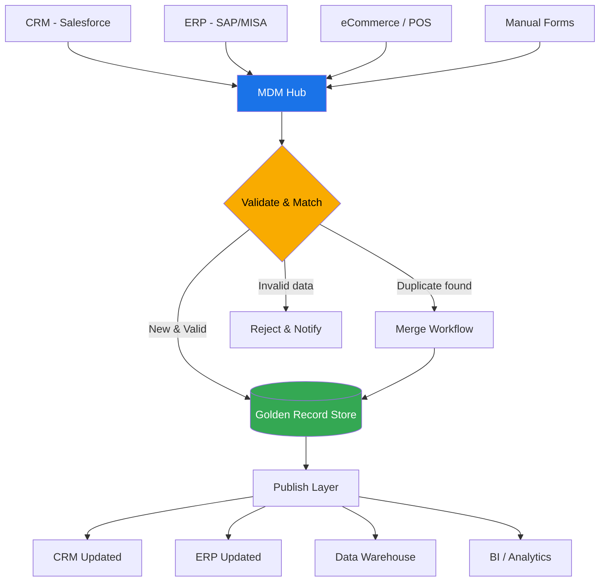

# DA03 — Master Data Management (MDM)

> **Triết lý cốt lõi:** "Nếu bạn không quản lý Master Data, Master Data sẽ quản lý bạn — và nó sẽ quản lý bạn rất tệ."

---

## 1. Learning Objectives

Sau khi hoàn thành module này, người học có thể:

- Định nghĩa và phân biệt các loại Master Data: Customer, Product, Vendor, Employee, Account
- Giải thích 6 chiều chất lượng dữ liệu (Data Quality Dimensions) và cách đo lường
- Thiết kế Data Governance framework cho một doanh nghiệp VN
- Nhận diện và xử lý các vấn đề "dirty data" phổ biến tại VN (trùng khách hàng, sai địa chỉ, nhiều hệ thống không sync)
- Triển khai MDM trong bối cảnh ERP (SAP MDM, Informatica MDM, Talend MDM)
- Tư vấn lộ trình cải thiện data quality cho doanh nghiệp VN
- Xây dựng vai trò Data Steward và Data Owner trong tổ chức

**Cấp độ:** Intermediate → Advanced  
**Thời gian học:** 20–30 giờ  
**Prerequisites:** Hiểu cơ bản về ERP, database, khái niệm business domain

---

## 2. Business Context

### Vì sao MDM là vấn đề đau đầu nhất của DN VN?

**Bức tranh thực tế — Công ty phân phối 300 người tại VN:**

```
Hệ thống CRM: 50,000 khách hàng
Hệ thống ERP: 45,000 khách hàng
Hệ thống Kế toán: 38,000 khách hàng

→ Có bao nhiêu khách hàng THỰC SỰ? Nobody knows.
→ "Nguyễn Văn A" xuất hiện 7 lần với các variation:
   - Nguyen Van A
   - Nguyen Van A.
   - NVA
   - Nguyễn Văn a
   - Công ty TNHH Nguyễn Văn A
   - CT Nguyen Van A
   - nguyen van a (lowercase)
```

**Hậu quả "dirty master data":**
- Marketing gửi email trùng cho cùng 1 khách hàng (professional image kém)
- Sales rep A và rep B cùng tiếp cận 1 khách hàng (conflict, lãng phí effort)
- Báo cáo doanh thu per customer sai → strategy decisions sai
- Finance không reconcile được công nợ
- ERP upgrade fail vì data migration bị lỗi

**Các vấn đề MDM đặc thù VN:**
1. **Tên tiếng Việt có dấu vs không dấu:** "Nguyễn" vs "Nguyen" — hệ thống cũ không hỗ trợ Unicode
2. **Địa chỉ VN không chuẩn:** "Phường 5, Quận 10, HCM" vs "P.5, Q10, TP.HCM"
3. **Mã số thuế:** Nhiều công ty có 2–3 MST do merge/split
4. **Sản phẩm có nhiều tên:** "Sữa tươi 1L Vinamilk" vs "VNM Fresh Milk 1000ml" vs "VMF001"
5. **Nhiều ERP chạy song song:** Sau M&A, 2 hệ thống ERP cùng tồn tại 2–3 năm

---

## 3. Definitions

| Thuật ngữ | Định nghĩa | Ví dụ VN |
|-----------|-----------|----------|
| **Master Data** | Dữ liệu cốt lõi, tham chiếu (reference) được chia sẻ nhiều hệ thống, ít thay đổi | Customer, Product, Vendor, Account |
| **Transactional Data** | Dữ liệu giao dịch, xảy ra nhiều và thường xuyên | Đơn hàng, hóa đơn, thanh toán |
| **MDM (Master Data Management)** | Tập hợp quy trình, công nghệ và chính sách để tạo và duy trì "single version of truth" cho master data | SAP MDM tại Vinamilk |
| **Data Quality** | Mức độ dữ liệu phù hợp với mục đích sử dụng theo nhiều chiều (accuracy, completeness...) | Địa chỉ khách hàng đúng và đầy đủ |
| **Data Governance** | Framework quản lý data: policies, processes, roles, standards | Data Policy của VCB |
| **Data Steward** | Người chịu trách nhiệm chất lượng data của một domain | Sales Data Steward = Sales Ops manager |
| **Data Owner** | Người có quyền ra quyết định cuối cùng về data domain | Finance Data Owner = CFO |
| **Golden Record** | Bản ghi "master" duy nhất, đã được chuẩn hóa và de-duplicate | 1 record KH duy nhất sau khi merge tất cả sources |
| **MDM Hub** | Hệ thống trung tâm lưu trữ và quản lý master data | SAP MDM Server |
| **Entity Resolution** | Quá trình nhận diện các records đề cập đến cùng 1 thực thể thực | Nhận ra "Nguyen Van A" và "Nguyễn Văn A" là 1 người |
| **Data Lineage** | Dấu vết dữ liệu từ nguồn gốc → các biến đổi → đích đến | Track một record khách hàng đến từ đâu, qua bước nào |
| **Reference Data** | Tập dữ liệu phân loại chuẩn (code lists) | Danh mục ngành nghề, mã tỉnh thành, mã loại tiền |

---

## 4. Core Concepts

### 4.1 Các loại Master Data

```
MASTER DATA DOMAINS:

┌─────────────────────────────────────────────────────────────┐
│                  MASTER DATA ECOSYSTEM                       │
├────────────────────────────────────────────────────────────┤
│                                                             │
│  PARTY DATA                    THING DATA                  │
│  ├── Customer Master           ├── Product Master          │
│  │   (who buys)                │   (what we sell)          │
│  ├── Vendor/Supplier Master    ├── Asset Master            │
│  │   (who supplies)            │   (what we own)           │
│  ├── Employee Master           └── Location Master         │
│  │   (who works for us)            (where we operate)      │
│  └── Partner Master                                        │
│                                                            │
│  FINANCIAL DATA                REFERENCE DATA              │
│  ├── Chart of Accounts         ├── Country/Province codes  │
│  ├── Cost Center               ├── Currency codes          │
│  └── Profit Center             ├── Unit of Measure codes   │
│                                └── Industry codes (VSIC)   │
└────────────────────────────────────────────────────────────┘
```

### 4.2 Customer Master Data — Cấu trúc chi tiết

```
CUSTOMER MASTER RECORD — Ví dụ VN:

Identification:
├── customer_id: CUS-2024-00123 (internal, unique)
├── customer_code: KH0123 (ERP code)
├── tax_id: 0123456789 (MST - Mã số thuế VN)
└── national_id: (nếu cá nhân)

Basic Information:
├── full_name: "Công ty TNHH ABC Việt Nam"
├── short_name: "ABC VN"
├── english_name: "ABC Vietnam Co., Ltd"
├── customer_type: B2B | B2C | B2G
└── status: Active | Inactive | Blocked

Classification:
├── segment: Enterprise | SME | Consumer
├── industry: VSIC code (Hệ thống ngành kinh tế VN)
├── tier: Gold | Silver | Bronze
└── territory: Miền Bắc | Miền Trung | Miền Nam

Contact:
├── address_line1: "123 Nguyễn Văn Linh"
├── ward: "Phường Tân Phú"
├── district: "Quận 7"
├── province: "TP. Hồ Chí Minh"
├── postal_code: "700000"
├── phone: "+84 28 1234 5678"
└── email: "contact@abc.com.vn"

Financial:
├── payment_terms: NET30
├── credit_limit: 500,000,000 VND
├── currency: VND
└── bank_account: [list of bank accounts]

Relationship:
├── sales_rep: NV001
├── account_manager: AM005
└── parent_customer_id: (nếu là subsidiary)

Metadata:
├── created_date: 2020-01-15
├── created_by: user@company.com
├── last_updated: 2024-06-30
├── data_source: CRM
└── quality_score: 87/100
```

### 4.3 Product Master Data

```
PRODUCT MASTER — Ví dụ Masan Consumer:

Identification:
├── product_id: PRD-2024-001234
├── SKU: MAS-NT-001-1KG (internal)
├── barcode_EAN13: 8934564100123
├── manufacturer_code: (nhà SX)
└── supplier_code: (nhà CC)

Description:
├── product_name_vi: "Nước mắm Nam Ngư 1 lít"
├── product_name_en: "Nam Ngu Fish Sauce 1L"
├── short_description: "Nước mắm 40 độ đạm"
└── long_description: [full spec]

Classification:
├── category_l1: "Gia vị - Nước chấm"
├── category_l2: "Nước mắm"
├── brand: "Nam Ngư"
├── sub_brand: "Nam Ngư Cá Hồi"
└── product_line: "Premium"

Physical:
├── weight_net: 1000 (grams)
├── weight_gross: 1200 (grams, with packaging)
├── dimensions: 5cm × 5cm × 25cm
└── unit_of_measure: Chai (Bottle)

Packaging:
├── base_unit: 1 chai
├── inner_pack: 12 chai/thùng
├── case: 12 chai
└── pallet: 240 chai

Financial:
├── standard_cost: 15,000 VND
├── list_price: 32,000 VND
├── tax_category: Hàng tiêu dùng thông thường (VAT 10%)
└── margin: 53%

Compliance:
├── shelf_life: 24 months
├── storage_condition: "Nơi khô ráo, thoáng mát"
└── certification: HACCP, ISO 22000
```

### 4.4 Vendor/Supplier Master Data

```
VENDOR MASTER — Key Fields:
├── Vendor ID (unique, auto-generated)
├── Company name (legal name đúng theo ĐKKD)
├── Tax ID (MST - bắt buộc tại VN)
├── Address (đúng theo ĐKKD)
├── Business registration number
├── Payment terms (NET30, NET60...)
├── Bank accounts (Tên NH, số TK, chi nhánh)
├── Contact persons (purchasing contact, finance contact)
├── Vendor classification (local, foreign, strategic, approved)
├── Vendor performance scores (quality, delivery, price)
└── Compliance status (có audit, có certificate không)
```

### 4.5 Data Quality Dimensions — 6 chiều cơ bản

```
DATA QUALITY FRAMEWORK (ISO 25012 + DAMA):

1. ACCURACY (Chính xác)
   → Dữ liệu phản ánh đúng thực tế không?
   → Ví dụ: Tên KH "Nguyen Van A" đúng là "Nguyễn Văn An"
   → Đo: % records khớp với nguồn xác thực (ĐKKD, hộ khẩu...)

2. COMPLETENESS (Đầy đủ)
   → Các trường bắt buộc có được điền đầy đủ không?
   → Ví dụ: 30% Customer records thiếu email
   → Đo: % records có đầy đủ mandatory fields / total records

3. CONSISTENCY (Nhất quán)
   → Cùng 1 dữ liệu, giữa các hệ thống có giống nhau không?
   → Ví dụ: ERP lưu "TP. HCM", CRM lưu "Hồ Chí Minh", DB lưu "HCMC"
   → Đo: % records nhất quán giữa 2+ systems

4. TIMELINESS (Kịp thời)
   → Dữ liệu có được cập nhật đúng lúc không?
   → Ví dụ: KH đổi địa chỉ 3 tháng trước nhưng hệ thống chưa update
   → Đo: Avg lag time giữa thực tế thay đổi vs system update

5. UNIQUENESS (Duy nhất)
   → Mỗi thực thể có đúng 1 record không? Không trùng?
   → Ví dụ: "Nguyen Van A" xuất hiện 7 lần trong CRM
   → Đo: % duplicate records / total records

6. VALIDITY (Hợp lệ)
   → Dữ liệu có đúng format/rule không?
   → Ví dụ: MST phải là 10 hoặc 13 số; số điện thoại VN phải bắt đầu 0 hoặc +84
   → Đo: % records fail validation rules / total records

THÊM 3 CHIỀU NÂNG CAO:

7. INTEGRITY (Toàn vẹn)
   → Foreign key references có hợp lệ không?
   → Ví dụ: Đơn hàng có customer_id không tồn tại trong Customer Master

8. RELEVANCE (Liên quan)
   → Dữ liệu có phù hợp với mục đích sử dụng không?
   → Ví dụ: Địa chỉ cá nhân nhưng cần địa chỉ doanh nghiệp

9. ACCESSIBILITY (Khả năng truy cập)
   → Người cần dữ liệu có thể lấy được không?
   → Ví dụ: Customer data locked trong 1 hệ thống, team khác không truy cập được
```

### 4.6 Data Governance Framework

```
DATA GOVERNANCE FRAMEWORK — 5 Pillars:

┌──────────────────────────────────────────────────────────┐
│                DATA GOVERNANCE                            │
│                                                          │
│  1. PEOPLE & ORGANIZATION                                │
│  ├── Data Governance Council (CEO, CFO, CDO)            │
│  ├── Data Owners (C-level per domain)                   │
│  ├── Data Stewards (manager level)                      │
│  └── Data Champions (operational level)                 │
│                                                          │
│  2. POLICY & STANDARDS                                   │
│  ├── Data Policy (master document)                      │
│  ├── Data Standards (naming, format, coding)            │
│  ├── Data Classification (public/internal/confidential) │
│  └── Retention & Archival Policy                        │
│                                                          │
│  3. PROCESS                                              │
│  ├── Data Creation Process (how to create master data)  │
│  ├── Data Change Process (how to update/deactivate)     │
│  ├── Data Quality Review Process                        │
│  └── Issue Resolution Process                           │
│                                                          │
│  4. TECHNOLOGY                                           │
│  ├── MDM Platform (SAP MDM, Informatica, Talend)        │
│  ├── Data Catalog (DataHub, Atlan, Collibra)            │
│  ├── Data Quality Tool (Great Expectations, Soda)       │
│  └── Master Data Repository (DWH, MDM Hub)             │
│                                                          │
│  5. METRICS & MONITORING                                 │
│  ├── Data Quality Scorecards                            │
│  ├── MDM KPIs                                           │
│  └── Governance Maturity Assessment                     │
└──────────────────────────────────────────────────────────┘
```

### 4.7 MDM Architecture Styles

```
3 ARCHITECTURE STYLES:

1. REGISTRY STYLE (Hub nhẹ):
   ERP ──┐
   CRM ──┼──▶ MDM Hub (chỉ lưu cross-references)
   DWH ──┘    ↑ Không copy data, chỉ map IDs
   
   Pros: Ít xâm lấn, nhanh triển khai
   Cons: Source vẫn có inconsistency
   VN Use: Khi không thể thay đổi source systems

2. CONSOLIDATION STYLE (Hub tổng hợp):
   ERP ──┐    ┌── ETL out → DWH/BI
   CRM ──┼──▶ MDM Hub (copy + consolidate + deduplicate)
   DWH ──┘    (Golden Record stored in Hub)
   
   Pros: Clean data ở Hub
   Cons: Source systems vẫn dirty
   VN Use: BI/Analytics use case, không muốn thay đổi operational systems

3. REGISTRY + PUBLISH STYLE (Hub phát tán):
   ERP ──┐    ┌──▶ ERP (published back)
   CRM ──┼──▶ MDM Hub ──▶ CRM (published back)
   POS ──┘    └──▶ DWH (published)
   
   Pros: All systems get clean data
   Cons: Complex, cần change management lớn
   VN Use: Enterprise với budget và commitment lớn (Vinamilk, VCB)
```

### 4.8 Dirty Data Problems — VN Specific

```
TOP 10 "DIRTY DATA" PROBLEMS TẠI DOANH NGHIỆP VN:

1. TRÙNG KHÁCH HÀNG (Duplicate Customer)
   Cause: Nhiều kênh tạo KH độc lập (web, store, telesales)
   Impact: Double-counting revenue, conflict marketing
   Fix: Fuzzy matching, entity resolution

2. SAI ĐỊA CHỈ (Wrong Address)
   Cause: Nhập tay, không validate, địa chỉ VN không chuẩn
   Impact: Giao hàng sai, phân tích địa lý sai
   Fix: Address validation API (ViettelPost, GHTK)

3. ENCODING TIẾNG VIỆT (Vietnamese Encoding)
   Cause: Hệ thống cũ dùng VPS, TCVN, không phải UTF-8
   Impact: "Nguyễn" thành "Nguyên" hoặc "Nguy?n"
   Fix: iconv conversion, standardize to UTF-8

4. NHIỀU HỆ THỐNG KHÔNG SYNC
   Cause: CRM, ERP, kế toán mua từ vendor khác nhau, không integrate
   Impact: Khách hàng update địa chỉ ở 1 chỗ, chỗ khác vẫn cũ
   Fix: MDM Hub làm single source of truth + publish back

5. MÃ SỐ THUẾ KHÔNG ĐÚNG
   Cause: Nhập tay sai, MST thay đổi sau merger
   Impact: Hóa đơn điện tử invalid, xuất VAT sai
   Fix: Validate với API tra cứu MST của Tổng cục Thuế

6. SẢN PHẨM CÓ NHIỀU TÊN / MÃ
   Cause: Sales đặt tên riêng, kho đặt mã riêng, kế toán đặt mã riêng
   Impact: Inventory wrong, Revenue by product sai
   Fix: Product master chuẩn hóa, map tất cả codes về 1 ID

7. DỮ LIỆU THIẾU KHÔNG CÓ GIÁ TRỊ DEFAULT
   Cause: Form không bắt buộc nhập
   Impact: Phân tích segment bị lỗi vì NULL
   Fix: Form validation + data quality rules

8. KHÔNG CÓ HIERARCHY CHO KHÁCH HÀNG
   Cause: KH conglomerate (Vingroup, Masan) có nhiều entities
   Impact: Revenue theo group bị tính sai
   Fix: Customer hierarchy (parent-child relationship)

9. SẢN PHẨM NGỪNG BÁN VẪN ACTIVE
   Cause: Không có deactivation process
   Impact: Orders vẫn đặt được hàng ngừng bán
   Fix: Product lifecycle management

10. THAY ĐỔI KHÔNG CÓ AUDIT TRAIL
    Cause: Ai cũng update được master data, không log
    Impact: Không biết ai sửa, sửa gì, khi nào
    Fix: Audit log bắt buộc, change approval workflow
```

---

## 5. Business Value

**Giá trị MDM mang lại:**

**Quantitative:**
- Giảm duplicate mailing: nếu CRM có 20% duplicate → giảm 20% marketing cost
- Tăng accuracy của báo cáo: doanh thu per customer đúng hơn → strategy decisions tốt hơn
- Giảm thời gian data reconciliation: từ 3 ngày/tháng → 0.5 ngày/tháng
- Giảm errors trong hóa đơn điện tử: MST đúng → không bị reject

**Case study VN:**
- **VCB (Vietcombank):** MDM Customer → giảm 15% duplicate trong CRM 2 triệu records
- **Vinamilk:** MDM Product → tất cả 3.000+ SKU có mã nhất quán → inventory accuracy tăng 8%
- **Masan:** Sau acquire WinMart, MDM phải merge 2 product databases → 6 tháng MDM project

---

## 6. Enterprise Role

```
MDM TRONG CẤU TRÚC TỔ CHỨC:

┌──────────────────────────────────────────────────────────┐
│           DATA GOVERNANCE COUNCIL                         │
│  CEO / CDO / CFO / CISO — Policy decisions               │
└─────────────────────────┬────────────────────────────────┘
                          │ Direction & Policies
         ┌────────────────┴─────────────────┐
         │                                  │
┌────────▼──────────┐              ┌────────▼──────────────┐
│   DATA OWNERS      │              │   MDM CENTER OF        │
│   (Domain-level)   │              │   EXCELLENCE (CoE)     │
│   CFO = Finance    │              │   MDM Architects       │
│   CMO = Customer   │              │   Data Stewards        │
│   CPO = Product    │              │   Data Quality Analysts│
└────────┬──────────┘              └────────────────────────┘
         │ Own data quality
┌────────▼──────────────────────────────────────────────┐
│               DATA STEWARDS                            │
│  Finance DS | Sales DS | Product DS | HR DS           │
│  (Day-to-day data quality management)                 │
└────────────────────────────────────────────────────────┘
```

**MDM vị trí trong Data Architecture:**
- MDM là "source of truth" cho operational systems
- DWH lấy master data từ MDM (không từ từng source system)
- CRM, ERP đều tham chiếu MDM để lấy clean customer/product data

---

## 7. Departments Related

| Phòng ban | Liên quan đến MDM | Master Data Domain |
|-----------|-----------------|-------------------|
| **IT / Data Engineering** | Build và maintain MDM platform | Infrastructure owner |
| **Sales / CRM** | Customer Master, Contact data | Customer Data Owner |
| **Marketing** | Customer segmentation, product catalog | Customer, Product |
| **Finance / Kế toán** | Chart of Accounts, Vendor (AP), Customer (AR) | Finance, Vendor, Customer |
| **Procurement** | Vendor Master, Material Master | Vendor, Product |
| **Warehouse / Operations** | Product Master, Location Master | Product, Location |
| **HR** | Employee Master | HR data |
| **Legal / Compliance** | Đảm bảo data compliance, DQ policies | Cross-domain |
| **Internal Audit** | Audit data accuracy, change logs | Cross-domain |

---

## 8. Input

**Nguồn dữ liệu đầu vào cho MDM:**

| Nguồn | Master Data | Ghi chú |
|-------|-----------|--------|
| **ERP (SAP/MISA)** | Customer, Vendor, Product, CoA | Primary source |
| **CRM (Salesforce/AMIS)** | Customer, Contact | Sales-side data |
| **HR System** | Employee | HR data |
| **POS / eCommerce** | Customer (mới), Product | B2C touchpoint |
| **External validation** | Tax ID, Company Registration | Validate vs source of authority |
| **ĐKKD (Business Registration)** | Company name, address (legal) | Cục ĐKQG Doanh nghiệp |
| **Tổng cục Thuế API** | MST validation | Bắt buộc cho B2B VN |
| **Vietnam Post / GHTK API** | Address standardization | Cho địa chỉ giao hàng |
| **Manual data entry forms** | New master data | Web form với validation |

---

## 9. Output

**Sản phẩm đầu ra của MDM:**

| Output | Mô tả | Người dùng |
|--------|-------|-----------|
| **Golden Record** | Bản ghi master đã clean, deduplicated | Tất cả hệ thống |
| **Published Master Data** | MDM publish clean data về CRM/ERP | CRM, ERP, DWH |
| **Data Quality Report** | Báo cáo chất lượng data theo domain | Data Steward, Management |
| **Master Data Catalog** | Danh mục toàn bộ master data | Data team, IT, Audit |
| **Data Dictionary** | Định nghĩa mỗi field | Mọi user |
| **Deduplication Report** | Danh sách records trùng cần merge | Data Steward |
| **MDM Scorecard** | KPI chất lượng master data | C-level, Data Governance Council |

---

## 10. Business Process

**Quy trình MDM end-to-end:**

```
MDM LIFECYCLE:

1. CREATION (Tạo mới Master Data):
   Request → Validation → Enrichment → Approval → Publish
   
   Ví dụ tạo Vendor mới:
   Procurement yêu cầu → Finance verify MST → 
   Procurement verify bank account → Manager approve →
   Vendor tạo trong SAP với ID duy nhất → 
   Publish tới Kế toán và Kho

2. MAINTENANCE (Cập nhật):
   Change Request → Data Steward Review → Approval → Update → Audit Log
   
   Ví dụ KH đổi địa chỉ:
   KH thông báo → Sales gửi change request → 
   Data Steward verify (gọi điện xác nhận?) →
   Update trong MDM Hub → Auto-sync đến CRM, ERP, DWH

3. DEACTIVATION (Vô hiệu hóa):
   Request → Check dependencies → Soft-delete → Archive
   
   Ví dụ sản phẩm ngừng bán:
   Product Manager yêu cầu → Check còn tồn kho không →
   Mark as "Discontinued" (không xóa vật lý) →
   ERP không cho đặt hàng mới → Còn trong lịch sử

4. PERIODIC REVIEW (Rà soát định kỳ):
   Hàng quý: Review top 1000 customer có doanh thu lớn
   Hàng năm: Full database cleanse
   Theo sự kiện: Sau M&A, sau ERP upgrade
```

---

## 11. Data Flow

```
MDM DATA FLOW:

SOURCE SYSTEMS              MDM HUB                CONSUMERS
═══════════════          ══════════════           ═══════════

CRM (Salesforce) ──────▶│ INGESTION  │
ERP (SAP/MISA) ─────────▶│  LAYER     │
POS System ─────────────▶│            │
Web Form ───────────────▶│            │
                         │      ▼     │
                         │ VALIDATION │──── Reject invalid records
                         │ & MATCHING │     back to source with
                         │            │     error notification
                         │      ▼     │
                         │ SURVIVORSHIP│─── Rule: "Latest update wins"
                         │ (Merge     │    hoặc "Most complete wins"
                         │  Rules)    │    hoặc "Trusted source wins"
                         │      ▼     │
                         │  GOLDEN    │
                         │  RECORD    │──────────────────────────────▶ DWH
                         │  STORE     │──────────────────────────────▶ BI Tools
                         │            │──────────────────────────────▶ ERP (clean)
                         │      ▼     │──────────────────────────────▶ CRM (clean)
                         │  PUBLISH   │──────────────────────────────▶ External APIs
                         ══════════════

METADATA & LINEAGE FLOW (parallel):
All operations → Audit Log → Data Catalog → Quality Monitoring
```

---

## 12. Money Flow

**Chi phí MDM:**

```
MDM COST COMPONENTS:

Enterprise MDM Platform:
├── Informatica MDM: $100,000–$500,000/năm license
├── SAP MDM: Bundled with SAP, $50,000–$200,000
├── Talend MDM: $30,000–$100,000/năm
├── Open source (Apache Atlas): Free (nhưng cần expertise)
└── Cloud: Microsoft Purview: $1,000–$5,000/tháng

Implementation:
├── Consultant: $100,000–$300,000 (cho enterprise)
├── Internal team time: 3–6 tháng × 3–5 người
└── Training: $5,000–$20,000

Ongoing Operations:
├── Data Steward team: 2–5 FTE ($30,000–$150,000/năm VN)
├── Platform maintenance: 20% annual license
└── Data quality monitoring tools: $1,000–$5,000/tháng

ROI từ MDM:
├── Marketing efficiency: -20% duplicate mailings
├── Sales productivity: +10% (no duplicate contacts)
├── Reduced data reconciliation: -3 days/month
└── Better analytics: Priceless (strategic decisions quality)

VN Budget-friendly approach:
Giai đoạn 1 (Year 1): Manual MDM process + Excel/Airtable: $0–$5,000
Giai đoạn 2 (Year 2): Talend Open Source + light governance: $20,000–$50,000
Giai đoạn 3 (Year 3+): Commercial MDM platform: $100,000+
```

---

## 13. Document Flow

```
TÀI LIỆU TRONG MDM ECOSYSTEM:

POLICY DOCUMENTS:
├── Master Data Policy (CEO-approved)
├── Data Quality Standards per Domain
├── Data Governance Charter
└── Data Classification Policy

OPERATIONAL DOCUMENTS:
├── Data Dictionary (per domain)
├── Business Rules Catalog (validation rules)
├── Survivorship Rules Document (how to merge)
├── Master Data Request Form (Standard)
└── Data Quality Scorecard Template

PROCESS DOCUMENTS:
├── Customer Master Creation SOP
├── Vendor Onboarding SOP
├── Product Setup SOP
├── Data Change Request Process
└── Deduplication Process Guide

AUDIT DOCUMENTS:
├── Change Audit Log (ai sửa gì khi nào)
├── Data Quality Audit Report (monthly)
├── MDM Governance Review Report (quarterly)
└── Incident Report (khi có data quality incident)
```

---

## 14. Roles

| Vai trò | Cấp độ | Trách nhiệm |
|---------|-------|-------------|
| **Chief Data Officer (CDO)** | C-Level | Chiến lược data governance, sponsor MDM |
| **Data Governance Lead** | Director | Điều hành Data Governance Council, policy |
| **MDM Architect** | Technical Lead | Thiết kế MDM platform, integration, survivorship rules |
| **Data Owner** | VP/Director | Accountable cho chất lượng 1 domain (Customer, Product...) |
| **Data Steward** | Manager | Responsible daily data quality của domain |
| **Data Quality Analyst** | Analyst | Chạy quality checks, report issues, investigate |
| **MDM Developer** | Developer | Build MDM integrations, workflows |
| **Business User** | End user | Nhập data đúng chuẩn, báo cáo issues |

---

## 15. Responsibilities

**Phân chia trách nhiệm rõ ràng:**

- **CDO/CEO:** Approve data governance policy, fund MDM initiative, set data quality targets
- **Data Governance Lead:** Facilitate governance council, resolve cross-domain disputes, drive change management
- **Data Owner (ví dụ CFO cho Finance data):** Define quality standards cho domain, approve major changes
- **Data Steward:** Daily monitoring, investigate data quality issues, fix hoặc escalate, update dictionary
- **MDM Architect:** Technical design, integration architecture, survivorship rules, performance
- **Data Quality Analyst:** Automated quality checks, anomaly detection, monthly reporting, root cause analysis
- **Business Users:** Nhập data đúng, report issues, follow MDM standards

---

## 16. RACI Matrix

| Hoạt động | CDO | Data Governance Lead | Data Owner | Data Steward | MDM Architect | Business User |
|-----------|-----|---------------------|------------|-------------|--------------|---------------|
| Define data governance policy | A | R | C | I | I | I |
| Create MDM standards per domain | C | A | R | C | C | I |
| Build MDM platform | I | A | C | I | R | I |
| Daily data quality monitoring | I | I | A | R | I | I |
| Data quality issue resolution | I | C | A | R | C | C |
| Approve new Master Data | I | I | C | A | I | R |
| Quarterly governance review | A | R | C | C | I | I |
| User training on data standards | I | A | C | R | C | I |

**R**=Responsible, **A**=Accountable, **C**=Consulted, **I**=Informed

---

## 17. Frameworks

### 17.1 DAMA Data Management Framework

```
DAMA WHEEL — 11 Knowledge Areas:

                  [Data Governance]
                        │
         ┌──────────────┼──────────────┐
         │              │              │
    [Data Quality] [Metadata Mgmt] [Data Architecture]
         │              │              │
    [Master Data]  [Data Security] [Data Modeling]
         │              │              │
    [Data Warehousing][Ref Data Mgmt][Doc & Content]
                        │
                  [Data Integration]

→ MDM nằm ở trung tâm: Data Governance + Master Data + Reference Data
```

### 17.2 CMMI Data Management Maturity Model

```
Level 5: Optimizing    → Continuous improvement, predictive quality
Level 4: Managed       → Quantitative control, metrics-driven
Level 3: Defined       → Documented processes, data governance active
Level 2: Managed       → Some policies, ad-hoc MDM
Level 1: Initial       → Chaotic, no data standards ← Hầu hết SME VN

→ Mục tiêu thực tế cho VN doanh nghiệp: Level 3 trong 2–3 năm
```

### 17.3 IBM Information Architecture Framework

- Business Vocabulary → Data Definitions → Data Models → Data Rules → Data Quality
- Áp dụng cho MDM: từ business term → technical field → validation rule → quality metric

---

## 18. International Standards

| Standard | Áp dụng trong MDM | VN Relevance |
|---------|-----------------|-------------|
| **ISO 8000** | Master data quality standards | Reference cho MDM quality framework |
| **ISO/IEC 25012** | Data quality model (15 dimensions) | Quality dimensions framework |
| **DAMA-DMBOK 2** | Data management body of knowledge | Comprehensive MDM framework |
| **GS1 Standards** | Product barcode/GTIN standards | Quan trọng với FMCG, bán lẻ VN |
| **ISO 3166** | Country codes | Reference data standard |
| **ISO 4217** | Currency codes | VND, USD, EUR codes |
| **VSIC** | Vietnam Standard Industrial Classification | Industry codes VN |

---

## 19. Vietnam Context

### MDM trong bối cảnh VN:

**Thách thức đặc thù VN:**

**1. Hệ thống phân tán:**
- Phần lớn DN VN dùng 3–5 phần mềm riêng biệt không kết nối
- Sau M&A: 2 công ty merge → 2 ERP systems song song 2–3 năm
- Giải pháp: Registry-style MDM trước (ít xâm lấn), sau upgrade

**2. Dữ liệu tiếng Việt:**
- Encoding issue: Hệ thống cũ không support Unicode
- Tên người VN: Họ tên đảo ngược so với quốc tế (Ho thi Mai vs Mai Thi Ho)
- Địa chỉ VN: 4 cấp (Số nhà, Đường/Phường, Quận, Tỉnh) — không giống chuẩn quốc tế

**3. Mã số thuế VN:**
- MST 10 số (cho công ty đăng ký từ trước 2015)
- MST 13 số (cho chi nhánh, thêm "-001", "-002"...)
- Validate qua API: Tổng cục Thuế có API tra cứu MST
- Thường gặp: Nhập sai số → hóa đơn điện tử bị reject

**4. Không có CDO/Data Governance:**
- Phần lớn DN VN không có CDO
- Giải pháp: CEO/CFO làm executive sponsor, giao cho IT Manager dẫn dắt
- Bắt đầu nhỏ: Customer Master clean-up project đầu tiên

**Các công ty MDM tiêu biểu VN:**

| Công ty | MDM Approach | Scale |
|---------|-------------|-------|
| **VCB** | Oracle Customer Data Hub | 20 triệu khách hàng |
| **BIDV** | SAS Customer Intelligence MDM | Ngân hàng quốc doanh |
| **Vinamilk** | SAP MDM + Material Master | 3,000+ SKU |
| **Masan** | Custom MDM sau WinMart acquisition | 15,000+ vendor/products |
| **FPT** | Informatica MDM (for client projects) | Service provider |
| **Thế Giới Di Động** | Custom MDM cho product + store | 2,000+ stores |

---

## 20. Legal Considerations

**Quy định pháp lý và MDM:**

| Quy định | Ảnh hưởng đến Master Data |
|---------|--------------------------|
| **Nghị định 13/2023/NĐ-CP** | Customer Master phải có chính sách lưu trữ, xóa, consent cho PII |
| **Luật Kế toán 2015** | Chart of Accounts phải theo VAS — không thay đổi tùy tiện |
| **Thông tư 200/2014/TT-BTC** | Quy định hệ thống tài khoản kế toán VN — Master Account Data phải conform |
| **Nghị định 123/2020/NĐ-CP** | Hóa đơn điện tử: MST, tên công ty trong Vendor/Customer Master phải đúng |
| **Luật Doanh nghiệp 2020** | Thông tin pháp nhân trong Company Master phải đúng với ĐKKD |
| **Thông tư 09/2020/TT-NHNN** | Bank/TCTD phải có Customer MDM với audit trail |
| **GDPR (nếu có EU customer)** | Right to erasure: phải xóa được customer record khỏi MDM khi có yêu cầu |

**Thực hành pháp lý quan trọng:**
- Lưu audit log cho mọi thay đổi Master Data (ai, khi nào, thay đổi gì)
- Customer Data: phải có consent form trước khi lưu thông tin cá nhân
- Retention: tuân thủ quy định lưu trữ 5–10 năm theo Luật Kế toán
- Right to erasure: thiết kế MDM có khả năng soft-delete + anonymize

---

## 21. Common Mistakes

**10 lỗi phổ biến trong MDM VN:**

1. **"Clean data một lần là xong"**
   - Sai: Data quality là ongoing process, không phải one-time project
   - Fix: Thiết lập Data Steward team duy trì liên tục

2. **"IT làm MDM, không cần business"**
   - Sai: Business rules chỉ business biết, IT không tự quyết được
   - Fix: Data Owner = business leader, Data Steward = business + IT hybrid

3. **"Xóa duplicate là đơn giản"**
   - Sai: Merge records phức tạp — cần survivorship rules, kiểm tra dependencies
   - Fix: Quy trình merge có approval, rollback được

4. **"Tất cả fields đều bắt buộc"**
   - Sai: Quá nhiều mandatory fields → user bỏ qua hoặc nhập sai
   - Fix: Chỉ truly mandatory là bắt buộc (MST, tên, điện thoại/email)

5. **"MDM = mua phần mềm"**
   - Sai: Platform là 30%, process + people + data rules = 70%
   - Fix: Define governance, standards, process TRƯỚC khi chọn tool

6. **"Không cần hierarchy cho Customer"**
   - Sai: Vingroup có 50+ entities — không có hierarchy thì revenue per group sai
   - Fix: Parent-child customer hierarchy từ đầu

7. **"Không validate address"**
   - Sai: 30–40% địa chỉ VN nhập tay bị sai
   - Fix: Integrate với ViettelPost/GHTK address validation API

8. **"Real-time MDM sync ngay từ đầu"**
   - Sai: Quá phức tạp và đắt cho SME
   - Fix: Bắt đầu với batch sync hàng đêm, real-time khi thực sự cần

9. **"MDM chỉ cho Customer"**
   - Sai: Product Master và Vendor Master cũng gây vấn đề ngang ngửa
   - Fix: Phase triển khai MDM theo domain, Customer thường là priority đầu

10. **"Không có fallback nếu MDM down"**
    - Sai: Nếu MDM là bottleneck, toàn bộ hệ thống bị ảnh hưởng
    - Fix: Cache local, graceful degradation, HA architecture

---

## 22. Best Practices

**Best practices MDM từ enterprise VN:**

1. **Start with Customer Master** — Customer data thường là painful nhất và ROI rõ ràng nhất

2. **Golden Rule of Survivorship** — Định nghĩa rõ rule: "Khi CRM và ERP conflict, source nào thắng?" (thường: ERP cho financial data, CRM cho contact data)

3. **Validate at Entry Point** — Stop bad data tại nguồn (form validation) thay vì clean sau

4. **Tax ID as Golden Key** — Với B2B VN: MST là unique identifier tốt nhất, dùng làm golden key để deduplicate

5. **Address Normalization** — Dùng API chuẩn hóa địa chỉ VN (GHTK, ViettelPost API) ngay khi nhập

6. **Data Quality as Product Feature** — Treat data quality reports như một "product" với SLA, owner, và roadmap

7. **Incentivize Data Quality** — KPI của Sales phải bao gồm data completeness (không chỉ revenue)

8. **Regular Cleanse Sprints** — Quarterly "data hygiene" sprint: team data làm sạch top 1,000 customer có giá trị cao nhất

9. **Master Data Onboarding Training** — Nhân viên mới phải được training về data standards trước khi access hệ thống

10. **Celebrate Data Quality** — Gamification: công nhận team/phòng có data quality score cao nhất

---

## 23. KPIs

**KPIs đo lường MDM:**

| KPI | Định nghĩa | Target |
|-----|-----------|--------|
| **Data Completeness Rate** | % records có đủ mandatory fields | >95% |
| **Duplicate Rate** | % records bị trùng / total records | <2% |
| **Accuracy Rate** | % records có thông tin chính xác (validated) | >98% |
| **Timeliness** | Avg lag từ real-world change đến system update | <3 ngày |
| **MDM Coverage** | % hệ thống dùng MDM làm source of truth | >80% |
| **Data Steward Response Time** | Avg time từ issue reported → resolved | <48 giờ |
| **Valid Tax ID Rate** | % B2B customer có MST valid | >99% |
| **Address Validation Rate** | % địa chỉ đã validate qua API | >80% |

---

## 24. Metrics

**Metrics chi tiết theo domain:**

```
CUSTOMER MASTER METRICS:
├── Total active customers: [count]
├── New customers this month: [count]
├── Duplicate rate: [%]
├── Email completeness: [%]
├── Phone completeness: [%]
├── Tax ID completeness (B2B): [%]
├── Address validation pass rate: [%]
└── Avg data quality score: [0-100]

PRODUCT MASTER METRICS:
├── Total active SKUs: [count]
├── New products this month: [count]
├── Products with EAN13 barcode: [%]
├── Products with complete cost/price: [%]
├── Products with shelf life defined: [%]
└── Discontinued products cleaned: [%]

VENDOR MASTER METRICS:
├── Total active vendors: [count]
├── Vendors with validated bank account: [%]
├── Vendors with valid MST: [%]
├── Vendors with performance rating: [%]
└── Approved vendors / total vendors: [%]
```

---

## 25. Reports

**Báo cáo MDM:**

| Báo cáo | Tần suất | Nội dung |
|---------|---------|---------|
| **Data Quality Scorecard** | Hàng tuần | Score theo từng domain, trend, issues |
| **Duplicate Detection Report** | Hàng tháng | New duplicates found, merged, pending |
| **Data Completeness Report** | Hàng tháng | Missing mandatory fields by domain |
| **Change Audit Report** | Hàng tháng | Ai thay đổi gì trong Master Data |
| **MDM Governance Report** | Hàng quý | Governance KPIs, issues, improvements |
| **New Master Data Report** | Hàng tuần | Customer/Product/Vendor mới tạo trong kỳ |
| **Invalid Data Report** | Hàng ngày | Records failed validation rules |

---

## 26. Templates

**Templates MDM:**

**1. Master Data Request Form (Vendor mới):**
```
YÊU CẦU TẠO NHÀ CUNG CẤP MỚI

Người yêu cầu: [Tên] | Phòng ban: [PB] | Ngày: [DD/MM/YYYY]

THÔNG TIN PHÁP LÝ:
Tên công ty (theo ĐKKD): _____________________
Tên rút gọn: _____________________
Mã số thuế: _____________________
Địa chỉ (theo ĐKKD): _____________________
Số ĐKKD: _____________________

THÔNG TIN LIÊN HỆ:
Người liên hệ chính: _____________________
Chức vụ: _____________________
Email: _____________________
Điện thoại: _____________________

THÔNG TIN THANH TOÁN:
Ngân hàng: _____________________
Số tài khoản: _____________________
Chi nhánh: _____________________
Tên chủ tài khoản: _____________________

PHÂN LOẠI:
Loại NCC: [ ] Nguyên vật liệu [ ] Dịch vụ [ ] Hàng hóa khác
Địa bàn: [ ] Trong nước [ ] Nước ngoài

TÀI LIỆU ĐÍNH KÈM:
[ ] Giấy phép ĐKKD [ ] Chứng chỉ ISO [ ] Thông tin ngân hàng

PH승DUYỆT:
Người yêu cầu: _____ | Trưởng phòng: _____ | Finance: _____
```

**2. Data Quality Issue Report Template:**
```
DATA QUALITY INCIDENT REPORT

ID: DQ-2024-XXX
Ngày phát hiện: ___
Phát hiện bởi: ___
Domain: [ ] Customer [ ] Product [ ] Vendor [ ] Other

VẤN ĐỀ:
Loại lỗi: [ ] Duplicate [ ] Incorrect [ ] Incomplete [ ] Invalid
Mô tả: _____________________
Số records bị ảnh hưởng: ___
Impact (business): _____________________

NGUYÊN NHÂN:
[ ] Lỗi nhập liệu [ ] System bug [ ] Process gap [ ] External data
Chi tiết: _____________________

HÀNH ĐỘNG:
Người xử lý (Data Steward): ___
Ngày deadline: ___
Fix plan: _____________________
Status: [ ] Open [ ] In Progress [ ] Resolved

ROOT CAUSE & PREVENTION:
_____________________
```

---

## 27. Checklists

### Checklist MDM Implementation:

**Phase 1 — Assessment:**
- [ ] Inventory tất cả data domains và hệ thống hiện tại
- [ ] Phỏng vấn stakeholders về pain points
- [ ] Assess data quality hiện tại (sample 1,000 records mỗi domain)
- [ ] Identify top duplicate problems
- [ ] Define MDM scope (Customer? Product? Vendor? All?)
- [ ] Secure executive sponsor và budget

**Phase 2 — Design:**
- [ ] Thiết lập Data Governance structure (Council, Owners, Stewards)
- [ ] Viết Data Governance Charter
- [ ] Define data standards cho mỗi domain
- [ ] Design survivorship rules
- [ ] Create Business Glossary
- [ ] Define data quality rules (validation logic)

**Phase 3 — Build:**
- [ ] Select MDM tool (hoặc manual process)
- [ ] Build MDM hub hoặc processes
- [ ] Integrate với source systems
- [ ] Build data quality monitoring
- [ ] Build audit trail

**Phase 4 — Launch:**
- [ ] Initial data cleanse (deduplicate, fix errors)
- [ ] Train Data Stewards
- [ ] Train all data entry users
- [ ] Go-live với monitoring
- [ ] Establish ongoing governance rhythm

---

## 28. SOP

### SOP-MDM-001: Customer Master Creation

**Tên:** Tạo mới Khách hàng trong hệ thống  
**Người thực hiện:** Sales / Customer Service  
**Thời gian:** 10–15 phút

```
BƯỚC 1: Tra cứu trước khi tạo (QUAN TRỌNG)
→ Search trong CRM/ERP theo: Tên công ty, MST, Số điện thoại
→ Nếu tìm thấy → KHÔNG tạo mới, dùng record có sẵn
→ Nếu không tìm thấy → tiến hành tạo mới

BƯỚC 2: Thu thập đủ thông tin bắt buộc
→ B2B: Tên pháp nhân, MST, Địa chỉ ĐKKD, SĐT, Email
→ B2C: Họ tên, SĐT (bắt buộc), Email (khuyến khích), Địa chỉ giao hàng

BƯỚC 3: Validate thông tin
→ MST: Kiểm tra trên tracuumst.com hoặc API
→ Địa chỉ: Chọn từ dropdown chuẩn (Tỉnh/Huyện/Xã), không nhập tay
→ SĐT: Phải bắt đầu bằng 0, 10–11 số
→ Email: Format hợp lệ

BƯỚC 4: Phân loại khách hàng
→ Customer Type: B2B / B2C / B2G
→ Segment: Enterprise / SME / Consumer
→ Territory: Assign cho Sales rep/region

BƯỚC 5: Submit và chờ Data Steward review
→ Với B2B trên 500 triệu tiềm năng → cần Data Steward approve
→ Với B2C thông thường → auto-approve sau validate

BƯỚC 6: Nhận Customer ID và sử dụng
→ System generate unique Customer ID
→ ID này dùng cho tất cả giao dịch tiếp theo
```

### SOP-MDM-002: Xử lý Duplicate Customer

```
BƯỚC 1: Phát hiện duplicate (qua báo cáo tự động hoặc user report)

BƯỚC 2: Investigation
→ Xem cả 2 records có history gì (đơn hàng, invoice, contact...)
→ Identify "master" record (thường là record có nhiều transaction nhất)

BƯỚC 3: Data Steward decision
→ Nếu clearly same entity → merge plan
→ Nếu không chắc → liên hệ Sales rep confirm

BƯỚC 4: Merge execution
→ Chuyển tất cả transactions về "master" record
→ Copy missing information từ "duplicate" sang "master"
→ Mark "duplicate" record as MERGED, không xóa
→ Log merge action với reason

BƯỚC 5: Notify affected users
→ Sales rep có liên quan được thông báo
→ Finance team cập nhật nếu có invoice

BƯỚC 6: Document và close
→ Cập nhật DQ Issue log
→ Identify root cause để prevent
```

---

## 29. Case Study

### Case Study 1: Masan Group — MDM sau thâu tóm WinMart (2021–2022)

**Bối cảnh:**
Masan acquire chuỗi siêu thị WinMart từ Vingroup (2021). WinMart có hệ thống riêng: SAP ERP riêng, 3,000+ vendor records, 15,000+ product SKU. Masan cũng có SAP riêng với 10,000+ vendor, 5,000+ SKU overlap.

**Thách thức MDM:**
- 2 SAP systems với vendor codes khác nhau cho cùng nhà cung cấp
- Product master: "Mì Gói Hảo Hảo 75g" có 5 codes khác nhau trong 2 hệ thống
- Payment terms, vendor bank accounts phải consolidate

**Giải pháp:**
- Phase 1: Build Master Product Catalog độc lập (spreadsheet + tools)
- Phase 2: Entity resolution: fuzzy match vendor names + tax ID validation
- Phase 3: Consolidation rule: Tax ID là golden key cho vendor
- Phase 4: Publish to both SAP systems tạm thời, rồi migrate to single SAP

**Kết quả sau 9 tháng:**
- 85% vendor duplicates resolved
- 95% product SKU có single master code
- Procurement savings: phát hiện mua cùng sản phẩm với 2 giá khác nhau → renegotiate
- Inventory accuracy tăng từ 78% → 91%

---

### Case Study 2: ACB — Customer MDM cho 5 triệu khách hàng

**Bối cảnh:**
ACB (Asia Commercial Bank) — 5 triệu khách hàng, 350+ chi nhánh, hệ thống core banking T24 (Temenos) và nhiều hệ thống peripheral.

**Vấn đề:**
- Khách hàng mở tài khoản nhiều lần ở chi nhánh khác nhau
- Customer profile không nhất quán giữa Personal Banking và Business Banking
- Không thể view "360° customer view" — không biết 1 khách hàng có tổng sản phẩm gì

**Giải pháp:**
- Oracle Customer Data Integration (CDI) Hub
- Master key: CMND/CCCD số (unique identifier VN)
- Survivorship: "Most recent update" + "Core Banking wins for financial data"
- 360° customer view: tổng hợp từ all touchpoints

**Kết quả:**
- Cross-sell rate tăng 25% nhờ complete view of customer
- Marketing campaign cost giảm 18% (không gửi duplicate)
- KYC compliance: biết chính xác mỗi khách hàng có gì với ngân hàng
- Fraud detection tốt hơn (same person, multiple accounts flagged)

---

## 30. Small Business Example

### SME: Công ty Phân phối Dược phẩm — 100 nhân viên

**Vấn đề:**
- 2,000 khách hàng trong Excel, nhiều trùng
- 500 sản phẩm (thuốc) có nhiều tên: tên generic, tên thương mại, mã BYT
- 3 nhân viên kế toán, mỗi người dùng tên KH khác nhau
- Hóa đơn điện tử thường sai tên KH → phải viết lại

**MDM Solution cho SME (low-cost):**

```
GIAI ĐOẠN 1 — Manual MDM (0 chi phí):
1. Customer Master Spreadsheet (Google Sheets):
   - 1 file chính: customer_master.xlsx
   - Cột: Customer ID | Tên pháp nhân | MST | Địa chỉ | SĐT | Email
   - Rules: Ai tạo KH mới phải search trước, điền vào đây
   - Owner: Trưởng phòng kinh doanh
   
2. Product Master Spreadsheet:
   - 1 file: product_master.xlsx
   - Cột: Product ID | Tên generic | Tên thương mại | Mã BYT | Đơn vị | Giá
   - Owner: Phụ trách kho

3. Validation rules:
   - MST phải được check trên tracuumst.com
   - Địa chỉ phải điền đủ Phường/Quận/Tỉnh
   - Không tạo mới nếu đã có

GIAI ĐOẠN 2 — Semi-automated (6 tháng sau):
- Dùng MISA API để validate MST
- Airtable hoặc Notion thay cho Excel (better collaboration)
- Monthly deduplicate check bằng Excel fuzzy match (Power Query)
```

**ROI:**
- Hóa đơn điện tử sai giảm từ 10% → 1% → tiết kiệm thời gian đáng kể
- Marketing không gửi duplicate nữa
- Báo cáo doanh thu per customer chính xác hơn

---

## 31. Enterprise Example

### Enterprise: Vinamilk — SAP MDM cho Material Master

**Scale:** 3,000+ SKU, 15 nhà máy, 300+ nhà phân phối, 63 tỉnh thành

**SAP Material Master — Key Views:**
```
Basic Data 1: Material Number, Description, Base Unit
Sales: Sales UoM, Pricing, Min Order Quantity
MRP: Lead time, Safety stock, Reorder point
Purchasing: Purchasing group, Info record
Accounting: Valuation class, Standard cost
Plant Data: Storage conditions, Shelf life
```

**MDM Challenges tại Vinamilk:**
- Mỗi nhà máy đặt material number riêng
- Bao bì thay đổi (dung tích, logo) → cần version mới hay update record cũ?
- Hàng seasonal (kem mùa hè) phải deactivate mùa đông
- Hàng nhập khẩu có cả mã VN và mã nước ngoài

**Giải pháp:**
- SAP Central MDM team (5 people) kiểm soát tất cả Material creation
- Change request workflow: Factory → MDM Team → APPROVE → SAP
- Naming convention chuẩn: [Brand]-[Product]-[Volume]-[Packaging]
- Regular review: Quarterly material master cleanse

**KPI đạt được:**
- Material creation time: từ 3 ngày → 4 giờ
- Inventory accuracy: 94% (trước MDM: 85%)
- BOM accuracy: 98% (trước: 90%)

---

## 32. ERP Mapping

**MDM trong ERP Context:**

```
SAP MDM INTEGRATION:

SAP Business Partner (BP) = Customer + Vendor unified:
├── BP Role: Customer (FI-CA, SD)
├── BP Role: Vendor/Supplier (MM, FI-AP)
└── Shared: Address, Bank, Contact

SAP Material Master = Product MDM:
├── MRP View → Production Planning
├── Sales View → Order Management
├── Accounting View → Costing
├── Plant View → Warehouse Management
└── Quality View → QC

MISA MDM Mapping (VN ERP):
├── DM_KhachHang → Customer Master
├── DM_NhaCungCap → Vendor Master
├── DM_HangHoa → Product Master
└── DM_NganHang → Bank Reference Data

Informatica MDM (Enterprise):
├── MDM Hub ─── SAP (bidirectional sync)
│           ─── Salesforce (bidirectional)
│           ─── DWH (publish only)
│           └── eCommerce (publish only)
```

---

## 33. Automation Opportunities

| Quy trình | Hiện tại | Tự động hóa | Tool |
|----------|---------|------------|------|
| MST validation | Check tay trên web | API call từ Tổng cục Thuế | REST API tích hợp |
| Address normalization | Nhập tay tự do | Dropdown + API validate | GHN/GHTK API |
| Duplicate detection | Report tháng tay | Nightly fuzzy match job | Python/Spark + ML |
| New vendor approval | Email qua lại | Workflow trong MDM | Workflow engine |
| Data quality alerts | Check tay | Automated daily alerts | dbt tests + Slack |
| Master data publish | IT manual sync | Event-driven publish | Message queue (Kafka) |
| Customer enrichment | Manual research | Auto-enrich từ external sources | Data enrichment API |
| Inactive record cleanup | Ad-hoc | Scheduled quarterly review | Automated flag + report |

---

## 34. AI Opportunities

| AI Use Case | Mô tả | VN Readiness |
|------------|-------|-------------|
| **Entity Resolution ML** | ML model nhận diện duplicate dựa trên fuzzy matching, phonetics VN | Emerging |
| **Address Parsing VN** | NLP parse địa chỉ tự do thành structured format | Available (ViettelPost API có ML) |
| **Data Quality Anomaly** | ML phát hiện bất thường trong master data | Intermediate |
| **Auto-classification** | Tự động classify product/customer segment | Intermediate |
| **Name Standardization VN** | NLP chuẩn hóa tên VN (có dấu, đảo từ) | Emerging |
| **Predictive Quality** | Dự báo record nào sẽ có quality issues | Advanced |
| **GenAI Data Dictionary** | LLM auto-generate business definitions từ field names | Available now |

---

## 35. Implementation Guide

### Lộ trình MDM 12 tháng cho Enterprise VN:

**Tháng 1–2 — Assessment & Planning:**
- Data quality assessment (sample 5,000 records mỗi domain)
- Stakeholder mapping và executive sponsorship
- Define MDM scope và priority (Customer first)
- Select MDM approach (Registry vs Consolidation vs Full)
- Budget approval

**Tháng 3–4 — Governance Setup:**
- Appoint Data Owners và Data Stewards
- Write Data Governance Charter
- Define data standards (Customer, Product, Vendor)
- Create Business Glossary (50–100 terms)
- Data quality KPI targets

**Tháng 5–7 — Customer MDM (Phase 1):**
- Initial deduplication (top 10,000 customers)
- Implement validation rules (MST, phone, email, address)
- Setup data quality monitoring
- Training Data Stewards và users
- Customer Master process: creation, update, deactivation

**Tháng 8–10 — Product & Vendor MDM (Phase 2):**
- Product Master standardization
- Vendor Master cleanup và validation
- MDM platform implementation (nếu có budget)
- Integrate MDM với ERP và CRM

**Tháng 11–12 — Govern & Improve:**
- Data Quality Scorecard baseline
- Ongoing governance rhythm
- Quarterly cleanse process established
- MDM roadmap Year 2

---

## 36. Consulting Guide

**Khi tư vấn MDM cho khách hàng VN:**

**Discovery questions:**
- "Bao nhiêu hệ thống lưu thông tin khách hàng?"
- "Khi khách hàng đổi địa chỉ, cập nhật ở đâu? Tất cả hệ thống?"
- "Có bao nhiêu % khách hàng bị trùng trong CRM?"

**Cách sell MDM cho CEO/CFO VN:**
- Đừng nói "MDM" — nói "clean data để marketing không gửi spam, sales không conflict"
- ROI cụ thể: "10% duplicate trong 100,000 KH = 10,000 bản ghi thừa = X tỷ marketing waste"
- Quick win: "6 tuần clean top 1,000 khách hàng có doanh thu lớn nhất"

**Thứ tự ưu tiên cho VN:**
1. Customer Master (ROI rõ ràng nhất, phòng Sales và Marketing thấy ngay)
2. Product Master (Inventory accuracy, nhà máy cần)
3. Vendor Master (Procurement, Finance cần cho AP)
4. Chart of Accounts (Finance, Kế toán — nhạy cảm nhất, làm sau)

---

## 37. Diagnostic Questions

**Câu hỏi chẩn đoán MDM:**

1. Có bao nhiêu hệ thống lưu thông tin khách hàng/sản phẩm/nhà cung cấp?
2. Khi khách hàng đổi địa chỉ, quy trình cập nhật là gì? Mất bao lâu? Tất cả hệ thống?
3. Hàng tháng có bao nhiêu trường hợp "conflict data" giữa các phòng ban?
4. Có ai chịu trách nhiệm chất lượng dữ liệu khách hàng không? Ai?
5. Cuối tháng, số KH active trong Sales khác số trong Kế toán không?
6. Hóa đơn điện tử có bị reject do sai thông tin KH không? Tần suất?
7. Có thể tìm lịch sử thay đổi một record không? (Ai sửa, khi nào?)
8. Có training nhân viên về cách nhập dữ liệu đúng không?
9. Khi ERP upgrade hoặc migrate, data migration mất bao lâu và có vấn đề gì?
10. Có dashboard theo dõi chất lượng data không?

---

## 38. Interview Questions

**Câu hỏi phỏng vấn Data Steward / MDM Analyst:**

**Kiến thức:**
1. Master Data là gì? Khác transactional data như thế nào?
2. 6 chiều Data Quality là gì? Cho ví dụ cho mỗi chiều.
3. SCD Type 1 vs Type 2 vs Type 3 — khi nào dùng loại nào?
4. Entity resolution là gì? Kỹ thuật nào dùng để tìm duplicate?
5. Data Owner vs Data Steward — khác nhau thế nào?

**Xử lý tình huống:**
6. Bạn phát hiện Customer record có cùng MST nhưng tên khác nhau. Bạn làm gì?
7. Sales team bảo địa chỉ KH sai, CRM team bảo đúng. Bạn quyết định thế nào?
8. Cần clean 1 triệu customer records trong 3 tháng. Bạn ưu tiên thế nào?

**Experience:**
9. Kể về dự án MDM hoặc data quality bạn đã làm. Kết quả?
10. Làm thế nào để thuyết phục business user follow MDM standards khi họ không muốn?

---

## 39. Exercises

**Bài tập thực hành:**

**Bài tập 1 — Data Quality Assessment:**
Download sample dataset 1,000 khách hàng (giả lập). Tính:
- Duplicate rate (fuzzy match tên + SĐT)
- Completeness rate cho mỗi field
- Validity rate (MST format, SĐT format, email format)
- Đề xuất top 3 issues cần fix đầu tiên

**Bài tập 2 — Thiết kế Customer Master:**
Thiết kế Customer Master template cho công ty FMCG VN B2B. Define:
- Danh sách fields (mandatory vs optional)
- Validation rules cho mỗi field
- Survivorship rules giữa CRM và ERP
- Deactivation process

**Bài tập 3 — Entity Resolution:**
Cho danh sách 20 records khách hàng có tên tương tự. Dùng Excel/Python tìm duplicates bằng fuzzy matching. Quyết định record nào là "master", record nào cần merge.

**Bài tập 4 — Data Governance Charter:**
Viết Data Governance Charter 1 trang cho công ty 200 nhân viên. Gồm: Mục tiêu, Cấu trúc tổ chức (Data Owner, Data Steward), Top 3 policies, Metrics thành công.

**Bài tập 5 — MDM Business Case:**
Công ty có 50,000 customer records với 25% duplicates. Marketing budget $500,000/năm. Tính ROI của việc implement Customer MDM. Build business case present cho CFO.

---

## 40. References

**Tài liệu tham khảo:**

**Sách:**
- *Master Data Management* — David Loshin (Morgan Kaufmann)
- *Enterprise Knowledge Management: The Data Quality Approach* — David Loshin
- *Non-Invasive Data Governance* — Robert S. Seiner
- *DAMA Data Management Body of Knowledge (DMBOK)* — DAMA International

**Online:**
- DAMA International: dama.org
- Informatica MDM Documentation: docs.informatica.com/mdm
- SAP MDM: help.sap.com (SAP Master Data Governance)
- Microsoft Purview: docs.microsoft.com/azure/purview

**Vietnam-specific:**
- Tra cứu MST: tracuumst.com / masothue.com
- API Tổng cục Thuế: tracuunnt.gdt.gov.vn
- Hệ thống ĐKKD quốc gia: dangkykinhdoanh.gov.vn
- VSIC (ngành nghề): gso.gov.vn

**Tools thực hành:**
- Great Expectations: greatexpectations.io (data quality, open source)
- Apache Atlas: atlas.apache.org (data catalog)
- DataHub: datahubproject.io (open source data catalog)
- Talend Open Studio: free MDM community edition

---

## Output Formats

### Mermaid Diagram — MDM Architecture



---

### ASCII Diagram — Data Quality Dimensions

```
DATA QUALITY DIMENSIONS — 6 PILLARS:

┌────────────────────────────────────────────────────────────┐
│            DATA QUALITY SCORING FRAMEWORK                   │
│                                                            │
│  COMPLETENESS     ACCURACY      CONSISTENCY               │
│  ████████░░       ███████░░     ██████████                │
│     78%              85%            95%                   │
│  "Thiếu email"  "Tên sai"     "VN vs HCM"               │
│                                                            │
│  TIMELINESS       UNIQUENESS    VALIDITY                  │
│  ███████░░░       ████████░░    █████████░                │
│     72%              82%            90%                   │
│  "Địa chỉ cũ"  "Trùng KH"   "MST format"               │
│                                                            │
│  OVERALL SCORE: 83.7/100 [NEEDS IMPROVEMENT]              │
│  Target: >95/100                                          │
└────────────────────────────────────────────────────────────┘
```

---

### Flashcards

**Flashcard 1:**
Q: 6 chiều Data Quality là gì? Cho ví dụ thực tế VN cho mỗi chiều.
A: (1) Accuracy — Tên KH nhập sai: "Nguyen Van A" thực ra là "Nguyễn Văn An"; (2) Completeness — 30% customer records thiếu email hoặc địa chỉ; (3) Consistency — "TP.HCM" vs "Hồ Chí Minh" vs "HCMC" trong 3 hệ thống khác nhau; (4) Timeliness — Khách hàng đổi địa chỉ 3 tháng trước nhưng hệ thống chưa cập nhật; (5) Uniqueness — "Nguyễn Văn A" xuất hiện 7 lần trong CRM với các cách viết khác nhau; (6) Validity — MST nhập thiếu số hoặc sai format 10/13 số.

**Flashcard 2:**
Q: MDM Hub Architecture có 3 styles là gì? Khi nào dùng loại nào cho VN?
A: (1) Registry Style — Chỉ lưu cross-references, không copy data. Dùng khi: không thể thay đổi source systems, budget hạn chế, bắt đầu nhanh; (2) Consolidation Style — Copy và merge data vào Hub, tạo Golden Record nhưng không push ngược lại. Dùng khi: chủ yếu cần clean data cho BI/Analytics; (3) Registry + Publish — Full MDM: merge + publish back clean data về tất cả systems. Dùng khi: enterprise có budget và commitment lớn (VCB, Vinamilk). Cho VN SME: bắt đầu với Registry (nhanh, rẻ), upgrade dần.

**Flashcard 3:**
Q: Tại sao MDM đặc biệt khó tại VN? Kể 3 thách thức đặc thù.
A: (1) Encoding tiếng Việt — Hệ thống cũ không hỗ trợ Unicode, "Nguyễn" thành "Nguyên" hoặc "Nguy?n", phải convert với iconv và chuẩn hóa toàn bộ; (2) Địa chỉ VN không chuẩn — 4 cấp hành chính (số nhà/đường, phường, quận, tỉnh), người nhập tự do viết tắt khác nhau, cần API ViettelPost/GHTK để standardize; (3) Hệ thống phân mảnh sau M&A — Khi Masan mua WinMart, 2 SAP systems song song, vendor "Unilever VN" có 2 codes khác nhau → phải Entity Resolution bằng MST làm golden key.

---

### JSON Metadata

```json
{
  "module": {
    "code": "DA03",
    "name": "Master Data Management",
    "domain": "Data",
    "subdomain": "Data Governance & Quality",
    "version": "1.0",
    "level": ["Intermediate", "Advanced"],
    "status": "complete",
    "estimated_hours": 25,
    "prerequisites": ["ERP concepts", "Database basics", "Business domain knowledge"]
  },
  "topics": [
    "Master Data Domains (Customer, Product, Vendor, Employee)",
    "Data Quality Dimensions",
    "Data Governance Framework",
    "Data Stewardship",
    "Entity Resolution",
    "Deduplication",
    "Survivorship Rules",
    "MDM Hub Architecture",
    "SAP MDM",
    "Informatica MDM",
    "Dirty Data Problems VN"
  ],
  "tools": ["SAP MDM", "SAP Master Data Governance", "Informatica MDM", "Talend MDM", "Microsoft Purview", "DataHub", "Apache Atlas", "Great Expectations"],
  "vietnam_context": {
    "relevant_companies": ["VCB", "ACB", "Vinamilk", "Masan", "FPT", "Thế Giới Di Động"],
    "regulations": ["Nghị định 13/2023/NĐ-CP", "Nghị định 123/2020/NĐ-CP", "Luật Kế toán 2015", "Thông tư 200/2014/TT-BTC"],
    "vn_specific_challenges": ["Vietnamese encoding UTF-8", "Address standardization", "Tax ID (MST) validation", "Post-M&A data consolidation", "No CDO in most SMEs"],
    "useful_apis": ["Tổng cục Thuế MST API", "GHTK Address API", "ViettelPost API", "ĐKKD quốc gia"]
  },
  "frameworks": ["DAMA-DMBOK", "IBM Information Architecture", "CMMI Data Management Maturity"],
  "standards": ["ISO 8000", "ISO/IEC 25012", "GS1 Standards", "VSIC"],
  "keywords": ["master data management", "MDM", "data quality", "data governance", "customer master", "product master", "vendor master", "golden record", "entity resolution", "data steward"],
  "related_modules": ["DA01-bi", "DA02-data-warehouse", "DA04-enterprise-architecture"],
  "last_updated": "2026-06-30"
}
```

---

*Module DA03 — Master Data Management | Business Operating System Handbook v1.0*
