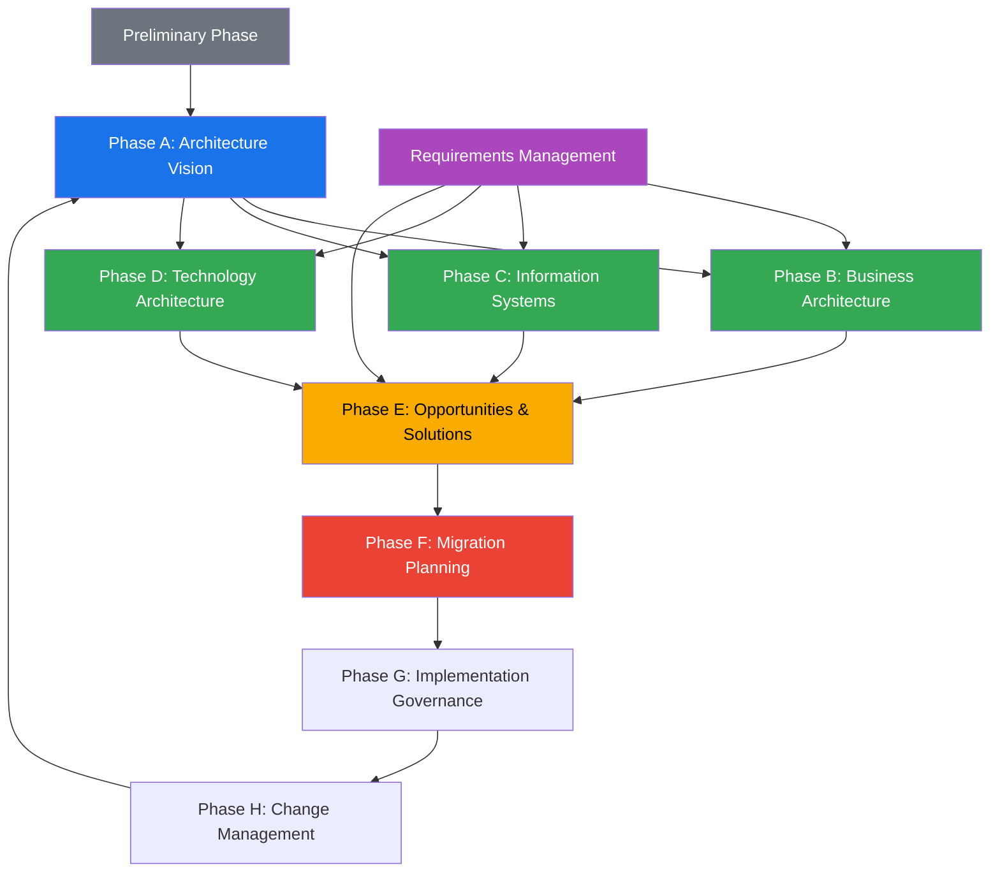

# DA04 — Enterprise Architecture (EA)

> **Triết lý cốt lõi:** "Enterprise Architecture là bản đồ của doanh nghiệp — không có bản đồ, bạn xây dựng ngẫu nhiên. Với bản đồ, bạn xây đúng hướng."

---

## 1. Learning Objectives

Sau khi hoàn thành module này, người học có thể:

- Giải thích TOGAF ADM (Architecture Development Method) 9 phases và áp dụng thực tế
- Mô tả 4 EA Domains: Business, Data, Application, Technology Architecture
- So sánh TOGAF với Zachman Framework và biết khi nào áp dụng
- Phân tích Application Landscape và vẽ bản đồ ứng dụng của một DN VN
- Lựa chọn integration pattern phù hợp: Point-to-point vs ESB vs API-first
- Thiết kế Digital Transformation roadmap từ góc nhìn EA
- Tư vấn EA journey cho enterprise VN (FPT, Viettel, VCB level)

**Cấp độ:** Advanced → Expert  
**Thời gian học:** 30–40 giờ  
**Prerequisites:** Hiểu ERP, IT infrastructure, biết các khái niệm API/integration, kinh nghiệm dự án IT

---

## 2. Business Context

### Tại sao Enterprise Architecture quan trọng với DN VN?

**Câu chuyện thực tế — Tập đoàn sản xuất VN 10,000 nhân viên:**

```
Sau 15 năm tăng trưởng nhanh, công ty có:
├── 3 phần mềm ERP khác nhau (mua theo từng giai đoạn)
├── 5 phần mềm CRM (mỗi BU dùng 1 loại)
├── 8 phần mềm kế toán/finance tool
├── 12 ứng dụng web/mobile tự build
├── 47 file Excel critical để vận hành
└── 200+ integrations point-to-point "spaghetti"

Hậu quả:
→ IT cost chiếm 8% revenue (ngành trung bình: 3–5%)
→ Mỗi lần thay ERP mất 18 tháng và $5M vì integration phức tạp
→ Data inconsistency vì không có single source of truth
→ Không thể scale: thêm 1 ứng dụng mới cần 6 tháng để integrate
→ Digital transformation không đi được vì nền tảng cũ quá phức tạp
```

**EA giải quyết:**
- Bản đồ rõ ràng: Tất cả applications, data flows, integrations được document
- Governance: Mỗi system mới phải "fit" vào architecture đã định
- Target state: Biết cần đi đến đâu (Cloud-native? API-first? Microservices?)
- Roadmap: Từng bước từ "As-Is" → "To-Be" với cost và timeline

**EA tại VN — Ai đang làm:**
- **FPT Group:** EA Practice lớn nhất VN, TOGAF-certified architects, cung cấp EA consulting
- **Viettel Group:** Full EA từ Business đến Technology, hơn 30 countries
- **VCB (Vietcombank):** Multi-year EA journey từ legacy core banking → cloud-ready
- **BIDV:** TOGAF-based EA cho digital banking transformation
- **VinGroup:** EA cho Vinfast, Vinhomes, Vinschool integration

---

## 3. Definitions

| Thuật ngữ | Định nghĩa | Ví dụ VN |
|-----------|-----------|----------|
| **Enterprise Architecture (EA)** | Tổng thể mô tả cách một tổ chức đạt được mục tiêu kinh doanh thông qua việc tổ chức các thành phần: business processes, information, applications, technology | EA blueprint của Viettel Group |
| **TOGAF** | The Open Group Architecture Framework — framework EA phổ biến nhất thế giới, cung cấp ADM (method), content metamodel, và governance | TOGAF 10 (2022) |
| **Zachman Framework** | Framework phân loại EA theo 2 chiều: Perspective (Who, What, How, When, Where, Why) × Level (Planner → Worker) | Dùng để document EA artifacts |
| **ADM (Architecture Development Method)** | Quy trình lặp lại của TOGAF: từ Preliminary → Architecture Vision → Business → Data → Application → Technology → Opportunities → Migration → Implementation → Change | VCB digital transformation roadmap |
| **Business Architecture** | Mô tả chiến lược, governance, tổ chức, và các quy trình kinh doanh | Vinamilk business capability map |
| **Data Architecture** | Cách dữ liệu được thu thập, lưu trữ, quản lý, tích hợp và sử dụng | FPT data architecture blueprint |
| **Application Architecture** | Các ứng dụng được triển khai, tương tác, phục vụ chức năng kinh doanh | Techcombank application landscape |
| **Technology Architecture** | Infrastructure (servers, cloud, network, security) hỗ trợ tất cả các layer trên | Viettel cloud infrastructure |
| **Application Landscape** | Bản đồ tất cả ứng dụng trong enterprise, quan hệ, và mức độ hỗ trợ business | Heatmap of 200+ apps of FPT |
| **Integration Pattern** | Cách thức các hệ thống giao tiếp với nhau | Point-to-point, ESB, API Gateway |
| **ESB (Enterprise Service Bus)** | Middleware trung gian điều phối giao tiếp giữa các hệ thống | IBM WebSphere ESB tại VCB |
| **API-first** | Kiến trúc mà mọi dịch vụ/tính năng đều expose qua API chuẩn trước | MoMo microservices API |
| **Capability Map** | Bản đồ các năng lực (capabilities) mà doanh nghiệp cần có để thực hiện chiến lược | FPT Telecom capability map |
| **Digital Transformation Roadmap** | Kế hoạch từng bước chuyển đổi DN từ traditional → digital, từ góc nhìn EA | Viettel 5-year digital roadmap |

---

## 4. Core Concepts

### 4.1 TOGAF ADM — 9 Phases

```
TOGAF ADM — ARCHITECTURE DEVELOPMENT METHOD:

                    ┌─────────────────────────────┐
                    │  PRELIMINARY PHASE           │
                    │  (Setup, governance, tailor) │
                    └──────────────┬──────────────┘
                                   │
                    ┌──────────────▼──────────────┐
                    │  PHASE A: ARCHITECTURE VISION │
                    │  Scope, stakeholders, vision  │
                    └──────────────┬──────────────┘
         ┌─────────────────────────┼────────────────────────┐
         │                         │                        │
┌────────▼────────┐      ┌─────────▼────────┐    ┌─────────▼────────┐
│  PHASE B:       │      │  PHASE C:         │    │  PHASE D:         │
│  BUSINESS       │      │  INFORMATION      │    │  TECHNOLOGY       │
│  ARCHITECTURE   │      │  SYSTEMS          │    │  ARCHITECTURE     │
│  (Processes,    │      │  (Data + Apps)    │    │  (Infrastructure) │
│  org, strategy) │      │                   │    │                   │
└────────┬────────┘      └─────────┬────────┘    └─────────┬────────┘
         └─────────────────────────┼────────────────────────┘
                                   │
                    ┌──────────────▼──────────────┐
                    │  PHASE E: OPPORTUNITIES       │
                    │  & SOLUTIONS                  │
                    │  (Gap analysis, projects)     │
                    └──────────────┬──────────────┘
                                   │
                    ┌──────────────▼──────────────┐
                    │  PHASE F: MIGRATION PLANNING  │
                    │  (Roadmap, transition arch)  │
                    └──────────────┬──────────────┘
                                   │
                    ┌──────────────▼──────────────┐
                    │  PHASE G: IMPLEMENTATION      │
                    │  GOVERNANCE                   │
                    │  (Monitor, compliance)        │
                    └──────────────┬──────────────┘
                                   │
                    ┌──────────────▼──────────────┐
                    │  PHASE H: ARCHITECTURE        │
                    │  CHANGE MANAGEMENT            │
                    │  (Update, evolve)             │
                    └─────────────────────────────┘

Tất cả phases được driven bởi:
REQUIREMENTS MANAGEMENT (Center of ADM)
```

**Mô tả từng phase:**

| Phase | Mục tiêu | Output chính | VN Context |
|-------|---------|-------------|-----------|
| **Preliminary** | Setup EA capability, governance | Architecture principles, tools | Lập EA team, chọn TOGAF tools |
| **A: Vision** | Scope + stakeholder alignment | Architecture Vision document | CEO brief, scope của dự án |
| **B: Business** | Business capability, processes | Business Architecture | Business capability map |
| **C: Information Systems** | Data & Application Architecture | Data + App architecture | Hiện trạng ứng dụng + dữ liệu |
| **D: Technology** | Infrastructure, cloud, security | Technology Architecture | Cloud strategy, infrastructure |
| **E: Opportunities** | Gap analysis, projects | Transition Architecture | Danh sách projects cần làm |
| **F: Migration** | Roadmap và sequence | Implementation Roadmap | 3-year transformation plan |
| **G: Implementation** | Govern projects execution | Architecture Contract | Oversee từng project |
| **H: Change Mgmt** | Update architecture | Updated baselines | Architecture governance ongoing |

### 4.2 EA Domains — 4 Layers

```
EA DOMAINS (4-LAYER FRAMEWORK):

LAYER 1: BUSINESS ARCHITECTURE
  ┌────────────────────────────────────────────────────────┐
  │  Strategy ──▶ Business Model ──▶ Capabilities          │
  │  ──▶ Processes (BPMN) ──▶ Organization ──▶ Value Chain │
  │                                                        │
  │  VN Example: Vinamilk strategy → 63 tỉnh capabilities  │
  │  Process: Order-to-Cash trong phân phối sữa            │
  └─────────────────────────┬──────────────────────────────┘
                             │ drives
LAYER 2: DATA ARCHITECTURE
  ┌─────────────────────────▼──────────────────────────────┐
  │  Master Data ──▶ Data Models ──▶ Data Flows            │
  │  ──▶ Data Standards ──▶ Data Governance                │
  │                                                        │
  │  VN Example: VCB customer data model, NPA data flows   │
  └─────────────────────────┬──────────────────────────────┘
                             │ realized by
LAYER 3: APPLICATION ARCHITECTURE
  ┌─────────────────────────▼──────────────────────────────┐
  │  Application Landscape ──▶ Integration Patterns        │
  │  ──▶ APIs ──▶ Microservices ──▶ SaaS/PaaS/IaaS        │
  │                                                        │
  │  VN Example: FPT Software application portfolio        │
  │  MoMo microservices on AWS                             │
  └─────────────────────────┬──────────────────────────────┘
                             │ runs on
LAYER 4: TECHNOLOGY ARCHITECTURE
  ┌─────────────────────────▼──────────────────────────────┐
  │  Cloud (AWS/Azure/GCP) ──▶ Network ──▶ Security       │
  │  ──▶ Servers/Containers ──▶ DevOps ──▶ Monitoring     │
  │                                                        │
  │  VN Example: Viettel IDC (data centers), FPT Cloud     │
  │  Techcombank on Azure                                  │
  └────────────────────────────────────────────────────────┘
```

### 4.3 Zachman Framework

```
ZACHMAN FRAMEWORK — 2D Classification:

                WHAT      HOW      WHERE    WHO     WHEN     WHY
                (Data)   (Function)(Network)(People)(Time)  (Motivation)
              ┌────────┬────────┬────────┬────────┬────────┬────────┐
 PLANNER      │Context │Context │Context │Context │Context │Context │
 (Executive)  │List    │Process │Location│Org     │Event   │Goal    │
              ├────────┼────────┼────────┼────────┼────────┼────────┤
 OWNER        │Semantic│Business│Business│Work    │Master  │Business│
 (Business)   │Model   │Process │Concept │Flow    │Schedule│Plan    │
              ├────────┼────────┼────────┼────────┼────────┼────────┤
 DESIGNER     │Logical │System  │DDP     │Human   │Proc    │Business│
 (Architect)  │Data    │Design  │        │Interface│Structure│Rules  │
              ├────────┼────────┼────────┼────────┼────────┼────────┤
 BUILDER      │Physical│Tech    │Network │Present.│Control │Rule    │
 (Developer)  │Data    │Design  │Arch    │Arch    │Struct  │Design  │
              ├────────┼────────┼────────┼────────┼────────┼────────┤
 SUBCONTRACTOR│Definition│Program│Network│Security│Timing  │Rule    │
 (Implementer)│        │        │Address │        │Def.    │Spec    │
              ├────────┼────────┼────────┼────────┼────────┼────────┤
 WORKER       │Data    │Function│Network │Org     │Schedule│Strategy│
 (User)       │Instances│Instance│Instance│Units  │        │Goals   │
              └────────┴────────┴────────┴────────┴────────┴────────┘

Zachman dùng để: Document và classify EA artifacts, không phải làm ADM
TOGAF dùng để: Thực hiện EA process (ADM)
→ Hai framework bổ sung cho nhau
```

### 4.4 Business Capability Map

```
BUSINESS CAPABILITY MAP — Ví dụ FPT Telecom:

LEVEL 1: STRATEGIC CAPABILITIES
├── Customer Relationship Management
├── Product & Service Management
├── Market & Sales Management
├── Financial Management
└── Corporate Services

LEVEL 2 (Under Customer Management):
├── Customer Acquisition
│   ├── Lead Generation
│   ├── Sales Process
│   └── Contract Management
├── Customer Onboarding
│   ├── Service Activation
│   └── Initial Training
├── Customer Retention
│   ├── Churn Prediction
│   └── Loyalty Program
└── Customer Care
    ├── Complaint Handling
    ├── Technical Support
    └── Billing Inquiries

HEAT MAP (color by priority/performance):
🔴 Red = Poor performance, high priority → Invest now
🟡 Yellow = Moderate, medium priority → Monitor
🟢 Green = Good performance → Maintain
⚫ Grey = Not needed for strategy → Decommission
```

### 4.5 Application Landscape Mapping

```
APPLICATION LANDSCAPE — FPT Telecom (Ví dụ):

BUSINESS DOMAIN    │ APPLICATION              │ STATUS  │ QUALITY
───────────────────┼──────────────────────────┼─────────┼─────────
CUSTOMER MGMT      │ Salesforce CRM           │ Active  │ ██████░ 8/10
                   │ Legacy CRM (in-house)    │ Legacy  │ ███░░░░ 4/10
                   │ Customer Portal Web      │ Active  │ █████░░ 7/10
───────────────────┼──────────────────────────┼─────────┼─────────
ORDER MANAGEMENT   │ OMS (custom)             │ Active  │ █████░░ 7/10
                   │ Provisioning System      │ Active  │ ████░░░ 6/10
───────────────────┼──────────────────────────┼─────────┼─────────
BILLING            │ SAP Billing (Core)       │ Active  │ ███████ 9/10
                   │ Old billing (COBOL)      │ Sunset  │ ██░░░░░ 3/10
───────────────────┼──────────────────────────┼─────────┼─────────
NETWORK MGMT       │ OSS/BSS Systems          │ Active  │ ██████░ 8/10
───────────────────┼──────────────────────────┼─────────┼─────────
FINANCE            │ SAP ERP (Finance)        │ Active  │ ███████ 9/10
                   │ Excel financial models   │ Shadow  │ █░░░░░░ 2/10
───────────────────┼──────────────────────────┼─────────┼─────────
ANALYTICS/BI       │ Power BI                 │ Active  │ ██████░ 8/10
                   │ Legacy reports (SSRS)    │ Legacy  │ ███░░░░ 4/10

→ Action: Sunset "Old billing (COBOL)" và "Legacy CRM" trong 18 tháng
→ Action: Replace Excel với proper tool
→ Target state: 8 core systems, well-integrated, cloud-ready
```

### 4.6 Integration Patterns

```
INTEGRATION PATTERNS COMPARISON:

PATTERN 1: POINT-TO-POINT (Spaghetti)
  App A ←──── App B
  App A ──── App C
  App B ←── App C
  App A ──── App D
  ...

  Ưu điểm:
  ✓ Đơn giản ban đầu
  ✓ Nhanh implement từng cặp
  
  Nhược điểm:
  ✗ N systems = N×(N-1)/2 integrations (10 systems = 45 connections)
  ✗ Thay đổi 1 system → phải update tất cả connections
  ✗ Không có monitoring trung tâm
  ✗ Phổ biến ở SME VN và là "legacy nightmare"

PATTERN 2: ESB (Enterprise Service Bus)
  App A ──┐
  App B ──┤
  App C ──┼──▶ ESB ──▶ Route, Transform, Orchestrate
  App D ──┤
  App E ──┘
  
  Ưu điểm:
  ✓ Centralized integration governance
  ✓ Message transformation, routing
  ✓ Monitoring và error handling centralized
  
  Nhược điểm:
  ✗ ESB có thể trở thành bottleneck
  ✗ Phức tạp, cần specialized skills
  ✗ "ESB is the new Spaghetti" nếu không govern tốt
  ✗ Tốn kém (IBM WebSphere, TIBCO, MuleSoft)
  
  VN dùng: VCB (IBM MQ), Viettel (Oracle SOA Suite)

PATTERN 3: API-FIRST / MICROSERVICES
  App A ──▶ API Gateway ──▶ Service A
  App B ──▶ API Gateway ──▶ Service B
  App C ──▶ API Gateway ──▶ Service C
                │
                ├──▶ Auth (OAuth 2.0)
                ├──▶ Rate limiting
                ├──▶ Load balancing
                └──▶ Monitoring (APM)
  
  Ưu điểm:
  ✓ Loose coupling: thay đổi service không ảnh hưởng consumer
  ✓ Scale independently
  ✓ Tốc độ development cao hơn
  ✓ Cloud-native friendly
  
  Nhược điểm:
  ✗ Cần mature engineering culture (DevOps, CI/CD)
  ✗ Distributed system complexity (network issues, latency)
  ✗ Cần API governance
  
  VN dùng: MoMo, VNPay, Techcombank, FPT Software (modern projects)

PATTERN 4: EVENT-DRIVEN / EDA
  App A ──▶ Event Bus (Kafka) ──▶ Consumer Service B
                              ──▶ Consumer Service C
                              ──▶ Consumer Service D
  
  Tốt cho: Real-time streaming, high throughput, decoupled services
  VN dùng: VNG (Zalo), Grab Vietnam, MOMO

→ Chiến lược VN enterprise: Hybrid
  Legacy: Keep ESB
  New: API-first
  Transition: Wrap legacy với APIs
```

### 4.7 Digital Transformation Roadmap từ EA Perspective

```
DIGITAL TRANSFORMATION ROADMAP — 5 YEAR VIEW:

YEAR 1: FOUNDATION
├── EA assessment (As-Is landscape)
├── Data governance setup
├── API strategy definition
├── Cloud strategy (cloud-first cho new projects)
└── Legacy application rationalization plan

YEAR 2: MODERNIZE CORE
├── Core ERP upgrade/replacement
├── CRM unification
├── API Gateway implementation
├── Begin microservices for new features
└── Data warehouse implementation

YEAR 3: DIGITAL CHANNELS
├── Mobile app / customer portal
├── Omnichannel integration
├── Digital payments integration
├── Analytics & BI mature
└── AI/ML first use cases

YEAR 4: INTELLIGENT ENTERPRISE
├── AI embedded in core processes
├── Predictive analytics operational
├── Process automation (RPA → intelligent automation)
├── Real-time data ecosystem
└── Partner API ecosystem

YEAR 5: PLATFORM BUSINESS
├── Open APIs for ecosystem partners
├── Data monetization
├── Digital products
└── Continuous innovation culture

VN REALITY CHECK:
→ Phần lớn enterprise VN đang ở giữa Year 1-2
→ Banks (Techcombank, VCB) tiên tiến hơn: Year 3-4
→ Tech companies (MoMo, VNG, Tiki): Year 4-5
```

---

## 5. Business Value

**Giá trị EA mang lại:**

**Strategic Value:**
- Alignment: IT investment aligned với business strategy — không mua tech vì "hot trend"
- Agility: Kiến trúc tốt → thêm feature mới trong tuần thay vì tháng
- Cost: Application rationalization → giảm 20–40% IT operation cost

**Operational Value:**
- Reduced complexity: Từ 200 integrations → 50 well-governed APIs
- Faster onboarding: New application fit vào architecture trong 2 tuần thay vì 6 tháng
- Risk reduction: Biết rõ dependency → ít surprise khi có sự cố

**Case số liệu:**
- Viettel: EA governance → giảm 30% time-to-market cho new products
- VCB: Application rationalization → retire 40 legacy apps → tiết kiệm $5M/năm
- FPT Software: TOGAF-based EA practice → win contracts với Nhật ($100M+ annually)

---

## 6. Enterprise Role

```
EA VỊ TRÍ TRONG TỔ CHỨC:

CEO/Board
    │
    ├── CIO/CTO (Sponsor of EA)
    │       │
    │       └── Chief Enterprise Architect (CEA)
    │               │
    │               ├── Business Architects (2-5 người)
    │               ├── Data Architects (2-3 người)
    │               ├── Solution Architects (nhiều nhất)
    │               └── Technology Architects (2-3 người)
    │
    └── Architecture Review Board (ARB)
            → Approve/reject architecture decisions
            → Members: CEA + BU Architects + Security + Finance

EA team phục vụ:
├── Strategy office (Long-term capability planning)
├── PMO (Project governance: mọi project phải comply với EA)
├── IT Operations (Standard technology choices)
└── Business units (Application selection, integration)
```

---

## 7. Departments Related

| Phòng ban | Cách EA liên quan | EA Artifact phục vụ |
|-----------|-----------------|-------------------|
| **C-Suite / Board** | Strategic alignment, investment decisions | Architecture Vision, Roadmap |
| **PMO** | Mọi project mới phải qua Architecture Review | Architecture Contract, Compliance |
| **IT Operations** | Standard technology stack, infrastructure | Technology Architecture |
| **Business Units (BU)** | Business process improvement, system selection | Business Architecture |
| **Finance** | IT budget, cost of complexity | Application Portfolio Analysis |
| **Security/Risk** | Security architecture, compliance | Security Architecture, Risk |
| **HR** | Org structure, capability building | Business Architecture |
| **Legal/Compliance** | Data regulations, system compliance | Data Architecture, Security |

---

## 8. Input

**Đầu vào cho EA:**

| Input | Nguồn | Dùng cho |
|-------|-------|---------|
| **Business Strategy** | CEO, Board, Strategy office | Align EA với strategy |
| **Regulatory requirements** | Legal, Compliance | Compliance architecture |
| **IT Inventory** | IT Operations | As-Is application landscape |
| **Budget** | Finance | Prioritize investments |
| **Project pipeline** | PMO | Architecture for upcoming projects |
| **Industry standards** | TOGAF, ISO, NIST | Framework adoption |
| **Vendor roadmaps** | SAP, Microsoft, AWS | Technology choices |
| **Business pain points** | BU leaders, users | Priority areas |
| **Market trends** | Gartner, Forrester | Future-state design |

---

## 9. Output

**Sản phẩm đầu ra của EA:**

| Artifact | Mô tả | Dùng bởi |
|---------|-------|---------|
| **Architecture Vision** | Tầm nhìn EA ở mức cao nhất | C-suite |
| **Business Capability Map** | Năng lực kinh doanh cần có | Business + IT |
| **Application Portfolio** | Bản đồ tất cả ứng dụng, status, quality | CIO, PMO |
| **Data Architecture Blueprint** | Cách data được quản lý, flowed | CDO, Data team |
| **Integration Architecture** | Cách các hệ thống kết nối | IT, Development |
| **Technology Standards** | Danh sách technology được phép dùng | IT, Procurement |
| **Architecture Roadmap** | Kế hoạch từng bước từ As-Is → To-Be | PMO, Finance |
| **Architecture Decision Records (ADR)** | Quyết định architecture + lý do | Development teams |
| **Reference Architecture** | Blueprint mẫu cho từng domain | Project teams |
| **Compliance Report** | Các projects có comply với EA không | ARB, CIO |

---

## 10. Business Process

**Quy trình EA:**

```
EA LIFECYCLE PROCESS:

PHASE 1: ESTABLISH (Năm đầu)
├── Form EA team (hire/train)
├── Define EA principles (10-15 principles)
├── Choose framework (TOGAF tailor)
├── Document As-Is architecture
└── Setup Architecture Review Board (ARB)

PHASE 2: PLAN (Ongoing quarterly)
├── Architecture Review của upcoming projects
├── Update architecture based on changes
├── Identify gaps vs strategy
└── Propose initiatives để fill gaps

PHASE 3: GOVERN (Ongoing)
├── Every new project → Architecture Review
├── Compliance check (using approved tech stack?)
├── Architecture Exception process
└── Quarterly ARB meeting

PHASE 4: EVOLVE (Ongoing)
├── Quarterly: Update application portfolio
├── Annually: Strategy refresh → EA refresh
├── Monitor technology trends
└── Decommission outdated architectures

EA REVIEW PROCESS FOR PROJECTS:
Project initiated
    │
    ▼
Architecture Submission (EA team)
    │
    ▼
ARB Review (2 weeks)
    │
    ├── Approve → Project proceeds with EA guidance
    ├── Conditional Approve → Fix certain aspects, resubmit
    └── Reject → Redesign required (rare)
```

---

## 11. Data Flow

```
INFORMATION FLOW TRONG EA GOVERNANCE:

BUSINESS STRATEGY                  EA ARTIFACTS
(CEO/Board)                        (EA Team)
    │                                   │
    │ Strategic intent                  │
    ▼                                   ▼
ARCHITECTURE VISION ─────────────▶ Updated Architecture
    │                                   │
    │ Drives                            │ Informs
    ▼                                   ▼
BUSINESS ARCHITECTURE ─────────▶ Capability Map
    │                             Process Models
    │ Requirements for             Organization Design
    ▼
INFORMATION SYSTEMS ARCH ────▶ Data Models
    │                           Application Map
    │                           Integration Design
    ▼
TECHNOLOGY ARCHITECTURE ─────▶ Infrastructure Blueprint
                                Cloud Architecture
                                Security Design

← All feed into →

IMPLEMENTATION ROADMAP
    │
    ▼
PROJECTS (governed by ARB)
    │
    ▼
PRODUCTION SYSTEMS
    │
    ▼ Feedback loop
EA UPDATE (H Phase)
```

---

## 12. Money Flow

**Chi phí EA:**

```
EA COST STRUCTURE:

EA TEAM (Tốn kém nhất):
├── Chief Enterprise Architect: $80,000–$150,000/năm (global), $30,000–$60,000 VN
├── Business Architects (2): $50,000–$100,000/năm mỗi người
├── Solution Architects (3–5): $40,000–$80,000/năm mỗi người
└── Data Architect (1–2): $50,000–$100,000/năm

TOOLS:
├── EA Modeling Tool: 
│   BiZZdesign: $2,000–$5,000/user/năm
│   Sparx Enterprise Architect: $200–$500/user (rẻ hơn)
│   LeanIX (SaaS): $50,000–$200,000/năm
│   Ardoq: $30,000–$100,000/năm
├── TOGAF Training: $3,000–$5,000/person (TOGAF certification)
└── Consulting support: $50,000–$200,000/năm

ROI CỦA EA:
├── Application rationalization: Retire 30–40% redundant apps
│   → Tiết kiệm license cost: $500,000–$5M/năm (enterprise)
├── Reduced integration cost: API-first vs point-to-point
│   → 50% reduction in integration effort
├── Faster project delivery: Clear standards → less rework
│   → 20–30% reduction in project cost
└── Strategic alignment: Fewer "wrong investments"
    → Avoid $1M+ white elephant projects

VN PRAGMATIC APPROACH:
→ SME: Không cần formal EA team, 1 Solution Architect đủ
→ Mid-market (500–5,000): 1 EA Lead + 2 Solution Architects
→ Enterprise (5,000+): Full EA team với governance
```

---

## 13. Document Flow

```
EA DOCUMENTATION ECOSYSTEM:

STRATEGY LAYER:
├── Business Strategy Document (from CEO/Strategy)
├── IT Strategy (CIO)
└── Architecture Vision (EA Team output)

ARCHITECTURE LAYER (EA Team creates):
├── Architecture Principles (10–15 principles)
├── Business Architecture:
│   ├── Business Capability Map
│   ├── Value Chain Diagram
│   └── Business Process Models (BPMN)
├── Data Architecture:
│   ├── Conceptual Data Model
│   ├── Data Flow Diagrams
│   └── Data Governance Policy
├── Application Architecture:
│   ├── Application Portfolio (catalog)
│   ├── Application Landscape Map
│   └── Integration Architecture
└── Technology Architecture:
    ├── Technology Radar
    ├── Cloud Architecture Blueprint
    └── Security Architecture

PROJECT LAYER:
├── Architecture Decision Records (ADR)
├── Solution Architecture Document (per project)
└── Architecture Compliance Assessment

GOVERNANCE:
├── ARB Meeting Minutes
├── Architecture Exception Log
├── EA Maturity Assessment (annual)
└── Architecture Roadmap (updated quarterly)
```

---

## 14. Roles

| Vai trò | Trách nhiệm | Kỹ năng cần |
|---------|------------|------------|
| **Chief Enterprise Architect (CEA)** | Dẫn dắt EA strategy, chair ARB, align với CIO/CEO | Technical depth + Business acumen |
| **Business Architect** | Map business capabilities, processes, org design | Business analysis, BPMN, strategy |
| **Data Architect** | Design data architecture, integration, governance | SQL, data modeling, cloud platforms |
| **Solution Architect** | Design cho từng project/system, hands-on | Multiple tech stacks, integration |
| **Technology Architect** | Cloud, infrastructure, DevOps architecture | Cloud platforms, networking, security |
| **Security Architect** | Security across all EA domains | Cybersecurity frameworks, regulations |
| **EA Analyst/Manager** | Maintain EA repository, governance support | EA tools, documentation, facilitation |

---

## 15. Responsibilities

- **CEA:** Strategic direction, ARB leadership, executive communication, talent development
- **Business Architects:** Business capability mapping, process analysis, BU engagement, business requirements
- **Data Architects:** Data models, data governance alignment, DWH/MDM architecture, data quality
- **Solution Architects:** Project-level architecture, hands-on design, technical guidance, code review at architecture level
- **Technology Architects:** Cloud strategy, infrastructure standards, DevOps enablement, security baseline
- **Security Architects:** Threat modeling, security standards, compliance reviews, incident architecture support

---

## 16. RACI Matrix

| Hoạt động | CEO | CIO | CEA | Business Arch | Solution Arch | PMO | BU Leader |
|-----------|-----|-----|-----|--------------|--------------|-----|-----------|
| Define EA vision | A | R | R | C | I | I | C |
| Business capability map | I | C | R | R | I | I | C |
| Architecture Review (ARB) | I | A | R | C | C | I | I |
| Technology standards | I | A | R | C | R | I | I |
| Project architecture | I | I | A | C | R | C | I |
| EA tools budget | A | R | C | I | I | I | I |
| EA roadmap | A | R | R | C | C | C | C |
| Training & certification | I | A | R | C | C | I | I |

**R**=Responsible, **A**=Accountable, **C**=Consulted, **I**=Informed

---

## 17. Frameworks

### 17.1 TOGAF 10 (2022)

Bản TOGAF mới nhất (2022), cập nhật:
- ADM vẫn là core
- Thêm guidance cho Agile EA
- Better support cho digital business
- Integration với các frameworks khác

### 17.2 Zachman Framework 3.0

- 6 perspectives × 6 interrogatives = 36 cells
- Dùng để classify và organize EA artifacts
- Bổ sung cho TOGAF (Zachman classify, TOGAF process)

### 17.3 FEAF (Federal Enterprise Architecture Framework)

- Dùng bởi US Government
- 5 reference models: Performance, Business, Service Component, Data, Technical
- Ít dùng tại VN trừ dự án với partner US government

### 17.4 Gartner's EA Framework

- Tập trung vào business outcomes
- "EA = Strategic Planning + IT Planning"
- Phổ biến trong tư vấn strategy

### 17.5 SAFe (Scaled Agile Framework) + EA

```
EA + AGILE = LEAN ARCHITECTURE:

Traditional EA: "Design everything upfront, then build"
Lean EA: "Design just enough, evolve architecture continuously"

LEAN ARCHITECTURE PRINCIPLES:
1. Architecture serves the product (not the other way)
2. Minimal viable architecture (MVA) — not over-engineer
3. Architecture runway — stay a few sprints ahead of development
4. Architecture spike — use spikes to prove risky decisions
5. Emergent design — let architecture emerge through iterations

VN Adoption: Các tech company VN (MoMo, Tiki, VNPay) dùng SAFe+Lean EA
```

---

## 18. International Standards

| Standard | Nội dung | VN Relevance |
|---------|---------|-------------|
| **TOGAF 10** | EA framework, ADM | Tiêu chuẩn chính cho EA VN enterprise |
| **ISO/IEC 42010** | Architecture description language standard | Reference cho EA documentation |
| **COBIT 2019** | IT governance + EA governance | Ngân hàng, tài chính VN |
| **ITIL 4** | IT Service Management | Technology Architecture layer |
| **ISO 27001** | Information security management | Security Architecture |
| **NIST Cybersecurity Framework** | Security architecture best practices | VN banking, telco |
| **ArchiMate 3.1** | EA modeling language (Open Group) | Dùng với TOGAF, tool-supported |
| **BPMN 2.0** | Business Process Modeling | Business Architecture |
| **Gartner Magic Quadrant** | Technology evaluation guide | Technology Architecture decisions |

---

## 19. Vietnam Context

### EA tại Việt Nam — Bức tranh thực tế:

**Tình trạng hiện tại (2024):**

**Tier 1 — Leading (TOGAF-mature):**
- **FPT Software:** 200+ TOGAF-certified architects, EA Practice, tư vấn quốc tế
- **Viettel Group:** Full EA governance, TOGAF + internal frameworks, 30+ markets
- **VCB:** Dedicated EA team, multi-year transformation architecture

**Tier 2 — Developing:**
- **Techcombank:** Solution architecture mature, EA developing
- **BIDV, Agribank:** EA initiatives với consultant support
- **Masan, Vinamilk:** IT architecture without formal EA governance

**Tier 3 — Beginning:**
- Phần lớn SME và mid-market VN: Không có formal EA
- Ad-hoc architecture: IT Manager kiêm "architect"
- Point-to-point integrations phổ biến

**FPT Enterprise Architecture Practice:**
- FPT Software có dedicated EA Practice với 200+ certified architects
- Cung cấp EA consulting cho khách hàng Nhật, Mỹ, Australia
- Sử dụng TOGAF + Agile + Domain-Driven Design
- Tools: Sparx EA, LeanIX, Confluence

**Viettel EA Journey:**
- 30+ markets globally → EA không thể ad-hoc
- Viettel dùng TOGAF-based EA với local tailoring
- Telecom domain requires OSS/BSS architecture expertise (TM Forum standards)
- Digital transformation: MoneyVN, MyViettel app — all designed from EA perspective

**VCB Digital Architecture Journey:**
- Phase 1 (2017–2020): Core banking modernization (T24 Temenos)
- Phase 2 (2020–2022): API Banking, Open Banking readiness
- Phase 3 (2022–2025): Cloud migration, AI integration
- Key challenge: Data sovereignty (phải giữ data trong VN)
- Solution: Hybrid cloud (private cloud on-prem VN + AWS Singapore cho non-sensitive)

**Challenges EA VN:**
1. **Thiếu TOGAF-certified professionals:** <500 người có TOGAF certification tại VN
2. **Business-IT alignment yếu:** CEO/CFO không hiểu EA value
3. **Short-term thinking:** "Build nhanh, refactor sau" → Tech debt cao
4. **Budget hạn chế:** EA team và tools đắt → khó justify với SME
5. **Legacy system lock-in:** Nhiều hệ thống SAP/Oracle on-premise cũ, khó thay đổi

---

## 20. Legal Considerations

**Quy định pháp lý ảnh hưởng EA:**

| Quy định | EA Domain bị ảnh hưởng | Yêu cầu kỹ thuật |
|---------|----------------------|-----------------|
| **Luật An ninh mạng 2018** | Technology, Data Architecture | Data localization, security controls |
| **Thông tư 09/2020/TT-NHNN** | Toàn bộ EA (NH/TCTD) | Audit trail, data classification, DR |
| **Nghị định 13/2023/NĐ-CP** | Data Architecture | Privacy-by-design, anonymization |
| **Thông tư 12/2018/TT-BTTTT** | Technology Architecture | Network security standards |
| **Quyết định 1813/QĐ-TTg (2021)** | Business & Tech Architecture | Digital payment infrastructure |
| **Nghị định 85/2021/NĐ-CP** | Application Architecture | eCommerce platform requirements |
| **PCI-DSS** | Toàn bộ (nếu xử lý thẻ thanh toán) | Cardholder data environment design |
| **Basel III (ngân hàng)** | Data Architecture | Risk data aggregation, reporting |

**EA Principles từ góc độ pháp lý:**
- Privacy-by-design: Data privacy phải là architectural requirement, không phải afterthought
- Data residency: Kiến trúc cloud phải đảm bảo data nhạy cảm ở VN
- Audit-by-design: Mọi hệ thống phải có audit log từ đầu, không thêm sau
- Security-by-design: Security controls được thiết kế vào kiến trúc

---

## 21. Common Mistakes

**10 lỗi phổ biến trong EA VN:**

1. **"EA là IT project, không phải business"**
   - Lỗi: EA team chỉ có IT people, business không tham gia
   - Fix: Business Architect là business-domain expert với IT knowledge

2. **"Làm EA mà không có executive sponsor"**
   - Lỗi: CEA báo cáo IT Manager → không có quyền quyết định cross-silo
   - Fix: CEA phải báo cáo CIO hoặc CEO; ARB chủ tịch là C-level

3. **"Architecture Document dày nhưng không ai đọc"**
   - Lỗi: EA team tạo 200-page documents, không ai dùng
   - Fix: EA artifacts phải fit-for-purpose: Executive = 1 slide, Developer = design doc

4. **"Không có Architecture Review Board"**
   - Lỗi: Projects build gì thì build, không cần review
   - Fix: ARB bắt buộc cho mọi project trên một ngưỡng nhất định ($50K+ hoặc integration mới)

5. **"Chọn TOGAF full blown cho SME"**
   - Lỗi: Áp dụng toàn bộ TOGAF cho công ty 200 người → quá nặng
   - Fix: Lightweight EA: chỉ dùng Application Landscape + Integration review + Technology standards

6. **"Technology Architecture đi trước Business Architecture"**
   - Lỗi: "Chúng tôi muốn microservices" → không biết tại sao cần
   - Fix: Business drives architecture: Business capability → Data → App → Tech

7. **"Không decommission legacy systems"**
   - Lỗi: Thêm mới nhưng không retire cũ → increasing complexity mãi
   - Fix: Application rationalization mandatory: mỗi new system → assess which old to retire

8. **"ESB as bottleneck"**
   - Lỗi: Tất cả integration qua ESB → ESB trở thành single point of failure + bottleneck
   - Fix: Hybrid: ESB cho existing, API-first cho new; decouple ESB

9. **"Cloud migration không có architecture"**
   - Lỗi: "Lift and shift" tất cả lên cloud → cost cao hơn on-prem, không benefit
   - Fix: Cloud architecture pattern selection (rehost, replatform, refactor, rebuild) per app

10. **"Không cập nhật architecture sau khi go-live"**
    - Lỗi: Architecture document viết năm 2020, thực tế 2024 khác hoàn toàn
    - Fix: Quarterly architecture review, tool-supported (LeanIX tự động discover apps)

---

## 22. Best Practices

**Best practices EA từ enterprise VN:**

1. **Start with Why (Business Driver)** — Mọi architecture decision phải trace về business outcome

2. **Document the As-Is first, completely** — Không thể plan To-Be nếu không biết As-Is

3. **Technology Standards list** — "Approved technology list": DB phải là PostgreSQL hoặc SQL Server, không tự chọn → giảm operational complexity

4. **Architecture Decision Records (ADR)** — Ghi lại mọi quyết định quan trọng: Context, Options, Decision, Rationale, Consequences

5. **Two-speed IT** — Core (stable, low risk): legacy, well-proven; Edge (fast, experimental): new digital services. Kiến trúc phải support cả hai tốc độ

6. **API-first for new, Wrap for legacy** — New systems: build API-first. Legacy: wrap với API layer mà không cần thay đổi core

7. **Application Rationalization every 2 years** — Review portfolio: retire nếu đang dùng <30% capacity hoặc duplicate với system khác

8. **EA Tooling từ đầu** — Đừng document trong Word/Visio. Dùng proper tool (Sparx EA, LeanIX, Ardoq) để search được, link được

9. **Build EA muscle, not ivory tower** — EA team nên embedded vào project teams, không chỉ review từ xa

10. **Measure EA value** — KPI rõ ràng: Time-to-integration, Application rationalization %, Architecture compliance rate

---

## 23. KPIs

**KPIs đo lường EA effectiveness:**

| KPI | Định nghĩa | Target |
|-----|-----------|--------|
| **Architecture Compliance Rate** | % projects tuân thủ EA standards | >85% |
| **Application Rationalization** | % redundant apps đã retire trong năm | 10–20%/năm |
| **Time to Architecture Review** | Avg days từ submission → ARB decision | <10 ngày |
| **Integration Complexity** | Số point-to-point integrations (giảm) | Giảm 20%/năm |
| **Technology Standard Compliance** | % systems dùng approved tech | >90% |
| **EA Documentation Currency** | % architecture docs được update < 6 tháng | >80% |
| **Architecture Debt** | Số known architecture issues chưa fix | Giảm trend |
| **Time-to-Market (new products)** | Avg time từ idea → production | Giảm YoY |
| **IT Cost as % of Revenue** | Total IT cost / Revenue | <4% (world-class) |

---

## 24. Metrics

**Metrics kỹ thuật EA:**

```
APPLICATION PORTFOLIO METRICS:
├── Total applications: [count] (track giảm dần)
├── Legacy applications (>10 năm, end-of-life): [count]
├── Cloud-hosted vs On-premise: [%]
├── Applications with SLA documented: [%]
├── Application health score (avg): [0-10]
└── Annual license cost per application: [$]

INTEGRATION METRICS:
├── Total integrations: [count]
├── Point-to-point vs API-managed: [ratio]
├── API uptime (avg): [%]
├── Integration error rate: [%/day]
└── Average integration latency: [ms]

TECHNOLOGY CURRENCY:
├── % applications on supported tech versions: [%]
├── % applications on cloud: [%]
├── Technical debt score: [qualitative 1-5]
└── Average tech stack age: [years]
```

---

## 25. Reports

**Báo cáo EA:**

| Báo cáo | Tần suất | Audience |
|---------|---------|---------|
| **Architecture Review Report** | Per project | ARB, Project team |
| **Application Portfolio Report** | Quarterly | CIO, IT leadership |
| **Technology Currency Report** | Quarterly | CIO, IT Ops |
| **Architecture Compliance Report** | Quarterly | CIO, PMO |
| **EA Roadmap Update** | Quarterly | CEO, CIO, PMO |
| **EA Maturity Assessment** | Annually | CEO, CIO, Board |
| **IT Cost Analysis (EA lens)** | Annually | CEO, CFO, CIO |
| **Technology Radar** | Semi-annually | All IT, Development |

---

## 26. Templates

**Templates EA:**

**1. Architecture Vision Template (1 page):**
```
ARCHITECTURE VISION — [Project/Initiative Name]

Business Driver: [Tại sao cần làm điều này?]
Business Outcomes: [3-5 measurable outcomes]
Scope: [In scope / Out of scope]
Stakeholders: [Key stakeholders + concerns]

Architecture Principles Applied:
□ Cloud-first    □ API-first    □ Security-by-design
□ Data privacy   □ Reuse before build

Target State Summary:
[1 paragraph mô tả kiến trúc mục tiêu]

Key Architecture Decisions:
1. [Decision + rationale]
2. [Decision + rationale]

Risks & Constraints:
[Key risks và giới hạn]

Timeline & Phasing:
Phase 1: [...]  Phase 2: [...]  Phase 3: [...]

Approved by: [CEA] [CIO] Date: [___]
```

**2. Architecture Decision Record (ADR) Template:**
```
ADR-XXXX: [Title]
Date: [YYYY-MM-DD]
Status: [Proposed | Accepted | Deprecated | Superseded]

Context:
[Tình huống và vấn đề cần quyết định]

Options Considered:
Option 1: [...]  Pros: [...] Cons: [...]
Option 2: [...]  Pros: [...] Cons: [...]
Option 3: [...]  Pros: [...] Cons: [...]

Decision:
[Option X được chọn vì...]

Consequences:
Positive: [...]
Negative: [...]
Risks: [...]

Related ADRs: [links]
```

---

## 27. Checklists

### Architecture Review Checklist (ARB):

**Business Alignment:**
- [ ] Business driver đã được document rõ ràng
- [ ] Liên kết với business capability map
- [ ] Business outcomes measurable

**Architecture Principles Compliance:**
- [ ] Cloud-first được xem xét?
- [ ] API-first cho external integrations?
- [ ] Security-by-design được include?
- [ ] Privacy-by-design cho data cá nhân?
- [ ] Reuse existing components trước khi build mới?

**Technology Standards:**
- [ ] Technology choices từ approved list?
- [ ] Exception nếu dùng ngoài list (có justification)?
- [ ] Vendor lock-in được xem xét?
- [ ] Open standards được ưu tiên?

**Integration:**
- [ ] Integration pattern phù hợp?
- [ ] API contract được define?
- [ ] No new point-to-point integrations?
- [ ] Error handling và retry logic?

**Non-functional Requirements:**
- [ ] Performance targets defined và achievable?
- [ ] Scalability plan?
- [ ] DR/HA được address?
- [ ] Monitoring và observability?

**Data:**
- [ ] Data flows documented?
- [ ] Data ownership assigned?
- [ ] Data retention defined?
- [ ] PII/sensitive data handling?

---

## 28. SOP

### SOP-EA-001: Architecture Review Process

**Tên:** Architecture Review Board Process  
**Trigger:** Mọi project có IT component >$50,000 hoặc new integration

```
BƯỚC 1: PROJECT TEAM SUBMITS (Week 1)
- Hoàn thành Architecture Submission Form
- Đính kèm: Architecture diagram, technology choices, integration design
- Submit 2 tuần trước ARB meeting

BƯỚC 2: EA TEAM PRE-REVIEW (Week 1-2)
- EA team review submission
- Check compliance với architecture principles
- Identify questions hoặc concerns
- Prepare review feedback

BƯỚC 3: ARB MEETING (Week 2)
- Project team present (20 phút)
- Q&A (20 phút)
- ARB deliberation (20 phút, without project team)
- Decision: Approve / Conditional Approve / Reject

BƯỚC 4: DECISION COMMUNICATION (Within 3 days)
- Email decision với rationale
- If Conditional: List conditions và deadline
- If Reject: List concerns và recommended redesign

BƯỚC 5: FOLLOW-UP
- If Conditional: Project resubmit sau khi fix → EA team fast-track review (no full ARB)
- ADR created cho mọi major decisions
- Architecture updated trong EA repository

SLA:
- EA team response: 5 business days
- ARB decision: 10 business days từ submission
- Urgent review (executive request): 3 business days
```

### SOP-EA-002: Technology Standard Deviation Process

```
Khi project cần dùng technology NGOÀI approved list:

1. Submit Technology Exception Request
2. EA team assess impact (5 ngày)
3. If minor exception → EA Lead can approve
4. If major exception → ARB vote
5. If approved → add to exception list (not standard)
6. Review annually: make it standard hoặc retire exception
```

---

## 29. Case Study

### Case Study 1: FPT Software — Building EA Practice

**Bối cảnh (2015–2024):**
FPT Software là công ty outsourcing IT lớn nhất VN. Để thắng các contracts enterprise lớn từ Nhật, Mỹ, AU — cần chứng minh EA capability.

**Journey:**
- 2015: FPT mua The Open Group membership, bắt đầu TOGAF training
- 2017: 50 TOGAF-certified architects
- 2019: Establish EA Practice với dedicated service line
- 2021: 200+ TOGAF-certified, EA Practice revenue $20M+/năm
- 2024: EA + Cloud + Agile combined service line, win Fortune 500 clients

**Key capabilities built:**
- Business Architecture (value stream mapping, capability assessment)
- Application Rationalization (Gartner TIME model)
- Cloud EA (AWS Well-Architected, Azure Landing Zone)
- Digital Transformation Roadmap

**Business impact:**
- Premium pricing: EA-led projects bill at $50–$80/hour vs $30–$40 commodity
- Client stickiness: EA clients stay 5+ years vs commodity 2–3 years
- Revenue multiplier: EA engagement often leads to implementation contracts (10x)

---

### Case Study 2: VCB — Digital Banking Architecture Transformation

**Bối cảnh (2018–2024):**
VCB là ngân hàng lớn nhất VN (market cap). Muốn chuyển đổi từ "traditional bank" → "digital bank" cạnh tranh với neobanks.

**As-Is Architecture Issues (2018):**
- Core Banking: Flexcube 7 (IBM, 2005) — không support real-time
- 150+ legacy applications, nhiều không còn vendor support
- 200+ point-to-point integrations
- Mobile banking app: thế hệ 1, UX kém
- Data: siloed, không có enterprise DWH

**Target Architecture (To-Be):**
```
Channels Layer:     Mobile App (v4) | Internet Banking | Partner APIs
                         ↓                ↓                ↓
API Gateway:        Kong + MuleSoft API Platform
                         ↓
Core Services:      Core Banking (Temenos T24) | Payment Hub | Digital Onboarding
                         ↓
Integration:        ESB → API-first migration (dual-speed)
                         ↓
Data Platform:      Oracle Exadata DWH + Azure Synapse Cloud
                         ↓
Infrastructure:     Hybrid Cloud (On-premise VN + Azure Singapore)
```

**Phased Execution:**
- Phase 1 (2018–2020): Core Banking upgrade T24, API Gateway
- Phase 2 (2020–2022): Mobile Banking v3, Digital onboarding, DWH
- Phase 3 (2022–2024): Cloud migration (non-sensitive workloads), AI/ML
- Phase 4 (2024+): Open Banking APIs, partner ecosystem

**Kết quả (2024):**
- Mobile Banking users: 15M+ (tăng 3x)
- Transaction time: <1 giây (trước: 3–5 giây)
- Legacy apps retired: 60 apps (40% portfolio)
- IT cost: Giảm 15% despite scaling
- New product launch: 6 tuần (trước: 6 tháng)

---

## 30. Small Business Example

### SME Example: Chuỗi giáo dục 20 trung tâm, 300 nhân viên

**Vấn đề:**
- 3 phần mềm quản lý học sinh khác nhau (mua theo từng giai đoạn mở rộng)
- Phần mềm kế toán không kết nối với quản lý học sinh
- Website, app mobile, và phần mềm nội bộ không share data
- CEO không biết thực tế bao nhiêu học sinh active, bao nhiêu đã nghỉ

**Lightweight EA cho SME:**

```
BƯỚC 1: Application Inventory (1 ngày):
App 1: Edusoft (CRM học sinh) — 15 trung tâm dùng
App 2: Old system (10 năm) — 5 trung tâm cũ
App 3: MISA Kế toán — toàn chuỗi
App 4: Website WordPress — lead generation
App 5: Mobile App — check-in học sinh
App 6: 12 Excel files — báo cáo quản lý
→ Tổng: 6 loại app, 0 integration tốt

BƯỚC 2: Target Architecture (1 tuần thiết kế):
Single CRM (Edusoft) ← Website (API) ← Mobile App (API)
         ↓
   MISA Kế toán (automated sync, không tay)
         ↓
    Power BI Dashboard (CEO view)

BƯỚC 3: Roadmap 12 tháng:
Tháng 1-3: Migrate 5 trung tâm cũ → Edusoft
Tháng 4-6: Connect Website → Edusoft (API)
Tháng 7-9: Automate Edusoft → MISA sync
Tháng 10-12: Power BI dashboard, retire Excel files

Budget: $30,000–$50,000 total (implementation + licenses)
ROI: Tiết kiệm 20 giờ/tuần manual work, CEO có real-time visibility
```

---

## 31. Enterprise Example

### Enterprise Example: Viettel Group — EA cho Tập đoàn 30 Quốc gia

**Scale:**
- 30+ markets (Vietnam, Lào, Campuchia, Myanmar, Mozambique, Cameroon...)
- 100M+ customers globally
- 30,000+ employees in technology
- Revenue: $3B+ (2023)

**EA Challenge:**
- Làm sao chuẩn hóa kiến trúc khi mỗi quốc gia có hệ thống riêng?
- Balance giữa global standards và local requirements
- Telecom requires OSS/BSS (TM Forum standards) không phải chỉ TOGAF

**Viettel EA Approach:**

```
GLOBAL ARCHITECTURE STANDARDS:
├── Core Systems: Ericsson BSS (Billing) + NetCracker OSS
├── CRM: Viettel MyViettel platform (proprietary)
├── Integration: MuleSoft API Platform (global)
├── Cloud: VNCloud (Viettel's own cloud, hybrid with AWS/Azure)
└── Data: Teradata DWH (global) → Azure Synapse (migrating)

LOCAL ADAPTATION:
├── Each country: Local payment systems, Regulatory requirements
├── Language: UI/UX localized
└── Compliance: Data sovereignty per country

EA GOVERNANCE:
├── Viettel Group CTO = Chief EA Authority
├── Country CTO = Local EA Authority
├── Exception process for country-specific needs
└── Annual architecture alignment summit
```

**Results:**
- New market entry (telecom): 12 months (industry avg: 24 months)
- Shared platform cost: Save $50M+/năm vs standalone
- Architecture reuse: 70% of architecture reused country-to-country

---

## 32. ERP Mapping

**EA và ERP:**

```
ERP TRONG EA CONTEXT:

ERP là ứng dụng "heavy" nhất trong Application Portfolio:
├── Covers: Finance, Procurement, HR, Manufacturing, Sales
├── Integrates with: Almost everything
└── Replaces: 5–20 smaller applications

EA DECISIONS về ERP:
1. One ERP vs Best-of-breed:
   - One ERP (SAP S/4HANA): Ít integration, cao chi phí license
   - Best-of-breed: Tốt nhất mỗi domain, integration complex
   - VN trend: SME dùng MISA/Bravo (one-stop), Enterprise SAP/Oracle

2. On-premise vs Cloud ERP:
   - SAP S/4HANA Cloud: SaaS, auto-upgrade, ít customize
   - SAP ECC on-premise: Full control, expensive maintain
   - VN Banking: phải on-premise (data sovereignty)
   - VN Manufacturing: Đang migrate to cloud ERP

3. ERP Integration Architecture:
   ERP ──▶ API Gateway ──▶ Other Apps (modern)
   ERP ──▶ ESB ──▶ Other Apps (traditional)
   ERP ──▶ Direct Point-to-Point (anti-pattern)

ERP trong TOGAF ADM:
- Phase B (Business): ERP covers which business capabilities?
- Phase C (Application): ERP vị trí trong application landscape
- Phase D (Technology): ERP infrastructure requirements
- Phase E/F: ERP migration/upgrade trong roadmap
```

---

## 33. Automation Opportunities

| Quy trình EA | Hiện tại | Tự động hóa | Tool |
|-------------|---------|------------|------|
| Application discovery | Manual interview | Auto-discovery scanning | LeanIX, Axonius |
| Architecture documentation | Visio/Word tay | Model-driven, auto-generate | Sparx EA, ArchiMate |
| Compliance checking | Manual review | Automated rule checking | Ardoq compliance module |
| Technology current state | Spreadsheet tay | CMDB auto-sync | ServiceNow CMDB |
| Cost analysis | Finance reports tay | Automated IT cost allocation | Apptio, LeanIX FinOps |
| Architecture change notification | Email tay | Event-driven notification | Webhook + Slack |
| ADR documentation | Word tay | Templates + structured tools | ADR tools, Confluence |
| ARB scheduling | Calendar tay | Workflow automation | Jira + Confluence |

---

## 34. AI Opportunities

| AI Use Case | Mô tả | EA Application |
|------------|-------|---------------|
| **AI-generated Architecture** | AI đề xuất kiến trúc dựa trên requirements | Giúp junior architects |
| **Technical debt detection** | AI scan code → detect architecture debt | Automated tech debt reporting |
| **Dependency mapping** | AI auto-discover system dependencies | Application landscape automation |
| **Natural language to Architecture** | CEO mô tả bằng tiếng Việt → EA diagram | EA accessibility |
| **Pattern recommendation** | AI đề xuất integration pattern phù hợp | Governance acceleration |
| **Cost optimization** | AI analyze architecture → suggest savings | FinOps trong EA |
| **Architecture simulation** | AI simulate impact của architecture changes | Risk reduction |
| **Documentation generation** | AI generate architecture docs từ code/diagrams | Reduce EA overhead |

**Emerging tools 2024:**
- AWS Bedrock: Architecture recommendation
- GitHub Copilot for Architecture (preview)
- LeanIX AI: Auto-discovery + insights
- Ardoq AI: Natural language architecture queries

---

## 35. Implementation Guide

### Lộ trình xây dựng EA Function cho Enterprise VN (18 tháng):

**Tháng 1–2 — Foundation:**
- Hire/designate Chief Enterprise Architect (phải báo cáo CIO)
- Define EA charter (mandate, scope, governance)
- Secure CEO/CIO sponsorship và budget
- Select EA tools (recommend: Sparx EA cho budget-conscious, LeanIX cho cloud-native)

**Tháng 3–4 — As-Is Documentation:**
- Application inventory (survey tất cả BUs)
- Interview key stakeholders về pain points
- Document current integration landscape
- Technology currency assessment

**Tháng 5–6 — Principles & Standards:**
- Define 10–15 Architecture Principles (consensus từ BU leaders)
- Draft Technology Standards list (approved technologies)
- Create Architecture Review process (ARB charter)
- TOGAF training cho EA team (Foundation + Practitioner)

**Tháng 7–9 — To-Be Design:**
- Business Capability Map
- Target Application Portfolio (rationalization plan)
- Integration Architecture To-Be (API-first strategy)
- Technology Architecture (cloud strategy, security baseline)

**Tháng 10–12 — Governance Activation:**
- ARB first meeting
- Review all in-flight projects với new EA lens
- Architecture Roadmap draft (3-year horizon)
- EA metrics baseline established

**Tháng 13–18 — Prove Value:**
- First major architecture win (retire 5+ legacy apps, OR new product launch 50% faster)
- EA ROI report (cost savings from rationalization)
- EA Maturity Assessment (before/after)
- Expand EA team if justified

---

## 36. Consulting Guide

### Khi tư vấn EA cho khách hàng VN:

**Discovery approach:**
- Hỏi CIO: "Bạn có biết tất cả hệ thống đang chạy trong công ty không?" (Thường: Không)
- Hỏi CEO: "Khi bạn muốn ra sản phẩm mới, IT mất bao lâu?" (Thường: 6–12 tháng → should be 6–12 tuần)
- Hỏi Finance: "IT cost của chúng ta là % revenue bao nhiêu? Có đang tăng không?" (Thường: Tăng mà không biết tại sao)

**Cách sell EA cho CEO VN:**
- Đừng nói TOGAF, Zachman — nói "bản đồ IT của công ty"
- Pain: "Mỗi lần thêm hệ thống mới, mất 6 tháng integrate" → EA fix this
- Pain: "IT cost tăng 20%/năm dù revenue không tăng" → Application rationalization fix this
- ROI: "Client X retire 30 apps → tiết kiệm $1M/năm license"

**Thứ tự tư vấn EA:**
1. Quick assessment (2 tuần): Application inventory + pain points
2. Quick wins (3 tháng): Retire 3–5 obvious redundant apps, API gateway cho top integrations
3. Full EA (12–18 tháng): If quick wins demonstrate value

**Red flags:**
- "CEO không support, chỉ IT Manager muốn" → Risk cao, executive sponsor là critical
- "Không có budget cho EA team" → Kiến trúc không bền vững nếu không có people
- "Muốn implement SAP vì đối thủ đang dùng" → Không có business driver → Architecture without strategy = failure

---

## 37. Diagnostic Questions

**Câu hỏi chẩn đoán EA maturity:**

**Cho CIO:**
1. Có bao nhiêu ứng dụng trong enterprise? Ai là owner của danh sách này?
2. Có bao nhiêu integrations giữa các hệ thống? Point-to-point hay API?
3. Khi project mới muốn chọn technology, có quy trình gì không?
4. Có Architecture Review Board không? Họp bao lâu 1 lần?
5. Roadmap IT của công ty 3 năm tới là gì? Có document không?

**Cho CEO/CFO:**
6. IT cost chiếm bao nhiêu % revenue? Trend tăng hay giảm?
7. Khi muốn out sản phẩm mới, IT mất bao lâu? Bottleneck ở đâu?
8. Có bao giờ project IT không deliver đúng timeline do "integration phức tạp"?
9. Sau M&A gần đây, integration hệ thống mất bao lâu?

**Cho Business Leaders:**
10. Khi cần một chức năng mới trong phần mềm, mất bao lâu từ request → delivery?
11. Có phần mềm nào bị "chạy song song" với Excel không?

---

## 38. Interview Questions

**Câu hỏi phỏng vấn Enterprise Architect:**

**TOGAF & EA Theory:**
1. Mô tả TOGAF ADM 9 phases. Phase nào quan trọng nhất với bạn và tại sao?
2. Sự khác nhau giữa TOGAF và Zachman Framework? Khi nào dùng cái nào?
3. Architecture Principles là gì? Đưa ra 3 ví dụ về Architecture Principle.
4. Capability Map khác Application Map như thế nào?

**Integration & Architecture:**
5. So sánh ESB vs API Gateway. Khi nào dùng ESB, khi nào API Gateway?
6. Giải thích Event-Driven Architecture. Use cases phù hợp?
7. "Microservices for everything" — bạn đồng ý không? Tại sao?
8. Làm thế nào để handle legacy systems trong EA modernization?

**Business-IT Alignment:**
9. Làm sao bạn explain EA value cho CEO không có technical background?
10. Kể về một lần bạn phải từ chối một project team vì không comply với architecture. Kết quả?
11. Nếu CEO muốn "digital transformation trong 6 tháng", bạn phản ứng thế nào?

**VN Context:**
12. Cloud strategy cho ngân hàng VN phải xem xét gì khác với ngân hàng global?
13. Sau M&A, integration hai SAP systems, bạn approach như thế nào?

---

## 39. Exercises

**Bài tập thực hành:**

**Bài tập 1 — Application Landscape:**
Cho 1 công ty phân phối VN với các hệ thống: MISA ERP, Salesforce CRM, website WordPress, app KiotViet, Excel báo cáo, phần mềm kho riêng. Vẽ Application Landscape diagram. Identify: redundancies, integration gaps, quick wins.

**Bài tập 2 — Business Capability Map:**
Xây dựng Business Capability Map cho một chuỗi bán lẻ (ví dụ: The Coffee House). Level 1: 5–7 capabilities. Level 2: expand 2 capability đến Level 2. Heat-map: identify 2 capabilities cần đầu tư ngay.

**Bài tập 3 — Integration Architecture:**
Cho 5 systems: ERP, CRM, eCommerce, Mobile App, BI. Thiết kế integration architecture:
a) Point-to-point (vẽ spaghetti diagram)
b) API-first với API Gateway
c) So sánh complexity, maintainability, cost

**Bài tập 4 — Architecture Decision Record:**
Tình huống: Team muốn dùng MongoDB cho microservice mới, nhưng company standard là PostgreSQL. Write full ADR document. Bao gồm: context, options, recommendation, consequences.

**Bài tập 5 — Digital Transformation Roadmap:**
Cho một traditional bank VN (profile: 1.000 branches, legacy core banking 15 năm, mobile app rating 2.5/5). Thiết kế 3-year EA-led digital transformation roadmap. Include: As-Is, To-Be architecture, Year-by-Year initiatives, budget estimate, KPIs.

---

## 40. References

**Tài liệu tham khảo:**

**Sách:**
- *The TOGAF Standard — Version 10* — The Open Group (2022) — bắt buộc
- *Enterprise Architecture as Strategy* — Ross, Weill & Robertson (MIT)
- *Designing Data-Intensive Applications* — Martin Kleppmann (cho data architecture)
- *Building Microservices* — Sam Newman (cho application architecture)
- *Cloud Native Patterns* — Cornelia Davis

**Certification:**
- **TOGAF Foundation (Level 1):** Kiến thức cơ bản về TOGAF, exam multiple choice
- **TOGAF Practitioner (Level 2):** Apply TOGAF, scenario-based exam
- **AWS/Azure/GCP Architect certifications:** Cloud architecture
- Có thể thi tại VN (Prometric centers tại HN, HCM)

**Online Resources:**
- The Open Group: opengroup.org/togaf
- ArchiMate: opengroup.org/archimate
- LeanIX Blog: leanix.net/blog (thực tế, application-focused)
- Martin Fowler's Architecture: martinfowler.com

**VN Resources:**
- FPT Software Engineering Blog (tiếng Việt + English)
- Viettel Technology Blog
- Techcombank Engineering Blog
- Vietnam CIO Summit presentations

**Tools để practice:**
- Sparx Enterprise Architect: Free 30-day trial (industry standard tool)
- draw.io: Free, tốt cho vẽ architecture diagrams nhanh
- ArchiMate Lite: Free modeling, từ The Open Group
- LeanIX: Free trial 30 ngày

---

## Output Formats

### Mermaid Diagram — TOGAF ADM



---

### ASCII Diagram — EA Domains Stacked

```
EA 4-DOMAIN STACK — RELATIONSHIP:

┌──────────────────────────────────────────────────────────────┐
│  BUSINESS ARCHITECTURE                                        │
│  Chiến lược │ Mục tiêu │ Quy trình │ Năng lực │ Tổ chức    │
│  "Chúng tôi muốn gì và làm thế nào để đạt được"            │
└───────────────────────────┬──────────────────────────────────┘
                             │ drives information needs
┌───────────────────────────▼──────────────────────────────────┐
│  DATA ARCHITECTURE                                            │
│  Dữ liệu cần │ Cách lưu trữ │ Cách quản lý │ Chất lượng    │
│  "Thông tin cần thiết để thực hiện business"                │
└───────────────────────────┬──────────────────────────────────┘
                             │ realized by applications
┌───────────────────────────▼──────────────────────────────────┐
│  APPLICATION ARCHITECTURE                                      │
│  Ứng dụng nào │ Tích hợp ra sao │ APIs │ Microservices      │
│  "Phần mềm thực hiện các chức năng business"                │
└───────────────────────────┬──────────────────────────────────┘
                             │ runs on infrastructure
┌───────────────────────────▼──────────────────────────────────┐
│  TECHNOLOGY ARCHITECTURE                                       │
│  Cloud │ Servers │ Network │ Security │ DevOps               │
│  "Hạ tầng hỗ trợ tất cả layers trên"                       │
└──────────────────────────────────────────────────────────────┘

← Chiều từ trên xuống: Business drives Tech, không ngược lại →
← Khi Tech thay đổi (Cloud adoption), phải trace impact ngược lên →
```

---

### Flashcards

**Flashcard 1:**
Q: TOGAF ADM có bao nhiêu phases? Mô tả ngắn gọn mục tiêu của Phase A và Phase F.
A: TOGAF ADM có 9 phases (chưa kể Preliminary và Requirements Management). Phase A — Architecture Vision: Xác định scope, stakeholders, tầm nhìn tổng thể cho initiative EA — output là Architecture Vision document được CEO/CIO approve. Phase F — Migration Planning: Lập kế hoạch chi tiết từng bước migration từ As-Is → To-Be, bao gồm sequence projects, resources, timeline, risks — output là Implementation Roadmap và Migration Plan. Phase F là giai đoạn biến EA thành hành động cụ thể.

**Flashcard 2:**
Q: So sánh 3 integration patterns: Point-to-Point, ESB, và API-first. Khi nào dùng mỗi loại?
A: Point-to-Point: Kết nối trực tiếp giữa 2 systems. Dùng khi: chỉ 2–3 systems cần kết nối, không có plan scale. Anti-pattern cho enterprise (N systems = N×(N-1)/2 connections). ESB (Enterprise Service Bus): Hub trung tâm điều phối message. Dùng khi: nhiều legacy systems, cần message transformation phức tạp, team chưa mature đủ để làm microservices. Risk: ESB có thể là bottleneck. API-first: Mọi service expose API, API Gateway quản lý. Dùng khi: cloud-native, modern stack, team mature về DevOps. Best practice cho new systems. VN pragmatic: ESB cho legacy (VCB, Viettel cũ), API-first cho mọi thứ mới.

**Flashcard 3:**
Q: Tại sao EA VN thường thất bại? Kể 3 nguyên nhân chính và cách khắc phục.
A: (1) Không có executive sponsor — EA team chỉ có IT Manager back, không có authority để enforce standards across silos. Fix: CEO/CIO phải là sponsor, CEA báo cáo thẳng CIO, ARB có C-level chair; (2) EA = Document dày không ai đọc — architects viết 200-page documents chỉ để compliance, không phục vụ quyết định thực tế. Fix: Right artifact for right audience — CEO nhận 1-page summary, developer nhận design doc, tất cả linked trong EA tool; (3) Không decommission legacy — thêm system mới nhưng cũ không retire, complexity tăng mãi. Fix: Bắt buộc rationalization với mỗi new system — nếu thêm 1, phải đánh giá có thể retire 1 cái cũ không.

---

### JSON Metadata

```json
{
  "module": {
    "code": "DA04",
    "name": "Enterprise Architecture",
    "domain": "Data",
    "subdomain": "Architecture & Digital Transformation",
    "version": "1.0",
    "level": ["Advanced", "Expert"],
    "status": "complete",
    "estimated_hours": 35,
    "prerequisites": ["ERP concepts", "IT infrastructure basics", "API/integration knowledge", "Project management experience"]
  },
  "topics": [
    "TOGAF ADM",
    "Zachman Framework",
    "Business Architecture",
    "Data Architecture",
    "Application Architecture",
    "Technology Architecture",
    "Business Capability Map",
    "Application Landscape",
    "Integration Patterns",
    "Point-to-Point Integration",
    "ESB (Enterprise Service Bus)",
    "API-first Architecture",
    "Microservices",
    "Digital Transformation Roadmap"
  ],
  "tools": ["Sparx Enterprise Architect", "LeanIX", "Ardoq", "BiZZdesign", "draw.io", "ArchiMate", "MuleSoft", "Kong API Gateway", "IBM WebSphere", "TIBCO"],
  "vietnam_context": {
    "relevant_companies": ["FPT Software", "Viettel Group", "VCB", "Techcombank", "BIDV", "VinGroup"],
    "ea_maturity": {
      "tier1_leading": ["FPT Software", "Viettel"],
      "tier2_developing": ["VCB", "Techcombank", "BIDV"],
      "tier3_beginning": "Most SME and mid-market Vietnamese enterprises"
    },
    "regulations": ["Luật An ninh mạng 2018", "Thông tư 09/2020/TT-NHNN", "Nghị định 13/2023/NĐ-CP"],
    "challenges": ["Few TOGAF-certified professionals (<500 in VN)", "Business-IT alignment gap", "Short-term thinking culture", "Legacy system lock-in", "Data sovereignty requirements"]
  },
  "frameworks": ["TOGAF 10", "Zachman Framework 3.0", "FEAF", "Gartner EA Framework", "SAFe Lean Architecture", "TM Forum (Telecom)"],
  "standards": ["ISO/IEC 42010", "ArchiMate 3.1", "BPMN 2.0", "COBIT 2019", "ITIL 4", "ISO 27001", "NIST CSF"],
  "certifications": ["TOGAF Foundation (Level 1)", "TOGAF Practitioner (Level 2)", "AWS Solutions Architect", "Azure Solutions Architect", "GCP Professional Cloud Architect"],
  "keywords": ["enterprise architecture", "TOGAF", "ADM", "business architecture", "application landscape", "integration patterns", "API-first", "ESB", "digital transformation", "capability map"],
  "related_modules": ["DA01-bi", "DA02-data-warehouse", "DA03-master-data"],
  "last_updated": "2026-06-30"
}
```

---

*Module DA04 — Enterprise Architecture | Business Operating System Handbook v1.0*
