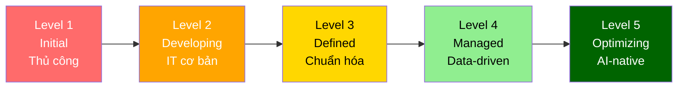
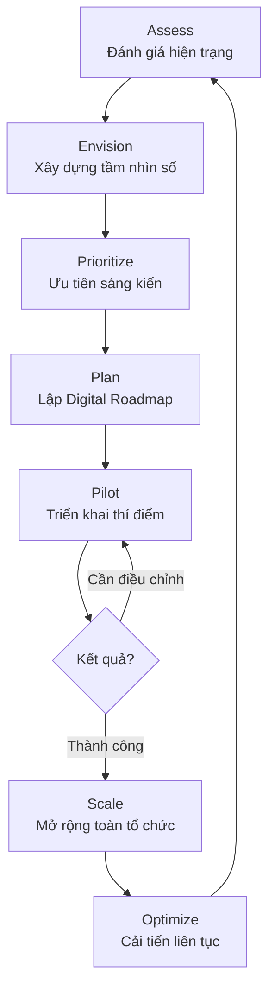
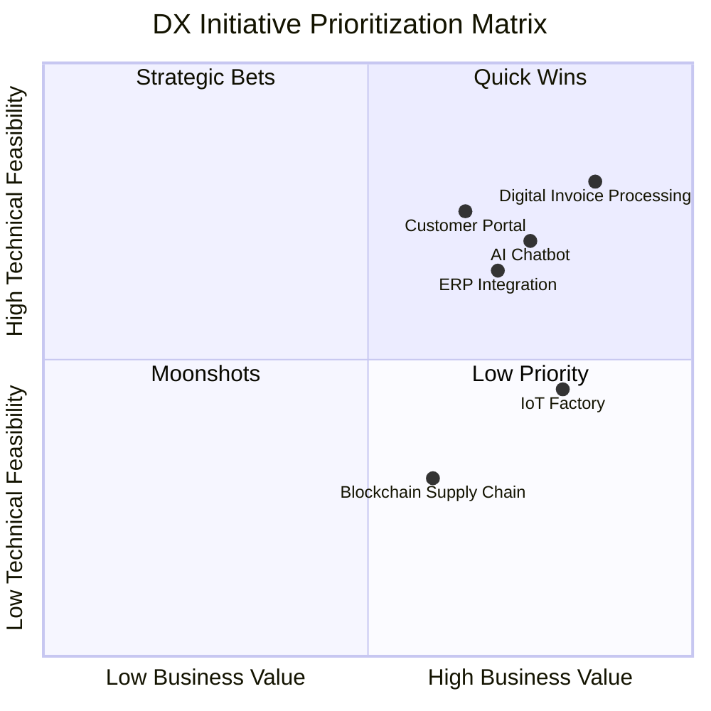

# AI01 — Digital Transformation (Chuyển đổi Số)

> "Digital transformation is not about technology — it is about fundamentally changing how your organization creates value for customers and society." — MIT Sloan Management Review

---

## 1. Learning Objectives (Mục tiêu học tập)

Sau khi hoàn thành module này, người học có thể:

- Định nghĩa chính xác Digital Transformation (DX) và phân biệt với digitization, digitalization
- Áp dụng DX Maturity Model (5 cấp độ) để đánh giá tổ chức
- Xây dựng Digital Roadmap theo 4 chiều: Process, Customer, Business Model, Culture
- Nhận diện và phòng tránh các lỗi DX phổ biến (technology-first, thiếu change management)
- Phân tích bối cảnh DX tại Việt Nam: Chính phủ số, Kinh tế số, các case study FPT/Viettel
- Áp dụng Luật Giao Dịch Điện Tử 2023 vào chiến lược DX
- Tư vấn DX cho doanh nghiệp vừa và nhỏ tại Việt Nam

---

## 2. Business Context (Bối cảnh kinh doanh)

### Tại sao DX quan trọng ngay bây giờ?

Thế giới đang trải qua cuộc cách mạng công nghiệp lần thứ tư (Industry 4.0) với tốc độ thay đổi chưa từng có. Các doanh nghiệp không chuyển đổi số sẽ đối mặt với:

- **Disruption từ Digital-native competitors**: Shopee, Lazada làm khó bán lẻ truyền thống; Momo, ZaloPay thay thế ngân hàng truyền thống; Grab thay thế taxi
- **Thay đổi hành vi khách hàng**: 70% người tiêu dùng VN dưới 35 tuổi, ưu tiên digital-first experience
- **Hiệu quả vận hành**: Chi phí vận hành số thấp hơn 40-60% so với mô hình truyền thống (McKinsey)
- **Dữ liệu như tài sản**: Doanh nghiệp số tạo ra và khai thác dữ liệu để đưa ra quyết định chính xác hơn

### Bối cảnh Việt Nam 2024-2030

- GDP kinh tế số VN đạt ~23% GDP năm 2025 (mục tiêu Chính phủ: 30% vào 2030)
- Việt Nam xếp hạng 86/193 về Chính phủ Điện tử (UN E-Government Survey 2024)
- 78 triệu người dùng internet (2024), 97% sử dụng điện thoại thông minh
- Chương trình "Chuyển đổi số quốc gia" giai đoạn 2021-2025 với ngân sách 52,000 tỷ VNĐ

---

## 3. Definitions (Định nghĩa)

| Thuật ngữ | Tiếng Anh | Định nghĩa |
|-----------|-----------|------------|
| Số hóa dữ liệu | Digitization | Chuyển đổi thông tin từ analog sang digital (scan tài liệu giấy) |
| Số hóa quy trình | Digitalization | Dùng công nghệ số để cải thiện quy trình hiện có (ERP, CRM) |
| Chuyển đổi số | Digital Transformation | Tái cơ cấu toàn diện tổ chức dựa trên công nghệ số, tạo ra mô hình kinh doanh mới |
| Trưởng thành số | Digital Maturity | Mức độ sẵn sàng và năng lực số của tổ chức |
| Kinh tế số | Digital Economy | Nền kinh tế dựa trên nền tảng số, dữ liệu và kết nối internet |
| Lộ trình số | Digital Roadmap | Kế hoạch chiến lược triển khai các sáng kiến số theo thời gian |
| Hệ sinh thái số | Digital Ecosystem | Mạng lưới các tổ chức, đối tác, khách hàng tương tác qua nền tảng số |
| Văn hóa số | Digital Culture | Tư duy, giá trị, hành vi của tổ chức trong môi trường số |

---

## 4. Core Concepts (Khái niệm cốt lõi)

### 4.1 Ba tầng của Digital Transformation

```
Tầng 3: TRANSFORM  → Tái tạo mô hình kinh doanh (Business Model Innovation)
Tầng 2: DIGITALIZE → Số hóa quy trình (Process Optimization)
Tầng 1: DIGITIZE   → Số hóa dữ liệu (Data Digitization)
```

**Lỗi phổ biến**: Nhiều doanh nghiệp VN dừng ở Tầng 1-2 và gọi đó là "chuyển đổi số" thực sự.

### 4.2 Bốn Chiều của Digital Transformation

#### Chiều 1: Process Transformation (Chuyển đổi Quy trình)
- Số hóa và tự động hóa quy trình nội bộ
- Loại bỏ các bước thủ công, giảm thời gian xử lý
- Ví dụ: FPT Software chuyển từ kiểm soát dự án bằng Excel sang Jira + Power BI

#### Chiều 2: Customer Experience Transformation (Chuyển đổi Trải nghiệm KH)
- Omnichannel customer journey
- Personalization dựa trên data
- Ví dụ: Techcombank ra mắt app Techcombank Mobile thay thế 80% giao dịch tại quầy

#### Chiều 3: Business Model Transformation (Chuyển đổi Mô hình KD)
- Platform business model (nền tảng kết nối)
- Subscription/SaaS model
- Data monetization
- Ví dụ: VNG chuyển từ game publisher sang ecosystem (ZaloPay, Zalo, VNG Cloud)

#### Chiều 4: Cultural & Organizational Transformation (Chuyển đổi Văn hóa)
- Agile mindset, experimentation culture
- Data-driven decision making
- Digital leadership development
- Ví dụ: Vinamilk đào tạo 8,000+ nhân viên về tư duy số trong 3 năm

### 4.3 DX Maturity Model (5 Cấp độ)

| Level | Tên | Đặc điểm | Ví dụ VN |
|-------|-----|-----------|---------|
| 1 | Initial (Khởi đầu) | Quy trình thủ công, dữ liệu rải rác, thiếu chiến lược số | SME truyền thống, cửa hàng bán lẻ nhỏ |
| 2 | Developing (Phát triển) | Có một số hệ thống IT, nhưng rời rạc, chưa tích hợp | Công ty có ERP nhưng không khai thác dữ liệu |
| 3 | Defined (Xác định) | Chiến lược DX rõ ràng, quy trình chuẩn hóa, bắt đầu dùng analytics | FPT giai đoạn 2018-2020 |
| 4 | Managed (Quản lý) | Data-driven decisions, tự động hóa rộng rãi, omnichannel | VPBank, MB Bank |
| 5 | Optimizing (Tối ưu) | AI-native, platform business, continuous innovation culture | MoMo, VNG, Grab VN |

### 4.4 Digital Roadmap Framework

**Giai đoạn 1 — Foundation (0-12 tháng)**
- Đánh giá hiện trạng (As-Is Assessment)
- Xây dựng data foundation (data governance, master data)
- Ưu tiên quick wins: số hóa quy trình có ROI cao nhất
- Đầu tư vào cloud infrastructure

**Giai đoạn 2 — Scale (12-36 tháng)**
- Tích hợp hệ thống (ERP-CRM-Analytics)
- Triển khai digital customer channels
- Xây dựng data analytics capabilities
- Change management và digital upskilling

**Giai đoạn 3 — Transform (36-60 tháng)**
- AI/ML integration
- New digital business models
- Platform và ecosystem development
- Continuous innovation culture

### 4.5 Technology Enablers của DX

- **Cloud Computing**: AWS, Azure, Google Cloud — nền tảng cho khả năng mở rộng
- **Big Data & Analytics**: Hadoop, Spark, Power BI, Tableau
- **AI/Machine Learning**: Tự động hóa thông minh, predictive analytics
- **IoT (Internet of Things)**: Kết nối thiết bị vật lý với hệ thống số
- **Blockchain**: Minh bạch, bảo mật giao dịch
- **API Economy**: Tích hợp giữa các hệ thống và đối tác
- **Mobile-first**: Ứng dụng di động như kênh chính

---

## 5. Business Value (Giá trị kinh doanh)

### Giá trị định lượng
- **Tăng doanh thu**: Doanh nghiệp DX Leader tăng doanh thu 23% nhanh hơn (Deloitte)
- **Giảm chi phí vận hành**: 20-30% nhờ tự động hóa (McKinsey)
- **Cải thiện trải nghiệm KH**: NPS tăng 25-30 điểm (Bain & Company)
- **Rút ngắn time-to-market**: 50-60% nhờ agile development

### Giá trị định tính
- Tăng khả năng thích ứng với thay đổi thị trường
- Thu hút và giữ chân nhân tài (nhất là thế hệ Gen Z)
- Xây dựng brand positioning là công ty đổi mới
- Nâng cao năng lực cạnh tranh dài hạn

---

## 6. Enterprise Role (Vai trò trong Doanh nghiệp)

| Vai trò | Trách nhiệm DX |
|---------|---------------|
| CEO/Founder | Sponsor DX, tạo vision, phân bổ ngân sách |
| CDO (Chief Digital Officer) | Lãnh đạo chiến lược DX, điều phối các bộ phận |
| CTO/CIO | Kiến trúc công nghệ, lựa chọn platform, bảo mật |
| CFO | ROI analysis, DX investment approval, financial modeling |
| CMO | Digital marketing, customer experience, omnichannel |
| COO | Process transformation, operational efficiency |
| CHRO | Digital upskilling, change management, culture |

---

## 7. Departments Related (Các phòng ban liên quan)

**Phòng ban chủ chốt:**
- IT/Technology — infrastructure và platforms
- Strategy/Planning — DX roadmap và governance
- Finance — budgeting và ROI tracking

**Phòng ban bị ảnh hưởng trực tiếp:**
- Operations — process automation
- Sales & Marketing — digital channels
- HR — change management, digital skills
- Customer Service — AI chatbots, digital support

**Phòng ban hỗ trợ:**
- Legal/Compliance — digital law, data privacy
- Internal Audit — digital risk management

---

## 8. Input (Đầu vào)

- **Chiến lược kinh doanh tổng thể** (Corporate Strategy)
- **Báo cáo hiện trạng CNTT** (IT Landscape Assessment)
- **Phân tích đối thủ cạnh tranh** (Competitive Intelligence)
- **Phản hồi khách hàng** (Customer Feedback / Journey Mapping)
- **Dữ liệu hiệu quả vận hành** (Operational KPIs, Process Mining data)
- **Ngân sách CNTT và đổi mới** (IT & Innovation Budget)
- **Quy định pháp luật** (Regulatory Requirements — Luật Giao Dịch ĐT, PDPA)

---

## 9. Output (Đầu ra)

- **Chiến lược DX** (Digital Transformation Strategy Document)
- **Digital Roadmap** (3-5 năm, có milestone rõ ràng)
- **Business Case cho từng sáng kiến** (ROI projections)
- **Digital Maturity Assessment Report**
- **Change Management Plan**
- **KPI Dashboard** (tracking DX progress)
- **Architecture Blueprint** (Target IT Architecture)
- **Báo cáo tiến độ DX** (Quarterly DX Progress Report)

---

## 10. Business Process (Quy trình kinh doanh)

### Quy trình DX End-to-End

```
Bước 1: ASSESS      → Đánh giá hiện trạng (As-Is Analysis)
         ↓
Bước 2: ENVISION    → Xác định tầm nhìn số (Digital Vision & Goals)
         ↓
Bước 3: PRIORITIZE  → Lựa chọn sáng kiến (Initiative Prioritization)
         ↓
Bước 4: PLAN        → Lập lộ trình (Digital Roadmap & Business Case)
         ↓
Bước 5: PILOT       → Triển khai thí điểm (Proof of Concept)
         ↓
Bước 6: SCALE       → Mở rộng toàn tổ chức (Scale & Integrate)
         ↓
Bước 7: OPTIMIZE    → Cải tiến liên tục (Monitor, Learn, Improve)
```

---

## 11. Data Flow (Luồng dữ liệu)

```
Data Sources:
├── ERP (SAP/Oracle) → Operational data
├── CRM (Salesforce/HubSpot) → Customer data
├── IoT Sensors → Real-time operational data
├── Web/Mobile → Digital behavior data
├── Social Media → Customer sentiment data
└── External APIs → Market & partner data

Data Processing:
├── ETL/ELT Pipeline (AWS Glue, Azure Data Factory)
├── Data Warehouse (Snowflake, BigQuery, Redshift)
└── Data Lake (S3, Azure Data Lake)

Analytics & AI:
├── Descriptive Analytics → Báo cáo hiện tại
├── Predictive Analytics → Dự báo tương lai
└── Prescriptive Analytics → Tự động đề xuất hành động

Consumption:
├── Dashboards (Power BI, Tableau)
├── AI Applications
└── Business Decisions
```

---

## 12. Money Flow (Luồng tiền)

### DX Investment Categories

| Hạng mục | % Ngân sách DX | Ví dụ |
|----------|---------------|-------|
| Technology Platform & Licenses | 35-45% | Cloud, ERP, CRM, Analytics |
| Implementation & Integration | 25-30% | Tư vấn, triển khai, tích hợp |
| People & Change Management | 15-20% | Training, change champions, culture |
| Data & Content | 10-15% | Data migration, content creation |
| Innovation & R&D | 5-10% | POC, labs, experimentation |

### DX ROI Framework
- **Direct ROI**: Cost savings from automation, revenue from new digital channels
- **Indirect ROI**: Customer lifetime value increase, employee productivity, reduced churn
- **Strategic ROI**: Market position, resilience, future-readiness (khó đo nhưng quan trọng)

---

## 13. Document Flow (Luồng tài liệu)

```
Executive Level:
├── DX Vision Statement (CEO sign-off)
├── DX Strategy Document (Board approved)
└── Annual DX Investment Budget

Management Level:
├── Digital Roadmap (CDO managed)
├── Program Charter per Initiative
├── Quarterly Business Review (QBR) - DX section
└── Risk Register (DX-specific risks)

Operational Level:
├── Project Plans per workstream
├── Change Management Plans
├── Training Materials
└── KPI Tracking Sheets

Compliance Level:
├── Data Privacy Impact Assessment
├── IT Security Reviews
└── Regulatory Compliance Checklist
```

---

## 14. Roles (Vai trò)

| Vai trò | Mô tả |
|---------|-------|
| Chief Digital Officer (CDO) | Chịu trách nhiệm toàn bộ chiến lược và thực thi DX |
| Digital Transformation Manager | Điều phối các workstreams, track progress |
| Business Analyst (BA) | Phân tích quy trình hiện tại, xác định cơ hội số hóa |
| Change Management Lead | Quản lý tác động đến con người và văn hóa |
| Solution Architect | Thiết kế kiến trúc công nghệ cho DX |
| Data Scientist/Engineer | Xây dựng analytics và AI capabilities |
| Agile Coach | Hỗ trợ chuyển đổi sang agile working |
| Digital Champion | Đại sứ DX tại từng bộ phận (không chuyên trách) |

---

## 15. Responsibilities (Trách nhiệm)

**CEO**: Sponsor DX, phê duyệt ngân sách, truyền thông vision tới toàn tổ chức

**CDO/CIO**: Lãnh đạo kỹ thuật, chọn technology stack, đảm bảo cybersecurity

**Business Leaders**: Xác định ưu tiên theo nhu cầu kinh doanh, phân bổ nguồn lực từ bộ phận, đảm bảo adoption

**Project Managers**: Delivery theo timeline, quản lý rủi ro, báo cáo tiến độ

**End Users**: Tham gia training, phản hồi về sản phẩm, chấp nhận thay đổi

---

## 16. RACI Matrix

| Hoạt động | CEO | CDO | BU Leaders | IT | HR | Finance |
|-----------|-----|-----|-----------|----|----|---------|
| DX Vision & Strategy | A | R | C | C | I | C |
| Technology Architecture | I | A | C | R | I | C |
| Initiative Prioritization | A | R | R | C | I | C |
| Change Management | I | A | R | I | R | I |
| Budget Allocation | A | R | C | C | I | C |
| KPI Monitoring | I | A | R | C | I | R |

*R=Responsible, A=Accountable, C=Consulted, I=Informed*

---

## 17. Frameworks (Khung tham chiếu)

### McKinsey 5A Framework for DX
1. **Aspire**: Đặt mục tiêu đầy tham vọng, customer-centric
2. **Assess**: Đánh giá năng lực số hiện tại và gaps
3. **Architect**: Thiết kế IT architecture và operating model
4. **Act**: Thực thi theo roadmap, agile sprints
5. **Advance**: Scale và build long-term digital muscle

### Deloitte Digital Maturity Framework
- 5 chiều đánh giá: Customer, Strategy, Technology, Operations, Organization & Culture
- Benchmarking với industry peers

### MIT CISR Digital Matrix
- 2 trục: Content value (Knowledge vs. Service) và Connectedness (Ecosystem vs. Standalone)
- 4 quadrants: Supplier, Omnichannel, Ecosystem Driver, Modular Producer

### Gartner Digital Business Framework
- Business Moment Exploitation
- Digital Dexterity (tốc độ phản ứng với cơ hội số)

---

## 18. International Standards (Tiêu chuẩn quốc tế)

| Tiêu chuẩn | Áp dụng trong DX |
|------------|-----------------|
| ISO 27001 | Information Security Management — bắt buộc khi số hóa dữ liệu nhạy cảm |
| ISO 22301 | Business Continuity — đảm bảo hệ thống số không gián đoạn |
| COBIT 2019 | IT Governance Framework — quản trị CNTT trong DX |
| TOGAF | Enterprise Architecture — thiết kế kiến trúc tổng thể |
| ITIL 4 | IT Service Management — vận hành dịch vụ số |
| ISO 31000 | Risk Management — quản lý rủi ro DX |
| GDPR (EU) | Data Privacy — áp dụng nếu có khách hàng EU |

---

## 19. Vietnam Context (Bối cảnh Việt Nam)

### Chính sách số của Chính phủ VN

**Chương trình Chuyển đổi số Quốc gia (Quyết định 749/QĐ-TTg 2020)**
- Mục tiêu: VN thuộc nhóm 50 quốc gia dẫn đầu về Chính phủ điện tử (2025)
- Kinh tế số chiếm 20% GDP vào 2025, 30% vào 2030
- Ba trụ cột: Chính phủ số, Kinh tế số, Xã hội số

**Cổng Dịch vụ công Quốc gia (dichvucong.gov.vn)**
- Hơn 4,000 dịch vụ công trực tuyến (2024)
- Tích hợp căn cước công dân, BHXH, thuế

**Case Studies nổi bật:**

| Doanh nghiệp | DX Initiative | Kết quả |
|--------------|--------------|---------|
| FPT Digital | Xây dựng FPT Digital Platform, DX cho 1,000+ doanh nghiệp VN | Doanh thu DX segment tăng 40%/năm |
| Viettel | Viettel DX: chuyển từ telecom sang tech company, ra mắt Viettel Cloud | Tiết kiệm 2,000 tỷ VNĐ/năm chi phí vận hành |
| Techcombank | Fully digital bank, 90% giao dịch qua mobile | NPS tăng 40 điểm, chi phí/giao dịch giảm 70% |
| VinFast | Smart factory, Industry 4.0 tại nhà máy Hải Phòng | Năng suất tăng 35%, lỗi sản xuất giảm 60% |
| MoMo | Super app từ payment → financial ecosystem | 31M+ users, GMV $14B+ (2024) |

### Thách thức DX đặc thù tại VN
- **Khoảng cách số giữa đô thị-nông thôn**: 67% population rural, internet penetration thấp hơn
- **Thiếu nhân tài số**: 500,000 kỹ sư IT cần bổ sung đến 2030 (Bộ TTTT)
- **Văn hóa ngại thay đổi**: "Đã quen làm vậy rồi" — resistance to change cao
- **Vấn đề tài chính**: SME khó tiếp cận vốn đầu tư DX (70% SME không có DX budget)
- **Bảo mật thông tin**: Năng lực cybersecurity còn yếu ở nhiều tổ chức

---

## 20. Legal Considerations (Khía cạnh pháp lý)

### Luật Giao Dịch Điện Tử 2023 (Số 20/2023/QH15)

**Điểm mới quan trọng:**
- Mở rộng phạm vi: áp dụng cho tất cả giao dịch điện tử kể cả giữa cá nhân
- Chữ ký điện tử: công nhận 3 loại (cơ bản, nâng cao, chứng thực)
- Hợp đồng điện tử: có giá trị pháp lý tương đương văn bản giấy
- Dữ liệu điện tử: quy định về lưu trữ, bảo mật, và xác thực

**Tác động đến DX:**
- Doanh nghiệp có thể số hóa hoàn toàn quy trình hợp đồng, phê duyệt
- Không cần chữ ký tay và con dấu cho hầu hết giao dịch nội bộ
- Phải đảm bảo hệ thống đáp ứng yêu cầu lưu trữ tối thiểu 5-10 năm

### Các quy định liên quan
- **Nghị định 13/2023/NĐ-CP**: Bảo vệ dữ liệu cá nhân (PDPD)
- **Luật An ninh mạng 2018**: Quy định về lưu trữ dữ liệu trong nước, kiểm soát nội dung
- **Luật Công nghệ thông tin 2006** (sửa đổi): Quy định về giao dịch CNTT
- **Thông tư 09/2020/TT-NHNN**: Quy định về Open Banking cho ngân hàng

---

## 21. Common Mistakes (Sai lầm phổ biến)

### 7 Sai lầm DX chết người

**1. Technology-First Thinking (Ưu tiên công nghệ hơn giá trị kinh doanh)**
- Vấn đề: Mua ERP đắt tiền nhưng không giải quyết vấn đề thực sự của business
- Giải pháp: Bắt đầu từ customer problem, sau đó mới chọn technology

**2. Thiếu Change Management**
- Vấn đề: Triển khai hệ thống mới nhưng nhân viên không dùng (resistance to change)
- Thống kê: 70% DX projects thất bại do yếu tố con người (McKinsey)
- Giải pháp: Change management chiếm ít nhất 15-20% ngân sách DX

**3. Siloed Approach (Chuyển đổi từng mảng riêng lẻ)**
- Vấn đề: IT số hóa nhưng Sales vẫn làm theo kiểu cũ → customer experience không nhất quán
- Giải pháp: Cross-functional DX team, unified customer view

**4. Big Bang Implementation**
- Vấn đề: Triển khai toàn bộ cùng lúc → rủi ro cao, disruption lớn
- Giải pháp: Pilot → Scale, agile sprints, phased rollout

**5. Thiếu Data Strategy**
- Vấn đề: Số hóa quy trình nhưng không tổ chức dữ liệu → insights không có giá trị
- Giải pháp: Data governance trước khi DX

**6. Underestimating Cybersecurity**
- Vấn đề: Số hóa tăng attack surface, nhiều doanh nghiệp VN bị ransomware sau khi "digital"
- Giải pháp: Security by design, ISO 27001

**7. No Customer Involvement**
- Vấn đề: Xây portal khách hàng nhưng UX xấu → không ai dùng
- Giải pháp: Design thinking, user research, co-creation với khách hàng

---

## 22. Best Practices (Thực hành tốt nhất)

1. **Start with Strategy, Not Technology**: CEO phải sponsor DX, align với business strategy
2. **Customer-Centric Design**: Mọi sáng kiến số phải bắt đầu từ customer journey mapping
3. **Build Data Foundation First**: Clean, integrated, governed data là nền tảng của mọi thứ
4. **Pilot before Scale**: POC nhỏ, học nhanh, scale những gì hiệu quả
5. **Invest in People**: Digital upskilling, hire digital talent, build digital culture
6. **Agile Delivery**: Không waterfall trong DX, iterate nhanh
7. **Measure Everything**: KPIs rõ ràng cho mỗi sáng kiến, track liên tục
8. **Partner Ecosystem**: Không tự làm tất cả — leverage fintech, SaaS, system integrators
9. **Governance & Risk**: Cybersecurity, data privacy, compliance từ đầu
10. **Celebrate Quick Wins**: Tạo momentum, chống lại sự hoài nghi của tổ chức

---

## 23. KPIs (Chỉ số đánh giá)

### DX Progress KPIs

| Nhóm | KPI | Target điển hình |
|------|-----|-----------------|
| Digital Revenue | % doanh thu từ kênh số | >30% (B2C), >20% (B2B) |
| Customer Digital Adoption | % khách hàng dùng digital channels | >60% |
| Process Efficiency | Tỷ lệ quy trình được tự động hóa | >40% |
| Data Quality | % data records có chất lượng tốt | >85% |
| Employee Digital Skills | % nhân viên đạt digital literacy | >70% |
| Time to Market | Thời gian triển khai sản phẩm mới | Giảm 50% |
| Customer Experience | NPS Score | Tăng 20+ điểm |
| Cost Efficiency | IT cost as % revenue | Giảm 15-20% |

---

## 24. Metrics (Chỉ số đo lường)

**Operational Metrics (đo hàng tháng)**
- Số lượng quy trình đã số hóa / tổng số quy trình
- Uptime của hệ thống số (>99.9%)
- Số giao dịch kỹ thuật số / tổng giao dịch
- Cost per digital transaction vs. manual transaction

**Strategic Metrics (đo hàng quý)**
- Digital Revenue Growth Rate
- Customer Lifetime Value (digital vs. traditional customers)
- Digital Talent Ratio (% nhân viên trong digital roles)
- Innovation velocity (số POC per quarter)

**Financial Metrics (đo hàng năm)**
- DX ROI (Return on DX Investment)
- Total Cost of Ownership của digital platforms
- DX budget utilization rate

---

## 25. Reports (Báo cáo)

| Báo cáo | Tần suất | Audience | Nội dung chính |
|---------|----------|----------|---------------|
| DX Dashboard | Weekly | CDO, IT Lead | KPI tracking, issues, milestones |
| DX Progress Report | Monthly | C-Suite | Initiative status, budget burn, risks |
| DX Business Review | Quarterly | Board | Strategic progress, ROI, next quarter plan |
| DX Maturity Assessment | Annually | CEO, Board | Maturity level changes, benchmarking |
| Technology Landscape Report | Semi-annually | CTO, Architecture | Tech stack health, upgrade needs |

---

## 26. Templates (Mẫu biểu)

### Template 1: DX Initiative Business Case
```
1. Problem Statement
2. Proposed Digital Solution
3. Stakeholders Affected
4. Investment Required (One-time + Recurring)
5. Expected Benefits (Quantified)
6. ROI Timeline
7. Key Risks & Mitigations
8. Success Metrics
9. Implementation Timeline
10. Approval Required From
```

### Template 2: Digital Maturity Assessment
```
Dimension 1: Customer Experience    [Score 1-5]
Dimension 2: Strategy & Leadership  [Score 1-5]
Dimension 3: Technology             [Score 1-5]
Dimension 4: Data & Analytics       [Score 1-5]
Dimension 5: Operations & Processes [Score 1-5]
Dimension 6: People & Culture       [Score 1-5]
Overall Maturity Score: [Average]
```

---

## 27. Checklists (Danh sách kiểm tra)

### DX Readiness Checklist

**Lãnh đạo & Chiến lược**
- [ ] CEO cam kết là DX sponsor chính thức
- [ ] DX Strategy được Board phê duyệt
- [ ] CDO hoặc DX Lead được bổ nhiệm
- [ ] Ngân sách DX được phê duyệt (ít nhất 3-5 năm)

**Công nghệ**
- [ ] Đánh giá hiện trạng IT architecture hoàn thành
- [ ] Cloud strategy xác định (public/private/hybrid)
- [ ] Cybersecurity baseline assessment hoàn thành
- [ ] Data governance policy ban hành

**Con người**
- [ ] Digital skills gap analysis hoàn thành
- [ ] Change management plan có sẵn
- [ ] Digital champions network thành lập
- [ ] Training program thiết kế xong

**Quy trình**
- [ ] As-Is process mapping hoàn thành
- [ ] Quick win opportunities xác định
- [ ] Process mining (nếu có) đã chạy
- [ ] Pilot scope xác định

---

## 28. SOP (Quy trình chuẩn)

### SOP-DX-001: Đánh giá Sáng kiến DX

**Mục đích**: Đánh giá và ưu tiên các sáng kiến số để đưa vào Digital Roadmap

**Quy trình**:
1. Business unit đề xuất sáng kiến qua Digital Initiative Template
2. DX team thu thập thêm thông tin (process pain points, expected benefits)
3. Chấm điểm theo ma trận: Business Value (40%) + Technical Feasibility (30%) + Strategic Fit (30%)
4. Ưu tiên theo portfolio: Quick Wins / Strategic Bets / Moonshots
5. CDO phê duyệt các sáng kiến vào roadmap
6. Phân bổ nguồn lực và timeline

**Tiêu chí chấm điểm Business Value (1-5)**:
- 5: ROI >200%, payback <1 năm, impact >50% khách hàng
- 3: ROI 50-200%, payback 1-3 năm, impact 20-50% khách hàng
- 1: ROI <50%, payback >3 năm, impact <20% khách hàng

---

## 29. Case Study (Tình huống thực tế)

### Case Study 1: FPT Corporation — DX từ trong ra ngoài

**Bối cảnh**: FPT — tập đoàn công nghệ lớn nhất VN, 45,000 nhân viên, doanh thu $1.8B

**Thách thức năm 2017**: FPT chủ yếu là IT outsourcing, biên lợi nhuận thấp (8-10%), bị đe dọa bởi automation và nearshore competition từ các nước

**DX Strategy của FPT**:
1. **Internal DX First**: Số hóa toàn bộ quy trình nội bộ (HR, Finance, Project Management)
2. **Build Digital Products**: Chuyển từ services sang products (akaBot — RPA platform)
3. **DX Advisory**: Thành lập FPT Digital — đơn vị tư vấn DX cho khách hàng
4. **Global Expansion**: Mở rộng DX services sang Nhật, châu Âu, Mỹ

**Kết quả (2017-2024)**:
- Doanh thu tăng 3x từ $600M (2017) → $1.8B (2024)
- Digital revenue tăng từ 15% → 45% tổng doanh thu
- Biên lợi nhuận tăng từ 8% → 13%
- akaBot RPA platform: 500+ doanh nghiệp khách hàng

**Bài học**: DX cho chính mình trước, sau đó bán kinh nghiệm cho người khác

---

### Case Study 2: Viettel — Telecom sang Tech Company

**Bối cảnh**: Viettel — tập đoàn viễn thông nhà nước, doanh thu $4B, 60,000 nhân viên

**DX Journey (2018-2025)**:
- **2018-2020**: Chuyển đổi hạ tầng lên cloud (Viettel Cloud), số hóa quy trình nội bộ
- **2021-2022**: Ra mắt Viettel Money (nay là ViettelPay), Viettel Smart City
- **2023-2025**: AI integration vào mạng lưới, Viettel Digital Government Platform

**Impact**:
- Tiết kiệm 2,000 tỷ VNĐ/năm chi phí vận hành
- ViettelPay đạt 10M+ users, giao dịch $3B+ GMV
- Viettel Cloud — top 3 cloud provider tại VN

---

## 30. Small Business Example (Ví dụ Doanh nghiệp nhỏ)

### Chuỗi nhà hàng ABC — 5 chi nhánh tại TP.HCM

**Trước DX (2022)**:
- Đặt bàn qua điện thoại, ghi tay
- Menu in ấn, thay đổi mất 1 tuần và tốn 3 triệu/lần
- Kế toán Excel, báo cáo cuối tháng mất 3 ngày
- Không có data về khách hàng

**DX từng bước (2022-2024)**:
- **Bước 1** (3 triệu VNĐ): Dùng ứng dụng quản lý nhà hàng (Sapo, KiotViet) — POS, inventory, order tracking
- **Bước 2** (2 triệu VNĐ/tháng): Tích hợp GrabFood, ShopeeFood, Baemin → tăng doanh thu 30%
- **Bước 3** (5 triệu VNĐ/tháng): Zalo Official Account + loyalty program → 5,000 khách hàng thân thiết
- **Bước 4** (10 triệu VNĐ/tháng): Facebook/Instagram ads với retargeting → CAC giảm 40%

**Kết quả sau 2 năm**:
- Doanh thu tăng 55%
- Chi phí nhân sự văn phòng giảm 1 người (~10 triệu/tháng)
- Đặt bàn online chiếm 60% tổng đặt chỗ
- Lần đầu có data insight về best-selling dishes, peak hours

---

## 31. Enterprise Example (Ví dụ Doanh nghiệp lớn)

### Masan Group — DX cho Chuỗi cung ứng

**Bối cảnh**: Masan Group — tập đoàn tiêu dùng F&B lớn nhất VN (WinMart, Vinamilk partnership, Masan MEATLife)

**DX Initiative: WinCommerce Digital**
- **Phase 1**: Số hóa 2,500+ cửa hàng WinMart — POS, inventory, supply chain tracking
- **Phase 2**: WinMart+ App với personalized promotions, loyalty points (20M users)
- **Phase 3**: AI-powered demand forecasting — giảm stockout 35%, giảm waste 28%
- **Phase 4**: Digital supplier portal — 500 nhà cung cấp kết nối real-time

**Investment**: ~$200M USD trong 3 năm (2021-2024)

**ROI**:
- Inventory turnover tăng 40%
- Logistics cost giảm 18%
- Customer repeat purchase rate tăng 25%
- Gross margin tăng 3 điểm phần trăm

---

## 32. ERP Mapping (Liên kết ERP)

| DX Domain | ERP Module | Hệ thống phổ biến tại VN |
|-----------|-----------|--------------------------|
| Finance DX | Finance & Controlling (FI/CO) | SAP S/4HANA, Oracle ERP |
| Supply Chain DX | Materials Management, SCM | SAP MM, Oracle SCM |
| Manufacturing DX | Production Planning, MES | SAP PP, Siemens MES |
| Sales DX | Sales & Distribution, CRM | SAP SD, Salesforce |
| HR DX | Human Capital Management | SAP HCM, SuccessFactors |
| Customer DX | Customer Experience | SAP CX, Microsoft Dynamics |
| Analytics DX | Business Intelligence | SAP Analytics Cloud, Power BI |

---

## 33. Automation Opportunities (Cơ hội tự động hóa)

| Quy trình | Automation Type | Tool gợi ý | ROI ước tính |
|-----------|----------------|-----------|-------------|
| Xử lý hóa đơn nhà cung cấp | RPA + OCR | UiPath + ABBYY | 60-70% cost reduction |
| Báo cáo tài chính tháng | RPA + BI | Power Automate + Power BI | 3 ngày → 4 giờ |
| Customer onboarding | Workflow automation + eSign | Salesforce Flow + DocuSign | 5 ngày → 1 ngày |
| IT ticket routing | AI classification | ServiceNow + AI | 40% fewer escalations |
| HR onboarding | Workflow automation | SAP SuccessFactors | 10 ngày → 2 ngày |
| Inventory replenishment | AI-driven auto-ordering | SAP IBP | Giảm stockout 40% |

---

## 34. AI Opportunities (Cơ hội AI)

| Ứng dụng AI | Vấn đề giải quyết | Công nghệ | Độ chín thị trường VN |
|------------|-------------------|-----------|----------------------|
| AI Chatbot hỗ trợ khách hàng | Giảm chi phí customer service | LLM + RAG | Cao (nhiều doanh nghiệp đang dùng) |
| Predictive maintenance | Tránh máy móc hỏng đột ngột | IoT + ML | Trung bình (manufacturing) |
| Demand forecasting | Tối ưu tồn kho | ML (LSTM, XGBoost) | Cao (retail, FMCG) |
| Fraud detection | Phát hiện gian lận thanh toán | ML (anomaly detection) | Cao (ngân hàng, fintech) |
| Personalization | Tăng conversion rate | Recommendation system | Trung bình-Cao (ecommerce) |
| Document processing | Tự động hóa xử lý tài liệu | OCR + NLP | Đang tăng nhanh |
| Churn prediction | Giữ chân khách hàng | ML classification | Trung bình |

---

## 35. Implementation Guide (Hướng dẫn triển khai)

### 100-Day DX Kickstart Plan

**Days 1-30: Assessment & Foundation**
- Tuần 1: Bổ nhiệm CDO/DX Lead, thành lập DX Steering Committee
- Tuần 2-3: Chạy Digital Maturity Assessment (dùng template mục 26)
- Tuần 4: Xác định Top 5 Digital Priorities dựa trên assessment

**Days 31-60: Strategy & Planning**
- Tuần 5-6: Workshop với C-Suite để xây dựng DX Vision
- Tuần 7-8: Lập Digital Roadmap 3 năm
- Tuần 8: Phê duyệt ngân sách và resource allocation

**Days 61-90: Pilot Launch**
- Tuần 9-10: Kick off 2-3 Quick Win projects
- Tuần 11-12: Thành lập Digital Champions network (1-2 người/bộ phận)
- Tuần 12: Change Management training cho managers

**Days 91-100: Review & Scale**
- Review kết quả pilots
- Communication campaign về DX wins
- Planning for next 90 days

---

## 36. Consulting Guide (Hướng dẫn tư vấn)

### DX Consulting Engagement Model

**Phase 1: Diagnostic (2-4 tuần)**
- Digital Maturity Assessment
- Stakeholder interviews (C-Suite, BU heads, IT)
- Process observation and pain point mapping
- Competitive benchmark
- Deliverable: DX Diagnostic Report

**Phase 2: Strategy (4-6 tuần)**
- DX Vision & Goals workshop
- Initiative identification và business case
- Technology assessment (build/buy/partner)
- Roadmap development
- Deliverable: DX Strategy & Roadmap

**Phase 3: Implementation Support (6-18 tháng)**
- PMO setup và governance
- Vendor selection support
- Change management advisory
- Progress tracking và course correction
- Deliverable: Monthly progress reports, quarterly reviews

**Fee Range tại VN (2024)**:
- SME DX Consulting: 200-500 triệu VNĐ/engagement
- Enterprise DX Program: 2-10 tỷ VNĐ/năm
- Top-tier consulting (McKinsey, BCG, Deloitte): $500K-$2M USD

---

## 37. Diagnostic Questions (Câu hỏi chẩn đoán)

**Lãnh đạo & Chiến lược**
1. Bạn có Chief Digital Officer hoặc người tương đương không?
2. DX có trong top 3 ưu tiên chiến lược của công ty không?
3. CEO có dành >10% thời gian cho các sáng kiến số không?

**Công nghệ**
4. Tỷ lệ quy trình kinh doanh được tự động hóa là bao nhiêu?
5. Bạn có một nguồn dữ liệu khách hàng duy nhất (Single Customer View) không?
6. Thời gian để deploy một tính năng mới mất bao lâu?

**Văn hóa & Con người**
7. Nhân viên có được khuyến khích thử nghiệm và chấp nhận thất bại không?
8. Tỷ lệ nhân viên dùng công cụ digital daily là bao nhiêu?
9. Công ty có chương trình digital upskilling không?

**Khách hàng**
10. Bao nhiêu % khách hàng tương tác qua kênh digital?
11. Bạn có đo customer journey across channels không?
12. Time to resolve customer complaint trung bình là bao lâu?

---

## 38. Interview Questions (Câu hỏi phỏng vấn)

**Phỏng vấn CDO/DX Lead:**
- "Bạn đã từng dẫn dắt một DX initiative thất bại không? Bài học là gì?"
- "Làm thế nào để bạn balance giữa quick wins và long-term transformation?"
- "Kể về một lần bạn thuyết phục thành công một CEO khó tính về DX investment?"
- "Bạn đánh giá DX success như thế nào? KPIs của bạn là gì?"

**Phỏng vấn Digital Business Analyst:**
- "Mô tả quy trình bạn dùng để xác định automation opportunities?"
- "Bạn đã làm Customer Journey Mapping chưa? Kể về một experience?"
- "Khi một project DX bị resistance từ user, bạn xử lý thế nào?"

---

## 39. Exercises (Bài tập)

### Bài tập 1: Digital Maturity Self-Assessment
Đánh giá công ty bạn (hoặc một công ty bạn biết) theo DX Maturity Model (mục 4.3):
- Chấm điểm từng chiều (1-5)
- Xác định 3 điểm yếu nhất cần cải thiện
- Đề xuất 3 quick wins cụ thể

### Bài tập 2: DX Initiative Business Case
Chọn 1 quy trình thủ công trong công ty và viết Business Case để số hóa nó:
- Mô tả quy trình hiện tại (As-Is)
- Đề xuất giải pháp số (To-Be)
- Tính ROI: Investment, savings, payback period
- Xác định rủi ro và biện pháp giảm thiểu

### Bài tập 3: Digital Roadmap cho SME
Một công ty sản xuất nhỏ (50 nhân viên, doanh thu 20 tỷ VNĐ) muốn chuyển đổi số:
- Lập Digital Roadmap 3 năm
- Ngân sách giới hạn: 500 triệu VNĐ/năm
- Ưu tiên hóa các sáng kiến theo giá trị kinh doanh

---

## 40. References (Tài liệu tham khảo)

**Sách**
- "Leading Digital" — George Westerman, Didier Bonnet, Andrew McAfee (MIT Sloan)
- "The Digital Matrix" — Venkat Venkatraman (UBC Sauder)
- "Competing in the Age of AI" — Marco Iansiti & Karim Lakhani (Harvard Business School)

**Báo cáo & Framework**
- McKinsey Digital: "The digital-led recovery" (2023)
- Deloitte Digital Maturity Model (2023 edition)
- Gartner: "Top Strategic Technology Trends" (2024-2025)
- IDC: "Asia/Pacific Digital Transformation"

**Nguồn VN**
- Bộ TTTT: "Báo cáo Chuyển đổi số Quốc gia" (cập nhật hàng năm)
- VINASA: Báo cáo ngành CNTT VN
- FPT Digital: "DX Report Vietnam 2024"
- Viettel Consulting: "Chuyển đổi số dành cho SME Việt Nam"

**Khóa học online**
- Coursera: "Digital Transformation" — University of Virginia Darden
- MIT xPRO: "Digital Transformation: Platform Strategies for Success"
- LinkedIn Learning: "Digital Transformation Foundations"

---

## Output Formats

### Mermaid Diagram — DX Maturity Journey







---

### Flashcards (Thẻ học)

**Thẻ 1**
- **Q**: Sự khác biệt giữa Digitization, Digitalization và Digital Transformation là gì?
- **A**: Digitization = chuyển dữ liệu từ giấy sang digital (scan). Digitalization = dùng công nghệ số để cải thiện quy trình cũ (ERP). Digital Transformation = tái cơ cấu toàn diện tổ chức, tạo ra mô hình kinh doanh và cách tạo giá trị mới hoàn toàn.

**Thẻ 2**
- **Q**: Tại sao 70% dự án DX thất bại? Yếu tố nào quan trọng nhất?
- **A**: Theo McKinsey, nguyên nhân chính là yếu tố con người (people) và văn hóa (culture), không phải công nghệ. Thiếu sự đồng thuận từ lãnh đạo, thiếu change management, nhân viên kháng cự thay đổi — đây là ba nguyên nhân hàng đầu.

**Thẻ 3**
- **Q**: Đánh giá DX Maturity Level 3 (Defined) theo tiêu chí nào?
- **A**: Level 3 — Defined: (1) Chiến lược DX được văn bản hóa và CEO phê duyệt, (2) Quy trình kinh doanh cốt lõi được chuẩn hóa và số hóa, (3) Có Data Warehouse và báo cáo analytics cơ bản, (4) Digital team riêng biệt, (5) Đã triển khai ít nhất 1 kênh digital cho khách hàng.

---

### JSON Metadata

```json
{
  "module": {
    "code": "AI01",
    "name": "Digital Transformation",
    "domain": "AI & Digital",
    "version": "1.0",
    "updated": "2026-06-30",
    "status": "complete",
    "language": "Vietnamese",
    "technical_terms": "English"
  },
  "content": {
    "total_sections": 40,
    "frameworks": ["McKinsey 5A", "Deloitte Digital Maturity", "MIT CISR Digital Matrix", "Gartner Digital Business"],
    "standards": ["ISO 27001", "ISO 22301", "COBIT 2019", "TOGAF", "ITIL 4"],
    "maturity_levels": 5,
    "dx_dimensions": ["Process", "Customer Experience", "Business Model", "Culture & Organization"],
    "case_studies": ["FPT Corporation", "Viettel", "Masan Group", "Techcombank", "VinFast"]
  },
  "vietnam_context": {
    "legal_framework": ["Luật Giao Dịch Điện Tử 2023", "Nghị định 13/2023 PDPD", "Luật An ninh mạng 2018"],
    "government_programs": ["Chương trình CĐS Quốc gia QĐ749/2020", "Chính phủ số", "Kinh tế số"],
    "key_companies": ["FPT", "Viettel", "MoMo", "Techcombank", "VNG", "Masan", "Vinamilk"],
    "market_stats": {
      "internet_users": "78 triệu (2024)",
      "digital_economy_gdp_target_2030": "30%",
      "it_talent_gap_2030": "500,000 kỹ sư"
    }
  },
  "learning": {
    "level": "Intermediate to Advanced",
    "estimated_study_time": "8-10 giờ",
    "prerequisites": ["Kiến thức kinh doanh cơ bản", "IT literacy"],
    "target_audience": ["CEO/CXO", "CDO candidates", "Business consultants", "IT leaders", "MBA students"]
  },
  "tags": ["digital-transformation", "dx", "strategy", "innovation", "technology", "change-management", "vietnam", "enterprise"]
}
```

---

*Module AI01 — Digital Transformation | Business Operating System Handbook | v1.0 | 2026-06-30*
