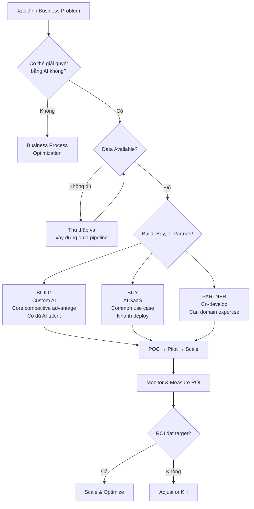
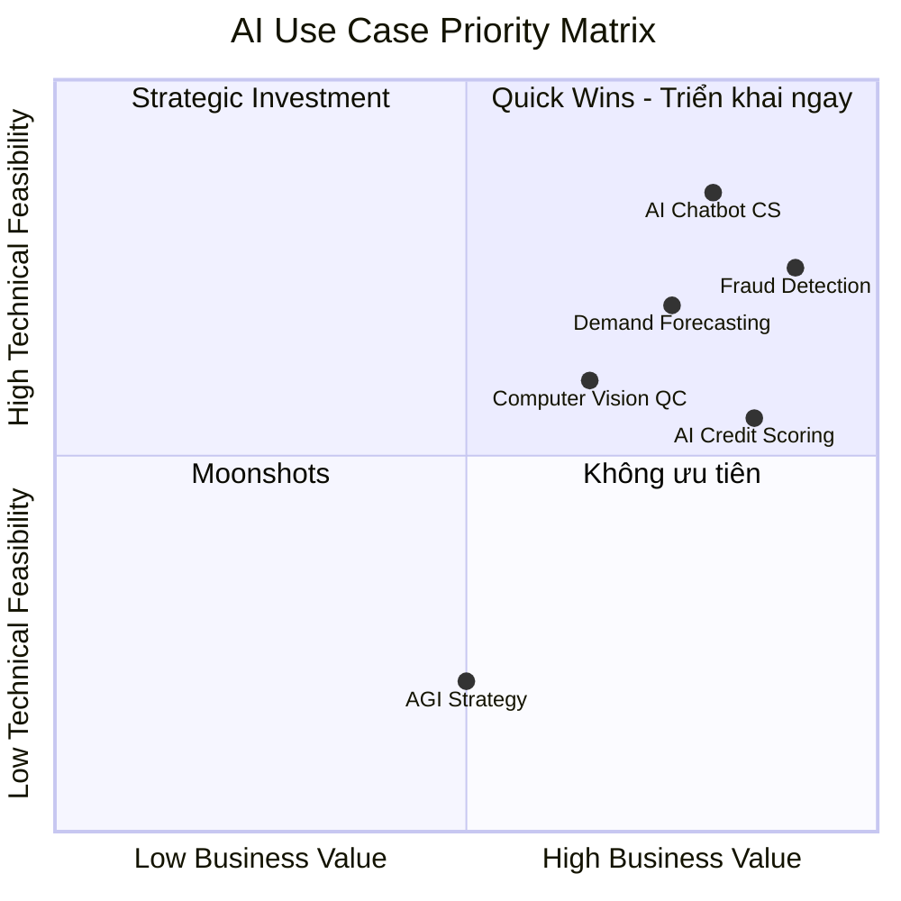

# AI02 — AI for Business (Trí tuệ nhân tạo trong Kinh doanh)

> "AI is not going to replace managers, but managers who use AI will replace managers who don't." — Harvard Business Review, 2024

---

## 1. Learning Objectives (Mục tiêu học tập)

Sau khi hoàn thành module này, người học có thể:

- Phân loại AI theo taxonomy: ML, Deep Learning, NLP, Computer Vision, Generative AI
- Xác định AI use cases phù hợp theo từng chức năng kinh doanh
- Phân tích quyết định Build vs Buy vs Partner AI cho doanh nghiệp
- Tính toán AI ROI và xây dựng Business Case cho AI initiatives
- Thiết kế AI Governance Framework cho tổ chức
- Hiểu bối cảnh AI VN: MoMo AI credit scoring, FPT AI, VinAI, VNG AI Labs
- Tư vấn chiến lược AI-first cho doanh nghiệp Việt Nam

---

## 2. Business Context (Bối cảnh kinh doanh)

### Tại sao AI trở thành ưu tiên chiến lược?

**2024-2025: The AI Inflection Point**
- ChatGPT đạt 100 triệu users trong 2 tháng (kỷ lục lịch sử) — AI đi vào mainstream
- 65% CEO toàn cầu coi AI là top-3 priority (PwC CEO Survey 2024)
- AI có thể tự động hóa 45% tác vụ hiện tại của knowledge workers (McKinsey)
- Doanh nghiệp ứng dụng AI sớm có lợi thế cạnh tranh 5-8 năm so với đối thủ chậm

**Việt Nam trong cuộc đua AI**
- Chính phủ VN ban hành "Chiến lược quốc gia về nghiên cứu, phát triển và ứng dụng AI đến 2030"
- VN đứng top 5 ASEAN về số lượng AI startups (theo Google & Temasek)
- FPT AI, VinAI, VNG AI Labs — 3 trung tâm AI lớn nhất VN
- Thiếu hụt 100,000+ kỹ sư AI/ML tại VN (dự báo đến 2030)

---

## 3. Definitions (Định nghĩa)

| Thuật ngữ | Tiếng Anh | Định nghĩa |
|-----------|-----------|------------|
| Trí tuệ nhân tạo | Artificial Intelligence (AI) | Khả năng máy tính mô phỏng trí thông minh của con người |
| Học máy | Machine Learning (ML) | AI tự học từ dữ liệu mà không cần lập trình tường minh |
| Học sâu | Deep Learning (DL) | ML dùng mạng neural nhiều lớp để học các pattern phức tạp |
| Xử lý ngôn ngữ tự nhiên | NLP | AI hiểu và tạo ra ngôn ngữ con người |
| Thị giác máy tính | Computer Vision | AI nhận dạng và phân tích hình ảnh, video |
| AI sinh tạo | Generative AI | AI tạo ra nội dung mới (text, image, code, audio) |
| Mô hình nền tảng | Foundation Model | Mô hình AI lớn, đa nhiệm (GPT-4, Gemini, Claude) |
| AI hẹp | Narrow AI | AI chỉ làm tốt 1 nhiệm vụ cụ thể |
| AI tổng quát | AGI | AI có khả năng thực hiện mọi nhiệm vụ như con người (chưa đạt được) |
| AI Agents | Agentic AI | AI tự chủ, có thể lập kế hoạch và thực thi nhiều bước |

---

## 4. Core Concepts (Khái niệm cốt lõi)

### 4.1 AI Taxonomy cho Business

```
AI
├── Machine Learning (Học máy)
│   ├── Supervised Learning → Phân loại, dự đoán (spam filter, churn prediction)
│   ├── Unsupervised Learning → Phân cụm, anomaly detection (customer segmentation)
│   └── Reinforcement Learning → Tối ưu hóa động (pricing, game playing)
│
├── Deep Learning (Học sâu)
│   ├── CNN (Convolutional Neural Networks) → Xử lý hình ảnh
│   ├── RNN/LSTM → Dữ liệu chuỗi thời gian
│   └── Transformer → NLP, Generative AI
│
├── NLP (Xử lý ngôn ngữ tự nhiên)
│   ├── Sentiment Analysis → Phân tích cảm xúc khách hàng
│   ├── Named Entity Recognition → Trích xuất thông tin từ văn bản
│   ├── Machine Translation → Dịch thuật tự động
│   └── Text Generation → LLM, chatbots
│
├── Computer Vision (Thị giác máy tính)
│   ├── Image Classification → Nhận dạng sản phẩm lỗi
│   ├── Object Detection → Camera an ninh thông minh
│   └── OCR → Đọc tài liệu, hóa đơn tự động
│
└── Generative AI (AI sinh tạo)
    ├── LLM (Large Language Models) → GPT-4, Claude, Gemini
    ├── Image Generation → DALL-E, Midjourney, Stable Diffusion
    ├── Code Generation → GitHub Copilot
    └── Multimodal AI → GPT-4V, Gemini Ultra
```

### 4.2 AI Use Cases theo Chức năng Kinh doanh

#### Finance (Tài chính)
| Use Case | Công nghệ AI | Ví dụ VN |
|----------|-------------|---------|
| Fraud Detection | Anomaly Detection, ML | VCB, Techcombank — phát hiện giao dịch lạ real-time |
| Credit Scoring | ML (Random Forest, XGBoost) | MoMo AI credit scoring — duyệt vay tức thì |
| Invoice Processing | OCR + NLP | Misa AI — tự động đọc và nhập hóa đơn |
| Financial Forecasting | Time-series ML | FPT AI — dự báo dòng tiền |
| Algorithmic Trading | Reinforcement Learning | Các quỹ đầu tư lớn VN |

#### HR (Nhân sự)
| Use Case | Công nghệ AI | Ví dụ VN |
|----------|-------------|---------|
| Resume Screening | NLP + ML | VietWorks AI, TopCV AI screening |
| Employee Churn Prediction | ML Classification | Doanh nghiệp lớn VN đang piloting |
| Performance Analytics | Predictive Analytics | FPT HR Analytics |
| Chatbot HR Support | NLP + LLM | Vingroup HR bot |
| Learning Recommendation | Collaborative Filtering | FPT Online, Topica AI |

#### Marketing (Marketing & Bán hàng)
| Use Case | Công nghệ AI | Ví dụ VN |
|----------|-------------|---------|
| Customer Segmentation | Clustering ML | Shopee VN, Lazada VN |
| Personalization | Recommendation System | Tiki AI — "Khách hàng cũng mua..." |
| Churn Prediction | ML Classification | MoMo, ZaloPay |
| Programmatic Advertising | ML Bidding | Zalo Ads, Google Ads AI |
| Social Listening | NLP Sentiment Analysis | Buzzmetrics AI, Meltwater |

#### Operations (Vận hành)
| Use Case | Công nghệ AI | Ví dụ VN |
|----------|-------------|---------|
| Demand Forecasting | Time-series ML | VinMart, Masan SCM |
| Predictive Maintenance | IoT + ML | Vinfast Factory |
| Route Optimization | Optimization + ML | Giao Hàng Nhanh, Ahamove AI |
| Quality Control | Computer Vision | Samsung SDI VN, Intel VN factory |
| Supply Chain Visibility | ML + Analytics | Grab Logistics AI |

#### Customer Service (Dịch vụ khách hàng)
| Use Case | Công nghệ AI | Ví dụ VN |
|----------|-------------|---------|
| AI Chatbot | NLP + LLM | FPT AI HiGPT, VNPT AI |
| Voice Bot | Speech Recognition + NLP | Viettel AI Voice Bot |
| Email Routing | NLP Classification | Nhiều doanh nghiệp |
| Sentiment Analysis | NLP | Các ngân hàng VN |
| Auto-response | LLM + RAG | MoMo, ZaloPay support |

### 4.3 AI Readiness Framework

```
Bước 1: DATA READINESS
- Bạn có đủ dữ liệu sạch không? (Quantity + Quality)
- Dữ liệu có được gán nhãn (labeled) không?
- Data pipeline có ổn định không?

Bước 2: TECH READINESS
- Cloud infrastructure sẵn sàng chưa?
- Có API để tích hợp AI models không?
- MLOps infrastructure có không?

Bước 3: TALENT READINESS
- Có Data Scientists/ML Engineers không?
- Business users có AI literacy không?
- Có AI product managers không?

Bước 4: BUSINESS READINESS
- Business problem được định nghĩa rõ ràng chưa?
- Có success metrics cụ thể không?
- Stakeholders ủng hộ AI initiative không?

Bước 5: GOVERNANCE READINESS
- Có AI policy và ethics guideline không?
- Tuân thủ data privacy regulations chưa?
- Có risk management cho AI không?
```

### 4.4 Build vs Buy vs Partner Decision Framework

| Tiêu chí | BUILD | BUY | PARTNER |
|----------|-------|-----|---------|
| Cost | Cao nhất (dài hạn thấp hơn) | Trung bình (subscription) | Thấp nhất ban đầu |
| Time to Market | Chậm (6-18 tháng) | Nhanh (1-3 tháng) | Trung bình (3-6 tháng) |
| Customization | Hoàn toàn tùy chỉnh | Giới hạn | Linh hoạt vừa phải |
| Data Control | Tối đa | Phụ thuộc vendor | Thỏa thuận được |
| Maintenance | Tự làm | Vendor lo | Chia sẻ |
| Competitive Advantage | Cao (nếu là core) | Thấp | Trung bình |

**Khi nào BUILD?**
- AI là core competitive advantage (MoMo credit scoring)
- Có đủ AI talent và infrastructure
- Use case rất độc đáo, không có vendor nào giải quyết được

**Khi nào BUY?**
- Use case phổ biến (chatbot, OCR, translation)
- Time-to-market là ưu tiên
- Team thiếu AI expertise
- Ví dụ: Mua Microsoft Azure AI, AWS AI services, Google Cloud AI

**Khi nào PARTNER?**
- Cần domain expertise mà công ty không có
- Co-develop với AI vendor/startup
- Ví dụ: Ngân hàng VN partnership với VinAI để làm fraud detection

### 4.5 AI ROI Calculation Framework

```
AI ROI = (AI Benefits - AI Costs) / AI Costs × 100%

AI Costs:
├── Development Costs: data labeling, model training, integration
├── Infrastructure Costs: cloud compute, storage
├── People Costs: data scientists, ML engineers
└── Maintenance Costs: model retraining, monitoring

AI Benefits (Direct):
├── Cost Reduction: automation, efficiency
├── Revenue Increase: personalization, new products
└── Risk Reduction: fraud prevention, compliance

AI Benefits (Indirect):
├── Customer Satisfaction Improvement
├── Employee Productivity
└── Faster Decision Making

Payback Period = Total AI Investment / Annual AI Benefits
```

**Ví dụ tính AI ROI — AI Chatbot cho Customer Service:**
- Đầu tư: 500 triệu VNĐ (development) + 100 triệu/năm (maintenance)
- Hiện tại: 50 nhân viên CS × 15 triệu/tháng = 750 triệu/tháng = 9 tỷ/năm
- Chatbot xử lý 70% queries → giảm 35 nhân viên → tiết kiệm 6.3 tỷ/năm
- AI ROI Year 1: (6.3B - 0.5B - 0.1B) / 0.6B = 950%
- Payback: ~1 tháng

---

## 5. Business Value (Giá trị kinh doanh)

### Giá trị định lượng của AI

| Lĩnh vực | Giá trị AI mang lại | Nguồn |
|----------|---------------------|-------|
| Customer Service | Giảm 40-60% cost, tăng 25% CSAT | Gartner |
| Finance | Phát hiện fraud tốt hơn 85%, xử lý invoice nhanh 70% | Deloitte |
| HR | Giảm 75% thời gian sàng lọc CV | LinkedIn |
| Marketing | Tăng conversion rate 20-30% với personalization | McKinsey |
| Operations | Giảm downtime 30-40% với predictive maintenance | IBM |

### Giá trị chiến lược
- **Competitive Differentiation**: AI-first companies có lợi thế cạnh tranh khó sao chép
- **Scalability**: AI scale infinitely vs. nhân lực bị giới hạn
- **Data Asset**: AI model là tài sản ngày càng có giá trị (sever-learning)
- **Customer Intelligence**: Hiểu khách hàng sâu hơn dẫn đến loyalty cao hơn

---

## 6. Enterprise Role (Vai trò trong Doanh nghiệp)

| Vai trò | Trách nhiệm AI |
|---------|---------------|
| CEO | AI strategy alignment với business goals, AI culture |
| CAIO (Chief AI Officer) | AI roadmap, governance, AI-talent strategy |
| CTO/CIO | AI infrastructure, MLOps, security |
| CDO | Data strategy và AI readiness |
| CFO | AI investment approval, ROI tracking |
| BU Heads | AI use case identification, business adoption |
| Data Scientist | Model development, experimentation |
| ML Engineer | Model deployment, infrastructure |
| AI Product Manager | AI product roadmap, UX |

---

## 7. Departments Related (Các phòng ban liên quan)

**Phòng ban chủ chốt:**
- IT/Data Engineering — AI infrastructure, data pipelines
- Data Science/AI Team — model development
- Strategy — AI strategic planning

**Phòng ban bị ảnh hưởng:**
- Finance — AI fraud detection, forecasting
- HR — AI recruitment, analytics
- Marketing — AI personalization, targeting
- Operations — AI optimization, maintenance
- Customer Service — AI chatbots, automation

**Phòng ban hỗ trợ:**
- Legal — AI compliance, data privacy
- Risk — AI risk management
- Internal Audit — AI model auditability

---

## 8. Input (Đầu vào)

- **Dữ liệu lịch sử** (Historical data — giao dịch, hành vi khách hàng, vận hành)
- **Business Problem Statement** (Vấn đề kinh doanh cụ thể cần AI giải quyết)
- **Labeled Data** (Dữ liệu đã gán nhãn cho supervised learning)
- **Domain Expertise** (Kiến thức chuyên môn để feature engineering)
- **Infrastructure** (Cloud compute, storage, APIs)
- **Budget và Timeline** (Ngân sách và thời gian cho AI project)

---

## 9. Output (Đầu ra)

- **AI Model** (Trained model sẵn sàng deploy)
- **AI Application** (Sản phẩm AI tích hợp vào workflow)
- **Predictions/Recommendations** (Kết quả từ AI model)
- **AI Dashboard** (Monitoring model performance)
- **AI Business Report** (Impact measurement)
- **Model Documentation** (Model card, bias analysis)

---

## 10. Business Process (Quy trình kinh doanh)

### AI Project Lifecycle

```
Bước 1: DISCOVER         → Xác định business problem, feasibility
Bước 2: DATA COLLECT     → Thu thập, làm sạch, label dữ liệu
Bước 3: EXPLORE          → EDA (Exploratory Data Analysis)
Bước 4: MODEL            → Xây dựng và huấn luyện mô hình
Bước 5: EVALUATE         → Đánh giá accuracy, bias, fairness
Bước 6: DEPLOY           → Triển khai vào production (MLOps)
Bước 7: MONITOR          → Theo dõi model performance
Bước 8: RETRAIN          → Cập nhật model với dữ liệu mới
```

### CRISP-DM Process (Cross-Industry Standard Process for Data Mining)
1. Business Understanding (Hiểu bài toán kinh doanh)
2. Data Understanding (Khám phá dữ liệu)
3. Data Preparation (Chuẩn bị dữ liệu)
4. Modeling (Xây dựng mô hình)
5. Evaluation (Đánh giá)
6. Deployment (Triển khai)

---

## 11. Data Flow (Luồng dữ liệu)

```
Raw Data Sources:
├── Transactional DB (ERP, CRM)
├── Event Streams (Kafka, Kinesis)
├── IoT Devices
├── External APIs
└── Unstructured (Documents, Images, Text)

Data Processing:
├── Data Ingestion (real-time + batch)
├── Data Quality & Validation
├── Feature Engineering & Transformation
└── Training/Test Data Split

AI Pipeline:
├── Model Training (GPUs/TPUs)
├── Model Validation & Testing
├── Model Registry (MLflow, Weights & Biases)
└── Model Serving (REST API, gRPC)

Business Application:
├── Predictions → Business Decisions
├── Recommendations → User Interface
└── Alerts → Automated Actions
```

---

## 12. Money Flow (Luồng tiền)

### AI Investment Categories

| Hạng mục | Chi phí điển hình | Ghi chú |
|----------|------------------|---------|
| Cloud Compute (GPUs) | $10,000-$500,000/năm | Phụ thuộc model size và traffic |
| Data Labeling | $5,000-$200,000 | Outsource sang VN annotation companies |
| AI Talent | 30-80 triệu VNĐ/tháng/người | Data Scientist senior tại VN |
| AI Platform/Tools | $2,000-$50,000/năm | MLflow, Databricks, SageMaker |
| External AI APIs | $500-$50,000/tháng | OpenAI, Anthropic, Google AI |
| Implementation | 200 triệu-2 tỷ VNĐ | Tùy scope |

### AI Value Categories
- **Revenue generation**: Recommendation engine → tăng basket size 15-25%
- **Cost reduction**: Chatbot → giảm CS headcount 30-50%
- **Risk reduction**: Fraud detection → giảm losses 60-80%
- **Productivity**: Copilot tools → tăng productivity developer 30-40%

---

## 13. Document Flow (Luồng tài liệu)

```
Strategy Level:
├── AI Strategy Document
├── AI Governance Policy
└── AI Ethics Guidelines

Project Level:
├── AI Project Charter
├── Data Requirements Document
├── Model Card (transparency document)
└── AI Risk Assessment

Operations Level:
├── Model Performance Reports (weekly)
├── Drift Monitoring Alerts
├── Retraining Logs
└── Incident Reports

Compliance Level:
├── AI Audit Trail
├── Bias Assessment Report
├── Data Privacy Impact Assessment
└── Model Explainability Report
```

---

## 14. Roles (Vai trò)

| Vai trò | Kỹ năng chính | Lương trung bình VN (2024) |
|---------|--------------|---------------------------|
| Chief AI Officer (CAIO) | Strategy, leadership | 150-300 triệu/tháng |
| Data Science Lead | ML expertise, team lead | 50-100 triệu/tháng |
| Senior Data Scientist | ML modeling, statistics | 30-60 triệu/tháng |
| ML Engineer | MLOps, deployment | 25-50 triệu/tháng |
| Data Engineer | Pipelines, infrastructure | 20-40 triệu/tháng |
| AI Product Manager | Business-AI bridge | 30-60 triệu/tháng |
| Data Analyst | BI, reporting, SQL | 15-30 triệu/tháng |
| AI Trainer/Annotator | Data labeling | 8-15 triệu/tháng |

---

## 15. Responsibilities (Trách nhiệm)

**CAIO**: AI strategy, governance, talent, ethics, board reporting

**Data Science Lead**: Model architecture decisions, research direction, team mentoring

**ML Engineer**: Production deployment, scalability, monitoring, MLOps

**Data Engineer**: Data pipelines, data quality, infrastructure

**Business Analyst**: Problem definition, feature specification, business metrics

**Legal/Compliance**: AI regulations, data privacy, audit trail requirements

---

## 16. RACI Matrix

| Hoạt động | CAIO | Data Scientist | ML Engineer | IT | Business | Legal |
|-----------|------|---------------|------------|-----|---------|-------|
| AI Strategy | A | C | I | C | C | C |
| Use Case Prioritization | A | C | I | I | R | C |
| Model Development | I | R | C | I | C | I |
| Model Deployment | I | C | R | A | I | I |
| AI Governance | A | C | C | C | I | R |
| ROI Measurement | I | C | I | I | A | I |

*R=Responsible, A=Accountable, C=Consulted, I=Informed*

---

## 17. Frameworks (Khung tham chiếu)

### Google's AI Adoption Framework
- **Tactical AI**: AI tools để tăng năng suất (Copilot, ChatGPT)
- **Operational AI**: AI tích hợp vào quy trình (fraud detection, forecasting)
- **Transformational AI**: AI tái cơ cấu business model (platform AI, AI-native products)

### McKinsey AI Maturity Model
- L1: Aware — biết AI tồn tại
- L2: Experimenting — POC, pilots
- L3: Scaling — deploy AI rộng rãi
- L4: Differentiating — AI là lợi thế cạnh tranh
- L5: AI-native — AI embedded vào DNA tổ chức

### Gartner AI Hype Cycle
- Innovation Trigger → Peak of Inflated Expectations → Trough of Disillusionment → Slope of Enlightenment → Plateau of Productivity
- (2024: LLM đang ở Trough, Agentic AI đang ở Peak)

---

## 18. International Standards (Tiêu chuẩn quốc tế)

| Tiêu chuẩn | Mô tả |
|------------|-------|
| ISO/IEC 42001:2023 | AI Management System — quản trị AI toàn tổ chức |
| ISO/IEC 23053 | Framework for AI systems using ML |
| NIST AI Risk Management Framework | Hướng dẫn quản lý rủi ro AI của Mỹ |
| EU AI Act (2024) | Luật AI đầu tiên trên thế giới — phân loại rủi ro AI |
| IEEE 7000 | Ethical AI standards |
| OECD AI Principles | 5 nguyên tắc AI có trách nhiệm |

### EU AI Act — Risk Classification (Quan trọng cho doanh nghiệp VN có khách hàng EU)
- **Unacceptable Risk**: Bị cấm (social scoring, real-time biometric surveillance)
- **High Risk**: Yêu cầu compliance nghiêm ngặt (credit scoring, hiring AI, medical)
- **Limited Risk**: Transparency obligations (chatbots phải khai báo là AI)
- **Minimal Risk**: Không bị regulate nhiều (spam filter, recommendation)

---

## 19. Vietnam Context (Bối cảnh Việt Nam)

### Chiến lược AI quốc gia VN

**Quyết định 127/QĐ-TTg (2021): Chiến lược Quốc gia về AI đến 2030**
- Mục tiêu: VN thuộc nhóm 4 nước dẫn đầu ASEAN về AI
- Đào tạo 100,000 chuyên gia AI đến 2030
- 5 ngành ưu tiên ứng dụng AI: Y tế, giáo dục, nông nghiệp, giao thông, an ninh

### Hệ sinh thái AI VN

**FPT AI (FPT Software)**
- akaBot RPA + AI: 500+ khách hàng, 1M+ giờ làm việc tiết kiệm
- FPT AI Platform: OCR, NLP, Speech, Vision
- FPT AI Lab: Nghiên cứu AI cho tiếng Việt
- Revenue AI segment: ~$200M (2024)

**VinAI Research**
- Thành lập 2019 bởi Vingroup, nhóm AI hàng đầu VN
- 300+ researchers, publish tại NeurIPS, ICML, ICLR
- Products: VinBase (speech), DrAid (medical imaging), VinBrain
- Giải quyết bài toán AI cho tiếng Việt (low-resource language)

**VNG AI Labs**
- AI research cho Zalo ecosystem: recommendation, NLP, search
- Zalo AI: chatbot, translation, voice assistant tiếng Việt
- ZaloPay AI: fraud detection, credit scoring

**MoMo AI**
- AI credit scoring: duyệt vay cho 5M+ users không có lịch sử tín dụng
- Fraud detection real-time: phát hiện 99.7% giao dịch gian lận
- Personalization engine: tăng engagement 35%

**VNPT AI & Viettel AI**
- Voice biometrics: xác thực giọng nói cho dịch vụ call center
- AI-powered customer support
- Smart city AI solutions

### AI Use Cases đặc thù VN
- **OCR tiếng Việt**: Đọc CMND/CCCD, hóa đơn VAT (định dạng VN)
- **NLP tiếng Việt**: Phân tích cảm xúc, chatbot tiếng Việt (thách thức vì VN có diacritics)
- **Nhận dạng giọng nói tiếng Việt**: 6 tông điệu, nhiều phương ngữ
- **AI trong nông nghiệp**: Phân tích ảnh drone ruộng lúa, phát hiện sâu bệnh

---

## 20. Legal Considerations (Khía cạnh pháp lý)

### Nghị định 13/2023/NĐ-CP — Bảo vệ Dữ liệu Cá nhân (PDPD)

**Áp dụng cho AI tại VN:**
- Phải có consent trước khi dùng personal data để train AI models
- Phải công khai cách AI sử dụng dữ liệu cá nhân (transparency)
- Người dùng có quyền từ chối AI decision-making (right to opt-out)
- Báo cáo breach data trong 72 giờ nếu có sự cố

**Luật An ninh mạng 2018 — Data Localization**
- Dữ liệu quan trọng của công dân VN phải lưu trữ tại VN
- Ảnh hưởng: Không thể train AI models với dữ liệu VN trên cloud nước ngoài hoàn toàn
- Giải pháp: Hybrid cloud (on-premise cho sensitive data, cloud nước ngoài cho non-sensitive)

**Quy định ngành cụ thể**
- **Ngân hàng**: Circular 09/2020 — AI credit scoring phải explainable (không black box)
- **Y tế**: Thông tư 53/2014 — AI medical tools phải được Bộ Y tế phê duyệt
- **Chứng khoán**: AI trading phải đăng ký với UBCK

---

## 21. Common Mistakes (Sai lầm phổ biến)

**1. Dữ liệu xấu → AI xấu (Garbage In, Garbage Out)**
- Vấn đề: Train AI với dữ liệu thiếu, nhiễu, hoặc thiên kiến → predictions sai
- Ví dụ VN: AI credit scoring train chủ yếu với data khách hàng đô thị → kết quả sai với khách hàng nông thôn
- Giải pháp: Data quality framework, data profiling, bias testing

**2. Giải quyết bài toán sai (Solving the Wrong Problem)**
- Vấn đề: Data team tối ưu model accuracy nhưng business cần interpret được kết quả
- Giải pháp: Business-AI alignment ngay từ đầu

**3. POC bẫy (POC Trap)**
- Vấn đề: AI pilot thành công → không thể scale vì thiếu data infrastructure hoặc MLOps
- Giải pháp: Build for production từ đầu, không chỉ demo

**4. Bỏ qua Model Drift**
- Vấn đề: AI model được deploy nhưng không monitoring → performance giảm dần theo thời gian
- Ví dụ: COVID-19 làm thay đổi behavior → tất cả demand forecasting models thất bại 2020-2021
- Giải pháp: Continuous monitoring, automatic retraining triggers

**5. Thiên kiến AI (AI Bias)**
- Vấn đề: AI phân biệt đối xử không có chủ ý (gender bias trong hiring AI)
- Giải pháp: Fairness testing, diverse training data, regular audits

**6. Black Box Problem**
- Vấn đề: AI đưa ra quyết định nhưng không giải thích được lý do → không tuân thủ quy định ngân hàng
- Giải pháp: Explainable AI (XAI) tools như SHAP, LIME

---

## 22. Best Practices (Thực hành tốt nhất)

1. **Problem First, AI Second**: Xác định rõ business problem trước khi nghĩ đến AI solution
2. **Start Small, Prove Value**: Pilot nhỏ, đo ROI, sau đó scale
3. **Data is the Foundation**: Đầu tư vào data quality và governance trước AI
4. **Human in the Loop**: AI hỗ trợ, không thay thế hoàn toàn judgment của con người
5. **MLOps from the Start**: Xây dựng deployment pipeline ngay từ đầu
6. **Monitor Continuously**: Track model performance, detect drift, retrain khi cần
7. **Explainability**: Luôn có khả năng giải thích AI decisions (nhất là high-stakes)
8. **Responsible AI**: Test bias, protect privacy, ensure fairness
9. **Business-AI Collaboration**: Data Scientists và Business Analysts làm việc cùng nhau
10. **Document Everything**: Model cards, data lineage, decision logs

---

## 23. KPIs (Chỉ số đánh giá)

### Model Performance KPIs

| KPI | Ý nghĩa | Target điển hình |
|-----|---------|-----------------|
| Accuracy | Tỷ lệ dự đoán đúng tổng thể | >90% (tùy use case) |
| Precision | Trong số "positive" predictions, bao nhiêu đúng | >85% |
| Recall | Trong số positive thực, bao nhiêu được phát hiện | >80% |
| F1 Score | Cân bằng giữa Precision và Recall | >0.85 |
| AUC-ROC | Khả năng phân biệt classes | >0.90 |
| Latency | Thời gian AI response | <100ms (real-time) |

### Business Impact KPIs

| KPI | Ví dụ cụ thể |
|-----|-------------|
| Cost Savings ($) | Chatbot giảm 40 triệu/tháng chi phí CS |
| Revenue Uplift (%) | Recommendation tăng GMV 15% |
| Fraud Prevention Rate | AI phát hiện 98% fraud cases |
| Time Saved (hours) | AI xử lý invoice giảm 500 giờ/tháng |
| Customer Satisfaction | NPS tăng 15 điểm sau AI chatbot |

---

## 24. Metrics (Chỉ số đo lường)

**Technical Metrics:**
- Model accuracy, precision, recall, F1, AUC-ROC
- Inference latency (P50, P95, P99)
- Throughput (requests per second)
- Model staleness (% drift từ baseline)

**Operational Metrics:**
- Model uptime (>99.9%)
- Retraining frequency
- Data pipeline SLA adherence

**Business Metrics:**
- AI adoption rate (% users using AI features)
- AI-assisted vs. manual decision ratio
- Business outcome improvements

---

## 25. Reports (Báo cáo)

| Báo cáo | Tần suất | Audience |
|---------|----------|----------|
| Model Performance Dashboard | Daily | Data Science team |
| AI Business Impact Report | Monthly | C-Suite, CAIO |
| AI Risk Report | Quarterly | Risk Committee, Board |
| Model Audit Report | Semi-annually | Compliance, Legal |
| AI Strategy Review | Annually | Board |

---

## 26. Templates (Mẫu biểu)

### Template: AI Use Case Assessment

```
AI Use Case Name: [Tên]
Business Problem: [Vấn đề cần giải quyết]
AI Solution Type: [ML/DL/NLP/Vision/GenAI]
Data Available: [Có/Không/Cần thu thập thêm]
Data Volume: [Số records]
Expected Accuracy: [%]
Business Value (Annual): [VNĐ hoặc %]
Investment Required: [VNĐ]
ROI Year 1: [%]
Payback Period: [Months]
Risk Level: [Low/Medium/High]
Build/Buy/Partner: [Decision]
Timeline: [Months]
Dependencies: [List]
Success Metrics: [List of KPIs]
```

---

## 27. Checklists (Danh sách kiểm tra)

### AI Project Launch Checklist

**Trước khi bắt đầu:**
- [ ] Business problem được định nghĩa rõ ràng (không phải "dùng AI cho X")
- [ ] Success metrics được đồng thuận bởi business stakeholders
- [ ] Data availability được xác nhận (đủ lượng và chất lượng)
- [ ] Legal/compliance review hoàn thành (PDPD, data consent)
- [ ] AI Governance policy được tham khảo

**Trong quá trình phát triển:**
- [ ] Data profiling report hoàn thành
- [ ] Bias testing được thực hiện
- [ ] Model card được tạo ra
- [ ] Explainability analysis hoàn thành (nếu high-stakes)
- [ ] Security review của AI model

**Trước khi deploy:**
- [ ] A/B test plan được thiết kế
- [ ] Monitoring dashboard thiết lập
- [ ] Rollback plan có sẵn
- [ ] On-call runbook cho sự cố AI
- [ ] Business stakeholder sign-off

---

## 28. SOP (Quy trình chuẩn)

### SOP-AI-001: AI Use Case Prioritization

**Mục đích**: Ưu tiên hóa các AI use cases dựa trên business value và technical feasibility

**Quy trình:**
1. BU Lead đề xuất AI use case qua AI Initiative Template
2. Data Science team đánh giá technical feasibility (data availability, complexity)
3. Business team đánh giá business value (ROI, strategic fit)
4. CAIO và BU Head review và rate trên ma trận 2x2
5. Top-rated use cases được approve và vào AI Roadmap
6. Resource allocation và timeline được xác nhận

**Scoring Rubric:**
- Technical Feasibility (1-5): Data quality, model complexity, infrastructure needs
- Business Value (1-5): Revenue impact, cost savings, strategic importance, urgency

---

## 29. Case Study (Tình huống thực tế)

### Case Study 1: MoMo AI Credit Scoring

**Bối cảnh**: MoMo — super app với 31M+ users, muốn cung cấp dịch vụ cho vay

**Thách thức**: 70% user không có credit history tại ngân hàng → ngân hàng từ chối

**AI Solution**:
- **Data**: Behavioral data (payment patterns, spending categories, app usage), social graph data, phone metadata
- **Model**: Ensemble of XGBoost + Deep Learning → Alternative Credit Score
- **Feature Engineering**: 2,000+ features từ behavioral data
- **Deployment**: Real-time scoring trong <2 giây khi user apply

**Kết quả**:
- Approve rate: 85% users có score tốt (so với 30% nếu dùng traditional credit)
- Default rate: <2% (thấp hơn ngưỡng của ngân hàng truyền thống!)
- GMV từ lending: $500M+ (2024)
- 5M+ users được tiếp cận tín dụng lần đầu tiên

**Bài học**: Alternative data + AI mở ra thị trường mới khổng lồ mà traditional methods bỏ qua

---

### Case Study 2: VinAI DrAid — AI trong Y tế

**Bối cảnh**: Thiếu hụt bác sĩ X-quang tại VN, đặc biệt ở tỉnh thành

**AI Solution**:
- Computer Vision model detect COVID-19 và bệnh phổi từ ảnh X-ray
- Accuracy 95%+ (ngang với bác sĩ chuyên khoa)
- Deploy tại 20+ bệnh viện tỉnh VN

**Kết quả**:
- Xử lý 10,000+ ảnh/ngày tự động
- Giảm thời gian đọc kết quả từ 48h → 5 phút
- Chi phí chẩn đoán giảm 80%
- Hỗ trợ bác sĩ tuyến tỉnh ra quyết định chính xác hơn

---

## 30. Small Business Example (Ví dụ Doanh nghiệp nhỏ)

### Cửa hàng thời trang online XYZ (50 nhân viên, doanh thu 20 tỷ VNĐ/năm)

**Trước AI:**
- Email marketing: blast toàn bộ 100,000 subscribers → open rate 8%, click rate 1%
- Inventory: dự đoán theo cảm tính → thường xuyên stockout hoặc dead stock
- Customer service: 5 nhân viên trả lời 500 câu hỏi/ngày

**AI Implementation (Chi phí: 50 triệu VNĐ/tháng cho SaaS tools):**

1. **Email Personalization** (Dùng Klaviyo AI): Phân tích hành vi, gửi email đúng sản phẩm, đúng thời điểm
   - Open rate: 8% → 22%, Click rate: 1% → 5%
   - Doanh thu email tăng 180%

2. **Demand Forecasting** (Dùng Google Analytics 4 + simple ML): Dự báo size/màu/style theo mùa
   - Stockout giảm 45%, dead stock giảm 30%
   - Tiết kiệm 2 tỷ VNĐ/năm trong inventory

3. **AI Chatbot** (Dùng Manychat + ChatGPT API): Trả lời câu hỏi thường gặp tự động
   - Xử lý 80% queries tự động, 5 nhân viên giảm còn 2
   - Tiết kiệm 6 triệu × 3 người = 18 triệu/tháng

**ROI tổng cộng**: 50 triệu đầu tư → tạo ra 4+ tỷ VNĐ/năm value = ROI 667%

---

## 31. Enterprise Example (Ví dụ Doanh nghiệp lớn)

### VPBank — AI-First Banking Strategy

**Bối cảnh**: VPBank — top 5 ngân hàng tư nhân VN, 30,000 nhân viên, 15M khách hàng

**AI Portfolio:**
1. **Credit Scoring AI**: Model ML thay thế hoàn toàn scorecard cũ → approval rate +30%, default rate -25%
2. **Fraud Detection**: Real-time ML model → block 99.5% fraud, giảm false positive 60%
3. **Customer Churn Prediction**: Tiên đoán khách hàng sắp rời bỏ → retention campaign → giảm churn 20%
4. **AI Chatbot SARA**: Xử lý 2M+ queries/tháng, escalation rate 15% → giảm CS headcount 200 người
5. **AI Document Processing**: Tự động xử lý 50,000 hồ sơ vay/tháng → giảm 3 ngày xử lý

**Investment**: $30M USD (2020-2024)

**ROI:**
- Bad debt ratio giảm 35% → tiết kiệm 1,000 tỷ VNĐ/năm
- CS cost giảm 40% → tiết kiệm 500 tỷ VNĐ/năm
- Revenue increase (cross-sell AI): +800 tỷ VNĐ/năm

---

## 32. ERP Mapping (Liên kết ERP)

| AI Use Case | ERP Module | Integration Point |
|-------------|-----------|------------------|
| Demand Forecasting | MM/SD | SAP IBP tích hợp với AI model |
| Invoice Processing | FI | AI-OCR → SAP MIRO |
| HR Candidate Scoring | HCM | ATS → AI Scoring → SAP SuccessFactors |
| Customer Churn | SD/CRM | CRM data → AI model → alerts trong CRM |
| Anomaly Detection (Finance) | FI/CO | Journal entries → AI review → workflow |
| Maintenance Prediction | PM | IoT data → AI → SAP PM work orders |

---

## 33. Automation Opportunities (Cơ hội tự động hóa)

| Quy trình | AI Type | Hiệu quả ước tính |
|-----------|---------|------------------|
| Email classification & routing | NLP | 80% auto-route, giảm 60% xử lý thủ công |
| Document data extraction | OCR + NLP | 90% tự động, accuracy >95% |
| Customer inquiry response | LLM + RAG | 70% tự trả lời, 24/7 |
| Sales lead scoring | ML | 3x improvement in conversion rate |
| Financial close automation | RPA + AI | Giảm month-end close từ 5 ngày → 2 ngày |

---

## 34. AI Opportunities (Cơ hội AI mới nổi)

| Cơ hội | Công nghệ | Mức độ sẵn sàng |
|--------|-----------|-----------------|
| AI Code Generation (GitHub Copilot) | LLM | Ngay bây giờ — tăng 30-40% developer productivity |
| AI Meeting Summarization | LLM + Speech | Ngay bây giờ — Otter.ai, Fireflies |
| AI-generated Marketing Content | Generative AI | Ngay bây giờ — tiết kiệm 70% thời gian content |
| AI Customer Journey Analysis | ML + Analytics | 6-12 tháng để implement đầy đủ |
| Autonomous AI Agents | Agentic AI | 1-2 năm để production-ready |
| AI-powered Business Intelligence | LLM + BI | Ngay bây giờ — Microsoft Copilot for BI |

---

## 35. Implementation Guide (Hướng dẫn triển khai)

### 90-Day AI Pilot Blueprint

**Month 1: Foundation**
- Tuần 1-2: Use case selection và business case finalization
- Tuần 3: Data audit và preparation
- Tuần 4: Team assembly (internal + external), tool selection

**Month 2: Build & Validate**
- Tuần 5-6: Data pipeline và model development
- Tuần 7: Model validation, bias testing, explainability
- Tuần 8: Integration với production systems

**Month 3: Pilot & Measure**
- Tuần 9-10: Controlled pilot (5-10% traffic)
- Tuần 11: Performance measurement và comparison với baseline
- Tuần 12: Decision to scale / iterate / kill

---

## 36. Consulting Guide (Hướng dẫn tư vấn)

### AI Advisory Framework cho doanh nghiệp VN

**Bước 1: AI Opportunity Assessment (2 tuần)**
- Interview với C-Suite để hiểu business priorities
- Inventory hiện tại của data assets
- Xác định 10-15 AI use cases tiềm năng
- Prioritize theo Business Value × Feasibility matrix

**Bước 2: AI Readiness Assessment (1 tuần)**
- Đánh giá data maturity (5-point scale)
- Đánh giá tech infrastructure
- Đánh giá AI talent trong tổ chức
- Gap analysis và recommendations

**Bước 3: AI Roadmap Development (2 tuần)**
- Quick Wins (3-6 tháng): Buy AI SaaS tools
- Strategic Bets (6-18 tháng): Build custom AI
- Moonshots (18-36 tháng): AI-native business transformation

**Deliverables**: AI Opportunity Report, Readiness Assessment, 3-Year AI Roadmap, Business Case per initiative

---

## 37. Diagnostic Questions (Câu hỏi chẩn đoán)

1. Công ty có Chief AI Officer hoặc người phụ trách AI không?
2. Bạn đang dùng AI tools nào hiện tại? (Microsoft 365 Copilot, ChatGPT, etc.)
3. Data của bạn được lưu ở đâu và có accessible không?
4. Có bao nhiêu Data Scientists/ML Engineers trong công ty?
5. Use case AI nào bạn thấy có ROI rõ ràng nhất?
6. Leadership có sẵn sàng invest vào AI không?
7. Bạn có AI ethics policy chưa?
8. Có compliance requirements nào đặc biệt trong ngành của bạn?
9. Khách hàng của bạn có sẵn sàng chấp nhận AI-powered services không?
10. Đối thủ cạnh tranh của bạn đang làm gì với AI?

---

## 38. Interview Questions (Câu hỏi phỏng vấn)

**Phỏng vấn CAIO:**
- "Hãy kể về một AI project thành công bạn đã dẫn dắt. ROI là gì?"
- "Làm thế nào để bạn build AI culture trong một tổ chức traditional?"
- "Cách tiếp cận của bạn với AI ethics và responsible AI?"
- "Nếu budget limited, bạn sẽ ưu tiên AI use case nào cho năm đầu tiên?"

**Phỏng vấn Data Scientist:**
- "Giải thích cách bạn handle imbalanced dataset trong fraud detection?"
- "Khi nào bạn dùng precision vs. recall làm primary metric?"
- "Cách bạn giải thích ML model cho business stakeholder không có technical background?"
- "Làm thế nào để detect và handle model drift?"

---

## 39. Exercises (Bài tập)

### Bài tập 1: AI Use Case Inventory
Cho công ty bạn (hoặc một công ty VN nổi tiếng):
- Liệt kê 10 AI use cases tiềm năng
- Đánh giá từng use case: Business Value (1-5) × Technical Feasibility (1-5)
- Vẽ ma trận ưu tiên và đề xuất top 3 để pilot

### Bài tập 2: Build vs Buy Analysis
Tình huống: Bạn là CDO của một ngân hàng VN muốn triển khai AI chatbot. Phân tích:
- Build option (tự xây dựng với LLM)
- Buy option (mua chatbot SaaS như Intercom AI)
- Partner option (partnership với FPT AI hoặc VNPT AI)
So sánh cost, timeline, customization, risk và đưa ra khuyến nghị

### Bài tập 3: AI ROI Calculation
Một công ty logistics có 20 nhân viên xử lý manual order entry:
- 20 người × 15 triệu/tháng = 300 triệu/tháng
- AI OCR + RPA có thể tự động hóa 85% orders
- Investment: 500 triệu initial + 50 triệu/tháng maintenance
Tính: Annual savings, ROI Year 1, Year 2, Year 3, Payback period

---

## 40. References (Tài liệu tham khảo)

**Sách**
- "Prediction Machines" — Ajay Agrawal, Joshua Gans, Avi Goldfarb
- "Human + Machine" — Paul Daugherty & James Wilson (Accenture)
- "The AI Advantage" — Thomas Davenport
- "AI Superpowers" — Kai-Fu Lee (góc nhìn Á Đông về AI)

**Nghiên cứu**
- McKinsey: "The State of AI 2024"
- Gartner: "Top AI Trends" (annual)
- Stanford AI Index Report (annual)
- Deloitte: "State of AI in the Enterprise"

**Nguồn VN**
- VinAI Research publications (arxiv.org)
- FPT AI Blog (fpt.ai/blog)
- Bộ KHCN: Báo cáo AI tại Việt Nam

**Courses**
- Coursera: "AI for Everyone" — Andrew Ng (bắt buộc cho business leaders)
- fast.ai: Practical Deep Learning
- Google Machine Learning Crash Course

---

## Output Formats

### Mermaid Diagram — AI Decision Framework





---

### Flashcards (Thẻ học)

**Thẻ 1**
- **Q**: Sự khác biệt giữa Machine Learning, Deep Learning và Generative AI?
- **A**: ML = thuật toán học từ dữ liệu (Random Forest, XGBoost). Deep Learning = ML dùng neural networks nhiều lớp, xử lý tốt image/text (CNN, Transformer). Generative AI = DL có khả năng TẠO RA nội dung mới (text, image, code) — đây là loại AI bùng nổ từ 2023 (GPT-4, Claude, Gemini).

**Thẻ 2**
- **Q**: Khi nào doanh nghiệp nên BUILD AI riêng thay vì BUY AI SaaS?
- **A**: BUILD khi: (1) AI là core competitive advantage không thể share với đối thủ, (2) Use case quá độc đáo, không có vendor nào giải quyết được, (3) Có đủ AI talent và data infrastructure, (4) Data quá nhạy cảm không thể gửi ra ngoài. BUY khi: use case phổ biến, cần triển khai nhanh, team thiếu AI expertise.

**Thẻ 3**
- **Q**: Tại sao AI Credit Scoring của MoMo có thể approve 85% users mà ngân hàng truyền thống chỉ approve 30%?
- **A**: MoMo dùng Alternative Data: 2,000+ features từ behavioral data (lịch sử thanh toán, spending patterns, app usage) thay vì chỉ dựa vào credit history truyền thống (mà 70% user MoMo không có). AI model tìm ra patterns dự đoán khả năng trả nợ tốt hơn trong dữ liệu hành vi số — điều mà scorecard truyền thống không làm được.

---

### JSON Metadata

```json
{
  "module": {
    "code": "AI02",
    "name": "AI for Business",
    "domain": "AI & Digital",
    "version": "1.0",
    "updated": "2026-06-30",
    "status": "complete"
  },
  "ai_taxonomy": {
    "types": ["Machine Learning", "Deep Learning", "NLP", "Computer Vision", "Generative AI"],
    "approaches": ["Supervised", "Unsupervised", "Reinforcement Learning"],
    "architectures": ["Random Forest", "XGBoost", "CNN", "LSTM", "Transformer", "LLM"]
  },
  "business_functions": ["Finance", "HR", "Marketing", "Operations", "Customer Service"],
  "decision_framework": {
    "options": ["Build", "Buy", "Partner"],
    "criteria": ["Business Value", "Technical Feasibility", "Time to Market", "Data Control", "Cost"]
  },
  "vietnam_context": {
    "companies": ["MoMo", "VinAI", "FPT AI", "VNG AI Labs", "VNPT AI", "Viettel AI", "VPBank"],
    "legal_framework": ["Nghị định 13/2023 PDPD", "Luật An ninh mạng 2018"],
    "government": "Chiến lược Quốc gia về AI đến 2030 (QĐ 127/QĐ-TTg)"
  },
  "standards": ["ISO/IEC 42001:2023", "NIST AI RMF", "EU AI Act", "IEEE 7000"],
  "tags": ["AI", "machine-learning", "deep-learning", "NLP", "computer-vision", "generative-AI", "ROI", "governance", "vietnam"]
}
```

---

*Module AI02 — AI for Business | Business Operating System Handbook | v1.0 | 2026-06-30*
