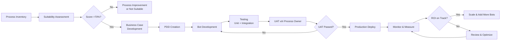
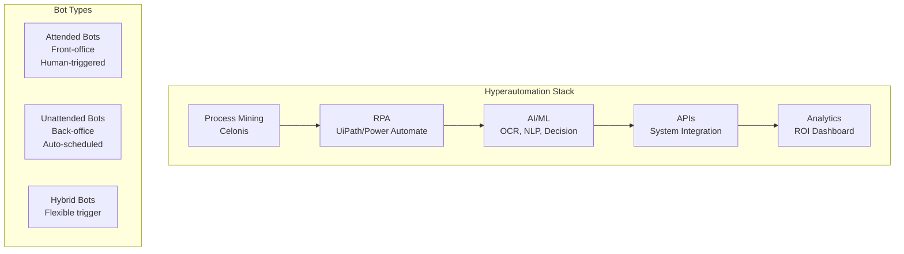

# AI03 — Automation & RPA (Tự động hóa & Robot Process Automation)

> "The automation of factories has already decimated jobs in traditional manufacturing, and the rise of artificial intelligence is likely to extend this disruption deep into the middle classes." — Stephen Hawking

---

## 1. Learning Objectives (Mục tiêu học tập)

Sau khi hoàn thành module này, người học có thể:

- Giải thích RPA là gì và phân biệt Attended vs Unattended bots
- So sánh các RPA tools hàng đầu: UiPath, Automation Anywhere, Power Automate
- Ứng dụng Process Mining (Celonis) để xác định candidates for automation
- Hiểu Hyperautomation: RPA + AI + Process Mining như một chiến lược tổng thể
- Tính toán RPA ROI và so sánh bot cost vs FTE cost
- Phân tích bối cảnh RPA tại VN: VCB, Techcombank, FPT RPA services
- Tư vấn và triển khai RPA projects cho doanh nghiệp Việt Nam

---

## 2. Business Context (Bối cảnh kinh doanh)

### Tại sao RPA bùng nổ?

**Vấn đề của doanh nghiệp hiện đại:**
- 60-70% thời gian nhân viên văn phòng dành cho repetitive, rule-based tasks (McKinsey)
- Lỗi thủ công trong data entry: 4% error rate trung bình → costly mistakes
- Nhân viên tài năng bị "mắc kẹt" trong công việc nhàm chán → burnout, turnover cao
- Yêu cầu vận hành 24/7 nhưng không muốn tăng headcount

**Giải pháp RPA:**
- Bots làm việc 24/7 không nghỉ, không mắc lỗi
- ROI nhanh (thường 6-12 tháng)
- Không cần thay đổi hệ thống hiện tại (non-invasive)
- Nhân viên được giải phóng để làm công việc có giá trị cao hơn

**Thị trường RPA Global:**
- Market size: $8.7B (2024), dự báo $50B+ vào 2030 (CAGR 29%)
- Top adopters: Banking, Insurance, Healthcare, Telecom, Manufacturing

---

## 3. Definitions (Định nghĩa)

| Thuật ngữ | Tiếng Anh | Định nghĩa |
|-----------|-----------|------------|
| Tự động hóa quy trình bằng robot | RPA | Software robots mô phỏng hành động con người trong giao diện số (click, copy-paste, form fill) |
| Bot có người hỗ trợ | Attended Bot | Bot chạy trên máy người dùng, cần trigger thủ công, phù hợp cho front-office |
| Bot không cần người | Unattended Bot | Bot chạy độc lập trên server, trigger tự động, phù hợp cho back-office |
| Khai thác quy trình | Process Mining | Phân tích event logs từ hệ thống để khám phá, monitor và cải thiện quy trình |
| Siêu tự động hóa | Hyperautomation | Kết hợp RPA + AI/ML + Process Mining + BPM để tự động hóa end-to-end |
| Tự động hóa thông minh | Intelligent Automation (IA) | RPA kết hợp với AI để xử lý unstructured data và quyết định phức tạp |
| Trung tâm xuất sắc tự động hóa | CoE | Center of Excellence — nhóm chuyên gia quản lý và phát triển RPA |
| Bot Farm | Bot Farm | Tập hợp nhiều bots chạy parallel trên nhiều server |

---

## 4. Core Concepts (Khái niệm cốt lõi)

### 4.1 RPA: Cách thức hoạt động

```
RPA Bot hoạt động như một "nhân viên ảo":

1. LOGIN → Bot đăng nhập vào hệ thống (ERP, email, web portal)
2. READ   → Bot đọc dữ liệu từ source (email, spreadsheet, database, PDF)
3. PROCESS → Bot xử lý dữ liệu theo rules đã lập trình
4. WRITE  → Bot nhập/ghi dữ liệu vào destination system
5. VERIFY → Bot kiểm tra và xác nhận kết quả
6. REPORT → Bot tạo log và báo cáo
```

**Điều RPA có thể làm:**
- Copy-paste dữ liệu giữa các ứng dụng
- Fill in forms (web, desktop)
- Đọc/gửi email tự động
- Download/upload files
- Tính toán và xử lý data trong Excel
- Kích hoạt workflows dựa trên rules
- Tương tác với GUI của bất kỳ ứng dụng nào

**Điều RPA KHÔNG thể làm (không có AI):**
- Xử lý handwritten documents
- Ra quyết định trong tình huống exception phức tạp
- Hiểu ngữ cảnh và ý định
- Học và cải thiện từ kinh nghiệm

### 4.2 Attended vs Unattended Bots

| Tiêu chí | Attended Bot | Unattended Bot |
|----------|-------------|---------------|
| Trigger | Người dùng kích hoạt | Tự động theo schedule hoặc event |
| Chạy trên | Máy người dùng (desktop) | Server/virtual machine |
| Use Cases | Front-office: hỗ trợ agent trong call center, data lookup | Back-office: batch processing, report generation |
| Giám sát | Người dùng có thể giám sát real-time | Cần Orchestrator monitoring |
| Ví dụ VN | CS agent dùng bot tra cứu thông tin KH trong khi đàm thoại | Bot chạy đêm tổng hợp báo cáo tài chính |
| License | Thường rẻ hơn | Thường đắt hơn |

### 4.3 RPA Tools Comparison

| Tiêu chí | UiPath | Automation Anywhere | Power Automate (Microsoft) |
|----------|--------|---------------------|---------------------------|
| Market Position | #1 thị phần toàn cầu | #2 thị phần | #3, nhưng tăng nhanh nhất |
| User-friendliness | Rất tốt (drag & drop) | Tốt | Tốt (tích hợp Microsoft 365) |
| AI Integration | UiPath AI Center | AARI (AI-powered) | AI Builder (native Microsoft) |
| Cloud-native | Có (UiPath Cloud) | Có (Automation 360) | Có (Azure-native) |
| On-premise | Có | Có | Có (giới hạn) |
| Cost (per bot/year) | $8,000-$20,000 | $8,000-$18,000 | $2,000-$5,000 |
| Community | Lớn nhất | Lớn | Đang tăng (Microsoft ecosystem) |
| Tại VN | FPT dùng UiPath | Ít phổ biến | Ngân hàng Microsoft shop |
| Best for | Enterprise tầm lớn | Banking, Finance | Công ty dùng Microsoft 365 |

**Khuyến nghị cho VN:**
- SME dùng Microsoft 365: **Power Automate** (chi phí thấp, tích hợp sẵn)
- Enterprise cần RPA mạnh: **UiPath** (hệ sinh thái lớn, nhiều partner tại VN)
- Ngân hàng: **UiPath hoặc Automation Anywhere** (tuân thủ tốt hơn)

### 4.4 Process Mining với Celonis

**Process Mining là gì?**
- Phân tích event logs từ ERP/CRM/ITSM để tái hiện quy trình thực tế (không phải quy trình "lý thuyết")
- Phát hiện bottlenecks, deviations, automation opportunities
- Continuous monitoring sau khi cải thiện

**Celonis — Market Leader:**
- Execution Management System (EMS)
- Tự động recommend automation opportunities
- ROI từ process improvements thường gấp 3-5x ROI từ RPA đơn thuần

**Quy trình sử dụng Process Mining:**
1. Extract event logs từ SAP/Oracle/Salesforce
2. Celonis phân tích và vẽ process map thực tế
3. Identify: high-volume, rule-based, repetitive steps → RPA candidates
4. Identify: delays, rework, non-compliant activities → process improvement
5. Deploy RPA cho automation candidates
6. Monitor với Celonis liên tục

### 4.5 Hyperautomation Framework

```
HYPERAUTOMATION = RPA + AI + Process Mining + BPM + APIs

Layer 1: DISCOVER (Process Mining)
  → Celonis, UiPath Process Mining
  → Xác định quy trình nào cần tự động hóa

Layer 2: AUTOMATE (RPA)
  → UiPath, Power Automate
  → Tự động hóa repetitive tasks

Layer 3: INTELLIGENTIZE (AI/ML)
  → OCR để đọc invoices
  → NLP để classify emails
  → ML để ra decisions

Layer 4: ORCHESTRATE (BPM + APIs)
  → Kết nối RPA với các workflow
  → API integration với các hệ thống
  → Exception handling và escalation

Layer 5: OPTIMIZE (Analytics)
  → Monitor bot performance
  → Measure business impact
  → Continuous improvement
```

### 4.6 RPA Suitability Criteria (Tiêu chí chọn quy trình tự động hóa)

**Quy trình IDEAL cho RPA (High Score):**
- ✅ Rule-based, ít exceptions
- ✅ High volume (>100 transactions/ngày)
- ✅ Repetitive, theo một pattern cố định
- ✅ Dữ liệu structured và digital
- ✅ Nhiều systems cần kết nối
- ✅ Error-sensitive (cần accuracy cao)
- ✅ Time-critical (SLA chặt chẽ)

**Quy trình KHÔNG phù hợp:**
- ❌ Judgment-intensive
- ❌ Highly unstructured data
- ❌ Thay đổi thường xuyên
- ❌ Quá ít volume (< 20 transactions/ngày)
- ❌ Cần creativity hoặc empathy

---

## 5. Business Value (Giá trị kinh doanh)

### Giá trị trực tiếp
- **Cost Reduction**: 1 FTE RPA bot có thể thay thế 3-5 FTE human trong back-office
- **Accuracy**: 99.99% accuracy vs. 96% human accuracy — giảm rework, penalties
- **Speed**: Bot xử lý trong giây vs. phút/giờ của con người
- **Compliance**: Bot luôn tuân thủ quy trình, tạo audit trail tự động
- **Scalability**: Scale instantly khi volume tăng (không cần tuyển dụng)

### Giá trị gián tiếp
- **Employee Satisfaction**: Nhân viên được giải phóng khỏi công việc nhàm chán
- **Customer Experience**: Faster processing → better SLA → happier customers
- **Risk Reduction**: Consistency trong quy trình, giảm human errors
- **Business Intelligence**: Dữ liệu chính xác hơn → insights tốt hơn

---

## 6. Enterprise Role (Vai trò trong Doanh nghiệp)

| Vai trò | Trách nhiệm RPA |
|---------|----------------|
| RPA Sponsor (C-Suite) | Budget approval, organization buy-in |
| RPA CoE Lead | Strategy, governance, standards |
| RPA Business Analyst | Process analysis, requirements gathering |
| RPA Developer | Bot development và testing |
| RPA Architect | Solution design, infrastructure |
| Process Owner (BU) | Use case identification, UAT, sign-off |
| IT Operations | Infrastructure, security, deployment |
| Change Manager | User adoption, communication |

---

## 7. Departments Related (Các phòng ban liên quan)

**Phòng ban thường có nhiều RPA use cases nhất:**
1. **Finance/Accounting** — Invoice processing, reconciliation, reporting
2. **HR** — Onboarding, payroll data, leave management
3. **IT** — User provisioning, incident management, monitoring
4. **Operations** — Order processing, inventory updates
5. **Customer Service** — Case routing, response, data lookup
6. **Supply Chain** — PO generation, vendor invoice, shipment tracking

---

## 8. Input (Đầu vào)

- **Process Documentation** (quy trình hiện tại, process maps)
- **Business Requirements** (automation goals, success criteria)
- **Test Data** (để develop và test bots)
- **System Access** (credentials, APIs, system landscape)
- **Business Rules** (rules để bot follow)
- **Exception Scenarios** (điều gì xảy ra khi có exception?)

---

## 9. Output (Đầu ra)

- **Deployed RPA Bots** (bots chạy trong production)
- **Automation Logs** (chi tiết mọi action của bot)
- **Exception Reports** (các trường hợp bot không xử lý được)
- **Bot Performance Dashboard** (uptime, transaction volume, accuracy)
- **ROI Reports** (cost savings realized)
- **Process Documentation** (As-Is → To-Be với automation)

---

## 10. Business Process (Quy trình kinh doanh)

### RPA Implementation Lifecycle

```
Phase 1: DISCOVER
├── Process Inventory (liệt kê tất cả quy trình)
├── Process Mining Analysis (nếu có Celonis)
├── Suitability Assessment (chấm điểm từng quy trình)
└── Business Case Development

Phase 2: DESIGN
├── Process Definition Document (PDD)
├── Solution Design Document (SDD)
├── Wireframes / Bot Flow Diagrams
└── Exception Handling Design

Phase 3: DEVELOP
├── Bot Development (UiPath Studio / Power Automate)
├── Unit Testing
├── Integration Testing
└── Performance Testing

Phase 4: TEST & VALIDATE
├── User Acceptance Testing (UAT)
├── Parallel Run (bot vs. human — so sánh kết quả)
└── Performance Benchmarking

Phase 5: DEPLOY
├── Production Deployment
├── Orchestrator Setup
├── Monitoring Configuration
└── Handover Training

Phase 6: OPERATE & OPTIMIZE
├── Daily Monitoring
├── Exception Handling
├── Performance Reporting
└── Continuous Improvement
```

---

## 11. Data Flow (Luồng dữ liệu)

```
Source Systems:
├── Email (Outlook, Gmail)
├── ERP (SAP, Oracle, Microsoft Dynamics)
├── Spreadsheets (Excel, Google Sheets)
├── Web portals (vendor portals, government portals)
├── PDF/Documents
└── Legacy systems (mainframe, desktop apps)

RPA Bot Processing:
├── Data Extraction (OCR + screen scraping)
├── Data Validation (rule-based checks)
├── Data Transformation (format conversion)
└── Data Routing (exception vs. normal flow)

Destination Systems:
├── ERP (data entry, update)
├── Database (records, audit trail)
├── Email (notifications, reports)
├── SharePoint/SFTP (file upload)
└── Dashboard/BI (reporting data)

Control & Monitoring:
├── Orchestrator (job scheduling, monitoring)
├── Log Database (audit trail)
└── Alert System (exception notifications)
```

---

## 12. Money Flow (Luồng tiền)

### RPA Cost Structure

| Chi phí | Một lần | Hàng năm |
|---------|---------|----------|
| Software License | - | $5,000-$20,000/bot |
| Infrastructure (server/cloud) | - | $2,000-$8,000/bot |
| Development Cost | 50-300 triệu VNĐ/bot | - |
| CoE Salaries | - | 2-3 người × 25-40 triệu/tháng |
| Maintenance | - | 20-30% of dev cost/năm |

### ROI Calculation: Bot vs FTE

```
FTE Cost (1 nhân viên back-office tại VN):
├── Lương: 12-18 triệu/tháng
├── BHXH, BHYT, BHTN: ~30% = 4-5 triệu/tháng
├── Không gian làm việc, equipment: 2-3 triệu/tháng
├── Training, management overhead: 2-3 triệu/tháng
└── TOTAL: 20-29 triệu/tháng ≈ 250-350 triệu/năm

Bot Cost (UiPath Unattended):
├── License: ~$15,000/năm ≈ 380 triệu VNĐ
├── Infrastructure: ~$3,000/năm ≈ 76 triệu VNĐ
├── Maintenance: ~50 triệu/năm
└── TOTAL: ~506 triệu/năm

Bot ROI phụ thuộc vào:
- Bot thay thế được bao nhiêu FTE? (thường 3-8 FTE/bot)
- Volume có đủ cao để justify cost không?
- Exception rate có thấp không?

Ví dụ: Bot thay 5 FTE × 300 triệu/năm = 1.5 tỷ savings
Bot cost: 500 triệu/năm
Net savings: 1 tỷ/năm
ROI: 200%
```

---

## 13. Document Flow (Luồng tài liệu)

```
Discovery Phase:
├── Process Inventory List
├── Process Suitability Assessment
└── Business Case Document

Design Phase:
├── Process Definition Document (PDD) — As-Is process detail
├── Solution Design Document (SDD) — To-Be bot design
└── Functional Requirements Specification

Development Phase:
├── Bot Source Code (version controlled)
├── Test Cases
└── Unit Test Results

Deployment Phase:
├── UAT Sign-off Form
├── Deployment Runbook
└── Risk Assessment

Operations Phase:
├── Daily Bot Performance Reports
├── Exception Logs
├── Monthly ROI Reports
└── Incident Reports
```

---

## 14. Roles (Vai trò)

| Vai trò | Kỹ năng | Lương VN (2024) |
|---------|---------|----------------|
| RPA Solution Architect | System design, multiple tools | 40-70 triệu/tháng |
| Senior RPA Developer | UiPath/AA development | 25-45 triệu/tháng |
| Junior RPA Developer | Basic bot development | 12-20 triệu/tháng |
| RPA Business Analyst | Process analysis, requirements | 20-35 triệu/tháng |
| RPA CoE Lead | Governance, strategy | 50-100 triệu/tháng |
| Process Mining Analyst | Celonis, data analysis | 25-40 triệu/tháng |

---

## 15. Responsibilities (Trách nhiệm)

**RPA CoE Lead**: Governance standards, tool selection, bot portfolio management, ROI tracking

**RPA Developer**: Bot development theo PDD/SDD, unit testing, documentation

**Business Analyst**: Process documentation, exception scenarios, UAT coordination

**Process Owner**: Business requirements, UAT sign-off, operational monitoring

**IT Operations**: Infrastructure provisioning, security, network access, server management

**Change Manager**: Stakeholder communication, training, adoption tracking

---

## 16. RACI Matrix

| Hoạt động | CoE Lead | RPA Dev | Business Analyst | Process Owner | IT |
|-----------|---------|--------|----------------|-------------|-----|
| Process Discovery | C | I | R | C | I |
| Business Case | A | I | R | C | I |
| Bot Development | C | R | C | I | C |
| UAT | I | R | C | A | I |
| Production Deploy | A | R | I | C | R |
| Bot Monitoring | A | R | I | C | C |
| ROI Reporting | A | I | R | C | I |

*R=Responsible, A=Accountable, C=Consulted, I=Informed*

---

## 17. Frameworks (Khung tham chiếu)

### UiPath RPA Reference Architecture
- **Process Discovery** → UiPath Process Mining
- **Development** → UiPath Studio, StudioX (citizen developer)
- **Orchestration** → UiPath Orchestrator
- **AI Integration** → UiPath AI Center (Document Understanding, Computer Vision)
- **Analytics** → UiPath Insights

### Gartner Hyperautomation Framework (2024)
1. Process Discovery (Process Mining)
2. Process Automation (RPA)
3. Decision Automation (ML/Rules Engine)
4. Integration (iPaaS, APIs)
5. Augmentation (AI assistance to humans)

### IEEE Standards for RPA
- IEEE P2755 — RPA Taxonomy và Definition
- IEEE P2804 — RPA Core Vocabulary

---

## 18. International Standards (Tiêu chuẩn quốc tế)

| Tiêu chuẩn | Liên quan đến RPA |
|------------|------------------|
| ISO 27001 | Bảo mật dữ liệu xử lý bởi bots |
| SOX Compliance | RPA audit trail cho financial reporting |
| GDPR/PDPD | Bots xử lý personal data phải tuân thủ |
| ITIL 4 | RPA trong ITSM context |
| PCI-DSS | RPA trong payment processing environments |

---

## 19. Vietnam Context (Bối cảnh Việt Nam)

### Ngân hàng VN — Đi đầu trong RPA

**Vietcombank (VCB)**
- RPA Initiative: 2019-2020
- Use cases: Xử lý hồ sơ tín dụng, reconciliation cuối ngày, report generation
- Kết quả: 60+ bots, tiết kiệm 200,000+ giờ nhân công/năm
- Partner: FPT Software (triển khai UiPath)

**Techcombank**
- Hyperautomation Strategy — 2021-2024
- Use cases: KYC automation, loan processing, compliance reporting, treasury operations
- 150+ bots deployed, tiết kiệm 2M+ giờ/năm
- ROI: 400%+ trong 3 năm

**BIDV**
- RPA cho Core Banking: Xử lý nghiệp vụ sau giao dịch (post-trade)
- Partner: Công ty CP Giải pháp Phần mềm Hòa Bình

**MB Bank**
- AI + RPA — Intelligent Automation
- Xử lý thẻ tín dụng, dispute management, fraud investigation
- 80% end-to-end automation trong một số quy trình

### FPT Software — RPA Services

**FPT akaBot** — Sản phẩm RPA Made in Vietnam:
- Xây dựng dựa trên nền tảng Blue Prism với AI capabilities
- 500+ clients tại VN và quốc tế
- Use cases: Ngân hàng, bảo hiểm, sản xuất, bán lẻ
- Giá thấp hơn UiPath/AA 30-40% — phù hợp SME VN

**FPT RPA Services:**
- Tư vấn và triển khai RPA cho doanh nghiệp
- Training RPA developers
- Managed RPA services (bot operations)
- Revenue từ RPA segment: ~$50M/năm (2024)

### Bảo hiểm VN — RPA trong Claims

**Bảo Việt, Manulife VN, Prudential VN**
- RPA cho claims processing: 5 ngày → 1 ngày xử lý
- KYC automation, policy issuance
- Fraud detection với AI + RPA

### SME VN — Power Automate adoption

- Microsoft 365 ecosystem phổ biến → Power Automate là entry point
- Nhiều doanh nghiệp vừa dùng Power Automate để automate Excel, email, SharePoint
- Chi phí thấp ($15/user/month cho Power Automate) — phù hợp budget SME

---

## 20. Legal Considerations (Khía cạnh pháp lý)

### Nghị định 13/2023 — Data Privacy & RPA

**Bots xử lý personal data phải:**
- Có data processing agreement với người dùng
- Không lưu personal data lâu hơn cần thiết
- Bảo mật dữ liệu trong quá trình xử lý
- Có audit trail cho mọi thao tác với personal data

### Quy định ngân hàng (Thông tư 09/2020/TT-NHNN)
- RPA trong ngân hàng phải được kiểm duyệt bởi bộ phận Risk & Compliance
- Audit trail bắt buộc cho tất cả automated financial transactions
- Phải có human approval cho transactions trên ngưỡng nhất định

### Quy định lao động
- Thực tế: RPA không gây tranh chấp lao động lớn tại VN hiện tại vì thị trường lao động còn thiếu nhân lực
- Tuy nhiên, cần có change management tốt để tránh bất ổn nội bộ
- Nhân viên bị ảnh hưởng cần được reskill sang công việc khác

---

## 21. Common Mistakes (Sai lầm phổ biến)

**1. Automating Bad Processes**
- Vấn đề: "We're automating a mess at scale" — tự động hóa quy trình vốn đã broken
- Giải pháp: Process improvement TRƯỚC automation (process mining giúp phát hiện)

**2. Underestimating Exception Handling**
- Vấn đề: Developer tập trung vào happy path, 10% exceptions làm bot fail 40% thời gian
- Giải pháp: Map ALL exception scenarios trong PDD trước khi code

**3. Thiếu Bot Monitoring**
- Vấn đề: Bot chạy lặng lẽ, lỗi không ai biết cho đến khi thấy downstream impact
- Giải pháp: Alerting, dashboard, daily bot health checks

**4. Over-Engineering bots**
- Vấn đề: Developer build quá phức tạp → khó maintain khi business thay đổi
- Giải pháp: Modular design, maintainable code, không hardcode business rules

**5. Không có CoE**
- Vấn đề: Mỗi bộ phận tự build bot theo cách riêng → inconsistent, không scale
- Giải pháp: Thành lập CoE (dù nhỏ: 2-3 người) để set standards

**6. Bỏ qua Change Management**
- Vấn đề: Nhân viên sợ mất việc, sabotage bot (cố tình tạo exceptions)
- Giải pháp: Transparent communication, reskilling programs, involve employees

**7. Chọn quy trình không phù hợp**
- Vấn đề: Automation quy trình có quá nhiều exceptions hoặc thay đổi thường xuyên
- Giải pháp: Áp dụng Suitability Assessment (mục 4.6) trước khi commit

---

## 22. Best Practices (Thực hành tốt nhất)

1. **Process Before Technology**: Optimize process trước khi automate
2. **Start with Quick Wins**: Chọn process volume cao, đơn giản, ROI rõ ràng cho lần đầu
3. **Establish CoE Early**: Dù 2-3 người, CoE set standards ngay từ đầu
4. **Standardize Development**: Coding standards, naming conventions, error handling templates
5. **Monitor 24/7**: Orchestrator alerts, daily health checks
6. **Document Everything**: PDD, SDD, runbooks — bot là "nhân viên" cần be documented
7. **Version Control**: Git cho bot code, giống như software development
8. **Reusable Components**: Build libraries of reusable activities
9. **Security by Design**: Bot credentials in vault, least privilege access
10. **Measure and Report**: ROI tracking monthly, showcase wins to maintain executive support

---

## 23. KPIs (Chỉ số đánh giá)

### Bot Performance KPIs

| KPI | Định nghĩa | Target |
|-----|-----------|--------|
| Bot Uptime | % thời gian bot hoạt động bình thường | >99% |
| Success Rate | % transactions xử lý thành công | >95% |
| Exception Rate | % transactions cần human intervention | <5% |
| Processing Time | Thời gian xử lý mỗi transaction | <30 giây |
| Throughput | Số transactions/giờ | Định nghĩa theo use case |

### Business Impact KPIs

| KPI | Cách tính |
|-----|-----------|
| FTE Equivalent | Số nhân viên tương đương bot thay thế |
| Cost Savings ($) | FTE cost saved - Bot cost |
| Payback Period | Initial investment / Annual savings |
| Error Rate Reduction | (Before - After) / Before × 100% |
| SLA Improvement | % improvement in processing time |

---

## 24. Metrics (Chỉ số đo lường)

**Operational Metrics (đo daily):**
- Số transactions/ngày per bot
- Exception count và exception types
- Bot utilization (% time bot actually working)
- Error types và frequency

**Financial Metrics (đo monthly):**
- Hours saved vs. target
- Cost savings realized
- ROI cumulative

**Quality Metrics (đo weekly):**
- Data accuracy rate (output vs. manual check)
- Rework rate (do bot errors)
- Compliance rate (bot following all rules)

---

## 25. Reports (Báo cáo)

| Báo cáo | Tần suất | Audience | Nội dung |
|---------|----------|----------|---------|
| Bot Health Dashboard | Real-time | CoE, IT Ops | Uptime, queue, exceptions |
| Weekly Bot Performance | Weekly | CoE Lead, Process Owners | Success/fail rates, SLA |
| Monthly ROI Report | Monthly | Management | Cost savings, FTE equivalent |
| Quarterly RPA Review | Quarterly | C-Suite | Portfolio status, new use cases |
| Annual RPA Impact | Annually | Board | Total value delivered, roadmap |

---

## 26. Templates (Mẫu biểu)

### Template: Process Definition Document (PDD)

```
1. PROCESS OVERVIEW
   - Process Name:
   - Business Owner:
   - Current Process Description:
   - Volume (transactions/day):
   - Current Processing Time:
   
2. TRIGGER
   - What triggers this process? (email, schedule, user action)
   
3. INPUT DATA
   - Source system(s):
   - Data format (Excel, PDF, web, ERP):
   - Sample data attached: Yes/No
   
4. PROCESS STEPS (Step-by-step, as performed by human today)
   Step 1: ...
   Step 2: ...
   
5. BUSINESS RULES
   - Rule 1: IF [condition] THEN [action]
   - Rule 2: ...
   
6. EXCEPTION SCENARIOS
   - Exception 1: What happens if...? → How to handle?
   - Exception 2: ...
   
7. OUTPUT
   - What is produced? Where does it go?
   
8. SUCCESS CRITERIA
   - How do we know the bot ran successfully?
   
9. APPROVER: _________________ DATE: _______
```

---

## 27. Checklists (Danh sách kiểm tra)

### Pre-Bot Deployment Checklist

**Technical:**
- [ ] Bot tested với production-like data
- [ ] All exception scenarios handled
- [ ] Error notifications configured
- [ ] Orchestrator jobs scheduled
- [ ] Credentials stored in Vault (không hardcode)
- [ ] Performance testing (100+ transactions)

**Business:**
- [ ] Process Owner UAT sign-off
- [ ] Parallel run completed (bot vs human — results match)
- [ ] Rollback plan documented
- [ ] Business stakeholders informed

**Security:**
- [ ] Least-privilege access (bot chỉ có quyền cần thiết)
- [ ] No personal data logged unnecessarily
- [ ] Network access approved by IT Security

**Documentation:**
- [ ] PDD finalized
- [ ] SDD updated with as-built
- [ ] Operations runbook created
- [ ] Known issues documented

---

## 28. SOP (Quy trình chuẩn)

### SOP-RPA-001: Exception Handling Process

**Mục đích**: Xử lý nhanh khi bot gặp exception, giảm thiểu business impact

**Quy trình:**
1. Bot gặp exception → ghi log chi tiết → gửi email alert đến Process Owner + CoE
2. Bot tự thử lại (retry) tối đa 3 lần với interval 5 phút
3. Nếu vẫn fail → bot tạo exception case trong Exception Dashboard
4. Process Owner nhận email → xử lý manually trong SLA time
5. CoE phân tích exception pattern hàng tuần → identify nếu cần update bot logic
6. Nếu exception rate >10% → escalate để review bot design

**SLA cho exception handling:**
- Critical (ảnh hưởng revenue/payment): 30 phút
- High (ảnh hưởng SLA với khách hàng): 2 giờ
- Medium: 4 giờ làm việc
- Low: 1 ngày làm việc

---

## 29. Case Study (Tình huống thực tế)

### Case Study 1: Techcombank — Hyperautomation Journey

**Bối cảnh**: Techcombank — top 3 ngân hàng tư nhân VN, 10,000 nhân viên, 10M khách hàng

**Thách thức 2019**: 
- Xử lý 50,000 hồ sơ tín dụng/tháng, mỗi hồ sơ cần 5-7 ngày
- 30% nhân viên back-office dành 70% thời gian cho data entry

**RPA Journey (2020-2024)**:

**Năm 1 (2020) — Foundation**:
- Pilot: 5 bots cho loan document processing
- Investment: 5 tỷ VNĐ
- Savings: 2 tỷ VNĐ/năm

**Năm 2 (2021) — Scaling**:
- Expand: 50 bots, CoE 8 người
- Process Mining với Celonis để discover thêm opportunities
- Investment thêm: 8 tỷ VNĐ
- Savings: 15 tỷ VNĐ/năm

**Năm 3-4 (2022-2023) — Hyperautomation**:
- 150 bots + AI integration (OCR, NLP)
- Loan processing: 7 ngày → 1 ngày (auto-approve cho 60% hồ sơ đủ tiêu chuẩn)
- 2M+ hours saved/năm

**Tổng kết 2020-2024**:
- Investment: 30 tỷ VNĐ
- Savings: 120 tỷ VNĐ/năm (by 2024)
- ROI: 400%
- 200+ bots, 15 CoE members

---

### Case Study 2: VCB — RPA trong Giao dịch Ngoại tệ

**Use case**: Reconciliation giao dịch ngoại tệ cuối ngày

**Quy trình trước RPA**:
- 10 nhân viên làm 8 giờ mỗi cuối ngày
- Match giao dịch giữa Core Banking, SWIFT messages, và correspondent bank statements
- Error rate: 2%, cần rework sáng hôm sau

**Giải pháp RPA (2020)**:
- 2 bots chạy overnight (22:00-06:00)
- Extract data từ 3 systems, match tự động theo rules
- Exception report tự động gửi cho Trading team lúc 06:30

**Kết quả**:
- 10 nhân viên → 2 nhân viên (chỉ xử lý exceptions)
- Processing time: 8 giờ → 4 giờ (chạy song song)
- Error rate: 2% → 0.1%
- Annual savings: 1.2 tỷ VNĐ/năm

---

## 30. Small Business Example (Ví dụ Doanh nghiệp nhỏ)

### Công ty Xuất nhập khẩu DEF — 30 nhân viên

**Vấn đề**: 3 nhân viên kế toán mất 40% thời gian để nhập liệu hóa đơn nhập khẩu từ PDF vào Excel rồi vào phần mềm kế toán Misa

**Giải pháp Power Automate + AI Builder**:
- AI Builder OCR đọc PDF invoices (tiếng Anh)
- Power Automate tự động nhập vào Misa qua API
- Exception: amount mismatch → email cho kế toán

**Chi phí**:
- Power Automate plan: $40/tháng
- AI Builder credits: $500/tháng
- Setup: 15 triệu VNĐ (1 lần)

**Kết quả**:
- 300 invoices/tháng xử lý tự động
- 40% thời gian kế toán → chuyển sang reconciliation và analysis
- Lỗi nhập liệu: 5% → 0.2%
- ROI: 600% trong năm đầu

---

## 31. Enterprise Example (Ví dụ Doanh nghiệp lớn)

### Bảo Việt Insurance — Claims Automation

**Bối cảnh**: Bảo Việt — bảo hiểm lớn nhất VN, 1.5M+ policy holders, 50,000+ claims/năm

**Challenge**: Claims processing mất 15-30 ngày → customer dissatisfaction, high call center volume

**RPA + AI Solution:**
- Bot 1: Auto-extract thông tin từ claim forms (OCR + AI)
- Bot 2: Check policy database, verify coverage
- Bot 3: Tính toán benefit amount theo policy rules
- Bot 4: Route phức tạp → human adjuster; đơn giản → auto-approve
- Bot 5: Generate payment instruction, send to core banking

**Kết quả sau 2 năm:**
- Simple claims (60% total): 30 ngày → 2 ngày (auto-approve)
- Complex claims (40%): Từ 30 ngày → 10 ngày (bot hỗ trợ adjuster)
- Customer Satisfaction Index: +25 điểm
- Claims processing cost: giảm 45%

---

## 32. ERP Mapping (Liên kết ERP)

| RPA Use Case | ERP Module | Integration Method |
|-------------|-----------|-------------------|
| Invoice Processing | SAP FI/MM | SAP GUI Scripting hoặc SAP RFC API |
| Purchase Order Creation | SAP MM | API first, SAP screen fallback |
| GL Journal Entry | SAP FI | SAP BAPI (function module) |
| HR Data Update | SAP HCM | API hoặc HANA database |
| Inventory Updates | SAP MM/WM | SAP GUI automation |
| Report Download/Distribution | SAP BW | SAP GUI + email automation |

---

## 33. Automation Opportunities (Cơ hội tự động hóa)

| Department | Process | Effort | ROI |
|-----------|---------|--------|-----|
| Finance | Invoice processing (OCR + entry) | Medium | Very High |
| Finance | Bank reconciliation | Medium | High |
| Finance | Month-end close reporting | High | High |
| HR | Employee onboarding data setup | Low | Medium |
| IT | User account provisioning/deprovisioning | Low | High |
| CS | Case creation from email | Low | High |
| Logistics | Shipment tracking updates | Medium | Medium |
| Sales | CRM data enrichment | Medium | Medium |

---

## 34. AI Opportunities (Cơ hội AI trong Automation)

**Intelligent Automation = RPA + AI:**

| AI Capability | Enhances RPA | Use Case |
|--------------|-------------|---------|
| OCR (Optical Character Recognition) | Đọc PDF, scanned docs | Invoice processing, contract review |
| NLP (text classification) | Classify emails | Route to right team automatically |
| Computer Vision | Read screens, images | Handle web pages with dynamic content |
| ML (decision-making) | Handle exceptions | Approve/reject based on learned patterns |
| LLM (understanding context) | Read unstructured emails | Extract structured data từ free-text |

---

## 35. Implementation Guide (Hướng dẫn triển khai)

### 6-Month RPA Program

**Month 1: Discovery**
- Tổ chức Process Workshop với BU leads
- Process inventory: liệt kê 20-30 process candidates
- Suitability Assessment cho tất cả candidates
- Select Top 3 for Pilot

**Month 2: Foundation**
- Setup infrastructure (Orchestrator, dev environment)
- Thành lập CoE (2-3 người minimum)
- Training RPA developers (UiPath Academy — free)
- Tool selection và procurement

**Month 3-4: First Bots**
- Develop và test 3 pilot bots
- UAT với Process Owners
- Production deployment

**Month 5-6: Scale**
- Measure ROI của pilot bots
- Identify next 5-10 processes
- Standardize development practices
- Recruit thêm RPA developers

---

## 36. Consulting Guide (Hướng dẫn tư vấn)

### RPA Consulting Engagement

**Phase 1: Opportunity Assessment (2 tuần)**
- Interview với all department heads (HR, Finance, IT, Operations, CS)
- Collect process data (volume, FTE, time, error rate)
- Score processes theo Suitability Assessment
- Prioritize top 10-15 opportunities
- Deliverable: RPA Opportunity Report + Business Case

**Phase 2: Tool Selection (1 tuần)**
- Assess IT infrastructure (cloud vs. on-premise)
- Evaluate budget constraints
- Demo 2-3 tools
- Recommendation report

**Phase 3: Implementation Roadmap (1 tuần)**
- Phased implementation plan (12-18 months)
- Resource plan (CoE team, training)
- Investment và ROI projection
- Risk assessment

**Fees tại VN:**
- RPA Assessment: 100-300 triệu VNĐ
- Bot Development (per bot): 50-300 triệu VNĐ
- CoE Setup & Training: 200-500 triệu VNĐ
- Managed RPA Services: 50-150 triệu/tháng

---

## 37. Diagnostic Questions (Câu hỏi chẩn đoán)

1. Bộ phận nào trong công ty có nhiều repetitive, manual tasks nhất?
2. Bao nhiêu nhân viên làm data entry mỗi ngày? Mỗi người bao lâu?
3. Công ty có sử dụng ERP hay các hệ thống có thể tự động hóa không?
4. Quy trình hiện tại có được document đầy đủ không?
5. Exception rate của quy trình thủ công hiện tại là bao nhiêu?
6. IT có sẵn sàng hỗ trợ RPA infrastructure không?
7. Management có commitment với RPA program không (budget, resources)?
8. Nhân viên có lo lắng về việc mất việc khi triển khai RPA không?
9. Công ty có các quy trình chạy 24/7 nhưng đang bị giới hạn bởi giờ làm việc không?

---

## 38. Interview Questions (Câu hỏi phỏng vấn)

**Phỏng vấn RPA Developer:**
- "Mô tả cách bạn handle dynamic content trên web trong UiPath?"
- "Kể về một bot bạn đã build bị fail trong production. Nguyên nhân và fix như thế nào?"
- "Bạn xử lý credentials của bot như thế nào để đảm bảo security?"
- "Sự khác biệt giữa Selector và Fuzzy Selector trong UiPath là gì?"

**Phỏng vấn RPA Business Analyst:**
- "Làm thế nào để bạn xác định một process có phù hợp cho RPA không?"
- "Bạn viết PDD như thế nào? Thông tin quan trọng nhất cần capture?"
- "Khi stakeholder muốn automate một process mà theo bạn không phù hợp, bạn xử lý thế nào?"

---

## 39. Exercises (Bài tập)

### Bài tập 1: Process Suitability Assessment
Liệt kê 5 quy trình trong công ty bạn (hoặc một công ty quen thuộc). Đánh giá từng quy trình:
- Volume (cao/trung bình/thấp)
- Rule-based (có/không/một phần)
- Structured data (có/không)
- Exception rate (thấp <5%/trung bình/cao >20%)
- FTE cost (triệu/năm)
Kết luận: Process nào nên làm trước?

### Bài tập 2: RPA ROI Calculation
Một ngân hàng có quy trình xử lý hồ sơ vay:
- Volume: 1,000 hồ sơ/tháng
- Hiện tại: 10 nhân viên × 20 triệu/tháng = 200 triệu/tháng
- RPA có thể xử lý 70% tự động (exception: 30% cần human)
- Bot cost: 5 triệu/tháng per bot, cần 2 bots
- Exception handling: 3 nhân viên × 20 triệu = 60 triệu/tháng
Tính: Annual savings, ROI Year 1, Payback period

### Bài tập 3: Design PDD
Chọn một quy trình đơn giản (email attachment → extract data → nhập vào form) và viết đầy đủ Process Definition Document theo template mục 26.

---

## 40. References (Tài liệu tham khảo)

**Sách**
- "The Automation Advantage" — Bhaskar Ghosh, Rajendra Prasad, Gayathri Pallail
- "Robotic Process Automation with Automation Anywhere" — Packt Publishing
- "UiPath Associate Certification Guide" — Pagoti Dipayan

**Báo cáo**
- Gartner: "Magic Quadrant for RPA" (annual)
- Forrester Wave: "Robotic Process Automation" (annual)
- McKinsey: "The Age of Analytics" — automation section

**Nguồn VN**
- FPT akaBot Blog: blog.fptakabot.com
- Vietnam Banking Association: Báo cáo số hóa ngân hàng VN
- Techcombank Annual Report — Digital Banking section

**Công cụ học tập**
- UiPath Academy: academy.uipath.com (free)
- Microsoft Power Automate Learning: learn.microsoft.com/power-automate
- Automation Anywhere University: university.automationanywhere.com

---

## Output Formats

### Mermaid Diagram — RPA Implementation Lifecycle





---

### Flashcards (Thẻ học)

**Thẻ 1**
- **Q**: Phân biệt Attended Bot vs Unattended Bot? Khi nào dùng loại nào?
- **A**: Attended Bot: chạy trên máy người dùng, cần human trigger, phù hợp front-office khi cần human judgment kết hợp (ví dụ: CS agent dùng bot tra cứu thông tin KH trong khi đàm thoại). Unattended Bot: chạy trên server, hoàn toàn tự động theo schedule/event, phù hợp back-office batch processing (ví dụ: reconciliation cuối ngày). Chi phí Unattended thường cao hơn.

**Thẻ 2**
- **Q**: Tiêu chí nào để đánh giá một quy trình có phù hợp cho RPA không?
- **A**: 6 tiêu chí IDEAL: (1) Rule-based — ít judgment phức tạp, (2) High volume — >100 transactions/ngày để justify cost, (3) Repetitive — làm đi làm lại theo pattern cố định, (4) Structured digital data — không phải handwritten, (5) Low exception rate — <5% cần human intervention, (6) Time-sensitive hoặc accuracy-critical. Nếu đạt 4/6 trở lên → phù hợp cho RPA.

**Thẻ 3**
- **Q**: Hyperautomation khác RPA như thế nào?
- **A**: RPA = chỉ automate rule-based tasks với structured data. Hyperautomation (Gartner term) = RPA + AI + Process Mining + BPM + APIs. Cụ thể: RPA làm heavy lifting (click, copy, paste), AI xử lý unstructured data (OCR đọc hóa đơn, NLP phân loại email), Process Mining tìm ra quy trình nào cần automate tiếp theo. Kết quả: automation thực sự end-to-end thay vì chỉ từng bước nhỏ.

---

### JSON Metadata

```json
{
  "module": {
    "code": "AI03",
    "name": "Automation & RPA",
    "domain": "AI & Digital",
    "version": "1.0",
    "updated": "2026-06-30",
    "status": "complete"
  },
  "rpa_tools": {
    "enterprise": ["UiPath", "Automation Anywhere"],
    "microsoft_ecosystem": ["Power Automate", "Power Platform"],
    "vietnam_local": ["FPT akaBot"],
    "process_mining": ["Celonis", "UiPath Process Mining"]
  },
  "bot_types": ["Attended", "Unattended", "Hybrid"],
  "use_case_categories": ["Finance", "HR", "IT", "Operations", "Customer Service", "Supply Chain"],
  "vietnam_context": {
    "banking_adopters": ["Vietcombank", "Techcombank", "BIDV", "MB Bank"],
    "service_providers": ["FPT Software akaBot"],
    "maturity": "Early to mid adoption — banking leads, SME via Power Automate"
  },
  "roi_metrics": {
    "typical_bot_replaces_fte": "3-8 FTE per bot",
    "typical_accuracy_improvement": "96% human → 99.99% bot",
    "typical_payback_period": "6-18 months"
  },
  "tags": ["RPA", "automation", "hyperautomation", "process-mining", "UiPath", "power-automate", "bots", "attended", "unattended", "vietnam", "banking"]
}
```

---

*Module AI03 — Automation & RPA | Business Operating System Handbook | v1.0 | 2026-06-30*
