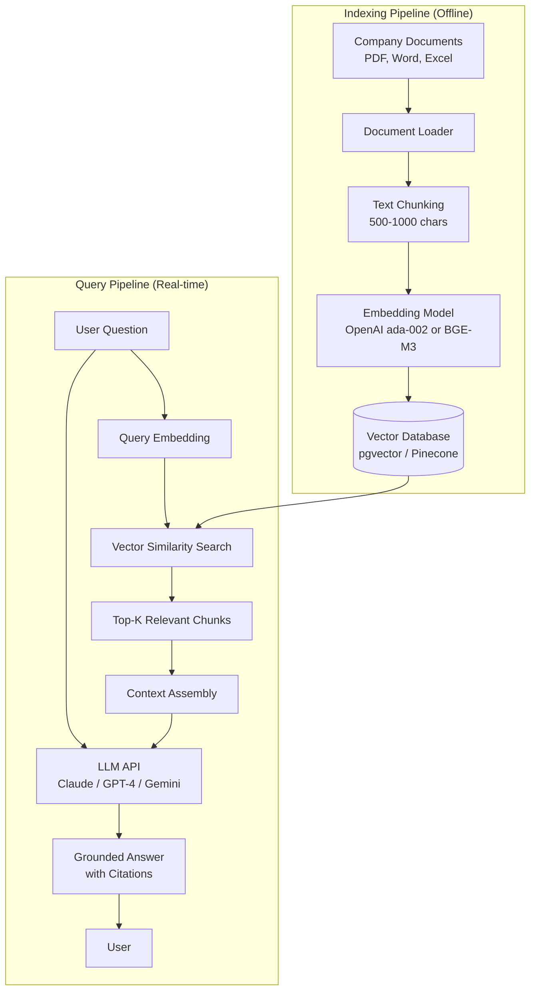
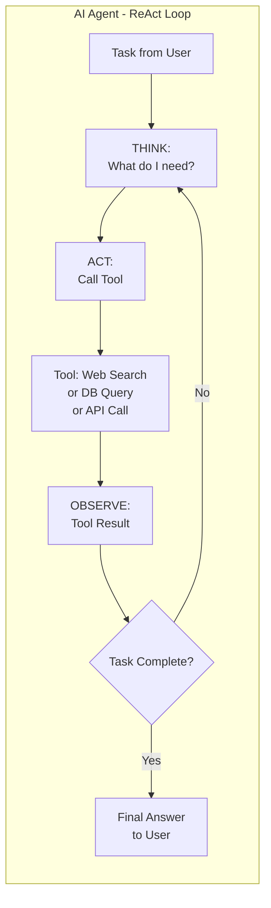

# AI04 — LLM & AI Agents (Mô hình Ngôn ngữ Lớn & AI Agents)

> "LLMs are a new kind of computer: a computer that speaks human." — Andrej Karpathy, Former Tesla AI Director

---

## 1. Learning Objectives (Mục tiêu học tập)

Sau khi hoàn thành module này, người học có thể:

- Giải thích cách LLM hoạt động: tokens, context window, temperature, attention
- Áp dụng prompt engineering cho các vai trò kinh doanh (CEO, CFO, BA, Consultant)
- Thiết kế AI Agents với ReAct pattern và tool use
- Xây dựng RAG system cho enterprise knowledge base
- So sánh Claude, GPT-4, Gemini cho các business use cases cụ thể
- Xác định rủi ro AI: hallucination, data privacy, bias
- Áp dụng Luật An ninh mạng 2018 vào chiến lược AI data residency
- Tư vấn LLM strategy cho doanh nghiệp Việt Nam

---

## 2. Business Context (Bối cảnh kinh doanh)

### Cuộc cách mạng LLM (2022-2025)

**Timeline quan trọng:**
- **Nov 2022**: ChatGPT ra mắt → 100M users trong 2 tháng
- **Mar 2023**: GPT-4 — multimodal, reasoning breakthrough
- **Jul 2023**: Claude 2, Llama 2 (Meta open-source)
- **Dec 2023**: Gemini 1.0 (Google)
- **Mar 2024**: Claude 3 (Opus, Sonnet, Haiku)
- **May 2024**: GPT-4o, Gemini 1.5 Pro (1M token context)
- **2025**: Agentic AI, multimodal AI mainstream

**Tại sao LLM quan trọng với Business:**
- Knowledge workers có thể tăng productivity 30-80% với LLM tools (Harvard Business School 2024)
- LLM democratize AI: không cần coding skill để dùng AI
- Business communication, analysis, content — tất cả đều có thể augmented bởi LLM
- 65% Forbes 500 đã triển khai hoặc đang piloting LLM (2024)

---

## 3. Definitions (Định nghĩa)

| Thuật ngữ | Tiếng Anh | Định nghĩa |
|-----------|-----------|------------|
| Mô hình ngôn ngữ lớn | LLM (Large Language Model) | AI model với hàng tỷ parameters được train trên lượng text khổng lồ |
| Token | Token | Đơn vị xử lý của LLM — ~0.75 từ (tiếng Anh), ~0.5 từ (tiếng Việt) |
| Cửa sổ ngữ cảnh | Context Window | Tổng token LLM có thể "nhìn thấy" trong một lần gọi (4K-2M tokens) |
| Nhiệt độ | Temperature | Tham số điều chỉnh độ sáng tạo (0=xác định, 1=sáng tạo, 2=ngẫu nhiên) |
| Kỹ thuật nhắc nhở | Prompt Engineering | Nghệ thuật viết instructions để LLM ra output tốt nhất |
| RAG | Retrieval-Augmented Generation | LLM kết hợp với vector database để search và cite từ knowledge base riêng |
| AI Agent | AI Agent | AI tự chủ có thể lập kế hoạch, dùng tools, thực thi nhiều bước để hoàn thành task |
| Ảo giác AI | Hallucination | LLM bịa ra thông tin trông có vẻ thuyết phục nhưng sai |
| Embedding | Vector Embedding | Biểu diễn text dưới dạng vector số để so sánh semantic similarity |
| System Prompt | System Prompt | Instructions cho LLM về role, behavior, và constraints |

---

## 4. Core Concepts (Khái niệm cốt lõi)

### 4.1 Cách LLM hoạt động (Business-level explanation)

**Kiến trúc Transformer (đơn giản hóa):**
```
Input Text → Tokenize → Embedding
→ Multi-head Attention (AI "đọc" và hiểu context)
→ Feed-forward layers (xử lý và học)
→ Prediction (token tiếp theo có xác suất cao nhất)
→ Output Text
```

**Tại sao LLM "hiểu" ngôn ngữ?**
- Train trên ~1 trillion tokens (toàn bộ internet, sách, code, ...)
- Attention mechanism cho phép model "chú ý" đến các phần quan trọng
- Không phải "hiểu" theo nghĩa con người, mà pattern-match cực kỳ tinh vi

**Tokens — Quan trọng với Business vì ảnh hưởng chi phí:**
- 1,000 tokens ≈ 750 từ tiếng Anh ≈ 500 từ tiếng Việt
- API cost = số tokens processed
- Ví dụ: GPT-4 ~$0.01/1K tokens; Claude Sonnet ~$0.003/1K tokens
- Báo cáo 10 trang = ~5,000 tokens = ~$0.05 để process (rất rẻ)

### 4.2 Các Tham số Quan trọng

**Temperature (0.0 → 2.0):**
- 0.0: Deterministic, factual → dùng cho data extraction, Q&A
- 0.3-0.7: Balanced → dùng cho analysis, writing
- 0.8-1.0: Creative → dùng cho brainstorming, creative writing
- >1.0: Rất ngẫu nhiên → hiếm khi hữu ích trong business

**Context Window:**
- GPT-4: 128K tokens (~300 trang)
- Claude 3.5 Sonnet: 200K tokens (~500 trang)
- Gemini 1.5 Pro: 1M tokens (~2,500 trang)
- Quan trọng cho: Long document analysis, large codebase review, multi-session memory

**Top-p (Nucleus Sampling):**
- Thường để 0.9-0.95
- Kết hợp với temperature để control output diversity

### 4.3 Prompt Engineering cho Business Roles

**Framework: C-R-E-A-T-E**
```
C — Context: "Bạn là một [role] tại [company type]..."
R — Role: "Hãy đóng vai [expert] với [expertise]..."
E — Examples: "Ví dụ: [example input] → [example output]..."
A — Ask: "Nhiệm vụ: [cụ thể, rõ ràng]..."
T — Type/Format: "Trả lời dưới dạng [bullet points/table/JSON]..."
E — Extras: "Quan trọng: [constraints, lưu ý]..."
```

**Prompt cho CEO:**
```
Context: Bạn là Chief Strategy Officer của một công ty FMCG VN
doanh thu 500 tỷ, đang gặp áp lực cạnh tranh từ hàng Thái, Trung Quốc.

Role: Đóng vai McKinsey senior partner với 20 năm kinh nghiệm FMCG

Task: Phân tích 3 chiến lược tăng trưởng khả thi cho 3 năm tới.
Mỗi chiến lược cần: Investment required, Expected ROI, Key risks,
Success criteria.

Format: Executive summary 200 từ + 3 strategies mỗi strategy 1 trang

Constraints: Thực tế với thị trường VN, không mô phạm, có số liệu cụ thể
```

**Prompt cho CFO:**
```
Task: Phân tích báo cáo tài chính sau và tóm tắt:
1. Top 3 rủi ro tài chính
2. 5 chỉ số quan trọng cần theo dõi
3. Khuyến nghị cho BOD meeting

[Paste financial data here]

Format: Bullet points, ngắn gọn, ngôn ngữ C-Suite
```

**Prompt cho Business Analyst:**
```
Context: Tôi đang phân tích quy trình Order-to-Cash của công ty
sản xuất, 500 đơn hàng/ngày.

Task: Dựa trên mô tả quy trình sau, hãy:
1. Vẽ process flow (text format)
2. Xác định 5 bottlenecks tiềm năng
3. Đề xuất 3 quick wins có thể implement trong 30 ngày
4. Tạo RACI matrix cho các stakeholders chính

[Process description here]
```

**Prompt cho Consultant:**
```
Context: Khách hàng là CEO công ty logistics VN, 200 nhân viên,
doanh thu 100 tỷ, muốn IPO trong 3 năm.

Role: Senior Management Consultant với expertise trong logistics và M&A

Task: Tạo issue tree phân tích "Công ty đã sẵn sàng IPO chưa?"
Mỗi nhánh cần có: Current state, Gap to IPO standards, Priority (H/M/L)

Format: Structured tree format, sau đó executive summary 1 trang
```

### 4.4 LLM Business Use Cases

**Tier 1 — Immediate Value (deploy ngay):**
- Document summarization: Rút gọn báo cáo 50 trang → 1 trang key points
- Meeting notes & action items: Transform transcript → structured notes
- Email drafting: First draft emails từ bullet points
- Data analysis with natural language: "Analyze này và cho tôi biết..."
- Customer FAQ automation: RAG-powered Q&A từ knowledge base

**Tier 2 — 3-6 months (cần integration):**
- Customer support automation (LLM + RAG + handoff rules)
- Sales intelligence (research KH từ web + CRM data)
- HR screening assistant (CV review + structured output)
- Contract review (extract key terms, flag risks)
- Financial analysis (explain KPIs, generate commentary)

**Tier 3 — 6-18 months (Agentic AI):**
- AI research agents (autonomous market research)
- AI sales development representative (SDR)
- AI business analyst (process analysis, recommendation)
- Code generation agents (developer productivity)

### 4.5 Agentic AI — ReAct Pattern

**ReAct = Reasoning + Acting**

```
Iteration loop:
1. OBSERVE: Agent nhận task từ user
2. THINK: "Để hoàn thành task này, tôi cần..."
3. ACT: Gọi tool (search, calculator, API, database)
4. OBSERVE: Xem kết quả từ tool
5. THINK: "Kết quả là X, tiếp theo tôi cần..."
6. ACT: Gọi tool tiếp theo hoặc trả lời user
7. [Repeat until task complete]
```

**Ví dụ ReAct — AI Business Research Agent:**
```
User: "Phân tích thị trường logistics VN 2024 và top 5 đối thủ của chúng ta"

Agent THINK: Tôi cần: (1) market data, (2) competitor info, (3) analysis

Agent ACT: [search_web("Vietnam logistics market 2024 statistics")]
OBSERVE: Market size $25B, growing 15%...

Agent ACT: [search_web("Giao Hang Nhanh revenue 2024")]
OBSERVE: GHN revenue 8,000 tỷ...

Agent ACT: [analyze_data(all_gathered_data)]
Agent: [Final comprehensive report to user]
```

### 4.6 RAG (Retrieval-Augmented Generation) cho Enterprise

**Tại sao cần RAG?**
- LLM có knowledge cutoff (ví dụ: Claude biết đến 2024, không biết gì mới hơn)
- LLM không biết internal documents của công ty bạn
- LLM hallucinate — RAG giúp ground answers vào actual documents

**RAG Architecture:**
```
Step 1: INDEXING (làm một lần)
Documents → Chunk (chia thành đoạn nhỏ 512-1024 tokens)
→ Embed (vector embedding model)
→ Store in Vector DB (Pinecone, Weaviate, Chroma, pgvector)

Step 2: RETRIEVAL (mỗi query)
User Question → Embed question
→ Vector Similarity Search → Top-K most relevant chunks
→ Return context chunks

Step 3: GENERATION
[System Prompt] + [Context Chunks] + [User Question]
→ LLM → Grounded Answer với citations
```

**RAG Stack phổ biến cho VN Enterprises:**
- **Vector DB**: pgvector (PostgreSQL extension — free) hoặc Pinecone ($)
- **Embedding Model**: OpenAI ada-002, hoặc BGE-M3 (open-source, hỗ trợ tiếng Việt tốt)
- **LLM**: Claude Sonnet (tốt nhất cost/performance), GPT-4o, Gemini 1.5 Pro
- **Framework**: LangChain, LlamaIndex, hoặc custom Python
- **Hosting**: AWS, Azure, hoặc VNG Cloud (nếu cần data residency VN)

### 4.7 So sánh LLM Models cho Business

| Tiêu chí | Claude 3.5 Sonnet | GPT-4o | Gemini 1.5 Pro |
|----------|------------------|--------|----------------|
| Nhà phát triển | Anthropic | OpenAI | Google DeepMind |
| Context Window | 200K tokens | 128K tokens | 1M tokens |
| Strongest at | Reasoning, writing, analysis, following instructions | Multimodal, coding, tool use | Long document, multimodal, Google Workspace |
| Tiếng Việt | Tốt | Tốt | Tốt |
| Cost (input/output) | $3/$15 per M tokens | $5/$15 per M tokens | $3.5/$10.5 per M tokens |
| Speed | Fast | Fast | Fast |
| API Available | Có | Có | Có |
| Data Privacy | SOC2, enterprise options | Enterprise options | Enterprise options |
| Best for VN Business | Analysis, consulting, document review | Coding, multimodal | Long documents, Google Workspace users |

**Khuyến nghị:**
- **Tư vấn, phân tích, viết**: Claude Sonnet → tư duy logic tốt nhất
- **Multimodal (image + text)**: GPT-4o hoặc Gemini 1.5 Pro
- **Long document (>100 trang)**: Gemini 1.5 Pro (1M context window)
- **Code generation**: GPT-4o hoặc Claude 3.5 Sonnet
- **Cost-sensitive**: Claude Haiku hoặc Gemini Flash

### 4.8 AI Governance — Hallucination, Privacy, Policy

**Hallucination (Ảo giác AI):**
- LLM có thể tự tin bịa ra thông tin sai
- Risk level: HIGH cho legal, medical, financial advice
- Mitigation:
  - RAG: Ground answers vào actual documents
  - Low temperature (0.1-0.3) cho factual tasks
  - "If you're unsure, say so" trong system prompt
  - Human review cho high-stakes outputs
  - Source citation requirement

**Data Privacy:**
- Gửi confidential data vào public LLM APIs → risk
- OpenAI/Anthropic API: data không được dùng để retrain (enterprise tier)
- Alternative: Deploy local models (Llama 3, Mistral) on VN cloud
- Classify data trước khi gửi: PUBLIC → any LLM API; CONFIDENTIAL → private LLM; SECRET → no LLM

**Usage Policy cho Doanh nghiệp VN:**
- Cần ban hành AI Usage Policy chính thức
- Clear guidelines: gì được phép, gì không
- Ví dụ: "Không upload customer personal data lên ChatGPT public"

---

## 5. Business Value (Giá trị kinh doanh)

**Productivity gains đã được chứng minh:**
- Programmers: +30-55% code output (GitHub Copilot study)
- Consultants: +25% quality, +12% quantity (Harvard Business School 2024)
- Call center agents: +14% productivity, +9% CSAT (Stanford 2023)
- Lawyers: 70% thời gian review contracts có thể augmented bởi AI

**Ước tính ROI cho VN Business:**
- LLM tools cost: $20-100/user/month
- Productivity gain: 2-4 giờ/ngày/user cho knowledge workers
- Value: 2h × 25 triệu VNĐ/tháng / 160h = 312,500 VNĐ/ngày/user = 6.5 triệu/tháng/user
- ROI: (6.5M - 0.1M) / 0.1M = 6,400%

---

## 6. Enterprise Role (Vai trò trong Doanh nghiệp)

| Vai trò | Ứng dụng LLM |
|---------|-------------|
| CEO | Strategy analysis, competitor research, board reports |
| CFO | Financial analysis, investor materials, risk assessment |
| CMO | Content strategy, copy generation, market research |
| CHRO | Job descriptions, policy drafts, training content |
| CTO | Code review, architecture docs, technical specs |
| Business Analyst | Requirements docs, process analysis, data interpretation |
| Sales | Proposal drafts, customer research, objection handling |
| Customer Service | Response templates, escalation analysis |

---

## 7. Departments Related (Các phòng ban liên quan)

- **IT**: LLM API integration, security, data pipeline
- **Legal**: AI policy, data privacy, contract review automation
- **Compliance**: AI governance, audit trails, bias monitoring
- **HR**: AI tools training, AI usage policy enforcement
- **Finance**: Cost tracking of LLM API usage
- All departments as **users** của LLM tools

---

## 8. Input (Đầu vào)

- **Prompt/Question** (user input)
- **System Prompt** (behavior instructions)
- **Context Documents** (RAG retrieved chunks)
- **Conversation History** (previous turns trong multi-turn)
- **Tool Results** (output từ tools trong agentic use)
- **Training Data** (nếu fine-tuning custom model)

---

## 9. Output (Đầu ra)

- **Generated Text** (analysis, summaries, drafts)
- **Structured Data** (JSON, tables khi dùng structured outputs)
- **Code** (Python, SQL, VBA khi yêu cầu)
- **Tool Calls** (khi dùng LLM as agent)
- **Embeddings** (vector representations)
- **Grounded Answers với Citations** (RAG output)

---

## 10. Business Process (Quy trình kinh doanh)

### LLM Integration Process

```
Phase 1: DEFINE USE CASE
├── Identify business problem LLM can solve
├── Define success metrics (accuracy, speed, cost)
└── Assess data requirements (RAG needed?)

Phase 2: PROTOTYPE
├── Test với ChatGPT/Claude.ai manually
├── Iterate on prompts (không cần coding)
└── Validate output quality với domain experts

Phase 3: BUILD
├── Choose LLM API (Claude, OpenAI, Gemini)
├── Design system prompt + RAG if needed
├── Build integration với business systems
└── Add guardrails và monitoring

Phase 4: EVALUATE
├── Accuracy testing (ground truth comparison)
├── Hallucination rate assessment
├── Cost per query calculation
└── User acceptance testing

Phase 5: DEPLOY & MONITOR
├── A/B test (AI vs. human baseline)
├── Monitor usage và costs
├── Track output quality
└── Iterate và improve
```

---

## 11. Data Flow (Luồng dữ liệu)

```
RAG System Data Flow:

INDEXING PIPELINE (offline):
Company Documents
(PDFs, Word, Excel, Confluence, SharePoint)
→ Document Loader
→ Text Chunking (500-1000 chars)
→ Embedding Model (OpenAI ada-002 hoặc BGE-M3)
→ Vector Database (pgvector / Pinecone)

QUERY PIPELINE (real-time):
User Query
→ Query Embedding
→ Vector Similarity Search (top-K chunks)
→ Context Assembly
→ [System Prompt + Context + Query] → LLM API
→ Generated Answer với source citations
→ User

MONITORING:
→ Query logs, latency, token usage, costs
→ Feedback collection (thumbs up/down)
→ Quality metrics tracking
```

---

## 12. Money Flow (Luồng tiền)

### LLM Cost Structure

| Model | Input Cost | Output Cost | Tiêu dùng điển hình |
|-------|-----------|------------|---------------------|
| Claude 3.5 Sonnet | $3/M tokens | $15/M tokens | Best for complex tasks |
| Claude 3 Haiku | $0.25/M tokens | $1.25/M tokens | Best for high-volume simple tasks |
| GPT-4o | $5/M tokens | $15/M tokens | Multimodal |
| GPT-4o mini | $0.15/M tokens | $0.6/M tokens | Cost-effective |
| Gemini 1.5 Pro | $3.5/M tokens | $10.5/M tokens | Long context |
| Gemini Flash | $0.075/M tokens | $0.3/M tokens | Cheapest high-quality |

**Ước tính chi phí cho Doanh nghiệp VN:**
- 100 employees sử dụng LLM tools
- 50K tokens/user/ngày (tương đương 20 queries × 2.5K tokens)
- 100 users × 50K tokens × 22 ngày làm việc = 110M tokens/tháng
- Cost với Claude Sonnet: 110M × $3/M = $330/tháng = ~8 triệu VNĐ/tháng
- ROI: Rất cao nếu tăng productivity 1 giờ/ngày/user

---

## 13. Document Flow (Luồng tài liệu)

```
Governance:
├── AI Usage Policy
├── Data Classification Policy (for LLM)
└── AI Risk Assessment

Technical:
├── System Prompt Documentation (versioned)
├── RAG Knowledge Base Index
└── API Integration Specs

Operations:
├── Query Logs (audit trail)
├── Cost Reports (monthly)
├── Quality Metrics Reports
└── Incident Reports (hallucinations, errors)

User:
├── Prompt Library (approved, tested prompts)
├── Use Case Guidelines per role
└── AI Tool User Manual
```

---

## 14. Roles (Vai trò)

| Vai trò | Mô tả |
|---------|-------|
| AI/LLM Engineer | Build RAG systems, agent architectures, LLM integrations |
| Prompt Engineer | Design và optimize prompts, manage prompt library |
| AI Product Manager | Define use cases, measure impact, drive adoption |
| AI Ethics Officer | Governance, bias monitoring, policy enforcement |
| MLOps/AI Ops | Deployment, monitoring, cost optimization |
| Domain Expert | Validate LLM outputs, train on domain knowledge |

---

## 15. Responsibilities (Trách nhiệm)

**CTO/CAIO**: LLM strategy, vendor selection, security architecture

**AI Engineer**: Integration development, RAG system, agent design

**Prompt Engineer**: System prompt design, testing, optimization, prompt library

**Legal**: Review AI outputs before external publication, data privacy

**Compliance**: Monitor AI usage for policy violations

**Department Managers**: Ensure team follows AI usage policy, validate AI outputs

**End Users**: Fact-check AI outputs, report errors, follow usage guidelines

---

## 16. RACI Matrix

| Hoạt động | CAIO | AI Engineer | Legal | Compliance | Department | End User |
|-----------|------|------------|-------|-----------|-----------|---------|
| AI Policy | A | C | R | R | C | I |
| LLM Selection | A | R | C | C | C | I |
| RAG Development | I | R | I | I | C | C |
| Prompt Library | A | R | C | I | C | C |
| Usage Monitoring | A | R | I | R | I | I |
| Output Validation | I | I | R | C | A | R |

*R=Responsible, A=Accountable, C=Consulted, I=Informed*

---

## 17. Frameworks (Khung tham chiếu)

### LangChain Framework
- Python library để build LLM applications
- Components: LLMs, Prompts, Memory, Chains, Tools, Agents
- RAG: Document loaders, Text splitters, Vector stores, Retrievers

### LlamaIndex
- Focused on data indexing và RAG
- Better cho document-heavy RAG applications

### Anthropic's Constitutional AI
- Framework để make AI safe và helpful
- Claude được train theo Constitutional AI principles
- Relevant cho businesses muốn build responsible AI

### OWASP Top 10 for LLM Applications
- LLM01: Prompt Injection
- LLM02: Insecure Output Handling
- LLM03: Training Data Poisoning
- LLM04: Model Denial of Service
- LLM05: Supply Chain Vulnerabilities
- (critical cho security-conscious enterprises)

---

## 18. International Standards (Tiêu chuẩn quốc tế)

| Tiêu chuẩn | Liên quan đến LLM |
|------------|------------------|
| ISO/IEC 42001:2023 | AI Management System — governance cho LLM deployment |
| NIST AI RMF | Risk categories: Bias, transparency, accountability |
| EU AI Act | LLMs classified as "General Purpose AI" → specific obligations |
| SOC 2 Type II | Vendor assessment (OpenAI, Anthropic, Google đều có) |
| GDPR Article 22 | Right to explanation cho automated decisions |

---

## 19. Vietnam Context (Bối cảnh Việt Nam)

### Luật An ninh mạng 2018 & AI Data Residency

**Quy định quan trọng (Điều 26):**
- Dữ liệu quan trọng của tổ chức, cá nhân VN phải được lưu trữ tại VN
- "Quan trọng" = dữ liệu cá nhân, tài chính, y tế, an ninh quốc gia
- Các nhà cung cấp dịch vụ xuyên biên giới phải đặt văn phòng tại VN (nếu đủ lớn)

**Tác động đến LLM Strategy:**
- Không gửi PII (Personal Identifiable Information) của người dùng VN lên OpenAI/Anthropic APIs nếu không có DPA (Data Processing Agreement) phù hợp
- Lựa chọn:
  1. **Azure OpenAI Service** với region Singapore/Nhật — gần hơn, DPA có sẵn
  2. **VNG Cloud + Local LLM** — run Llama 3, Mistral locally cho sensitive data
  3. **FPT AI Platform** — lưu trữ tại VN, tuân thủ pháp luật VN
  4. **Anonymize first** — xóa PII trước khi gửi lên foreign LLM

### VN AI Ecosystem cho LLM

**VinAI Language Models:**
- PhoGPT: LLM tiếng Việt đầu tiên made in VN (7B parameters)
- Train trên 40GB tiếng Việt
- Performance tốt với VN-specific knowledge

**FPT AI HiGPT:**
- LLM platform cho enterprise VN
- Support tiếng Việt tốt hơn Western models cho domain-specific VN content
- Data stored in VN → compliance advantage

**Zalo AI (VNG):**
- Zalo AI Translation — tốt nhất cho Anh-Việt, Việt-Anh
- VinAI partnership cho language models
- Tích hợp vào Zalo ecosystem (60M users)

**AI Startups VN làm về LLM:**
- GotIt! AI — AI Q&A platform (listed trên US markets)
- Trusting Social — AI credit scoring + NLP
- Kobiton — AI testing với NLP capabilities
- Rabiloo — LLM application development

### AI Usage tại Doanh nghiệp VN (2024)

**Tư vấn:**
- McKinsey VN, BCG VN, Deloitte VN: Dùng Claude/GPT-4 cho research, analysis
- KPMG VN: AI-powered audit assistance

**Ngân hàng:**
- Techcombank, VPBank: Generative AI cho customer communication
- MB Bank: LLM cho internal knowledge base Q&A

**Công nghệ:**
- FPT Software: GitHub Copilot cho 10,000+ developers → 30% productivity boost
- VNG: Internal LLM tools cho product teams

---

## 20. Legal Considerations (Khía cạnh pháp lý)

### Luật An ninh mạng 2018

**Điều 26 — Data Localization:**
- Dữ liệu cá nhân người dùng VN phải lưu trữ tại VN nếu được yêu cầu
- LLM APIs: phải có DPA, xem xét data routing
- Giải pháp: Azure (Singapore data center có thể acceptable), VNG Cloud

### Nghị định 13/2023 — Bảo vệ Dữ liệu Cá nhân

**Relevant cho LLM:**
- Phải có consent khi xử lý personal data với AI
- AI decisions ảnh hưởng đến cá nhân phải có thể explain được
- Data subject có quyền yêu cầu không apply AI decisions

### Sở hữu trí tuệ (IP)

**AI-generated content ownership (VN):**
- Luật Sở hữu Trí tuệ VN chưa có quy định rõ về AI-generated content
- Thực tiễn: Doanh nghiệp nên review và modify AI content trước khi publish
- Copyright risk: AI có thể reproduce copyrighted text nếu không cẩn thận

### Trách nhiệm pháp lý của AI Outputs

- Nếu AI advice gây tổn hại → trách nhiệm thuộc về người/tổ chức deploy AI
- Doanh nghiệp VN cần disclaimer rõ ràng cho AI-generated content
- Không dùng AI làm sole basis cho legal, medical, financial decisions

---

## 21. Common Mistakes (Sai lầm phổ biến)

**1. Tin tưởng LLM output hoàn toàn (Blind Trust)**
- Vấn đề: LLM hallucinate 5-15% cho factual questions
- Ví dụ: LLM "bịa" số liệu thị trường hoặc tên người không tồn tại
- Giải pháp: Always verify quan trọng, dùng RAG để cite sources

**2. Prompt quá ngắn, vague**
- Vấn đề: "Phân tích thị trường" → generic, useless response
- Giải pháp: Dùng C-R-E-A-T-E framework, provide context đầy đủ

**3. Gửi confidential data vào public LLM**
- Vấn đề: ChatGPT API có thể dùng data để retrain (free tier)
- Giải pháp: Enterprise API với DPA, hoặc local LLM cho sensitive data

**4. Không có AI Usage Policy**
- Vấn đề: Nhân viên upload customer data lên ChatGPT, gây data breach
- Giải pháp: Ban hành AI Usage Policy trước khi roll out

**5. Bỏ qua prompt injection security**
- Vấn đề: Hacker đưa malicious instructions vào documents → LLM thực thi
- Giải pháp: Input sanitization, output validation, sandboxing

**6. Không measure quality**
- Vấn đề: Không biết LLM có thực sự tốt hơn human không
- Giải pháp: Benchmark testing, human evaluation, accuracy metrics

**7. Over-automating high-stakes decisions**
- Vấn đề: Dùng AI để auto-approve loans, từ chối claims mà không có human review
- Giải pháp: Human-in-the-loop cho high-stakes, AI chỉ assist

---

## 22. Best Practices (Thực hành tốt nhất)

1. **Classify Data Before LLM**: Phân loại PUBLIC/INTERNAL/CONFIDENTIAL/SECRET → chỉ PUBLIC và INTERNAL được gửi ra external APIs
2. **System Prompt Mastery**: Invest time vào system prompt design → 10x improvement trong output quality
3. **RAG over Fine-tuning**: RAG thường rẻ hơn, dễ update hơn fine-tuning cho enterprise
4. **Few-shot Examples**: 3-5 examples trong prompt → huge quality improvement
5. **Chain of Thought**: Yêu cầu AI "think step by step" → better reasoning
6. **Output Validation**: Parse và validate structured outputs (JSON) trước khi use
7. **Temperature Tuning**: Thấp (0.1-0.3) cho factual, cao (0.7-1.0) cho creative
8. **Version Control Prompts**: Treat prompts như code — version control, testing
9. **Cost Monitoring**: Dashboard theo dõi token usage và costs
10. **Human Review Loop**: Cho high-stakes outputs, sempre có human review step

---

## 23. KPIs (Chỉ số đánh giá)

### LLM Application KPIs

| KPI | Đo lường | Target |
|-----|---------|--------|
| Response Accuracy | % correct vs. ground truth | >90% cho RAG |
| Hallucination Rate | % responses có false info | <3% |
| User Satisfaction | Thumbs up rate | >80% |
| Cost per Query | Total cost / Total queries | Define per use case |
| Latency | Response time | <3 seconds |
| Adoption Rate | DAU / Total users | >60% |
| Time Saved per User | Survey/measurement | >1 hour/day |

---

## 24. Metrics (Chỉ số đo lường)

**Technical Metrics:**
- Token usage (input/output per day)
- API error rate
- Latency percentiles (P50, P95, P99)
- RAG retrieval accuracy (recall@K)

**Quality Metrics:**
- BLEU/ROUGE scores cho text generation
- Human evaluation scores (1-5 scale)
- Citation accuracy (RAG)
- Fact verification rate

**Business Metrics:**
- Time saved per user per day
- Error reduction vs. manual
- Tasks completed without human escalation

---

## 25. Reports (Báo cáo)

| Báo cáo | Tần suất | Audience |
|---------|----------|----------|
| LLM Usage Dashboard | Daily | AI Team, IT |
| Cost & Performance Report | Weekly | CAIO, Finance |
| Quality Metrics Report | Monthly | CAIO, BU Leaders |
| AI Safety & Compliance Report | Quarterly | Legal, Risk, Board |
| LLM ROI Report | Semi-annually | C-Suite |

---

## 26. Templates (Mẫu biểu)

### Template: System Prompt cho Business Assistant

```
[ROLE]
Bạn là AI Business Assistant của [Công ty ABC], chuyên hỗ trợ
nhân viên trong các tác vụ phân tích, viết lách và tra cứu thông tin.

[CAPABILITIES]
Bạn có thể:
- Phân tích tài liệu và báo cáo
- Soạn thảo emails, reports, presentations
- Trả lời câu hỏi về nội bộ công ty (từ knowledge base)
- Hỗ trợ brainstorming và problem-solving

[LIMITATIONS - IMPORTANT]
- KHÔNG chia sẻ thông tin confidential của công ty ra bên ngoài
- KHÔNG đưa ra quyết định pháp lý, tài chính mà không có human review
- KHÔNG xử lý thông tin cá nhân của khách hàng
- Nếu không chắc, hãy nói "Tôi không chắc, cần xác nhận thêm"

[LANGUAGE]
- Trả lời bằng tiếng Việt, giữ tiếng Anh cho technical terms
- Ngắn gọn, rõ ràng, professional

[CITATION]
- Khi trả lời từ knowledge base, luôn cite nguồn tài liệu cụ thể
```

---

## 27. Checklists (Danh sách kiểm tra)

### LLM Application Security Checklist

**Data Security:**
- [ ] Data classification xác định trước khi gửi lên LLM
- [ ] PII không được gửi lên external LLMs mà không có DPA
- [ ] API keys được lưu trong secrets manager (không hardcode)
- [ ] Network access LLM APIs được firewall và logging

**Prompt Security:**
- [ ] System prompt không chứa secrets hoặc confidential info
- [ ] Input sanitization để prevent prompt injection
- [ ] Output validation cho structured outputs

**Governance:**
- [ ] AI Usage Policy được ban hành và training cho users
- [ ] Audit logs cho tất cả LLM queries
- [ ] Escalation process khi LLM output questionable
- [ ] Review process cho high-stakes AI outputs

**Quality:**
- [ ] Ground truth test set được tạo
- [ ] Accuracy baseline được measure
- [ ] Feedback mechanism cho users

---

## 28. SOP (Quy trình chuẩn)

### SOP-LLM-001: Quy trình sử dụng LLM cho tài liệu nội bộ

**Mục đích**: Đảm bảo nhân viên sử dụng LLM đúng cách, bảo mật và hiệu quả

**Quy trình:**

1. **Phân loại tài liệu**:
   - PUBLIC: Tự do dùng với bất kỳ LLM nào
   - INTERNAL: Chỉ dùng với enterprise LLM APIs (Azure, Google Cloud)
   - CONFIDENTIAL: Chỉ dùng với internal/private LLM hoặc dùng anonymization trước
   - SECRET: Tuyệt đối không dùng LLM

2. **Prompt creation**: Dùng template từ Prompt Library

3. **Output validation**:
   - Kiểm tra factual accuracy
   - Verify any statistics, names, dates
   - Legal/financial: luôn review bởi subject matter expert

4. **Usage logging**: Tất cả queries được log tự động (audit trail)

5. **Feedback**: Rate response (1-5 stars) để improve quality

---

## 29. Case Study (Tình huống thực tế)

### Case Study 1: FPT Software — GitHub Copilot Adoption

**Bối cảnh**: FPT Software — 25,000 developers tại VN, outsourcing cho Nhật, Mỹ, châu Âu

**Challenge**: Productivity pressure, nhân viên mới cần 6-12 tháng để productive

**LLM Solution:**
- Triển khai GitHub Copilot (GPT-4 Codex) cho 10,000 developers
- Integrated trong IDE (VSCode, IntelliJ)
- Code suggestions, auto-complete, docstring generation, test writing

**Kết quả (sau 6 tháng):**
- Code productivity: +30-40% (measured in story points)
- Bug rate: -15% (AI đề xuất safer patterns)
- Junior developers: +50% productivity (learns best practices tự nhiên)
- Developer satisfaction: tăng 20 điểm

**Investment**: ~$19/developer/month = 2.9 tỷ VNĐ/10,000 developers/tháng

**ROI**:
- 30% productivity gain × 10,000 devs × average 30 triệu/tháng/dev = 9 tỷ/tháng value
- Investment: 2.9 tỷ/tháng
- Net gain: 6.1 tỷ/tháng
- ROI: 210%

---

### Case Study 2: Công ty Tư vấn VN — Claude cho Research

**Bối cảnh**: Consulting firm 50 consultants, doanh thu 50 tỷ/năm

**Use Case**: Market research và competitor analysis

**Trước LLM:**
- Research 1 market: 3-5 ngày consultant time
- Output: 20-30 trang báo cáo

**Với Claude (RAG + Web search):**
- RAG database: industry reports, competitor data
- Process: Consultant nhập yêu cầu → LLM search và synthesize → draft report
- Time: 4-6 giờ (thay vì 3-5 ngày)

**Kết quả:**
- Research capacity: 1 consultant xử lý 4-5 projects/tuần (thay vì 1)
- Report quality: Tương đương (human-reviewed)
- Billing rate: Giữ nguyên → margin cải thiện 300%

---

## 30. Small Business Example (Ví dụ Doanh nghiệp nhỏ)

### Văn phòng Luật 10 Luật sư — AI for Legal Work

**Vấn đề:**
- 70% thời gian luật sư dành cho: review contracts, soạn thảo, research pháp lý
- Không thể scale — mỗi luật sư chỉ handle được limited clients

**LLM Implementation (Claude + RAG):**
- **Tool 1: Contract Review Bot**
  - Upload contract → AI highlight risks, missing clauses, suggest changes
  - 4 giờ review → 30 phút + human verification
  
- **Tool 2: Legal Research Assistant**
  - RAG database: 10,000+ VN law documents, court cases
  - Query: "Quy định về tranh chấp lao động theo Bộ luật LĐ 2019?"
  - Instant answer với citation

- **Tool 3: First Draft Generator**
  - Input: deal parameters → AI generates contract first draft
  - 2 ngày soạn thảo → 2 giờ review + customize

**Kết quả:**
- Revenue per lawyer: tăng 60%
- Client capacity: mỗi luật sư xử lý được 50% nhiều clients hơn
- Margin: tăng 40%

---

## 31. Enterprise Example (Ví dụ Doanh nghiệp lớn)

### MB Bank — LLM cho Customer Intelligence

**Bối cảnh**: MB Bank — 8M khách hàng, muốn personalize customer communication

**LLM System:**
- **Customer Intelligence Engine**: LLM phân tích transaction history + support tickets → insight về nhu cầu KH
- **Personalized Communication**: LLM generate personalized email/SMS/app notifications
- **Smart FAQ**: RAG system với 500+ product FAQs + compliance docs
- **Analyst Assistant**: Internal tool cho analysts để query data bằng natural language

**Investment**: 15 tỷ VNĐ (2023-2024)

**Results:**
- Email open rate: +40% (personalized vs. blast)
- FAQ resolution rate: 85% không cần human agent
- Analyst productivity: 3x (natural language querying thay vì SQL)
- Customer satisfaction: +18 điểm NPS

---

## 32. ERP Mapping (Liên kết ERP)

| LLM Use Case | ERP Connection | Method |
|-------------|---------------|--------|
| Finance Report Commentary | SAP FI data | API extract → LLM → narrative |
| Purchase Order Analysis | SAP MM | Anomaly detection + explanation |
| Vendor Communication | SAP SRM | LLM draft emails → send |
| HR Policy Q&A | SAP HCM documents | RAG trên policy docs |
| Customer Complaint Analysis | SAP CRM | NLP → categorize → route |
| Inventory Insights | SAP MM/WM | LLM interpret analytics → recommendation |

---

## 33. Automation Opportunities (Cơ hội tự động hóa)

| Process | LLM Role | Time Saving |
|---------|---------|------------|
| Monthly Board Reports | Draft narrative từ data | 3 ngày → 4 giờ |
| RFP/Proposal Writing | Template + customize | 2 tuần → 2 ngày |
| Job Description Writing | Standard JD từ bullet points | 1 giờ → 10 phút |
| Customer Email Response | First draft từ context | 10 phút → 2 phút |
| Meeting Minutes | Transcript → structured notes | 2 giờ → 15 phút |
| Research Reports | Web search + synthesis | 3 ngày → 4 giờ |

---

## 34. AI Opportunities (Cơ hội AI mới nổi)

| Cơ hội | Mô tả | Timeline |
|--------|-------|----------|
| AI Co-pilot cho mọi role | LLM embedded trong mọi tool (Word, Excel, Outlook) | Ngay bây giờ (Microsoft 365 Copilot) |
| Multi-agent Research Teams | Nhiều AI agents hợp tác để complete phức tạp task | 6-12 tháng |
| Voice AI Business Assistant | Đặt câu hỏi bằng giọng → AI trả lời bằng giọng | 6-12 tháng |
| AI-generated Video Presentations | Text → Professional video report | 6-12 tháng |
| Autonomous AI SDR | AI tự research, email, follow up prospects | 12-18 tháng |
| Real-time AI Meeting Assistant | AI tham gia meeting, ghi chú, suggest actions | Ngay bây giờ |

---

## 35. Implementation Guide (Hướng dẫn triển khai)

### 60-Day LLM Pilot Plan

**Days 1-15: Foundation**
- Chọn 2-3 use cases có ROI rõ ràng
- Đăng ký API (Anthropic/OpenAI/Google)
- Ban hành AI Usage Policy
- Tạo Prompt Library starter (10-15 prompts)

**Days 16-30: Build**
- Develop MVP cho 1 use case (thường RAG-powered Q&A)
- Test với 5-10 power users
- Iterate prompts dựa trên feedback

**Days 31-45: Expand**
- Deploy cho 20-50% users
- Training sessions (2-3 giờ)
- Monitor usage và quality

**Days 46-60: Measure**
- Survey users về time saved
- Measure accuracy vs. baseline
- Calculate ROI
- Decision: scale or pivot

---

## 36. Consulting Guide (Hướng dẫn tư vấn)

### LLM Strategy Consulting cho Doanh nghiệp VN

**Bước 1: AI Opportunity Discovery (1 tuần)**
- Workshop với mọi bộ phận để xác định use cases
- Ưu tiên theo: Frequency × Time saved × Ease of implementation
- Top 5-10 use cases

**Bước 2: Tech Stack Recommendation (1 tuần)**
- LLM provider selection (Claude/GPT/Gemini)
- RAG architecture nếu cần
- Hosting (cloud vs. local)
- Cost estimate

**Bước 3: Governance Design (1 tuần)**
- AI Usage Policy draft
- Data classification
- Risk assessment

**Bước 4: Pilot Design & Execution (4-6 tuần)**
- Build MVP
- Measure kết quả
- Go/no-go decision

**Fee Range:**
- LLM Assessment & Strategy: 100-300 triệu VNĐ
- RAG System Development: 200-800 triệu VNĐ
- Enterprise LLM Platform: 500 triệu-2 tỷ VNĐ

---

## 37. Diagnostic Questions (Câu hỏi chẩn đoán)

1. Nhân viên của bạn có đang dùng ChatGPT cá nhân cho công việc không? (shadow AI)
2. Công việc nào trong tổ chức tốn nhiều thời gian nhất mà có thể augment bởi AI?
3. Công ty có knowledge base nội bộ nào (tài liệu, policy, SOP) không?
4. IT policy có chặn ChatGPT/Claude không? Tại sao?
5. Có ai trong tổ chức đang làm về AI/LLM không?
6. Budget cho AI tools là bao nhiêu?
7. Concerns của leadership về AI là gì? (job loss, security, quality?)
8. Đối thủ cạnh tranh đang dùng AI như thế nào?
9. Mục tiêu productivity đối với từng team là gì?

---

## 38. Interview Questions (Câu hỏi phỏng vấn)

**Phỏng vấn AI Engineer:**
- "Giải thích sự khác biệt giữa fine-tuning và RAG. Khi nào dùng cái nào?"
- "Làm thế nào để handle hallucination trong production RAG system?"
- "Describe architecture của một enterprise chatbot với LLM và RAG?"
- "Làm thế nào để tối ưu latency của LLM API calls?"

**Phỏng vấn AI Product Manager:**
- "Bạn sẽ measure thành công của một LLM-powered customer support bot như thế nào?"
- "Khi LLM đưa ra câu trả lời sai và khách hàng phàn nàn, quy trình của bạn là gì?"

---

## 39. Exercises (Bài tập)

### Bài tập 1: Prompt Engineering Challenge
Viết prompt cho 3 tình huống sau, áp dụng C-R-E-A-T-E framework:
1. CEO cần phân tích M&A target
2. HR cần viết JD cho "Data Scientist" phù hợp với văn hóa startup VN
3. Consultant cần tạo issue tree cho "Tại sao doanh thu giảm 20%?"

Test prompts trực tiếp với Claude.ai hoặc ChatGPT và so sánh kết quả.

### Bài tập 2: RAG System Design
Một công ty bảo hiểm có 10,000 trang policy documents. Thiết kế RAG system:
- Document chunking strategy
- Embedding model selection
- Vector database choice
- Retrieval strategy (top-K, hybrid search)
- Prompting cho grounded answers
- Evaluation plan

### Bài tập 3: AI Governance Policy
Viết AI Usage Policy cho một công ty 200 nhân viên tại VN:
- Phân loại dữ liệu và rule cho mỗi loại
- Approved tools list
- Prohibited uses
- Responsible use guidelines
- Violation consequences

---

## 40. References (Tài liệu tham khảo)

**Sách**
- "Building LLM Apps" — Valentina Alto (O'Reilly)
- "Developing Apps with GPT-4 and ChatGPT" — Loubna Benallal (O'Reilly)
- "The Art of Prompt Engineering" — Peter Lee, et al.

**Nghiên cứu quan trọng**
- "Sparks of AGI" — Microsoft Research (GPT-4 capabilities)
- "Generative AI at Work" — Brynjolfsson, Li, Raymond (Stanford, 2023)
- "AI and the Future of Work" — Harvard Business School, 2024

**Anthropic Resources**
- Claude documentation: docs.anthropic.com
- Anthropic's Prompt Engineering Guide: anthropic.com/docs/prompt-engineering

**Nguồn VN**
- VinAI Research: vinai.io/research
- FPT AI: fpt.ai
- Vietnam AI Association: aivietnam.edu.vn

**Courses**
- Coursera: "Generative AI for Everyone" — Andrew Ng (DeepLearning.AI)
- DeepLearning.AI: "ChatGPT Prompt Engineering for Developers"
- fast.ai: Practical Deep Learning (free)

---

## Output Formats

### Mermaid Diagram — RAG Architecture





---

### Flashcards (Thẻ học)

**Thẻ 1**
- **Q**: RAG là gì và tại sao cần thiết cho enterprise LLM?
- **A**: RAG (Retrieval-Augmented Generation) = LLM + Vector Database. Cần thiết vì: (1) LLM có knowledge cutoff — không biết thông tin mới hơn training data; (2) LLM không biết internal documents của công ty; (3) LLM hallucinate — RAG giúp ground answers vào actual documents với citations. Cách hoạt động: User hỏi → Search vector DB → Tìm context liên quan → Gửi context + câu hỏi cho LLM → LLM trả lời với source citations.

**Thẻ 2**
- **Q**: Tại sao Luật An ninh mạng 2018 ảnh hưởng đến việc dùng ChatGPT/Claude API tại VN?
- **A**: Điều 26 Luật ANMM 2018 yêu cầu dữ liệu quan trọng của công dân VN phải lưu trữ tại VN. Điều này có nghĩa: (1) Không gửi PII (họ tên, CCCD, địa chỉ, tài khoản) của người dùng VN lên OpenAI/Anthropic API mà không có DPA phù hợp; (2) Giải pháp: Azure OpenAI với DPA, anonymize data trước khi gửi, hoặc dùng local LLM (Llama 3) trên VNG Cloud. Lưu ý: Luật chưa có hướng dẫn chi tiết về AI — đang trong vùng xám pháp lý.

**Thẻ 3**
- **Q**: So sánh Claude, GPT-4, Gemini — công ty nên dùng cái nào?
- **A**: Không có câu trả lời duy nhất — phụ thuộc vào use case: (1) Claude Sonnet: Tốt nhất cho analysis, writing, following complex instructions, cost-effective ($3/$15 per M tokens); (2) GPT-4o: Tốt nhất cho multimodal (image+text), coding, và Microsoft ecosystem integration; (3) Gemini 1.5 Pro: Tốt nhất cho long documents (1M context), Google Workspace users, và cost-sensitive (Gemini Flash $0.075/M). Khuyến nghị: Bắt đầu với Claude Sonnet cho business analysis, thêm GPT-4o cho coding và multimodal.

---

### JSON Metadata

```json
{
  "module": {
    "code": "AI04",
    "name": "LLM & AI Agents",
    "domain": "AI & Digital",
    "version": "1.0",
    "updated": "2026-06-30",
    "status": "complete"
  },
  "llm_models": {
    "anthropic": ["Claude 3.5 Sonnet", "Claude 3 Opus", "Claude 3 Haiku"],
    "openai": ["GPT-4o", "GPT-4o mini", "GPT-4 Turbo"],
    "google": ["Gemini 1.5 Pro", "Gemini 1.5 Flash", "Gemini Ultra"]
  },
  "key_concepts": ["Tokens", "Context Window", "Temperature", "Prompt Engineering", "RAG", "AI Agents", "ReAct Pattern", "Hallucination", "Embeddings"],
  "rag_stack": {
    "vector_db": ["pgvector", "Pinecone", "Weaviate", "Chroma"],
    "embedding": ["OpenAI ada-002", "BGE-M3"],
    "frameworks": ["LangChain", "LlamaIndex"]
  },
  "vietnam_context": {
    "legal": ["Luật An ninh mạng 2018 Điều 26", "Nghị định 13/2023 PDPD"],
    "local_llm": ["VinAI PhoGPT", "FPT AI HiGPT", "Zalo AI"],
    "adopters": ["FPT Software", "MB Bank", "Techcombank", "VPBank"]
  },
  "tags": ["LLM", "AI-agents", "RAG", "prompt-engineering", "GPT-4", "Claude", "Gemini", "hallucination", "governance", "vietnam", "data-privacy"]
}
```

---

*Module AI04 — LLM & AI Agents | Business Operating System Handbook | v1.0 | 2026-06-30*
