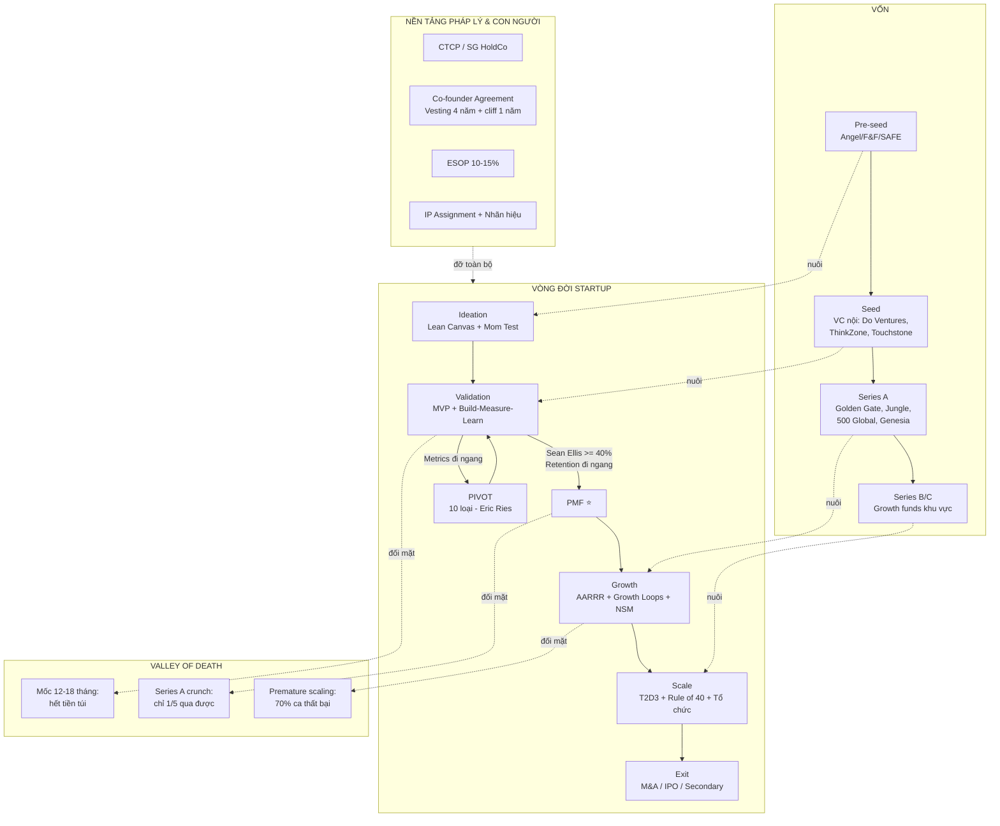

# BT01 — Startup (Doanh Nghiệp Khởi Nghiệp Đổi Mới Sáng Tạo)

> **Startup** là một tổ chức tạm thời được thiết kế để **tìm kiếm một business model có thể lặp lại và mở rộng quy mô** (repeatable & scalable) trong điều kiện bất định cực cao — khác căn bản với SME (vận hành một business model đã được kiểm chứng). Startup đánh đổi lợi nhuận ngắn hạn lấy tăng trưởng nhanh, thường được nuôi bằng vốn đầu tư mạo hiểm (venture capital), và có đích đến là Exit (M&A hoặc IPO).

---

## 01. Định Nghĩa

### 1.1 Ba định nghĩa kinh điển

| Tác giả | Định nghĩa | Từ khóa |
|---|---|---|
| **Steve Blank** | "A startup is a temporary organization designed to search for a repeatable and scalable business model" | Temporary, Search, Scalable |
| **Eric Ries** (The Lean Startup) | "A human institution designed to create a new product or service under conditions of extreme uncertainty" | Uncertainty, New product |
| **Paul Graham** (Y Combinator) | "A startup is a company designed to grow fast. Being newly founded does not in itself make a company a startup" | Growth |

### 1.2 Startup ≠ SME — Bảng phân biệt cốt lõi

| Tiêu chí | Startup | SME (Doanh nghiệp vừa & nhỏ) |
|---|---|---|
| Mục tiêu | Tìm business model mới, tăng trưởng đột phá | Vận hành model đã kiểm chứng, lợi nhuận ổn định |
| Tăng trưởng kỳ vọng | 5-10x/năm (giai đoạn đầu) | 10-30%/năm |
| Rủi ro | Cực cao (~90% thất bại) | Trung bình |
| Nguồn vốn | VC, angel, SAFE, convertible note | Vốn tự có, vay ngân hàng |
| Thị trường mục tiêu | Lớn (TAM ≥ 1 tỷ USD lý tưởng) | Địa phương/ngách |
| Công nghệ | Thường là lõi tạo lợi thế | Công cụ hỗ trợ |
| Lợi nhuận | Chấp nhận lỗ nhiều năm (burn cash) | Cần dương sớm |
| Exit | M&A / IPO / secondary sale | Truyền đời, bán lại nhỏ lẻ |
| Sở hữu | Pha loãng qua nhiều vòng gọi vốn | Founder giữ đa số |

**Lưu ý VN:** Nghị định 94/2020/NĐ-CP và Luật Hỗ trợ DNNVV 2017 dùng thuật ngữ "**doanh nghiệp nhỏ và vừa khởi nghiệp sáng tạo**" — điều kiện: hoạt động < 5 năm, chưa chào bán chứng khoán ra công chúng, khai thác tài sản trí tuệ/công nghệ/mô hình kinh doanh mới.

### 1.3 Phân loại startup theo Steve Blank (6 loại)

1. **Lifestyle startup** — làm vì đam mê, không nhắm scale
2. **Small business startup** — nuôi sống gia đình (thực chất là SME)
3. **Scalable startup** — nhắm unicorn, VC-backed ← *trọng tâm module này*
4. **Buyable startup** — xây để bán cho big tech
5. **Large company startup** — đổi mới trong tập đoàn (corporate innovation)
6. **Social startup** — nhắm impact xã hội

---

## 02. Nguồn Gốc & Lịch Sử

### 2.1 Dòng thời gian thế giới

| Giai đoạn | Sự kiện | Ý nghĩa |
|---|---|---|
| 1946 | ARD (American Research & Development) — quỹ VC đầu tiên | Khai sinh venture capital |
| 1957-1968 | Fairchild Semiconductor → "Fairchildren" (Intel, AMD...) | Hình thành Silicon Valley |
| 1972 | Sequoia Capital, Kleiner Perkins thành lập | VC chuyên nghiệp hóa |
| 1995-2000 | Dot-com boom → bust (NASDAQ -78%) | Bài học đầu tiên về burn cash |
| 2005 | Y Combinator ra đời (Paul Graham) | Mô hình accelerator |
| 2008 | Steve Blank — Customer Development | Khoa học hóa khởi nghiệp |
| 2011 | Eric Ries — The Lean Startup | Build-Measure-Learn phổ cập |
| 2013 | Aileen Lee đặt tên "Unicorn" (startup ≥ 1 tỷ USD) | Chuẩn hóa thước đo thành công |
| 2021 | Đỉnh funding toàn cầu (~$640B) | ZIRP era — tiền rẻ |
| 2022-2024 | "Funding winter" — lãi suất tăng, định giá giảm | Chuyển từ growth-at-all-costs → efficiency |

### 2.2 Dòng thời gian Việt Nam

| Năm | Sự kiện |
|---|---|
| 2004 | VNG (VinaGame) thành lập — sau này là kỳ lân đầu tiên của VN (2014) |
| 2007 | MoMo (M_Service) thành lập |
| 2010 | Tiki chuyển từ bán sách online sang e-commerce đa ngành |
| 2013 | Flappy Bird (Nguyễn Hà Đông) — VN xuất hiện trên bản đồ tech toàn cầu |
| 2016 | "Năm quốc gia khởi nghiệp"; Đề án 844 (hỗ trợ hệ sinh thái ĐMST đến 2025) |
| 2018 | Nghị định 38/2018/NĐ-CP về đầu tư cho DNNVV khởi nghiệp sáng tạo |
| 2018 | Do Ventures tiền thân; các quỹ nội địa bắt đầu chuyên nghiệp hóa |
| 2021 | Đỉnh funding VN ~1,4 tỷ USD; Sky Mavis (Axie Infinity) đạt ~3 tỷ USD định giá; MoMo thành kỳ lân |
| 2021 | Base.vn exit cho FPT — thương vụ M&A SaaS tiêu biểu |
| 2023 | VNG nộp hồ sơ IPO Nasdaq (sau đó rút); funding VN giảm còn ~530 triệu USD |
| 2024 | Telio đóng cửa; hệ sinh thái bước vào giai đoạn thanh lọc, ~100 thương vụ/năm |

---

## 03. Vị Trí Trong Business OS

```
BUSINESS OS
├── Foundation (F)          ← F01 Tư duy kinh doanh (prerequisite)
├── Business Model (B)      ← B01 Business Model Canvas (prerequisite)
├── Strategy (S)            ← S01 Chiến lược căn bản (prerequisite)
├── Finance (FI)            ← FI01 Tài chính căn bản (prerequisite)
├── ...
└── Business Types (BT)     ← BẠN Ở ĐÂY
    ├── BT01 Startup ★
    ├── BT02 SME
    ├── BT03 Franchise
    ├── BT04 Family Business
    └── BT05 Corporation
```

**Vai trò của BT01:** Là module "tổng hợp ứng dụng" — lấy kiến thức nền (business model, strategy, finance, HR, legal, marketing) và áp vào bối cảnh đặc thù: **bất định cao, tài nguyên khan hiếm, tốc độ là sống còn**. Học viên nên hoàn thành F01, B01, S01, FI01 trước để hiểu unit economics, business model canvas và tư duy chiến lược.

---

## 04. Khái Niệm Cốt Lõi

| Thuật ngữ | Định nghĩa ngắn | Ghi chú |
|---|---|---|
| **Product-Market Fit (PMF)** | Sản phẩm thỏa mãn một thị trường tốt (Marc Andreessen) | Mốc sống còn số 1 |
| **MVP** (Minimum Viable Product) | Phiên bản tối thiểu đủ để học từ khách hàng | Không phải sản phẩm "rẻ tiền" |
| **Runway** | Số tháng còn sống được với tiền hiện có = Cash ÷ Net Burn | Chuẩn an toàn: ≥ 18 tháng sau gọi vốn |
| **Burn rate** | Tiền tiêu ròng mỗi tháng (Gross burn vs Net burn) | Net burn = chi - thu |
| **Pivot** | Thay đổi có cấu trúc một giả thuyết cốt lõi của business model | Không phải "đổi nghề" |
| **Traction** | Bằng chứng định lượng thị trường muốn sản phẩm | Doanh thu, user, retention |
| **CAC** | Customer Acquisition Cost — chi phí có 1 khách hàng | |
| **LTV** | Lifetime Value — giá trị trọn đời 1 khách hàng | LTV/CAC ≥ 3 là chuẩn |
| **Dilution** | Pha loãng sở hữu khi phát hành cổ phần mới | 15-25%/vòng là thông lệ |
| **Cap table** | Bảng cơ cấu sở hữu cổ phần | |
| **Vesting** | Cổ phần "chín" dần theo thời gian | Chuẩn: 4 năm + 1 năm cliff |
| **Term sheet** | Thỏa thuận điều khoản đầu tư (chưa ràng buộc, trừ vài điều khoản) | |
| **Unicorn** | Startup định giá ≥ 1 tỷ USD | VN: VNG, MoMo, Sky Mavis, VNLife |
| **TAM/SAM/SOM** | Total/Serviceable/Obtainable Market | Định cỡ thị trường |
| **North Star Metric** | Chỉ số duy nhất phản ánh giá trị cốt lõi giao cho khách hàng | |
| **Churn** | Tỷ lệ khách hàng rời bỏ theo kỳ | |
| **ESOP** | Employee Stock Ownership Plan | Pool chuẩn: 10-15% |

---

## 05. Nguyên Lý

### 5.1 Bảy nguyên lý vận hành startup

1. **Search, don't execute** — Trước PMF, mọi thứ là giả thuyết cần kiểm chứng, không phải kế hoạch cần thực thi (Steve Blank).
2. **Speed of learning = lợi thế cạnh tranh duy nhất** — Startup thắng không phải vì ý tưởng hay hơn mà vì học nhanh hơn (vòng Build-Measure-Learn ngắn hơn).
3. **Default alive vs Default dead** (Paul Graham) — Với growth và burn hiện tại, công ty có tự đạt hòa vốn trước khi hết tiền không? Founder phải trả lời được câu này mọi thời điểm.
4. **Do things that don't scale** (Paul Graham) — Giai đoạn đầu, làm thủ công để hiểu khách hàng; tối ưu hóa là việc của giai đoạn sau.
5. **Growth che giấu mọi vấn đề, thiếu growth phơi bày mọi vấn đề** — nhưng premature scaling (scale trước PMF) là nguyên nhân chết hàng đầu.
6. **Fundraising là phương tiện, không phải thành tích** — Gọi vốn thành công chỉ mua thêm thời gian để tìm PMF; định giá cao khi chưa xứng là "poison pill" cho vòng sau (down round).
7. **Equity là tài sản đắt nhất** — Mỗi 1% cổ phần cho đi ở seed có thể đáng hàng triệu USD lúc exit; chi tiêu equity cẩn trọng như chi tiền mặt.

### 5.2 Nguyên lý bất định (điều làm startup khác SME)

```
SME:      Known problem  + Known solution  → EXECUTE  (quản trị vận hành)
Startup:  Unknown problem/Unknown solution → SEARCH   (quản trị thí nghiệm)

Hệ quả:
- Kế hoạch 5 năm là vô nghĩa trước PMF → dùng hypothesis roadmap
- KPI vận hành (hiệu suất) vô nghĩa → dùng learning milestones
- Tuyển "người giỏi vận hành" quá sớm là lãng phí → cần "người giỏi khám phá"
```

---

## 06. Frameworks

### 6.1 Bảng tổng hợp frameworks chính

| Framework | Tác giả | Dùng khi nào | Module liên quan |
|---|---|---|---|
| **Lean Startup** (Build-Measure-Learn) | Eric Ries | Trước PMF | §22 |
| **Customer Development** (4 bước) | Steve Blank | Khám phá khách hàng | §22 |
| **Business Model Canvas / Lean Canvas** | Osterwalder / Ash Maurya | Thiết kế & kiểm chứng model | B01 |
| **Sean Ellis Test** | Sean Ellis | Đo PMF | §23 |
| **AARRR (Pirate Metrics)** | Dave McClure | Thiết kế phễu growth | §31 |
| **Growth Loops** | Reforge | Growth sau PMF | §31 |
| **T2D3** (Triple-Triple-Double-Double-Double) | Neeraj Agrawal | Lộ trình ARR SaaS | §32 |
| **Rule of 40** | Brad Feld phổ biến | Cân bằng growth & margin | §32 |
| **Blitzscaling** | Reid Hoffman | Scale khi winner-take-all | §21 |
| **The Mom Test** | Rob Fitzpatrick | Phỏng vấn khách hàng đúng cách | §22 |
| **Jobs-to-be-Done** | Clayton Christensen | Hiểu nhu cầu thật | B01 |

### 6.2 Ba framework đào sâu nhanh

**(a) Lean Canvas vs Business Model Canvas — vì sao startup dùng Lean Canvas:**

| | Business Model Canvas (B01) | Lean Canvas (Ash Maurya) |
|---|---|---|
| Thay Key Partners → | | **Problem** (top 3 vấn đề) |
| Thay Key Activities → | | **Solution** (top 3 tính năng) |
| Thay Key Resources → | | **Key Metrics** |
| Thay Customer Relationships → | | **Unfair Advantage** |
| Tối ưu cho | Doanh nghiệp đang vận hành | Startup pre-PMF (tập trung vào rủi ro) |

Logic: trước PMF, rủi ro lớn nhất nằm ở *problem/solution fit* chứ không ở *đối tác/nguồn lực* — Lean Canvas ép founder đối diện đúng rủi ro.

**(b) Blitzscaling (Reid Hoffman) — khi nào được phép "đốt":**

Blitzscaling = ưu tiên TỐC ĐỘ hơn HIỆU QUẢ trong môi trường bất định — chỉ hợp lệ khi hội đủ 3 điều kiện: (1) thị trường winner-take-most (network effects mạnh); (2) đã có PMF; (3) tiếp cận được vốn lớn hơn đối thủ. Thiếu bất kỳ điều kiện nào → blitzscaling = premature scaling = tự sát (Telio, §38.2 là minh chứng: đốt tốc độ trong thị trường KHÔNG winner-take-most). Grab thắng tại VN nhờ hội đủ cả 3; Tiki thua vì thiếu điều kiện (3).

**(c) Jobs-to-be-Done (Christensen) — câu hỏi "thuê" sản phẩm:**

Khách hàng không "mua sản phẩm", họ "thuê" nó để làm một *việc* (job) — gồm chiều chức năng, cảm xúc, xã hội. Câu khuôn mẫu: *"Khi [hoàn cảnh], tôi muốn [động lực], để [kết quả mong đợi]"*. Ví dụ VN: người dùng không "thuê" MoMo để "thanh toán điện tử" — họ thuê để "trả tiền trong 5 giây không phải xếp hàng, và không bị lẻ tiền" (chức năng) + "thấy mình hiện đại" (xã hội). Đối thủ thật của ví điện tử giai đoạn đầu không phải ví khác — mà là *tiền mặt* (non-consumption).

### 6.3 Chọn framework theo giai đoạn

```
Ideation ──────► dùng: Lean Canvas, Mom Test, JTBD
Pre-PMF ───────► dùng: Customer Development, Build-Measure-Learn, MVP
Đo PMF ────────► dùng: Sean Ellis Test, Retention Curve, NPS
Post-PMF ──────► dùng: AARRR, Growth Loops, North Star Metric
Scale ─────────► dùng: T2D3, Rule of 40, Blitzscaling, OKR (HR03)
```

---

## 07. Quy Trình

### 7.1 Quy trình khởi nghiệp chuẩn 8 bước (Ideation → Exit)

```
[1] IDEATION            Tìm problem đáng giải (painkiller > vitamin)
     │                  Output: Problem statement + Lean Canvas v1
     ▼
[2] VALIDATION          20-50 customer interviews (Mom Test)
     │                  Output: Validated problem, ICP sơ bộ
     ▼
[3] MVP                 Build nhanh nhất có thể (2-12 tuần)
     │                  Output: MVP + metric baseline
     ▼
[4] ITERATE / PIVOT     Build-Measure-Learn loops
     │                  Output: PMF signals (retention flattens, Sean Ellis ≥ 40%)
     ▼
[5] PMF ★               Mốc sống còn — chỉ ~1/10 startup đến được đây
     │
     ▼
[6] GROWTH              Đổ xăng: growth engine, gọi Series A
     │                  Output: Repeatable go-to-market
     ▼
[7] SCALE               Mở rộng thị trường/sản phẩm, xây tổ chức
     │                  Output: Market leadership, Series B/C
     ▼
[8] EXIT                M&A / IPO / Secondary
```

### 7.2 Nhịp vận hành (operating cadence) khuyến nghị

| Nhịp | Hoạt động | Ai tham gia |
|---|---|---|
| Hàng ngày | Standup 15', xem metric dashboard | Cả team |
| Hàng tuần | Review Build-Measure-Learn, quyết định thí nghiệm tuần sau | Founders + leads |
| Hàng tháng | Review burn/runway, cập nhật investor update | CEO + CFO/kế toán |
| Hàng quý | OKR review, board meeting, kiểm tra giả thuyết chiến lược | Founders + Board |
| Hàng năm | Chiến lược, kế hoạch gọi vốn, ESOP refresh | Founders + Board |

---

## 08. KPIs

### 8.1 KPI theo giai đoạn (chi tiết tại §32)

| Giai đoạn | KPI chính | Ngưỡng tham chiếu |
|---|---|---|
| Pre-PMF | Activation rate, Week-4 retention, Sean Ellis % | Retention curve đi ngang; Sean Ellis ≥ 40% |
| Seed | MRR growth MoM, burn multiple | Growth 15-20%/tháng; burn multiple < 2 |
| Series A | ARR, NRR, CAC payback | ARR ~$1M+ (SaaS); NRR ≥ 100%; payback < 12 tháng |
| Series B+ | Rule of 40, gross margin, LTV/CAC | Rule of 40 ≥ 40; LTV/CAC ≥ 3 |
| Pre-exit | EBITDA margin, revenue quality | Tùy ngành |

### 8.2 KPI "sức khỏe sinh tồn" (mọi giai đoạn)

```
Runway (tháng)        = Cash hiện có ÷ Net burn hàng tháng        [cảnh báo: < 9 tháng]
Net burn              = Tổng chi tiền mặt - Tổng thu tiền mặt
Burn multiple         = Net burn ÷ Net new ARR                     [tốt: <1.5 | ổn: 1.5-2 | xấu: >3]
Default alive?        = Với growth hiện tại, đạt break-even trước khi hết tiền?
```

---

## 09. RACI

**Ma trận RACI cho các quyết định trọng yếu của startup (giai đoạn Seed–Series A):**

| Quyết định / Hoạt động | CEO | Co-founder (CTO/CPO) | Board/Lead Investor | Team Leads | Luật sư/Advisor |
|---|---|---|---|---|---|
| Vision & chiến lược | A/R | C | C | I | I |
| Pivot business model | A | R | C | I | I |
| Gọi vốn (term sheet) | A/R | C | C (lead đàm phán phía họ) | I | C |
| Định giá & dilution | A | C | C | I | C |
| ESOP grant | A | C | C (thường cần board approval) | I | R (soạn văn bản) |
| Tuyển key hires (C-level) | A/R | C | C | I | I |
| Sa thải/layoff | A | C | I | R (thực thi) | C |
| Product roadmap | C | A/R | I | R | — |
| Ngân sách & burn | A/R | C | C | I | — |
| M&A / Exit | A | C | A (có veto qua protective provisions) | I | R |

> Lưu ý: sau khi nhận vốn, nhiều quyết định (phát hành cổ phần, vay lớn, bán công ty, thay đổi điều lệ) cần **board approval hoặc investor consent** theo protective provisions trong shareholders' agreement.

---

## 10. Công Cụ

| Nhóm | Công cụ quốc tế | Lựa chọn VN / chi phí thấp |
|---|---|---|
| Ý tưởng & canvas | Miro, Figjam, Leanstack | Draw.io, giấy A0 |
| Phỏng vấn KH | Calendly + Zoom, Dovetail | Google Meet + Sheets |
| No-code MVP | Bubble, Webflow, Glide, Zapier | Ladipage, Haravan, Google Forms |
| Analytics | Mixpanel, Amplitude, GA4 | GA4 (free), Firebase |
| Cohort/retention | Amplitude, June.so | SQL + Metabase (open-source) |
| CRM & sales | HubSpot, Pipedrive | Getfly, Base.vn, 1Office |
| Cap table | Carta, Pulley | Excel template + luật sư review |
| Fundraising | DocSend, Notion data room | Google Drive (phân quyền chặt) |
| Kế toán & lương | QuickBooks, Xero | MISA, FAST, Base HRM+ |
| Investor update | Visible.vc, Cabal | Email template hàng tháng |
| Pitch deck | Pitch.com, Canva | Canva, Google Slides |

**Nguyên tắc chọn tool:** trước PMF chỉ dùng tool free/rẻ; đừng mua "enterprise stack" khi chưa có doanh thu — chính tool cũng phải theo tinh thần MVP.

---

## 11. Best Practices

1. **Nói chuyện với khách hàng mỗi tuần** — founder trực tiếp làm sales/support ít nhất đến Series A (Airbnb, DoorDash đều vậy).
2. **Viết investor update hàng tháng ngay cả khi chưa có investor** — kỷ luật đo lường và minh bạch.
3. **Gọi vốn cho 18-24 tháng runway**, bắt đầu gọi khi còn ≥ 9 tháng — đàm phán từ thế mạnh.
4. **Ký co-founder agreement + vesting NGAY từ ngày đầu** — kể cả (đặc biệt là) khi các founder là bạn thân.
5. **Một North Star Metric duy nhất** — cả công ty biết con số tuần này là bao nhiêu.
6. **Instrument trước khi build** — không đo được thì không học được; gắn analytics từ dòng code đầu tiên.
7. **Trả lương founder đủ sống** — founder lo tiền chợ thì không nghĩ được chuyện lớn; nhưng không trả lương thị trường trước Series A.
8. **Giữ cap table sạch** — tránh: nhà đầu tư "kẹp" > 30% ở seed, cổ đông không đóng góp giữ % lớn, quá nhiều angel nhỏ lẻ không qua SPV.
9. **Pivot dựa trên data, không dựa trên cảm xúc** — đặt trước "kill criteria" cho mỗi thí nghiệm.
10. **Xây văn hóa bằng hành vi của founder, không bằng poster** — 10 nhân sự đầu tiên định hình DNA công ty.

---

## 12. Sai Lầm Phổ Biến

| # | Sai lầm | Hậu quả | Phòng tránh |
|---|---|---|---|
| 1 | Build 12 tháng mới ra mắt ("stealth mode") | Hết tiền trước khi học được gì | MVP ≤ 3 tháng, launch sớm |
| 2 | **Premature scaling** — đốt tiền marketing trước PMF | Nguyên nhân chết #1 (Startup Genome) | Chỉ scale khi retention giữ được |
| 3 | Chia equity 50/50 "cho công bằng" không vesting | Deadlock + dead equity khi 1 người rời đi | Vesting 4 năm + cliff, chia theo đóng góp |
| 4 | Yêu giải pháp thay vì yêu vấn đề | Xây thứ không ai cần (35% lý do fail — CB Insights) | Mom Test, 30+ interviews trước khi code |
| 5 | Định giá quá cao ở vòng sớm | Down round vòng sau, mất niềm tin | Định giá đủ tốt, chừa "room" tăng |
| 6 | Nhận tiền từ investor "độc hại" | Mất kiểm soát, xung đột chiến lược | Reference check investor như tuyển dụng |
| 7 | Không hiểu điều khoản term sheet (liquidation preference, anti-dilution) | Exit nhưng founder không còn gì | Thuê luật sư giỏi, học §26 |
| 8 | Tuyển "người của tập đoàn" quá sớm | Chi phí cao, không hợp văn hóa search | Tuyển generalist giai đoạn đầu |
| 9 | Vanity metrics (downloads, likes) thay vì retention/revenue | Tự lừa mình có traction | Actionable metrics (Eric Ries) |
| 10 | Founder ôm hết, không delegation sau 20 người | Nghẽn cổ chai, key person risk | Xây layer quản lý từ Series A |

---

## 13. Case Study Việt Nam (tóm tắt — chi tiết ở §36-38)

| Startup | Ngành | Bài học chính |
|---|---|---|
| **VNG** | Game → super platform | Kỳ lân đầu tiên (2014); bootstrapped giai đoạn đầu bằng dòng tiền game; hành trình IPO gian nan |
| **MoMo** | Fintech / e-wallet | Kiên trì 10+ năm trước khi bùng nổ; super app strategy; Series E ~200M USD (2021) |
| **Sky Mavis** | Blockchain gaming | Tăng trưởng viral toàn cầu; khủng hoảng Ronin hack 600M USD; quản trị rủi ro |
| **Tiki** | E-commerce | Cuộc chiến burn cash với Shopee/Lazada; bài học capital efficiency |
| **Base.vn** | B2B SaaS | Exit M&A cho FPT (2021) — con đường exit thực tế nhất tại VN |
| **Telio** | B2B e-commerce | Đóng cửa 2024 dù gọi ~52M USD — unit economics âm không cứu được bằng vốn |

---

## 14. Ví Dụ SME → Startup (minh họa tư duy)

**Bối cảnh:** Chị Lan có xưởng may đồng phục ở Bình Dương (SME, doanh thu 8 tỷ/năm). Con trai chị muốn "startup hóa".

| Khía cạnh | Hướng SME (hiện tại) | Hướng Startup (chuyển đổi) |
|---|---|---|
| Sản phẩm | May đồng phục theo đơn | Nền tảng đặt may đồng phục online cho SME toàn quốc, thiết kế 3D, kết nối 200 xưởng |
| Thị trường | Bình Dương + mối quen | TAM: thị trường đồng phục VN ~10.000 tỷ đồng/năm |
| Vốn | Vay ngân hàng thế chấp nhà xưởng | Gọi seed 500K USD đổi 15% |
| Rủi ro | Thấp — có đơn mới may | Cao — phải build platform, educate thị trường |
| Kết luận | **Không phải cứ startup là hơn.** Nếu mục tiêu là thu nhập ổn định → giữ SME. Nếu tin platform thắng và chấp nhận 90% rủi ro thất bại → startup. Hai game khác nhau, luật chơi khác nhau. | |

---

## 15. Checklist

### 15.1 Checklist trước khi nghỉ việc để khởi nghiệp

- [ ] Đã phỏng vấn ≥ 30 khách hàng tiềm năng về vấn đề (không pitch giải pháp)
- [ ] Có ≥ 6 tháng chi phí sinh hoạt cá nhân dự phòng
- [ ] Co-founder (nếu có) đã cùng làm side project ≥ 3 tháng
- [ ] Vợ/chồng/gia đình đồng thuận về rủi ro tài chính
- [ ] Kiểm tra hợp đồng lao động cũ: điều khoản non-compete, IP assignment

### 15.2 Checklist thành lập (VN)

- [ ] Chọn loại hình: TNHH (đơn giản) vs CTCP (nếu sẽ gọi vốn/ESOP) — xem §29
- [ ] Đăng ký ngành nghề đủ rộng (thêm mã ngành dự phòng)
- [ ] Ký Co-founder Agreement: equity, vesting, vai trò, điều khoản rời đi
- [ ] Ký IP Assignment: mọi code/design/brand thuộc công ty, không thuộc cá nhân
- [ ] Đăng ký nhãn hiệu tại Cục SHTT (trước khi nổi tiếng!)
- [ ] Mở tài khoản ngân hàng, chữ ký số, hóa đơn điện tử, khai thuế ban đầu
- [ ] Tách bạch tài chính cá nhân — công ty từ ngày 1

### 15.3 Checklist trước khi gọi vốn

- [ ] Data room: BCTC, hợp đồng lớn, cap table, giấy phép, IP
- [ ] Pitch deck 10-15 slides + financial model 3 năm
- [ ] Metrics dashboard: MRR, growth, retention, CAC, burn, runway
- [ ] Cap table sạch (không dead equity > 10%)
- [ ] Danh sách 30-50 investor phù hợp stage/ngành, warm intro
- [ ] Luật sư đã review template term sheet phổ biến

---

## 16. SOP

### SOP-BT01-01: Quy trình chạy một thí nghiệm Build-Measure-Learn (1-2 tuần/vòng)

```
BƯỚC 1 — GIẢ THUYẾT (0.5 ngày)
  Viết: "Chúng tôi tin rằng [phân khúc X] sẽ [hành vi Y] vì [lý do Z]"
  Định trước: metric đo + ngưỡng pass/fail + deadline
  Ví dụ: "≥ 10% người xem landing page để lại SĐT trong 7 ngày"

BƯỚC 2 — BUILD TỐI THIỂU (1-5 ngày)
  Chọn dạng MVP rẻ nhất đủ kiểm chứng:
  Landing page → Concierge → Wizard of Oz → Prototype → MVP thật

BƯỚC 3 — MEASURE (3-7 ngày)
  Đưa trước ≥ 100 người thuộc đúng phân khúc
  Ghi số liệu + ghi chú định tính (5 cuộc gọi follow-up)

BƯỚC 4 — LEARN & QUYẾT ĐỊNH (0.5 ngày, họp cả team)
  PASS  → nhân đôi (double down), giả thuyết tiếp theo
  FAIL  → hỏi "sai ở giả thuyết hay ở cách test?" → sửa test HOẶC pivot
  Ghi vào Learning Log (bắt buộc — tài sản quý nhất trước PMF)
```

### SOP-BT01-02: Quy trình gọi vốn (3-6 tháng)

```
T-3 tháng : Chuẩn bị deck, data room, model; list 40+ investors; xin warm intro
T-2 tháng : First meetings (nén vào 2-3 tuần để tạo momentum/FOMO)
T-1 tháng : Partner meetings, due diligence sơ bộ, nhận term sheets
T-0       : So sánh term sheets (không chỉ valuation!), chọn lead, ký
T+1→2 tháng: Legal DD, ký SHA/SPA, closing, tiền về tài khoản
Sau close : Investor update tháng đầu tiên ngay — xây niềm tin từ sớm
```

---

## 17. Template

### 17.1 Template One-Page Lean Canvas (điền trong 30 phút)

```
┌─────────────┬─────────────┬──────────────┬─────────────┬─────────────┐
│ PROBLEM     │ SOLUTION    │ UNIQUE VALUE │ UNFAIR      │ CUSTOMER    │
│ Top 3 vấn đề│ Top 3 tính  │ PROPOSITION  │ ADVANTAGE   │ SEGMENTS    │
│ Giải pháp   │ năng        │ 1 câu khác   │ Thứ không   │ Early       │
│ hiện tại    │             │ biệt         │ copy được   │ adopters?   │
├─────────────┴─────────────┼──────────────┼─────────────┴─────────────┤
│ KEY METRICS               │              │ CHANNELS                  │
│ Con số nào chứng minh?    │              │ Đường đến khách hàng      │
├───────────────────────────┴──────────────┴───────────────────────────┤
│ COST STRUCTURE                    │ REVENUE STREAMS                   │
│ CAC, hosting, lương...            │ Pricing model, LTV, gross margin  │
└───────────────────────────────────┴───────────────────────────────────┘
```

### 17.2 Template Investor Update hàng tháng

```
Subject: [Tên startup] — Update Tháng MM/YYYY

1. TL;DR (3 gạch đầu dòng)
2. METRICS: MRR ____ (±_% MoM) | Users ____ | Burn ____ | Runway ____ tháng
3. HIGHLIGHTS (3 điều tốt)  4. LOWLIGHTS (2-3 điều xấu — trung thực!)
5. ASKS: intro khách hàng/ứng viên/investor cụ thể
6. Cảm ơn: ai đã giúp tháng trước
```

### 17.3 Template điều khoản vesting founder (đưa luật sư soạn chi tiết)

```
- Tổng cổ phần founder A: __%, vesting 48 tháng, cliff 12 tháng
- Cliff: rời trước tháng 12 → 0%; đủ 12 tháng → nhận 25%; sau đó 1/48 mỗi tháng
- Good leaver / Bad leaver: định nghĩa rõ (bad leaver: vi phạm, cạnh tranh → mất phần chưa vest + công ty có quyền mua lại phần đã vest giá danh nghĩa)
- Acceleration: single/double trigger khi M&A (khuyến nghị double trigger)
```

---

## 18. Diagnostic Questions

**Tự chẩn đoán — trả lời trung thực 12 câu:**

1. Bạn mô tả được **vấn đề** trong 1 câu mà khách hàng gật đầu ngay không?
2. Tuần trước bạn nói chuyện với bao nhiêu khách hàng? (< 3 = báo động trước PMF)
3. Nếu tắt toàn bộ quảng cáo, tăng trưởng còn lại bao nhiêu? (organic %)
4. Retention curve của bạn có **đi ngang** không, hay về 0?
5. Bao nhiêu % user "rất thất vọng" nếu sản phẩm biến mất? (Sean Ellis — cần ≥ 40%)
6. Runway còn bao nhiêu tháng? Bạn **default alive hay default dead**?
7. LTV/CAC là bao nhiêu? Bạn có đo bằng cohort không hay chỉ ước lượng?
8. Nếu co-founder rời đi ngày mai, cổ phần xử lý thế nào? Có văn bản chưa?
9. Điều gì phải đúng để công ty này đáng 100 triệu USD? Điều đó đã được kiểm chứng chưa?
10. 3 giả thuyết rủi ro nhất hiện tại là gì? Thí nghiệm nào đang chạy để kiểm chứng?
11. Nhân viên số 1-10 có biết North Star Metric tuần này là bao nhiêu không?
12. Nếu hôm nay được đề nghị mua lại bằng 2x số vốn đã gọi, bạn bán không? (kiểm tra conviction + hiểu liquidation preference)

---

## 19. Liên Kết Modules

| Module | Quan hệ với BT01 |
|---|---|
| **F01 — Tư duy kinh doanh** | Prerequisite: tư duy giá trị, khách hàng |
| **B01 — Business Model Canvas** | Prerequisite: công cụ thiết kế model; BT01 dùng biến thể Lean Canvas |
| **S01 — Chiến lược căn bản** | Prerequisite: positioning, moat — áp vào chọn thị trường ngách |
| **FI01 — Tài chính căn bản** | Prerequisite: đọc P&L, cash flow — nền cho unit economics & burn |
| **FI02/FI03 — Tài chính nâng cao/Gọi vốn** | Mở rộng: valuation, term sheet chi tiết |
| **HR01/HR03 — Tuyển dụng/Hiệu suất** | Talent giai đoạn sớm (§33) dùng OKR từ HR03 |
| **M01/M02 — Marketing** | Growth (§31) là marketing trong điều kiện startup |
| **L01 — Pháp lý doanh nghiệp** | Nền cho §29 pháp lý startup VN |
| **PR01 — Quản lý sản phẩm** | MVP, roadmap, discovery |
| **IN01 — Đổi mới sáng tạo** | Corporate innovation — startup trong tập đoàn |
| **BT02 — SME** | Module "song sinh đối lập" — so sánh xuyên suốt |

---

## 20. Tài Liệu Tham Khảo

**Sách nền tảng:**
1. Eric Ries — *The Lean Startup* (2011)
2. Steve Blank & Bob Dorf — *The Startup Owner's Manual* (2012)
3. Rob Fitzpatrick — *The Mom Test* (2013)
4. Peter Thiel — *Zero to One* (2014)
5. Ben Horowitz — *The Hard Thing About Hard Things* (2014)
6. Brad Feld & Jason Mendelson — *Venture Deals* (term sheet bible)
7. Reid Hoffman — *Blitzscaling* (2018)
8. Ash Maurya — *Running Lean* (Lean Canvas)

**Nguồn online:**
- Paul Graham Essays (paulgraham.com) — đặc biệt "Do Things That Don't Scale", "Default Alive or Default Dead"
- Y Combinator Startup School (free)
- a16z, First Round Review, Lenny's Newsletter
- CB Insights — "Top Reasons Startups Fail"
- Startup Genome Report (hàng năm)

**Nguồn Việt Nam:**
- Do Ventures & Cento Ventures — *Vietnam Innovation & Tech Investment Report* (hàng năm)
- NIC (Trung tâm Đổi mới sáng tạo Quốc gia) — báo cáo hệ sinh thái
- Đề án 844 (dean844.most.gov.vn), Nghị định 38/2018/NĐ-CP, Nghị định 94/2020/NĐ-CP
- Topica Founder Institute reports (dữ liệu funding lịch sử)

---

# PHẦN CHUYÊN SÂU (Sections 21-40)

---

## 21. Startup Lifecycle & Valley of Death

### 21.1 Năm giai đoạn vòng đời

```
 Giá trị/
 Doanh thu
    ▲
    │                                                        ╱ EXIT
    │                                              SCALE   ╱   (IPO/M&A)
    │                                            ╱────────╱
    │                                 GROWTH   ╱
    │                              ╱──────────╱
    │                    PMF ★   ╱
    │          ┌────────●───────╱
    │ IDEATION │  ╲            ╱
    │──────────┘   ╲__________╱  ← VALLEY OF DEATH
    │                (âm dòng tiền, chưa có model)
    └────────────────────────────────────────────────────────► Thời gian
      0-6 tháng   6-24 tháng    2-4 năm      4-7 năm      7-10+ năm
```

| Giai đoạn | Câu hỏi trung tâm | Nguồn tiền | Rủi ro chết chính |
|---|---|---|---|
| **Ideation** (0-6 tháng) | Vấn đề có thật không? | Tiền túi, F&F | Yêu giải pháp, không validate |
| **Validation/Pre-PMF** (6-24 tháng) | Ai trả tiền, vì sao? | Pre-seed, Seed | Hết tiền trước khi tìm ra PMF |
| **PMF → Growth** (2-4 năm) | Nhân bản việc bán thế nào? | Series A | Scale kênh sai, CAC vượt LTV |
| **Scale** (4-7 năm) | Xây tổ chức + mở thị trường thế nào? | Series B/C | Văn hóa vỡ, cạnh tranh đốt tiền |
| **Exit** (7-10+ năm) | Trả lại giá trị cho ai, cách nào? | IPO/M&A | Cửa exit đóng (thị trường xấu) |

### 21.2 Valley of Death — các "mốc chết"

**Valley of Death** = vùng giữa lúc bắt đầu tiêu tiền và lúc dòng tiền dương/gọi được vòng kế — nơi phần lớn startup chết.

Ba "mốc chết" thống kê được:

1. **Tháng 12-18:** hết tiền túi + F&F, chưa đủ traction gọi seed. Thoát bằng: sống tối giản, doanh thu dịch vụ nuôi sản phẩm (không quá 50% thời gian), grant/accelerator.
2. **Sau Seed, trước Series A ("Series A crunch"):** chỉ khoảng **1/5 startup có seed gọi được Series A**. Chết vì: growth tốt nhưng không đủ tốt (cần 2-3x/năm), unit economics chưa chứng minh.
3. **Series B/C — premature scaling:** đã có PMF ở phân khúc hẹp nhưng scale sang phân khúc mới thất bại; chi phí cố định phình to (văn phòng, headcount) trong khi model mới chưa chạy.

**Quy tắc thoát valley:** mỗi vòng vốn phải mua đủ runway để đạt **milestone của vòng kế tiếp** (không phải chỉ "sống thêm 18 tháng"). Gọi seed → phải trả lời "milestone gì mở khóa Series A?"

### 21.3 Công việc của founder thay đổi theo giai đoạn

| Giai đoạn | Founder dành thời gian cho | Founder PHẢI NGỪNG làm | Quy mô team |
|---|---|---|---|
| Ideation | 70% nói chuyện khách hàng, 30% prototype | Viết business plan 50 trang | 1-3 |
| Pre-PMF | 50% product, 30% khách hàng, 20% tuyển | Dự event networking triền miên | 3-10 |
| PMF→Growth | 40% tuyển key hires, 30% fundraise, 30% product | Tự code/tự design mọi thứ | 10-40 |
| Scale | 40% con người & văn hóa, 30% chiến lược, 30% đối ngoại | Quyết định vận hành hàng ngày | 40-200+ |
| Pre-exit | 40% quan hệ acquirer/banker, 30% kế nhiệm, 30% số liệu | Ra tính năng "để cho vui" | 200+ |

**Điểm gãy của founder ("founder ceiling"):** kỹ năng đưa công ty từ 0→1 (tốc độ, trực giác, ôm việc) trở thành *điểm nghẽn* ở giai đoạn 10→100 (cần hệ thống, delegation, quản trị). Ba lối xử lý: founder tự nâng cấp (executive coach — chuẩn ở US, đang phổ biến ở VN), thuê COO/CEO chuyên nghiệp (mô hình "Rich"), hoặc lùi về vai trò sản phẩm/công nghệ. Tự nhận ra ceiling của mình trước khi board nhận ra — là kỹ năng sống còn.

### 21.4 Ba "chế độ vận hành" — nhận diện mình đang ở đâu

```
CHẾ ĐỘ SEARCH (pre-PMF)      CHẾ ĐỘ BUILD (PMF→Scale)    CHẾ ĐỘ PROTECT (leader)
─────────────────────        ─────────────────────       ─────────────────────
Đơn vị tiến bộ: giả thuyết   Đơn vị: tính năng/thị       Đơn vị: thị phần/margin
  được kiểm chứng              trường được chinh phục
KPI: learning velocity       KPI: growth + unit econ     KPI: Rule of 40, NRR
Tổ chức: 1 team phẳng        Tổ chức: squad theo mục     Tổ chức: BU + platform
Sai lầm chết người:          Sai lầm chết người:         Sai lầm chết người:
  execute quá sớm              search lại từ đầu           ngủ quên (bị disrupt)
```

---

## 22. Lean Startup: Build-Measure-Learn, MVP & Pivot

### 22.1 Vòng lặp Build-Measure-Learn (Eric Ries)

```
              IDEAS
                │
        ┌───── BUILD ─────┐
        │                 ▼
      LEARN            PRODUCT
        ▲                 │
        └──── MEASURE ◄───┘
              (DATA)

Mục tiêu: TỐI THIỂU HÓA TỔNG THỜI GIAN đi qua vòng lặp
(không phải tối ưu từng khâu riêng lẻ)
```

**3 khái niệm trụ cột:**
- **Validated learning:** đơn vị tiến bộ của startup không phải là "code đã viết" mà là "giả thuyết đã kiểm chứng".
- **Innovation accounting:** thay vì P&L truyền thống, đo (1) baseline metric → (2) tune the engine → (3) pivot or persevere.
- **Actionable vs Vanity metrics:** "1 triệu lượt tải" là vanity; "cohort tháng 3 giữ chân 45% sau 4 tuần, tăng từ 30% tháng 1" là actionable.

### 22.2 MVP — các dạng từ rẻ đến đắt

| Dạng MVP | Mô tả | Chi phí | Ví dụ nổi tiếng |
|---|---|---|---|
| Landing page / Smoke test | Trang mô tả + nút "Đăng ký" | 1-3 ngày | Buffer (đo click vào pricing) |
| Explainer video | Video demo tính năng chưa tồn tại | 1 tuần | Dropbox (75K signup qua đêm) |
| Concierge | Làm thủ công cho từng khách như dịch vụ | Vài tuần | Food on the Table |
| Wizard of Oz | Giao diện "tự động", sau lưng người làm tay | Vài tuần | Zappos (mua giày ở tiệm, tự ship) |
| Single-feature MVP | 1 tính năng lõi duy nhất | 1-3 tháng | Instagram (chỉ filter ảnh) |

**Sai lầm về MVP:** MVP không phải sản phẩm chất lượng thấp — nó phải **viable** (dùng được, giải quyết được lõi vấn đề) cho một nhóm hẹp early adopters. "Minimum" áp cho phạm vi tính năng, không áp cho trải nghiệm của tính năng lõi.

### 22.3 Mười loại Pivot (Eric Ries)

| # | Loại pivot | Thay đổi gì | Ví dụ |
|---|---|---|---|
| 1 | Zoom-in | 1 tính năng → toàn bộ sản phẩm | Instagram (từ Burbn) |
| 2 | Zoom-out | Sản phẩm → thành 1 tính năng của thứ lớn hơn | |
| 3 | Customer segment | Giữ sản phẩm, đổi khách hàng | Slack (game → chat công sở) |
| 4 | Customer need | Giữ khách hàng, giải vấn đề khác của họ | |
| 5 | Platform | App ↔ platform | Shopify (bán ván trượt → nền tảng) |
| 6 | Business architecture | High margin/low volume ↔ ngược lại | |
| 7 | Value capture | Đổi cách thu tiền (ads → subscription...) | |
| 8 | Engine of growth | Viral ↔ paid ↔ sticky | |
| 9 | Channel | Đổi kênh phân phối (direct → partner) | |
| 10 | Technology | Giữ vấn đề & khách, đổi công nghệ giải | |

**Khi nào pivot?** Metrics đi ngang dù đã tune engine nhiều vòng + team hết ý tưởng thí nghiệm mới + phỏng vấn khách hàng cho tín hiệu về một hướng khác rõ ràng hơn. **Nhịp khuyến nghị:** họp "pivot or persevere" mỗi 6-8 tuần trước PMF.

### 22.4 Customer Development (Steve Blank) — khung song hành

```
SEARCH (tìm model)                    EXECUTE (vận hành model)
┌──────────────┐  ┌──────────────┐   ┌──────────────┐  ┌──────────────┐
│ 1. Customer  │→ │ 2. Customer  │ → │ 3. Customer  │→ │ 4. Company   │
│  Discovery   │  │  Validation  │   │  Creation    │  │  Building    │
└──────┬───────┘  └──────────────┘   └──────────────┘  └──────────────┘
       ▲   PIVOT       │
       └───────────────┘  (chưa validate được → quay lại discovery)
```

**The Mom Test (Rob Fitzpatrick)** — 3 quy tắc phỏng vấn: (1) nói về đời sống của họ, không nói về ý tưởng của mình; (2) hỏi về hành vi quá khứ cụ thể, không hỏi ý kiến/tương lai ("Lần gần nhất anh gặp vấn đề này, anh đã làm gì?"); (3) nói ít, nghe nhiều. Lời khen là dữ liệu rác; cam kết (thời gian, tiền, reputation) mới là dữ liệu thật.

---

## 23. Product-Market Fit (PMF)

### 23.1 Định nghĩa

> **Marc Andreessen (2007):** "Product-market fit means being in a good market with a product that can satisfy that market." — Khi có PMF, bạn *cảm nhận được*: khách hàng kéo sản phẩm ra khỏi tay bạn nhanh hơn bạn kịp sản xuất; server quá tải; tuyển support không kịp. Khi chưa có, bạn *cũng cảm nhận được*: sales cycle dài lê thê, word-of-mouth bằng 0, review "meh".

Andreessen cũng nhấn mạnh: **"Market matters most"** — trong bộ ba team/product/market, thị trường tốt sẽ "kéo" sản phẩm ra khỏi startup; team giỏi với thị trường tồi vẫn thua.

### 23.2 Ba cách đo PMF

**(a) Sean Ellis Test — Quy tắc 40%**

Hỏi user đã dùng sản phẩm ≥ 2 lần trong 2 tuần gần nhất:

> *"Bạn cảm thấy thế nào nếu không còn được dùng [sản phẩm] nữa?"*
> - Rất thất vọng / Hơi thất vọng / Không thất vọng

```
% "Rất thất vọng" ≥ 40%  →  có tín hiệu PMF mạnh
25-40%                   →  gần — hỏi tiếp nhóm "rất thất vọng" họ quý điều gì, double down
< 25%                    →  chưa có PMF — quay lại discovery
```

Superhuman (Rahul Vohra) đã hệ thống hóa: đo % → phân khúc theo persona → chỉ tối ưu cho nhóm high-expectation → tăng từ 22% lên 58%.

**(b) Retention curve — bằng chứng "cứng" nhất**

```
% user còn
hoạt động
100%│●
    │  ●
    │    ●●
    │       ●●●
 40%│           ●●●●●●●●●●●●●●●●  ← ĐI NGANG = PMF (có nhóm user gắn bó)
    │
    │  ○
    │     ○○
    │         ○○○
  0%│               ○○○○○○○○○○○  ← VỀ 0 = KHÔNG PMF (leaky bucket)
    └──────────────────────────────► Tuần kể từ signup
     W0  W1  W2  W4  W8  W12
```

Ngưỡng "đi ngang" tốt tùy ngành: social/consumer app ~25%+, SaaS SMB ~60%+ (logo retention năm), SaaS enterprise ~85%+.

**(c) Tín hiệu định tính + kinh doanh:** organic/word-of-mouth chiếm > 40% tăng trưởng; khách chủ động hỏi "khi nào có tính năng X, tôi trả tiền trước"; sales cycle rút ngắn dần; NPS > 40.

### 23.3 PMF không phải nhị phân và không vĩnh viễn

- PMF theo **từng phân khúc**: có PMF với startup 10 người ≠ có PMF với ngân hàng.
- PMF **có thể mất**: thị trường đổi (Zoom sau COVID), đối thủ mới, nền tảng đổi luật (app phụ thuộc Facebook API).
- Sau PMF đầu tiên, mở rộng = đi tìm PMF mới (sản phẩm mới × thị trường mới) — quay lại mode "search" cho mảng đó.

---

## 24. Business Model & Unit Economics

### 24.1 Bộ công thức unit economics

```
CAC  = Tổng chi phí Sales & Marketing kỳ T ÷ Số khách hàng MỚI kỳ T
LTV  = ARPU × Gross Margin % × Thời gian sống trung bình (tháng)
     (hoặc: ARPU × GM% ÷ Churn rate tháng)
LTV/CAC          ≥ 3   (chuẩn lành mạnh; < 1 = mỗi khách mới là lỗ thêm)
CAC Payback      = CAC ÷ (ARPU × GM%)   → chuẩn: < 12 tháng (SaaS SMB), < 18-24 (enterprise)
Contribution margin = Giá bán - Chi phí biến đổi trên 1 đơn vị
```

### 24.2 Ví dụ tính bằng VNĐ — SaaS B2B Việt Nam

Startup SaaS quản lý bán hàng cho F&B, gói 500.000đ/tháng:

```
Chi phí S&M tháng 6:   180.000.000đ  (ads 100tr + 2 sales 50tr + tools 30tr)
Khách hàng mới:        120 nhà hàng
─────────────────────────────────────
CAC              = 180.000.000 ÷ 120        = 1.500.000đ/khách

ARPU             = 500.000đ/tháng
Gross margin     = 80%  (hosting + support = 20%)
Churn tháng      = 3,3%  → thời gian sống TB = 1/0,033 ≈ 30 tháng

LTV              = 500.000 × 80% × 30       = 12.000.000đ
LTV/CAC          = 12.000.000 ÷ 1.500.000   = 8,0   ✅ (rất tốt, > 3)
CAC Payback      = 1.500.000 ÷ 400.000      = 3,75 tháng ✅ (< 12)
```

**Phản ví dụ — e-commerce đốt tiền (mô phỏng bài học Telio/Tiki):**

```
CAC (khuyến mãi + ads)      = 250.000đ/khách
AOV (giá trị đơn TB)         = 300.000đ
Gross margin                 = 8%  → lãi gộp/đơn = 24.000đ
Tần suất mua                 = 4 đơn/năm, đời khách 2 năm
LTV = 24.000 × 4 × 2         = 192.000đ
LTV/CAC = 192.000 ÷ 250.000  = 0,77  ❌ → càng scale càng lỗ sâu
→ Vốn gọi thêm chỉ trì hoãn cái chết, không sửa được model.
```

### 24.3 Cohort analysis — cách đọc đúng

| Cohort (tháng đăng ký) | M0 | M1 | M2 | M3 | M6 |
|---|---|---|---|---|---|
| 2026-01 | 100% | 55% | 42% | 38% | 35% |
| 2026-02 | 100% | 60% | 48% | 44% | — |
| 2026-03 | 100% | 68% | 55% | — | — |

Đọc theo **đường chéo dọc**: retention M1 tăng 55% → 60% → 68% qua các cohort = sản phẩm đang tốt lên thật (validated learning). Số liệu blended (trộn mọi cohort) che giấu điều này — luôn tách cohort.

### 24.4 Chọn business model — ưu tiên cho startup

| Model | Ưu | Nhược | Phù hợp VN |
|---|---|---|---|
| SaaS subscription | Doanh thu lặp lại, dự báo được | Sales cycle B2B chậm | Base.vn, KiotViet |
| Transaction fee/take rate | Scale theo GMV | Take rate VN thấp (1-5%) | MoMo, Sendo |
| Marketplace | Network effects, moat mạnh | Chicken-and-egg, đốt tiền 2 phía | Grab, Ahamove |
| Freemium | CAC thấp, viral | Conversion 2-5%, cần volume lớn | Zalo (gián tiếp) |
| D2C e-commerce | Kiểm soát brand & data | Margin mỏng, logistics nặng | Coolmate |

---

## 25. Funding Stages

### 25.1 Bản đồ các vòng gọi vốn

```
 Pre-seed      Seed         Series A      Series B      Series C+     Exit
    │            │              │             │              │           │
────●────────────●──────────────●─────────────●──────────────●───────────●──►
 Ý tưởng +    Early         PMF +         Scale đã      Mở rộng      IPO /
 prototype    traction      growth        chứng minh    thị trường/   M&A
                            engine                      M&A nhỏ

 $50K-500K    $500K-3M      $3M-15M       $15M-50M      $50M+
 (VN thấp     (VN: 200K     (VN: 2-10M)   (VN: 10-30M)  (hiếm ở VN)
  hơn ~50%)    -1.5M)
```

| Vòng | Trạng thái cần có | Nguồn tiền điển hình | Dilution/vòng | Định giá tham chiếu VN |
|---|---|---|---|---|
| Pre-seed | Team + prototype + insight | Angel, F&F, accelerator | 5-15% | 0,5-3M USD post |
| Seed | Early traction, tín hiệu PMF | Seed VC, angel syndicate | 15-25% | 2-10M USD |
| Series A | PMF + growth engine lặp lại; SaaS ~$1M ARR | VC tổ chức (lead + follow) | 15-25% | 10-40M USD |
| Series B | Model đã scale, mở rộng | Growth VC, quỹ khu vực | 10-20% | 40-150M USD |
| Series C+ | Market leader, chuẩn bị exit | PE, sovereign funds, CVC | 5-15% | 150M+ |
| IPO/M&A | Xem §39 | Public market / acquirer | — | — |

### 25.2 Dilution qua các vòng — ví dụ số

```
                     Founders    ESOP     Seed inv.   Series A   Series B
Thành lập             100%        —          —           —          —
Lập ESOP 12%           88%       12%         —           —          —
Seed (bán 20%)        70,4%      9,6%       20%          —          —
Series A (bán 20%,
 top-up ESOP về 10%)  ~54%       10%        16%         20%         —
Series B (bán 15%)    ~46%       8,5%      13,6%        17%        15%
```

**Bài học:** sau Series B, founders thường còn 40-55%. Nếu seed đã bán 35-40% (lỗi phổ biến ở VN khi nhận "cá mập" nội địa), đến Series B founders < 30% → nhiều VC quốc tế từ chối đầu tư vì founder thiếu "skin in the game".

### 25.3 SAFE vs Convertible Note vs Equity

| Tiêu chí | SAFE | Convertible Note | Priced Equity |
|---|---|---|---|
| Bản chất | Quyền nhận cổ phần vòng sau | Khoản VAY chuyển đổi | Mua cổ phần ngay |
| Lãi suất | Không | Có (4-8%/năm) | Không |
| Maturity date | Không (không đáo hạn) | Có (12-24 tháng) → rủi ro bị đòi nợ | Không |
| Định giá lúc ký | Chưa (chỉ có cap + discount) | Chưa (cap + discount) | Có — đàm phán ngay |
| Chi phí pháp lý | Thấp (~vài trang) | Trung bình | Cao (SHA đầy đủ) |
| Tốc độ | Ngày | Tuần | 1-3 tháng |
| Phù hợp | Pre-seed/seed nhỏ | Bridge round | Từ seed lớn/Series A |
| Lưu ý VN | Luật VN chưa có khung SAFE chuẩn → thường ký ở **HoldCo Singapore**; ký trực tiếp với công ty VN cần cấu trúc lại thành hợp đồng vay chuyển đổi/hợp tác | Khả thi ở VN dạng khoản vay chuyển đổi nhưng thủ tục chuyển đổi nợ→vốn với nhà đầu tư ngoại phức tạp | Chuẩn mực nhất tại VN |

**Cơ chế SAFE — ví dụ:** Angel đầu tư 100.000 USD qua SAFE, valuation cap 4M USD, discount 20%. Vòng seed sau đó định giá 6M pre-money → SAFE chuyển đổi theo giá thấp hơn giữa (a) cap 4M và (b) 6M × 80% = 4,8M → dùng cap 4M → angel nhận cổ phần như thể đầu tư ở định giá 4M (được "thưởng" cho rủi ro vào sớm).

---

## 26. Cap Table & Term Sheet — Điều Khoản Sống Còn

### 26.1 Cap table mẫu sau vòng Seed

| Cổ đông | Số CP | % Fully Diluted | Ghi chú |
|---|---|---|---|
| Founder A (CEO) | 4.200.000 | 42,0% | Vesting 48 tháng, cliff 12 |
| Founder B (CTO) | 2.800.000 | 28,0% | Vesting 48 tháng, cliff 12 |
| ESOP pool | 1.000.000 | 10,0% | Đã grant 3%, còn 7% |
| Seed VC (lead) | 1.500.000 | 15,0% | Preferred, 1x non-participating |
| Angels (qua SPV) | 500.000 | 5,0% | Gom 8 angel vào 1 SPV — cap table sạch |
| **Tổng** | **10.000.000** | **100%** | |

### 26.2 Điều khoản term sheet founder PHẢI hiểu

| Điều khoản | Nghĩa là gì | Chuẩn thị trường | Cờ đỏ |
|---|---|---|---|
| **Liquidation preference** | Investor lấy lại X lần vốn TRƯỚC khi chia phần còn lại | 1x non-participating | ≥ 2x, hoặc participating ("double dip") |
| **Anti-dilution** | Bảo vệ investor khi down round | Broad-based weighted average | Full ratchet |
| **Pro-rata rights** | Quyền giữ % ở vòng sau | Chuẩn, nên cho | Super pro-rata ép quá mức |
| **Board seats** | Ghế HĐQT | Seed: 1 ghế investor; A: 2-1-2 (founders-inv-indep tùy) | Investor kiểm soát board sớm |
| **Protective provisions** | Danh sách việc cần investor consent | Bán công ty, phát hành CP, vay lớn | Danh sách quá dài (veto cả tuyển dụng, ngân sách nhỏ) |
| **Drag-along** | Đa số ép thiểu số cùng bán | Chuẩn | Ngưỡng kích hoạt quá thấp |
| **Founder vesting reset** | Investor yêu cầu founder vest lại | Đàm phán được (tính công thời gian đã làm) | Reset về 0 toàn bộ |
| **ESOP pre-money** | Pool ESOP tính vào pre-money → founder gánh dilution | Rất phổ biến — hãy đàm phán kích thước pool sát nhu cầu 18 tháng | Ép pool 20%+ pre-money |

**Ví dụ liquidation preference "ăn thịt" founder:** Gọi 10M USD, preference 2x participating. Exit 30M USD → investor lấy 20M (2x) + tiếp tục chia 25% của 10M còn lại = 22,5M; founders + team (75%) chia nhau 7,5M dù "trên giấy" công ty bán được 30M. → **Định giá cao đổi bằng điều khoản xấu là thua thiệt kép.**

---

## 27. Valuation — Định Giá Startup

### 27.1 Vì sao định giá startup khác DCF truyền thống

Startup pre-revenue/pre-profit: không có dòng tiền để chiết khấu → định giá = hàm của (quy mô cơ hội × đội ngũ × traction × **cung-cầu vốn trên bàn đàm phán**). Về bản chất, định giá vòng sớm là **giá của một quyền chọn (option)**, không phải giá trị nội tại.

### 27.2 Pre-money vs Post-money

```
Post-money = Pre-money + Số tiền đầu tư
% Investor  = Tiền đầu tư ÷ Post-money

Ví dụ: gọi 1M USD, pre-money 4M
→ Post-money = 5M; investor nhận 1/5 = 20%
Cùng deal nói "post-money 5M": nghĩa hoàn toàn giống nhau —
nhưng nếu ESOP 10% được yêu cầu "trong pre-money", founders gánh trọn 10% đó.
```

### 27.3 Các phương pháp

| Phương pháp | Cách làm | Dùng khi |
|---|---|---|
| **Comparable (thị trường)** | Multiple × metric của deal tương tự: SaaS 5-10x ARR (2024, giảm từ 20-30x thời 2021); e-commerce 0,5-1,5x GMV-revenue | Có revenue |
| **VC Method** | Exit value dự kiến ÷ ROI mục tiêu (10-20x seed) = post-money hôm nay | Mọi vòng sớm |
| **Scorecard/Berkus** | Chấm điểm team, product, market so với median khu vực | Pre-revenue |
| **DCF** | Chiết khấu dòng tiền, discount rate 30-60% | Series B+ có dự báo tin được |

**VC Method — ví dụ:** VC tin startup có thể exit 100M USD sau 7 năm, muốn 15x (bù rủi ro danh mục) → giá trị hôm nay = 100 ÷ 15 ≈ 6,7M post-money. Đầu tư 1,5M → nhận ~22%.

### 27.4 Thực tế định giá tại Việt Nam

- **Mặt bằng thấp hơn SG/US 30-50%** cùng stage: seed VN phổ biến post-money 2-8M USD; Series A 10-40M.
- **Multiple bị chiết khấu** vì: thanh khoản exit thấp (ít IPO tech), rủi ro pháp lý/chuyển vốn, thị trường nội địa vừa phải.
- **Cấu trúc offshore:** phần lớn deal từ seed lớn trở lên định giá và ký ở **HoldCo Singapore** (Singapore TopCo sở hữu OpCo Việt Nam) — chuẩn của Do Ventures, Jungle, Golden Gate... giúp dùng chuẩn pháp lý quen thuộc (SAFE, preference shares) và exit dễ hơn.
- **Bẫy định giá "ảo":** nhận định giá cao từ nhà đầu tư thiếu kinh nghiệm/chương trình truyền hình → vòng sau VC chuyên nghiệp định giá lại thấp hơn (down round) → anti-dilution kích hoạt, cap table nát. Chọn định giá *hợp lý* + investor *chất lượng* > định giá cao nhất.

---

## 28. Nguồn Vốn Tại Việt Nam

### 28.1 Bản đồ nguồn vốn theo giai đoạn

```
Giai đoạn:   Ideation ── Pre-seed ── Seed ── Series A ── B+
             ├ Tiền túi/F&F
             ├ Grant/Đề án 844, cuộc thi (Techfest...)
                    ├ Angel networks, iAngel
                    ├ Accelerators: Zone Startups, ThinkZone, VSV, VIISA(cũ)
                            ├ Quỹ nội: Do Ventures, Touchstone, VinaCapital V.
                            ├ Quỹ ngoại tại VN: 500 Global, Genesia, Nextrans
                                       ├ Jungle Ventures, Golden Gate Ventures
                                       ├ Monk's Hill, East Ventures, AC Ventures
                                                  ├ GIC, Temasek, Warburg,
                                                    SoftBank (deal lớn, hiếm)
```

### 28.2 Quỹ nội địa tiêu biểu

| Quỹ | Quy mô/Đặc điểm | Stage | Deal tiêu biểu |
|---|---|---|---|
| **Do Ventures** | ~50M USD (Fund I); sáng lập: Nguyễn Mạnh Dũng ("Shark Dzung") & Lê Hoàng Uyên Vy; xuất bản báo cáo hệ sinh thái uy tín nhất | Seed–Series A | F99, Selex Motors, Vuihoc, MFast |
| **Touchstone Partners** | ~50M USD; deep-tech friendly | Pre-seed–Seed | Selex, Forte Biotech |
| **VinaCapital Ventures** | ~100M USD; hậu thuẫn tập đoàn VinaCapital | Seed–Series B | Wee Digital, GlobalCare, Ecotruck |
| **ThinkZone Ventures** | ~60M USD; accelerator + fund, LP là tập đoàn nội (Phú Thái...) | Pre-seed–Seed | GIMO, Fundiin, EMDDI |
| **Zone Startups Vietnam** | Accelerator (mạng lưới Ryerson toàn cầu) | Ideation–Pre-seed | Chương trình tăng tốc + vốn nhỏ |
| **FPT Ventures / Viettel** (CVC) | Vốn tập đoàn — chiến lược | Seed–A | Base.vn (FPT mua đứt 2021) |

### 28.3 Quỹ ngoại hoạt động tích cực tại VN

| Quỹ | Gốc | Stage tại VN | Deal VN tiêu biểu |
|---|---|---|---|
| **500 Global (500 Startups Vietnam)** | US | Pre-seed–Seed, danh mục VN lớn nhất (~80 công ty) | Trusting Social, ELSA... |
| **Golden Gate Ventures** | SG | Seed–Series A | Appota, M Village |
| **Jungle Ventures** | SG | Series A-B | Kilo, Sociolla (khu vực) |
| **Genesia Ventures** | JP | Seed | Homedy, BuyMed, Manabie |
| **Nextrans** | KR | Seed | Ecomobi, Jobhopin |
| **Monk's Hill Ventures** | SG | Series A | Ru9, Dat Bike (khu vực) |
| **East Ventures / AC Ventures** | ID | Seed–A | Mở rộng từ Indonesia sang |
| **GGV/Sequoia SEA (Peak XV)/Insight** | US/Asia | Growth — chỉ deal nổi bật | Sky Mavis (a16z cũng vào) |

### 28.4 Angel & chương trình nhà nước

- **Angel:** iAngel Vietnam, các "shark" từ Shark Tank VN (lưu ý: nhiều deal trên sóng không giải ngân thật — tỷ lệ giải ngân sau DD thấp), angel là founder thế hệ trước (cựu VNG, Grab, Tiki alumni đang là nguồn angel chất lượng nhất).
- **Nghị định 38/2018/NĐ-CP:** khung pháp lý cho quỹ đầu tư khởi nghiệp sáng tạo trong nước (quỹ ≤ 30 nhà đầu tư, không góp quá 50% vốn điều lệ startup); địa phương được dùng ngân sách đối ứng đầu tư.
- **Đề án 844 (2016, mở rộng 2021):** hỗ trợ hệ sinh thái ĐMST quốc gia đến 2025 — tài trợ sự kiện (Techfest), đào tạo, không đầu tư trực tiếp vào startup.
- **NIC (Trung tâm ĐMST Quốc gia)** + Nghị định 94/2020: ưu đãi thuế cho NIC và startup trong NIC (cơ sở Hòa Lạc).
- **NATIF** (Quỹ đổi mới công nghệ quốc gia): tài trợ/cho vay dự án công nghệ.

**Lời khuyên thực chiến:** vốn nhà nước VN phù hợp cho grant nhỏ/uy tín thương hiệu, KHÔNG thay thế được VC — thủ tục giải ngân chậm, yêu cầu đối ứng và quyết toán phức tạp.

---

## 29. Pháp Lý Startup Việt Nam

### 29.1 Chọn loại hình: TNHH vs CTCP

| Tiêu chí | TNHH (1-2TV) | CTCP |
|---|---|---|
| Số thành viên | 1-50 | ≥ 3 cổ đông, không giới hạn |
| Chuyển nhượng vốn | Hạn chế (ưu tiên nội bộ, thủ tục) | Cổ phần tự do chuyển nhượng (sau 3 năm với cổ phần phổ thông của cổ đông sáng lập) |
| ESOP | Rất khó (không có "cổ phần" để grant) | Khả thi — phát hành cổ phần cho NLĐ |
| Nhiều loại cổ phần (ưu đãi) | Không | Có — preferred shares cho investor |
| Quản trị | Đơn giản | ĐHĐCĐ, HĐQT, BKS (phức tạp hơn) |
| Phù hợp | Giai đoạn rất sớm, chưa gọi vốn | **Chuẩn cho startup sẽ gọi vốn** |

**Lộ trình phổ biến:** TNHH lúc thành lập → chuyển đổi CTCP trước vòng gọi vốn priced đầu tiên (thủ tục chuyển đổi ~2-4 tuần). Hoặc lập CTCP ngay nếu có 3 founders.

### 29.2 Cấu trúc Singapore HoldCo (offshore)

```
Investors (SAFE/Preferred) ──► SG TopCo (Pte Ltd) ──100%──► VN OpCo (TNHH/CTCP)
Founders ─── cổ phần phổ thông ──┘
```
- **Vì sao:** công cụ đầu tư chuẩn (SAFE, preference shares), tòa/trọng tài SG, exit và chuyển tiền dễ, quen thuộc với VC quốc tế.
- **Chi phí:** setup 10-30K USD + duy trì; chuyển cấu trúc ("flip") sau khi đã có nhiều cổ đông VN rất tốn kém → nếu định gọi vốn ngoại lớn, cân nhắc flip sớm.
- **Rủi ro cần quản:** quy định chuyển nhượng vốn ra nước ngoài, thuế chuyển nhượng vốn (capital gains) khi flip, transfer pricing giữa TopCo–OpCo.

### 29.3 Nhận vốn nước ngoài trực tiếp vào công ty VN

Theo **Luật Đầu tư 2020** + Luật Doanh nghiệp 2020:
1. Investor ngoại mua cổ phần → thủ tục **đăng ký góp vốn/mua cổ phần** (M&A approval) tại Sở KH&ĐT nếu ngành có điều kiện hoặc sở hữu ngoại ≥ 50%.
2. Tiền vào qua **tài khoản vốn đầu tư trực tiếp (DICA)** — mở tại 1 ngân hàng VN; sai tài khoản = không hợp lệ, khó chuyển lợi nhuận/vốn ra sau này.
3. Ngành nghề hạn chế tiếp cận thị trường với NĐT ngoại (danh mục theo NĐ 31/2021): fintech trung gian thanh toán (giới hạn từng thời kỳ), quảng cáo, logistics... — kiểm tra trước khi hứa % với investor.
4. Thời gian thực tế: 1-3 tháng cho thủ tục (lâu hơn ký SAFE ở SG vài ngày — một lý do nữa của cấu trúc offshore).

### 29.4 ESOP theo luật VN

- Chỉ thực chất khả thi với **CTCP**: phát hành cổ phần theo chương trình lựa chọn cho NLĐ (ESOP) — cần ĐHĐCĐ thông qua; công ty đại chúng bị giới hạn ≤ 5%/năm (quy định chứng khoán), công ty chưa đại chúng linh hoạt hơn theo điều lệ.
- **Thuế:** NLĐ chịu thuế TNCN; điểm khó là thời điểm tính thuế và giá tính thuế khi cổ phần chưa có thanh khoản → nhiều startup dùng **phantom stock/thưởng gắn định giá** (trả tiền khi có sự kiện thanh khoản, tính như thu nhập tiền lương) hoặc **grant ESOP ở SG TopCo** (chuẩn quốc tế, vesting + strike price).
- **Thực hành tốt:** văn bản hóa ESOP plan (pool, công thức grant, vesting, xử lý khi nghỉ việc, quyền mua lại của công ty), truyền thông cho nhân viên hiểu giá trị *và* rủi ro.

### 29.5 IP assignment & bảo vệ tài sản trí tuệ

- **Mặc định nguy hiểm:** code do founder viết trước khi lập công ty thuộc về *cá nhân founder*; thuê freelancer không có điều khoản chuyển giao → IP thuộc freelancer. → Ký **IP Assignment** chuyển toàn bộ IP (trước và sau thành lập) vào công ty; điều khoản IP + bảo mật + non-solicit trong mọi hợp đồng lao động.
- Đăng ký **nhãn hiệu** tại Cục SHTT sớm (VN theo first-to-file; đã có nhiều startup bị "cướp" nhãn hiệu); sáng chế/kiểu dáng nếu deep-tech.
- Investor DD chắc chắn soát IP chain-of-title — lỗ hổng IP có thể giết deal.

---

## 30. Founder Issues: Equity Split, Vesting, Xung Đột

### 30.1 Chia equity giữa co-founders

**Nguyên tắc:** chia theo **đóng góp tương lai kỳ vọng**, không phải theo "ai nghĩ ra ý tưởng" (ý tưởng ~5% giá trị, thực thi ~95%).

Các yếu tố cân: full-time hay part-time; góp tiền mặt; vai trò không thay thế được (CTO deep-tech); kinh nghiệm/mạng lưới; ai là CEO (gánh fundraising, chịu trận).

| Cách chia | Khi nào | Rủi ro |
|---|---|---|
| Bằng nhau (50/50, 33/33/33) | Đóng góp thật sự tương đương, cùng full-time từ đầu | Deadlock 50/50 — cần cơ chế tie-break |
| Chênh lệch có lý do (60/40, 55/30/15) | Khác biệt rõ về commitment/vai trò | Người % thấp mất động lực nếu không minh bạch lý do |
| Dynamic equity (Slicing Pie) | Giai đoạn siêu sớm, đóng góp chưa rõ | Phức tạp, ít investor thích |

### 30.2 Vesting — cơ chế bắt buộc

```
Chuẩn thị trường: 4 NĂM + CLIFF 1 NĂM

% vested
100%│                                    ┌──── 48 tháng: full
    │                          ┌─────────┘
 50%│                ┌─────────┘  (mỗi tháng +1/48)
 25%│      ┌─────────┘
    │      │ ← CLIFF: tháng 12 nhận "cục" 25%
  0%│──────┘
    └──────┴─────────┴─────────┴─────────┴──► tháng
    0      12        24        36        48
Rời tháng 11 → 0%. Rời tháng 30 → 62,5%.
```

**Vì sao founder cũng phải vest:** bảo vệ những người ở lại. Không vesting + 1 founder nghỉ sau 8 tháng vẫn giữ 30% "dead equity" → người ở lại làm 10 năm nuôi người đã rời; investor nhìn cap table sẽ bỏ đi. Đây là lỗi gây chết startup VN cực phổ biến (nhóm bạn thân lập công ty, không ký gì).

### 30.3 Co-founder Agreement — nội dung tối thiểu

1. Equity split + vesting + cliff; 2. Vai trò, quyền quyết định, ai là CEO; 3. Cam kết full-time & non-compete; 4. IP assignment; 5. Good/bad leaver & quyền mua lại cổ phần; 6. Cơ chế giải quyết deadlock (ví dụ: advisor tie-break, shotgun clause); 7. Điều gì xảy ra khi nhận đầu tư (ai đàm phán, ngưỡng chấp nhận dilution); 8. Lương founder trước/sau gọi vốn.

### 30.4 Founder conflict — nguyên nhân & phòng ngừa

Thống kê Noam Wasserman (*The Founder's Dilemmas*): **65% startup thất bại có nguyên nhân chính từ xung đột đội ngũ sáng lập.** Nguồn xung đột hàng đầu: kỳ vọng công sức không khớp, tiền (lương/equity), quyền quyết định, khác vision khi pivot, "Rich vs King" (muốn giàu — chấp nhận pha loãng & CEO thuê ngoài, hay muốn quyền — giữ ghế bằng mọi giá).

**Phòng ngừa:** "phỏng vấn chéo" 50 câu hỏi khó trước khi cam kết (tiền, gia đình, ranh giới đạo đức); thử làm chung 1 dự án nhỏ ≥ 3 tháng; check-in founder 1-1 hàng tháng (nói chuyện quan hệ, không nói việc); ký văn bản khi trời còn nắng — hợp đồng tốt nhất là hợp đồng không bao giờ phải lôi ra dùng.

---

## 31. Growth: AARRR, Growth Loops, North Star Metric

### 31.1 AARRR — Pirate Metrics (Dave McClure, 500 Startups)

```
        ┌───────────────────────────────────────┐
        │  ACQUISITION   Người dùng đến từ đâu?  │  metric: visitors, CPC, CAC
        │  ↓                                     │
        │  ACTIVATION    Trải nghiệm "aha" đầu?  │  metric: % đạt aha-moment
        │  ↓                                     │
        │  RETENTION     Có quay lại không?      │  metric: D1/D7/D30, cohort
        │  ↓                                     │
        │  REFERRAL      Có giới thiệu không?    │  metric: NPS, k-factor, viral
        │  ↓                                     │
        │  REVENUE       Có trả tiền không?      │  metric: conversion, ARPU, LTV
        └───────────────────────────────────────┘
Thứ tự tối ưu ĐÚNG: Retention → Activation → Revenue → Referral → Acquisition
(sửa đáy phễu trước khi đổ nước vào — "đừng đổ nước vào xô thủng")
```

**Aha-moment nổi tiếng:** Facebook: "7 bạn trong 10 ngày"; Slack: "2.000 tin nhắn trong team"; Dropbox: "1 file trong 1 folder trên 1 thiết bị". → Bài tập bắt buộc: tìm aha-moment của bạn bằng tương quan retention.

### 31.2 Growth Loops vs Funnels

| | Funnel (AARRR) | Growth Loop |
|---|---|---|
| Hình dạng | Tuyến tính, một chiều | Vòng lặp — output nuôi input |
| Nguồn tăng trưởng | Phải "đổ" traffic liên tục | Tự nuôi (compounding) |
| Ví dụ | Ads → landing → signup | Người dùng tạo content → SEO → người mới → tạo content |

**Các loop kinh điển:** Viral loop (mời bạn được lợi ích — MoMo lì xì/giới thiệu nhận thưởng đã tăng trưởng hàng chục triệu user); Content/SEO loop (Tripadvisor, Canva); Paid loop (revenue cohort → tái đầu tư ads — chỉ bền khi payback ngắn); Marketplace loop (thêm cung → thêm cầu → thêm cung).

### 31.3 North Star Metric (NSM)

**Định nghĩa:** MỘT chỉ số phản ánh đúng nhất *giá trị khách hàng nhận được*, mà khi nó tăng thì doanh nghiệp tăng bền vững.

| Công ty | NSM | Vì sao không phải revenue? |
|---|---|---|
| Airbnb | Nights booked | Revenue là hệ quả trễ của đêm được đặt |
| Spotify | Time listening | Nghe nhiều → giữ chân → subscription |
| WhatsApp | Messages sent | |
| SaaS B2B VN (ví dụ Base.vn) | Weekly active companies dùng ≥ 2 module | Doanh nghiệp "sống" trong hệ = không churn |

Tiêu chí NSM tốt: đo *giá trị trao đi* (không phải giá trị thu về), dẫn dắt revenue, đo được hàng tuần, cả công ty tác động được. Sai lầm: chọn revenue làm NSM (lagging), hoặc có 5 "north stars" (= không có sao nào).

---

## 32. Startup Metrics Theo Stage

### 32.1 Bảng metrics chuẩn theo vòng

| Metric | Công thức | Seed | Series A | Series B+ |
|---|---|---|---|---|
| MRR/ARR | Doanh thu lặp lại tháng/năm | $10-50K MRR | ~$1M+ ARR (SaaS) | $5-10M+ ARR |
| Growth | MoM % | 15-20%/tháng | 2-3x/năm | T2D3 track |
| Gross churn (logo) | KH rời ÷ KH đầu kỳ | < 5%/tháng (SMB) | < 3%/tháng | < 2%/tháng |
| **NRR** (Net Revenue Retention) | (MRR đầu kỳ + expansion − churn − contraction) ÷ MRR đầu kỳ | > 90% | ≥ 100% | ≥ 110-120% (best-in-class) |
| LTV/CAC | §24 | Sơ bộ > 2 | ≥ 3 | ≥ 3, đo theo cohort |
| CAC payback | §24 | < 18 tháng | < 12 tháng | < 12 tháng |
| Gross margin | (Rev − COGS) ÷ Rev | Đang cải thiện | > 60% (SaaS 70-80%) | 70-80% |
| **Burn multiple** | Net burn ÷ Net new ARR | < 3 chấp nhận được | < 2 | < 1,5 (tốt), <1 (xuất sắc) |
| **Rule of 40** | Growth % + Profit margin % | — | — | ≥ 40 |

### 32.2 Giải nghĩa các chỉ số "gộp"

**T2D3 (Triple-Triple-Double-Double-Double):** lộ trình ARR SaaS từ ~$2M lên $144M trong 5 năm: 2→6→18→36→72→144 (M USD). Đây là nhịp tăng trưởng của các SaaS IPO thành công — dùng làm thước so, không phải nghĩa vụ.

**Rule of 40 — ví dụ:** tăng trưởng 60%/năm, margin −15% → 45 ✅ (chấp nhận lỗ vì growth cao). Tăng trưởng 15%, margin +10% → 25 ❌ (không đủ growth cũng không đủ lãi — "vùng chết").

**Burn multiple (David Sacks) — ví dụ:** năm nay đốt ròng 2M USD, thêm được 1,6M USD net new ARR → burn multiple = 1,25 ✅ hiệu quả. Đốt 5M để thêm 1M ARR → 5,0 ❌ mô hình đang phá giá trị.

**NRR — vì sao là "vua" của SaaS:** NRR 120% nghĩa là *không cần khách mới* doanh thu vẫn tăng 20%/năm (khách cũ mua thêm nhiều hơn phần churn mất đi) — nền tảng compounding của Snowflake, Datadog.

### 32.3 Metrics cho non-SaaS

| Loại hình | Metrics trung tâm |
|---|---|
| Marketplace | GMV, take rate %, liquidity (fill rate, time-to-match), repeat rate 2 phía |
| Fintech/e-wallet | TPV (total payment volume), take rate, active users giao dịch/tháng, CAC theo KYC hoàn tất |
| E-commerce/D2C | AOV, contribution margin/đơn, repeat purchase rate, % doanh thu từ khách cũ |
| Consumer app | DAU/MAU (stickiness ≥ 20% tốt), D30 retention, ARPDAU |

---

## 33. Talent: Tuyển Dụng, ESOP & Văn Hóa Giai Đoạn Sớm

### 33.1 Tuyển khi chưa có tiền — bán cái gì?

Không cạnh tranh được bằng lương (thường trả 60-80% thị trường trước Series A) → bán 4 thứ: (1) **Mission** đáng theo đuổi; (2) **Equity/ESOP** — upside thật, giải thích trung thực; (3) **Tốc độ phát triển cá nhân** — 1 năm startup = 3 năm tập đoàn về phạm vi việc; (4) **Ownership** — được quyết, được ghi tên.

**Trình tự tuyển chuẩn (0 → 50 người):**

| Nhân sự | Ưu tiên tuyển | Tránh |
|---|---|---|
| #1-5 | Generalist giỏi, chịu mơ hồ, tự vận hành ("athletes") | Chuyên gia hẹp, cần quy trình sẵn |
| #6-20 | Chuyên môn lõi (senior engineer, first sales, first marketer) | Quản lý cấp trung thuần "quản" |
| #21-50 | Bắt đầu có layer lead; first HR/finance in-house | Tuyển ồ ạt sau gọi vốn (hire slow!) |

Quy tắc: **hire slow, fire fast** (nhân sự sai ở team 10 người = 10% văn hóa hỏng); founder trực tiếp phỏng vấn đến ít nhất nhân sự #30.

### 33.2 ESOP pool & mức grant tham chiếu

```
Pool chuẩn: 10-15% fully diluted, lập trước vòng seed (investor sẽ yêu cầu)

Mức grant tham chiếu (theo thông lệ US/SEA — VN thường thấp hơn):
  C-level thuê ngoài (CTO/CPO đến sau):   1 - 5%
  VP/Head đến sớm (trước Series A):        0,5 - 2%
  Senior engineer #1-10:                   0,25 - 1%
  Nhân viên sớm khác:                      0,05 - 0,25%
Kèm: vesting 4 năm cliff 1 năm; refresh grant cho người ở lâu;
"bù trừ" lương-equity: nhận lương thấp hơn X% → equity cao hơn tương ứng.
```

Tại VN, do rào cản pháp lý (§29.4), truyền thông ESOP phải cực kỳ trung thực: điều kiện thanh khoản, kịch bản công ty thất bại (equity = 0), thuế. ESOP "hứa mồm" không văn bản là nguồn kiện tụng và mất niềm tin phổ biến nhất ở startup VN.

### 33.3 Văn hóa giai đoạn sớm

- Văn hóa = **hành vi được lặp lại và được thưởng**, không phải khẩu hiệu treo tường. 10 người đầu định hình DNA: họ tuyển tiếp người giống họ.
- Viết ra 3-5 giá trị *có thể dùng để ra quyết định* (test: giá trị đó có khiến bạn từ chối một deal/ứng viên hấp dẫn không? Nếu không bao giờ → sáo rỗng).
- Nghi thức tối thiểu: weekly all-hands (minh bạch số liệu kể cả tin xấu), demo day nội bộ, postmortem không đổ lỗi.
- Cảnh báo giai đoạn scale: 20→50 người là điểm gãy văn hóa đầu tiên — cần onboarding có chủ đích, văn bản hóa "cách chúng ta làm việc".

---

## 34. Thất Bại: Nguyên Nhân & Phòng Ngừa

### 34.1 Số liệu nền

- ~**90%** startup thất bại tổng thể; ~10% chết ngay năm đầu; nhóm chết lớn nhất rơi vào **năm 2-5**.
- Chỉ ~**1/5** công ty có seed đi được tới Series A; xác suất seed → unicorn ~1-2,5%.
- VN: không có thống kê chính thức đáng tin, ước tính của các accelerator ~80-95% startup không sống quá 5 năm — tương đương thế giới, nhưng "chết âm thầm" (zombie: còn pháp nhân, hết tăng trưởng) phổ biến hơn vì văn hóa ngại tuyên bố đóng cửa.

### 34.2 Top nguyên nhân (CB Insights — phân tích 100+ postmortems)

| # | Nguyên nhân | % | Thuộc nhóm |
|---|---|---|---|
| 1 | Hết tiền / không gọi được vốn mới | 38% | Tài chính |
| 2 | Không có nhu cầu thị trường (no market need) | 35% | PMF |
| 3 | Bị cạnh tranh vượt qua | 20% | Chiến lược |
| 4 | Business model sai (unit economics âm) | 19% | Model |
| 5 | Vấn đề pháp lý/regulatory | 18% | Pháp lý |
| 6 | Pricing/chi phí sai | 15% | Model |
| 7 | Team không phù hợp | 14% | Con người |
| 8 | Sản phẩm ra sai thời điểm | 10% | Timing |

(Lưu ý: nhiều nguyên nhân chồng nhau — "hết tiền" thường là *triệu chứng* của "no market need" hoặc "unit economics âm".)

### 34.3 Premature scaling — kẻ giết người thầm lặng

Startup Genome: **~70% startup thất bại có dấu hiệu premature scaling** — scale một chiều (tiền/người/marketing) trước khi chiều khác sẵn sàng (PMF/quy trình).

Triệu chứng: đốt ads lớn khi retention chưa đi ngang; tuyển 30 người khi chưa có PMF; mở 3 thành phố khi thành phố 1 chưa có lãi đơn vị; xây tính năng cho "khách hàng tương lai" bỏ rơi khách hiện tại. **Telio (§38) là case VN điển hình.**

### 34.4 Chết "đúng cách" (nếu phải chết)

Đặt trước **kill criteria** (runway < 6 tháng + không term sheet + growth < X% → kích hoạt kế hoạch B); các lối ra: acqui-hire, bán tài sản/IP, hoàn tiền investor phần còn lại (giữ uy tín — hệ sinh thái VN rất nhỏ, uy tín là tài sản gọi vốn cho startup tiếp theo); nghĩa vụ pháp lý khi giải thể: lương + BHXH nhân viên, thuế, chủ nợ — founder VN cần luật sư khi đóng công ty, tránh trách nhiệm cá nhân kéo dài.

---

## 35. Hệ Sinh Thái Startup Việt Nam

### 35.1 Số liệu funding 2019-2024

```
 Vốn đầu tư startup VN (triệu USD, tổng hợp từ báo cáo Do Ventures/Cento & NIC)

 1.400 ┤                    ████ ~1.442 (đỉnh)
 1.200 ┤                    ████
 1.000 ┤                    ████
   800 ┤  ████ ~861         ████  ████ ~634
   600 ┤  ████       ████   ████  ████   ████ ~529
   400 ┤  ████       ~451   ████  ████   ████    ████ ~400-500*
   200 ┤  ████       ████   ████  ████   ████    ████
     0 └──2019──────2020───2021──2022───2023────2024──
         * 2024: tiếp tục vùng đáy, ~100 thương vụ/năm; ticket seed chiếm đa số
```

Diễn giải: đỉnh 2021 (~1,4 tỷ USD) do sóng tiền rẻ toàn cầu + deal lớn (MoMo Series E ~200M, Sky Mavis 152M, VNLife 250M). 2022-2024 giảm 60-70% từ đỉnh — không phải "hệ sinh thái chết" mà là tái định giá về mặt bằng bền vững; vòng seed/pre-A vẫn hoạt động, vòng growth (B+) khan hiếm nhất.

### 35.2 So sánh khu vực (quy mô năm điển hình gần đây)

| Tiêu chí | Việt Nam | Indonesia | Singapore |
|---|---|---|---|
| Funding/năm | ~0,4-0,6B USD | ~1,5-3B USD | ~6-10B USD (hub, gồm deal khu vực) |
| Unicorns | 4 (VNG, VNLife, MoMo, Sky Mavis) | 10+ (GoTo, Traveloka...) | 15+ (Grab, Sea...) |
| Lợi thế | Kỹ sư giỏi-rẻ, dân số 100M trẻ, kinh tế số tăng nhanh nhất SEA (e-Conomy SEA) | Thị trường nội địa khổng lồ 270M | Vốn, pháp lý, talent quốc tế, cửa exit |
| Điểm nghẽn | Cửa exit hẹp (IPO tech khó), pháp lý đầu tư ngoại chậm, thiếu vốn growth-stage, sandbox fintech chậm | Hạ tầng, phân mảnh đảo | Thị trường nội địa nhỏ |
| Vai trò trong SEA | "Product & engineering hub" — build ở VN, HoldCo ở SG, bán khu vực | Thị trường tiêu thụ lớn nhất | Trụ sở vốn & pháp lý |

### 35.3 Verticals mạnh của VN

1. **Fintech** — hút vốn số 1 (thanh toán: MoMo, VNPay/VNLife, ZaloPay; BNPL/lending: Fundiin, F88; wealth: Finhay, Infina; earned-wage: GIMO, Vui App).
2. **Edtech** — dân số trẻ, chi tiêu giáo dục cao (ELSA Speak — AI luyện nói tiếng Anh đi toàn cầu, Vuihoc, Marathon).
3. **Logistics & e-commerce enablers** — Ahamove, Ninja Van VN, EcoTruck, OnPoint, Society Pass.
4. **Blockchain/Web3** — VN từng top toàn cầu về adoption (Sky Mavis, Kyber Network, Coin98) — sóng lên xuống rất mạnh.
5. **AI/deep-tech (nổi lên 2023+)** — làn sóng AI engineer VN, chính phủ đẩy bán dẫn/AI (NVIDIA hợp tác 2024); VinAI, FPT AI làm nền talent.
6. **Healthtech, proptech, agritech** — tiềm năng lớn, chưa có winner rõ.

### 35.4 Tác nhân hệ sinh thái

Hubs: TP.HCM (thương mại, fintech) & Hà Nội (deep-tech, gần chính sách), Đà Nẵng đang lên. Sự kiện: Techfest (quốc gia), Vietnam Ventures Summit. Hỗ trợ: NIC, SIHUB (HCM), BK Holdings, các vườn ươm ĐH. Cộng đồng alumni: cựu nhân sự VNG/Grab/Tiki/Momo là "mafia" sản sinh thế hệ founder & angel mới — network đáng giá nhất cho first-time founder.

---

## 36. Case Study VN (1): MoMo & VNG — Hai Con Đường Lên Kỳ Lân

### 36.1 MoMo — kiên trì 10 năm + super app

- **Hành trình:** thành lập 2007 (M_Service), khởi đầu là ví trên SIM/nạp thẻ; app ví điện tử 2014; hơn **8 năm "âm thầm"** giáo dục thị trường thanh toán khi tiền mặt chiếm 90%. Series C (Warburg Pincus, 2019) → Series D (2021) → **Series E ~200M USD (12/2021, Mizuho dẫn) — chính thức kỳ lân (~2B USD)**. Đạt hàng chục triệu người dùng, mạng lưới điểm chấp nhận phủ toàn quốc.
- **Chiến lược super app:** thanh toán là "mồi" tần suất cao → chồng dịch vụ margin tốt hơn: tài chính tiêu dùng, đầu tư, bảo hiểm, đi chợ, quyên góp, mini-app cho đối tác. Học Alipay/WeChat nhưng bản địa hóa (Lắc Xì Tết — gamification lì xì tạo viral loop hàng chục triệu lượt).
- **Bài học:** (1) Thị trường cần thời gian chín — PMF của fintech phụ thuộc hạ tầng & hành vi, kiên trì + gọi đủ vốn để chờ được; (2) tần suất giao dịch (engagement) là moat trước khi nghĩ tới monetization; (3) chọn investor chiến lược (ngân hàng Nhật Mizuho) mở đường dịch vụ tài chính; (4) thách thức hiện tại: chuyển từ đốt tiền khuyến mãi → lợi nhuận từ dịch vụ tài chính — bài toán "sau PMF là profit-fit".

### 36.2 VNG — kỳ lân đầu tiên & hành trình IPO gian nan

- **Hành trình:** 2004 VinaGame phát hành Võ Lâm Truyền Kỳ — dòng tiền game nuôi mọi thứ về sau (mô hình "bootstrapped bằng cash-cow" thay vì đốt vốn VC giai đoạn đầu). Mở rộng: Zalo (chat quốc dân >70M user), ZaloPay, Zing, cloud & AI. **2014: kỳ lân đầu tiên của VN** (World Startup Report định giá 1B USD).
- **Hành trình IPO:** 2017 ký MOU niêm yết Nasdaq — không thành; **2023 nộp F-1 IPO Nasdaq qua VNG Limited (Cayman)** giữa thị trường xấu → hoãn/rút hồ sơ 2024. Minh họa đúng "điểm nghẽn exit" của hệ sinh thái VN (§35): cấu trúc sở hữu nước ngoài với ngành có điều kiện (game, nội dung số) + định giá tech toàn cầu giảm.
- **Bài học:** (1) Cash-cow nội bộ = quyền tự chủ, ít pha loãng (đối lập mô hình Tiki/Telio); (2) đa dạng hóa từ 1 sản phẩm hit sang platform cần 10+ năm và nhiều lần thất bại nội bộ (nhiều sản phẩm Zing đã khai tử); (3) IPO không phải "cái kết tất yếu" — cửa sổ thị trường quyết định; công ty tốt vẫn có thể không IPO được đúng lúc; (4) giữ chân talent bằng ESOP dài hạn khi không có sự kiện thanh khoản là bài toán VNG đối mặt suốt một thập kỷ.

---

## 37. Case Study VN (2): Sky Mavis & Tiki vs Shopee

### 37.1 Sky Mavis (Axie Infinity) — bùng nổ, khủng hoảng, trưởng thành

- **Bùng nổ:** thành lập 2018 (Nguyễn Thành Trung & cộng sự); Axie Infinity — game NFT play-to-earn. 2021: doanh thu protocol có tháng vượt **1 tỷ USD khối lượng giao dịch**, DAU ~2,7 triệu đỉnh điểm (rất lớn từ Philippines — người chơi kiếm thu nhập thật); **Series B 152M USD (10/2021, a16z dẫn), định giá ~3B USD** — startup VN tăng trưởng nhanh nhất lịch sử tính theo định giá.
- **Khủng hoảng kép 2022:** (1) mô hình play-to-earn có cấu trúc kinh tế phụ thuộc dòng người chơi mới (bị phê bình là "ponzi-nomics") → token SLP/AXS sụp theo crypto winter, người chơi rời đi; (2) **hack cầu Ronin 3/2022: ~620M USD** (Lazarus - Triều Tiên), một trong những vụ hack lớn nhất lịch sử crypto — do rút gọn số validator trong giai đoạn tải cao và social engineering nhân viên. Sky Mavis gọi 150M (Binance dẫn) để **hoàn tiền người dùng** và tái xây dựng.
- **Bài học:** (1) Tăng trưởng token-incentivized không phải PMF — khi trợ cấp (earn) giảm, retention thật lộ ra (bài học tổng quát cho mọi growth bằng khuyến mãi, kể cả e-wallet/e-commerce); (2) với deep-tech/crypto, **security là sống còn** — một sự cố xóa nhiều năm tích lũy; (3) xử lý khủng hoảng minh bạch + hoàn tiền = giữ được cộng đồng và thương hiệu để làm tiếp (Ronin thành chain game mở); (4) startup VN có thể chơi ở đẳng cấp thế giới về sản phẩm — vấn đề là bền vững hóa mô hình.

### 37.2 Tiki vs Shopee — bài học burn cash trong e-commerce

- **Cục diện:** Tiki (2010, nội địa, khởi đầu bán sách, mạnh về hàng chính hãng + TikiNOW giao 2h) đối đầu Shopee (Sea Group — nguồn vốn từ tập đoàn niêm yết NYSE với cash-cow Garena) và Lazada (Alibaba). Tiki gọi vốn lớn (JD.com, VNG đầu tư ~380 tỷ đồng — sau ghi giảm gần hết; vòng ~258M USD do AIA dẫn 2021, chuyển HoldCo Singapore chuẩn bị IPO SPAC — không thành khi thị trường sập).
- **Vì sao Shopee thắng cuộc chiến thị phần:** (1) **túi tiền sâu hơn nhiều bậc** — Sea đốt hàng tỷ USD toàn khu vực, Tiki gọi từng trăm triệu; (2) chiến lược khác: Shopee đánh C2C phủ rộng + freeship trợ giá + shoppertainment; Tiki đánh B2C chất lượng — đúng về trải nghiệm nhưng đắt về logistics tự xây (asset-heavy); (3) khi cả ngành lỗ, kẻ **chi phí vốn rẻ nhất và lỗ được lâu nhất** thắng, không phải kẻ trải nghiệm tốt nhất. Kết cục: Shopee ~60-70% thị phần GMV; Tiki co về ngách và cắt lỗ, nhường vị trí cạnh tranh cho cả TikTok Shop (kẻ đổi luật chơi 2023-2024).
- **Bài học:** (1) Đừng tuyên chiến trực diện với đối thủ có cấu trúc vốn không giới hạn trên chiến trường "commodity" — chọn ngách phòng thủ được (hàng chính hãng, ngành dọc); (2) e-commerce 1P/B2C tại VN có unit economics cực mỏng — GMV là vanity, contribution margin là sự thật; (3) thời điểm gọi vốn/IPO là rủi ro hệ thống: kế hoạch SPAC 2021-2022 của Tiki sụp cùng thị trường — luôn có kịch bản "cửa sổ đóng"; (4) đầu tư của VNG vào Tiki nhắc rằng CVC nội địa cũng chịu lỗ như ai — không có "tiền khôn" tuyệt đối.

---

## 38. Case Study VN (3): Base.vn & Telio — Exit Đẹp và Cái Chết Có Bài Học

### 38.1 Base.vn — exit M&A cho FPT (2021): con đường thực tế nhất

- **Hành trình:** Phạm Kim Hùng (cựu HCV Olympic Toán) sáng lập 2016; nền tảng SaaS quản trị doanh nghiệp (Base Work+, HRM+, Finance+...) — kiến trúc "app store cho doanh nghiệp" với 50+ ứng dụng; đạt ~5.000 khách hàng doanh nghiệp VN trước khi bán. Gọi seed từ Beenext, Alpha JWC, VIISA — vốn tổng cộng khiêm tốn (< 10M USD).
- **Thương vụ 5/2021:** FPT mua **cổ phần chi phối** — giá không công bố (thị trường ước hàng chục triệu USD). Base giữ thương hiệu & đội ngũ, dùng kênh phân phối + tệp khách của FPT để scale; founder tiếp tục điều hành.
- **Bài học:** (1) Tại VN, **trade sale cho tập đoàn nội (FPT, Viettel, VNG, MoMo, ngân hàng) là cửa exit khả thi nhất** — IPO tech gần như đóng; xây công ty "đáng mua" (đội ngũ + sản phẩm + tệp khách B2B) là chiến lược hợp lý; (2) vốn gọi ít + exit vừa phải có thể cho founder outcome tốt hơn gọi 100M rồi kẹt (ít dilution, không liquidation preference chồng chất); (3) B2B SaaS VN: bán cho SME nội địa ARPU thấp → cần kênh phân phối lớn để có volume — bán mình cho kẻ có kênh là một *chiến lược*, không phải đầu hàng.

### 38.2 Telio — đóng cửa 2024: giải phẫu một thất bại B2B e-commerce

- **Hành trình:** thành lập 2019 (Bùi Sỹ Phong), sàn B2B kết nối tạp hóa nhỏ với thương hiệu/nhà phân phối (mô hình "số hóa tạp hóa" như Udaan Ấn Độ, Warung Pintar Indonesia). Gọi tổng cộng ~**52M USD** (Tiger Global, Granite Asia/GGV, VNG đầu tư 22,5M USD 2022 tích hợp Zalo). Đỉnh điểm phủ hàng chục nghìn điểm bán lẻ.
- **Vì sao chết (công bố đóng cửa cuối 2024):** (1) **Unit economics không bao giờ dương**: phân phối FMCG margin gộp 3-8%, phải trợ giá + logistics chặng cuối đắt → mỗi đơn hàng lỗ; càng scale GMV càng lỗ (đúng phản ví dụ §24.2); (2) cạnh tranh với hệ phân phối truyền thống *đã rất hiệu quả* của VN (tạp hóa lấy hàng từ đại lý quen, công nợ linh hoạt) — công nghệ không tạo đủ giá trị chênh lệch để đổi hành vi; (3) mùa đông gọi vốn: mô hình cần Series C/D để tới quy mô hòa vốn nhưng vốn growth biến mất 2022-2024; đã thử pivot (thu hẹp SKU, tập trung tỉnh có mật độ) nhưng quá muộn; (4) toàn bộ "làn sóng B2B commerce SEA" cùng số phận (Kilo VN đóng cửa, Ula Indonesia thu hẹp) — lỗi ở *mô hình* của cả thế hệ, không riêng đội ngũ.
- **Bài học:** (1) TAM lớn + vốn lớn + đội ngũ tốt vẫn chết nếu **contribution margin âm về cấu trúc**; hãy chứng minh lãi đơn vị ở 1 quận trước khi phủ 30 tỉnh; (2) mô hình phụ thuộc "vòng vốn tiếp theo" là default dead — kiểm tra: nếu không bao giờ gọi thêm được, model có đường tới break-even không?; (3) disrupt một hệ thống truyền thống đang-hiệu-quả khó gấp bội disrupt một thị trường trống; (4) đóng cửa có trách nhiệm (thông báo, xử lý công nợ) giữ uy tín founder cho hành trình sau.

### 38.3 Tổng hợp 6 case — ma trận bài học

| Case | Kết cục | Bài học 1 câu |
|---|---|---|
| VNG | Kỳ lân, IPO dang dở | Cash-cow nội bộ mua quyền tự chủ; cửa exit không tự mở |
| MoMo | Kỳ lân, hướng tới lợi nhuận | Kiên trì chờ thị trường chín + engagement trước monetization |
| Sky Mavis | Sống sót qua khủng hoảng | Tăng trưởng bằng trợ cấp ≠ PMF; security là sống còn |
| Tiki | Co về ngách | Không đấu tay đôi với túi tiền vô hạn trên sân commodity |
| Base.vn | Exit M&A thành công | Xây công ty "đáng mua"; exit vừa mà chắc > mộng unicorn |
| Telio | Đóng cửa 2024 | Unit economics âm cấu trúc thì vốn chỉ trì hoãn cái chết |

---

## 39. Exit: M&A, IPO & Secondary Tại Việt Nam

### 39.1 Các con đường exit

| Con đường | Cơ chế | Thực tế VN |
|---|---|---|
| **Trade sale (M&A chiến lược)** | Tập đoàn mua để lấy sản phẩm/đội ngũ/thị phần | **Phổ biến nhất.** Người mua: FPT (Base.vn), tập đoàn Hàn/Nhật (SK, Shinhan, Sumitomo mua cổ phần fintech/retail), tập đoàn nội (Masan, Momo mua nhỏ) |
| **Financial sale (PE)** | Quỹ PE mua chi phối, tối ưu, bán lại | Tăng dần với công ty có lợi nhuận (Mekong Capital, Excelsior) |
| **IPO nội địa (HOSE/HNX)** | Niêm yết trong nước | Rào cản với startup lỗ: điều kiện có lãi 2 năm liền trước → hầu hết startup không đủ; VNG lên UPCoM là ngoại lệ đường vòng |
| **IPO quốc tế (Nasdaq/SGX)** | Qua HoldCo Cayman/SG | Chưa startup VN nào hoàn tất (VNG rút, Tiki-SPAC hủy, VinFast là tập đoàn — không tính startup VC) |
| **Secondary sale** | Quỹ/founder bán cổ phần cho quỹ khác, không cần sự kiện công ty | Ngày càng quan trọng: quỹ 2015-2018 đến hạn hoàn vốn LP → bán lại cho growth fund/strategic; cũng là cách founder "rút một phần" (10-15%) sau Series B để bớt áp lực |
| **Buyback / MBO** | Công ty/founder mua lại cổ phần quỹ | Khi công ty có dòng tiền nhưng không exit được — "exit danh dự" |

### 39.2 Vì sao exit là điểm nghẽn số 1 của hệ sinh thái VN

```
Vốn quỹ 10 năm: gọi LP (năm 0) → đầu tư (1-5) → PHẢI HOÀN VỐN (7-10)
Không có exit → LP không nhận tiền → không góp quỹ kế tiếp → nguồn vốn cạn
→ Chuỗi: cửa IPO hẹp + M&A định giá thấp → VC chùn tay vòng growth
→ Startup VN kẹt ở "bẫy Series B"
```

Hàm ý cho founder: (1) thiết kế công ty có ≥ 2 đường exit khả dĩ ngay từ đầu (ai sẽ *muốn* mua mình sau 5-7 năm? — trả lời được thì chiến lược sản phẩm/thị trường phải phục vụ câu trả lời đó); (2) xây quan hệ với strategic acquirer tiềm năng từ sớm (đối tác thương mại hôm nay = người mua ngày mai — Base×FPT đúng kịch bản này); (3) hiểu rằng liquidation preference quyết định founder nhận bao nhiêu khi exit ≤ định giá vòng cuối (§26).

### 39.3 Chuẩn bị exit (bắt đầu 18-24 tháng trước)

- [ ] Sổ sách audit bởi Big 4/đơn vị uy tín ≥ 2 năm; tách bạch giao dịch liên quan founder
- [ ] IP chain-of-title sạch; hợp đồng khách hàng có điều khoản chuyển nhượng
- [ ] Giảm key-person risk: công ty chạy được khi founder nghỉ 1 tháng
- [ ] Cap table gọn (mua lại cổ đông li ti); ESOP xử lý rõ khi M&A (acceleration?)
- [ ] Thuê banker/advisor cho deal > 20M USD; tạo cạnh tranh giữa ≥ 2 người mua
- [ ] Chuẩn bị tâm lý earn-out: người mua VN/Á thường khóa founder 2-3 năm kèm KPI

---

## 40. Tổng Kết: Startup Trong Bức Tranh Business Types & Lộ Trình Học

### 40.1 So sánh 4 loại hình (kết nối BT02-BT05)

| Tiêu chí | **BT01 Startup** | BT02 SME | BT03 Franchise | BT05 Corporation |
|---|---|---|---|---|
| Trò chơi | Search model mới | Execute model đã có | Nhân bản model đã đóng gói | Bảo vệ + tối ưu model thống trị |
| Đo thành công | PMF → growth → exit | Lợi nhuận & bền vững | Số điểm nhân bản có lãi | ROE, thị phần, cổ tức |
| Vốn | VC/angel — bán equity | Nợ ngân hàng + tự có | Phí nhượng quyền + vốn franchisee | Thị trường vốn đại chúng |
| Kỹ năng lõi của người đứng đầu | Học nhanh, gọi vốn, chịu bất định | Vận hành, quan hệ, quản trị chi phí | Chuẩn hóa, kiểm soát chất lượng | Quản trị tổ chức lớn, chính trị |
| Khi nào chọn | Cơ hội winner-take-most + chấp nhận 90% fail | Muốn thu nhập & tự chủ | Có model đã chứng minh muốn scale bằng vốn người khác | (Là đích đến, không phải lựa chọn khởi đầu) |

**Thông điệp cuối:** Startup không "cao cấp" hơn SME — chỉ là *trò chơi khác*. Chọn sai trò chơi cho mục tiêu cuộc đời mình là sai lầm gốc, trước mọi sai lầm về sản phẩm hay gọi vốn.

### 40.2 Lộ trình học tiếp trong Business OS

```
ĐÃ HỌC:  F01 → B01 → S01 → FI01 → [BT01 ★ bạn ở đây]
TIẾP THEO (chọn theo nhu cầu):
  Sắp gọi vốn      → FI03 (Gọi vốn & định giá nâng cao) + L01 (Pháp lý)
  Đang tìm PMF     → PR01 (Product) + M01 (Marketing căn bản)
  Sau PMF, scaling → HR01/HR03 (Tuyển dụng, OKR) + M02 (Growth)
  So sánh loại hình → BT02 (SME) — đọc như "tấm gương ngược" của BT01
```

### 40.3 Ba việc làm ngay sau khi học module này

1. Điền Lean Canvas cho ý tưởng của bạn (§17.1) — 30 phút, trung thực.
2. Chạy Sean Ellis test hoặc 10 cuộc Mom Test interview trong 2 tuần tới.
3. Tính runway + burn multiple + trả lời "default alive hay default dead?" — viết ra giấy, dán lên bàn.

---

# PHỤ LỤC

## A. Mermaid Diagram — Bản Đồ Tổng Thể BT01



## B. Flashcards (10 Q&A)

| # | Q | A |
|---|---|---|
| 1 | Định nghĩa startup của Steve Blank? | Tổ chức TẠM THỜI được thiết kế để TÌM KIẾM một business model có thể LẶP LẠI và MỞ RỘNG QUY MÔ. |
| 2 | Sean Ellis test đo PMF thế nào? | Hỏi user "cảm thấy sao nếu không còn được dùng sản phẩm?" — ≥ 40% trả lời "rất thất vọng" = tín hiệu PMF. |
| 3 | Ba chỉ số unit economics cốt lõi và ngưỡng chuẩn? | LTV/CAC ≥ 3; CAC payback < 12 tháng; contribution margin dương. |
| 4 | Runway tính thế nào và ngưỡng bắt đầu gọi vốn? | Runway = cash ÷ net burn hàng tháng; bắt đầu gọi khi còn ≥ 9 tháng, gọi đủ cho 18-24 tháng. |
| 5 | Vesting chuẩn cho founder? | 4 năm, cliff 1 năm: rời trước tháng 12 nhận 0%; đủ 12 tháng nhận 25%, sau đó 1/48 mỗi tháng. |
| 6 | SAFE khác convertible note ở điểm nào? | SAFE không phải khoản vay: không lãi suất, không ngày đáo hạn; note là nợ có lãi + maturity (rủi ro bị đòi). |
| 7 | Pre-money vs post-money? | Post = Pre + tiền đầu tư; % investor = tiền đầu tư ÷ post-money. Gọi 1M ở pre 4M → investor 20%. |
| 8 | Burn multiple là gì, ngưỡng tốt? | Net burn ÷ net new ARR; < 1,5 tốt, > 3 là đốt tiền phá giá trị. |
| 9 | Nguyên nhân thất bại số 1 & 2 theo CB Insights? | Hết tiền/không gọi được vốn (38%) và không có nhu cầu thị trường (35%) — thường là một cặp nhân-quả. |
| 10 | Vì sao startup VN gọi vốn qua HoldCo Singapore? | Công cụ đầu tư chuẩn (SAFE, preferred), pháp lý/trọng tài quen thuộc với VC quốc tế, chuyển vốn & exit dễ hơn so với thủ tục DICA/M&A approval trong nước. |

## C. JSON Metadata

```json
{
  "code": "BT01",
  "name": "Startup",
  "name_vi": "Doanh nghiệp khởi nghiệp đổi mới sáng tạo",
  "domain": "Business Types",
  "level": "advanced",
  "status": "complete",
  "prerequisites": ["F01", "B01", "S01", "FI01"],
  "related_modules": ["B01", "B02", "S01", "S02", "FI01", "FI02", "FI03", "HR01", "HR03", "M01", "M02", "L01", "PR01", "IN01", "BT02"],
  "key_frameworks": [
    "Lean Startup (Build-Measure-Learn)",
    "Customer Development (Steve Blank)",
    "Lean Canvas",
    "Sean Ellis Test",
    "AARRR Pirate Metrics",
    "Growth Loops",
    "North Star Metric",
    "T2D3",
    "Rule of 40",
    "Burn Multiple",
    "VC Method Valuation",
    "The Mom Test"
  ],
  "key_standards": [
    "LTV/CAC >= 3",
    "CAC payback < 12 months",
    "Sean Ellis >= 40%",
    "Vesting 4 years + 1 year cliff",
    "ESOP pool 10-15%",
    "Runway 18-24 months post-raise",
    "Dilution 15-25% per round",
    "1x non-participating liquidation preference"
  ],
  "vn_legal_refs": [
    "Luật Doanh nghiệp 2020",
    "Luật Đầu tư 2020",
    "Luật Hỗ trợ DNNVV 2017",
    "Nghị định 38/2018/NĐ-CP",
    "Nghị định 94/2020/NĐ-CP",
    "Đề án 844"
  ],
  "case_studies": ["MoMo", "VNG", "Sky Mavis", "Tiki", "Base.vn", "Telio"],
  "tags": ["startup", "PMF", "lean-startup", "venture-capital", "funding", "unit-economics", "cap-table", "SAFE", "ESOP", "growth", "AARRR", "exit", "vietnam-ecosystem", "founder", "vesting"]
}
```

## D. Cheat Sheet — BT01 Một Trang

```
┌──────────────────────────────────────────────────────────────────────┐
│ BT01 STARTUP — CHEAT SHEET                                           │
├──────────────────────────────────────────────────────────────────────┤
│ BẢN CHẤT      Startup = SEARCH model mới (≠ SME = EXECUTE model cũ)  │
│ LIFECYCLE     Ideation → Validation → PMF★ → Growth → Scale → Exit   │
│               Valley of Death: tháng 12-18 | Series A crunch (1/5)   │
│                                                                      │
│ PMF           Sean Ellis ≥ 40% "rất thất vọng" | Retention ĐI NGANG  │
│               Andreessen: "market pulls product out of the startup"  │
│                                                                      │
│ UNIT ECON     CAC = S&M ÷ khách mới      LTV = ARPU × GM% ÷ churn    │
│               LTV/CAC ≥ 3 | Payback < 12th | Burn multiple < 2       │
│               Runway = cash ÷ net burn — LUÔN BIẾT CON SỐ NÀY        │
│                                                                      │
│ FUNDING       Pre-seed(5-15%) → Seed(15-25%) → A(15-25%) → B(10-20%) │
│               SAFE: không nợ/không đáo hạn | Note: nợ + lãi + hạn    │
│               Post = Pre + tiền vào | Cảnh giác: liq pref > 1x,      │
│               participating, full-ratchet, ESOP nhét pre-money       │
│                                                                      │
│ VN PLAYBOOK   CTCP (không phải TNHH) nếu gọi vốn | SG HoldCo nếu    │
│               vốn ngoại lớn | DICA đúng tài khoản | Nhãn hiệu sớm    │
│               Quỹ: Do Ventures, ThinkZone, Touchstone, VinaCapital V,│
│               500 Global, Golden Gate, Jungle, Genesia | NĐ 38/2018  │
│                                                                      │
│ FOUNDER       Vesting 4 năm + cliff 1 năm — KHÔNG NGOẠI LỆ           │
│               Co-founder agreement ký NGAY | ESOP pool 10-15%        │
│               Chia equity theo đóng góp TƯƠNG LAI, không theo ý tưởng│
│                                                                      │
│ GROWTH        AARRR — sửa Retention TRƯỚC Acquisition                │
│               1 North Star Metric | Loops > Funnels | Tìm aha-moment │
│                                                                      │
│ CHẾT VÌ       #1 Hết tiền (38%) #2 No market need (35%)              │
│               70% ca fail có premature scaling — ĐỪNG scale trước PMF│
│                                                                      │
│ EXIT VN       Trade sale nội địa (Base→FPT) > IPO (gần như đóng)     │
│               Biết ai-sẽ-mua-mình từ ngày đầu | Secondary đang lên   │
│                                                                      │
│ 3 CÂU HỎI     1. Default alive hay default dead?                     │
│ MỖI TUẦN      2. Tuần này học được giả thuyết nào đúng/sai?          │
│               3. North Star Metric tuần này bao nhiêu, vì sao?       │
└──────────────────────────────────────────────────────────────────────┘
```

## E. Mindmap (ASCII)

```
                                    ┌─ Steve Blank: search scalable model
                    ┌─ ĐỊNH NGHĨA ──┼─ Eric Ries: uncertainty
                    │               └─ Paul Graham: growth
                    │
                    │               ┌─ Ideation ─ Lean Canvas, Mom Test
                    │               ├─ Validation ─ MVP, Build-Measure-Learn
                    ├─ LIFECYCLE ───┼─ PMF ★ ─ Sean Ellis 40%, retention flat
                    │               ├─ Growth ─ AARRR, NSM, loops
                    │               ├─ Scale ─ T2D3, Rule of 40
                    │               └─ Exit ─ M&A / IPO / secondary
                    │
                    │               ┌─ CAC, LTV, LTV/CAC ≥ 3
                    ├─ UNIT ECON ───┼─ Payback < 12 tháng
                    │               ├─ Burn rate, runway, burn multiple
                    │               └─ Cohort analysis (đọc đường chéo)
                    │
                    │               ┌─ Stages: Pre-seed→Seed→A→B→C→Exit
                    │               ├─ Công cụ: SAFE / Note / Equity
     BT01 ──────────┼─ FUNDING ─────┼─ Dilution 15-25%/vòng, cap table
    STARTUP         │               ├─ Valuation: comparable, VC method
                    │               └─ Term sheet: liq pref, anti-dilution
                    │
                    │               ┌─ Quỹ nội: Do Ventures, ThinkZone,
                    │               │   Touchstone, VinaCapital Ventures
                    ├─ VIETNAM ─────┼─ Quỹ ngoại: 500 Global, Golden Gate,
                    │               │   Jungle, Genesia, Nextrans
                    │               ├─ Pháp lý: CTCP, SG HoldCo, DICA,
                    │               │   NĐ 38/2018, Đề án 844
                    │               └─ Funding: đỉnh 2021 ~1,4B → ~0,5B
                    │
                    │               ┌─ Equity split theo đóng góp tương lai
                    ├─ FOUNDER ─────┼─ Vesting 4 năm + cliff 1 năm
                    │               ├─ Co-founder agreement + IP assignment
                    │               └─ ESOP pool 10-15%
                    │
                    │               ┌─ Chết: hết tiền 38%, no need 35%
                    ├─ RISK ────────┼─ Premature scaling (70% ca fail)
                    │               └─ Valley of death: tháng 12-18, A crunch
                    │
                    │               ┌─ MoMo ─ kiên trì + super app
                    │               ├─ VNG ─ cash-cow, IPO dang dở
                    └─ CASES VN ────┼─ Sky Mavis ─ bùng nổ & hack Ronin
                                    ├─ Tiki ─ thua cuộc chiến burn cash
                                    ├─ Base.vn ─ exit đẹp cho FPT
                                    └─ Telio ─ chết vì unit econ âm
```

## F. FAQ — 15 Câu Hỏi Thường Gặp

**Q1. Tôi có ý tưởng hay nhưng sợ bị đánh cắp — có nên giấu kín không?**
Không. Ý tưởng gần như vô giá trị so với thực thi; nguy cơ chết vì *không ai biết đến bạn* lớn gấp trăm lần nguy cơ bị copy. Chia sẻ để nhận feedback, chỉ giấu bí quyết kỹ thuật lõi (nếu có). Ngoại lệ duy nhất: deep-tech có thể đăng ký sáng chế trước khi công bố.

**Q2. Nên khởi nghiệp một mình hay tìm co-founder?**
Solo founder gọi vốn khó hơn (nhiều VC ngại key-person risk) và cô đơn hơn, nhưng tránh được 65% rủi ro xung đột founder. Nếu tìm co-founder: đã cùng làm việc thật ≥ 3 tháng, kỹ năng bù trừ (hustler + hacker), và ký thỏa thuận + vesting ngay. Co-founder tồi tệ hơn nhiều so với không có co-founder.

**Q3. Cần bao nhiêu tiền để bắt đầu?**
Ít hơn bạn nghĩ. Giai đoạn validation chỉ cần chi phí sống của founder + vài chục triệu đồng cho landing page, ads test, công cụ. Nếu cần > 1 tỷ đồng *trước khi có bất kỳ bằng chứng nào từ khách hàng*, mô hình của bạn có thể đang sai trình tự — hãy tìm MVP rẻ hơn (§22.2).

**Q4. Có nên nghỉ việc để làm startup full-time ngay?**
Chưa — làm side project đến khi có tín hiệu validation (khách trả tiền thật, retention sơ bộ, hoặc 30+ interview xác nhận vấn đề nóng). Xem checklist §15.1. Nhưng lưu ý: sau khi validation, nửa vời là chết — startup part-time hiếm khi qua được valley of death.

**Q5. Định giá vòng đầu bao nhiêu là hợp lý ở VN?**
Pre-seed VN phổ biến 0,5-3M USD post-money; seed 2-10M. Quy tắc thô: định giá sao cho vòng này bán 15-25%. Đừng tối đa hóa định giá — tối đa hóa *chất lượng investor* và *xác suất gọi được vòng sau cao hơn vòng này*.

**Q6. Shark Tank có phải kênh gọi vốn nghiêm túc?**
Chủ yếu là kênh truyền thông. Tỷ lệ deal trên sóng được giải ngân thật sau due diligence thấp. Giá trị lớn nhất là brand awareness. Nếu tham gia: hiểu điều khoản trước khi lên sóng, đừng cam kết định giá/điều khoản bất lợi vì áp lực trường quay.

**Q7. Startup của tôi có doanh thu và lãi nhỏ — có nên gọi VC không?**
Chỉ khi bạn tin thị trường là winner-take-most và tốc độ quyết định thắng thua. Nếu công ty có thể tăng trưởng 20-30%/năm bằng lợi nhuận giữ lại — bạn đang có một SME tốt (BT02); nhận VC sẽ ép bạn chơi trò chơi 10x mà có thể phá hỏng doanh nghiệp đang lành mạnh.

**Q8. Làm sao tiếp cận quỹ khi không quen ai?**
Thứ tự hiệu quả: (1) warm intro qua founder trong portfolio của quỹ (tốt nhất); (2) gặp associate/analyst tại sự kiện (Techfest, demo day); (3) cold email ngắn 5 câu + deck + metrics (tỷ lệ phản hồi thấp nhưng không phải 0 — subject line nêu traction cụ thể). Xây quan hệ 6-12 tháng TRƯỚC khi cần tiền: gửi update định kỳ cho investor tiềm năng để họ thấy đường tăng trưởng.

**Q9. ESOP ở công ty TNHH thì làm thế nào?**
Về pháp lý gần như không làm được đúng nghĩa. Ba lối: (1) chuyển đổi lên CTCP rồi phát hành ESOP; (2) phantom stock — thưởng tiền gắn định giá, trả khi có sự kiện thanh khoản; (3) grant option ở SG HoldCo nếu có cấu trúc offshore. Tuyệt đối không "hứa mồm phần trăm".

**Q10. Down round có phải dấu chấm hết?**
Không — nhưng đau: anti-dilution kích hoạt làm founder pha loãng mạnh, tâm lý team ảnh hưởng. Còn tốt hơn chết. Đàm phán kèm: ESOP refresh cho team, loại bỏ điều khoản cũ xấu, reset kỳ vọng với board. Nhiều công ty lớn từng qua down round.

**Q11. Khi nào biết mình nên pivot thay vì kiên trì?**
Ba điều kiện cùng lúc: metrics đi ngang qua nhiều vòng thí nghiệm; team cạn ý tưởng cải thiện *trong mô hình hiện tại*; xuất hiện tín hiệu rõ từ một hướng khác (một nhóm khách dùng sai mục đích nhưng cực kỳ gắn bó — như Slack, Instagram). Kiên trì với *vấn đề*, linh hoạt với *giải pháp*.

**Q12. VC yêu cầu ghế HĐQT và quyền phủ quyết — có bình thường không?**
Bình thường từ Series A: 1 ghế board cho lead investor + protective provisions cho các quyết định lớn (bán công ty, phát hành cổ phần, vay lớn). Cờ đỏ: đòi kiểm soát đa số board ở vòng sớm, phủ quyết cả quyết định vận hành (tuyển dụng, ngân sách nhỏ), hoặc đòi > 30% equity ở seed.

**Q13. Nên đặt công ty ở VN hay Singapore ngay từ đầu?**
Bắt đầu bằng pháp nhân VN (rẻ, đủ dùng cho validation + seed từ quỹ nội). Cân nhắc SG HoldCo khi: (1) chuẩn bị nhận vốn ngoại ≥ 1M USD, (2) khách hàng/doanh thu khu vực, (3) investor yêu cầu. Flip càng muộn càng đắt, nhưng flip khi chưa cần là phí 10-30K USD vô ích.

**Q14. Burn 500 triệu đồng/tháng với 5 tỷ trong tài khoản — tôi có ổn không?**
Runway = 10 tháng → đã dưới ngưỡng an toàn (9-12 tháng là lúc *bắt đầu* gọi vốn, và gọi mất 3-6 tháng). Hành động ngay: (1) khởi động fundraising tuần này, (2) song song lập kế hoạch cắt burn 30-40% (kịch bản không gọi được), (3) đẩy thu tiền trước từ khách hàng (annual prepay chiết khấu).

**Q15. Thất bại rồi — hệ sinh thái VN có cho cơ hội thứ hai không?**
Có, và ngày càng cởi mở — nhiều VC coi "failed founder" có kinh nghiệm là tín hiệu tốt, *với điều kiện* lần thất bại trước được xử lý tử tế: minh bạch với investor, trả lương nhân viên, đóng công ty đúng luật, giữ quan hệ. Hệ sinh thái VN nhỏ — mọi người đều hỏi thăm nhau được về bạn.

## G. Glossary — Bảng Thuật Ngữ

| Thuật ngữ | Tiếng Việt / Giải nghĩa |
|---|---|
| Accelerator | Vườn tăng tốc: chương trình 3-6 tháng, vốn nhỏ đổi 5-10% equity + mentorship |
| Angel investor | Nhà đầu tư thiên thần — cá nhân đầu tư vòng sớm bằng tiền riêng |
| Anti-dilution | Điều khoản chống pha loãng cho investor khi down round |
| ARR / MRR | Annual / Monthly Recurring Revenue — doanh thu lặp lại năm/tháng |
| Bootstrapping | Tự lực bằng vốn túi + doanh thu, không gọi vốn ngoài |
| Bridge round | Vòng "cầu nối" nhỏ để sống đến vòng chính thức kế tiếp |
| Burn multiple | Net burn ÷ net new ARR — hiệu quả đốt tiền |
| Cap (valuation cap) | Trần định giá chuyển đổi của SAFE/note |
| Cliff | Mốc tối thiểu (thường 12 tháng) trước khi vesting bắt đầu tính |
| Cohort | Nhóm khách hàng cùng thời điểm bắt đầu — đơn vị phân tích retention |
| CVC | Corporate Venture Capital — quỹ đầu tư của tập đoàn |
| Data room | Kho tài liệu due diligence cho investor |
| Down round | Vòng gọi vốn định giá thấp hơn vòng trước |
| Drag-along | Quyền đa số ép thiểu số cùng bán công ty |
| Due diligence (DD) | Thẩm định (tài chính, pháp lý, kỹ thuật) trước khi rót vốn |
| Earn-out | Phần giá M&A trả sau, gắn KPI founder ở lại |
| Fully diluted | Tính % trên tổng cổ phần giả định mọi option/SAFE đã chuyển đổi |
| GMV | Gross Merchandise Value — tổng giá trị giao dịch qua nền tảng |
| Lead investor | Quỹ dẫn vòng: định giá, đàm phán term, các quỹ khác theo |
| Liquidation preference | Quyền ưu tiên nhận tiền trước khi chia khi bán/giải thể |
| Moat | "Hào nước" — lợi thế cạnh tranh bền vững |
| NRR | Net Revenue Retention — doanh thu giữ lại ròng từ khách cũ |
| Pivot | Đổi có cấu trúc một giả thuyết cốt lõi của model |
| Pro-rata | Quyền đầu tư thêm để giữ nguyên % ở vòng sau |
| Runway | Số tháng sống được với tiền hiện có |
| SAFE | Simple Agreement for Future Equity — thỏa thuận nhận cổ phần tương lai |
| Secondary sale | Bán cổ phần hiện hữu (không phát hành mới, tiền không vào công ty) |
| SPV | Special Purpose Vehicle — gom nhiều nhà đầu tư nhỏ thành 1 dòng trên cap table |
| Take rate | % nền tảng thu trên mỗi giao dịch |
| TAM / SAM / SOM | Tổng thị trường / phần phục vụ được / phần chiếm được thực tế |
| Term sheet | Bản điều khoản đầu tư sơ bộ |
| Traction | Bằng chứng định lượng thị trường chấp nhận sản phẩm |
| Unicorn | Startup định giá ≥ 1 tỷ USD |
| Unit economics | Kinh tế học trên 1 đơn vị (khách hàng/đơn hàng) |
| Vesting | Cơ chế cổ phần "chín" dần theo thời gian phục vụ |
| Zombie startup | Còn tồn tại nhưng hết tăng trưởng, không chết không sống |

## H. Prompt Templates — Dùng Với AI Assistant

**Prompt 1 — Phản biện ý tưởng (devil's advocate):**
```
Bạn là một VC partner khó tính đã thấy 1000 pitch. Ý tưởng của tôi: [mô tả].
Thị trường mục tiêu: [X]. Model kiếm tiền: [Y].
Hãy: (1) nêu 5 lý do mạnh nhất khiến ý tưởng này thất bại,
(2) chỉ ra giả thuyết rủi ro nhất cần kiểm chứng ĐẦU TIÊN,
(3) đề xuất 1 thí nghiệm < 5 triệu đồng và < 2 tuần để kiểm chứng nó.
Đừng khen. Đừng lịch sự.
```

**Prompt 2 — Thiết kế Mom Test interview:**
```
Tôi đang validate vấn đề: [mô tả vấn đề] cho phân khúc: [ICP].
Soạn 10 câu hỏi phỏng vấn theo nguyên tắc Mom Test:
chỉ hỏi hành vi quá khứ cụ thể, không pitch, không hỏi ý kiến tương lai,
không câu nào khiến người được hỏi phải khen ý tưởng của tôi.
Kèm 3 dấu hiệu trong câu trả lời cho thấy vấn đề ĐỦ ĐAU để trả tiền.
```

**Prompt 3 — Kiểm tra sức khỏe unit economics:**
```
Dữ liệu của tôi: chi phí S&M tháng [X]đ, khách mới [N], ARPU [Y]đ/tháng,
gross margin [Z]%, churn tháng [C]%.
Tính: CAC, LTV, LTV/CAC, CAC payback. So với chuẩn (LTV/CAC ≥ 3, payback < 12 tháng).
Chỉ ra biến số nào đang yếu nhất và 3 đòn bẩy cải thiện biến số đó,
xếp theo mức độ khả thi trong 90 ngày.
```

**Prompt 4 — Mô phỏng đàm phán term sheet:**
```
Đóng vai lead investor vừa gửi tôi term sheet với các điều khoản: [dán điều khoản].
Công ty tôi: [stage, metrics, số tiền gọi, các option khác đang có].
Hãy: (1) chấm từng điều khoản theo chuẩn thị trường (founder-friendly / chuẩn / cờ đỏ),
(2) xếp thứ tự ưu tiên đàm phán (điều khoản nào đáng "đánh đổi", điều nào phải giữ),
(3) mô phỏng 3 vòng hội thoại đàm phán để tôi luyện tập.
```

**Prompt 5 — Viết investor update:**
```
Viết investor update tháng [M] theo template: TL;DR 3 dòng, metrics
(MRR [X], growth [Y]%, burn [Z], runway [T] tháng), 3 highlights: [liệt kê],
2 lowlights: [liệt kê trung thực], asks: [nhu cầu cụ thể].
Giọng văn: thẳng thắn, số liệu trước cảm xúc sau, không tô hồng lowlights,
độ dài < 400 từ.
```

---

*Module BT01 — Business OS Handbook. Hoàn thành: 07/2026. Prerequisite cho: BT02 (đọc so sánh), FI03, IN01.*
