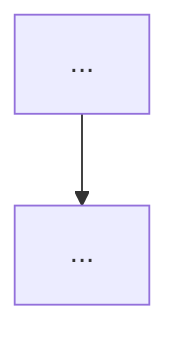

# [CODE] — [NAME]

> **Domain:** | **Level:** | **Thời lượng:** X giờ

---

## 1. LEARNING OBJECTIVE
- [ ]
- [ ]

## 2. BUSINESS CONTEXT
> Tại sao module này quan trọng trong bối cảnh doanh nghiệp hiện đại?

## 3. DEFINITIONS
> Mọi định nghĩa phải nhất quán xuyên suốt tài liệu. Ghi rõ nguồn gốc.

| Thuật ngữ | Định nghĩa | Nguồn |
|-----------|-----------|-------|

## 4. CORE CONCEPTS
> Kiến thức nền — không bỏ qua.

## 5. BUSINESS VALUE
> ROI, lợi ích đo được khi áp dụng.

## 6. ENTERPRISE ROLE
```
[ASCII: vị trí của module trong cấu trúc doanh nghiệp]
```

## 7. DEPARTMENTS RELATED
```
[ASCII: các phòng ban liên quan]
```

## 8. INPUT
| Input | Từ đâu | Format |
|-------|--------|--------|

## 9. OUTPUT
| Output | Đi đâu | Format |
|--------|--------|--------|

## 10. BUSINESS PROCESS
```
[ASCII BPMN-style hoặc flowchart]
```

## 11. DATA FLOW
```
[ASCII]
```

## 12. MONEY FLOW
```
[ASCII]
```

## 13. DOCUMENT FLOW
```
[ASCII: chứng từ đi qua các bước]
```

## 14. ROLES
| Role | Mô tả |
|------|-------|

## 15. RESPONSIBILITIES
...

## 16. RACI
| Activity | Responsible | Accountable | Consulted | Informed |
|----------|-------------|-------------|-----------|----------|

## 17. FRAMEWORK
> Mọi framework phải có ví dụ minh họa.

## 18. INTERNATIONAL STANDARDS
> ISO / TOGAF / BPMN / PMBOK / IFRS / COSO / v.v.

## 19. VIETNAM CONTEXT
> Đặc thù Việt Nam, sai lệch so với chuẩn quốc tế.

## 20. LEGAL CONSIDERATIONS
> Quy định pháp lý Việt Nam liên quan.

## 21. COMMON MISTAKES
> Lỗi doanh nghiệp Việt Nam thường gặp.

## 22. BEST PRACTICES
...

## 23. KPIs
| KPI | Công thức | Tốt | Cảnh báo | Nguy hiểm |
|-----|-----------|-----|----------|-----------|

## 24. METRICS
...

## 25. REPORTS
| Report | Tần suất | Người nhận | Nội dung chính |
|--------|----------|-----------|----------------|

## 26. TEMPLATES
> Link đến docs/23-templates/

## 27. CHECKLISTS
- [ ]

## 28. SOP
```
Bước 1 → Bước 2 → Bước 3 → ...
```

## 29. CASE STUDY
...

## 30. SMALL BUSINESS EXAMPLE
> Doanh nghiệp <50 nhân sự, doanh thu <10 tỷ VND.

## 31. ENTERPRISE EXAMPLE
> Doanh nghiệp >500 nhân sự hoặc niêm yết.

## 32. ERP MAPPING
| Chức năng | SAP Module | Odoo Module | Dynamics Module |
|-----------|-----------|-------------|-----------------|

## 33. AUTOMATION OPPORTUNITY
| Tác vụ | Công cụ | Mức độ khả thi |
|--------|---------|---------------|

## 34. AI OPPORTUNITY
| Use Case | Model/Tool | Giá trị |
|----------|-----------|---------|

## 35. IMPLEMENTATION GUIDE
> Hướng dẫn triển khai từng bước.

## 36. CONSULTING GUIDE
> Cách tư vấn, chẩn đoán, đề xuất cho khách hàng.

## 37. DIAGNOSTIC QUESTIONS
> Câu hỏi dùng để đánh giá thực trạng doanh nghiệp.

## 38. INTERVIEW QUESTIONS
...

## 39. EXERCISES
...

## 40. REFERENCES
- [ ] Sách
- [ ] Bài báo
- [ ] Chuẩn quốc tế
- [ ] Website

---

## MINDMAP
```
[ASCII Mindmap]
```

## CHEAT SHEET
...

## FLASHCARDS
| Q | A |
|---|---|

## FAQ
...

## GLOSSARY
| Thuật ngữ | Định nghĩa | Tiếng Anh | Nguồn |
|-----------|-----------|-----------|-------|

## AI PROMPT
```
[Prompt dùng để query AI về module này]
```

## JSON METADATA
```json
{
  "code": "",
  "name": "",
  "domain": "",
  "level": "",
  "prerequisites": [],
  "related_modules": [],
  "standards": [],
  "kpis": [],
  "tools": [],
  "status": "pending"
}
```

## MERMAID DIAGRAM

